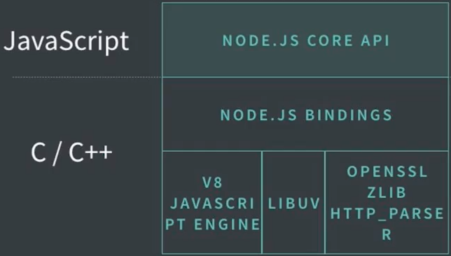
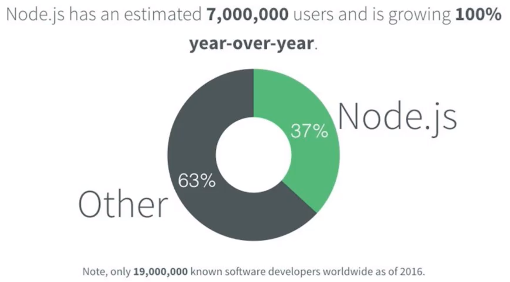
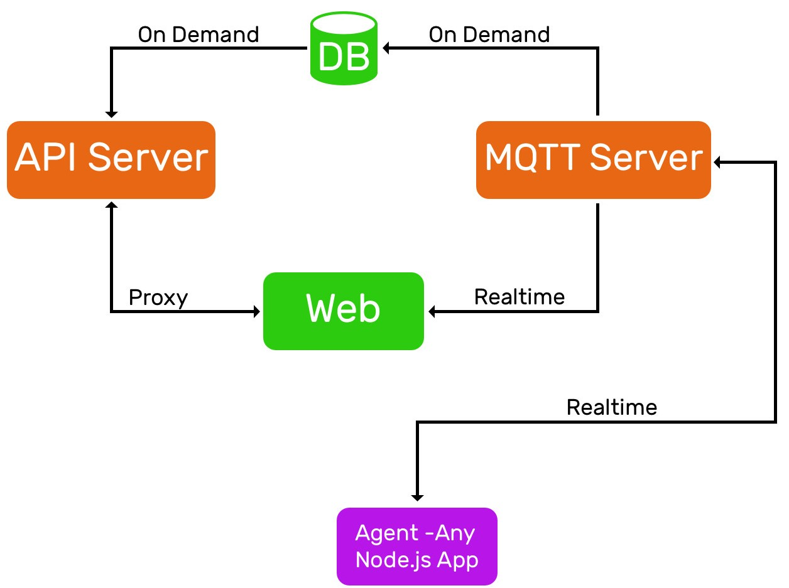

# Curso Avanzado de Node.js<!-- omit in toc -->

## Tabla de Contenido<!-- omit in toc -->
- [Introducción](#introducción)
- [Arquitectura de Node.js](#arquitectura-de-nodejs)
- [Características de la plataforma Node.js](#características-de-la-plataforma-nodejs)
- [Ventajas y desventajas](#ventajas-y-desventajas)
- [Aplicaciones que se Pueden Desarrollar](#aplicaciones-que-se-pueden-desarrollar)
- [Preparar el Entorno de Desarrollo](#preparar-el-entorno-de-desarrollo)
  - [Instalar Node](#instalar-node)
  - [Instalar NVM](#instalar-nvm)
  - [Instalar PostgreSQL](#instalar-postgresql)
  - [Instalar Redis](#instalar-redis)
  - [Instalar Visual Studio Code](#instalar-visual-studio-code)
  - [Instalar Ansible](#instalar-ansible)
  - [Instalar Vagrant](#instalar-vagrant)
- [Arquitectura de Platziverse](#arquitectura-de-platziverse)
- [Estructura de un Módulo de Node](#estructura-de-un-módulo-de-node)
- [Implementación de Modelos de BD](#implementación-de-modelos-de-bd)
  - [Relaciones entre Modelos de Datos](#relaciones-entre-modelos-de-datos)
- [Scripts de Inicialización de Base de Datos](#scripts-de-inicialización-de-base-de-datos)
- [Setup de la base de datos](#setup-de-la-base-de-datos)
- [Debug de la Aplicación](#debug-de-la-aplicación)
- [Advertencia sobre el borrado de base de datos](#advertencia-sobre-el-borrado-de-base-de-datos)
- [Colores en la Terminal](#colores-en-la-terminal)
- [Pruebas Unitarias](#pruebas-unitarias)
- [Valores por Defecto](#valores-por-defecto)
  - [Code Coverage](#code-coverage)
  - [Stubs](#stubs)
- [Enlaces de Interés](#enlaces-de-interés)

## Introducción

Node es una plataforma OpenSource para desarrollar aplicaciones, que está enfocada en tiempo real. Es similar a la máquina virtual de Java.

Node es muy útil para aplicaciones que tienen alta concurrencia. Utiliza JavaScript como lenguaje de programación y patrones de programación asíncronos y orientados a objetos.

¿Por qué decimos que Node.js es una plataforma simple?

1. Es una librería estándar es donde el código va a morir. Mantener una plataforma estándar actualizada puede ser un problema.
2. npm y la modularidad de Node abre un ecosistema de trabajo muy grande.
3. El modelo de trabajo Open Source beneficia mucho a la plataforma.

## Arquitectura de Node.js

<div align="center">
  
  <small><p>Arquitectura de Node.JS</p></small>
</div>

Node existe gracias a un componente principal que se llama V8, que es el que nos permite utilizar JavaScript del lado del servidor.

* `Node.js core API` Es el conjunto de librerías escritas en Javascript con las cuales interactuamos.
* `Node.js bindings` Permite comunicar la capa escrita en Javascript con las librerías de bajo nivel.
* `V8 Javascript engine` Máquina virtual de Javascript, es el componente principal de Node que nos permite ejecutar Javascript fuera del navegador.
* `Libuv`: Librería encargada de manejar el event loop en Node (Loop de ejecución de tareas asíncronas), también se encarga de las operaciones de red y operaciones de entrada y salida del sistema de archivos.
* `OpenSSL`: Para comunicación segura.
* `Zlib`: Encriptación.
* `Http_paser`: Para hacer el parseo de el protocolo http.

## Características de la plataforma Node.js

**Networking e I/O**

Un poco más de 1/4 del core de Node está dedicado a Networking e I/O. Teniendo en cuenta lo anterior Node es muy útil creando aplicaciones de entrada y salida (con alta concurrencia y cargas de trabajo muy altas, como leer archivos muy grandes) y aplicaciones que requieran transmitir información en la red.

Dentro del core de Node existen módulos que permiten que esta plataforma sea tan poderosa en la creación networking. Algunos de estos son:

* `HTTP` para usar servidores HTTP.
* `HTTPS` es el protocolo seguro de HTTP, usando TLS/SSL.
* `Net` proporciona una API de red asíncrona para la creación de TCP basada en secuencias o IPC.
* `Dgram` presenta una implementación de sockets UDP.
* `DNS` brinda funciones para resolver nombres, ya sea conectándose a un servidor DNS o con operaciones del sistema operativo subyacente.

**Modular**

El userland de Node es NPM (The Node Package Manager): el manejador de paquetes más grande del mundo. Además, es open source, lo que permite que el ecosistema de Node sea muy grande y crezca cada vez más.

Node sigue la filosofía de que “los módulos deben ser pequeños, que se concentren en hacer una cosa y que la hagan bien” (alta cohesión). De esta forma, las aplicaciones de Node son un sistema de módulos especializados que interactúan entre sí, esto a su vez hace que las aplicaciones no sean monolíticas (una aplicación monolítica se puede entender como una aplicación en la que los módulos son muy dependientes entre ellos, alto acoplamiento, lo cual es indeseable en desarrollo de software pues es aplicación muy dificil de mantener).

La modularidad resuelva el _dependency hell_ (infierno de dependencias) el cual se resultado de conflictos entre las versiones de las dependencias de un proyecto, que pueden entrar en conflicto con las de otra aplicación o proyecto, Node soluciona esto infierno de dependencias de manera local y por proyecto, debido a que su cargador de módulos puede cargar dos o más versiones de un mismo módulo sin que entren en conflicto, fuente.

**JavaScript en el servidor**

JavaScript es el lenguaje del navegador. Con Node JavaScript ha llegado al servidor. Esto hace que a un desarrollador frontend se le haga más fácil desarrollar de parte del servidor (backend) pues es el mismo lenguaje tanto para front como para back haciendo que sean altamente productivos.

**Asíncrono**

EcmaScript está trabajando constantemente en mejorar el lenguaje. Entre estas mejoras están: async await, clases, promesas nativas, entre otras. Estas nuevas características permiten que en Node se trabaje de una forma asíncrona y orientada a eventos, lo que hace que sea una plataforma ideal para aplicaciones en tiempo real.

La programación asíncrona en Node es posible por medio de callbacks, eventos y promesas. En Node las operaciones de entrada y salida no hacen que el event loop se bloquee. Esto debido a que, aunque solo tengamos un hilo disponible para el usuario, Node tiene 4 hilos por defecto, para ejecutar tareas sin bloquear el hilo de ejecución de la aplicación.

## Ventajas y desventajas

Para que es bueno
* Aplicaciones en Red.
* Aplicaciones de entrada y salida.
* Orquestación entre múltiples aplicaciones.

Para que no es bueno
* Bigdata.
* Procesamiento intensivo de CPU.
* Aplicaciones de Sistemas y para manejar componentes nativas.

## Aplicaciones que se Pueden Desarrollar

**Node.js** es el proyecto open source con el crecimiento más rápido del mundo en este momento. Muchas empresas están empezando no solo a utilizarlo sino a contribuir y patrocinar y tienen empleados dedicados a que aporten al proyecto y eso es lo que permite que tenga un crecimiento tan grande.

<div align="center">
  
  <small><p>Crecimiento de Node.js</p></small>
</div>

**¿Qué tipo de aplicaciones podemos desarrollar?**
* Aplicaciones de escritorio.
* Dispositivos embebidos.
* Servidores web.
* Aplicaciones móviles: hace poco anunciaron el soporte para Android.
* API Services / Serverless.
* Web UI.

## Preparar el Entorno de Desarrollo

### Instalar Node

El primer paso es ir a nodejs.org. Ahí vas a encontrar dos versiones, la actual y la LTS, que significa Long Term Support. Debemos elegir la actual porque es la que tiene todos los últimos features y se va a convertir en la LTS muy pronto.

Para verificar que Node.js quedó instalado vamos a la terminal y ejecutamos:

```bash
$ node -v
```

Con esto veremos la versión de Node que hemos descargado.

Otra forma de instalar, si trabajas con proyectos de Node que utilizan diferentes versiones, puedes utilizar **[nvm](https://github.com/creationix/nvm)**. Esta herramienta te permite cambiar entre versiones de Node fácilmente.

### Instalar NVM

Para los usuarios de Windows:

1. Descargar e instalar el instalador .exe que se encuentra en el archivo nvm-setup.zip del repositorio de coreybutler.
https://github.com/coreybutler/nvm-windows/releases
2. Si ya instalaron Node.js desde https://nodejs.org/en/, nvm detectará la versión ya instalada.
3. Para instalar node.js desde nvm, abrir la terminal de windows y escribir `nvm install 6` (la versión la eliges tú), y para empezar a usar esa versión de node en específico debes escribir `nvm use 6.0.0`.
4. Para usar la versión del sistema escribir `nvm use system`

### Instalar PostgreSQL

1. Descargar e instalar PostgreSQL. Hay 2 instaladores: De EnterpriseDB y de BigSQL. Yo usé BigSQL y me fue bien. Solo darle siguiente, siguiente y finalizar.
https://www.postgresql.org/download/windows/
2. Darle check a "pgAdmin3 LTS"
3. Asignarle como contraseña "root" a tu usuario
4. No olvides que tu usuario por defecto es "postgres"

### Instalar Redis

1. Descargar e instalar Redis. El instalador se encuentra en el repositorio de MicrosoftArchive. Solo dale "siguiente, siguiente y finalizar"
https://github.com/MicrosoftArchive/redis/releases
2. Abre la terminal de Windows (1) y escribe "redis-server"
3. Abre otra terminal de Windows (2) y escribe "redis-cli"
4. Luego, en la terminal (2) escribe "set name MiNombre" y luego "ping". Debes obtener una respuesta "pong"

### Instalar Visual Studio Code

1. Descargar VS Code y seleccionar Windows (32 bit o 64 bit a elección):
https://code.visualstudio.com/Download
2. Ejecutar el instalador, darle a "Siguiente, siguiente, finalizar", finalmente dejar en check la opción "Ejecutar Visual Studio Code".
3. Una vez tengas el editor abierto, presionar la combinación de teclas `CTRL + SHIFT + X`. Se abrirá panel de Extensiones. Allí escribir "**VS Code for Node.js - Development Pack**" y darle click a "Instalar".
4. Esperar que descargue la extensión y luego dar click en "Recargar"

### Instalar Ansible

Otra herramienta que vamos a utilizar es Ansible, que nos sirve para automatizar tareas de infraestructura. La vamos a utilizar para crear scripts de manera automatizada.

1. Instalar el bash de Ubuntu.
2. `sudo apt-get install software-properties-common`
3. `sudo apt-add-repository ppa:ansible/ansible`
4. `sudo apt-get update`
5. `sudp apt-get install ansible`

Por otro lado vamos a descargar Vagrant, que nos permite tener ambientes de desarrollo o servidores virtuales para hacer primero un deploy local antes de hacer despliegue en la nube.

### Instalar Vagrant

Vagrant nos permite tener ambientes de desarrollo o servidores virtuales para hacer primero un deploy local antes de hacer despliegue en la nube.

1. Descargar [Vagrant](https://www.vagrantup.com)
2. Instalarlo desde el instalador

## Arquitectura de Platziverse

<div align="center">
  
  <small><p>Arquitectura y Componentes de Platziverse.js</p></small>
</div>

**Platziverse** (Plataforma de IoT)

**Componentes**:
- **Platziversedb** (Modulo): Comunicación con la Base de Datos. Aquí almacenaremos los componentes y las métricas que van a estar almacenando la información de la aplicación. Cada vez que ingrese información en tiempo real se almacenara mediante este modulo. También enviara información (en demanda) cada vez que se consulte la API.
* **Agent** (Agente de monitoreo): Definimos las métricas que queremos monitorear y de manera real-time. A través de MQTT entregaremos la información por dos canales de comunicación web (para mostrarlas) DB para guardarlas.
* **Servidor** (API): cargaremos las primeras 20 métricas para dibujar en pantalla una gráfica y después actualizarla de manera real-time. La conexión con el servidor web se hará mediante proxy para autenticación y tokens de JSON (JWT).

## Estructura de un Módulo de Node

Vamos a crear el directorio del proyecto y vamos a utilizar un patrón de **mono repo**, donde tenemos un único repositorio de Git y varios proyectos adentro.

Un módulo de Node por lo general tiene un archivo que se llama **package.json**, que tiene la metadata del módulo. Este archivo se puede crear a mano o utilizando `npm init` que nos permite crearlo automáticamente.

Para empezar a implementar nuestro módulo creamos el archivo index.js y nos vamos a Visual Studio Code, donde podemos ver nuestros archivos y empezar a trabajar con ellos. Una buena práctica es crear el archivo **README.md** con instrucciones de instalación y cómo contribuir al proyecto. Recuerda que este es el archivo de documentación de tu proyecto.

Como otra buena práctica utilizaremos JavaScript en **modo estricto**, para empezar a definir la forma básica del módulo. La forma de escribir el objeto que utilizamos en el código es de ECMAScript 2016.

Para standarizar el código se va a usar una librería llamada **standard**. Para usarla, primero debe de instalarse.

```bash
npm i -D standard
```

Para usarla, se debe de agregar un script dentro del archivo package.json:

```
"scripts": {
  "lint": "standard"
}
```

Después de scribir el script, solo se debe de ejecutar el comando `npm run standard` para buscar los errores o `npm run standard -- --fix` para 
corregir los erroes de manera automática.

## Implementación de Modelos de BD

Para poder hacer el modelado de la base de datos e intetrarlo con la misma, se va a usar Sequelize.

**Sequelize** es un modelo de programación de mapeo de objeto-relacional basado en promesas, para Node.js.

```
npm i -S sequelize pg pg-hstore
```

Para iniciar una instancia en la base de datos, se va a usar el patrón Singleton.

**Singleton** es un objeto que solo tiene una instancia. Cada vez que llamemos a una función no va a crear múltiples instancias.

```js
// lib/db.js
const Sequilize = require('sequelize')
let sequelize = null

module.exports = function setupDatabase (config) {
  if (!sequelize) {
    sequelize = new Sequilize(config)
  }
  return sequelize
}
```

Luego, para hacer la implementación de un modelo de datos, se hace de la siguiente forma:

```js
const Sequelize = require('sequelize')
const setupDatabase = require('../lib/db')

module.exports = function setupMetricModel (config) {
  const sequelize = setupDatabase(config)

  return sequelize.define('metric', {
    type: {
      type: Sequelize.STRING,
      allowNull: false
    },
    value: {
      type: Sequelize.TEXT,
      allowNull: false
    }
  })
}
```

### Relaciones entre Modelos de Datos

Primero vamos a necesitar las funciones que definimos anteriormente. Para poner a interactuar los modelos entre si debemos hacer la configuración de la base de datos y los modelos.

```js
const setupDatabase = require('./lib/db')
const setupAgentModel = require('./models/agent')
const setupMetricModel = require('./models/metric')

module.exports = async function (config) {
  const sequelize = setupDatabase(config)
  const AgentModel = setupAgentModel(config)
  const MetricModel = setupMetricModel(config)

  AgentModel.hasMany(MetricModel)
  MetricModel.belongsTo(AgentModel)

  await sequelize.authenticate()

  //más código
}
```

## Scripts de Inicialización de Base de Datos

Primero vamos a crear un rol.

```
CREATE Role platzi with login password 'platzi';
```

Luego se va a crear la base de datos:

```
CREATE Database platziverse;
```

Finalmente se va a proceder a dar permisos al usuario 'platzi' sobre la base de datos 'platziverse'.

```
Grant all privileges on database platziverse to platzi;
```

## Setup de la base de datos

Para poder agregar el modelo definido en la base de datos, se va a crear un archivo **setup.js**.

```js
const debug = require('debug')('platziverse:db:setup')
const db = require('./')
const Sequelize = require('sequelize')

async function setup () {
  const config = {
    database: process.env.DB_NAME || 'platziverse',
    username: process.env.DB_USER || 'platzi',
    password: process.env.DB_PASS || 'platzi',
    host: process.env.DB_HOST || 'localhost',
    dialect: 'postgres',
    logging: s => debug(s),
    setup: true,
    operatorsAliases: Sequelize.Op
  }

  await db(config).catch(handlefatalError)

  console.log('Success')
  process.exit(0)
}

function handlefatalError (err) {
  console.error(err.message)
  console.error(err.stack)
  process.exit(1)
}

setup()

```

## Debug de la Aplicación

Para hacer un debug a la aplicación, se va a instalar primero la dependencia.

```bash
$ npm i debug
```

Para usar debug, se debe de requerir primero. 

```js
const debug = require('debug')('platziverse:db:setup')
```

Para correr el script de setup de la base de datos con el debug correspondiente, se debe de crear un script en el package.json:

```js
"scripts": {
  "setup": "SET DEBUG=platziverse:* && node setup.js"
}
```

## Advertencia sobre el borrado de base de datos

Cada vez que se ejecuta el script de la base de datos, esta se va a borrar. Por eso, es recomendable mostrar una advertencia al usuario cada vez que esto suceda.

Para mostrar la advertencia, se va a usar **inquirer**.

```bash
$ npm i inquirer
```

Para mostrar un mensaje en la consola, se hace de la siguiente forma:

```js
const inquirer = require('inquirer')

const prompt = inquirer.createPromptModule()

async function setup () {
  const answer = await prompt([
    {
      type: 'confirm',
      name: 'setup',
      message: 'This will destroy your database, are you sure?'
    }
  ])

  if(!answer.setup) {
    return console.log('Nothing happened')
  }

  //más código
}
```

## Colores en la Terminal

Para mostrar un mensaje en la terminal en un color específico, se puede hacer con **chalk**.

```bash
$ npm i chalk
```

Para usarlo, se hace de la siguiente forma:

```js
const chalk = require('chalk')

function handlefatalError (err) {
  console.error(`${chalk.red('[fatal error]')} ${err.message}`)
}
```

## Pruebas Unitarias

Se va a usar ava.js para la implementación de pruebas unitarias.

```bash
npm i -D ava
```

Para usar ava, se va a hacer un script de pruebas unitarias:

```js
const test = require('ava')

test('make it pass', t => {
  t.pass()
})
```

Para poder ejecutar el test, se tiene que agregar un script en el package.json

```js
"scripts": {
  "test": "ava tests/ --verbose"
}
```

## Valores por Defecto

Una forma de setear valores por defecto es usando la librería defaults.

```bash
npm i defaults
```

```js
const defaults = require('defaults')

function prueba (config) {
  config = defaults(config, {
    dialect: 'sqlite',
    query: {
      raw: true
    }
  })
}
```

Lo que va a hacer defaults es hacer un merge con el parámetro que se recibe y los valores por defecto. 

### Code Coverage

**Test coverage** es una técnica que permite ver si los tests que hemos creado están cubriendo el código de nuestra aplicación, y si están siendo considerados en las pruebas. El resultado será un porcentaje, que nos va a decir cuánto del código está siendo abarcado.

Lo ideal es mantener el código al 100%.

Para implementar code coverage, vamos a usar **nyc**.

```node
npm i -D nyc
```

Para usarlo, solo se debe de agregar el script en el package.json:

```js
"scripts": {
  "test": "nyc ava tests/ --verbose"
}
```

Si se desea que el reporte salga en un html aparte, agregar el siguiente script:

```js
"scripts": {
  "test": "nyc --reporter=lcov ava tests/ --verbose"
}
```

El html se va a crear en la carpeta **coverage**.

### Stubs

Los **stubs** son un objeto que es similar en su funcionalidad al objeto original (nuestro modelo), pero que la respuesta y los argumentos de entrada están previamente especificados con una librería o estrategia. Objetos falsos que se van a comportar de manera similar a los objetos reales.

Para usar stubs se va a usar la librería **sinon**.

```bash
$ npm i -D sinon
```

$ npm i -D proxyquire

## Enlaces de Interés
* [Curso Avanzado de Node.js](https://platzi.com/clases/nodejs/)
* [Github: Platziverse](https://github.com/platzi/platziverse)
* [Node.js](https://nodejs.org/en/)
* [NVM](https://github.com/creationix/nvm)
* [NVM Windows](https://github.com/coreybutler/nvm-windows)