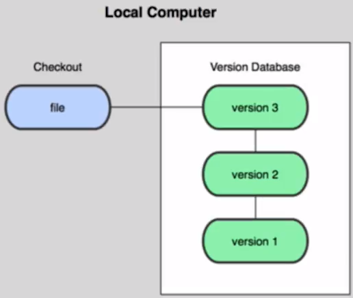
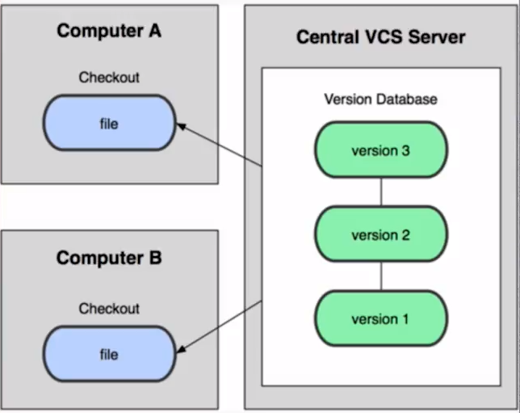
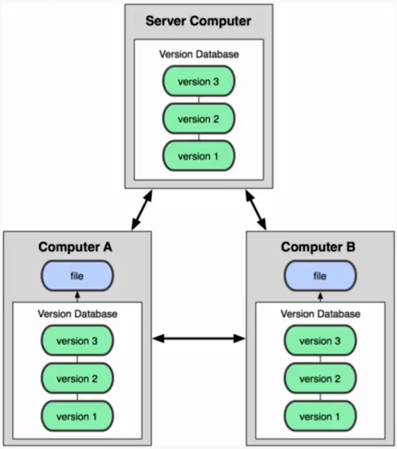
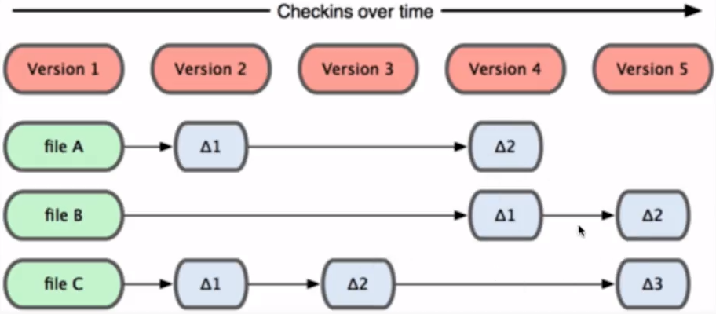

# Curso Profesional de Git y GitHub<!-- omit in toc -->

## Tabla de Contenido<!-- omit in toc -->
- [Sistema de control de versiones](#sistema-de-control-de-versiones)
  - [Tipos de sistemas de control](#tipos-de-sistemas-de-control)
- [Beneficios de Git](#beneficios-de-git)
- [Fundamentos de Git](#fundamentos-de-git)
- [Los 3 estados de Git](#los-3-estados-de-git)
- [Github](#github)
- [Configurar Git](#configurar-git)
- [Comandos de terminal](#comandos-de-terminal)
- [Comandos Git](#comandos-git)
  - [Flujos de Trabajo](#flujos-de-trabajo)
  - [Múltiples entornos de trabajo](#múltiples-entornos-de-trabajo)
- [Repositorios Remotos (Github)](#repositorios-remotos-github)
- [Configuraciones de Github](#configuraciones-de-github)
  - [Notificaciones](#notificaciones)
  - [Proteger un branch](#proteger-un-branch)
  - [Plantillas](#plantillas)
- [Ignorar archivos](#ignorar-archivos)
- [Recursos Complementarios](#recursos-complementarios)
- [Enlaces de Interés](#enlaces-de-interés)

## Sistema de control de versiones

Un sistema que registra los cambios realizados sobre un archivo o conjunto de archivos a lo largo del tiempo. Este tipo de sistemas nos permiten volver en el tiempo y salvar nuestro trabajo.

<div align="right">
  <small><a href="#tabla-de-contenido">🡡 volver al inicio</a></small>
</div>

### Tipos de sistemas de control

`Local Computer` Solo vive en nuestro computador.

<div align="center">
  
  <small><p>Sistema de Control Local</p></small>
</div>

`Centralizado` No depende únicamente de un computador en el que se trabaja, sino que depende del súper servidor en donde se almacena la información. El servidor provee las copias a sus hijos, pero solo guarda los cambios en un solo lugar.

<div align="center">
  
  <small><p>Sistema de Control Centralizado</p></small>
</div>

`Sistema de control distribuidos` Cada uno de los que participan en el proyecto, tienen copia del proyecto que se realiza, por eso no dependemos de un solo computador que almacene toda la información.

<div align="center">
  
  <small><p>Sistema de Control Distribuido</p></small>
</div>

Git es un Sistema de Control de Versiones Distribuido.

Git fue creado por Linus Torvals

<div align="right">
  <small><a href="#tabla-de-contenido">🡡 volver al inicio</a></small>
</div>

## Beneficios de Git

* `Velocidad` Puedes trabajar fluidamente desde tu computador.
* `Diseño sencillo` El codigo es robusto con las herramientas necesarias, como viajar en el tiempo.
* `Fuerte apoyo en el desarrollo no lineal` No trabaja de manera lineal, la linea del tiempo tiene bifurcaciones de manera independiente al proyecto principal.
* `Completamente distribuido` Cada quien puede tener una copia del proyecto.
* `Capaz de manejar grandes proyectos` Linux, Django, Laravel, etc. Usan git.

<div align="right">
  <small><a href="#tabla-de-contenido">🡡 volver al inicio</a></small>
</div>

## Fundamentos de Git

* Git almacena una referencia a todos los archivos que no se han cambiado
* Casi cualquier operación en Git es local. Se puede trabajar offline
* Git tiene integridad. No puedes perder información durante su transmisión o sufrir corrupción de archivos sin que Git lo detecte

<div align="center">
  
  <small><p>Almacenamiento de Archivos en GIT</p></small>
</div>

<div align="center">
  
  <small><p>Almacenamiento de Archivos en Subversion</p></small>
</div>

<div align="right">
  <small><a href="#tabla-de-contenido">🡡 volver al inicio</a></small>
</div>

## Los 3 estados de Git

* `Working Directory` Es donde trabajamos de manera local, pero para guardarlo hay que pasarlo al Staging Area
* `Staging Area` Es el área de preparación, se almacenan justo antes de hacer commit
* `Git repository` El repositorio donde almacenaremos los cambios del proyecto

<div align="center">
  
  <small><p>Estados de Git</p></small>
</div>

<div align="right">
  <small><a href="#tabla-de-contenido">🡡 volver al inicio</a></small>
</div>

## Github

`GitHub` es una plataforma en la que se almacenan los cambios de un proyecto. Además es una plataforma que funciona como una red social. Aquí, las personas que visiten tu sitio puedan darle estrellitas a los proyectos que hayas desarrollado.

`Git` es el software que ayuda con el versionado y Github es la red social que nos va a ayudar a distribuir el software.

<div align="right">
  <small><a href="#tabla-de-contenido">🡡 volver al inicio</a></small>
</div>

## Configurar Git

Configuración del usuario

```bash
git config --global user.email user@example.com
git config --global user.name "Sergio Minei"
```

Colorear el output del terminal de Git.

```bash
git config --global color.ui true
```

Configurar el editor de texto de git

```bash
git config --global core.editor ["editor --wait"]
```

Ver la lista de configuraciones

```bash
git config --list
```

<div align="right">
  <small><a href="#tabla-de-contenido">🡡 volver al inicio</a></small>
</div>

## Comandos de terminal

* `cd [carpeta]` moverse entre carpeta.
* `mkdir [nombre]` crear una carpeta.
* `ls` lista todos los directorios.
  * `-a` muestra los archivos ocultos.
* `clear` limpia la vetnana.
* `touch [archivo]` crear un archivo.
* `rm [ruta]` borra un archivo.
* `rm -rf [carpeta]` borra una carpeta.
* `vim [nombre]` editar un archivo de texto.
* `:wq` guaradar y salirdel archivo de texto.

<div align="right">
  <small><a href="#tabla-de-contenido">🡡 volver al inicio</a></small>
</div>

## Comandos Git

### Flujos de Trabajo

* `git init [nombre]` inicia un repositorio y crea la carpeta [nombre].
* `git status` muestra el estado de los archivos en el repositorio.
  * `untracked files` son archivos que están en nuestro Working Directory, lo que aparezca en rojo es lo que se ha modificado y hay que pasarlo al Staging.
  * `changes to be comitted` son los archivos que se encuentran en el staging area. Aparecen en verde.
* `git add [archivo]` agrega un archivo al staging
* `git add -A` agrega todos los archivos del working directory al staging area. `git add .` hace lo mismo.
 * `git add -n [archivo]` simula el agregado de un [archivo].
* `git rm --cached [archivo]` quita un [archivo] del staging al working area.
* `git rm -f` quita el archivo del staging y del working directory.
* `git commit -m ["mensaje"]` agrega los archivos del staging al repositorio.
* `git commit --amend` anexa el nuevo cambio al anterior commit. Si se escribe un mensaje este sobreescribe el anterior.
* `git tag -a [tag] -m ["comentario"]` agrega el tag con un comentario al ultimo commit.
* `git tag -l` lista los tags.
* `git tag [tag] [sha1 del commit]` agrega un tag a un commit en partcular.
* `git tag -d [tag]` elimina el tag.
* `git tag -f -a [nuevo tag] [sha1 del commit]` renombra el tag del commit pero deja el anterior tag.
* `git log` ver la lista de commits.
  * `--oneline` resumido.
  * `--graph` ver las ramificaciones.
  * `-[numero]` ver los ultimos [numero] commits.
* `git diff [sha1 del commit]` muestra la diferencias del commit [sha1].
* `git diff [sha1-1] [sha1-2]` diferencia entre la version 1 vs la version 2.
* `git reset`
  * `--soft [sha1]` borrar todos los commits posteriores a [sha1]. Los archivos que salen del repositorio son pasados al staging area.
  * `--mixed [sha1]` borrar todos los commits posteriores a [sha1]. Los archivos que salen del repositorio son pasados al working directory
  * `--hard [sha1]` elimina todos los cambios incluso del working directory.

Si se desea eliminar el repositorio, solo hay que eliminar la carpeta oculta .git

<div align="right">
  <small><a href="#tabla-de-contenido">🡡 volver al inicio</a></small>
</div>

### Múltiples entornos de trabajo

* `git branch [nombre]` crear la rama [nombre]
* `git branch -l` lista las ramas
* `git branch -d [nombre]` elimina el branch [nombre]. Esto solo funciona si el branch no tiene ningún commit.
* `git branch -D [nombre]` fuerza la eliminación de un branch sin importar si tiene commits
* `git branch -m [nombre inicial] [nuevo nombre] ` renombra el branch [nombre inicial] por [nuevo nombre]
* `git checkout [brach]` moverse al branch [branch]
* `git chechout [sha1]` ir al momento del tiempo de ese commit
* `git checkout -b [nombre]` crea un branch y se mueva al mismo
* `git checkout -- [archivo]` descarta todos los cambios del archivo
* `git merge [branch]` mezcla el branch [branch] con el branch actual
* `git rebase [branch]` mezcla el branch con el brach actual. Es como el merge pero sin crear bifurcaciones
* `git stash` es un limbo como el staging area. Te permite cambiar de branch sin hacer commit
* `git stash list` ver la lista de los stash
* `git stash drop stash@{numero}` elimina el stash
* `git stash apply stash@{numero}` aplica el stash
* `git cherry pick [sha1]` mover el commit [sha1] de otro branch al branch actual

<div align="right">
  <small><a href="#tabla-de-contenido">🡡 volver al inicio</a></small>
</div>

## Repositorios Remotos (Github)

* `git clone [ruta]` trae el repositorio a la computadora
* `fork` hace una copia de un repositorio externo a nuestra cuenta
* `ssh-keygen -t rsa -b 4096 -C "correo@ejemploc.com"` crea una llave ssh. El correo debe de ser el mismo que se encuentra en Github
* `git remote add [nombre] [ruta]` conecta un repositorio remoto con uno local. Por defecto el nombre es origin
* `git remote -v` lista las conexiones remota
* `git remote remove [nombre]` remueve una conexión remota
* `git fetch [nombre] [branch]` traer . Solo los trae pero no lo mezcla
* `git merge [origin/master] --allow-unrelated-histories` hace un merge del fetch con el repositorio local
* `git pull [origin] [branch]` hace un fetch mas merge
* `git push [origin] [master]` envia al repositorio local al remoto
  * `--tags` enviar los tags
* `git push --all origin` push a todos los branch y tags

<div align="right">
  <small><a href="#tabla-de-contenido">🡡 volver al inicio</a></small>
</div>

## Configuraciones de Github

### Notificaciones

Para recibir notificaciones cuando un repositorio cambia, se puede hacer click al botón `watch`.

<div align="right">
  <small><a href="#tabla-de-contenido">🡡 volver al inicio</a></small>
</div>

### Proteger un branch

Agregar protección al master de tal manera que sea necesario hacer in pull request para hacer un cambio.
```
Settings
-Branches
--Branch protection rules
---Choose branch
----master (puede ser otro branch)
-----Protect this branch
------Require pull request reviews before merging
```

<div align="right">
  <small><a href="#tabla-de-contenido">🡡 volver al inicio</a></small>
</div>

### Plantillas

Es una buena práctica generar archivos de plantilla para que los usuarios o desarrolladores puedan notificar un issue o pullrequest.

* `issue_template.md` template para un issue
* `pull_request_template.md` template para el pull request

<div align="right">
  <small><a href="#tabla-de-contenido">🡡 volver al inicio</a></small>
</div>

### Ignorar archivos

Para ignorar archivos o carpetas de los commits se crea un archivo que se llame `.gitignore`.

Página que crear .gitignore para los proyectos:
https://www.gitignore.io/

<div align="right">
  <small><a href="#tabla-de-contenido">🡡 volver al inicio</a></small>
</div>

### Issues y Milestones

Issues:
Es una categoría en la que podemos reportar fallas, o mejoras a un repo determinado, al mismo le podemos asignar etiquetas, personas que lo pueden observar, entre otras cosas, que emulan la interactividad de las redes sociales (bueno github es una red social)
Milestones:
Cuando un proyecto es demasiado complejo y hay demasiadas cosas que reportar, problemas que resolver, es allí dónde entra en juego los Milestones que no es más que una manera de agrupar issues o pull request, que tienen una o muchas características en común; siendo la analogía que más se corresponde a su caso la manera en que se organizan los libros en una biblioteca, la organización por cotas ( de hecho milestones quiere decir cotas, al traducirlo al español), en la que podemos encontrar libros de una temática en particular, gracias a una nomenclatura especifica, que hace que la búsqueda bibliográfica sea más optima, debido a la gran cantidad de libros que existe en una biblioteca.

<div align="right">
  <small><a href="#tabla-de-contenido">🡡 volver al inicio</a></small>
</div>

### Hosting Gratuito de archivos en GitHub

GitHub nos permite publicar nuestros proyectos a tráves de GitHub Pages.
Los GitHubs pages almacenan código estático.

Para hacer esto es necesario:
  -Ir a setting
  -Elegir GitHub Pages
  -Escribir a rama que sera el GitHub Page.

### Dominios personalizados en GitHub

Github permite personalizar la URL de nuestros proyectos desde Github Pages, para ello hay que comprar un dominio por ejemplo en namecheap namecheap.com.

Name cheap= nombre barato
Namecheap es una buena opción, tiene buen soporte.

Iniciamos el proceso buscando la disponibilidad del dominio:
En caso de gustar de alguno, simplemente se sigue un proceso de compra, creando previamente una cuenta disponer de la tarjeta de crédito (es un proceso normal como cualquier otro de compra por internet).

Vamos al dashboard (tablero), donde entre otras cosas se puede ver una lista de los dominios que poseemos.
Le damos clic a manage al que queremos administrar o configurar.
Aquí lo que necesitamos es enlazar nuestro poryecto con Github a través de la opción de configuración de los DNS (Advanced DNS).

No vamos a nuestro repositorio en Github y en la opción de setting:
Bajamos hasta Github Pages
Y cambiamos el nombre de la URL colocándole un Domain Custom, el cual es el que acabamos de crear en namecheap, lo especificamos y salvamos.
Nos avisa que no se puede hacer un CNAME porque la rama está protegida.
Para ello debemos crear un archivo que se llama CNAME y ubicarlo en master en la rama que queremos como nuestro github pages.

Ingresamos en nuestro repositorio en este caso invie-github y vamos a crear un pull request (solicitud), clic en invie-github
Clic en créate new file
Y le damos un nombre y editamos su contenido especificándole el nombre de nuestro dominio de namecheap.
Clic en commit new file.
Lo que da paso a dar los detalles de nuestro Pull Request.
En este caso le escribimos “Pesonalizando el dominio” y clic en Create Pull Request.
Le agregamos colaboradores para que lo revisen y lo mezclen
Nos vamos a revisar el pull request.
Le añadimos un review y lo aprobamos clic en Approve y luego en submit review.
Luego clic en Mege pull request para mezclarlo.
Confirmamos la mezcla (clic en confirm merge).
Y listo al ver el estatus Merged, hemos terminado

Regresamos a setting y efectivamente nuestro proyecto tiene la nueva URL (ya que enlazamos a github con namecheap).

Ahora regresamos a nuestro dominio en namecheap y quitamos los registros CNAME Record, porque ya no se quiere que enlace a la página de namecheap:
Vamos a modificar URL Redirect Record, le colocamos que sea un A Record, es decir se van a crear dos A Record con las dos ip de Github, Clic en el chulito o icono de tilde y queda confirmado el cambio.
Colocamos la ip 192.30.252.153.

Procedemos a crear el 2do A Record con la otra (la segunda) ip de Github:
Colocamos la ip 192.30.252.154 y en la columna TTL le cambiamos a automático para los dos A Record.
Le agregamos el CNAME Record (que corresponde al CNAME creado en Github).

En este caso el target (destino) es leonidasesteban.github.io. (Debe llevar un punto al final porque a partir de allí se derivan el resto de proyectos).
Confirmamos los cambios dando clic en el chulito o tilde (save changes) ylisto tenemos nuestro dominio personalizado conectando github con namecheap, sin embargo el cambio no se reflejará de inmediato ya que lleva un tiempo que namecheap verifique y confirme los cambios (una hora, un días, normalmente dicen que toma dos días), no es automático ya que se tiene que enlazar nuestro dominio en namecheap con nuestro host que es Github, sin embargo probando ahora mismo, la página de invie-github cargo.

(Resumen de alvaradoe556)

<div align="right">
  <small><a href="#tabla-de-contenido">🡡 volver al inicio</a></small>
</div>

### GitHub Desktop, todo lo que necesitas de Git en una sola herramienta gráfica

Interfaz de escritorio en desktop.github.com para que puedas trabajar gráficamente desde tu PC. Desarrollada en Electron. Lo primero que debes hacer es iniciar sesión, luego clonar el proyecto.

-Puedes ver todo el historial de tu proyecto de una manera muy amigable.
-Quien hace los cambios, quien los aprueba.
-También puedes navegar en todos tus repositorios.
-Puedes hacer cambios.


## Recursos Complementarios
* [Diapositivas del Curso](docs/GIT-intro.pdf)

<div align="right">
  <small><a href="#tabla-de-contenido">🡡 volver al inicio</a></small>
</div>

## Enlaces de Interés
* [Curso Profesional de Git y GitHub](https://platzi.com/clases/git-github/)
* [Git Book](https://git-scm.com/book/es/v2)
* [Git Ignore](https://www.gitignore.io/)
* [Github](https://github.com/)

<div align="right">
  <small><a href="#tabla-de-contenido">🡡 volver al inicio</a></small>
</div>
