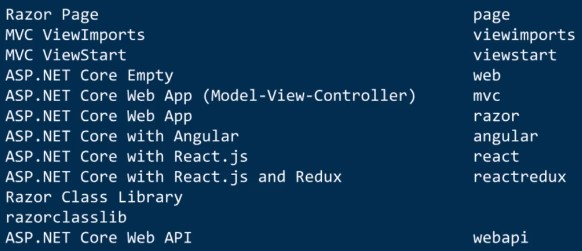

# Curso de ASP.Net Core<!-- omit in toc -->

## Tabla de Contenido<!-- omit in toc -->
- [La importancia del middleware en el entorno web](#la-importancia-del-middleware-en-el-entorno-web)
- [Habilitar certificados](#habilitar-certificados)
- [Plantillas preintaladas](#plantillas-preintaladas)
- [Crear una aplicación](#crear-una-aplicación)
- [Patrón MVC](#patrón-mvc)
- [Recursos Complementarios](#recursos-complementarios)
- [Enlaces de Interés](#enlaces-de-interés)

## La importancia del middleware en el entorno web

El midlware se define como una lógica de intercambio de información entre aplicaciones. Es un software que asiste a una aplicación para interactuar o comunicarse con otras aplicaciones, o paquetes de programas, redes, hardware y/o sistemas operativos.

## Habilitar certificados

Una aplicación se puede lanzar por http o https. 

Para poder lanzarla en https se va a necesitar un certificado para que el middleware peuda confiar en nosotros.

Para instalar un certificado usar el siguiente comando en consola: `dotnet dev-certs https --trust`

## Plantillas preintaladas

Net Core viene con una lista de plantillas preinstaladas que se pueden usar.

<div align="center">
  
  <small><p>Lista de Plantillas Preinstaladas</p></small>
</div>

## Crear una aplicación

Para crear una aplicación con Net Core se puede hacer con el siguiente comando de consola.

```bash
dotnet new [plantilla] -o [Carpeta]
```

## Patrón MVC

MVC = Modelo Vista Controlador

**El modelo es el responsable de**:
* Acceder a la capa de almacenamiento de datos. Lo ideal es que el modelo sea independiente del sistema de almacenamiento.
* Define las reglas de negocio (la funcionalidad del sistema). Un ejemplo de regla puede ser: "Si la mercancía pedida no está en el almacén, consultar el tiempo de entrega estándar del proveedor".
* Lleva un registro de las vistas y controladores del sistema.
* Si estamos ante un modelo activo, notificará a las vistas los cambios que en los datos pueda producir un agente externo (por ejemplo, un fichero por lotes que actualiza los datos, un temporizador que desencadena una inserción, etc.).

**Las vistas son responsables de**:
* Recibir datos del modelo y los muestra al usuario.
* Tienen un registro de su controlador asociado (normalmente porque además lo instancia).
* Pueden dar el servicio de "Actualización()", para que sea invocado por el controlador o por el modelo (cuando es un modelo activo que informa de los cambios en los datos producidos por otros agentes).

**El controlador es responsable de**:
* Recibe los eventos de entrada (un clic, un cambio en un campo de texto, etc.).
* Contiene reglas de gestión de eventos, del tipo "SI Evento Z, entonces Acción W". Estas acciones pueden suponer peticiones al modelo o a las vistas. Una de estas peticiones a las vistas puede ser una llamada al método "Actualizar()". Una petición al modelo puede ser "Obtener_tiempo_de_entrega ( nueva_orden_de_venta )".

## Recursos Complementarios
* [Diapositivas del Curso](docs/asp-net.pdf)

<div align="right">
  <small><a href="#tabla-de-contenido">🡡 volver al inicio</a></small>
</div>

## Enlaces de Interés
* [Curso de ASP.Net Core](https://platzi.com/clases/aspnet-core/)
  
<div align="right">
  <small><a href="#tabla-de-contenido">🡡 volver al inicio</a></small>
</div>