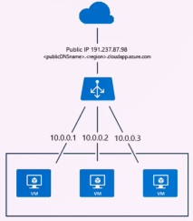

# Curso de Azure IaaS<!-- omit in toc -->

## Tabla de Contenido<!-- omit in toc -->
- [Características del portal de Azure](#características-del-portal-de-azure)
- [Cálculo y monitoreo de costos en Azure](#cálculo-y-monitoreo-de-costos-en-azure)
- [IaaS](#iaas)
  - [Escenarios en los que podemos movernos con IaaS:](#escenarios-en-los-que-podemos-movernos-con-iaas)
  - [Ventajas de IaaS:](#ventajas-de-iaas)
- [Maquinas Virtuales](#maquinas-virtuales)
  - [Configuración básica para crear una Máquina Virtual](#configuración-básica-para-crear-una-máquina-virtual)
- [Instalar un Servidor IIS (Windows)](#instalar-un-servidor-iis-windows)
  - [Habilitar el acceso a IIS de forma remota](#habilitar-el-acceso-a-iis-de-forma-remota)
- [Instalar un Servidor Apache (Linux)](#instalar-un-servidor-apache-linux)
  - [Habilitar el acceso a Apache de forma remota](#habilitar-el-acceso-a-apache-de-forma-remota)
- [Redes Virtuales](#redes-virtuales)
  - [Crear una Red Virtual](#crear-una-red-virtual)
- [Balanceo de Cargas](#balanceo-de-cargas)
  - [Crear un Balanceador de Cargas](#crear-un-balanceador-de-cargas)
  - [Funcionamiento del Balanceador de Cargas](#funcionamiento-del-balanceador-de-cargas)
- [Resource Manager](#resource-manager)
- [Administrar Máquinas Virtuales](#administrar-máquinas-virtuales)
- [Linea de Comandos de Azure](#linea-de-comandos-de-azure)
  - [Instalación](#instalación)
  - [Ingresar a Azure](#ingresar-a-azure)
  - [Comandos](#comandos)
- [Virtualización](#virtualización)
- [Tienda de Aplicaciones para Máquinas Virtuales](#tienda-de-aplicaciones-para-máquinas-virtuales)
- [Enlaces de Interés](#enlaces-de-interés)

## Características del portal de Azure

Cosas que debes saber de la configuración de la interfaz de Azure:

* La configuración del dashbord de la interfaz de Azure es muy importante antes de comenzar, ya que podemos tener anclado todo lo necesario para nuestro proyecto.
* Puedes configurar cosas como: El idioma, el color de la interfaz para tu comodidad visual y las opciones de notificaciones.
* El portal va a cumulando las columnas a la derecha, lo que significa que no van desapareciendo, únicamente se van recorriendo.
* Azure tiene una terminal de comandos integrada por defecto, no es necesario utilizar ninguna terminal extra.
* Los grupos de recursos de Azure permiten segmentar los recursos según los diferentes clientes que podamos tener.

<div align="right">
  <small><a href="#tabla-de-contenido">🡡 volver al inicio</a></small>
</div>

## Cálculo y monitoreo de costos en Azure

Como desarrolladores, es difícil tener en el panorama temas de costos, generalmente esta parte la dejamos en manos del equipo administrativo, pero es muy importante que se cuide el balanceo entre el negocio y lo que estamos creando.

Para poder ver el consumo en costos, se puede ir a la pestaña **Cost Management + Billing**.

Azure también ofrece una [calculadora de costos](https://azure.microsoft.com/en-us/pricing/calculator/) con la cual puedes estimar el costo promedio de Azure.

<div align="right">
  <small><a href="#tabla-de-contenido">🡡 volver al inicio</a></small>
</div>

## IaaS

* IaaS es la puerta de entrada para cualquier plataforma en la nube, es decir, si ya tenemos un centro de datos y queremos brincar a una plataforma en la nube, la mejor opción es a través de IaaS.
* Podríamos definir IaaS también como una administración de nuestros servidores.
* Se tiene control absoluto del Sistema Operativo.
* Si queremos dedicarnos específicamente a una sola solución es demasiado robusto.
* Con IaaS se puede hacer respaldos de las máquinas virtuales, así como también regresar a los cambios anteriores si es que cometemos algún error en las configuraciones.

<div align="right">
  <small><a href="#tabla-de-contenido">🡡 volver al inicio</a></small>
</div>

### Escenarios en los que podemos movernos con IaaS:

1. Desarrollo y pruebas. Es una buena forma de no tocar el hardware de nuestros equipos para poder probar o romper cosas.
2. Almacenamiento, copias de seguridad y recuperación. Una máquina virtual va a ser tan grande como nuestro presupuesto quiera
3. Informática de alto rendimiento.
4. Análisis de macrodatos. Este escenario nos sirve para temas como Machine Learning y Minería de Datos o Big Data.
5. Hospedaje.

<div align="right">
  <small><a href="#tabla-de-contenido">🡡 volver al inicio</a></small>
</div>

### Ventajas de IaaS:

1. Continuidad de un modelo bajo premisa.
2. Elimina los gastos corrientes.
3. Elimina la estabilidad y compatibilidad.
4. Facilidad de personalización.
5. Te permite enfocarte en una actividad principal.

<div align="right">
  <small><a href="#tabla-de-contenido">🡡 volver al inicio</a></small>
</div>

## Maquinas Virtuales

Cosas importantes que debemos saber de las Máquinas Virtuales en Azure:

* Podemos olvidarnos de detalles de sobrecarga de hardware para poder concentrarnos en el proyecto que estemos trabajando.
* Podemos olvidarnos del ancho de banda que depende de nuestro proveedor de internet.
* Azure notifica cualquier tipo de situación que pueda afectar a los servidores con los que estemos trabajando o si requieren mantenimiento, con un par de semanas o incluso un mes de anticipación.
* Los especialistas en infraestructura ya no tienen que estar pendientes de nada que tenga qué ver con hardware, lo único que se tiene que tomar en cuenta es la memoria RAM, ya que de ésta, tendremos nosotros el control total.
* Debemos calcular muy bien el tamaño de las Máquinas Virtuales.
* Las Máquinas Virtuales no solamente tienen Sistemas Operativos basados en tecnologías de Microsoft, sino también en tecnologías de distribuciones GNU** (Linux).**

<div align="right">
  <small><a href="#tabla-de-contenido">🡡 volver al inicio</a></small>
</div>

**Importante**:

Aprender a manejar las Máquinas Virtuales de la manera más adecuada nos permite dos cosas:
1. Un buen desempeño del escenario que estemos calculando.
2. Invertir en Azure únicamente lo que necesitamos invertir.

<div align="right">
  <small><a href="#tabla-de-contenido">🡡 volver al inicio</a></small>
</div>

**Pasos para crear una Máquina Virtual**:

1. Seleccionar la imagen.
2. Establecer los parámetros de configuración.
3. Comenzar a utilizar.

<div align="right">
  <small><a href="#tabla-de-contenido">🡡 volver al inicio</a></small>
</div>

### Configuración básica para crear una Máquina Virtual

¿Qué debemos considerar para poder crear una **Máquina Virtual**?

* Elegir el Sistema Operativo según la distribución que necesitemos.
* Nombre de la variable con la que vamos a identificar a la Máquina Virtual.
* Elegir el tipo de disco duro. Este paso es muy importante. Puede ser un disco duro de estado sólido o uno mecánico, donde el de estado sólido va a funcionar mejor, pero va a generar un mayor costo.
* Si se requiere conectarse por medio de escritorio remoto o SDCH, es necesario crear un usuario y contraseña.
* Tener un grupo de recursos donde podamos englobar todo lo necesario para nuestras Máquinas Virtuales.
* Configurar la ubicación ya que es importante para la velocidad de acceso de las Máquinas Virtuales desde donde estemos trabajando.
* Tener una licencia en el caso de ser requerido.
* El tamaño de la Máquina Virtual es determinante para nuestras soluciones. Azure muestra la relación entre precio y tamaño para que podamos hacer nuestros cálculos.
* Considerar configuraciones como: Discos administrados, configuración de red, extensiones, alta disponibilidad y monitoreo.
* Azure tiene un paso adicional al final que nos va a permitir validar todo lo que hayamos hecho para configurar nuestra Máquina Virtual.

Una vez creada la máquina virtual, solo se debe de hacer click en **connect** para poder conectarse a la misma. Si es Windows se hará por Escritorio Remoto y si es Linux por ssh.

<div align="right">
  <small><a href="#tabla-de-contenido">🡡 volver al inicio</a></small>
</div>

## Instalar un Servidor IIS (Windows)

1. Ir al Escritorio Remoto
2. Entrar al Server Manager
3. Entrar al Asistente
4. Role-based or feature based instalation
5. Seleccionar el servidor en donde se va a trabajar
6. Activar **Web Server (IIS)**. Next.
7. Seleccionar configuraciones particulares. Next
8. Seleccionar las caractarísticas que el servidor web va a habilitar. Next
9. Install

Para verificar que el IIS está habilitado, abrir un explorador e ingresar a **http://localhost**.

<div align="right">
  <small><a href="#tabla-de-contenido">🡡 volver al inicio</a></small>
</div>

### Habilitar el acceso a IIS de forma remota

1. Ir al portal de Azure.
2. Ir a Intefaces de red.
3. Ir al servidor.
4. Escoger el grupo de seguridad de red.
5. Ir a Reglas de seguridad de entrada.
6. Agregar IIS, Intervalo de puertos 80.
7. Agregar WebServer, Intervalo de puertos 8080.

Nota: La prioridad son la jerarquia de tareas que va a tener.

Para probar que funcione, abrir en un explorador y entrar a la dirección de IP pública.

Los archivos de la página web se encuentran en **C:/inepub/wwwroot**.

<div align="right">
  <small><a href="#tabla-de-contenido">🡡 volver al inicio</a></small>
</div>

## Instalar un Servidor Apache (Linux)

1. Abrir el bash de Ubuntu.
2. Conectarse por SSH a terminal: `ssh usuario@ip`.
3. Poner el password de la máquina virtual.
4. Ir a modo de super usuario: `sudo su`.
5. `apt-get install apache2`.
6. Continuar: Y.
7. Reiniciar el servicio: `service apache2 restart`.
8. `exit`.

Para verificar si la instalación se realizó satisfactoriamente, podemos navegar a la carpeta que se creó para esta configuración.

Ir a la carpeta de var y verificar que exista la carpeta **www**.

```bash
cd ..
cd ..
cd var
```

Dentro www hay una carpeta **html** en donde se encuentra el sitio en donde se va a desplegar.

Nota: si sale un error de **permission denied**, se puede dar permiso al comando anterior con el comando `sudo !!`.

<div align="right">
  <small><a href="#tabla-de-contenido">🡡 volver al inicio</a></small>
</div>

### Habilitar el acceso a Apache de forma remota

1. Ir al portal de Azure.
2. Ir a Intefaces de red.
3. Ir al servidor.
4. Escoger el grupo de seguridad de red.
5. Ir a Reglas de seguridad de entrada.
6. Agregar Apache, Intervalo de puertos 80.
7. Agregar WebServer, Intervalo de puertos 8080.

Para probar que funcione, abrir en un explorador y entrar a la dirección de IP pública.

<div align="right">
  <small><a href="#tabla-de-contenido">🡡 volver al inicio</a></small>
</div>

## Redes Virtuales

**¿Qué es una Red Virtual?**

La comunicación entre máquinas, ya sea bajo premisa o en nube es una parte fundamental de cualquier centro de datos esto permite que las máquinas dentro de una pequeña red se puedan hablar entre sí y también garantiza una seguridad externa. Esto son las Redes Virtuales.

Es una forma en la que nosotros podemos englobar cierto grupo de máquinas seleccionadas para poder trabajar de forma particular, segura y muy cómoda entre los usuarios.

Las Redes Virtuales garantizan que nadie más, dentro de los parámetros establecidos en ellas pueda acceder a los recursos compartidos en estas máquinas, dando así una mayor comodidad a las compañías y también garantizando buena disponibilidad dentro de los elementos.

**¿Por qué debemos considerar crear una Red Virtual?**

* Para crear nubes híbridas: las nubes híbridas es un servidor en la nube y otro de manear local.
* Para establecer sub redes con IPs públicas o privadas.
* Para utilizar grupos de seguridad de red.

**3 tipos de Redes Virtuales**:

1. Site to site. Cuando estamos con nuestros centro de datos bajo premisa, vamos a poder conectar una computadora con otra sin ningún problema en una Red Virtual.
2. Point to site. Nos podemos conectar desde una computadora ubicada en un lugar al centro de datos, puede ser el que se tenga bajo premisa o el que esté en la nube.
3. Express Route. Garantiza una seguridad mucho más amplia. Aquí el tema es que hay que contratar un servidor de un tercero para garantizar que la conexión sea completamente segura dentro de la Red Virtual.

**Escenarios para VPN**:

* Nube híbrida o privada.
* Control empresarial e identificación de acceso.
* Administración y monitoreo.
* Requerimientos avanzados de conectividad.

<div align="right">
  <small><a href="#tabla-de-contenido">🡡 volver al inicio</a></small>
</div>

### Crear una Red Virtual

1. Create Resource
2. Networking
3. Virtual Network

Solo se pueden comunicar las redes virtuales que están dentro del mismo **resource group**. 

Se pueden crear una máquina virtual que no tenga ip pública (no se pueda acceder fuera de la red virtual) y para acceder a esta sería por el escritorio remoto de una máquina virtual de la misma red virtual.

<div align="right">
  <small><a href="#tabla-de-contenido">🡡 volver al inicio</a></small>
</div>

## Balanceo de Cargas

**Balanceo de cargas** = Es un equilibrador de carga de peticiones que distribuye el tráfico entrante entre las instancias.

<div align="center">
  
  <small><p>Balanceo de Carga</p></small>
</div>

**¿Por qué implementar el balanceo de cargas?**

Permite una alta disponibilidad de las aplicaciones. Es decir, tenemos la garantía de que un sitio web por medio de las Máquinas Virtuales tenga un 99% de posibilidades de estar disponible en todo momento.

**Escenarios posibles para implementar el Balanceo de cargas**:

* Trafico entrante entre Máquinas Virtuales.
* Tráfico entre Máquinas Virtuales de una Red Virtual.
* Reenviar el tráfico externo a una Máquina Virtual determinada.

**3 opciones de balanceado en Azure**:

1. Azure Load Balancer. Es el balanceo de cargas por defecto dentro de Azure.
2. Application Gateway. 
3. Trafic Manager. 

<div align="right">
  <small><a href="#tabla-de-contenido">🡡 volver al inicio</a></small>
</div>

### Crear un Balanceador de Cargas

Estos son los pasos a seguir para tener un balanceador de cargas bien configurado:

1. Crear un balanceador de cargas.
2. Crear un conjunto de disponibilidad.
3. Dos Máquinas Virtuales (o las que estemos trabajando).
4. Configurar los servidores web.
5. Configurar el balanceador de cargas.

<div align="right">
  <small><a href="#tabla-de-contenido">🡡 volver al inicio</a></small>
</div>

### Funcionamiento del Balanceador de Cargas

**Datos para recordar**:

1. La IP pública de los servidores es diferente a la IP del balanceador de carga.
2. Se puede configurar el orden en el que el balanceador de carga muestra por defecto los servidores.
3. Se pueden apagar los servidores para poder comprobar que el balanceador de carga está funcionando correctamente.

<div align="right">
  <small><a href="#tabla-de-contenido">🡡 volver al inicio</a></small>
</div>

## Resource Manager

**Resource Manager** = Es una nueva forma de crear una Máquina Virtual dentro de un grupo de recursos en donde todo va a crearse de forma óptima para:

**¿Cuáles so las ventajas de Resource Manager?**

1. Aprovechar el hardware.
2. Optimizar costos.
3. Tener todo bajo un solo repositorio de datos.
   
**¿Qué tiene Resource Manager?**

* Administración unificada de recursos.
* Establece sub redes con IPs públicas o privadas.
* Sirve para utilizar grupos de seguridad de red.

**Despliegue clásico** = Es importante para cuando se trabaje con una Máquina Virtual que tengamos en nuestros equipos y lo llevemos a la nube.

**Grupos de Recursos** = Son una forma muy cómoda de trabajar con los repositorios de información. Ayuda a mantener organizadas las distintas Máquinas Virtuales de cada usuario distinto.
También nos pueden servir para mantener separados grupos de prueba y grupos de producción.

<div align="right">
  <small><a href="#tabla-de-contenido">🡡 volver al inicio</a></small>
</div>

## Administrar Máquinas Virtuales

* La Interfaz de Red nos permite por medio de grupos de seguridad habilitar las posibilidades de entrada y de salida.
* En una Máquina Virtual basada en Ubuntu por defecto el puerto de SSH es el que está habilitado.
* Cuando una Máquina Virtual se redimensiona, no significa ninguna pérdida de datos. Lo único que hay que considerar es que al redimensionarse, va a reiniciarse. Aquí es donde entra el balanceador de cargas que permite que mientras una Máquina Virtual esté en mantenimiento, el tráfico de datos siga fluyendo.

<div align="right">
  <small><a href="#tabla-de-contenido">🡡 volver al inicio</a></small>
</div>

## Linea de Comandos de Azure

### Instalación

Se puede usar la Ubunto Bash para Windows 10.

1. Agregar la lista repositorios en Ubuntu.

`echo @deb [arch=amd64] https://packages.microsoft.com/repos/azure-cli/ whezy main && sudo tee /atec/apt/sources.list.d/azure-cli.list`

2. Verificar si el servicio está correctamente configurado y se está sumando a la lista correcta.

`apt-key -keyserver packages.microsoft.com --recv-keys 417A0893`

3. Establecer una lalve que garantice que la fuente es segura y puedo conectarme a ella.

`apt-key adv --keyserver packages.microsoft.com --recv-keys 417A0893`

4. Instalar apt-transport-https

`apt-get install apt-transport-https`

5. Actualizar los paquetes.

`apt-get update`

6. Instalar la línea de comandos de azure.

`apt-get install azure-cli`

<div align="right">
  <small><a href="#tabla-de-contenido">🡡 volver al inicio</a></small>
</div>

### Ingresar a Azure

1. En la terminal escribir `az login`
2. Ingresar a https://aka.ms/devicelogin e ingresar el código de autenticación.
3. Loguearse con la cuenta de Azure.

<div align="right">
  <small><a href="#tabla-de-contenido">🡡 volver al inicio</a></small>
</div>

### Comandos

* `az vm list` lista las máquinas virtuales.
* `az group create -n [nombre] -l [ubicacion]` crear un grupo de recursos.
* `az vm create -n [nombre] -g [grupo de recursos] --image [imagen] --data-disk-sizes-gb [disco duro] --admin-username [usuario] --admin-password [password]` crear una máquina virtual.

Para ver la lista de comandos se puede hacer en [Azure CLI](https://docs.microsoft.com/es-es/cli/azure/index?view=azure-cli-latest)

<div align="right">
  <small><a href="#tabla-de-contenido">🡡 volver al inicio</a></small>
</div>

## Virtualización

Se puede crear una máquina virtual dentro de una máquina virtual (virtualización anidada).

**¿Cómo funciona?**

* Solo es válido en algunas regiones.
* Solo ciertos niveles de máquinas.
* Utilizan un script de automatización.
* Debe de ser de versión 3 en adelante.

<div align="right">
  <small><a href="#tabla-de-contenido">🡡 volver al inicio</a></small>
</div>

## Tienda de Aplicaciones para Máquinas Virtuales

Te permite utilizar una máquina preconfigurada con la cual se podrá hacer más rápido el despliegue a producción.

**Ventajas**:
* Ahorro de esfuerzo.
* Ahorro de tiempo.
* Evita que el equipo tenga que configurar los softwares.
* Evita costos de hardware.

<div align="right">
  <small><a href="#tabla-de-contenido">🡡 volver al inicio</a></small>
</div>

## Enlaces de Interés
* [Curso de Azure IaaS](https://platzi.com/clases/azure/)
* [Portal de Azure](https://portal.azure.com)
* [Calculadora de Costos](https://azure.microsoft.com/en-us/pricing/calculator/)
* [Azure CLI](https://docs.microsoft.com/es-es/cli/azure/index?view=azure-cli-latest)

<div align="right">
  <small><a href="#tabla-de-contenido">🡡 volver al inicio</a></small>
</div>