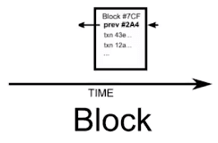
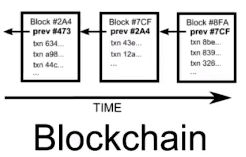
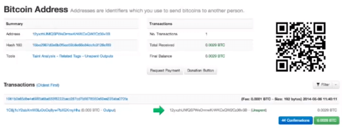
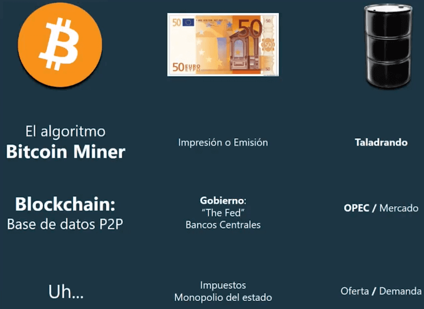
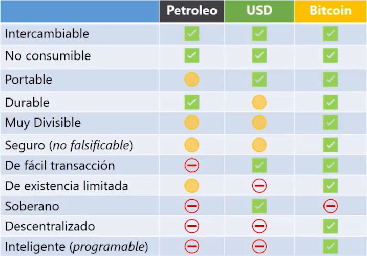
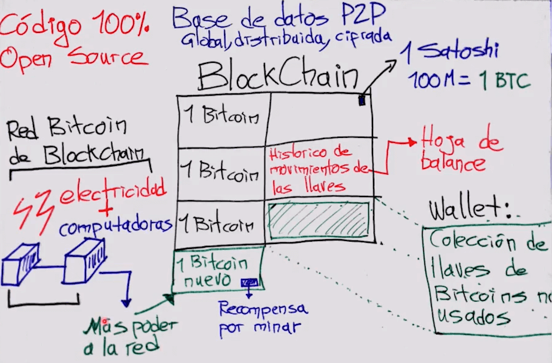
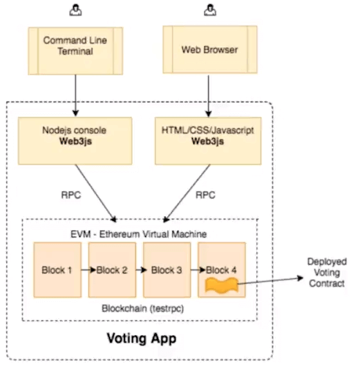

# Curso de Bitcoin y Blockchain<!-- omit in toc -->

## Tabla de Contenido<!-- omit in toc -->
- [¿Qué son las criptomonedas?](#qué-son-las-criptomonedas)
- [Glosario de criptomonedas](#glosario-de-criptomonedas)
- [Cómo funciona una transacción de Bitcoin](#cómo-funciona-una-transacción-de-bitcoin)
- [Blockchain](#blockchain)
- [El paper de Satoshi](#el-paper-de-satoshi)
- [Preguntas comunes sobre Bitcoin](#preguntas-comunes-sobre-bitcoin)
- [¿Qué es el dinero y qué es Bitcoin?](#qué-es-el-dinero-y-qué-es-bitcoin)
- [Comprar Bitcoin](#comprar-bitcoin)
- [Minería](#minería)
  - [Proof of Work y Proof of Stake](#proof-of-work-y-proof-of-stake)
  - [Minería de Bitcoin](#minería-de-bitcoin)
- [Requerimientos técnicos para minar con GPU](#requerimientos-técnicos-para-minar-con-gpu)
  - [Minar Ether con GPU](#minar-ether-con-gpu)
  - [Minar ZCash con GPU](#minar-zcash-con-gpu)
  - [Hardware para Minar](#hardware-para-minar)
  - [Rentabilidad al Minar con GPU](#rentabilidad-al-minar-con-gpu)
- [Correr un Nodo en una Máquina](#correr-un-nodo-en-una-máquina)
- [Integrar el uso de Bitcoin a una Aplicación](#integrar-el-uso-de-bitcoin-a-una-aplicación)
- [Ethereum y ZCash](#ethereum-y-zcash)
- [Aplicaciones Descentralizadas](#aplicaciones-descentralizadas)
- [ICO](#ico)
- [Contratos inteligentes en Ethereum](#contratos-inteligentes-en-ethereum)
  - [Tipos de datos y variables en Solidity](#tipos-de-datos-y-variables-en-solidity)
  - [Constructor y Funciones en Solidity](#constructor-y-funciones-en-solidity)
  - [Ejecución de un Contrato en Solidity](#ejecución-de-un-contrato-en-solidity)
  - [Interface en Solidity](#interface-en-solidity)
- [Consideraciones de seguridad al ejecutar un nodo de Bitcoin](#consideraciones-de-seguridad-al-ejecutar-un-nodo-de-bitcoin)
- [Recursos Complementarios](#recursos-complementarios)
- [Enlaces de Interés](#enlaces-de-interés)

## ¿Qué son las criptomonedas?

Una criptomoneda es una moneda virtual diseñada para ser segura y en muchos casos anónima. Una criptomoneda funciona al igual que el dinero emitido por los bancos centrales de cada país (ese papel-moneda que usamos a diario), ya que sirve para intercambiar bienes y servicios por medio de un sistema de transacciones electrónicas sin la necesidad de un intermediario (bancos, empresas, etc).

**Ventajas de las Criptomonedas**:
* **Descentralizada**: No se encuentra controlada por ningún gobierno, banco o institución financiera.
* **Anónima**: Garantizan la privacidad al realizar una transacción.
* **Internacional**: Disponible en cualquier parte del mundo.
* **Segura**: Te pertenece solo a ti y no puede ser intervenida por nadie.
* **Sin Intermediario**: Las transacciones se realizan persona a persona.
* **Rápida**: Es más rápido realizar una transacción con una criptomoneda que por medio de una institución financiera.
* **Uso Voluntario**: No es impuesta por nadie tal como lo hacen los Gobiernos con las monedas tradicionales.
* **Limitadas**: Ninguna institución o individuo puede controlar la producción de criptomonedas.

<div align="right">
  <small><a href="#tabla-de-contenido">🡡 volver al inicio</a></small>
</div>

## Glosario de criptomonedas

* **Bloque**: Es como una tabla que contiene información. Tiene una cabecera y transacciones.

<div align="center">
  
  <small><p>Bloque</p></small>
</div>

* **Blockchain**: Es la concatenación de bloques. La información de cada bloque se genera cada cierto tiempo, y siempre va a contener la información del bloque anterior para conectarse entre ellos.

<div align="center">
  
  <small><p>Blockchain</p></small>
</div>

* **Minería**: Es un proceso en el que se utilizan equipos para validar transacciones que generan la capa de seguridad.

* **Wallet**: Es un software que puede enviar y recibir información de transacciones de criptomonedas.

* **Confirmation**: Cuando se hace una transacción ésta no se confirma inmediatamente, debe entrar en un bloque y el comercio o la persona que recibe valida que la información esté en su wallet.

<div align="center">
  
  <small><p>Confirmation</p></small>
</div>

* **Exchange**: Es el cambio que haces de cualquier otra divisa a criptomonedas.

<div align="right">
  <small><a href="#tabla-de-contenido">🡡 volver al inicio</a></small>
</div>

## Cómo funciona una transacción de Bitcoin

**¿Cuales son las reglas para que la comunidad acepte tu bloque encriptado?**

1. Los bloques están hechos de texto (son los datos de las transacciones).

2. Cada bloque no puede tener mas de un 1MB (en bitcoin. En otras esto cambia).

3. Cada 10 minutos se deberá crear un bloque. En teoria, si se tarda mas bajará la dificultad para el siguiente bloque y si tarda menos ira subiendo. Por lo que la cadena o blockchain crecera 1 bloque cada 10 minutos aproximadamente.

4. Cada 2016 bloques se ajusta la dificultad

5. El minero que genere el bloque recibirá la recompesa. Al comienzo, cada bloque recompensaba con 50 bitcoins. Por cada 210 mil bloques la recompensa se divide entre 2. Actulamente son 12.5. Los mineros compiten entre ellos para generar estos bloques.

6. El registro de bloques o blockchain esta replicado en cada pc del minero. Cuando un minero cumpla las condiciones para generar un bloque, deberá enviarlo a la red para aprovarlo y ver si es válido. Los bloques se generan creando un HASH (una forma de encriptacion). Al final queda un código largo
000000000000000000625374956e47fc24d3ea0d4c759ce47fea646241fd0643.

7. En ese número esta codificado toda la informacion del bloque número 494769. Por cierto, los 0 del principio son los que indican la dificultad de codificar el bloque. A mayor 0 mas díficil.

Los datos que tiene que tener el bloque son los siguientes:
* Hash del bloque anterior
* Fecha y hora de creación del bloque
* La transacción de recompensa del minero que lo ha codificado
* Todas las transacciones entre usuarios que han intercambiado bitcoin
* Un código (el que quieras para que junto a todo lo anterior al codificar te salgan tantos 0 como dificultad se solicite en ese momento.

<div align="right">
  <small><a href="#tabla-de-contenido">🡡 volver al inicio</a></small>
</div>

## Blockchain

**Bitcoin** como tecnología está viva desde 2009. La gráfica del tamaño del mercado de las criptomonedas muestra cómo ha cambiado esto desde entonces.

**Blockchain** es totalmente público y es posible consultar las transacciones que se han realizado.

Blockchain es un software que une cada una de las terminales que está minando transacciones. Este software es el que decide cómo se van organizando nuevos bloques y cómo se seguirá alimentando el network.

Cada bloque contiene:
* Un Hash Pointer, un identificador único que nos dice cual fue el anterior bloque.
* Un timestamp, estampa del momento en que fue creado.
* Datos de transacción. ¿Quien? ¿Importe? ¿Desde que nodo?

Las transacciones son IRREVERSIBLES.

Además es posible ver datos de las transacciones, como el momento exacto en que fueron hechas y los fees que fueron cobrados. Los bloques no se pueden modificar, y esto hace parte de la seguridad del proceso.

<div align="right">
  <small><a href="#tabla-de-contenido">🡡 volver al inicio</a></small>
</div>

## El paper de Satoshi

Satoshi Nakamoto es un personaje anónimo y su [paper](https://bitcoin.org/files/bitcoin-paper/bitcoin_es_latam.pdf) es un documento que explica qué es Bitcoin. Bitcoin es una red de pares que generan un sistema de transacciones financieras descentralizadas.

El documento presenta la idea de que no haya necesidad de una tercera parte para hacer transacciones bancarias, y que el sistema no esté basado en confianza frente a una entidad regulatoria sino a datos encriptados.

En la primera parte habla sobre cómo las instituciones financieras siempre tienen que regular las transacciones. El hecho de crear transacciones irreversibles es de hecho un beneficio en cuanto a lo que propone el paper.

Para que la red funcione es necesario que exista una recompensa para quienes están minando. Los mineros reciben incentivos por participar en esta red de pares al minar o validar transacciones. Para verificar que una transacción existe es fácil hacer consultas a través de los headers de cada bloque.

El documento también habla sobre cómo evitar que existan ataques en las transacciones, y esta es quizás la parte más compleja de toda la explicación.

<div align="right">
  <small><a href="#tabla-de-contenido">🡡 volver al inicio</a></small>
</div>

## Preguntas comunes sobre Bitcoin

Las preguntas frecuentes sobre Bitcoin tienen que ver mayormente con Economía:

**¿Por qué Bitcoin tiene valor?** Al ser unidades de divisas digitales. Son un bien intangible con valor.

**¿Es Bitcoin legal?** En algunos gobiernos es peligroso minar y hablar de Bitcoin, sin embargo tiene muchas alianzas con otros Estados. Bitcoin no es legal ni ilegal, es descentralizado.

**¿Qué lenguaje tengo que aprender para programar?** Los Bitcoin requieren de un Blockchain, donde se guardan las transacciones.

<div align="right">
  <small><a href="#tabla-de-contenido">🡡 volver al inicio</a></small>
</div>

## ¿Qué es el dinero y qué es Bitcoin?

Estamos en la revolución más importante que podría cambiar la forma como utilizamos el dinero.

El dinero es cualquier cosa que se pueda intercambiar por productos o servicios. Ninguna moneda en el planeta en este momento está respaldadas por oro sino en bases de datos que tienen los gobiernos. El petróleo es un buen ejemplo de recurso natural que puede ser usado como dinero, su valor está determinado por el uso que le da el mercado.

El dinero se crea imprimiendo o emitiendo. Tiene valor porque es un monopolio del gobierno, pues solo con eso puedes pagar impuestos. El petróleo por su parte también tiene su proceso de emisión, que debe ser regulado como la emisión de monedas.

La mayoría del dinero que conocemos no existe en papel sino en bases de datos, ese es el balance que es importante entender para comprender cómo funciona Bitcoin. Bitcoin es una expansión de la base de datos, que se llama Blockchain. Así como existen diferentes divisas, también hay diferentes criptomonedas, como Bitcoin y Ethereum.

<div align="center">
  
  <small><p>Bitcoin vs Fiat vs Petróleo</p></small>
</div>

<div align="center">
  
  <small><p>Reglas para que un artivo sea considerado dinero</p></small>
</div>

Blockchain es un código open source, una base de datos peer to peer, distribuída y cifrada.
Hay una serie de reglas que hacen que un recurso pueda ser dinero.

<div align="center">
  
  <small><p>Explicación Blockchain</p></small>
</div>

<div align="right">
  <small><a href="#tabla-de-contenido">🡡 volver al inicio</a></small>
</div>

## Comprar Bitcoin

Cuando hablamos de criptomonedas el interés principal que tienen las personas es saber cómo comprar.

Lo primero que vas a necesitar es una wallet, que es un programa que mantiene los contenidos de las transacciones y tus llaves privadas para controlar tus criptomonedas. Existen llaves físicas y digitales. Coinbase, Kraken, Bitso y GreenAddress son algunos ejemplos.

Para adquirir una wallet es probable que tengas que validar quién eres utilizando una identificación. Después de registrarte podrás vincular tu wallet a una cuenta bancaria y hacer intercambios de monedas comunes a criptocurrencies.

Es posible tener wallets en la nube o en local, ya sea en escritorio o móviles. Así mismo hay llaves físicas. La realidad es que en cuanto a seguridad siempre habrá riesgos. Elegir una wallet depende de la investigación que hagas y tus propias decisiones.

<div align="right">
  <small><a href="#tabla-de-contenido">🡡 volver al inicio</a></small>
</div>

## Minería

El concepto de **minería** viene del proceso para extraer oro en minas. Así como las criptomonedas, el oro ha ido incrementando su valor y el proceso de minarlo se vuelve más valioso por lo que se recibe a cambio de hacerlo.

**¿Por qué minar?**

* Por la seguridad que brindan los mineros, pues agregan una capa de seguridad, protegiendo a los usuarios de los abusos, con transacciones falsas. Dentro del protocolo no es posible gastar una moneda dos veces.

* Todas las transacciones que suceden dentro de un tiempo determinado se guardan en la base de datos como un bloque y se confirman. Cuando se crea un bloque a través de la minería se crean nuevas monedas y esto lleva al tercer beneficio.

* Minando es posible ganar dinero.

<div align="right">
  <small><a href="#tabla-de-contenido">🡡 volver al inicio</a></small>
</div>

### Proof of Work y Proof of Stake

**Proof of work y Proof of stake** son dos caminos para validar transacciones. El primero aplica fuerza bruta a través de cómputo matemático para extraer la criptomoneda, el segundo es coo un sorteo para ver quién se queda con ella.

**PoW (Proof-of-work)** lo utilizan muchas monedas pero es un proceso ineficiente pues necesitamos equipos especializados costosos, que gastan una gran cantidad de energía. Es un concepto que existe incluso antes de las criptomonedas, pues se utilizaba, por ejemplo, para validar si un email era Spam. El sistema funciona a través de funciones criptográficas que garantizan que cada entrada (input) tenga una sola salida (Hash sum).

Cada bloque tiene un hash que es la identificación única.

**PoS (Proof-of-stake)** elimina toda la capa de cómputo pesado y utiliza un solo servidor que puede ser pequeño. Entre más bitcoins tienes en tu poder mayor es la capacidad de minado. El proceso es similar a cuando haces un depósito en el banco y empiezas a recibir intereses por tener ese dinero guardado ahí.

<div align="right">
  <small><a href="#tabla-de-contenido">🡡 volver al inicio</a></small>
</div>

### Minería de Bitcoin

**¿Es rentable minar Bitcoin?**

En principio si, pero es importante tener en cuenta costos de equipos y electricidad. Si puedes construir un entorno en el que se cubran estos costos fácilmente tendrás retorno de inversión en alrededor de 6 o 7 meses. También considera que la dificultad para minar va aumentando con el paso del tiempo, entonces para una persona que recién va a empezar a minar puede ser más dificil que para alguien que ya lleva un tiempo minando.

**¿Cómo funciona la minería de Bitcoin?**

* La función SHA256 genera una cadena de caracteres de 256 bits. El minero recibe toda la cabecera del bloque anterior y del nuevo bloque que se va a crear, con esto se crean dos variables que se van a utilizar en el proceso de minado.

* El proceso funciona como un ciclo que comienza con un número aleatorio.

<div align="right">
  <small><a href="#tabla-de-contenido">🡡 volver al inicio</a></small>
</div>

## Requerimientos técnicos para minar con GPU

La **GPU** es un periférico que recientemente utilizan las computadoras para minar criptomonedas.

Uno de los factores que debes considerar para minar criptomonedas con GPU es la memoria, sin importar el modelo. Para Ethereum, por ejemplo, no importa la velocidad de procesador, debes tener una tarjeta gráfica de por lo menos 8GB. Monedas como ZCash requieren un procesador más rápido, en lugar de más memoria.

Cuando empiezas el proceso de minado las GPU se pueden sobre cargar.

El software más utilizado para mirar es **Claymore**.

<div align="right">
  <small><a href="#tabla-de-contenido">🡡 volver al inicio</a></small>
</div>

### Minar Ether con GPU

1. Comprar un GPU con características para minar Ethers.
2. Colocar en el motherboard la GPU y luego instalar los drivers como cualquier otro dispositivo periférico a una computadora.
3. Instalar Claymore para windows en la PC que detectó a la GPU del punto número 1.
4. Antes de empezar a minar, crear un usuario en ethermine.org para crear la llave pública (cuenta "bancaria") a dónde llegarán nuestros Ether minados.
5. Configurar en archivo de texto, los parámetros para comunicar nuestra GPU (el minero) para enviar los ethers ganados productos de la minería.
6. Ejecutar Claymore en modo consola y acá es dónde inicia el minado de Ethereum en la memoria de la GPU.
7. Dejar corriendo el programa Claymore (dede estar 24/7 encendida la computadora) y esperar a tener varios hashes válidos.
8. Revisar cuántos ETH's (ether) tenemos por haber minado X hashes en el paso 7.
9. Revisar la temperatura de la GPU en la consola, revisar cómo está el rendimiento de nuestro minado y verificar que no tengamos "hashes rejected".

<div align="right">
  <small><a href="#tabla-de-contenido">🡡 volver al inicio</a></small>
</div>

### Minar ZCash con GPU

Los pasos son los mismos que en [Etherium](#minar-ether-con-gpu) solo se tiene que descargar la versión de [ZCash de Claymore](https://github.com/nanopool/ClaymoreZECMiner). 

Asímismo, se debe de configurar un [Pool de Minado de ZCash](http://zcash.flypool.org/).

<div align="right">
  <small><a href="#tabla-de-contenido">🡡 volver al inicio</a></small>
</div>

### Hardware para Minar

Armar un computador para minar es parecido a armar uno para jugar. Lo que necesitas es:

* **Fuente de poder**: a partir de 1000W.
* **Tarjeta madre**: que disponga de suficientes puertos PC express.
* **Tarjeta de video**: que cuente con 8GB de memoria.
* **Memoria**: no necesitamos tanta memoria RAM, puede ser simplemente una económica de 4GB.
* Extensores para conectar las tarjetas de video a la tarjeta madre.
* **Disco duro**: de 64GB o 120 GB está bien.
* **Case para poner las tarjetas de video**: esto garantiza la seguridad del hardware y una buena ventilación.
* CPU con cooler

<div align="right">
  <small><a href="#tabla-de-contenido">🡡 volver al inicio</a></small>
</div>

### Rentabilidad al Minar con GPU

**¿Qué retorno vas a tener con tu equipo y tus condiciones para minar?**

Con [What To Mine](https://whattomine.com/) puedes calcular el ROI cambiando la cantidad de equipos y gastos que tengas.

<div align="right">
  <small><a href="#tabla-de-contenido">🡡 volver al inicio</a></small>
</div>

## Correr un Nodo en una Máquina

**¿Cómo instalar un cliente de Bitcoin y cómo enviar y recibir dinero?**

Cuando instalas un nodo, o el [cliente de Bitcoin](https://bitcoin.org/en/) en un computador, este va a instalar toda la base de datos, desde el día 1 hasta el presente. Hoy, el peso de esa base de datos es de 153GB. Lo que puedes hacer para no descargar toda esta información en tu disco duro es ajustar esto una vez hagas la descarga del software en tu computador.

Hay diferentes servicios que son wallets completos o wallets ligeros que puedes usar en desktop, dispositivos móviles o hardware directamente.

Al instalar Bitcoin en tu computador se van a crear dos íconos, uno en el que se carga toda la base de datos, en el que puedes hacer transacciones y otro en el que puedes hacer pruebas.

Algo importante que debes hacer es cifrar tu wallet. Ten en cuenta que esto garantiza la seguridad de tus transacciones y tu dinero.

<div align="right">
  <small><a href="#tabla-de-contenido">🡡 volver al inicio</a></small>
</div>

## Integrar el uso de Bitcoin a una Aplicación

La implementación de criptomonedas en una aplicación normalmente se hace para aceptar pagos y tener otro método para cobrar. La forma más común es a través del **protocolo RPC**, que permite ejecutar funciones remotas del cliente en el lenguaje de programación que estés usando.

<div align="right">
  <small><a href="#tabla-de-contenido">🡡 volver al inicio</a></small>
</div>

## Ethereum y ZCash

**Bitcoin** fue la primera criptomoneda, por lo tanto es la más reconocida. Todas las que vinieron después son consideradas como monedas alternativas, o Alt Coins.

Con **Ethereum** los bloques se generan mucho más rápido. Además están los Smart Contracts que son piezas de código que realizan ciertas acciones dentro de un Blockchain. Funcionan como contratos legales que no necesitan intervención humana para ser ejecutados. Todo es interpretado por una máquina y el dinero se envía automáticamente. Esta es la característica más importante que ha permitido levantar dinero con Ethereum.

**ZCash** viene del código fuente de Bitcoin. Lo interesante de esta moneda es que puedes elegir el tipo de privacidad de tus transacciones. Puedes enviar y recibir con cuentas tipo T, en las que es posible conocer la información de quien envía, recibe y el monto de la transacción; pero también puedes utilizar cuentas tipo Z, que no pueden ser rastreadas.

<div align="right">
  <small><a href="#tabla-de-contenido">🡡 volver al inicio</a></small>
</div>

## Aplicaciones Descentralizadas

Cuando creas un sitio web lo haces con un Frontend y un Backend. El usuario, a través del navegador puede comunicarse con el Backend para enviar y recibir información. Este es un modelo centralizado.

En una **aplicación descentralizada** el Backend es cualquier nodo alrededor del mundo. El cliente se contecta a través de una interfaz que no tiene que preocuparse por cómo se conecta al nodo.

<div align="center">
  
  <small><p>Arquitectura de una App Descentralizada</p></small>
</div>

<div align="right">
  <small><a href="#tabla-de-contenido">🡡 volver al inicio</a></small>
</div>

## ICO

**ICO - Initial Coin Offering**

Piensa en un IPO: cuando una empresa genera acciones y sale a la bolsa. Estas acciones pueden ser compradas y vendidas a través de la bolsa de valores. El ICO no tiene un reglamento estandar aún.

**¿Cómo funciona un ICO?**

Primero debe haber un contrato en el que se recibe el dinero de los inversionistas. Cada inversionista crea una transacción a través de Ethereum y por ese dinero recibe una cantidad de tokens, que serían como las acciones de una empresa. Los tokens, pueden ser vendidos sin intermediarios a través de Smart Contracts. Al final, si quedan tokens que no se vendieron estos se destruyen para evitar que la inversión que hicieron los inversionistas sea diluida.

En tu wallet puedes consultar la cantidad de tokens que tienes disponibles para hacer transferencias, o tener almacenados hasta que sea el mejor momento para vender.

<div align="right">
  <small><a href="#tabla-de-contenido">🡡 volver al inicio</a></small>
</div>

## Contratos inteligentes en Ethereum

Solidity es uno de los lenguajes de programación de Smart Contracts que soporta Ethereum. [Remix](https://remix.ethereum.org/) es el IDE que vamos a utilizar para crear el token, el contrato y la interfaz de nuestro pequeño proyecto.

<div align="right">
  <small><a href="#tabla-de-contenido">🡡 volver al inicio</a></small>
</div>

### Tipos de datos y variables en Solidity

En Solidity hay varios tipos de datos, como en cualquier otro lenguaje de programación: boleanos, números enteros, strings, etc. Pero también hay tipos de datos exclusivos de Solidity como las direcciones de Ethereum.

Lo primero que vamos a hacer dentro del IDE es crear una variable. Primero va el tipo de dato, luego su visibilidad y finalmente el nombre de la variable. Así creamos tres variables que ya vienen definidas por el estandar ERC20.
La variable totalSupply va a indicar el número de tokens disponibles.

Después de las variables vamos a crear un evento, que es como una función. En Solidity puedes hacer notificaciones y recibirlas en otro lugar. En este caso vamos a crear un log con todas las transacciones y tener eventos del contrato, de cuando se realicen transferencias.

<div align="right">
  <small><a href="#tabla-de-contenido">🡡 volver al inicio</a></small>
</div>

### Constructor y Funciones en Solidity

El constructor es una función más en Solidity, tiene la misma estructura. Puedes asignarle todas las variables iniciales que quieras para el contrato.

```
constructor(uint256 initialSupply, string tokenName, string tokenSymbol) public{
  //el código
}
```

Dentro de Ethereum, cada transacción es un mensaje. Tiene información de quién lo envía, la cantidad de gas que se va a utilizar, el bloque y la data que corresponde a todo lo que envías a la hora de iniciar una transacción.

<div align="right">
  <small><a href="#tabla-de-contenido">🡡 volver al inicio</a></small>
</div>

### Ejecución de un Contrato en Solidity

Las funciones de transferencia son dos:
* Transfer es interna
* Transfer es pública
  
Vamos a recibir los datos de quién envía, quién recibe y el valor.

La función require permite verificar condicionales, y es importante para esta fase del proceso de creación de contratos. Así evitas por ejemplo, que se envíe más de lo que se tiene. Recuerda que al hacer deploy sobre un contrato ya no se puede cambiar.

Require lo debes utilizar para validar datos de entrada, y assert se utiliza para validar lo que ya tienes dentro de la función.

<div align="right">
  <small><a href="#tabla-de-contenido">🡡 volver al inicio</a></small>
</div>

### Interface en Solidity

```
interface TokenERC20 Interface {
  function transfer(address to, uint value) external;
}
```

<div align="right">
  <small><a href="#tabla-de-contenido">🡡 volver al inicio</a></small>
</div>

## Consideraciones de seguridad al ejecutar un nodo de Bitcoin

Ejecutar un nodo de Bitcoin tiene diferentes ventajas, como la posibilidad de poder usar ese nodo para implementar Bitcoin -o cualquier blockchain- en un comercio electrónico, o para cualquier otra actividad económica. Sin embargo la seguridad es una parte fundamental a la hora de crear un nuevo nodo de Bitcoin y en este material te explicaré algunos tips para tener en cuenta a la hora de ejecutar un nodo.

**Asegurar puerto SSH**

La mayoría de los proveedores de computación en la nube ofrecen configuración de sus máquinas virtuales con SSH, por lo general esto es seguro ya que usan llaves RSA para autenticar los usuarios. Aún así, es posible hacer algunas configuraciones adicionales para lograr una mayor seguridad.

**Implementar fail2ban**

fail2ban es un software que permite bloquear IPs que tengan múltiples intentos de login a un puerto, en este caso SSH, si una persona intenta múltiples veces conectarse a SSH aplicando fuerza bruta para tratar de adivinar la contraseña de un usuario, fail2ban lo bloqueará y evitará que continúe haciendo ese ataque.

**Evitar root**

Al instalar un cliente de Bitcoin es importante evitar al máximo hacer instalación con el usuario root, lo mejor es crear un nuevo usuario -si lo instalas en Linux- y en el home de dicho usuario instalar tu nodo de Bitcoin y que quede separado de otros nodos, si instalas varios clientes de blockchain en un mismo servidor.

También es importante evitar el login a través de SSH con el usuario root, es importante deshabiltiarlo de la configuración de SSH.

**Bloquea y crea backups de tu wallet**

Es importante crear una contraseña para bloquear tu wallet y es importante que el archivo de tu wallet tenga respaldo a diario, sobre todo si haces muchos movimientos al día. Si el uso de tu wallet es semanal, podrías hacer un respaldo semanal.

Jamás olvides este consejo.

**Asegura tu red**

Muchas veces abrimos puertos en un firewall y se nos olvida. Es importante abrir los puertos necesarios y especificar quiénes se pueden conectar a dicho puerto. Bitcoin utiliza dos puertos: el puerto 8333, para comunicarse entre nodos en el protocolo Bitcoin y el puerto 8332, para comunicaciones sobre RPC-JSON.

Mi recomendación es que abran 8333 al público y dejen el puerto 8332 configurado para ciertas IPs, incluso si es necesario solo permitir conexiones a localhost, si es importante que reciba conexiones desde otros servidores entonces la solución más eficiente es configurar el firewall para que reciba conexiones entrantes a ese puerto solo desde esa IP.

Otra recomendación es cambiar el número del puerto RPC en la configuración de Bitcoin que por lo general se encuentra en alguna de las siguientes rutas:

**Windows**

`%APPDATA%\Bitcoin\`

```
C:\Users\username\AppData\Roaming\Bitcoin\bitcoin.conf
```

**Linux**

`$HOME/.bitcoin/`

```
/home/username/.bitcoin/bitcoin.conf
```

**Mac OSX**

`$HOME/Library/Application Support/Bitcoin/`

```
/Users/username/Library/Application Support/Bitcoin/bitcoin.conf
```

En ese archivo pueden cambiar el puerto a través de la configuración llamada:

`rpcport`

Si combinan esa configuración con `rpcallowip` para indicar explícitamente quienes se pueden conectar, podrán tener un Nodo de Bitcoin mucho más seguro.

<div align="right">
  <small><a href="#tabla-de-contenido">🡡 volver al inicio</a></small>
</div>

## Recursos Complementarios
* [Proyecto Smart Contracts](docs/code.sol)

<div align="right">
  <small><a href="#tabla-de-contenido">🡡 volver al inicio</a></small>
</div>

## Enlaces de Interés
* [Curso de Bitcoin y Blockchain](https://platzi.com/clases/bitcoin)
* [Paper de Bitcoin](https://bitcoin.org/files/bitcoin-paper/bitcoin_es_latam.pdf)
* [What to Mine](https://whattomine.com/)
* [Cliente de Bitcoin](https://bitcoin.org/en/)

<div align="right">
  <small><a href="#tabla-de-contenido">🡡 volver al inicio</a></small>
</div>