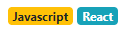
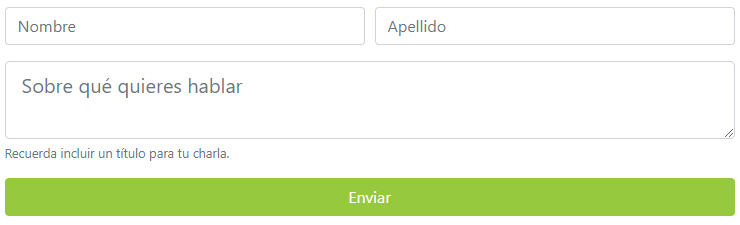
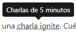
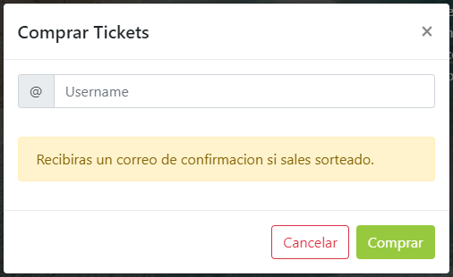

# Curso de Bootstrap<!-- omit in toc -->

## Tabla de Contenido<!-- omit in toc -->
- [Frameworks Frontend](#frameworks-frontend)
- [Iniciar con Bootstrap](#iniciar-con-bootstrap)
- [Contenedores](#contenedores)
  - [Contenedor con ancho fijo](#contenedor-con-ancho-fijo)
  - [Contenedor de ancho fluido](#contenedor-de-ancho-fluido)
- [Grillas](#grillas)
  - [Filas](#filas)
  - [Columnas](#columnas)
  - [Uso de filas y columnas en conjunto](#uso-de-filas-y-columnas-en-conjunto)
- [Navbar](#navbar)
- [Carrusel](#carrusel)
- [Botones](#botones)
- [Cards](#cards)
- [Badges](#badges)
- [Formularios](#formularios)
- [Tooltip](#tooltip)
- [Scrollspy](#scrollspy)
- [Modals](#modals)
- [Utilidades](#utilidades)
  - [Alineación de texto](#alineación-de-texto)
  - [Espaciado](#espaciado)
  - [Display](#display)
- [Recursos Complementarios](#recursos-complementarios)
- [Enlaces de Interés](#enlaces-de-interés)

## Frameworks Frontend

También conocidos como Framework Css. Son una base para inicializar un proyecto web permitiendo flexibilidad en el diseño. Brindan organización y estructura para los archivos html, css y javascript.

**Componentes Principales**:

* Grilla
* Estilos para las fuentes
* Componentes visuales pre-armados

**Razones para usar un Framework Front-End**

* Ahorrar tiempo de desarrollo.
* Componentes visuales pre-armados.
* Responsive Design establecido en todo el layout.
* El código tiene máxima compatibilidad.

**Frameworks Front-End**:

* Bootstrap
* Foundation
* Bulma
* Flexbox Grid

<div align="right">
  <small><a href="#tabla-de-contenido">🡡 volver al inicio</a></small>
</div>

## Iniciar con Bootstrap

Para iniciar un proyecto con bootstrap se agregarán las siguientes referencias:

```html
<!-- Bootstrap CSS -->
<link rel="stylesheet" href="https://stackpath.bootstrapcdn.com/bootstrap/4.1.3/css/bootstrap.min.css" integrity="sha384-MCw98/SFnGE8fJT3GXwEOngsV7Zt27NXFoaoApmYm81iuXoPkFOJwJ8ERdknLPMO" crossorigin="anonymous">

<!-- jQuery first, then Popper.js, then Bootstrap JS -->
<script src="https://code.jquery.com/jquery-3.3.1.slim.min.js" integrity="sha384-q8i/X+965DzO0rT7abK41JStQIAqVgRVzpbzo5smXKp4YfRvH+8abtTE1Pi6jizo" crossorigin="anonymous"></script>
<script src="https://cdnjs.cloudflare.com/ajax/libs/popper.js/1.14.3/umd/popper.min.js" integrity="sha384-ZMP7rVo3mIykV+2+9J3UJ46jBk0WLaUAdn689aCwoqbBJiSnjAK/l8WvCWPIPm49" crossorigin="anonymous"></script>
<script src="https://stackpath.bootstrapcdn.com/bootstrap/4.1.3/js/bootstrap.min.js" integrity="sha384-ChfqqxuZUCnJSK3+MXmPNIyE6ZbWh2IMqE241rYiqJxyMiZ6OW/JmZQ5stwEULTy" crossorigin="anonymous"></script>
```

<div align="right">
  <small><a href="#tabla-de-contenido">🡡 volver al inicio</a></small>
</div>

## Contenedores

### Contenedor con ancho fijo

El contenedor ocupara un ancho fijo determinado.

```html
<div class="container">
  <!-- Content here -->
</div>
```

<div align="right">
  <small><a href="#tabla-de-contenido">🡡 volver al inicio</a></small>
</div>

### Contenedor de ancho fluido

El contenedor ocupara todo el ancho de la pantalla.

```html
<div class="container-fluid">
  <!-- Content here -->
</div>
```

<div align="right">
  <small><a href="#tabla-de-contenido">🡡 volver al inicio</a></small>
</div>

## Grillas

### Filas

Cada fila tiene como máximo 12 columnas.

```html
<div class="row">
  <!-- Content here -->
</div>
```

<div align="right">
  <small><a href="#tabla-de-contenido">🡡 volver al inicio</a></small>
</div>

### Columnas

```html
<div class="col">
  <!-- Content here -->
</div>
```

La clase **col** crea una columna sin un tamaño especifico. Al no asignar un tamaño especifico para las columnas, las columnas se repartirán todo el ancho disponible equitativamente.

Para declarar el **ancho de las columnas**, solo se le debe de asignar un número a la clase col. Como máximo, la suma de los anchos de columnas debe de ser 12.

```html
<div class="col-4">
</div>
<div class="col-8">
</div>
```

Si el ancho de cada columna o la suma de todos los anchos de todas las columnas superan las 12 columnas por defecto, se creara una fila adicional para que las columnas se acomoden.

También se puede asignar el tamaño de las columnas dependiendo del tamaño de la pantalla.

```html
<!-- extra small (<576px) -->
<div class="col-2">
</div>

<!-- small (≥576px) -->
<div class="col-sm-2">
</div>

<!-- medium (≥768px) -->
<div class="col-md-2">
</div>

<!-- large (≥992px) -->
<div class="col-lg-2">
</div>

<!-- extra large (≥1200px) -->
<div class="col-xl-2">
</div>
```

<div align="right">
  <small><a href="#tabla-de-contenido">🡡 volver al inicio</a></small>
</div>

### Uso de filas y columnas en conjunto

```html
<divc lass="container">
  <div class="row">
    <div class="col">
      Uno
    </div>
    <div class="col">
      Dos
    </div>
    <div class="col">
      Tres
    </div>
  </div>
</div>
```

<div align="right">
  <small><a href="#tabla-de-contenido">🡡 volver al inicio</a></small>
</div>

## Navbar

El navbar sirve para crear encabezados en la website.

<div align="center">
  
  <small><p>Ejemplo de Navbar</p></small>
</div>

```html
<nav id="header" class="navbar navbar-expand-lg navbar-dark bg-dark">
  <div class="container">
    <a class="navbar-brand" href="#">
      
      Conf Hawaii
    </a>
    <button class="navbar-toggler" type="button" data-toggle="collapse" data-target="#navbarSupportedContent" aria-controls="navbarSupportedContent"
      aria-expanded="false" aria-label="Toggle navigation">
      <span class="navbar-toggler-icon"></span>
    </button>
    
    <div class="collapse navbar-collapse" id="navbarSupportedContent">
      <ul class="navbar-nav ml-auto">
        <li class="nav-item active">
          <a class="nav-link" href="#">La Conferencia</a>
        </li>
        <li class="nav-item">
          <a class="nav-link" href="#">Oradores</a>
        </li>
      </ul>
    </div>
  </div>
</nav>
```

<div align="right">
  <small><a href="#tabla-de-contenido">🡡 volver al inicio</a></small>
</div>

## Carrusel

```html
<div id="carouselExampleFade" class="carousel slide carousel-fade" data-ride="carousel" data-pause="false">
  <div class="carousel-inner">
    <div class="carousel-item active">
      
    </div>
    <div class="carousel-item">
      
    </div>
    <div class="carousel-item">
      
    </div>
  </div>
</div>
```

<div align="right">
  <small><a href="#tabla-de-contenido">🡡 volver al inicio</a></small>
</div>

## Botones

<div align="center">
  
  <small><p>Ejemplo de botones</p></small>
</div>

Los botones se declaran con la clase `btn` seguido por el diseño del color del botón.

```html
<a href="#" class="btn btn-outline-light">Quiero ser orador</a>

<button type="button" class="btn btn-success">Comprar Tickets</button>
```

<div align="right">
  <small><a href="#tabla-de-contenido">🡡 volver al inicio</a></small>
</div>

## Cards

<div align="center">
  
  <small><p>Ejemplo de Cards</p></small>
</div>

```html
<div class="card">
  
  <div class="card-body">
    <h5 class="card-title">Sacha Lifszyc</h5>
    <p class="card-text">Lorem ipsum dolor sit amet consectetur adipisicing elit. Debitis rerum illum officiis amet culpa vitae quo eligendi nulla quasi praesentium.</p>
  </div>
</div>
```

<div align="right">
  <small><a href="#tabla-de-contenido">🡡 volver al inicio</a></small>
</div>

## Badges

<div align="center">
  
  <small><p>Ejemplo de Badges</p></small>
</div>

```html
<div class="badges mb-2">
  <span class="badge badge-warning">Javascript</span>
  <span class="badge badge-info">React</span>
</div>
```

<div align="right">
  <small><a href="#tabla-de-contenido">🡡 volver al inicio</a></small>
</div>

## Formularios

Bootstrap ofrece diseños para los formularios.

* **form-row**: Indica una fila dentro del formulario.
* **form-group**: divide cada elemento del formulario.

<div align="center">
  
  <small><p>Ejemplo de Formulario</p></small>
</div>

```html
<form>
  <div class="form-row">
    <div class="form-group col-12 col-md-6">
      <input type="text" class="form-control" placeholder="Nombre">
    </div>
    <div class="form-group col-12 col-md-6">
      <input type="text" class="form-control" placeholder="Apellido">
    </div>
  </div>
  <div class="form-row">
    <div class="form-group col">
      <textarea name="text" class="form-control form-control-lg" placeholder="Sobre qué quieres hablar"></textarea>
      <small class="form-text text-muted">
        Recuerda incluir un título para tu charla.
      </small>
    </div>
  </div>
  <div class="form-row">
    <div class="col">
      <button type="button" class="btn btn-platzi btn-block">Enviar</button>
    </div>
  </div>
</form>
```

<div align="right">
  <small><a href="#tabla-de-contenido">🡡 volver al inicio</a></small>
</div>

## Tooltip

<div align="center">
  
  <small><p>Ejemplo de Tooltip</p></small>
</div>

```html
<abbr data-toggle="tooltip" title="Charlas de 5 minutos">charla ignite</abbr>
```

Luego hay que agregar un js que active los tooltips.

```js
$(function() {
  $('[data-toggle="tooltip"]').tooltip();
});
```

<div align="right">
  <small><a href="#tabla-de-contenido">🡡 volver al inicio</a></small>
</div>

## Scrollspy

El scrollspy le permite al usuario conocer la posición dentro del sitio.

```html
<body data-spy="scroll" data-target="#navbar" data-offset="57"></body>
```

* **data-spy**: esta etiqueta se agrega al elemento que se quiere espiar.
* **data-target**: el elemento que va a ser modificado.
* **data-offset**: El desplazamiento del elemento. Generalmente es el alto del header.

<div align="right">
  <small><a href="#tabla-de-contenido">🡡 volver al inicio</a></small>
</div>

## Modals

Son ventanas que se abren al realizar una acción.

Una recomendación es que los modals se encuentren fuera de los demás elementos. Es decir, al nivel del body.

<div align="center">
  
  <small><p>Ejemplo de Modal</p></small>
</div>

```html
<div class="modal fade" id="modalCompra" tabindex="-1" role="dialog" aria-labelledby="exampleModalCenterTitle"
  aria-hidden="true">
  <div class="modal-dialog modal-dialog-centered" role="document">
    <div class="modal-content">
      <div class="modal-header">
        <h5 class="modal-title" id="exampleModalCenterTitle">Modal title</h5>
        <button type="button" class="close" data-dismiss="modal" aria-label="Close">
          <span aria-hidden="true">&times;</span>
        </button>
      </div>
      <div class="modal-body">
        ...
      </div>
      <div class="modal-footer">
        <button type="button" class="btn btn-secondary" data-dismiss="modal">Close</button>
        <button type="button" class="btn btn-primary">Save changes</button>
      </div>
    </div>
  </div>
</div>
```

Para abrir el modal, se hace de la siguiente forma:

```html
<a href="#" data-toggle="modal" data-target="#modalCompra">Comprar Tickets</a>
```

* **data-toggle**: Indica que ese control va a abrir un modal.
* **data-target**: Indica el modal que se va a abrir.

<div align="right">
  <small><a href="#tabla-de-contenido">🡡 volver al inicio</a></small>
</div>

## Utilidades

### Alineación de texto

`text-[tamaño]-[alineación]`

* Tamaño: Selecciona el tamaño mínimo en el cual se va a afectuar la alineación
* Alineación: Indica la dirección hacia donde el texto va a ser alineado. Valores: Right, Center, Left.

<div align="right">
  <small><a href="#tabla-de-contenido">🡡 volver al inicio</a></small>
</div>

### Espaciado

`[propiedad][lado]-[tamaño]`

Propiedad: 
* m - margin
* p - padding

Lado:
* t - margin-top o padding-top
* b - margin-bottom o padding-bottom
* l - margin-left o padding-left
* r - margin-right o padding-right
* x - *-left y *-right
* y - *-top y *-bottom
* vacío - afecta a los 4 elementos

Tamaño:
* 0 - margin o padding 0
* 1 - margin o padding a $spacer * .25
* 2 - margin o padding a $spacer * .5
* 3 - margin o padding a $spacer
* 4 - margin o padding a $spacer * 1.5
* 5 - margin o padding a $spacer * 3
* auto -margin auto

<div align="right">
  <small><a href="#tabla-de-contenido">🡡 volver al inicio</a></small>
</div>

### Display

`d-[ancho]-[valor]`

* Tamaño: Selecciona el tamaño mínimo en el cual se va a afectuar la alineación
* Valor: none, inline, inline-block, block, table, table-cell, table-row, flex, inline-flex.

<div align="right">
  <small><a href="#tabla-de-contenido">🡡 volver al inicio</a></small>
</div>

## Recursos Complementarios
* [Diapositivas del Curso](docs/slides-curso-de-bootstrap-2018.pdf)

<div align="right">
  <small><a href="#tabla-de-contenido">🡡 volver al inicio</a></small>
</div>

## Enlaces de Interés
* [Curso de Bootstrap](https://platzi.com/clases/bootstrap)
* [Repositorio del Curso](https://github.com/platzi/bootstrap)
* [Bootstrap](http://getbootstrap.com/)

<div align="right">
  <small><a href="#tabla-de-contenido">🡡 volver al inicio</a></small>
</div>

