# Curso de Bots con Facebook Messenger<!-- omit in toc -->

## Tabla de Contenido<!-- omit in toc -->

- [¿Qué es un bot de Messenger y para qué sirven?](#qué-es-un-bot-de-messenger-y-para-qué-sirven)
- [Ejemplos de Bots creados en Messenger](#ejemplos-de-bots-creados-en-messenger)
- [ChatBots Design Canvas](#chatbots-design-canvas)
- [Setup del entorno de trabajo con Facebook Developers](#setup-del-entorno-de-trabajo-con-facebook-developers)
- [Messenger Platform Features](#messenger-platform-features)
- [Webhook](#webhook)
- [Entorno y conexión del desarrollo local](#entorno-y-conexión-del-desarrollo-local)
- [Conectar Messenger con el Servidor](#conectar-messenger-con-el-servidor)
- [Recibir un mensaje](#recibir-un-mensaje)
- [Enviar un mensaje](#enviar-un-mensaje)
- [Curl](#curl)
  - [Botón de Get Started](#botón-de-get-started)
  - [Mensaje de Bienvenida](#mensaje-de-bienvenida)
  - [Menú Persistente](#menú-persistente)
- [Manejo de eventos](#manejo-de-eventos)
  - [Mensajes](#mensajes)
  - [Postback](#postback)
  - [Attachments](#attachments)
- [Respuestas rápidas](#respuestas-rápidas)
- [Enviar Ubicación](#enviar-ubicación)
- [Acciones de envío](#acciones-de-envío)
- [Fotos](#fotos)
- [Templates](#templates)
  - [Generico](#generico)
  - [Listas](#listas)
  - [Botón](#botón)
  - [Webviews](#webviews)
  - [Recibos](#recibos)
- [Enlaces de Interés](#enlaces-de-interés)

## ¿Qué es un bot de Messenger y para qué sirven?

Los Bots de Messenger son un programa que recibe e interpreta mensajes de los usuarios a través de la aplicación de chat de Facebook. Fueron presentados en la conferencia anual de desarrolladores del 2016 (F8).

Con estos programas podemos construir todo lo que queramos: informarnos sobre el clima, conocer el trafico de nuestra ciudad, ver las noticias importantes de la semana, hacer reservas en un restaurante, obtener descuentos de nuestros sitios favoritos, entre muchas otras cosas.

<div align="right">
  <small><a href="#tabla-de-contenido">🡡 volver al inicio</a></small>
</div>

## Ejemplos de Bots creados en Messenger

* **Chewiekie**: Nos va a mandar GIFs e imágenes de él mismo.
* **CNN**: Este bot nos pregunta por nuestros temas de interés para mandarnos información y alertas de las noticias más interesantes.
* **FanBot**: Nos invita a jugar con el a cambio de una serie de recompensas.

<div align="right">
  <small><a href="#tabla-de-contenido">🡡 volver al inicio</a></small>
</div>

## ChatBots Design Canvas

Cuando tomamos la decisión de crear un chatbot para messenger nos surgen preguntas las cuales vamos a resolver creando efectivamente un plan para la construcción de nuestro chatbot, para esto utilizaremos la metodología “ChatBot Design Canvas” desarrollada por PHD en Inteligencia artificial Sirini Janarthanam.

**¿Pero de que trata ChatBot Design Canvas?**
Chatbot Design Canvas es una herramienta que podemos utilizar para el diseño de un chatbot. Este lienzo está ordenado por colores, el azul para la propuesta de valor, el rojo todos los parámetros relacionados con el usuario, el turquesa para todos los parámetros de diseño de chatbot y el verde para todos los parámetros de desarrollo e implementación de chatbot y los cuales están divididos en 12 elementos que nos ayudarán a darle propósito, y mejorar la construcción de nuestro bot, esta herramienta no es exclusivamente para messenger, la puedes utilizar para planear cualquier bot que interactúe con un usuario final sin importar la plataforma donde se desplegara (Messenger, Slack, Twitter, etc.).

<div align="center">
  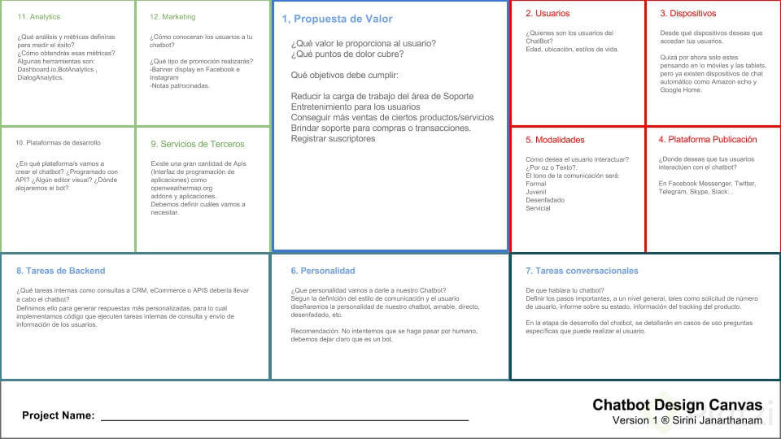
  <small><p>Chatbot design Canvas</p></small>
</div>

**Propuesta de Valor**

Debemos definir lo más importante para nuestro chatbot que problemas o necesidades está resolviendo a nuestros clientes o usuarios.

* ¿Qué valor le proporciona al usuario?
* ¿Qué puntos de dolor cubre?

**Usuarios**

¿Quienes serán los usuarios de nuestro chatbot? Tenemos que cuestionarnos sobre la edad, su ubicación, gustos, estilo de vida, y sin olvidar un factor importante su idioma. Entender bien quienes serán los que consumirán nuestro chatbot garantizara su éxito.

**Dispositivos**

Desde donde vivirá tu chatbot, desde un aplicación móvil, desde un sitio web, una integración en tu página web o en un futuro no lejano integrarlo a Amazon Alexa o Siri o Google Home.

**Plataformas de despliegue**

Donde vivirá tu chatbot, Hay muchas herramientas que te permiten crear un bot y añadirlo a Facebook Messenger, Twitter, Slack, Telegram, Twitter, elegir la mejor opción será también la clave para llegar a más usuarios.

**Modalidades**

Cómo será tu chatbot, formal, juvenil, servicial, desenfadado, como interactuar con el usuario, por texto, imagen, audio. Es importante elegir una modalidad para poder enfocar la construcción de la conversación que tendrá cara a los usuarios.

**Personalidad**

Una consideración que deben tener es no hacer pasar por humano a nuestro chatbot, es mejor hacerle ver al usuario que está interactuando con un bot y las limitantes que tiene para atenderlo. Una vez elegida una modalidad la personalidad la convención que le daremos a todo el flujo de nuestro chatbot.

**Tareas conversacionales**

En este punto debemos establecer los pasos importantes, las acciones principales que cumplirá y que serán parte esencial del flujo.

**Tareas de desarrollo**

Qué herramientas vamos a integrar, que servicios de terceros utilizamos, Mapas, Apis de consumo, almacenamiento y todas aquellas tareas que impliquen necesitar un servicio de terceros ajeno a nuestro desarrollo.

**Servicios de terceros**

Una vez establecidas las tareas vamos a elegir los servicios que usaremos o contrataremos para integrarlos en nuestro chatbot

**Plataforma de desarrollo del chatbot**

Cuales serán nuestras herramientas, que vamos a utilizar, donde se hospedara el servicio, qué recursos necesitaremos y todo lo que implique su construcción.

**Estadísticas**

La información que vamos a recopilar y que será parte fundamental para tomar decisiones importantes sobre el flujo que tendrá en un futuro o si el objetivo principal se está cumpliendo.

**Promoción**

Como vamos a promover nuestro servicio, cuál será la estrategia que vamos a tomar para llegar a nuestros usuarios y que estos interactúen con nuestro bot conversaciones.

<div align="right">
  <small><a href="#tabla-de-contenido">🡡 volver al inicio</a></small>
</div>

## Setup del entorno de trabajo con Facebook Developers

Es necesario tener una fanpage para poder crear un bot de Facebook. 

Es muy importante que te registres como desarrollador dentro de Facebook. Toda la documentación e información sobre el las tecnologías de Facebook puedes encontrarla en esta dirección: https://developers.facebook.com.

<div align="right">
  <small><a href="#tabla-de-contenido">🡡 volver al inicio</a></small>
</div>

## Messenger Platform Features

* **Envío de Mensajes**: Podemos enviar y recibir elementos multimedia, plantillas estructuradas y muchos elementos que nos van a permitir interactuar con nuestros usuarios. Nuestra aplicación va a consumir una API de imágenes de perritos, pero puedes usar las APIs que más te gusten: Spotify, Last.fm, Marvel o la que tu quieras.
* **Vistas Web**: Vamos a crear experiencias basadas en web sin necesidad de abrir una nueva pestaña en nuestro navegador.
* **Identificadores y perfil**: Personalización de nuestras conversaciones vinculando la autentificación de nuestros usuarios para ofrecer mejores experiencias a nuestros usuarios (saludándolos por su nombre, por ejemplo).
* **Extensiones del chat**: Podemos mejorar la experiencia de nuestros chats grupales en Facebook Messenger añadiendo nuestro bot a la conversación.
* **Procesamiento de Lenguaje Natural**: Mayor fluidez a nuestras conversaciones.
* **Estadísticas**: ¿Qué esta pasando con nuestro bot?. Tenemos acceso a muchísima información sobre las interacciones de nuestros usuarios.

<div align="right">
  <small><a href="#tabla-de-contenido">🡡 volver al inicio</a></small>
</div>

## Webhook

El Webhook es el lugar donde vivirá nuestro código y donde se vamos a enviar y recibir mensajes. 

Los requisitos para su correcto funcionamiento son:
* Compatibilidad con https.
* Un certificado https válido.
* Un puerto para recibir las peticiones GET y POST.

Para crear un webhook se va a usar algunas librerías:
* Express para crear el servidor
* body-parser para manjear el flujo de los que se recibe y envía.
* Request para enviar información al chatbot.

```bash
$ npm install express body-parser request
```

```js
'use strict'

const express = require('express')
const bodyParser = require('body-parser')
const request = require('request')

const app = express()

//Asignar un puerto
app.set('port', 5000) 

//Entender los elementos json que recibe el app
app.use(bodyParser.json()) 

app.get('/', function(req, res) {
  res.send('Hola mundo')
})

app.get('/webhook', function(req,res) {
  if(req.query['hub.verify_token'] === 'pugpizza_token') {
    res.send(req.query['hub.challenge'])
  }
  else {
    res.send('Pug Pizza no tienes permisos')
  }
})

app.listen(app.get('port'), function() {
  console.log('Nuestro servidor está funcionando en el puerto', app.get('port'))
})
```

<div align="right">
  <small><a href="#tabla-de-contenido">🡡 volver al inicio</a></small>
</div>

## Entorno y conexión del desarrollo local

**Nodemon** es una herramienta que facilitará el reinicio de nuestro servidor cuando hacemos cambios en el código.

```bash
$ npm i -g nodemon
```

Luego hay que instalar nodemon como dependencia de desarrollo:

```bash
$ npm i -D nodemon
```

Para levantar el servidor de nodemon solo hay que hacer el siguiente comando en consola:

```bash
$ nodemon app.js
```

**ngrok** es una herramienta con la que podemos exponer nuestro servidor local en una URL pública.

Para usarlo solo hay que seguir estos pasos:

* Crear una cuenta en ngrok para obtener un token.
* Descargar el binario de ngrok.
* Ejecutar en la terminal `ngrok http 5000`.

<div align="right">
  <small><a href="#tabla-de-contenido">🡡 volver al inicio</a></small>
</div>

## Conectar Messenger con el Servidor

Para poder conectar Messenger con el servidor que estamos desarrollando, hay que entrar a [Facebook Developers](https://developers.facebook.com) y hacer las configuraciones respectivas:

**1.** Ir a la aplicación del producto que se le quiere asignar el servidor.

**2.** Ir a Settings de Messenger.

**3.** Hacer click en Setup Webhooks en la sección de Webhooks.

<div align="center">
  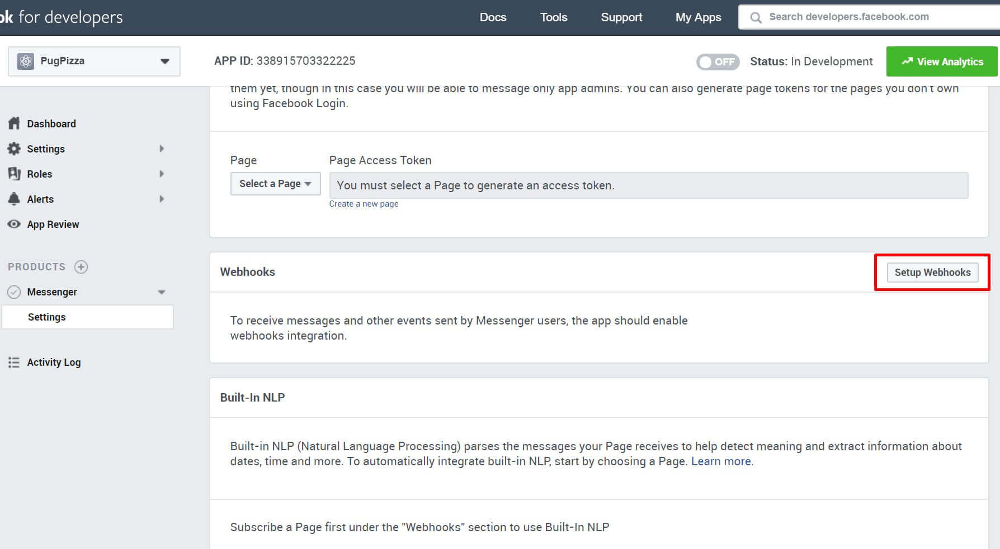
  <small><p>Abrir Panel de Configuración</p></small>
</div>

**4.** Se abrirá una ventana en donde se tienen que llegar los siguientes campos:

  * **Callback URL**: Dirección en donde se encuentra en webhook.
  * **Verify Token**: El token que se definió en `req.query['hub.verify_token']` dentro del GET de /webhook.
  * Una lista de opciones en los que se va a suscribir el chatbot.

<div align="center">
  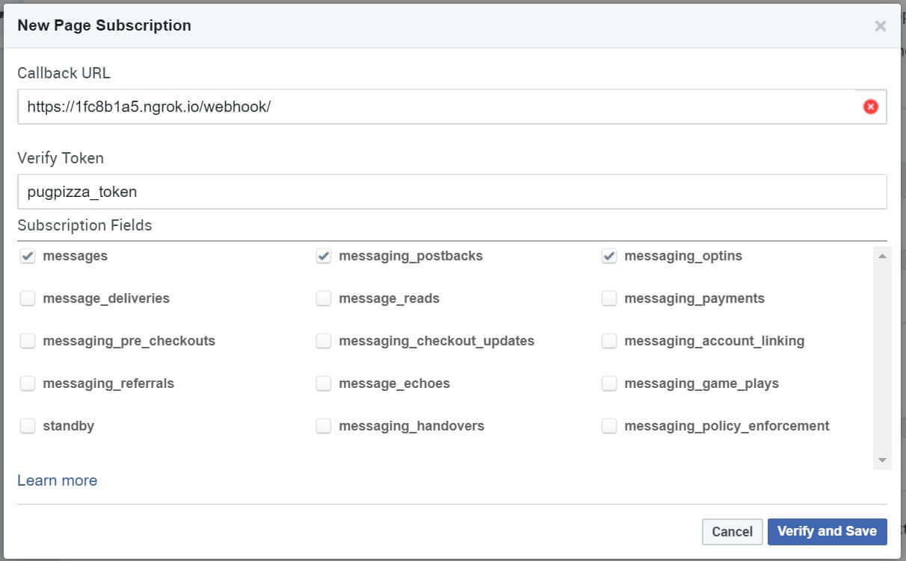
  <small><p>Configuración de Webhook</p></small>
</div>

**5.** Crear un token de acceso.

<div align="center">
  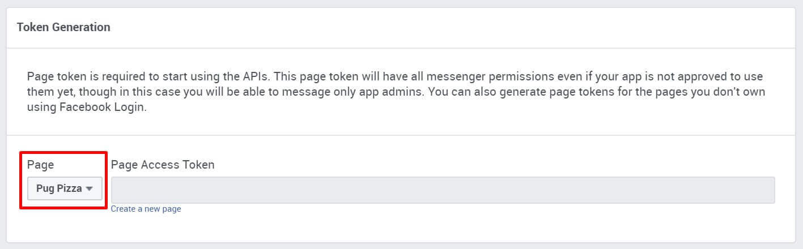
  <small><p>Creación de un token de acceso</p></small>
</div>

**6.** Suscribir la página al webhook configurado.

<div align="center">
  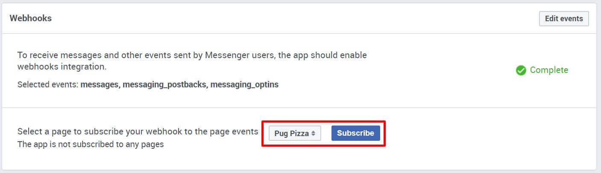
  <small><p>Asignación del Webhook</p></small>
</div>

<div align="right">
  <small><a href="#tabla-de-contenido">🡡 volver al inicio</a></small>
</div>

## Recibir un mensaje

```js
app.post('/webhook', function(req, res) {
  const webhook_event = req.body.entry[0]

  if(webhook_event.messaging) {
    webhook_event.messaging.forEach(event => {
     console.log(event)
    })
  }
  res.sendStatus(200);
})
```

<div align="right">
  <small><a href="#tabla-de-contenido">🡡 volver al inicio</a></small>
</div>

## Enviar un mensaje

```js
function handleMessage(event) {
  const senderId = event.sender.id
  const messageText = event.message.text
  const messageData = {
    recipient: {
      id: senderId
    },
    message: {
      text: messageText
    }
  }
  callSendApi(messageData)
}

function callSendApi(res) {
  request({
    'uri': 'https://graph.facebook.com/me/messages',
    'qs': {
      'access_token': access_token
    },
    'method': 'POST',
    'json': res
  },
  function(err) {
    if(err) {
      console.log('Ha ocurrido un error')
    }
    else {
      console.log('Mensaje enviado')
    }
  })
}
```

<div align="right">
  <small><a href="#tabla-de-contenido">🡡 volver al inicio</a></small>
</div>

## Curl

**Curl** es una librería que tiene funciones muy específicas para conectar con servidores y trabajar con ellos. Con curl vamos a poder configurar estas opciones.

<div align="right">
  <small><a href="#tabla-de-contenido">🡡 volver al inicio</a></small>
</div>

### Botón de Get Started

```bash
curl -X POST -H "Content-Type: application/json" -d '{
  "get_started": {
    "payload": "GET_STARTED_PUGPIZZA"
  }
}' "https://graph.facebook.com/v2.6/me/messenger_profile?access_token=[TOKEN]"
```

<div align="right">
  <small><a href="#tabla-de-contenido">🡡 volver al inicio</a></small>
</div>

### Mensaje de Bienvenida

```bash
curl -X POST -H "Content-Type: application/json" -d '{
  "greeting": [
    {
      "locale": "default",
      "text": "Hola {{user_first_name}}, Soy PugPizza y te recomiendo las mejores pizzas"
    },
    {
      "locale": "en_US",
      "text": "Hi {{user_first_name}}"
    }
  ]
}' "https://graph.facebook.com/v2.6/me/messenger_profile?access_token=[TOKEN]"
```

<div align="right">
  <small><a href="#tabla-de-contenido">🡡 volver al inicio</a></small>
</div>

### Menú Persistente

```bash
curl -X POST -H "Content-Type: application/json" -d '{
  "persistent_menu": [
    {
      "locale": "default",
      "composer_input_disabled": false,
      "call_to_actions": [
        {
          "title": "PugPizza",
          "type": "nested",
          "call_to_actions": [
            {
              "title": "Acerca",
              "type": "postback",
              "payload": "ABOUT_PAYLOAD"
            }
          ]
        },
        {
          "title": "Menu de Productos",
          "type": "nested",
          "call_to_actions": [
            {
              "title": "Pizzas",
              "type": "postback",
              "payload": "PIZZAS_PAYLOAD"
            }
          ]
        },
        {
          "title": "Pagina Web",
          "type": "web_url",
          "url": "https://platzi.com/bots-messenger/",
          "webview_height_ratio": "full"
        }
      ]
    }
  ]
}' "https://graph.facebook.com/v2.6/me/messenger_profile?access_token=[TOKEN]"
```

**composer_input_disabled** solo nos permite interactuar con tu bot mediante el menú persistente, postbacks, botones y vistas web.

<div align="right">
  <small><a href="#tabla-de-contenido">🡡 volver al inicio</a></small>
</div>

## Manejo de eventos

### Mensajes

```js
function handleMessage(senderId, event) {
  if (event.message && event.text) {
    const messageData = {
      "recipient": {
        "id": senderId
      },
      "message": {
        "text": "Hola, soy un bot de Messenger y te invito a utilizar nuestro menú"
      }
    }
    callSendApi(messageData)
  }
}
```

<div align="right">
  <small><a href="#tabla-de-contenido">🡡 volver al inicio</a></small>
</div>

### Postback

Los Postback son las acciones que vamos a enviar desde el menú o desde las opciones que tenemos en nuestro Bot.

```js
function handlePostback(event) {
  if(event.postback) {
    switch (event.postback.payload) {
      case "GET_STARTED_PUGPIZZA":
        console.log(payload)
        break;
    }
  }
}
```

<div align="right">
  <small><a href="#tabla-de-contenido">🡡 volver al inicio</a></small>
</div>

### Attachments

Los Attachments son todos los tipos de archivos adjuntos que podemos enviar desde Messenger: imágenes, audios, videos, entre otros. Nuestro bot debe responder dependiendo el Attachment que envíen nuestros usuarios.

```js
function handleAttachments(event) {
  if(event.attachments) {
    // ver el tipo de attachmnent
    let attachment_type = event.attachments[0].type
    console.log(JSON.stringify(event))
    
    switch (attachment_type) {
      case "image":
        break;
      case "video":
        break;
      case "audio":
        break;
      case "file":
        break;
      case "location":
        break;
    }
  }
}
```

<div align="right">
  <small><a href="#tabla-de-contenido">🡡 volver al inicio</a></small>
</div>

## Respuestas rápidas

Las respuestas rápidas nos ayudan a que nuestros usuarios elijan una opción (una respuesta) sin necesidad de escribirla.

```js
function defaultMessage(senderId) {
  const messageData = {
    "recipient": {
      "id": senderId
    },
    "message": {
      "text": "Escoge una opción del menú",
      "quick_replies": [
        {
          "content_type": "text",
          "title": "¿Quieres una pizza?",
          "payload": "PIZZAS_PAYLOAD"
        },
        {
          "content_type": "text",
          "title": "Acerca de",
          "payload": "ABOUT_PAYLOAD"
        }
      ]
    }
  }
  callSendApi(messageData)
}
```

Para poder ver el payload de los quick reply, se hace de la siguiente forma:

```js
if (event.message.quick_reply) {
  handlePostback(senderId, event.message.quick_reply.payload);
}
```

<div align="right">
  <small><a href="#tabla-de-contenido">🡡 volver al inicio</a></small>
</div>

## Enviar Ubicación

<div align="center">
  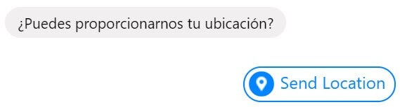
  <small><p>Solicitar Ubicación</p></small>
</div>

```js
function getLocation(senderId) {
  const messageData = {
    "recipient": {
      "id": senderId
    },
    "message": {
      "text": "¿Puedes proporcionarnos tu ubicación?",
      "quick_replies": [
        {
          "content_type": "location"
        }
      ]
    }
  }
  sendMessage(senderId, messageData)
}
```

<div align="right">
  <small><a href="#tabla-de-contenido">🡡 volver al inicio</a></small>
</div>

## Acciones de envío

Las acciones de envío nos ayudan a dejar en visto, marcar como leído o mandar la acción de que estamos escribiendo. De esta forma nuestros usuarios van a sentir que están interactuando con una persona aunque en realidad sea un bot.

```js
function senderActions(senderId) {
  const messageData = {
    "recipient": {
      "id": senderId
    },
    "sender_action": "typing_on"
  }
  callSendApi(messageData)
}
```

**Tipos de sender actions**:
* **mark_seen**: Marca el último mensaje como leído.
* **typing_on**: Activa los indicadores de escritura.
* **typing_off**: Desactiva los indicadores de escritura.

`senderActions()` debe de llamarse antes de `callSendApi()`.

<div align="right">
  <small><a href="#tabla-de-contenido">🡡 volver al inicio</a></small>
</div>

## Fotos

```js
function messageImage(senderId) {
  const messageData = {
    "recipient": {
      "id": senderId
    },
    "message": {
      "attachment": {
        "type": "image",
        "payload": {
          "url": "https://media.giphy.com/media/1dOIvm5ynwYolB2Xlh/giphy.gif"
        }
      }
    }
  }
  sendMessage(senderId, messageData)
}
```

<div align="right">
  <small><a href="#tabla-de-contenido">🡡 volver al inicio</a></small>
</div>

## Templates

### Generico

<div align="center">
  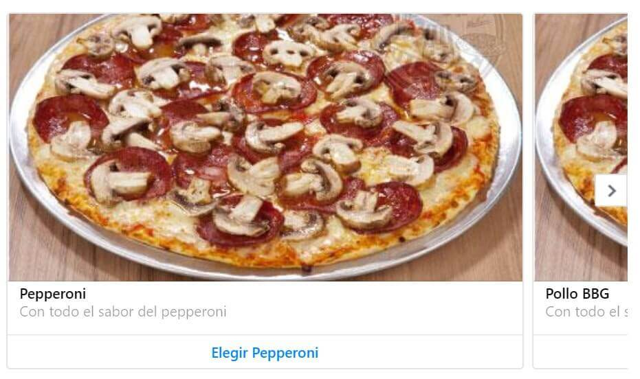
  <small><p>Template Genérico</p></small>
</div>

```js
function templateGenerico(senderId) {
  const messageData = {
    "recipient": {
      "id": senderId
    },
    "message": {
      "attachment": {
        "type": "template",
        "payload": {
          "template_type": "generic",
          "elements": [
            {
              "title": "Pepperoni",
              "subtitle": "Con todo el sabor del pepperoni",
              "image_url": "https://s3.amazonaws.com/chewiekie/img/productos-pizza-peperoni-champinones.jpg",
              "buttons": [
                {
                  "type": "postback",
                  "title": "Elegir Pepperoni",
                  "payload": "PEPPERONI_PAYLOAD"
                }
              ]
            },
            {
              "title": "Pollo BBG",
              "subtitle": "Con todo el sabor de BBQ",
              "image_url": "https://s3.amazonaws.com/chewiekie/img/productos-pizza-peperoni-champinones.jpg",
              "buttons": [
                {
                  "type": "postback",
                  "title": "Elegir Pollo BBQ",
                  "payload": "BBQ_PAYLOAD"
                }
              ]
            }
          ]
        }
      }
    }
  }
  sendMessage(senderId, messageData)
}
```

<div align="right">
  <small><a href="#tabla-de-contenido">🡡 volver al inicio</a></small>
</div>

### Listas

<div align="center">
  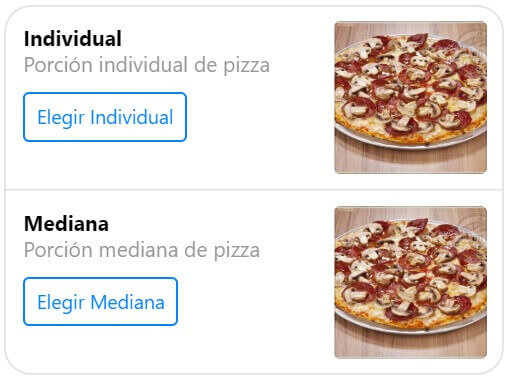
  <small><p>Template Listas</p></small>
</div>

```js
function templateListas(senderId) {
  const messageData = {
    "recipient": {
      "id": senderId
    },
    "message": {
      attachment: {
        "type": "template",
        "payload": {
          "template_type": "list",
          "top_element_style": "large",
          "elements": [
            {
              "title": "Individual",
              "image_url": "https://s3.amazonaws.com/chewiekie/img/productos-pizza-peperoni-champinones.jpg",
              "subtitle": "Porción individual de pizza",
              "buttons": [
                {
                  "type": "postback",
                  "title": "Elegir Individual",
                  "payload": "PERSONAL_SIZE_PAYLOAD"
                }
              ]
            },
            {
              "title": "Mediana",
              "image_url": "https://s3.amazonaws.com/chewiekie/img/productos-pizza-peperoni-champinones.jpg",
              "subtitle": "Porción mediana de pizza",
              "buttons": [
                {
                  "type": "postback",
                  "title": "Elegir Mediana",
                  "payload": "MEDIUM_SIZE_PAYLOAD"
                }
              ]
            }
          ]
        }
      }
    }
  }
  sendMessage(senderId, messageData)
}
```

<div align="right">
  <small><a href="#tabla-de-contenido">🡡 volver al inicio</a></small>
</div>

### Botón

<div align="center">
  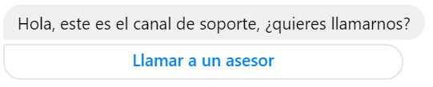
  <small><p>Template Botón</p></small>
</div>

```js
function templateButton(senderId) {
  const messageData = {
    "recipient": {
      "id": senderId
    },
    "message": {
      "attachment": {
        "type": "template",
        "payload": {
          "template_type": "button",
          "text": "Hola, este es el canal de soporte, ¿quieres llamarnos?",
          "buttons": [
            {
              "type": "phone_number",
              "title": "Llamar a un asesor",
              "payload": "+5412236520"
            }
          ]
        }
      }
    }
  }
  sendMessage(senderId, messageData)
}
```

<div align="right">
  <small><a href="#tabla-de-contenido">🡡 volver al inicio</a></small>
</div>

### Webviews

Los Webviews nos permiten mostrar una página web dentro de Messenger sin necesidad de abrir un navegador, podemos mostrar elementos mucho más complejos (mapas, por ejemplo).

<div align="center">
  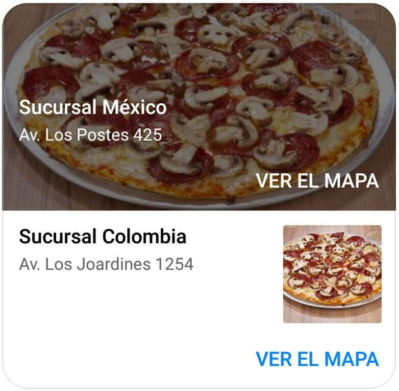
  <small><p>Template Webview</p></small>
</div>

```js
function templateWebview(senderId) {
  const messageData = {
    "recipient": {
      "id": senderId
    },
    "message": {
      "attachment": {
        "type": "template",
        "payload": {
          "template_type": "list",
          "top_element_style": "large",
          "elements": [
            {
              "title": "Sucursal México",
              "image_url": "https://s3.amazonaws.com/chewiekie/img/productos-pizza-peperoni-champinones.jpg",
              "subtitle": "Av. Los Postes 425",
              "buttons": [
                {
                  "title": "Ver el mapa",
                  "type": "web_url",
                  "url": "https://goo.gl/maps/GCCpWmZep1t",
                  "webview_height_ratio": "full"
                }
              ]
            },
            {
              "title": "Sucursal Colombia",
              "image_url": "https://s3.amazonaws.com/chewiekie/img/productos-pizza-peperoni-champinones.jpg",
              "subtitle": "Av. Los Joardines 1254",
              "buttons": [
                {
                  "title": "Ver el mapa",
                  "type": "web_url",
                  "url": "https://goo.gl/maps/GCCpWmZep1t",
                  "webview_height_ratio": "tall"
                }
              ]
            }
          ] 
        }
      }
    }
  }
  sendMessage(senderId, messageData)
}
```

<div align="right">
  <small><a href="#tabla-de-contenido">🡡 volver al inicio</a></small>
</div>

### Recibos

<div align="center">
  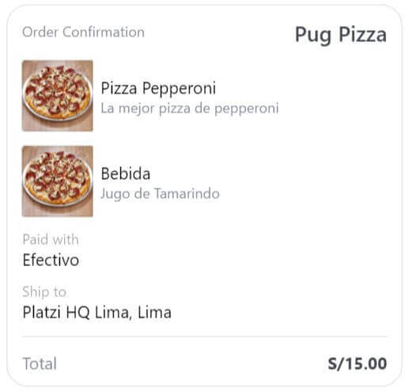
  <small><p>Template Recibo</p></small>
</div>

<div align="center">
  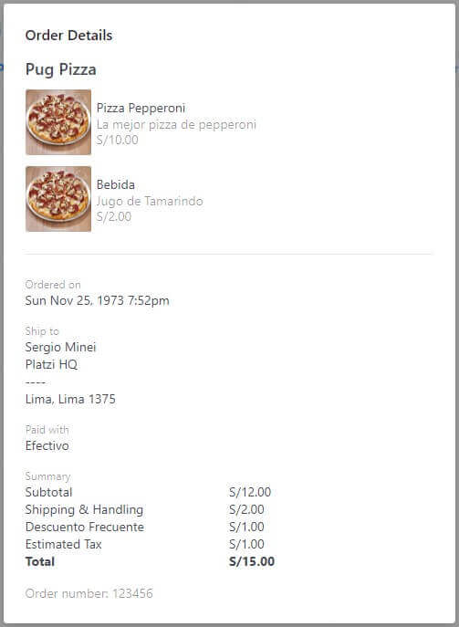
  <small><p>Detalles del Recibo</p></small>
</div>

```js
function templateReceipt(senderId) {
  const messageData = {
    "recipient": {
      "id": senderId
    },
    "message": {
      "attachment": {
        "type": "template",
        "payload": {
          "template_type": "receipt",
          "recipient_name": "Sergio Minei",
          "order_number": "123456",
          "currency": "PEN",
          "payment_method": "Efectivo",
          "order_url": "https://platzi.com/order/123456",
          "timestamp": "123123123",
          "address": {
            "street_1": "Platzi HQ",
            "street_2": "----",
            "city": "Lima",
            "postal_code": "1375",
            "state": "Lima",
            "country": "Peru"
          },
          "summary": {
            "subtotal": 12.00,
            "shipping_cost": 2.00,
            "total_tax": 1.00,
            "total_cost": 15.00
          },
          "adjustments": [
            {
              "name": "Descuento Frecuente",
              "amount": 1.00
            }
          ],
          "elements": [
            {
              "title": "Pizza Pepperoni",
              "subtitle": "La mejor pizza de pepperoni",
              "quantity": 1,
              "price": 10,
              "currency": "PEN",
              "image_url": "https://s3.amazonaws.com/chewiekie/img/productos-pizza-peperoni-champinones.jpg"
            },
            {
              "title": "Bebida",
              "subtitle": "Jugo de Tamarindo",
              "quantity": 1,
              "price": 2,
              "currency": "PEN",
              "image_url": "https://s3.amazonaws.com/chewiekie/img/productos-pizza-peperoni-champinones.jpg"
            }
          ]
        }
      }
    }
  }
  sendMessage(senderId, messageData)
}
```

<div align="right">
  <small><a href="#tabla-de-contenido">🡡 volver al inicio</a></small>
</div>

## Enlaces de Interés
* [Curso de Bots con Facebook Messenger](https://platzi.com/clases/bots-fb/)
* [Repositorio del Curso](https://github.com/gndx/pugpizza)
* [Facebook Developers](https://developers.facebook.com)
* [NGrok](https://ngrok.com)

<div align="right">
  <small><a href="#tabla-de-contenido">🡡 volver al inicio</a></small>
</div>
