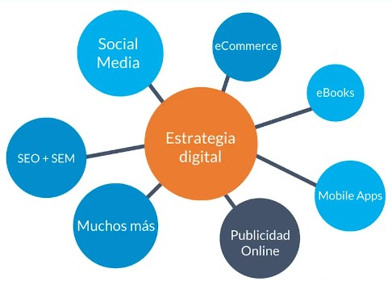
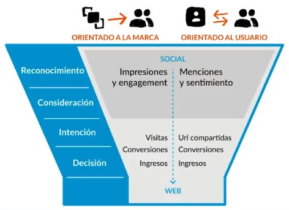

# Curso de Bots con Facebook Messenger<!-- omit in toc -->

## Tabla de Contenido<!-- omit in toc -->

## Beneficios de las Redes Sociales

* Exposición y reconocimiento
* Ventas
* Tráfico hacia un sitio web
* Branding
* Posicionamiento en buscadores
* Seguidores

## Objetivos

Uno de los objetivos de las redes sociales es entretener. El contenido entretenido es relevante y se va a quedar en la cabeza de las personas que nos están siguiendo.

* Entretener
* Informar
* No vender directamente
* Dirigir tráfico
* Conversar

## Estrategia digital

La estrategia digital es un conjunto de tácticas en Internet que nos va a llevar a nuestro objetivo.

  
  <small>
Estrategia Digital
</small>

  
  <small>
Proceso de Conversión
</small>

Cuando estés manejando una estrategia de redes sociales, también estás manejando tráfico de sitio web, tratando con ingresos de clientes, url.

## El Community Manager

Las comunidades son todas las personas que están en Internet y nos siguen de alguna manera. El community manager es la persona que maneja esas comunidades.

El CM es:
* El puente entre el cliente y la comunidad.
* Responsable de la voz de la marca.
* Escucha

  
  <small>
Diferencias entre el CM y el Social Media Manager
</small>

### Características del CM

* Es constante
* Excelente redacción y habilidad de copywriting
* Marca personal
* Tiene habilidades sociales
* Tiene habilidades técnicas
* Tiene conocimientos de marketing
* Lee e investiga sobre tendencias
* Es neutro, ético y paciente
* Mide sus avances y establece KPI’s

## Plataformas de redes sociales

**Twitter**: Red social de microblogging, es la segunda más grande del mundo.

* Post en texto, imagen, encuestas y video.
* Permite geolocalización.
* Uso de HT.
* Tending Topics.
* Momentos.

**Facebook**: Es la red social más grande del mundo y es 
multimedial.

* Es la red social más grande del mundo.
* Post en texto, imágenes, historias, video.
* Tiene reacciones.
* Permite geolocalizar.
* Se enfoca en Ads.

**Youtube**: Es el segundo buscador más usado del mundo, el contenido se filtra por categorías.

* Es una red social "no social".
* Formato video y post.
* El contenido se filtra por categorías.
* Formato d suscripción.
* Like, comentarios, shares.

**Instagram**: Permite publicar fotos y hacer historias.

* Post en formato foto o video.
* Permite uso de HT.
* Permite geolocalización.
* Se pueden crear campañas pagas de exposición.

**LinkedIn**: Es una red profesional y de negocios.

* Es una red profesional y de negocios.
* Likes, comentarios, menciones.

**Pinterest**: Permite tener referentes visuales valiosos para crear contenidos propios adaptados a las necesidades de cada marca.

* Moodboard.
* Enfocada en e-commerce.
* Permite el uso de HT.
* Bucle de contenido.
* La mayoría de usuarias son muejeres.

## Recursos Complementarios
* [Proyecto Smart Contracts](docs/slides-curso-community-manager.pdf)

  <small><a href="#tabla-de-contenido">🡡 volver al inicio</a></small>

## Enlaces de Interés
* [Curso de Community Manager](https://platzi.com/clases/community-manager/)

  <small><a href="#tabla-de-contenido">🡡 volver al inicio</a></small>

