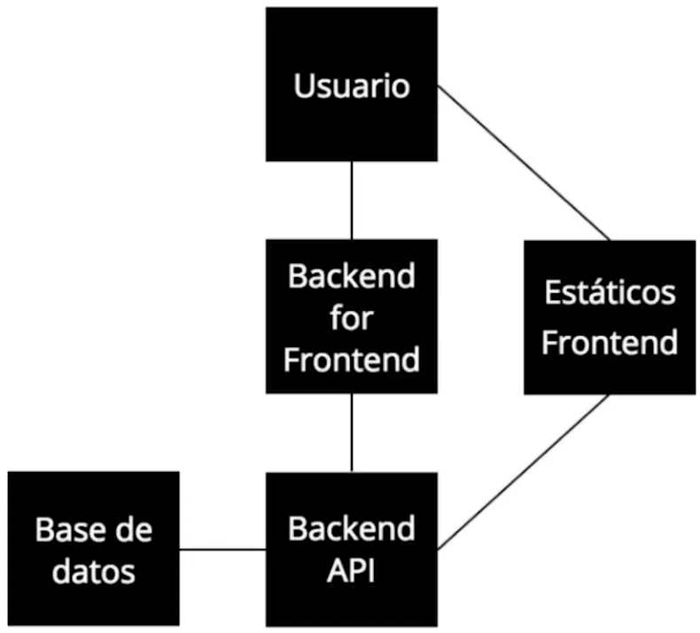
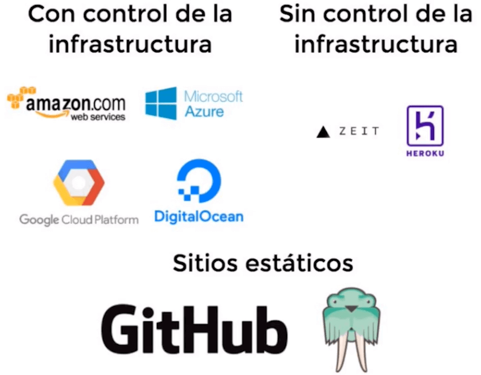
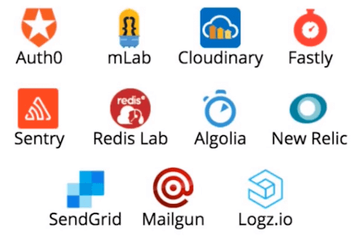

# Curso de Deploy con Now.sh<!-- omit in toc -->

## Tabla de Contenido<!-- omit in toc -->
- [Componentes de una aplicación](#componentes-de-una-aplicación)
- [Flujo de una Aplicación Web](#flujo-de-una-aplicación-web)
- [Opciones para hacer deploy](#opciones-para-hacer-deploy)
- [¿Por qué Zeit Now?](#por-qué-zeit-now)
- [Aplicaciones monolíticas vs microservicios](#aplicaciones-monolíticas-vs-microservicios)
  - [Aplicaciones monolíticas](#aplicaciones-monolíticas)
  - [Microservicios](#microservicios)
  - [Orquestación y Coreografía de Servicios](#orquestación-y-coreografía-de-servicios)
- [Instalación de Now](#instalación-de-now)
  - [Deploy de aplicaciones estáticas](#deploy-de-aplicaciones-estáticas)
  - [Github Pages](#github-pages)
  - [Surge](#surge)
  - [Now](#now)
- [Deploy a Node.js](#deploy-a-nodejs)
- [Deploy de contenedores de Docker](#deploy-de-contenedores-de-docker)
- [Variables de Entorno](#variables-de-entorno)
- [Secrets](#secrets)
- [Ver el Código Fuente](#ver-el-código-fuente)
- [Definir Aliases](#definir-aliases)
- [Dominio Personalizado](#dominio-personalizado)
- [Componer Microservicios](#componer-microservicios)
- [Deploy desde Github](#deploy-desde-github)
- [Ejemplo de now.json](#ejemplo-de-nowjson)
- [Enlaces de Interés](#enlaces-de-interés)

## Componentes de una aplicación

Actualmente una aplicación "moderna" esta compuesta por varias partes (algunas aplicaciones tienen más que otras), las cuales son:

* **Archivos estáticos o Frontend**: Estos archivos no cambian y son enviados al usuario por medio de un CDN. Estos archivos pueden ser imágenes, js, css, fuentes, audios. videos, etc.
* **Backend for Frontend**: Servidor que pide datos al API y responde HTML al usuario.
* **Backend API**: Puede estar hecho en cualquier tecnología e incluso puede estar dividido en múltiples aplicaciones pequeñas encargadas de distintas responsabilidades cada una. El API se comunica con la base de datos.
* **Bases de datos (DB)**: Es donde se almacena los datos de la aplicación. Puede ser cualquier base de datos e incluso puede ser más de una.

**Definiciones importantes**:
* **CDN** = Content Delivering Network. Muchos servidores distribuidos por todo el mundo proveer de estos archivos comunes y que no están generados dinámicamente a nuestros usuarios y que puedan acceder rápidamente a ellos.
* **API** = Aplication Programming Interface. Representa la capacidad de comunicación entre componentes de software.

<div align="right">
  <small><a href="#tabla-de-contenido">🡡 volver al inicio</a></small>
</div>

## Flujo de una Aplicación Web

<div align="center">
  
  <small><p>Flujo de una Aplicación Web</p></small>
</div>

¿Cómo es el flujo de un usuario en una aplicación?
1. El usuario accede al backend for frontend.
2. El backend for frontend le pide los datos al backend API.
3. el backend API va a leer los datos de la base de datos.
4. La base de datos le va a dar la respuesta de su query.
5. El backend API va a parsear los datos en un json.
6. El backend API envía el json al frontend.
7. El frontend genera con el json el HTML.
8. El frontend envía el HTML al usuario.
9. El usuario va a descargar los estáticos de frontend.
10. El usuario recibe el css, js, imágenes, etc.
11. Con el js descargado, el usuario puede iniciar una aplicación del lado de cliente.
12. El js se puede conectar directamente con el backend API e interactuar directamente sin pasar por el backend for frontend.

<div align="right">
  <small><a href="#tabla-de-contenido">🡡 volver al inicio</a></small>
</div>

## Opciones para hacer deploy

* **[Amazon Web Services](https://aws.amazon.com/es/)**: Es el más grande de todas las opciones para hacer deploy.
* **[Microsoft Azure](https://azure.microsoft.com/)**: Es muy buenas para deploys con MS SQL y C#.
* **[Google Cloud Platform](https://cloud.google.com/)**: Tiene un montón de servicios. Una ventaja es que tiene varias API propias de Google que se pueden integrar en la aplicación.
* **[Heroku](https://www.heroku.com/)**: permite hacer deploy sin tener que pensar en cómo va a funcionar al app por debajo ni la infraestructura de esta.
* **[Digital Ocean](https://www.digitalocean.com/)**: permite tener un servidor privado y empezar a encontrar todo lo que se quiere ahí.
* **[GitHub Pages](https://pages.github.com/)**: Permite hacer el deploy de archivos estáticos. Es completamente gratis pero el código es open source.
* **[Surge.sh](https://surge.sh/)**: Permite hacer deploys estáticos muy fácilmente por medio de un CLI.
* **[Zeit Now](https://zeit.co/now)**: Es una plataforma para hacer deploy de todo tipo de aplicaciones. No permite hacer deploy de base de datos.

<div align="center">
  
  <small><p>Opciones de Deploy</p></small>
</div>

Control de la infraestructura se referiere a poder controlar cómo funciona la aplicación por debajo:
* ¿Cuántos servidores hay?
* ¿Qué tipo de servidores son?
* ¿Qué hardware tienen?

<div align="right">
  <small><a href="#tabla-de-contenido">🡡 volver al inicio</a></small>
</div>

## ¿Por qué Zeit Now?

**Tipos de deploy**:
* Aplicación de Node.js
* Sitios estáticos
* Contenedores de Docker

**Deploy fáciles**:
* Con un comando: `now`
* con un drag & drop con el cliente.

**Características**:
* Es fácil. Todo se hace con un solo comando.
* Escala automáticamente. Se crean instancias dependiendo del tráfico de la aplicación.
* Deploy inmutable. Cada deploy genera una url única.
* Deploy sin caída. Al escalar automáticamente y generar una nueva url en cada deploy, se puede asegurar la continuidad de la aplicación.
* Deploy ilimitados.
* HTTP2 automáticamente.
* Certificado SSL gratis.
* Logs por deploy.
* DNS (zeit.world).
* Permite comprar dominios por CLI.

<div align="right">
  <small><a href="#tabla-de-contenido">🡡 volver al inicio</a></small>
</div>

## Aplicaciones monolíticas vs microservicios

<div align="center">
  
  <small><p>Monolítico vs Microservicios</p></small>
</div>

<div align="right">
  <small><a href="#tabla-de-contenido">🡡 volver al inicio</a></small>
</div>

### Aplicaciones monolíticas

Todo el código está en una solo aplicación.

**Ventajas**:
* Buena para aplicaciones pequeñas.
* Fácil de desarrollar.
* Fácil de hacer deploy.
* Fácil para trabajar individual o en equipos pequeños.

**Desventajas**:
* Difícil de mantener a largo plazo.
* Costosa para escalar.
* En caso de un error se puede caer toda la aplicación.
* Más difícil testear.
* Más difícil de depurar.

<div align="right">
  <small><a href="#tabla-de-contenido">🡡 volver al inicio</a></small>
</div>

### Microservicios

El código está dividido en varias aplicaciones.

**Ventajas**:
* Fácil de hacer deploy.
* Fácil de escalar.
* Fácil de testear.
* Fácil de depurar.
* En caso de error, solo se cae un servicio.
* Se pueden utilizar diferentes tecnologías.

**Desventajas**:
* Difícil de orquestar.
* Puede ser lenta la comunicación entre servicios.
* Difícil saber cómo dividir nuestra aplicación.
* Es más costoso de mantener.

Cuando se usa microservicios, se tiende a hacer servicios de terceros que realicen parte de la aplicación.

<div align="center">
  
  <small><p>Servicios de Terceros</p></small>
</div>

<div align="right">
  <small><a href="#tabla-de-contenido">🡡 volver al inicio</a></small>
</div>

### Orquestación y Coreografía de Servicios

Ambos conceptos se basan en cómo hacer para comunicar nuestros servicios y que todo funcione como si fuera una sola aplicación.

**Orquestación**: El servicio ‘A’ manda peticiones HTTP avisando que ya terminó su tarea. El código de peticiones del servicio ‘A’ depende de la cantidad de servicios a los que deba avisar que terminó su tarea.

**Coreografía**: Servicio general de suscripciones a canales. Los servicios ajenos al servicio ‘A’ van a estar (o no) a la escucha de la finalización de la tarea del servicio ‘A’. No hace falta modificar el código del servicio ‘A’, ya que al agregar un nuevo servicio se pondría éste a la escucha de la finalización de la tarea del servicio ‘A’.

<div align="right">
  <small><a href="#tabla-de-contenido">🡡 volver al inicio</a></small>
</div>

## Instalación de Now

```bash
$ npm install -g now
```

<div align="right">
  <small><a href="#tabla-de-contenido">🡡 volver al inicio</a></small>
</div>

### Deploy de aplicaciones estáticas

### Github Pages

Github Pages se usa mucho para documentar librerías.

1. Settings
2. Ir a la sección Github Pages.
3. En source marcar master branch.
4. Clic a save.
5. Si la barra está en un color rojo tenue, significa que aún está en proceso.
6. Cuando la barrita está en verde significa que está hecho el deploy.

<div align="right">
  <small><a href="#tabla-de-contenido">🡡 volver al inicio</a></small>
</div>

### Surge

Para usar Surge, primero se debe de instalar:

```
npm install -g surge
```

Luego vas a la carpeta del proyecto con la consola.

Escribes el comando `surge`.

<div align="right">
  <small><a href="#tabla-de-contenido">🡡 volver al inicio</a></small>
</div>

### Now

1. Ir a la capeta del proyecto
2. Escribir el comando `now`.

Si se desea cambiar la url generada se puede hacer de la siguiente manera:

```
now alias URL_AUTOGENERADA alias.now.sh
```

<div align="right">
  <small><a href="#tabla-de-contenido">🡡 volver al inicio</a></small>
</div>

## Deploy a Node.js

Para hacer deploy a una aplicación en node.js, hay que crear un archivo **now.json**.

En ese eschivo, escribir lo siguiente:

```json
{
  "name": "platzi-now-bff",
  "type": "npm"
}
```

<div align="right">
  <small><a href="#tabla-de-contenido">🡡 volver al inicio</a></small>
</div>

## Deploy de contenedores de Docker

* **pubsub** = Nos sirve para tener una forma de comunicarnos cuando hacemos la parte de las suscripciones en real time.
* **resolvers** = Nos sirven para saber qué hacer en cada query o cada cambio que el navegador envía al API.
* **squema** = Le escribimos todo el esquema de datos que tiene nuestra aplicación, los datos que existen.
* **server** = Donde inicializamos el servidor, sincronizamos el modelo con la base de datos, creamos el servidor express y creamos todo lo que necesitamos para correr en producción.

```json
{
  "name": "platzi-now-api",
  "type": "docker"
}
```

<div align="right">
  <small><a href="#tabla-de-contenido">🡡 volver al inicio</a></small>
</div>

## Variables de Entorno

Para crear variables de enterno, se añade un key **env** en el archivo now.json.

```json
{
  "name": "platzi-now-bff",
  "env": {
    "NODE_ENV": "production",
    "PORT": "3000",
    "HOST": "0.0.0.0",
    "DB_USER": "cobliwpv",
    "DB_PASS": "",
    "DB_HOST": "stampy.db.elephantsql.com",
    "DB_NAME": "cobliwpv",
    "DB_PORT": "5432"
  },
  "type": "docker"
}

```

<div align="right">
  <small><a href="#tabla-de-contenido">🡡 volver al inicio</a></small>
</div>

## Secrets

En ocasiones, se necesita almacenar información confidencial del proyecto que solo debe ser accedida con el código en ejecución. Esto puede lograrse usando **secrets**.

Una vez que almacena un secreto, sus contenidos ya no son accesibles directamente por nadie. Solo pueden estar expuestos a implementaciones como variables de entorno.

* `now secret add [key] [valor]` Permite agregar un nuevo secrets.
* `now secret rename [key] [valor]` Permite renombrar un secrets.
* `now secret rm [key] [valor]` Permite eliminar un secrets.
* `now secret ls` Permite listar todos los secrets.

Para usar los secrets en el archivo now.json, se hace de la siguiente manera:

```json
{
  "env": {
    "DB_USER": "@platzi_now_db_user",
    "DB_PASS": "@platzi_now_db_pass"
  }
}
```

<div align="right">
  <small><a href="#tabla-de-contenido">🡡 volver al inicio</a></small>
</div>

## Ver el Código Fuente

Para ver el código fuente del proyecto, solo hay que poner **/_src** al final de la url de now.

```
https://podcast-dadzjorpfe.now.sh/_src
```

* En el plan **free** de now, el código fuente es open source.
* En el plan **premium**, hay que estar logueado para poder ver el codigo fuente.

<div align="right">
  <small><a href="#tabla-de-contenido">🡡 volver al inicio</a></small>
</div>

## Definir Aliases

Para definir un alias dentro de nuestro pyoyecto, lo podemos hacer desde nuestro archivo **now.json**:

```json
{
  "alias": "platzi-now-api.now.sh"
}
```

Para ejecutar el alias, se debe ir a la carpeta del proyecto y escribir `now alias`.

Cuando utilizamos `now alias`, se va a tomar el último deploy que se hizo y va a conectarlo al alias que hayamos creado.

<div align="right">
  <small><a href="#tabla-de-contenido">🡡 volver al inicio</a></small>
</div>

## Dominio Personalizado

Zeit.world es un DNS gratiuto global que Zeit nos da para manejar los dominios.

**Si ya se tiene un dominio**:

1. Ir a la configuración de Nameservers del dominio.
2. Escoger Custom DNS
3. Agregar unos de los hostnames que aparecen en la página de [Zeit World](https://zeit.co/world). Se pueden agregar hasta 4.

```
Host	IP	IPV6
a.zeit.world	96.45.80.1	2600:180a:1001::1
b.zeit.world	46.31.236.1	2600:180b:2001::1
c.zeit.world	43.247.170.1	2600:180c:3001::1
d.zeit.world	96.45.81.1	2600:180a:4001::1
e.zeit.world	46.31.237.1	2600:180b:5001::1
f.zeit.world	43.247.171.1	2600:180c:6001::1
```

**Comprar dominio desde Zeit Domains**:

Zeit te permite comprar dominios directamente desde su servicio.

```bash
$ now domain buy pagina.com
```

**Asignar un dominio como alias**:

También se puede asignar un dominio como el alias de un deploy.

```bash
$ now alias my-app-fdhdsd45.now.sh pagina.com
```

Otra forma de hacerlo es agregando el key alias en now.json.

```json
{
  "alias": "pagina.com"
}
```

Nota: Para que el alias funcione, primero se debe de hacer configurado el hostname o haber comprado el dominio directamente desde now domains.

<div align="right">
  <small><a href="#tabla-de-contenido">🡡 volver al inicio</a></small>
</div>

## Componer Microservicios

La forma de gestionar una aplicación basada en microservicios es por medio de un archivo llamada **rules.json**.

```json
{
  "rules": [
    {
      "pathname": "/graphql",
      "dest": "app.now.sh"
    },
    {
      "pathname": "/[ruta]",
      "dest": "app.now.sh"
    },
    {
      "dest": "app-principal.now.sh"
    }
  ]
}
```

Para establecer la configuración se ejecuta el comando:

`now alias [aplicacion].now.sh -r rules.json` Permite establecer las configuraciones de rules.json en un deploy de Now.sh.

<div align="right">
  <small><a href="#tabla-de-contenido">🡡 volver al inicio</a></small>
</div>

## Deploy desde Github

Se puede hacer deploy directamente a un repositorio de Github 

```
now [usuario]/[repositorio]
```

<div align="right">
  <small><a href="#tabla-de-contenido">🡡 volver al inicio</a></small>
</div>

## Ejemplo de now.json

```json
{
  "name": "nombre-de-la-aplicacion",
  "alias": "[alias-personalizado].now.sh",
  "env": {
    "NODE_ENV": "production",
    "PORT": "3000",
    "HOST": "0.0.0.0",
    "DB_USER": "@[db_user]",
    "DB_PASS": "@[db_pass]",
    "DB_HOST": "@[db_host]",
    "DB_NAME": "@[db_name]",
    "DB_PORT": "27017"
  },
  "type": "[npm]/[docker]/[static]"
}
```

<div align="right">
  <small><a href="#tabla-de-contenido">🡡 volver al inicio</a></small>
</div>

## Enlaces de Interés
* [Curso de Deploy con Now.sh](https://platzi.com/clases/deploy-now)
* [Platzi Now](https://platzi-now.now.sh/)
* [Github: Platzi Now](https://github.com/platzi/now-course)
* [Zeit Now](https://zeit.co/now)
* [Zeit World](https://zeit.co/world)
* [Zeit Docs](https://zeit.co/docs)
* [Now Examples](https://github.com/now-examples)
* [Awesome Zeit](https://github.com/zeit/awesome-zeit)
  
<div align="right">
  <small><a href="#tabla-de-contenido">🡡 volver al inicio</a></small>
</div>