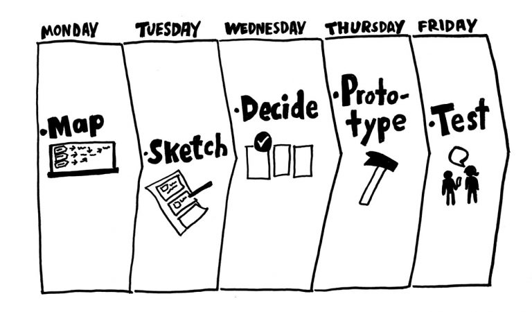
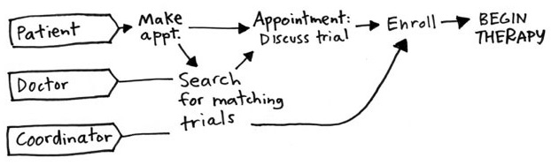
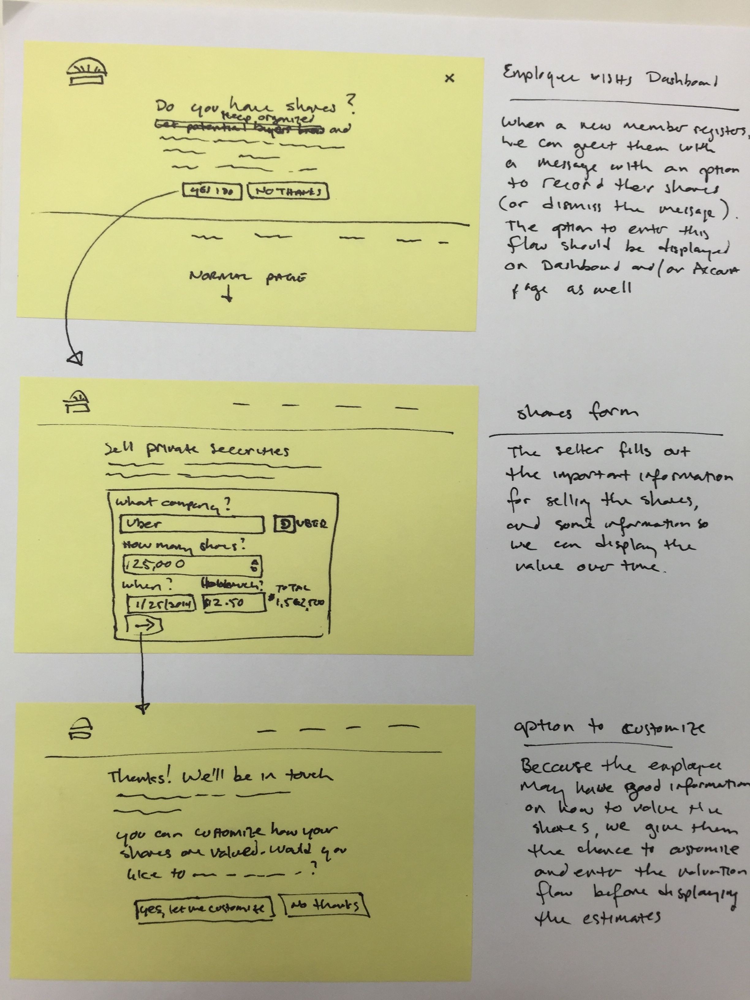
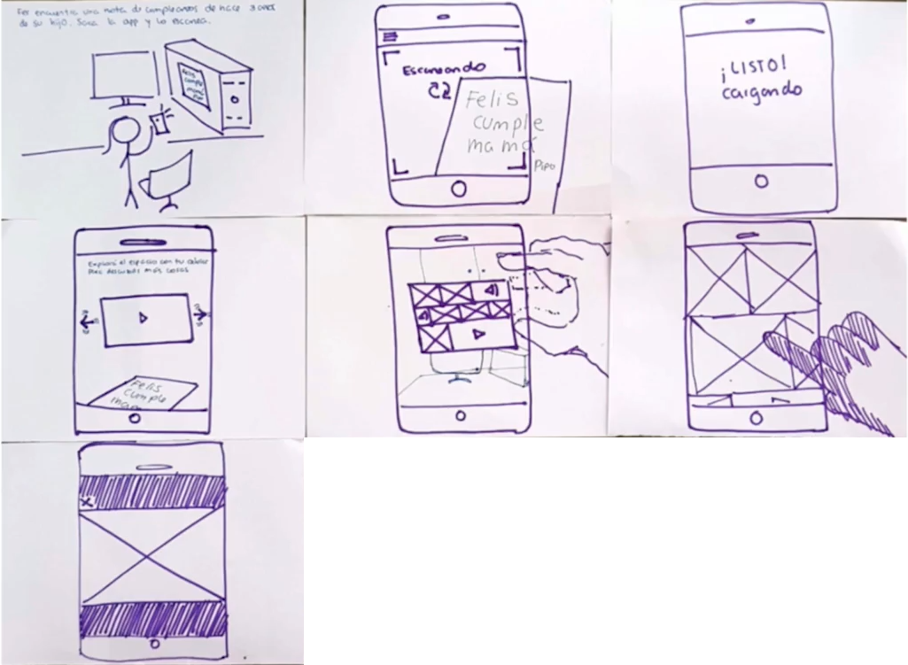
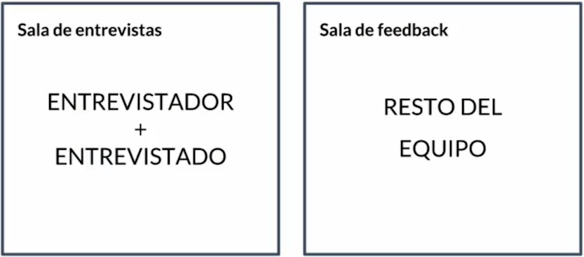
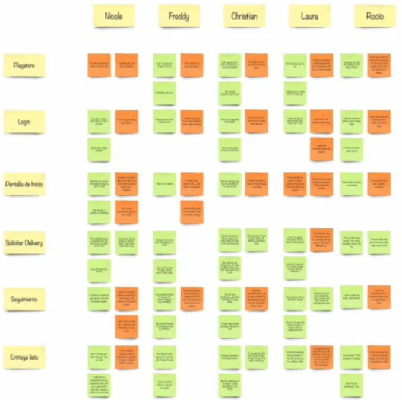

# Curso de Design Sprint<!-- omit in toc -->

## Tabla de Contenido<!-- omit in toc -->
- [Introducción](#introducción)
- [Proceso del Design Sprint](#proceso-del-design-sprint)
- [Cuándo usar design sprint](#cuándo-usar-design-sprint)
- [Roles en el equipo](#roles-en-el-equipo)
- [El espacio](#el-espacio)
- [Materiales](#materiales)
- [Día 1: Entender](#día-1-entender)
  - [Meta a largo plazo](#meta-a-largo-plazo)
  - [Entrevista a expertos](#entrevista-a-expertos)
  - [El mapa (45 mins aprox)](#el-mapa-45-mins-aprox)
- [Día 2: Bocetar](#día-2-bocetar)
  - [Buscar inspiración](#buscar-inspiración)
  - [Generar soluciones](#generar-soluciones)
- [Día 3: Decidir](#día-3-decidir)
  - [Decidir Solución](#decidir-solución)
  - [Crear Storyboard](#crear-storyboard)
- [Día 4: Prototipar](#día-4-prototipar)
  - [Pasos para prototipar](#pasos-para-prototipar)
  - [Delegación de tareas (roles)](#delegación-de-tareas-roles)
  - [Tips al crear el prototipo](#tips-al-crear-el-prototipo)
- [Día 5: Testear](#día-5-testear)
  - [Conseguir testers](#conseguir-testers)
  - [Cronograma](#cronograma)
  - [Setup para las entrevistas](#setup-para-las-entrevistas)
  - [Pasos para la entrevista](#pasos-para-la-entrevista)
  - [Tips para la entrevista](#tips-para-la-entrevista)
  - [Cómo recibir feedback](#cómo-recibir-feedback)
- [Reporte sumario](#reporte-sumario)
- [Conclusiones del Sprint](#conclusiones-del-sprint)
- [Desiciones sin discusiones](#desiciones-sin-discusiones)
- [Design Sprint, Design Thinking y Metodologías Ágiles](#design-sprint-design-thinking-y-metodologías-Ágiles)
- [Enlaces de Interés](#enlaces-de-interés)

## Introducción

El Design Spring es un proceso ideado en Google Ventures de 5 días de foco intensivo para resolver un problema.

**En una semana se tiene**:
* 1 Desafío
* 1 Prototipo realista
* Feedback de 5 usuarios

La ventaja es que nos permite tener un feedback de la idea muy rápido.

**Una sesión de Desing Sprint puede ayudar a validar o explorar**:
* Nuevas características
* Nuevos acercamientos a la resolución de un problema
* Nuevos mercados o audiencias

  <small><a href="#tabla-de-contenido">🡡 volver al inicio</a></small>

## Proceso del Design Sprint

**Día 1**: Definir target y meta a largo plazo, entrevista a expertos y objetivo.
**Día 2**: Generar propuestas de soluciones.
**Día 3**: Toma de decisión de las propuestas.
**Día 4**: Construir un prototipo lo más real posible.
**Día 5**: Entrevistar por lo menos a 5 usuarios para recibir feedback de nuestro prototipo.

  
  <small>
Proceso de Design Sprint
</small>

  <small><a href="#tabla-de-contenido">🡡 volver al inicio</a></small>

## Cuándo usar design sprint

**Hacer un Design Sprint Cuando**:

* **Está la idea pero no el producto**. Ejemplo, no tenemos una versión o prototipo con feedback de nuestro producto.
* **Hay mucho riesgo de por medio**. Cuando es muy alto el riesgo tiene sentido tomarse el tiempo de una semana para reducir el riesgo en el proyecto.
* **Se quiere proponer una nueva idea**. Ejemplo: puede servir como soporte para hacer pitch de una nueva idea con evidencia.
* **Se quiere mejorar un aspecto de un producto**. Ejemplo Onboarding de una aplicación
* El equipo está estancado.

**No hacer un Design Sprint cuando:**

* **No se tiene información de antemano**. No se quienes pueden ser mis usuarios del proyecto. No hay reaserch.
* No se pueden poner de acuerdo en la visión del producto.
* **No es un problema de diseño de producto o servicio**: ejemplo: el logo de una marca
* **El problema es muy amplio**. Por ejemplo: resolver el problema de la pobreza
* **El problema es demasiado pequeño**. Ejemplo: cual es el mejor lugar para colocar este botón en la interfaz.

  <small><a href="#tabla-de-contenido">🡡 volver al inicio</a></small>

## Roles en el equipo

* **Facilitador**: Es quien lidera. Organiza recursos y lleva el tiempo y orden del ejercicio. Corta las discusiones que no son productivas.
* **Decisor**: La persona(s) con potestad de tomar las decisiones en la empresa. Normalmente solo hay 1, aunque pueden ser más.
* **Representantes**: Es recomendable un equipo multidisciplinario. Finazas, Marketing, Perfiles técnicos, Diseñadores, Servicio al cliente.

Para poder ejecutar bien el design sprint es importante tener en cuenta el tiempo. Todo sprint esta restringido por tiempo.

**Recomendación**: Tener un reloj para medir el tiempo.

  <small><a href="#tabla-de-contenido">🡡 volver al inicio</a></small>

## El espacio

* Amplio, cómodo y buena iluminación: Se va a estar de 3 a 5 días y con alrededor de 8 horas por día.
* Pizarrón y mucho espacio de pared. Todas las actividades del día deben de estar reflejados en las paredes.
* Mesa Grande
* Pantalla o proyector
* Agua y snacks. Que sean fuente de energía y no alimentos que tiren para abajo.
* Música
* Sin dispositivos

  <small><a href="#tabla-de-contenido">🡡 volver al inicio</a></small>

## Materiales

* Post-its
* Marcadores
* Hojas A4
* Portapapeles
* Cinta de papel
* Pegatinas redondas
* Tijeras
* Temporizador
* Pizarrón
* Snacks saludables

  <small><a href="#tabla-de-contenido">🡡 volver al inicio</a></small>

## Día 1: Entender

Traer a todas las áreas a un solo lugar y sacar todo el conocimiento en un mapa

**Resultado**
Tener un mapa que represente una versión simplificada de la experiencia de usuario usando nuestro producto de inicio a fin. Marcar cual es el objetivo. En que parte hay que hacer una mejora.

**Actividades**:
* Definir una meta a largo plazo
* Realizar entrevistas a expertos
* Mapa de la experiencia de usuario
  * Meta del usuario
  * Quienes son los actores clave del proceso
  * Paso a paso simplificado de cómo es la experiencia
  * Marcar en un círculo el paso en donde se va a enfocar la experiencia

  <small><a href="#tabla-de-contenido">🡡 volver al inicio</a></small>

### Meta a largo plazo

* Anotar en un postit la visión del producto en un plazo determinado.
* Votación silenciosa. Se pega un sticker en la visión que crea que es la mejor.
* Voto del decisor. Es el que tiene la palabra final evaluando las votaciones silenciosas.

Es bueno hacer preguntas acerca de la visión que se ha escogido.

Hay que tener la visión más pesimista.  
¿Qué escenarios pueden pasar para que la idea fracase?

Convertir los escenarios negativos en preguntas con un enfoque más positivos.

**Ejemplo**: En vez de decir "nuestra aplicación es difícil de usar" decimos ¿podremos hacer que nuestra aplicación sea difícil de usar?

  <small><a href="#tabla-de-contenido">🡡 volver al inicio</a></small>

### Entrevista a expertos

Estos generalmente son internos a la empresa y son especialistas en un área específica.

Cada entrevista puede ser de 20-45 minutos

**Entrevistar a alguien que sepa**:
* **Estrategia**. El CEO o una persona con alto poder de decisión.
* **Soporte / Vetas**: Alguien que sea la voz del cliente.
* **Desarrollador / Diseñador**: Alguien que sepa del producto
* Alguien que haya tenido experiencia pasada en resolver o ver ese problema. Alguien que haya participado en un esfuerzo anterior.

Traer a tierra todas las ideas pasadas que se han intentado para resolver ese problema.

**Preguntas clave:**
* Qué problema está resolviendo el producto o servicio
* Quién utiliza el servicio. Audiencia a la que se apunta
* Cómo lo vez el producto / servicio en 2 año

Luego es necesario aterrizar las entrevistas con una técnica de “Cómo podríamos (CP)”. Estas preguntas se hacen en base a las respuestas de los entrevistados.

Con la técnica CP, todas las preguntas se convierten en oportunidades de diseño y soluciones.

**Ejemplo:**
* ¿Cómo podríamos aumentar los ingresos?,
* ¿cómo podríamos entregar más rápido los pedidos?,
* ¿cómo podríamos impermeabilizar a los ciclistas?.

Luego se deben ordenar las preguntas CP por diferentes grupos.  
**Ejemplo**: por usabilidad, ventas, entre otras categorías que nos parezcan.

Cada integrante va a votar por todas las notas que han llamado más la atención.

Ordenar las notas de mayor a menor votos.

Las notas que tienen mas de 1 voto son aquellas en las cuales se debe de prestar atención.

  <small><a href="#tabla-de-contenido">🡡 volver al inicio</a></small>

### El mapa (45 mins aprox)

Es una versión simplificada de la experiencia del usuario usando nuestro producto de inicio a fin.

* En la izquierda van todos aquellos que van a interactuar con el producto
* En el extremo derecho poner cual es el objetivo
* En el centro se pone cómo completar

  
  <small>
Ejemplo: Design Sprint Map
</small>

  <small><a href="#tabla-de-contenido">🡡 volver al inicio</a></small>

## Día 2: Bocetar

El día 2 está enfocado en crear soluciones.

**Actividades**:
* Buscar inspiración
* Generar Soluciones

  <small><a href="#tabla-de-contenido">🡡 volver al inicio</a></small>

### Buscar inspiración

1. Demos rápidos o "lightning demos": Soluciones ya existentes en el mercado.
2. Anotar en post-its lo que más llama la atención de las ideas.
3. Cada persona presenta 1 o 2 casos que más le ha interesado y explicarla a todo el equipo.

  <small><a href="#tabla-de-contenido">🡡 volver al inicio</a></small>

### Generar soluciones

1. **Tomar Notas** (10-15 mins): Escribir lo que parezca más relevante de lo que hemos realizado hasta el momento (Meta, Preguntas, Mapa). Revisar todo lo que ha hecho hasta el momento.
2. **Generar Ideas** (20 min): Continuamente durante 20 minutos escribir todas las ideas posibles, plasmar con dibujos o cualquier ilustración al respecto. Las notas son solo para uno, es decir, no se comparten.
3. **Crazy’8s** (8 min. 1 minuto por idea): Escoger del paso anterior una idea y hacer 8 posibles variaciones. (Dividir una hoja de papel en 8 partes y comenzar a dibujar). El ejercicio es individual. Las variaciones no se muestran a nadie.
4. **Bocetar Solución** (45 mins): Escoger una de las variaciones y en un formato de tres partes (3 hojas o una hoja con tres post-its) hacer una propuesta de la idea de la manera más explícita posible. Si es necesario, poner explicaciones a los costados. Se debe de tener en cuenta que no es la persona quien va a explicar el boceto, sino el facilitador. Algunas de las características del boceto para tener presentes:
    * En 3 partes
    * Autoexplicable
    * Anónimo
    * Feo está bien
    * Las palabras importan. No usar lorem ipsun sino poner palabras reales
    * Darle un nombre

  
  <small>
Ejemplo: Boceto
</small>

  <small><a href="#tabla-de-contenido">🡡 volver al inicio</a></small>

## Día 3: Decidir

**Actividades**:
* Decidir Solución
* Crear Storyboard

  <small><a href="#tabla-de-contenido">🡡 volver al inicio</a></small>

### Decidir Solución

1. **Exhibición** (10-15 mins): Revisar la situación actual y hacer una observación de la ideas del día 2.
   
2. **Mapa de Calor** (10-15 mins): Votar por una parte de la idea o la idea en general. Esto se hace pegando un sticker. Si hay alguna duda se puede escribir en un postit y pegarlo junto a la solución.
   
3. **Critica rápida** (5 mins por idea): Una persona se encarga de presentar las soluciones y concentrarse en las ideas o partes de la idea que más votos tienen. Si existen dudas cualquier miembro del equipo puede responderla según su criterio. Las dudas se despejan sin disponer de mucho tiempo para ello
   
4. **Votación Silenciosa**: El facilitador da 2 stickers por persona para que puedan votar por una idea o la parte que más les ha gustado. El voto se hace todos al mismo tiempo para que no sean influenciados por los votos de otros.
   
5. **Voto Decisor**: Finalmente el decidor selecciona una idea (Se puede o no tener en cuenta los votos anteriores). Se puede escoger un solo proyecto o juntar varias ideas de diferentes proyectos.

  <small><a href="#tabla-de-contenido">🡡 volver al inicio</a></small>

### Crear Storyboard

1. **Flujo de Test de Usuario**: cada integrante escribe corta y concretamente en 6 o 8 Post-its las etapas para usar el producto o servicio (Flujo de test de usuario).

**Ejemplo**:
1. Descargar aplicación,
2. Registrarse en la aplicación,
3. Hacer el Pedido.

Finalmente el facilitador debe alinear los Post-its que son comunes y hacer el flojo que va a recorrer el usuario del producto.

2. **Crear Storyboard**: Una persona (preferiblemente con habilidades para dibujar) divide el pizarrón en 8 partes y pega los post-its en cada cuadro según cada una de las etapas. Se iniciar a dibujar la interfaz (para un producto es similar a una historieta).

El storyboard debe de ser claro y conciso.

  
  <small>
Ejemplo: Storyboard
</small>

  <small><a href="#tabla-de-contenido">🡡 volver al inicio</a></small>

## Día 4: Prototipar

**Actividades**:
* Construir la Fachada: recibir el feedback lo antes posible.

**Mindset (Mentalidad)**:
* Confianza Creativa
* Prototipos descartables
* Hacer solo lo suficiente
* Experiencia realista

**Formas de prototipar**:
* Interfaces digitales
* producto físico
* servicios
* estrategia de ventas

Construir la fachada significa solo trabajar en la parte que se ve.

A mayor tiempo invertido, menos apertura para corregir.

El prototipo debe de reflejar la esencia de lo que se va a hacer. 

  <small><a href="#tabla-de-contenido">🡡 volver al inicio</a></small>

### Pasos para prototipar

1. Elegir Herramientas
2. Dividir las Tareas
3. Juntar las Partes
4. Hacer una Prueba

**Herramientas para prototipar**

* Sketch, Photoshop, Illustrator
* InVision
* Figma, Marvel
* keynote, Power Point
* Squarespace, Wix

  <small><a href="#tabla-de-contenido">🡡 volver al inicio</a></small>

### Delegación de tareas (roles)

* **Colectores**: Es responsable de conseguir los recursos necesarios para el prototipo. También encargado de llenar el contenido.
* **Artistas**: Son responsables de la creación visual.
* **Stitcher**: Juntan las partes (Crean la interacción)
* **Entrevistador**: Preparan el ambiente para las entrevistas del día 5.

  <small><a href="#tabla-de-contenido">🡡 volver al inicio</a></small>

### Tips al crear el prototipo

* Wireframes digitales (a partir del Storyboard)
* Un tipo de fuente.
* Esquema de colores.
* Enfocarse en interfaces claves.

  <small><a href="#tabla-de-contenido">🡡 volver al inicio</a></small>

## Día 5: Testear

**Actividades**:
* Conseguir los testers
* Cronograma

**Nota**: Es bueno empezar a buscar testers desde el día 2.

  <small><a href="#tabla-de-contenido">🡡 volver al inicio</a></small>

### Conseguir testers

* Pautas en redes sociales
* Foros
* Clientes actuales
* Redes de contactos

Basta con 5 usuarios es para recibir feedback. A partir del 6to las sugerencias se empiezan a repetir.

  <small><a href="#tabla-de-contenido">🡡 volver al inicio</a></small>

### Cronograma

* Hacer un cronograma de las entrevistas.
* Se puede tomar alrededor de 1 hora por entrevistas con media hora de descanso entre dada entrevista.

  <small><a href="#tabla-de-contenido">🡡 volver al inicio</a></small>

### Setup para las entrevistas

Se dividen en 2 salas. 

  
  <small>
Set Up Sala de Entrevistas
</small>

**Sala de entrevistas**:
* Entrevistador
* Entrevistado

La sala de entrevistas debe de ser una sala diferente a donde se hicieron los sprints. 

**Sala de feedback**:
* Resto del equipo

En la sala de feedback el resto del equipo está viendo una transmisión de la entrevista y está tomando notas. 

Se debe de tener de antenado el prototipo listo en un equipo. No se instala en el equipo del entrevistado.

El equipo debe de ver la pantalla donde se están probando los prototipos y poder escuchar el audio de los entrevistados.

  <small><a href="#tabla-de-contenido">🡡 volver al inicio</a></small>

### Pasos para la entrevista

1. Bienvenida
2. Preguntas Abiertas
3. Iniciar Pruebas con Prototipo
4. Tareas Detalladas (Enfocar)
5. Cierre

  <small><a href="#tabla-de-contenido">🡡 volver al inicio</a></small>

### Tips para la entrevista

* Que el usuario se sienta cómodo
* Que no te perciba como el creador del prototipo,
* Que no se sienta culpable.
* Recordarle que piense en voz alta
* No lo ayudes
* Dale una recompensa

  <small><a href="#tabla-de-contenido">🡡 volver al inicio</a></small>

### Cómo recibir feedback

* Nombre de los entrevistados (Parte Superior)
* Nombre de las pantallas o interfaces (parte Izquierda)
* Feedback (Parte Central)

  
  <small>
Ejemplo: Feedback
</small>

**Recomendación**: Tener 2 colores de post-its. Un color para feedback positivo y otro para el negativo.

  <small><a href="#tabla-de-contenido">🡡 volver al inicio</a></small>

## Reporte sumario

1. **Aprendizaje principal**: Qué es lo más importante que se ha aprendido en el sprint.
2. **Reflexión meta a largo plazo**: esto es en base a la meta definida en el día 1.
3. **Responder preguntas del sprint**. Se debe de responder todas las preguntas que se definieron en el día 1.
4. **Próximos pasos**: Decidir si se empieza con el desarrollo del mvp o ir en una dirección diferente.
5. Feedback detallado

  <small><a href="#tabla-de-contenido">🡡 volver al inicio</a></small>

## Conclusiones del Sprint

* Si el feedback fue muy positivo, hacer un mvp
* Si el feedback es muy negativo, evaluar si se va en la dirección correcta.
* Si el feedback es mixto, hacer cambios al prototipo y volver a hacer las pruebas con los usuarios.

  <small><a href="#tabla-de-contenido">🡡 volver al inicio</a></small>

## Desiciones sin discusiones

[Lightning Decision Jam (LDJ)](https://medium.muz.li/a-super-simple-exercise-for-solving-almost-any-product-design-challenge-f9e6c0019d7d) - Decisiones sin discusiones

1. (7 mins) Cada uno toma post-it y escribe problemas que encuentra en el contexto del ejercicio
2. (4 mins) Cada uno pega los post-its y presenta los problemas
3. Votar por los problemas con los stikers. Cada uno tiene 2 votos.
4. Ordenar los problemas más votados. Los más importantes se reformulan.
5. Se reformulan los problemas con una pregunta "cómo prodríamos".
6. (7 mins) Producir soluciones. Cada uno hace 1 solución por problema.
7. Se ponen las soluciones en un muro y luego se votan por ellas.
8. Se priorizan las soluciones de más votadas a menos votadas.
9. Se colocan las soluciones en un mapa de esfuerzo vs impacto.
10. Se escoge una solución y se pregunta al autor de la solución los pasos para implementarlo.

  
  <small>
Ejemplo: Mapa de Esfuerzo vs Impacto
</small>

  <small><a href="#tabla-de-contenido">🡡 volver al inicio</a></small>

## Design Sprint, Design Thinking y Metodologías Ágiles

* **Design Sprint**: Es un proceso especifico, paso a paso. Es una implementación específica de cómo aplicar design thinking.
* **Design Thinking**: Es un enfoque para resolver un problema.

  <small><a href="#tabla-de-contenido">🡡 volver al inicio</a></small>

## Enlaces de Interés
* [Curso de Design Sprint](https://platzi.com/clases/design-sprint/)
* [The Design Sprint](http://www.gv.com/sprint/)
* [Design Sprint Kit](https://designsprintkit.withgoogle.com/)
* [Sprint Stories](https://sprintstories.com/)
* [AJ&Smart](https://ajsmart.com/)
* [Lightning Decision Jam](https://medium.muz.li/a-super-simple-exercise-for-solving-almost-any-product-design-challenge-f9e6c0019d7d)

  <small><a href="#tabla-de-contenido">🡡 volver al inicio</a></small>

