# Curso de Economía Digital: Bitcoin y Criptomonedas 📜

## Tabla de contenido
- [Curso de Economía Digital

: Bitcoin y Criptomonedas 📜](#curso-de-economía-digital-bitcoin-y-criptomonedas-)
  - [Tabla de contenido](#tabla-de-contenido)
    - [Historia del Bitcoin](#historia-del-bitcoin)
    - [¿Por qué fue creado Bitcoin?](#por-qué-fue-creado-bitcoin)
    - [Historia del Bitcoin](#historia-del-bitcoin-1)
    - [Resumen](#resumen)
  - [¿Qué es Bitcoin?](#qué-es-bitcoin)
    - [Resumen](#resumen-1)
  - [¿Qué son las criptomonedas?](#qué-son-las-criptomonedas)
  - [Bitcoin y Criptomonedas en la Era Digital](#bitcoin-y-criptomonedas-en-la-era-digital)
  - [Ventajas y desventajas del Bitcoin y Criptomonedas](#ventajas-y-desventajas-del-bitcoin-y-criptomonedas)
    - [Ventajas del Bitcoin y Criptomonedas](#ventajas-del-bitcoin-y-criptomonedas)
    - [Desventajas del Bitcoin y Criptomonedas](#desventajas-del-bitcoin-y-criptomonedas)
    - [Resumen](#resumen-2)
  - [¿Cómo comprar Bitcoin y Criptomonedas?](#cómo-comprar-bitcoin-y-criptomonedas)
    - [Comprar Bitcoin en Colombia, Perú y Chile con SurBTC](#comprar-bitcoin-en-colombia-perú-y-chile-con-surbtc)
      - [Ejemplo práctico de una orden tipo “Límite”](#ejemplo-práctico-de-una-orden-tipo-límite)
    - [Comprar Bitcoin en México con Bitso](#comprar-bitcoin-en-méxico-con-bitso)
    - [Comprar Bitcoin desde cualquier parte de Latinoamérica con Localbitcoins.com](#comprar-bitcoin-desde-cualquier-parte-de-latinoamérica-con-localbitcoinscom)
    - [Consideraciones finales](#consideraciones-finales)
  - [Billeteras y Tipos de Billeteras](#billeteras-y-tipos-de-billeteras)
    - [¿Qué es una billetera?](#qué-es-una-billetera)
    - [Tipos de Wallets](#tipos-de-wallets)
      - [Escritorio](#escritorio)
      - [Hardware](#hardware)
      - [App Móviles](#app-móviles)
      - [En Línea](#en-línea)
  - [¿Cómo usar una Billetera?](#cómo-usar-una-billetera)
    - [Realizando una transacción en una billetera online (Binance)](#realizando-una-transacción-en-una-billetera-online-binance)
      - [Registrarse en Binance](#registrarse-en-binance)
    - [Resumen](#resumen-3)
  - [Almacenamiento y Seguridad](#almacenamiento-y-seguridad)
    - [Resumen](#resumen-4)
  - [Plataforma de Inversión](#plataforma-de-inversión)
    - [Binance](#binance)
    - [Bitfinex](#bitfinex)
    - [Coinbase](#coinbase)
    - [Kucoin](#kucoin)
    - [Bitmex](#bitmex)
  - [¿Qué es CoinMarketCap?](#qué-es-coinmarketcap)
    - [Ranking de criptomonedas](#ranking-de-criptomonedas)
    - [Información Relevante de Cada Criptomoneda](#información-relevante-de-cada-criptomoneda)
    - [Criptomonedas con Mayor Movimiento](#criptomonedas-con-mayor-movimiento)
    - [Resumen](#resumen-5)
  - [Gestión de Riesgo + Regla 90/90/90](#gestión-de-riesgo--regla-909090)
    - [Gestión de Riesgo](#gestión-de-riesgo)
    - [Regla del 90/90/90](#regla-del-909090)
  - [Gestión de Emociones](#gestión-de-emociones)
    - [Miedo](#miedo)
    - [Avaricia](#avaricia)
    - [Esperanza](#esperanza)
    - [Desconocimiento](#desconocimiento)
    - [Resumen](#resumen-6)
  - [Procesos de aprendizaje de un inversor](#procesos-de-aprendizaje-de-un-inversor)

### Historia del Bitcoin
**Bitcoin y Criptomonedas**: Economía Digital
Hola, mi nombre es Angela Ocando y voy a ser tu profesora en este curso de Economía Digital con Bitcoin y Criptomonedas. Soy parte del equipo de Success en Platzi como Student Advocate y esta es una de mis pasiones. Comencé a interesarme y aprender de este ecosistema desde finales de 2016; desde entonces el mercado me ha enseñado grandes lecciones que quiero compartir contigo.

Bitcoin es la primera criptomoneda o activo financiero digital descentralizado de la historia que permite realizar transacciones de forma segura, privada y sin intermediarios alrededor del mundo ¿Qué significa esto? En las próximas clases te lo cuento.

Nadie sabe con certeza la identidad del creador o creadores de Bitcoin. Satoshi Nakamoto es el pseudónimo que fue utilizado por la persona o el grupo de personas que diseñaron y crearon el ecosistema Bitcoin. Lo único que se conoce de Satoshi Nakamoto son sus datos publicados en P2PFoundation: Hombre de nacionalidad japonesa y 45 años de edad (5 de abril de 1975).

### ¿Por qué fue creado Bitcoin?
En 2008 el mundo presenció una de las crisis financieras más importantes de la historia, causando inestabilidad en los mercados y el sistema financiero a partir de las decisiones y medidas tomadas por los gobiernos y entidades bancarias.
A inicios de 2009, todo cambió; el Bitcoin fue presentado al mundo a través de la tecnología Blockchain: un sistema que permite la emisión controlada de las monedas digitales, además de funcionar como un libro público que registra cada una de las transacciones realizadas, lo que asegura que cada moneda solo pueda ocuparse una vez. De esa forma, el esquema de seguridad está garantizado, pues cada una de estas transacciones son realizadas por medio de una red descentralizada de ordenadores y no existe ente gubernamental o intermediario entre los participantes.

### Historia del Bitcoin
Previo al bitcoin existieron varias iniciativas para poder crear un registro descentralizado de un activo digital, sin embargo ninguna logró ser exitosa debido a problemas de seguridad y usabilidad.

A mediados de 2008 fue registrado el dominio bitcoin.org, pero no fue hasta el 3 de enero de 2009 dónde salió el primer documento que explicaría el funcionamiento del cripto ecosistema. Este mismo día se minó el primer bloque de Bitcoin, generando entonces los primeros 50 Bitcoins de la historia y dando inicio a lo que se convertiría en una alternativa financiera en el mundo algunos años después.

Durante su primer año de creación muy pocas personas sabían sobre el Bitcoin, también denominado como BTC en el sistema financiero, y su cotización fue pautada antes de finalizar el 2009 en menos de 1 centavo de dólar considerando el coste de energía requerido por un computador para poder resolver un bloque de minado, y generar bitcoins a partir de ello.

No fue hasta el 22 de mayo de 2010 que se realizó el primer pago en bitcoins en la compra de dos pizzas por 10.000 BTC, hecho que quedaría marcado en la historia y que hoy se celebra cada año como el “Bitcoin Pizza Day” teniendo en cuenta que la cotización de esta moneda en mayo de 2020 supera los 8000 USD por unidad. Por lo tanto 10.000 BTC representan una cantidad superior a los 80 millones de dólares americanos.

El precio de un bitcoin se determina a partir de las principales fuerzas de mercado: la oferta y la demanda. Durante los primeros años la cotización del precio no varió en gran medida, pero sí aumentó su reconocimiento. En 2011 finalmente superó 1 dólar americano (USD) de precio durante el primer trimestre, iniciando a partir de allí picos de volatilidad, pues en sólo unos meses superó los 10 USD por bitcoin y cayó nuevamente a 2 USD para final de año.

A partir de allí, el mundo comenzó a conocer más sobre Bitcoin a través de eventos fundamentales, sus beneficios y también la volatilidad en los precios. Pasó a convertirse en el tiempo no sólo en una moneda digital sino también en un activo financiero importante de gran rentabilidad y detrás de ello en un ecosistema con cientos de proyectos consolidados sobre la tecnología blockchain llevándolo a superar en 2017 un precio cercano a los 20.000 USD.

### Resumen

En efecto, el bitcoin y las criptomonedas han llegado para quedarse marcando un antes y un después en las economías del mundo. En la próxima clase entenderemos un poco más del aspecto técnico del Bitcoin, y cómo ciertas características pueden afectar su precio de forma positiva en el tiempo, además de los beneficios y ventajas del cripto activo.

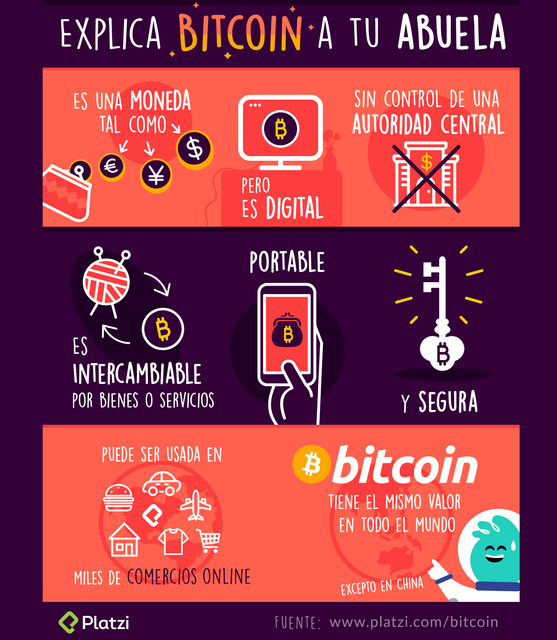

## ¿Qué es Bitcoin?
A diferencia del dinero tradicional, bitcoin es completamente virtual, no existen monedas físicas ni tangibles.

Bitcoin es un sistema Peer-to-Peer o sistema de pares distribuidos. Es decir, no existe un ente o servidor central que tenga control o del que dependa el ecosistema. Los bitcoins se crean a través de la minería, un protocolo de recompensas por la resolución de problemas matemáticos complejos, que a su vez procesan todas las transacciones y movimientos de la red.

Cada cierto tiempo, un conjunto de ordenadores o mineros consiguen validar las transacciones y a cambio son recompensados con bitcoins o fracciones de bitcoins, por lo que la minería en esencia descentraliza la emisión de criptomonedas, siendo todos los mineros parte del proceso sin la necesidad de contar con la autorización de bancos centrales o limitantes gubernamentales.

Cualquier persona que participa en la red Bitcoin posee una billetera electrónica o wallet que contiene un par de llaves o códigos criptográficos: la llave pública y la llave privada. Las llaves públicas funcionan como dirección para que los participantes de la red, puedan enviar y recibir bitcoin o fracciones de bitcoin, además no tienen ninguna información específica sobre el usuario remitente o receptor. Estas llaves son una secuencia aleatoria de números y letras creadas por el mismo ecosistema y a su vez son un código único en la red.

Una cadena de bloques es un libro de transacciones distribuidas, es decir aunque en esencia se creó para que Bitcoin fuese un sistema digital financiero seguro, también es posible aplicarlo a otros sistemas. Su objetivo es registrar todas las transacciones, compartido y distribuido en distintos lugares de la red y del mundo. Esta sólo podrá ser modificada bajo el consenso de la mayoría de las personas participantes del ecosistema, además de que no puede ser borrado ningún tipo de información. Esto lo convierte en un sistema seguro, debido a que la información o registro se encuentra descentralizada y dispersa en el mundo, por lo que un hacker no podrá acceder a la información y modificar el sistema en sí mismo.

Una vez realizada una transacción, no se valida de forma inmediata. Primero, pasa a ser parte de la cadena de bloques y luego de ello cada cierto tiempo estos bloques son verificados y validados por los mineros permitiendo así que se realicen las transacciones. Aunque la red de Bitcoin es privada y ningún usuario comparte su identidad todas las transacciones quedan registradas en la blockchain o cadena de bloques de esa forma se mantiene la seguridad e integridad del ecosistema.

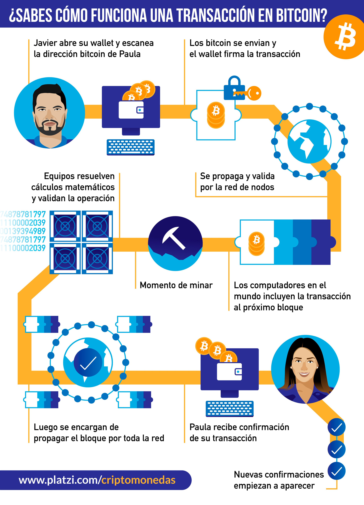

Una de las características más interesantes del Bitcoin es su escasez, contrario a lo que ocurre con el dinero tradicional que no tiene límites. Así lo definió Satoshi Nakamoto desde su creación; Bitcoin sólo tendrá 21 millones de unidades, es decir en su protocolo cada vez irá incrementando la complejidad de resolución de bloques, y por tanto la recompensa.

La cantidad o escasez de un activo en particular es de alto interés para los inversores, pues el hecho de que bitcoin se limite a 21 millones promueve a los participantes de la red a su acumulación, pues esto en el tiempo provocará una expectativa del aumento del precio del cripto activo financiero.

### Resumen
Bitcoin nació con la idea de descentralizar el dinero tal como lo conocemos hoy día, eliminando la necesidad de la presencia de instituciones financieras en las transacciones. Esta solución ha demostrado en la práctica ser funcional y válida para la realización de transacciones y su adopción e interés en el mundo está creciendo de forma exponencial.

## ¿Qué son las criptomonedas?

Bitcoin fue la primera criptomoneda creada con el protocolo Blockchain, sin embargo, a partir de esta tecnología se pueden crear nuevas criptomonedas diferentes al bitcoin con nuevas características y propiedades, aunque con los mismos principios de uso de la red Peer-to-peer descentralizada y segura. Piensa que Bitcoin es Facebook y Blockchain es Internet.

Las Altcoins o criptomonedas alternativas comenzaron a crearse en 2011 producto del incremento de su popularidad.

Una de las primeras altcoin creadas fue Litecoin. Al día de hoy, existen más de 1000 criptomonedas y constantemente se crean nuevos proyectos, aunque los casos de éxito no lleguen a esa cantidad inicial.

En el TOP 10 de criptomonedas de 2020, se encuentran:

- Bitcoin
- Ethereum
- Ripple
- Tether
- Bitcoin Cash
- Bitcoin SV
- Litecoin
- Binance Coin
- EOS
- Tezos

*Puedes ver las criptomonedas más importantes con todos sus detalles en [Coinmarketcap](https://coinmarketcap.com/).*

Hay cuatro términos comúnmente usados para categorizar las altcoins que tienen propiedades similares o específicas:

- **Monedas de Privacidad**: Altcoins con la finalidad de poder proporcionar transacciones privadas. Ejemplo: Monero, Zcash, Dash, etc.
- **Monedas estables o Stablecoins**: ancladas al valor de una moneda fiduciaria con la finalidad de disminuir el riesgo de inversión debido a la volatilidad en el cripto ecosistema manteniendo su precio estable en el tiempo. Ejemplo: Tether, USD Coin, etc.
- **Tokens de Exchanges**: Altcoins creadas por los exchanges o intercambios con la finalidad de ser usada en sus plataformas de trading y servicios. Ejemplo: Binance Coin, KuCoin, etc.
- **Monedas digitales del Banco Central (CBDC)**: Altcoin o criptomoneda creada y respaldada por un banco central o entidad gubernamental. Ejemplo: El Banco Central de Inglaterra anunció el lanzamiento de su CBDC. Experiencias similares se están dando en China, Francia, USA, etc.

Con esto vimos que existe un gran ecosistema de criptomonedas más allá de Bitcoin. Cada día se crean muchas más de ellas, y se manejan grandes cantidades de dinero en este mercado.

## Bitcoin y Criptomonedas en la Era Digital

La adopción de las criptomonedas ha ido en crecimiento durante los últimos años, principalmente por la volatilidad en los precios de este activo y los grandes beneficios o pérdidas para muchos inversionistas.

Sin embargo, el Bitcoin y criptomonedas como activos financieros han significado un importante auxilio u opción financiera para países con problemas económicos como Argentina y Venezuela, lo que ha contribuido a la adopción del ecosistema.
Como bitcoin fue creada luego de la crisis financiera más importante registrada en la historia en 2008, su protocolo está diseñado para ser una opción ideal para sobrellevar las crisis económicas.

Uno de los países con mayor adopción y volumen de transacciones diarias en todo el continente americano es Venezuela. Este país, ha sido sometido durante más de una década a un estricto control cambiario, y otras medidas gubernamentales que llevaron al país a registrar los mayores niveles de inflación del mundo entero, por lo que los ciudadanos se encuentran restringidos a nivel monetario en muchos aspectos debido a las políticas tomadas por el gobierno nacional.

Venezuela sin embargo, encontró una alternativa de sistema monetario en el bitcoin, acogiendo al ecosistema de las criptomonedas como una alternativa de resguardo, inversión, envío de remesas y usabilidad para sobrellevar la crisis económica.

En el siguiente gráfico podemos ver el crecimiento exponencial de la adopción del Bitcoin en Venezuela a través de Localbitcoins.

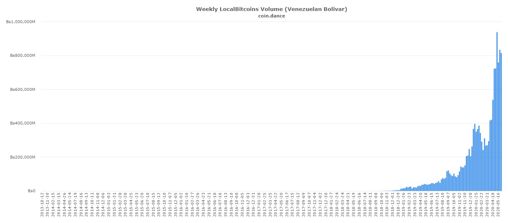
*Fuente: [CoinDance Volumen Semanal Localbitcoins VES](https://coin.dance/volume/localbitcoins/ves)*

Argentina por su parte cuenta con un escenario similar, aunque no tan grave. Sin embargo, la inflación va en aumento continuo y las medidas gubernamentales se fortalecen cada vez más dejando al ciudadano con menos opciones. Coin.dance nos muestra como el volumen de las transacciones en dicho país crecen de forma exponencial y se convierten pues las criptomonedas en un modo de ahorro, inversión y método de pago para los argentinos.

En el siguiente gráfico podemos ver el crecimiento exponencial de la adopción del Bitcoin en Argentina a través de Localbitcoins.

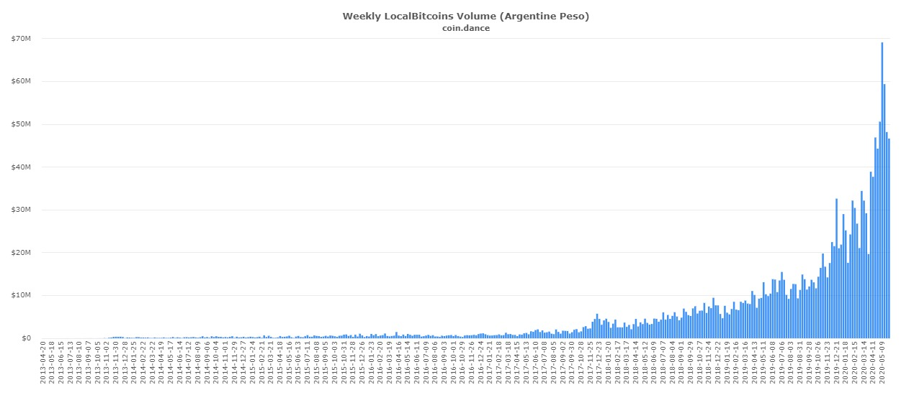
*Fuente: [CoinDance Volumen Semanal Localbitcoins ARS](https://coin.dance/volume/localbitcoins/ars)*

En efecto las criptomonedas demuestran cada vez más su poder de usabilidad respecto al sistema financiero tradicional en situaciones económicas no tan favorables, a través de sus propiedades y fortalezas como tecnología y ecosistema financiero digital.

Sin importar las limitaciones gubernamentales, Bitcoin ha demostrado ser una alternativa increíble al sistema financiero tradicional en condiciones económicas no tan favorables, teniendo en cuenta que para ser parte de la red el proceso es privado, descentralizado y sin limitantes. Sin embargo, es importante destacar que para ello debes primero conocer las bases y fundamentos y estar preparado ante cualquier eventualidad.

## Ventajas y desventajas del Bitcoin y Criptomonedas

Ahora que ya conocemos el ecosistema de las criptomonedas y su funcionamiento, podemos exponer las ventajas y desventajas de su adopción.

### Ventajas del Bitcoin y Criptomonedas
- La seguridad y transparencia del Bitcoin es muy alta, tomando en cuenta su protocolo y arquitectura, que fue creado para eliminar o no permitir los intentos de fraude o violación de seguridad en el ecosistema.
- Es global y descentralizado, cualquier persona con los conocimientos mínimos necesarios puede acceder y disfrutar sus beneficios.
- Bajos costos transaccionales, e inmediatez de acuerdo al cripto activo. Por lo que enviar dinero a cualquier parte del mundo es efectivo.
- La emisión del bitcoin es limitada, no hay control sobre ello y así fue descrito en su protocolo de creación.
- La adopción del bitcoin y las criptomonedas va en aumento, y actualmente existen decenas de miles de comercios en el mundo que las aceptan como método de pago.

### Desventajas del Bitcoin y Criptomonedas
- El ecosistema en sí mismo es seguro, aunque la implementación y uso dependen del usuario, por lo que es importante el entendimiento de los conceptos para llevar a cabo de forma exitosa las transacciones. El uso o gestión de las billeteras y transacciones dependen de los conocimientos del usuario y un error en la implementación puede llevar a pérdidas significativas de dinero.
- La gran volatilidad en los precios supone en principio una limitante para los usuarios, pues implica grandes beneficios o grandes pérdidas, aumentando el miedo a la gran fluctuación.

En el siguiente gráfico, podremos ver algunas ventajas de las características del Bitcoin respecto al oro y el dinero tradicional:

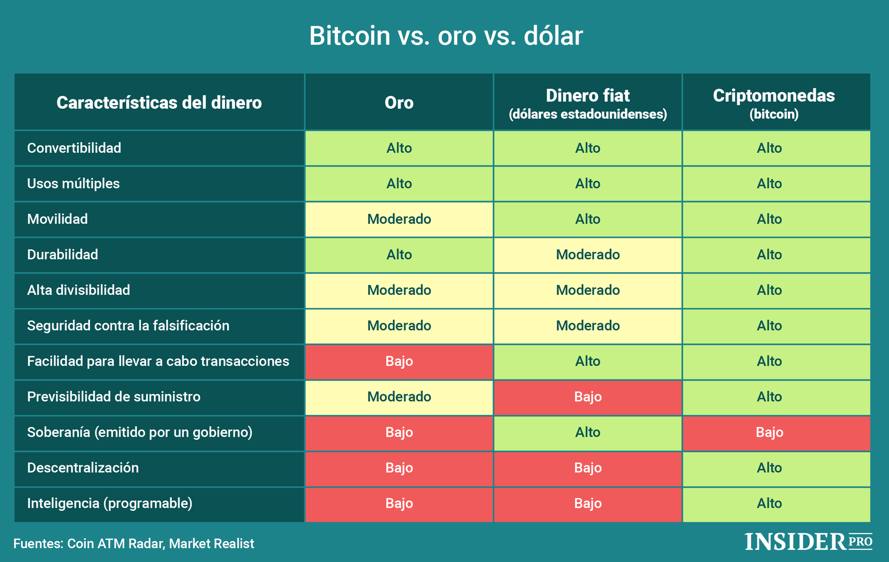
*Fuente: [Gráfico del Día: Bitcoin Vs Oro Vs Dólar - InsiderPro](https://es.ihodl.com/infographics/2018-04-10/grafico-del-dia-bitcoin-vs-oro-vs-dolar/)

### Resumen
La economía global se está adaptando a las nuevas oportunidades tecnológicas que están naciendo, y las criptomonedas como método de pago son parte de ello.

En este primer bloque, hemos aprendido los fundamentos y propiedades del Bitcoin y las criptomonedas, ejemplos y casos de uso del ecosistema, ventajas y desventajas. Ahora, estamos preparados para profundizar y aprender cómo ser parte de la red de Bitcoin y criptomonedas, aprendiendo a adquirirlas, crear nuestras propias billeteras y cómo generar beneficios a través del cripto mercado.

## ¿Cómo comprar Bitcoin y Criptomonedas?

[Bitcoin es la inversión del momento](https://platzi.com/cursos/bitcoin/), en Latinoamérica a diferencia de Estados Unidos no hay una solución 100% efectiva para comprar Bitcoin. En este artículo conocerás las diferentes opciones, el proceso para adquirir bitcoins y algunos consejos a la hora de comprar.

### Comprar Bitcoin en Colombia, Perú y Chile con SurBTC

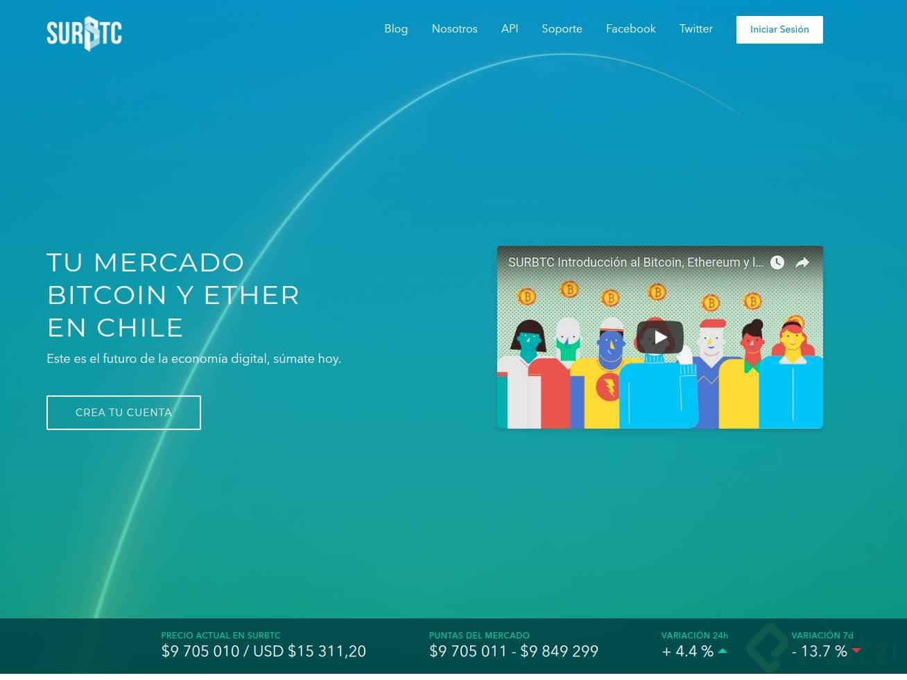

[SurBTC es un exchange latinoamericano con sede en Chile, Perú y Colombia](https://www.surbtc.com/). Ellos ofrecen intercambio de pesos colombianos, pesos chilenos y soles peruanos a Bitcoin.

El registro a SurBTC es bastante sencillo, sin embargo el proceso de verificación podría ser un poco demorado. **Recomendación: Insistir al equipo de soporte y pedir ayuda durante todo el proceso de verificación según tu país, así ahorrarás mucho tiempo.**

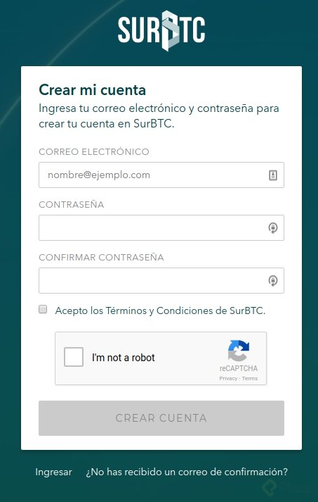

Una vez iniciada la sesión y con la cuenta ya verificada podrás comprar Bitcoin directamente desde la página principal de la plataforma de SurBTC.

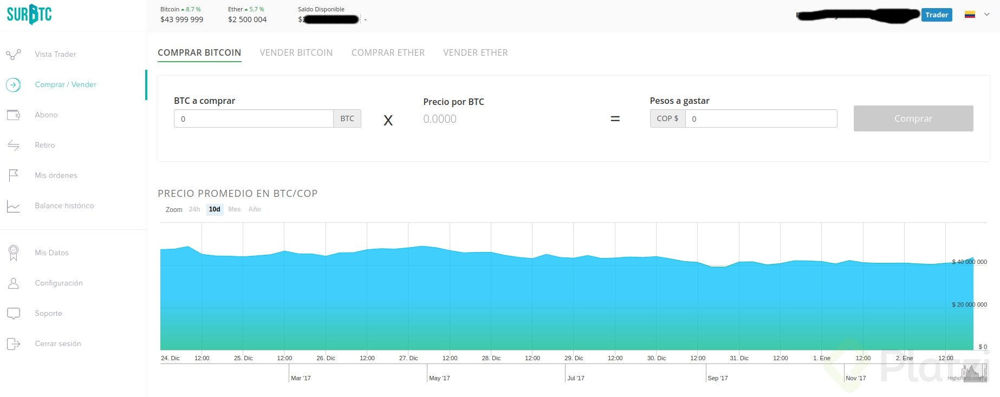

Antes de poder comprar Bitcoin debes depositar pesos colombianos, pesos chilenos o soles, según tu país. Para depositar debes hacer clic en la opción “Abono” en el menú de la izquierda. Ya en la sección de “Abono” debes seleccionar la moneda y el método de pago, en el caso de Colombia aceptan Consignación Bancaria y PSE. **Recomendación: Depositar a través de algún proveedor de pagos online como PSE, así puedes tener el dinero disponible en menos de 30 minutos y aprovechar caídas de Bitcoin para comprar por ejemplo**.

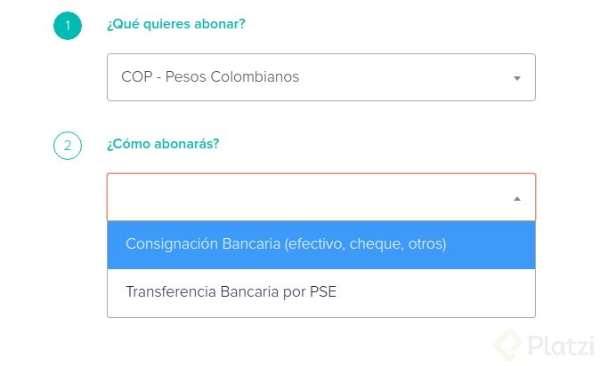

Ya con el dinero disponible en la cuenta puedes comprar a través de la opción “Comprar/Vender”, es la opción más rápida y compras a precio de mercado, es decir el precio disponible en ese momento para la Compra. **Recomendación: Ingresa el monto de dinero que depositaste directamente en la casilla de “Pesos/Soles a gastar” así el sistema automáticamente calculará cuántos bitcoins recibirás.**

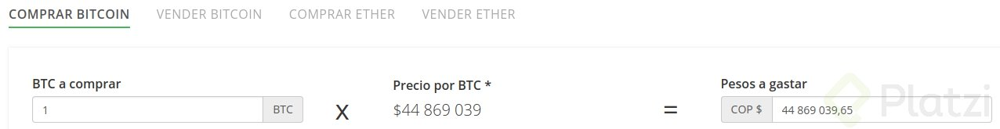

La otra opción para comprar Bitcoin en SurBTC es la de “Vista Trader”. Comprar a través de esta opción es un poco más complicada pero a mi parecer es la mejor para comprar más barato.

Al ingresar podrás ver la siguiente interfaz:

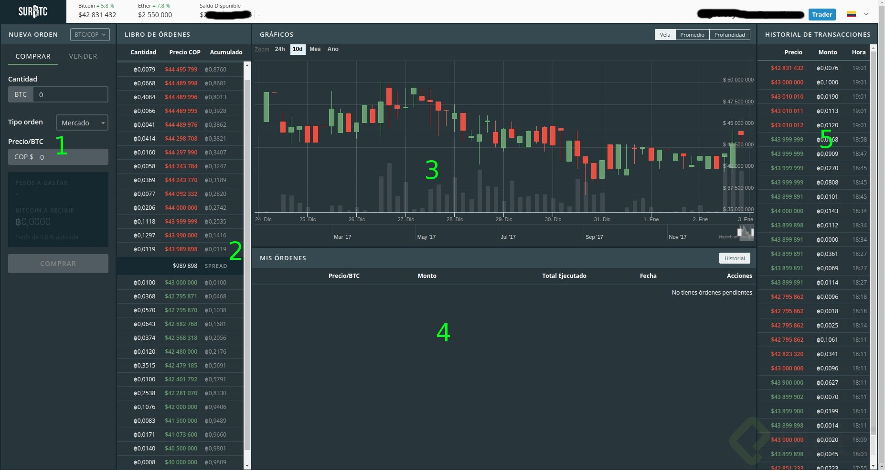

1. Es el formulario para iniciar una orden, acá podrás decidir si comprar o vender. Por defecto está “Comprar a precio de Mercado” como tipo de orden, este tipo de orden es equivalente a comprar a través de la opción “Comprar/Vender”. El otro tipo de orden es “Límite”, en ese tipo de órdenes podrás definir qué precio de Bitcoin quieres pagar. Así podrías crear una orden de compra a un precio más bajo al precio actual de compra, sin embargo no se ejecutará de inmediato ya que requiere que alguien te venda Bitcoin a ese precio para que se ejecute la orden, sin duda te puedes ahorrar unos pesitos/soles con esta opción.

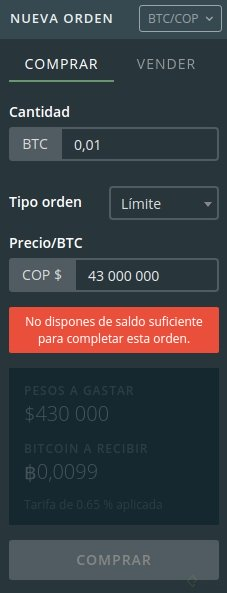

2. Esta parte de la “Vista de Trader” es la profundidad de Mercado, en rojo muestra órdenes de tipo “límite” de personas que quieren vender, así que si seleccionas ejecutar tu orden de compra a precio de mercado, pagarás el precio más bajo de todas las órdenes que están en la parte roja. En la lista de precios en verde, son las órdenes de compra de tipo “Límite”, si deseas vender tus bitcoins a precio de mercado se ejecutará con el precio más caro de esta lista, es decir el primero. Entonces, si abres una orden de compra de tipo “Límite” aparecerá en la lista de abajo, cuando alguien venda sus bitcoins a precios de mercado, lo hará con el precio que estableciste.

3. La gráfica que muestra es el progreso a lo largo del tiempo del precio de Bitcoin. En la gráfica también puedes observar el volumen del mercado en la parte de abajo de la gráfica, es decir, cuántos bitcoins se transaron en ese momento específico tanto en compra como en venta.

4. En “Mis órdenes” podrás ver todas las órdenes que aún están pendiente de ser procesadas, bien sea porque no hay suficiente Bitcoins a la venta o porque creaste una órden de tipo “Límite” que requiera que alguien venda sus bitcoins para completar la orden.

5. El historial de ordenes muestra todas las órdenes de compra y venta que se han finalizado a lo largo del tiempo.

#### Ejemplo práctico de una orden tipo “Límite”

El mercado actual tiene un precio de Compra de $4000 pesos y uno de venta de $3000 pesos.

Diana quiere comprar bitcoins, pero decide no pagar $4000 pesos sino hacer una oferta a un precio más bajo y abre una orden de tipo “Límite” a un precio de $3100 pesos.

Ahora, los nuevos precios de mercado serán $4000 pesos para la compra y $3100 pesos para la venta.

Por otro lado, Freddy quiere vender sus bitcoins y decide vender a precio del mercado, por lo tanto vende dos bitcoins a $3100 pesos que recibirá Diana.

Y es así como Diana compró dos bitcoins ahorrando $1800 pesos, $900 pesos por Bitcoin solo por abrir una orden de tipo “Límite” estableciendo el precio que quería pagar.

### Comprar Bitcoin en México con Bitso
Comprar Bitcoin en México es bastante sencillo con la plataforma de intercambio de Bitso.

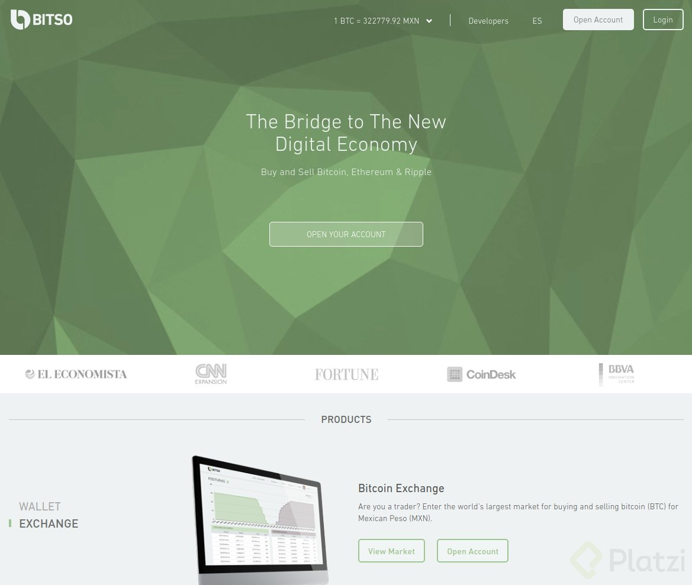

Con Bitso comienzas creando una cuenta. **Recomendación: Ingresar correctamente todos los datos personales que exijan sobre todo el CURP**.

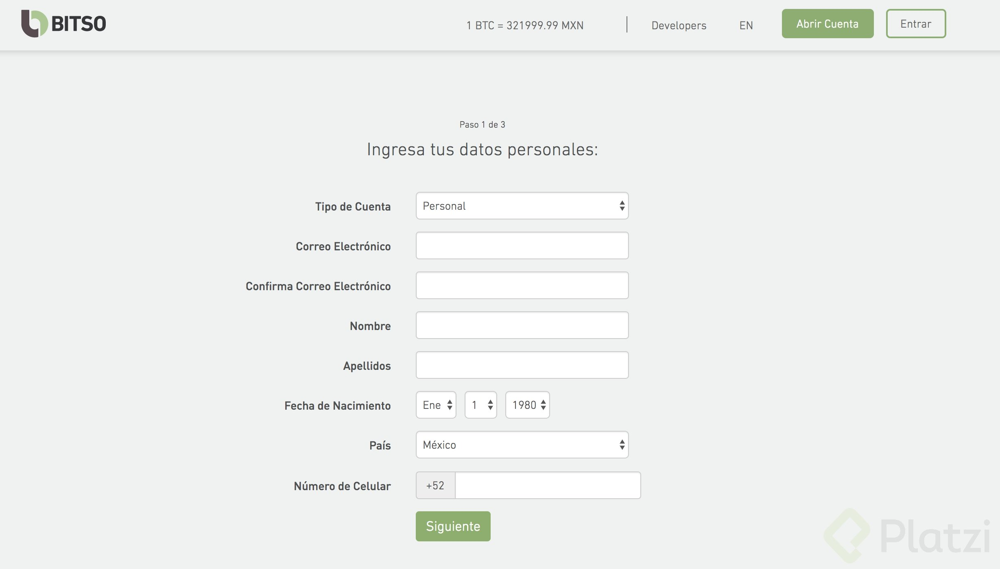

Una vez creada la cuenta pasarás por un proceso de verificación de número de teléfono celular.

Al final el proceso de verificación llegarás al panel del sitio de Bitso donde podrás ver la información general de tu cuenta y tendrás la opción de “Fondear” tu cuenta en Bitso con pesos mexicanos.

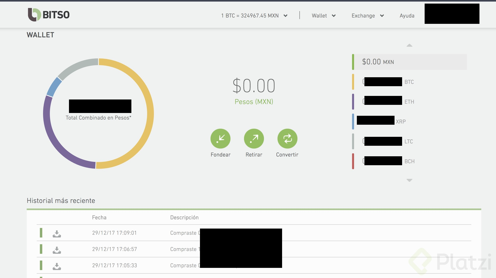

La verdad la plataforma de Bitso es bastante elaborada a nivel gráfico, me gusta mucho.

Antes de comprar Bitcoin debes fondear la cuenta, ellos ofrecen varios métodos para fondear tu cuenta de manera instantánea en la mayoría de los casos.

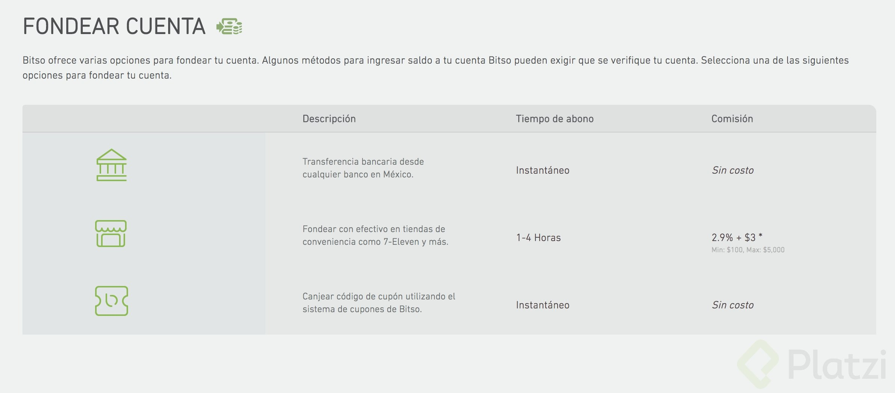

Al seleccionar un método de pago te aparecerá un mensaje de confirmación con datos para realizar la transacción.

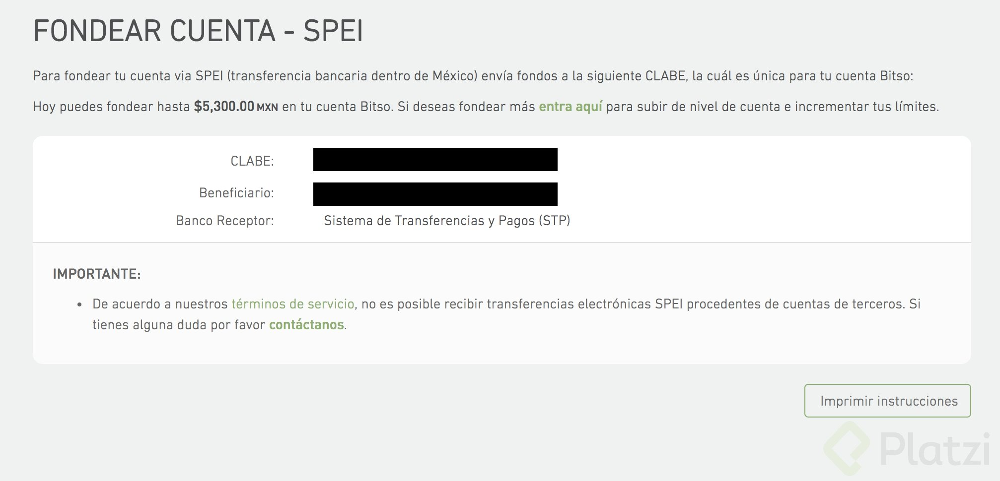

Ya con pesos mexicanos en tu cuenta deberás intercambiar pesos a Bitcoin a través de la opción “Convertir”.

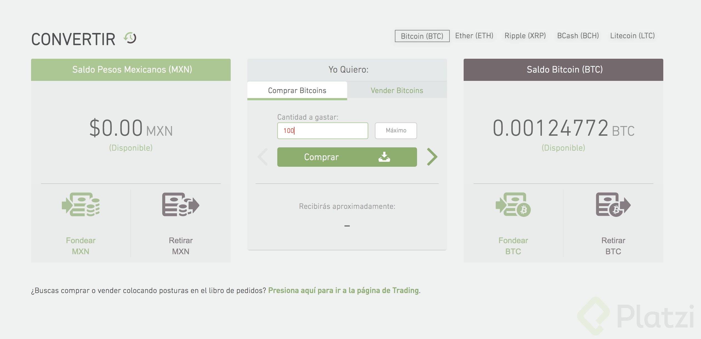

En esta opción colocas la cantidad de pesos mexicanos que deseas convertir a Bitcoin y Bitso automáticamente te informará cuántos bitcoins recibirás.

### Comprar Bitcoin desde cualquier parte de Latinoamérica con Localbitcoins.com

[Localbitcoins es una opción mundial](https://localbitcoins.com/), muy fácil de usar pero no tan segura en todos los casos. Pero no te preocupes, acá te diré como evitar estafas a través de Localbitcoins con algunas recomendaciones.

Localbitcoins funciona similar a un servicio de anuncios clasificados, donde una persona sube un anuncio pero el servicio como tal no tiene nada que ver con el vendedor. La diferencia en Localbitcoins es que hay ciertos procesos de verificación que agregan una capa de seguridad a la transacción.

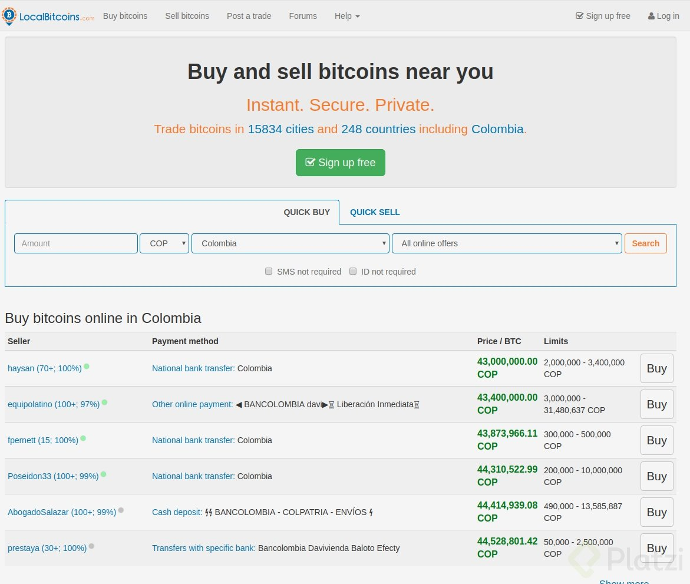

Registrarse es bastante sencillo y el proceso de verificación aún más, te recomiendo tener tu pasaporte a la mano para el proceso de verificación en línea.

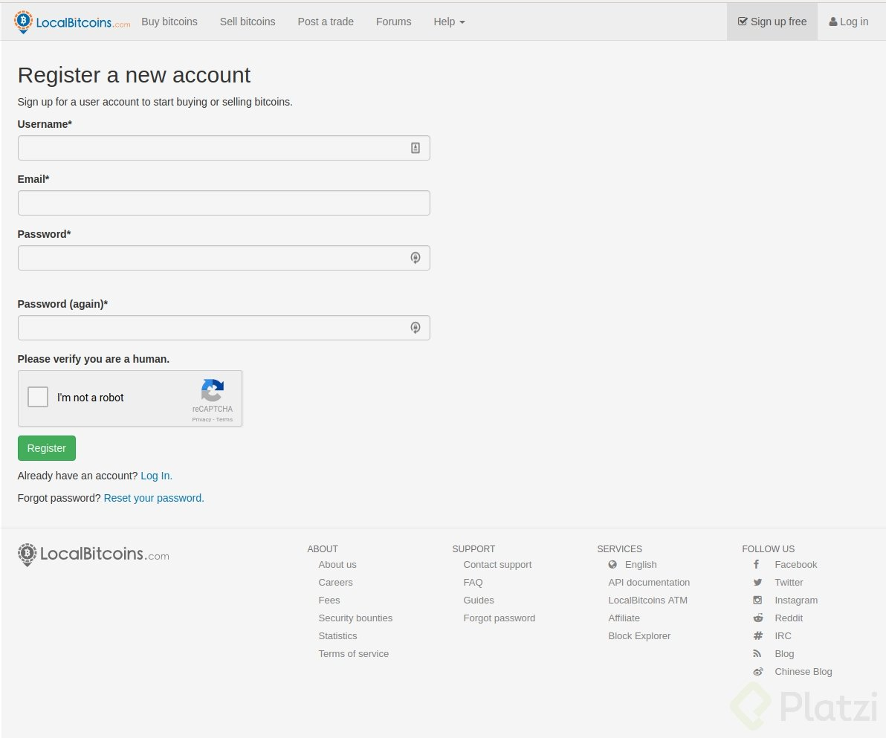

En el proceso de verificación te pedirá verificar tu número de teléfono y tu identidad. **Recomendación: Al momento de verificar tu identidad te pedirá subir una foto de tu pasaporte o cédula/tarjeta de identidad, usa tu pasaporte en la medida de lo posible y además deja la ventana o la pestaña del navegador abierta porque el proceso puede tardar**.

Podrías comprar sin verificar la cuenta, pero los vendedores más confiables podrían no estar disponible porque restringen los intercambios para cuentas verificadas. También podría afectar la cantidad mínima o máxima de Bitcoin que puedes comprarle a un vendedor.

Una vez esté verificada la cuenta puedes proceder a buscar un anuncio que se adapte a la cantidad de dinero que quieras invertir en bitcoin.

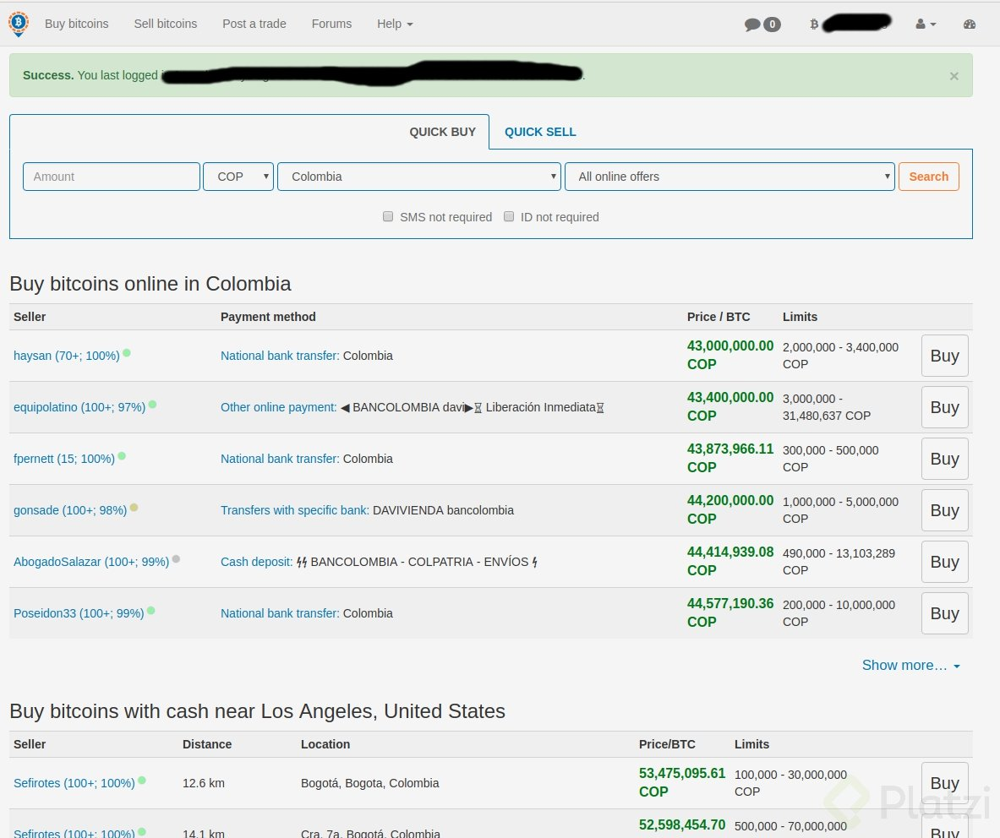

En el campo Amount debes ingresar la cantidad que deseas invertir sin espacios, comas, puntos. Luego la moneda y el país. Por defecto detecta en que país te encuentras. En caso de que no, puedes seleccionar el país y la moneda con la cual deseas realizar la transacción.

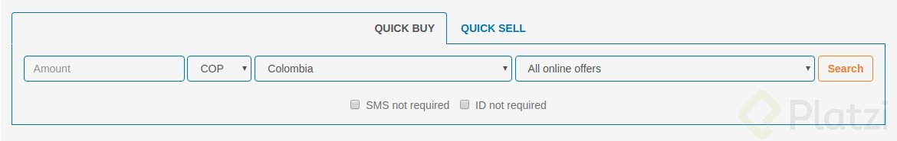

Podrás observar todos los anuncios que se adaptan a lo que estás buscando, en este caso anuncios para comprar de manera online 30 mil pesos colombianos en bitcoins.

Algo importante a resaltar es que cada vendedor coloca el precio que desee así que podrás ver diferencias de precios.

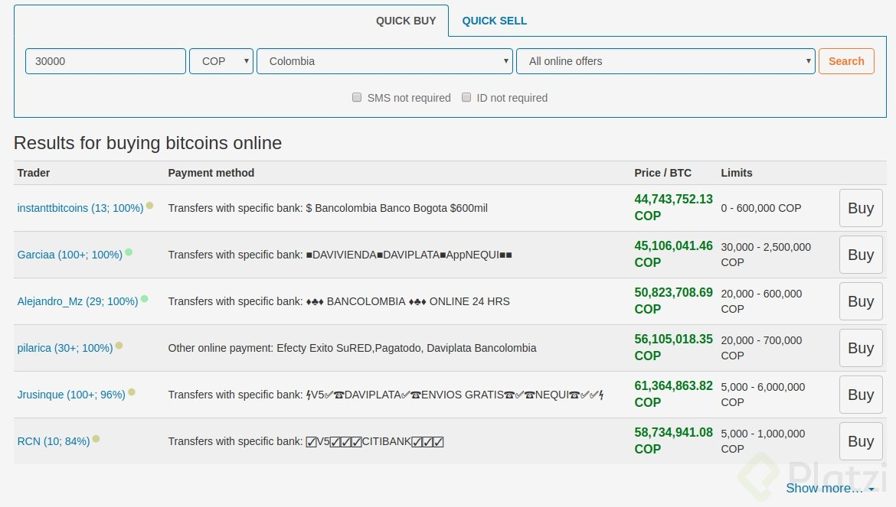

Al analizar el listado de anuncios podrás encontrar, quién es el vendedor, el método de pago que está utilizando, por lo general es un banco, el precio en tu moneda local por cada Bitcoin y los límites de una transacción, es decir cuánto puedes comprar como mínimo y como máximo respectivamente. **Recomendación: NO usar PayPal, Webmoney, Skrill o cualquier sistema online de pago de ese estilo porque son muy susceptibles a fraudes**.

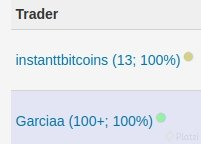

En la información del trader podrás ver, el nombre de usuario, la cantidad de transacciones y el % de feedback positivo de sus transacciones. Si está al 100% significa que el 100% de sus compras o ventas han sido satisfactoria.

También puedes ver un indicador verde que indica en cuántos minutos responde a partir del momento que se abra una orden de compra.

Algo importante a tener en cuenta es el perfil del vendedor. Puedes ingresar al perfil haciendo clic en el nombre de usuario, allí podrás ver la información del vendedor y con cuántos “partners” ha hecho transacciones, es importante que los números sean grandes, eso indicaría más actividad en la plataforma. También tener en cuenta que la identidad esté verificada.

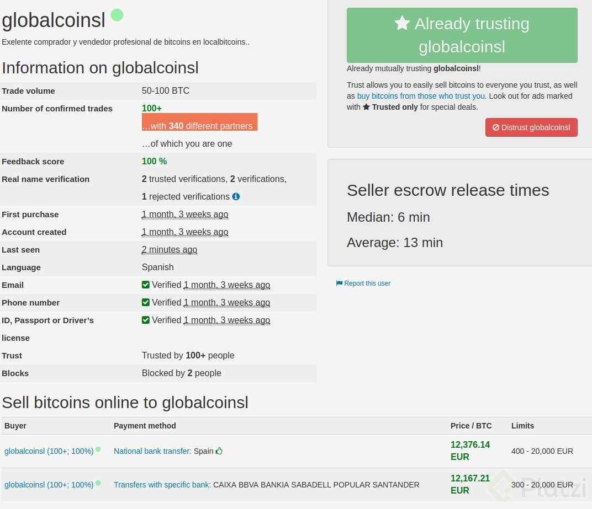

Al momento de seleccionar un anuncio veremos más información del anuncio y un formulario donde podemos indicar la cantidad de dinero a invertir, lo que se recibirá en BTC y un campo de texto donde uno puede dejar un mensaje para el vendedor. **Recomendación: Si estás comprando por transferencia bancaria, indicar en el campo de texto que banco deseas usar para agilizar la compra**.

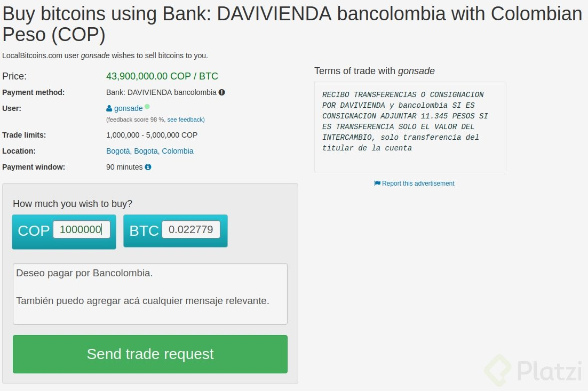

Es importante verificar qué bancos o método de pago recibe el anunciante, algunas veces en la descripción en la parte de la derecha deja un teléfono celular, cada vez que puedas puedes escribir por Whatsapp o llamar para tener más información.

Una vez enviada el trade aparecerá un chat, debes esperar a que el vendedor te responda con la información para pagar.

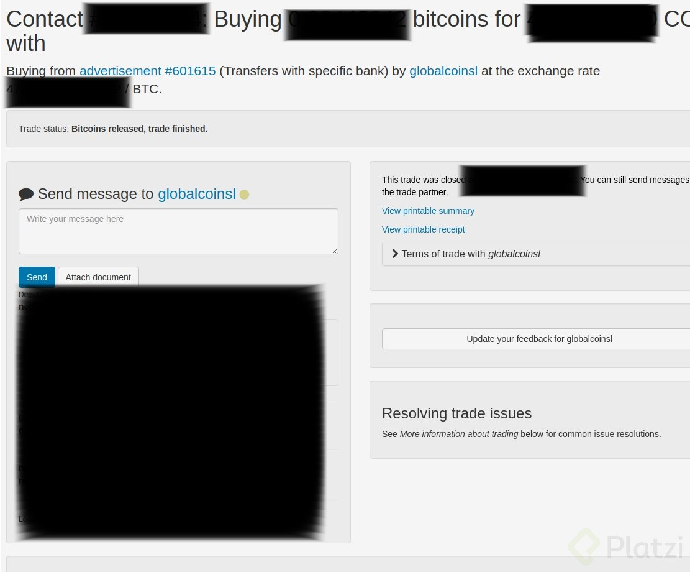

Si pagas por transferencia bancaria debes tomar un screenshot y subirlo al chat. Es importante siempre marcar como pagada la orden que abras.

Cuando abres una compra en Localbitcoins la cantidad que decides comprar se bloquea para el vendedor, es una medida de seguridad. Así que un vendedor no puede vender más de lo que tiene ni puede vender lo que una persona está comprar.

### Consideraciones finales

Tanto SurBTC como Bitso y Localbitcoins cuentan con wallets, no necesitas abrir o instalar alguna wallet para poder comprar. Solo necesitarás una wallet cuando retires Bitcoin de alguno de estos servicios.

Si tienes dudas en algún servicio no temas en usar el sistema de soporte, algunos son un poco lento pero al final recibirás una respuesta que aclara tus dudas o si deseas puedes dejar tu duda acá en el artículo y en la medida de lo posible te responderé con la solución.

**NO** olvides activar 2FA o autenticación de dos pasos para todas las cuentas que tengas en estos servicios.

Recomendación final, investiga bien los costos para retirar BTC desde estos servicios así evitarás perder dinero a la hora de retirar BTC de tu cuenta.

## Billeteras y Tipos de Billeteras

Antes de pensar en adquirir criptomonedas, es muy importante entender cómo podemos almacenarlas, en dónde y qué medio es más seguro de acuerdo a tus objetivos e intereses.

### ¿Qué es una billetera?
Las billeteras o wallets son software o programas que te permiten almacenar, enviar y recibir Bitcoin y criptomonedas. Su función es almacenar las claves privadas necesarias para proteger el saldo y transacciones registradas en una clave pública en la blockchain. Sin embargo, existen varios tipos de billeteras y es muy importante identificar cuál es más adecuada para ti.

### Tipos de Wallets
#### Escritorio
Las billeteras de escritorio están disponibles en la mayoría de sistemas operativos, incluyendo Windows, Linux, y Mac. Además de ello son billeteras con un nivel de seguridad muy alto, ya que sólo se puede acceder a ella a través del dispositivo en el que fue instalado el software. También proporcionan una serie de letras y números después de su instalación que son de utilidad si llegase a ocurrir algún problema con tu dispositivo, por lo que es muy importante que guardes con sumo cuidado este código pues con ello podrás reinstalar nuevamente tu billetera sin perder el acceso a tu dirección de Bitcoin y por tanto a tu dinero.

Algunas billeteras de escritorio que puedes probar son:
- Electrum
- Bitpay

#### Hardware
Las billeteras de hardware incrementan el nivel de seguridad pues las claves privadas son almacenadas en una memoria USB o un dispositivo específicamente diseñado. Ejemplo: Ledger Nano, Trezor, etc. Este tipo de billeteras permite a los usuarios conectar la memoria USB a cualquier dispositivo, iniciar sesión, realizar transacciones y desconectar nuevamente, manteniendo nuestro dinero seguro. Es importante, por tanto, mantener los USB a salvo, además de seguir el método de respaldo correspondiente.

Algunas billeteras de hardware que puedes probar son:
- Ledger
- Trezor

#### App Móviles
Su funcionalidad y nivel de seguridad es similar al de las billeteras de escritorio. Sin embargo, en este caso se ejecutan en forma de aplicación en tu teléfono celular. También su funcionamiento es más accesible, pues tienes a la mano la posibilidad de ingresar a tu dirección, realizar transacciones. Es muy importante, además, respaldar muy bien la seguridad de tu dispositivo móvil, pues un tercero podría tener acceso a tu dinero si no cuentas con una buena gestión de seguridad.

Algunas billeteras móviles que puedes probar son:
- MyCelium
- Bitcoin Wallet
- Coin Wallet

#### En Línea
Estas billeteras son propiedad de los exchanges o casas de cambio en su mayoría, por lo que sólo requerimos correo electrónico y contraseña para crear y acceder a ellas. En algunos casos, necesitas un proceso de verificación más complejo para poder validar tus datos y agregar una capa de seguridad, como el envío de tus documentos personales.

Puedes acceder a ellas desde cualquier lugar y dispositivo con acceso a internet. Es importante contar con un buen protocolo de seguridad porque no tenemos un control total sobre ellas, teniendo en cuenta que son propiedad de los exchanges.

Algunas billeteras en línea que puedes probar son:
- Blockchain
- Coinbase

## ¿Cómo usar una Billetera?
En la clase anterior, te contamos acerca de los tipos de billeteras de bitcoin, su nivel de seguridad de acuerdo a tus objetivos e intereses y nuestras recomendaciones.

Una billetera o Wallet de bitcoin es el lugar en el que podemos gestionar nuestros activos criptográficos. Funciona como una cuenta bancaria, en donde puedes guardar tu dinero, enviar y recibir transacciones. Sin embargo, no funciona como una entidad bancaria tradicional pues es un sistema descentralizado por lo que el proceso de registro es mucho más sencillo, así como su accesibilidad.

Una billetera de bitcoin cuenta con dos elementos:

- Llave pública
- Llave privada

La clave o dirección pública es el código que podemos compartir a los demás usuarios para que puedan enviar dinero de forma exitosa a nuestra billetera, sin el riesgo de que puedan extraer nuestros fondos. A través de ella podemos recibir, consultar, y ver nuestros estados de cuenta.

La clave privada en cambio es un código que no podemos compartir con nadie, pues podrían con ella acceder a nuestros fondos y extraer nuestro dinero. Es de suma importancia guardarla en un lugar seguro y privado que nos asegure el control absoluto sobre nuestros cripto activos.

### Realizando una transacción en una billetera online (Binance)

Binance es una plataforma de inversión online, y una billetera en donde podemos almacenar nuestras criptomonedas de forma segura en el corto plazo. Recordemos que con las billeteras online no tenemos acceso a las claves privadas, pues pertenecen directamente al Exchange por lo que nunca será buena idea almacenar nuestro dinero por mucho tiempo en este tipo de billeteras, para ello tenemos otras opciones más seguras y que nos brindan control absoluto sobre nuestros cripto activos en el largo plazo.

#### Registrarse en Binance

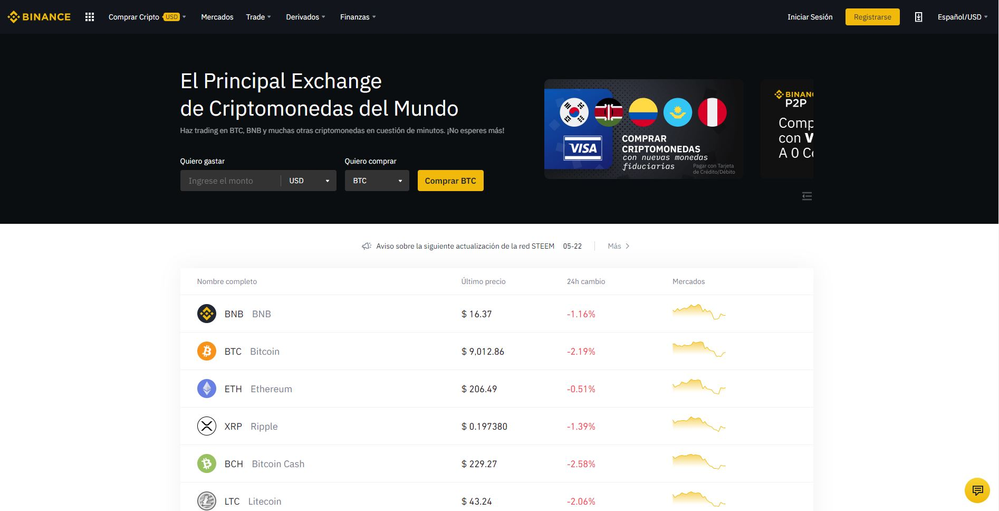

El registro en Binance es bastante sencillo, sin embargo, el proceso de verificación de tu cuenta podría tardar un poco. Por lo que te invitamos a ser paciente y si el proceso llegase a extenderse, contactar al equipo de soporte para que pueda ayudarte lo más pronto posible.

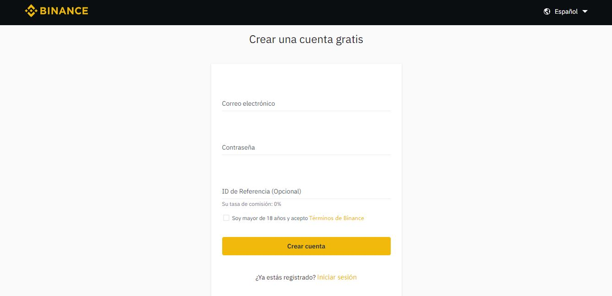

Una vez completado el registro y activación de tu cuenta, así como la verificación de la misma ya podrás tener acceso a la interfaz de la plataforma y podrás recibir, enviar dinero, así como adquirir y vender tus criptomonedas.

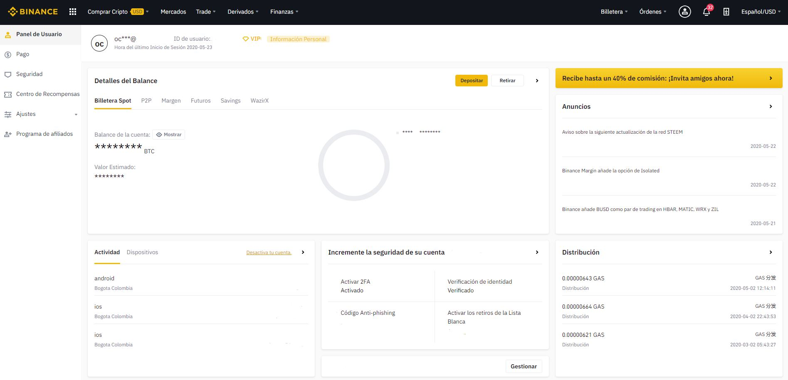

Para depositar tendrás un panel con toda la información, si tomamos la opción de depósito en BTC encontraremos nuestra clave pública con la que las personas pueden enviar dinero a nuestra billetera. Además de nuestro historial de transacciones recientes.

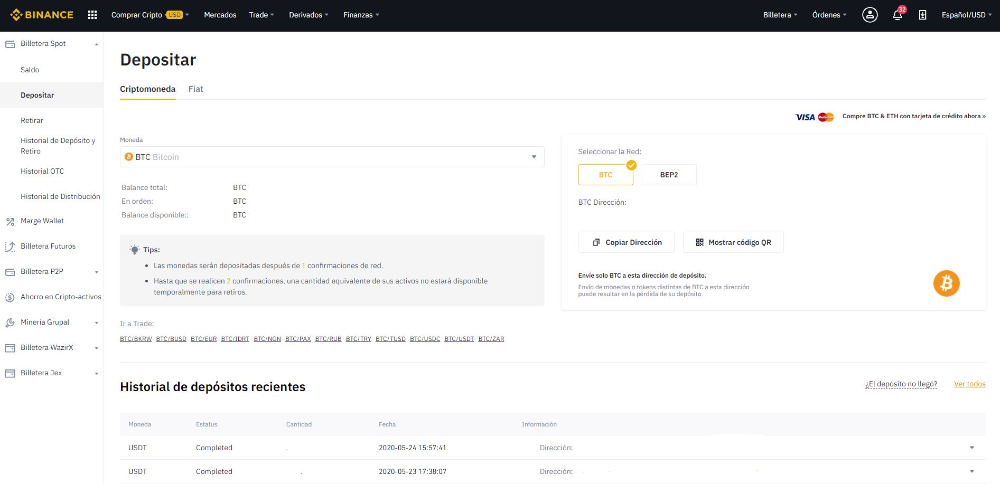

Para retirar de igual forma tendrás un panel, y en él solo tendrás que seleccionar la criptomoneda de tu preferencia para enviar el dinero respectivo, suponiendo que queremos enviar bitcoin, ingresar la dirección de BTC del destinatario, así como la cantidad de bitcoin o satoshis a enviar. Luego, llegará un correo electrónico de confirmación para terminar de validar la transacción y que el Exchange pueda procesarla, para que entre a la red y pueda llegar a nuestro destinatario.

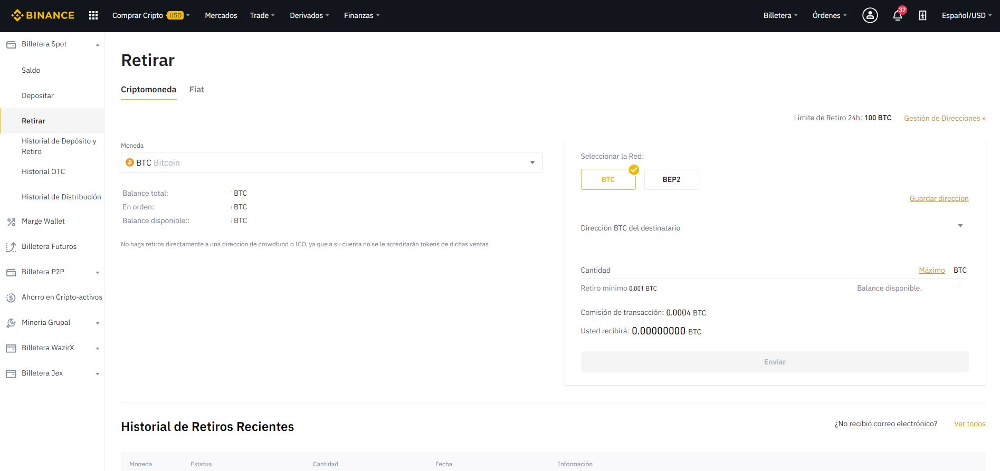

### Resumen
Enviar y recibir bitcoins o criptomonedas es un proceso sencillo, sin tantas restricciones como una entidad bancaria tradicional y accesibilidad para todas las personas. De acuerdo a nuestro interés u objetivo de inversión siempre tendremos opciones de billeteras y herramientas para almacenar, enviar, y realizar transacciones con nuestras criptomonedas.

En la próxima clase veremos buenas prácticas y hábitos para almacenar y cuidar nuestros criptoactivos.

## Almacenamiento y Seguridad

El buen uso y almacenamiento de tus bitcoins y criptomonedas es fundamental, pues, aunque el ecosistema es muy seguro, un mal uso del mismo puede llevarnos a perder nuestro dinero. Para ello es muy importante seguir protocolos de seguridad que nos garanticen el control de nuestras criptomonedas.

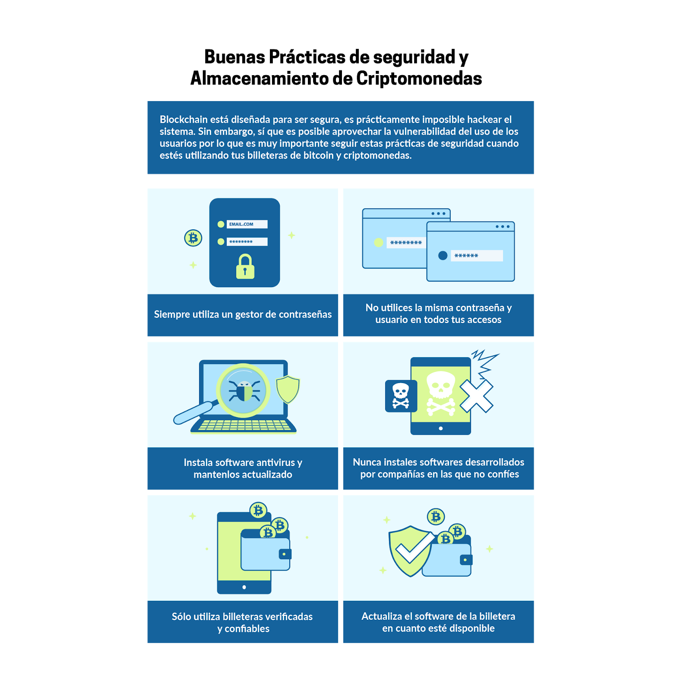
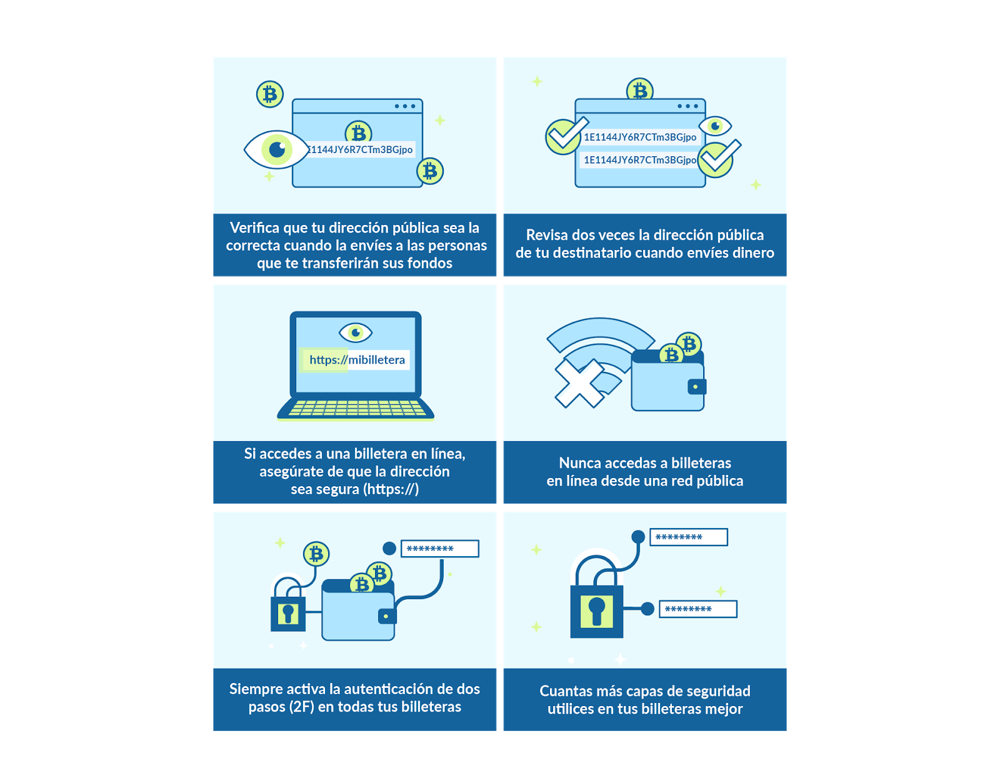

### Resumen
La seguridad del control sobre tus bitcoin y criptomonedas dependen de ti.

Sin importar con cual tipo de billetera cuentes, siempre respalda tus datos e información. Es muy importante mantener una copia de tus nombres de usuario, correo electrónico y contraseñas en un lugar seguro, recuerda que tus contraseñas deben ser lo más complicadas posibles, no repetirse y usar un gestor de contraseñas es una herramienta increíble para mantener la seguridad de tus criptomonedas.

## Plataforma de Inversión

El interés de inversión en el Bitcoin y criptomonedas ha crecido de forma exponencial en el tiempo, debido a las fluctuaciones del precio además de la volatilidad suscitada desde sus inicios. Convirtiéndose por tanto en una increíble oportunidad para generar beneficios, con los conocimientos, medidas y entrenamiento necesario.

Por lo tanto, es fundamental saber qué plataformas de inversión cuentan con los requisitos y características necesarias para almacenar cierto porcentaje de nuestro dinero e invertir en criptomonedas.

Las mejores plataformas de inversión de criptomonedas son aquellas que ofrecen variedad de criptomonedas, comisiones bajas, liquidez, se encuentren reguladas por organismos de mercados financieros, además de una interfaz dinámica de análisis, operaciones y almacenamiento.

### Binance
Es considerada la mejor plataforma de inversión de criptomonedas del mundo, además de brindar la opción de operar con apalancamiento y contar con muchas opciones para los inversores. Una de las primeras en liquidez y volumen además de una gran cantidad de cripto activos financieros como opción de inversión, comisiones bajas, garantías de seguridad superior a otros exchanges, y muchas otras características que la ubican en el top.

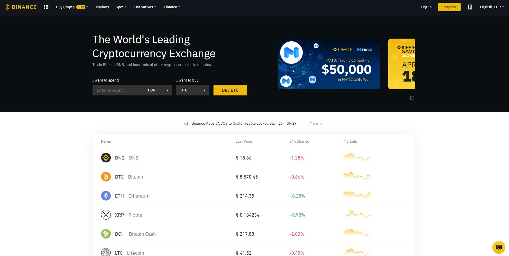

### Bitfinex
Una de las plataformas pioneras de inversión en criptomonedas, fundada desde el 2012 y de las más relevantes del mercado. Cuenta con una gran cantidad de cripto activos financieros, así como gran liquidez y volumen. Su interfaz gráfica es de agrado para los usuarios al ser completamente personalizable, permitiendo la configuración de funciones y herramientas de inversión, haciendo por tanto la experiencia del inversor sencilla y satisfactoria.

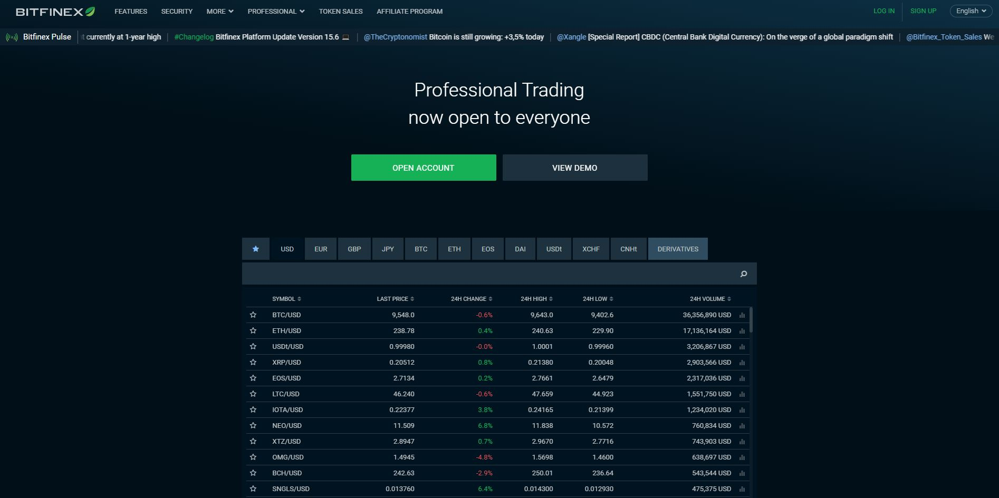

### Coinbase
Si bien no es una plataforma enfocada en trading, es uno de los proveedores más relevantes en el mercado de las criptomonedas desde el 2012. Está disponible en más de 30 países considerado uno de los portales más seguros para adquirir criptomonedas. Aunque no tiene una gran variedad de opciones de activos criptográficos puedes comerciar con los cripto activos más populares, además funciona como monedero digital web.

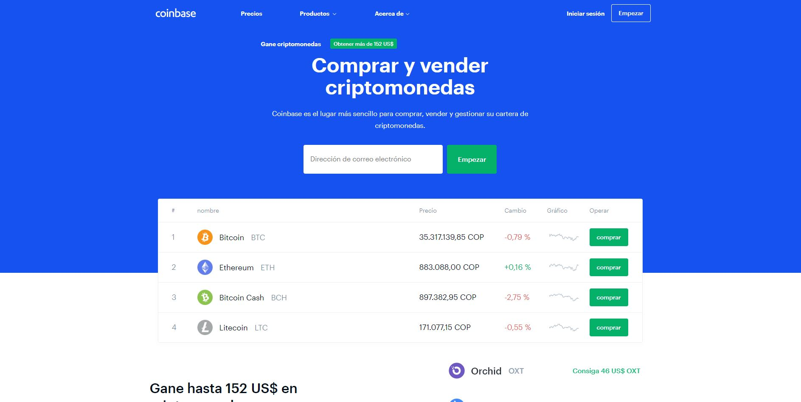

### Kucoin
Si bien es una plataforma de inversión con pocos años en el mercado, ha demostrado ser una de las más relevantes brindando a sus usuarios la posibilidad de tener un portafolio de inversión en el corto plazo bastante distribuido debido a la amplia cantidad de cripto activos. Además de ello, su interfaz es fácil e intuitiva contando con buena liquidez y bajo costo en comisiones transaccionales y un atractivo sistema de recompensas a través de su moneda base.

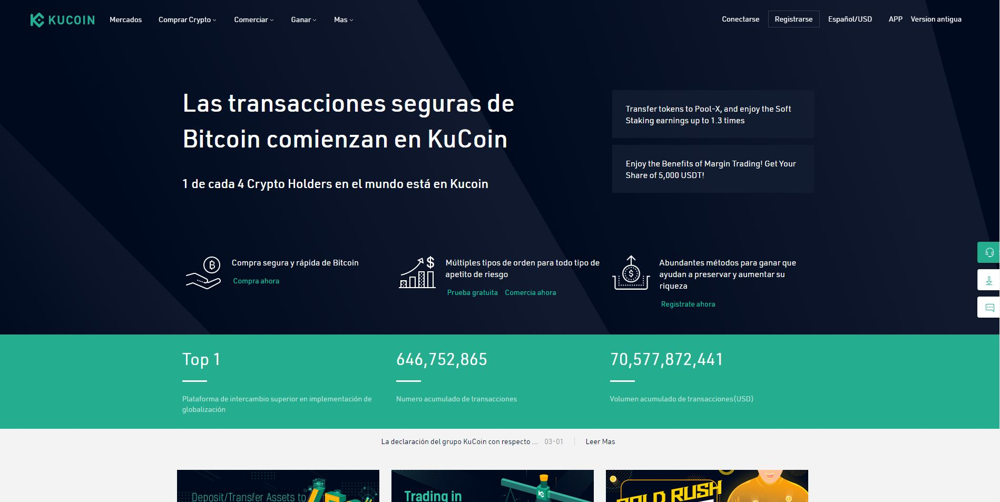

### Bitmex
Es la plataforma de inversión de criptomonedas con apalancamiento con más años en el mercado. En ella tienes la opción de operar hasta 100 veces con tu capital de inversión por transacción, sin embargo, no cuenta con posibilidad de operar muchos cripto activos, y su enfoque está principalmente en operar sobre bitcoin en ambas direcciones del precio, dando a los inversores la posibilidad de aprovechar todas las oportunidades de fluctuación en el precio en el corto plazo. Es importante destacar que operar con apalancamiento en las criptomonedas implica un riesgo enorme sobre tu capital de inversión, por lo que no es una opción válida o recomendada para los inversores principiantes.

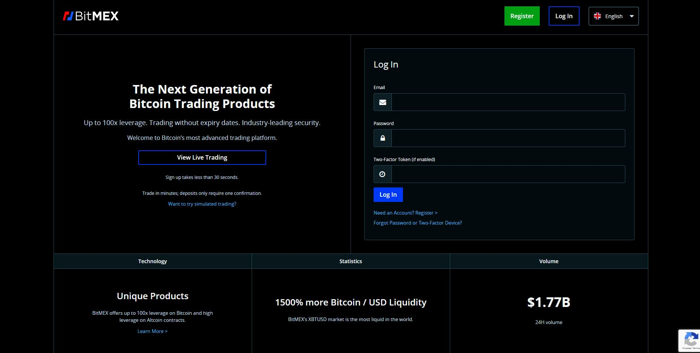

## ¿Qué es CoinMarketCap?

CoinMarketCap es una de las herramientas más importantes para los cripto inversores, pues en ella encontramos toda la información básica y relevante del mercado. Desde capitalización, precio actual de todas las criptomonedas, volumen, gráficos, histórico de precio, ranking de todas las criptomonedas existentes, y más.

### Ranking de criptomonedas
Algunas de las características que encontramos al ingresar a la plataforma son:

- **Market Cap (Capitalización de Mercado)**: Es decir la cantidad total de dólares americanos o capitalización que tiene bitcoin y cada una de las criptomonedas.
- **Price (Precio)**: La cotización actual en dólares americanos de cada criptomoneda, promediando el precio de todas las plataformas de inversión.
- **Volume (Volumen)**: La cantidad de dinero que ha tenido movimiento en las últimas 24 horas en dólares americanos de cada una de las criptomonedas.
- **Circulating Supply (Cantidad en Circulación)**: El número de monedas que se encuentran en circulación hasta el momento, es decir de los 21 millones de BTC que van a existir hoy sólo se han minado 18 millones BTC en promedio.
- **Change 24h (Cambio del precio)**: El resultado de la última fluctuación del precio en las últimas 24 horas en términos porcentuales. Es decir, podemos ver si el precio de la criptomoneda en particular ha aumentado su cotización respecto al día anterior o viceversa.
- **Price Graph 7D (Gráfico del Precio)**: Un gráfico general del precio en la última semana, sin ahondar en muchos detalles.

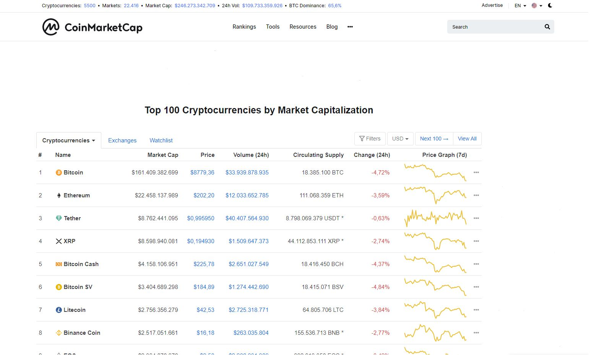
*Fuente: [Top 100 Cryptocurrencies Coinmarketcap](https://coinmarketcap.com/)*

### Información Relevante de Cada Criptomoneda
Desde la interfaz principal de CoinMarketCap podemos ir al panel individual de cada una de las criptomonedas para ver más detalles e información.

Tendremos acceso al sitio web de cada criptomoneda con toda la información técnica y relevante. Es muy importante siempre validar esta información cuando nos encontremos buscando cripto activos para agregar a nuestros portafolios de largo plazo. Además del explorador de bloques o transacciones, foros, acceso al código fuente y toda la documentación técnica (White paper) con todos los detalles del proyecto y su protocolo de creación.

Tenemos acceso también, a divisar nuevamente la capitalización total, cambios de precio, volumen, cantidad en circulación y el límite de emisión de cada criptomoneda. De igual forma, al histórico de precios en la parte inferior, redes sociales, herramientas, noticias, e incluso en qué plataformas de inversión podemos comerciar y adquirir la criptomoneda en particular.

Por lo tanto, en un solo lugar encontramos toda la información relevante necesaria que nos ayudará a complementar nuestra decisión de sumar o no un cripto activo a nuestros portafolios de inversión según sea el caso.

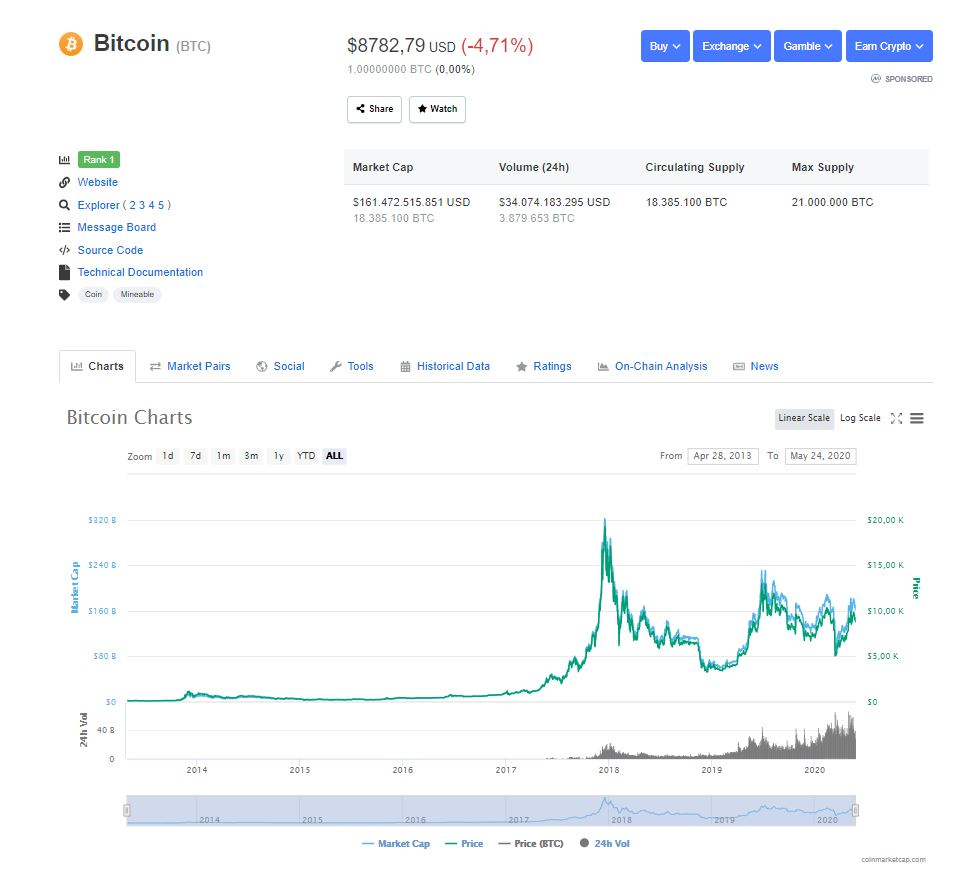
*Fuente: [Bitcoin Coinmarketcap](https://ibb.co/m0Vxcg9)*

### Criptomonedas con Mayor Movimiento
Otra de las herramientas más importantes dentro de CoinMarketCap para los inversionistas es poder divisar las criptomonedas con mayor movimiento en las últimas 24 horas e incluso en la última semana. Para inversionistas de corto mediano plazo, esta herramienta es de absoluta relevancia porque pueden entender qué criptomonedas cuentan con el volumen y potencial suficiente para realizar fluctuaciones de alto impacto en el mercado.

Cabe destacar que no es una herramienta absoluta, y tampoco existe una herramienta absoluta en el mundo de las inversiones. La consistencia se alcanza a partir de un conjunto de herramientas y fundamentos basados en probabilidades con resultados en el tiempo.

*Fuente: [CoinMarketCap Gainers – Losers](https://coinmarketcap.com/gainers-losers/)

### Resumen
CoinMarketCap es una de las herramientas más completas para inversores de criptomonedas, y será un complemento ideal para poder estudiar a detalle cada cripto activo. Si bien no es una herramienta absoluta y su uso exclusivo no nos indica oportunidades de inversión, sí que es una gran fuente de información para entender los fundamentos del ecosistema cripto.

Si tu interés es convertirte en un inversor de criptomonedas, recuerda que en Platzi tenemos el Curso de Introducción al Trading de Criptomonedas y allí podrás entender todo el aspecto técnico y principios básicos que un inversor necesita para comenzar en el mundo de las inversiones y crear resultados a partir de ello.

## Gestión de Riesgo + Regla 90/90/90

El capital de inversión es la herramienta principal de un inversor, y que perdure en el tiempo, así como logre ser consistente su crecimiento es el principal objetivo. Sin embargo, muchos inversores principiantes ingresan al ecosistema sin medir el riesgo y se enfrentan a dolorosas pérdidas debido a ello.

En el mercado de las criptomonedas la volatilidad de los precios es el principal temor de los inversores, pues todos los activos financieros representan un riesgo inicial. Para ello, nuestro pilar fundamental debe ser preservar nuestro capital en el tiempo y esto sólo es posible a través de una gestión de riesgo adecuada.

### Gestión de Riesgo

Lo único que podemos controlar en el mundo de las inversiones son las pérdidas. Preservar tu capital y alcanzar la rentabilidad es totalmente posible siempre y cuando entiendas que debemos seguir una estrategia metódica y completa sin dejar nada al azar.

Gestionar el riesgo implica contar con una serie de reglas y herramientas que nos permitan controlar cada una de nuestras transacciones, desde el porcentaje de inversión, aversión al riesgo, proyección de beneficio respecto a la pérdida, etc.

Lo más importante en cuanto ingreses al mundo de las inversiones es que entiendas que es un proceso que tomará tiempo, piensa siempre en resultados de largo plazo, pues, esto te permitirá pensar de forma objetiva.

### Regla del 90/90/90

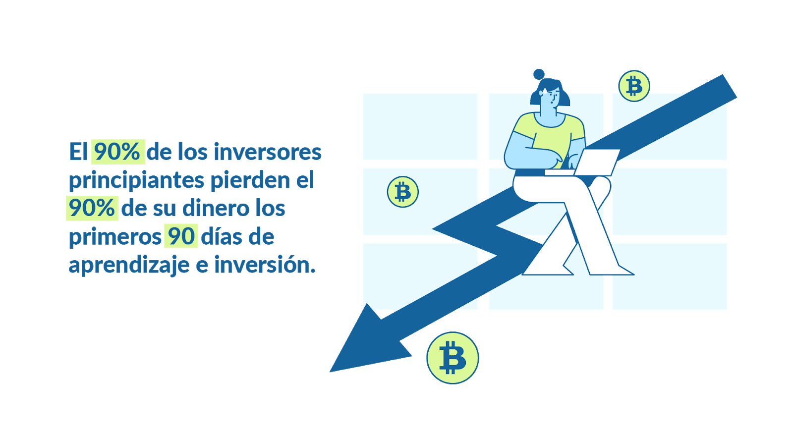

Sí, es difícil de comprender, también puede ser duro leerlo pues la mayoría de los inversores principiantes buscan resultados exponenciales inmediatos o en el corto plazo, pero justo esta mentalidad es la que lleva a todos a ser parte de las estadísticas que nos muestran las plataformas de inversión.

Ser inversor requiere tiempo de estudio, disciplina, una metodología comprobada en el tiempo, gestión monetaria, pero también gestión emocional y mucha paciencia para continuar avanzando. Seguir el camino correcto de aprendizaje nos llevará a salir de las estadísticas y ser parte de la minoría que logra generar resultados increíbles y consistentes en el tiempo.

**Algunas recomendaciones para que gestiones tu riesgo y puedas preservar tu capital son:**

- No arriesgues más de 1% de tu capital de inversión por transacción.
- No expongas tu capital de inversión a más de 3% de riesgo diario.
- Nunca olvides proteger tu operación con un Stop Loss.
- Siempre busca una proyección de beneficio superior a tres veces la pérdida de tu operación.
- Lleva siempre una bitácora de trading en dónde registres cada una de tus operaciones.
- Opera de forma objetiva, si sientes que estás siendo impulsado por emociones, aléjate del mercado.
- Ten en cuenta que ni el inversor más experimentado es inmune a las pérdidas. Siempre estarán presentes, pero tu objetivo es que sean siempre de la misma medida y puedas ser consistente al final de un período de tiempo.
- Siempre sigue tu plan e instrucciones, no dejes nada al azar.
- No permitas que la avaricia y el exceso de confianza se apoderen de tu operativa.

## Gestión de Emociones

Uno de los factores más relevantes e importantes en el mundo de las inversiones es el control de emociones, los inversionistas principiantes dan por sentado la posibilidad de que los sesgos emocionales controlen nuestros procesos y puedan llevarnos a tomar malas decisiones que incurran en la pérdida de nuestro dinero.

**Las emociones más importantes a las que se enfrenta un inversor son:**

### Miedo

El miedo a perder es una de las emociones más comunes en los inversores, y es normal que esté presente, pero en este ecosistema debemos controlar el sentimiento pues podría detenernos a tomar oportunidades de inversión, tomar beneficios parciales rápidamente, etc.

Una forma de controlarlo es contar con una estrategia o plan de inversión con reglas trazadas que no nos permita improvisar y dejar que las emociones salgan a flote, sino que accionemos sólo si las condiciones de nuestro plan se cumplen en un activo financiero específico permitiéndonos operar siempre de forma objetiva.

### Avaricia
El interés por generar beneficios inmediatos es muy común en los inversores principiantes, llevando a la mayoría a tomar decisiones equivocadas y ser parte de las estadísticas de fracaso.

Es por ello que el enfoque principal durante estas clases siempre ha sido indicarte que esta mentalidad es equivocada pues para poder ser consistentes debemos siempre entender que es un proceso de aprendizaje que tomará tiempo, además de una serie de pasos metódicos que debemos seguir para alcanzar el éxito.

Si el mundo de las inversiones fuese tan sencillo, y con resultados tempranos, como espera la mayoría, las estadísticas serían distintas y sólo el 10% perdería su dinero, pero en la clase anterior ya aprendimos lo contrario. Sigue tu plan de trading y cuida siempre tu capital.

### Esperanza
Esperar cambiar los resultados de un momento a otro, luego de haber seguido un camino erróneo impulsado por sesgos emocionales es otra de las emociones más comunes en los inversores principiantes. Olvidando por completo las reglas y estrategia para esperar recuperar todo su capital en una sola operación.

No, no es así como funciona. No hay forma de predecir al 100% los futuros movimientos de los activos financieros, incluso los inversores más experimentados entienden esto, es por ello que nunca operan bajo emociones y siempre siguen una metodología y plan trazado pues así elevan las probabilidades a favor y logran ser consistentes en el tiempo.

### Desconocimiento
Aprender una o dos herramientas no será suficiente para triunfar en las inversiones de cripto activos, además de ello unos pocos meses de aprendizaje no serán suficientes. Sin embargo, si será el inicio de un gran camino y con resultados increíbles una vez superadas todas las etapas de aprendizaje.

Nuestro principal objetivo es aprender de cada uno de nuestros fallos, tomar decisiones de inversión objetivas a partir nuestra estrategia de inversión, gestionar nuestras emociones y siempre proteger nuestro capital. Estos fundamentos nos permitirán seguir el camino correcto de aprendizaje y alcanzar la consistencia en el mundo de las inversiones de criptomonedas.

### Resumen

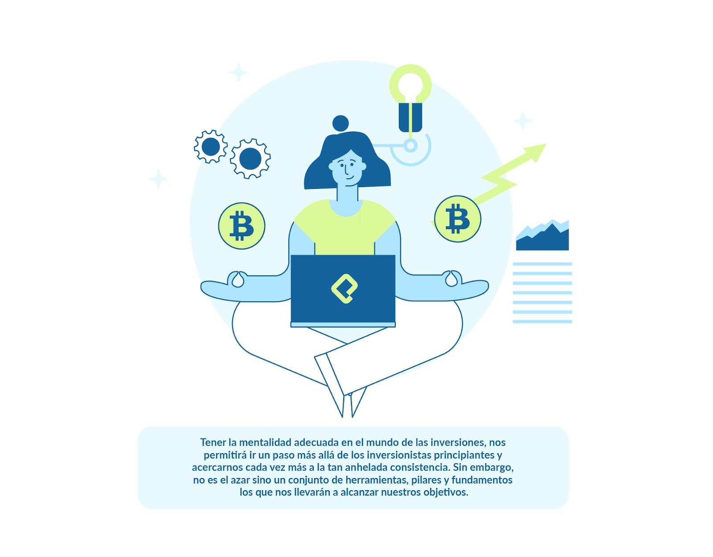

## Procesos de aprendizaje de un inversor

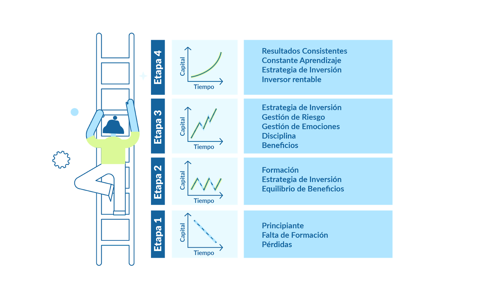