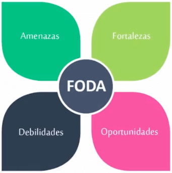
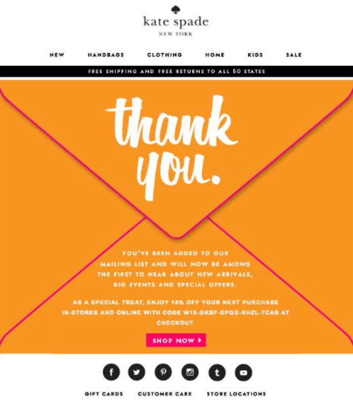
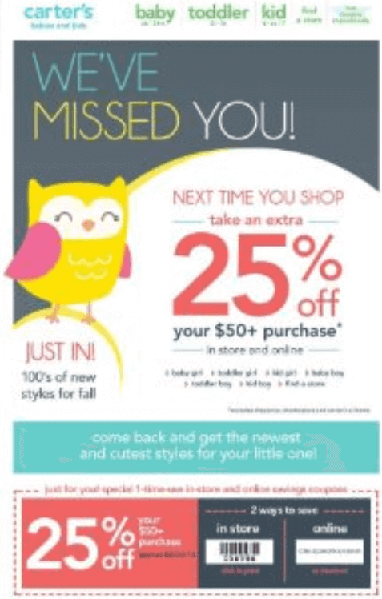
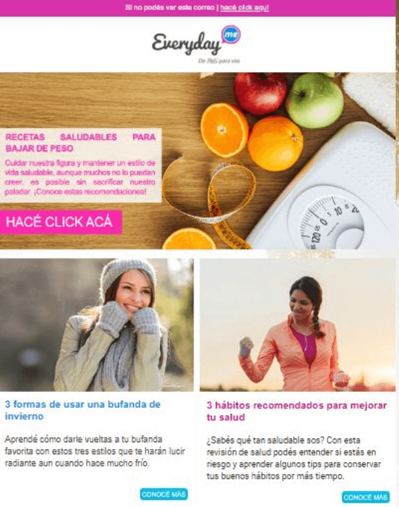
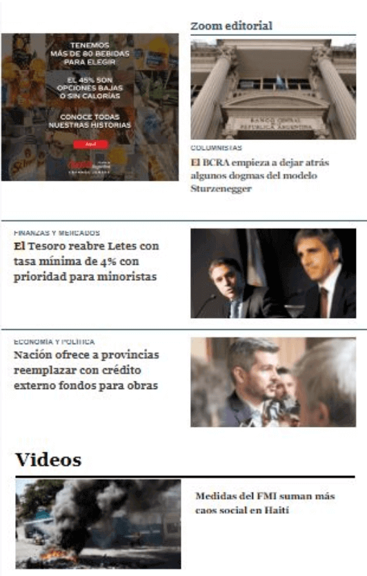
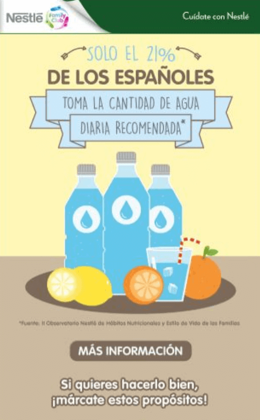
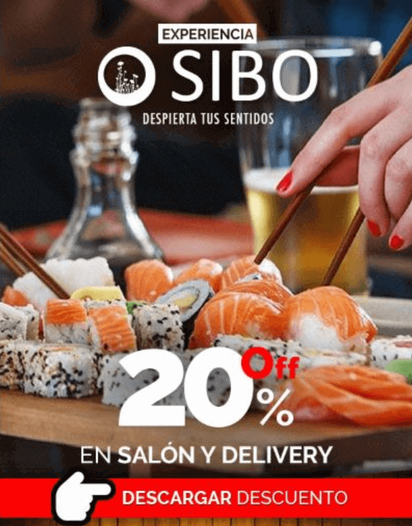
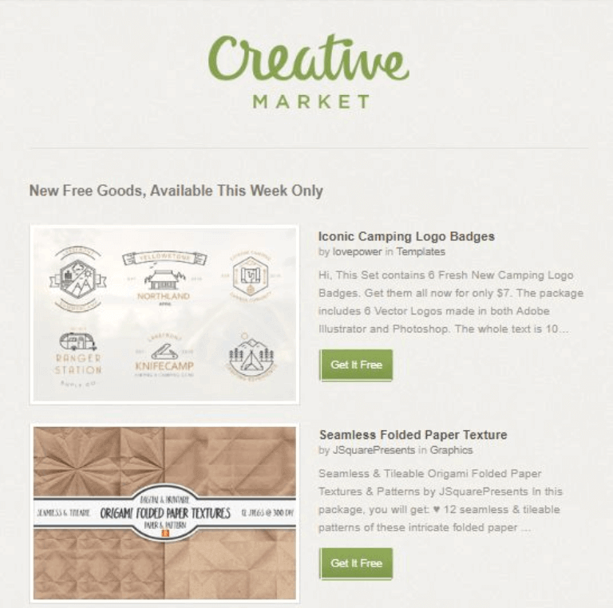

# Curso de Email Marketing<!-- omit in toc -->

## Tabla de Contenido<!-- omit in toc -->

## ¿Qué es el Email Marketing?

El Email Marketing es una herramienta digital de tipo directo. Se utiliza como contacto entre una marca y su público objetivo a través de correo electrónico.

## ¿Por qué hacer Email Marketing?

El email marketing es una herramienta que proporciona una gran cantidad de ventajas, entre ellas:

* **Costes**: Con una inversión muy baja de dinero (y tiempo) podemos obtener grandes resultados.
* **Segmentación**: Tenemos la posibilidad de agrupar nuestros usuarios según sus características, como su edad, su genero, sus intereses, su última fecha de compra, entre otros.
* **Velocidad**: Podemos analizar los resultados de nuestras campañas después de entre 48 y 62 horas máximo.
* **Late-adopters**: También conocidos como laggards, son usuarios que adoptan medios tecnológicos un poco más tarde que el resto de los usuarios.
* **Medición inmediata de resultados y optimización**
* **Gran complemento de la estrategia omnicanal**
* **A/B Testing**

## FODA

La cosa más importante para empezar con una campaña es tener una estrategia, para ello tenemos el FODA.

El FODA es una herramienta de análisis que utilizan las empresas sin importar el tamaño que ayuda a entender:

  
  <small>
Proceso de Design Sprint
</small>

* **Fortalezas**: Se refiere al ambiente interno de la empresa u organización. ¿Cuáles son los puntos fuertes de la marca o el producto y/o servicio. Aquí las variables se pueden controlar.
* **Oportunidades**: Éstas son variables externas que si bien no se pueden controlar, se tienen que tomar en cuenta para aprovecharse.
* **Debilidades**: Son los puntos menos afortunados y que necesitan mejorarse del ambiente interno de la empresa u organización. Aquí las variables se pueden controlar.
* **Amenazas**: Éstas son variables externas que si bien no se pueden controlar, se tienen que tomar en cuenta para poder trabajar en ellas.
Todo esto frente a las cuales se encuentra una marca, un producto o un servicio.

  
  <small>
Ejemplo: Foda Restaurante
</small>

## Ventajas Comparativas

Las Ventajas Comparativas son aquellos puntos que distinguen una marca/producto/servicio de otros que son competencia y que proporcionan un panorama para poder comunicar lo adecuado en una campaña de Email Marketing.

**Preguntas de descubrimiento**:
* ¿En qué se especializa mi marca/empresa/producto/servicio?
* ¿Qué ofrezco que pueda diferenciar mi marca en la mente de los usuarios que la competencia u otras marcas no ofrecen?

**Ejemplo con Platzi**:
* Acceso a gran cantidad de cursos.
* Posibilidad de estudiar online cuándo quieras y dónde quieras.
* Mentoría permanente.
* App y contenido online.

## Objetivos

Con el análisis de FODA podemos saber bien en dónde estamos parados y con los objetivos hacia dónde queremos ir, lo que nos permite trazar el mejor camino a través de estrategias para lograrlo.

Los objetivos deben tener una características en especial, es una regla mnemotécnico que se llama SMART y tiene que ver con que sean inteligentes.

**Las siglas de SMART significan**:
* Specific (Específicos)
* Measurable (Medibles)
* Achievable (Alcanzables)
* Realistic (Realistas)
* Time-Bound (Oportunos en tiempo)

**Los tipos de objetivos son**:
* **Retención**: Buscan que el usuario se vincule con la marca a mediano/largo plazo. Quiere que el usuario le tenga presente al momento de buscar un producto/servicio.  
  *Ejemplo*: Mejorar/mantener/reactivar el vínculo con mi público objetivo y que mi marca esté presente en sus mentes.

  
  <small>
Ejemplo: Agradecimiento
</small>

  
  <small>
Ejemplo: Te Extrañamos
</small>

  
  <small>
Ejemplo: Noticias de Interés
</small>

* **Tráfico**: Su objetivo es redirigir en el mail a la plataforma web.  
  *Ejemplo*: Incrementar las visitas de mi local/sitio web de aquí a una semana en 3%.

  
  <small>
Ejemplo: Leer Noticias
</small>

  
  <small>
Ejemplo: Más Información
</small>

* **Conversiones**: Una conversión es toda acción que realiza un usuario que tiene valor para mi empresa o marca.  
  *Ejemplo*: Incrementar ventas de perfumes importados de mujer a través de mi e-commerse en un mes, en un 1%.

  
  <small>
Ejemplo: Ofertas de Vuelos
</small>

  
  <small>
Ejemplo: Oferta de Sushi
</small>

  
  <small>
Ejemplo: Descargar Archivos
</small>

## Planificación de Estrategia

**¿Cómo hago para llegar a los objetivos?**
* Considerar ventajas comparativas
* Cantidad de campañas
* Público objetivo
* Tipo de contenido que voy a ofrecer en las 
campañas de email marketing (descuentos, links a artículos de interés, descarga de catálogos online, etc.).

## Público Objetivo (Buyer Persona)

Target, Público Objetivo y Buyer-Persona son tres formas distintas de referirse al público al que va a ir dirigido las campañas de email marketing.

Variables a tener en cuenta para armar al buyer persona:

**Variables Duras**:
* Edad
* Sexo
* Nivel Socioeconómico
* Ocupación
* Área Geográfica

**Variables Blandas**:
* Estilo Vida (Rutina)
* Personalidad (Rasgos Conducta: Tímido, Tradicional, Extrovertido, Responsable, Etc.)
* Valores (Familiares, Etc.)
* Intereses (Qué le Gusta, Inquieta, Motiva)

**Ejemplo de Buyer Persona**:
* Martina, 35 años. Vive en Bogotá con sus
hijos, marido y un perro.
* Trabajo full-time en oficina en Ciudad Capital.
* Nivel de ingresos medio.
* Hobbies: gimnasio, yoga.
* Personalidad: tímida, organizada.
* Es vegetariana.
* Vacaciona zona de playas.
* Intereses: comida sana, psicología y 
bienestar, animales.

Nota: Las empresas siempre van a tener más de un úblico objetivo al que le van a hablar.

## Recursos Complementarios
* [Diapositivas del Curso](docs/platzi-email-marketing-course.pdf)
* [El foda](docs/foda.pdf)

  <small><a href="#tabla-de-contenido">🡡 volver al inicio</a></small>

## Enlaces de Interés
* [Curso de Email Marketing](https://platzi.com/clases/email-marketing/)

  <small><a href="#tabla-de-contenido">🡡 volver al inicio</a></small>

