# Curso de Email Marketing<!-- omit in toc -->

## Tabla de Contenido<!-- omit in toc -->
- [¿Qué es el Email Marketing?](#qué-es-el-email-marketing)
- [¿Por qué hacer Email Marketing?](#por-qué-hacer-email-marketing)
- [FODA](#foda)
- [Ventajas Comparativas](#ventajas-comparativas)
- [Objetivos](#objetivos)
- [Planificación de Estrategia](#planificación-de-estrategia)
- [Público Objetivo (Buyer Persona)](#público-objetivo-buyer-persona)
- [Competencia](#competencia)
- [La base de datos](#la-base-de-datos)
  - [Cómo hacer crecer tu base de datos](#cómo-hacer-crecer-tu-base-de-datos)
  - [Segmentación](#segmentación)
  - [Dónde almacenar la base de datos](#dónde-almacenar-la-base-de-datos)
  - [Limpieza](#limpieza)
- [Plataformas de Email Marketing](#plataformas-de-email-marketing)
  - [Mailchimp](#mailchimp)
  - [Doppler](#doppler)
  - [Google Analytics](#google-analytics)
- [Tipos de emails/campañas](#tipos-de-emailscampañas)
  - [Emails de activación](#emails-de-activación)
  - [Email de promoción](#email-de-promoción)
- [Recursos Complementarios](#recursos-complementarios)
- [Enlaces de Interés](#enlaces-de-interés)

## ¿Qué es el Email Marketing?

El Email Marketing es una herramienta digital de tipo directo. Se utiliza como contacto entre una marca y su público objetivo a través de correo electrónico.

## ¿Por qué hacer Email Marketing?

El email marketing es una herramienta que proporciona una gran cantidad de ventajas, entre ellas:

* **Costes**: Con una inversión muy baja de dinero (y tiempo) podemos obtener grandes resultados.
* **Segmentación**: Tenemos la posibilidad de agrupar nuestros usuarios según sus características, como su edad, su genero, sus intereses, su última fecha de compra, entre otros.
* **Velocidad**: Podemos analizar los resultados de nuestras campañas después de entre 48 y 62 horas máximo.
* **Late-adopters**: También conocidos como laggards, son usuarios que adoptan medios tecnológicos un poco más tarde que el resto de los usuarios.
* **Medición inmediata de resultados y optimización**
* **Gran complemento de la estrategia omnicanal**
* **A/B Testing**

## FODA

La cosa más importante para empezar con una campaña es tener una estrategia, para ello tenemos el FODA.

El FODA es una herramienta de análisis que utilizan las empresas sin importar el tamaño que ayuda a entender:

  
  <small>
Proceso de Design Sprint
</small>

* **Fortalezas**: Se refiere al ambiente interno de la empresa u organización. ¿Cuáles son los puntos fuertes de la marca o el producto y/o servicio. Aquí las variables se pueden controlar.
* **Oportunidades**: Éstas son variables externas que si bien no se pueden controlar, se tienen que tomar en cuenta para aprovecharse.
* **Debilidades**: Son los puntos menos afortunados y que necesitan mejorarse del ambiente interno de la empresa u organización. Aquí las variables se pueden controlar.
* **Amenazas**: Éstas son variables externas que si bien no se pueden controlar, se tienen que tomar en cuenta para poder trabajar en ellas.
Todo esto frente a las cuales se encuentra una marca, un producto o un servicio.

  
  <small>
Ejemplo: Foda Restaurante
</small>

## Ventajas Comparativas

Las Ventajas Comparativas son aquellos puntos que distinguen una marca/producto/servicio de otros que son competencia y que proporcionan un panorama para poder comunicar lo adecuado en una campaña de Email Marketing.

**Preguntas de descubrimiento**:
* ¿En qué se especializa mi marca/empresa/producto/servicio?
* ¿Qué ofrezco que pueda diferenciar mi marca en la mente de los usuarios que la competencia u otras marcas no ofrecen?

**Ejemplo con Platzi**:
* Acceso a gran cantidad de cursos.
* Posibilidad de estudiar online cuándo quieras y dónde quieras.
* Mentoría permanente.
* App y contenido online.

## Objetivos

Con el análisis de FODA podemos saber bien en dónde estamos parados y con los objetivos hacia dónde queremos ir, lo que nos permite trazar el mejor camino a través de estrategias para lograrlo.

Los objetivos deben tener una características en especial, es una regla mnemotécnico que se llama SMART y tiene que ver con que sean inteligentes.

**Las siglas de SMART significan**:
* Specific (Específicos)
* Measurable (Medibles)
* Achievable (Alcanzables)
* Realistic (Realistas)
* Time-Bound (Oportunos en tiempo)

**Los tipos de objetivos son**:
* **Retención**: Buscan que el usuario se vincule con la marca a mediano/largo plazo. Quiere que el usuario le tenga presente al momento de buscar un producto/servicio.  
  *Ejemplo*: Mejorar/mantener/reactivar el vínculo con mi público objetivo y que mi marca esté presente en sus mentes.

  
  <small>
Ejemplo: Agradecimiento
</small>

  
  <small>
Ejemplo: Te Extrañamos
</small>

  
  <small>
Ejemplo: Noticias de Interés
</small>

* **Tráfico**: Su objetivo es redirigir en el mail a la plataforma web.  
  *Ejemplo*: Incrementar las visitas de mi local/sitio web de aquí a una semana en 3%.

  
  <small>
Ejemplo: Leer Noticias
</small>

  
  <small>
Ejemplo: Más Información
</small>

* **Conversiones**: Una conversión es toda acción que realiza un usuario que tiene valor para mi empresa o marca.  
  *Ejemplo*: Incrementar ventas de perfumes importados de mujer a través de mi e-commerse en un mes, en un 1%.

  
  <small>
Ejemplo: Ofertas de Vuelos
</small>

  
  <small>
Ejemplo: Oferta de Sushi
</small>

  
  <small>
Ejemplo: Descargar Archivos
</small>

## Planificación de Estrategia

**¿Cómo hago para llegar a los objetivos?**
* Considerar ventajas comparativas
* Cantidad de campañas
* Público objetivo
* Tipo de contenido que voy a ofrecer en las 
campañas de email marketing (descuentos, links a artículos de interés, descarga de catálogos online, etc.).

## Público Objetivo (Buyer Persona)

Target, Público Objetivo y Buyer-Persona son tres formas distintas de referirse al público al que va a ir dirigido las campañas de email marketing.

Variables a tener en cuenta para armar al buyer persona:

**Variables Duras**:
* Edad
* Sexo
* Nivel Socioeconómico
* Ocupación
* Área Geográfica

**Variables Blandas**:
* Estilo Vida (Rutina)
* Personalidad (Rasgos Conducta: Tímido, Tradicional, Extrovertido, Responsable, Etc.)
* Valores (Familiares, Etc.)
* Intereses (Qué le Gusta, Inquieta, Motiva)

**Ejemplo de Buyer Persona**:
* Martina, 35 años. Vive en Bogotá con sus
hijos, marido y un perro.
* Trabajo full-time en oficina en Ciudad Capital.
* Nivel de ingresos medio.
* Hobbies: gimnasio, yoga.
* Personalidad: tímida, organizada.
* Es vegetariana.
* Vacaciona zona de playas.
* Intereses: comida sana, psicología y 
bienestar, animales.

**Nota**: Las empresas siempre van a tener más de un público objetivo al que le van a hablar.

## Competencia

Existen dos tipos de competencia:

* **Directa**: Esto implica que las características del producto o servicio son las mismas, la forma de empaque es el mismo, el precio es similar, los lugares de acceso son el mismo, y el tipo de usuarios es el mismo.
  

  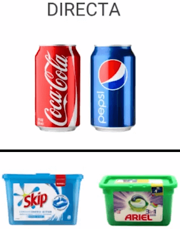
  <small>
Ejemplo: Competencia Directa
</small>

* **Indirecta**: Comparten solamente unas cuantas características, puede ser elegido por los usuarios en lugar del nuestro aunque no son iguales.

  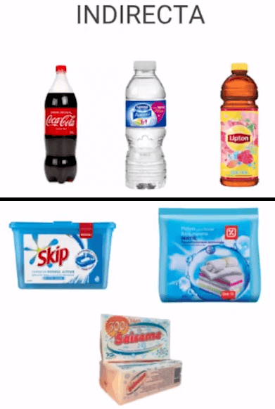
  <small>
Ejemplo: Competencia Indirecta
</small>

## La base de datos

Dentro del email marketing, hay una herramienta central sin la cual, no podríamos hacer ningún tipo de campaña. ¿Cuál es? La base de datos.

**¿Qué es una base de datos?** Una base de datos es un conjunto de datos pertenecientes a un mismo contexto y almacenados sistemáticamente para su posterior uso. Una biblioteca con libros o cds, puede considerarse una base de datos.

Las base de datos deben crearse desde el inicio de un negocio, empresa o marca, obteniendo el email de clientes o posibles clientes en forma genuina (los usuarios tuvieron que haber aceptado, en alguna instancia, brindarte su email y recibir campañas de parte de la empresa).

Gracias al avance de la tecnología, contamos con bases de datos almacenados en medios digitales.

En el caso del email marketing, las bases de datos contendrán información de nuestros usuarios (entre ellos, su cuenta de email, un punto fundamental).

**¿Dónde se almacenan las bases de datos?**

En caso de que cuentes con un sitio web propio, se utiliza el SQL (Structured Query Language), que es un lenguaje utilizado para acceder al sistema de gestión de la base de datos de tu sitio web.

También puedes almacenar estos datos en una plantilla tipo Microsoft Excel, Hoja de cálculo de Google Drive, Microsoft Access o, inclusive, en un bloc de notas (aunque esta última herramienta no es recomendada, ya que no permite ordenar los datos).

Es súper importante que esta información esté clasificada y organizada según distintas variables, tales como email, nombre, ciudad, edad, intereses de los usuarios, fecha de última compra, género o tipos de clientes.

**Es fundamental evitar comprar bases de datos. ¿Por qué?**

Antes que nada, por un aspecto legal: cuando compramos una base de datos los destinatarios de la misma (en la mayoría de los casos) no han dado su consentimiento para que les enviemos información.

Muchas veces, estas bases de emails están compuestas por emails que han sido recopilados de manera poco éticas y/o fraudulentas.

Al comprar bases de datos, se incrementan muchísimo los chances de que tu email caiga en SPAM (o sea, que los usuarios no solo no vean tu mensaje, si no que sospechen acerca de tu reputación como empresa).

En paralelo, si la plataforma que utilizas para envío de emails (Mailchimp, Benchmark, etc.) detecta que usas bases de datos compradas y tus emails caen en SPAM, puede llegar a dar de baja tu cuenta y tu reputación como remitente, se verá afectada.

**Recuerda**:
Las bases de datos para campañas de email marketing deben armarse a lo largo del tiempo.
El usuario tuvo que haber dado su consentimiento para recibir un email de tu marca/empresa.
El objetivo del email marketing es generar vínculos a largo plazo con los usuarios y que confíen en nuestra marca/empresa.

### Cómo hacer crecer tu base de datos

* **Formulario de contacto** con suscripción al mailing. Se recomienda dar algo a cambio de la suscripción, por ejemplo, vales de descuentos o ofertas especiales.

  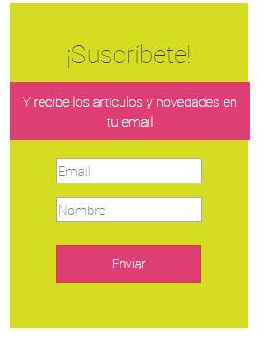
  <small>
Ejemplo: Formulario de Contacto
</small>

* **Lead Magnet**, ofrecer un regalo a cambio de los datos del usuarios. Por ejemplo, un ebook, un gráfico, un reporte, pdf, etc.

  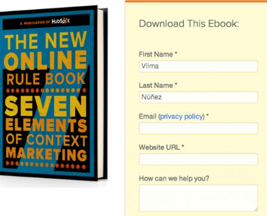
  <small>
Ejemplo: Lead Magnet
</small>

* **Landing Page** donde el call to actión es dejar tu correo.

  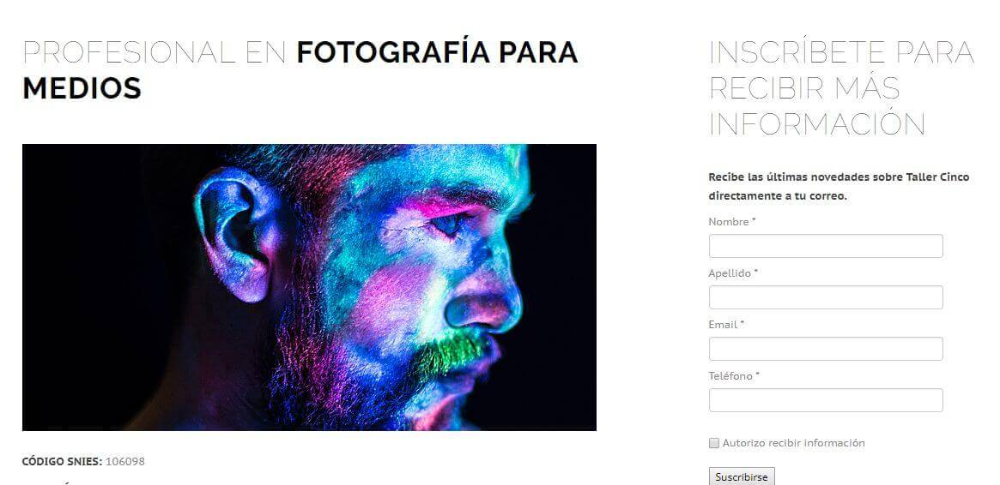
  <small>
Ejemplo: Landing Page
</small>

* **Welcome mat**, es un popup que aparce al entrar a una página y ocupa toda la pantalla y se le invita al usuario a dejar su email a cambio de novedades y descuentos.

  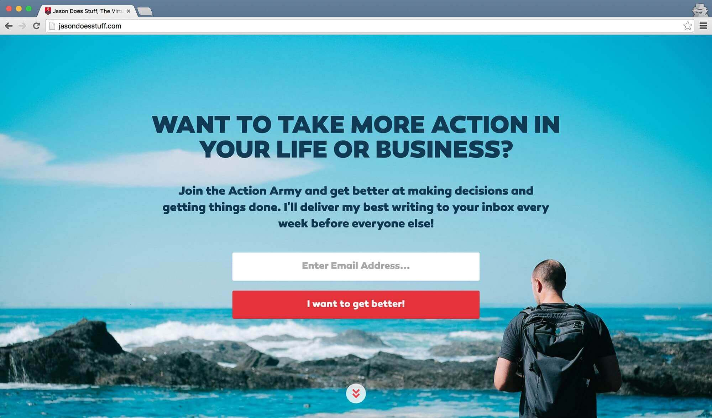
  <small>
Ejemplo: Welcome Mat
</small>

* **Smart bar** es una parra laterial o en la parte superior de la web en donde se invita al usuario a dejar su correo.

  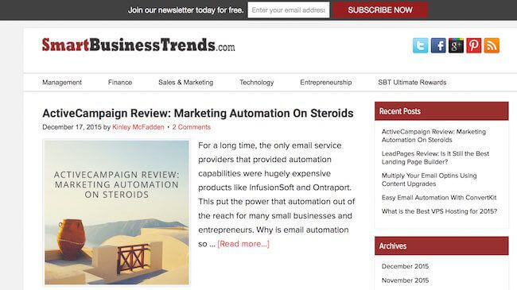
  <small>
Ejemplo: Smart Bar
</small>

* **Login con redes sociales**. Con las redes sociales facilitamos su resgistro y obtenemos su email.

  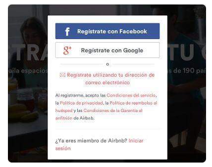
  <small>
Ejemplo: Login con Facebook
</small>

* **Hacer concursos** por redes sociales.

  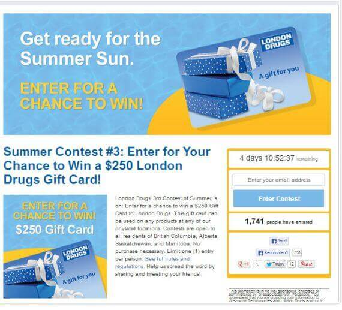
  <small>
Ejemplo: Concurso por Facebook
</small>

* **Facebook Ads** permite hacer campañas en donde se ofrece al usuario dejar su email.

  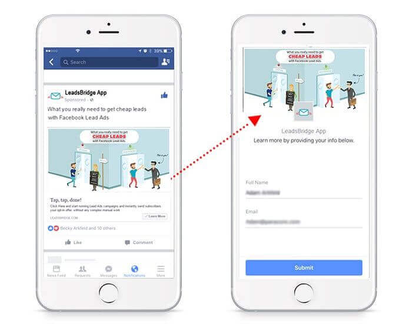
  <small>
Ejemplo: Facebook Ads
</small>

* **Entregando formularios de contacto físicos** en ferias, eventos, locales del negocio, etc.

  **Ejemplo**:
  * ¿Cómo calificarías la atención recibida?
  * ¿Qué nos recomendarías para mejorar nuestro servicio en nuestros restaurantes?
  * ¿Cuál es tu opinión sobre nuestra oferta gastronómica?
  * Déjanos tu email para recibir novedades y descuentos exclusivos en todas nuestras
  sucursales

### Segmentación

**Segmentar** = Agrupar a los usuarios según ciertos criterios o ciertas variables.

**Puntos importantes**:
* Es importante que para comenzar la segmentación se tenga bien definido a los Buyer-Persona.
* La segmentación se va a reflejar parcialmente en cómo se va a estructurar el formulario de contacto que se tenga en el sitio web.
* Hay que evaluar cuáles son los criterios que queremos utilizar para segmentar.

**¿Qué criterios utilizar?**
* Puedes utilizar infinita cantidad de criterios y variables
para segmentar tu base de datos.
* Veamos algunas opciones:
* Sexo/género
* Edad
* Fecha de última compra en tu sitio web
* Productos/servicios comprados
* Ubicación geográfica
* Industria/profesión
* Datos sobre mascota
* Tipo de cliente (consumidor final, mayorista, empresa)
* Intereses

### Dónde almacenar la base de datos

* Las bases de datos se pueden alojar en:
* Planilla de cálculos (Excel, Hoja de 
cálculo de Drive)
* Notepad / Bloc de notas
* Access (programa de Microsoft Office)
* Servidores de base de datos vinculados 
a sitios web (SQL, MySQL, etc.)

### Limpieza 

**¿Por qué es importante?**
* Nos aseguramos de trabajar con usuarios cuyas cuentas de email se encuentren activas.
* Evitamos penalizaciones por parte de la plataforma de email marketing que utilicemos para
envío de campañas.
* Reducimos las posibilidades de caer en SPAM.

Tipos de email a eliminar:
* Cuentas inexistentes
* Cuentas con inactividad por más de 6 meses
* Cuentas mal redactadas (ej.: daniela@gmial.com)

## Plataformas de Email Marketing

  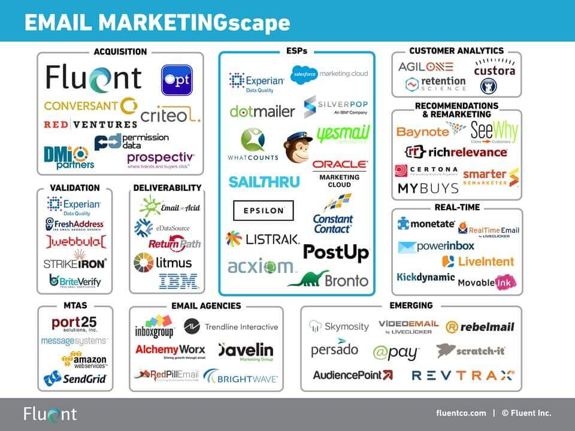
  <small>
Email Marketing Landscape
</small>

### Mailchimp

* Cuenta gratuita de por vida (hasta 2.000 
suscriptores, hasta 12.000 emails por mes)
* Sencillo y fácil de utilizar, súper intuitivo
* Lleva más tiempo en el mercado 
* Ofrece integraciones con otras
plataformas 
* Plantillas pre-diseñadas
* Medición instantánea de resultados
* Fácil organización de listas de usuarios

### Doppler

* Prueba gratuita con hasta 500 suscriptores.
* Campañas automatizadas
* Disponible en español
* Blog constantemente actualizado
* Medición instantánea de resultados
* Simple de utilizar

### Google Analytics

* Herramienta de analítica de sitios web
* Gratuita
* Herramienta complementaria para el
análisis de la campaña de email marketing
* Sirve para analizar las actividades
realizadas por el usuario en el sitio web,
una vez que arribó al mismo desde una
campaña de email marketing

##  Tipos de emails/campañas

### Emails de activación

Los utilizamos siempre que hay un usuario con una nueva suscripción, en este email podemos poner la información de bienvenida, explicar el servicio y/o producto y tal vez algún regalo de bienvenida.

  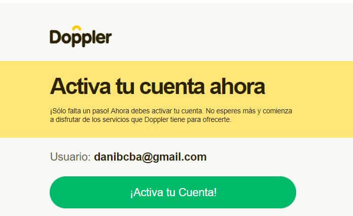
  <small>
Ejemplo: Activa tu cuenta
</small>

  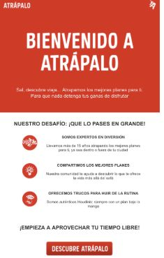
  <small>
Ejemplo: Ventajas comparativas y beneficios
</small>

  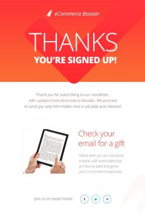
  <small>
Ejemplo: Agradecer por el registro y dar ebook
</small>

  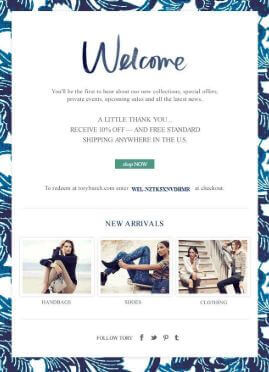
  <small>
Ejemplo: Comunicar los productos
</small>

  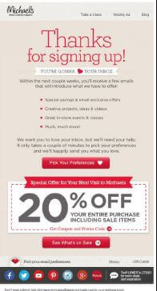
  <small>
Ejemplo: Motivar a comprar por medio de descuentos
</small>

  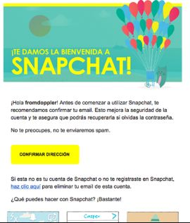
  <small>
Ejemplo: Describir las funcionalidades
</small>

  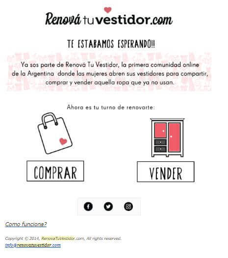
  <small>
Ejemplo: Vínculo emocional
</small>

  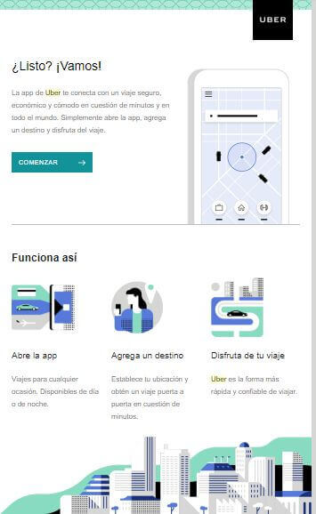
  <small>
Ejemplo: Cómo funciona el servicio
</small>

### Email de promoción

En este tipo de piezas el objetivo es que los usuarios realicen una compra de un producto o una reserva de un servicio a partir del email que enviamos.

  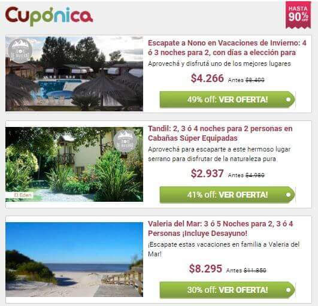
  <small>
Ejemplo: Listado de productos y servicios
</small>

  
  <small>
Ejemplo: Eventos particulares
</small>

  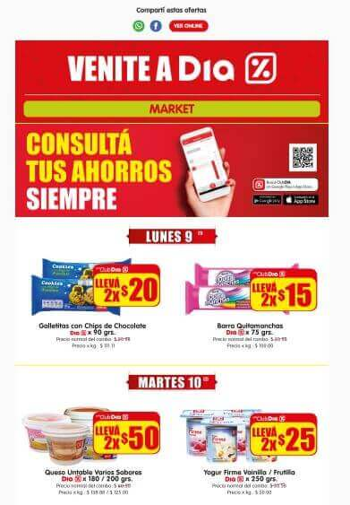
  <small>
Ejemplo: Ofertas
</small>

  
  <small>
Ejemplo: Beneficio Vip con tiempo límite
</small>

  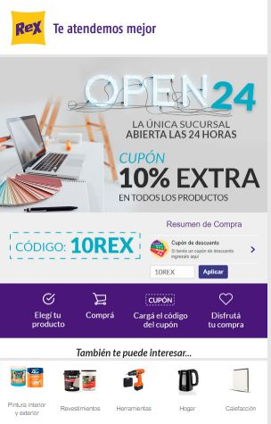
  <small>
Ejemplo: Categorías con descuentos exclusivos
</small>

  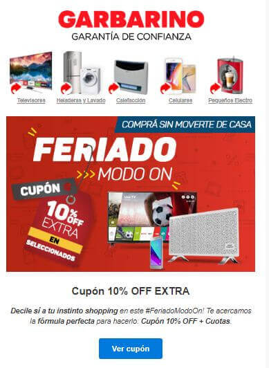
  <small>
Ejemplo: Descuento a través de cupón
</small>

  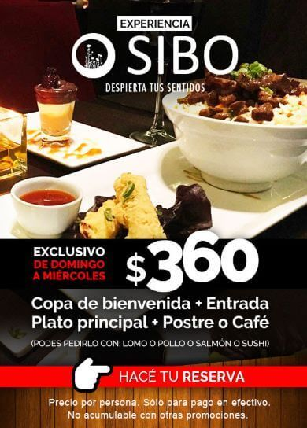
  <small>
Ejemplo: Descuento exclusivo
</small>

  
  <small>
Ejemplo: Reservar curso
</small>

  
  <small>
Ejemplo: Comunicar los eventos y shows
</small>

  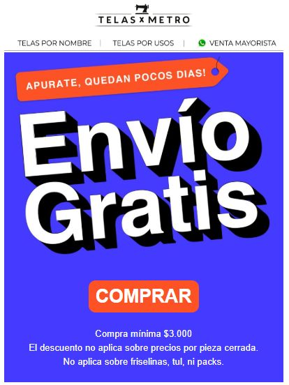
  <small>
Ejemplo: Envío gratuito
</small>

  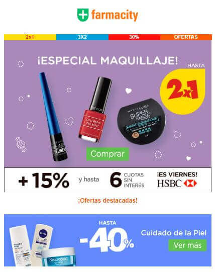
  <small>
Ejemplo: Ventajas del producto
</small>

  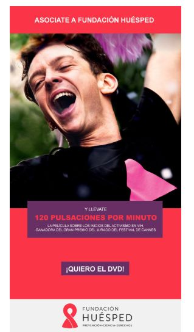
  <small>
Ejemplo: ONG
</small>

## Recursos Complementarios
* [Diapositivas del Curso](docs/platzi-email-marketing-course.pdf)
* [El foda](docs/foda.pdf)

  <small><a href="#tabla-de-contenido">🡡 volver al inicio</a></small>

## Enlaces de Interés
* [Curso de Email Marketing](https://platzi.com/clases/email-marketing/)
* [Mailchimp](https://mailchimp.com/)
* [Doppler](https://www.fromdoppler.com/)
* [Google Analytics](https://analytics.google.com)

  <small><a href="#tabla-de-contenido">🡡 volver al inicio</a></small>

