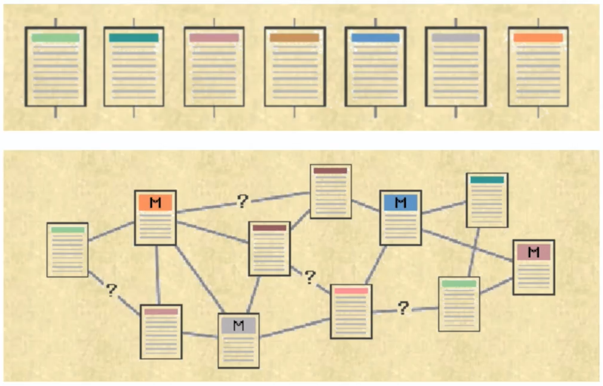
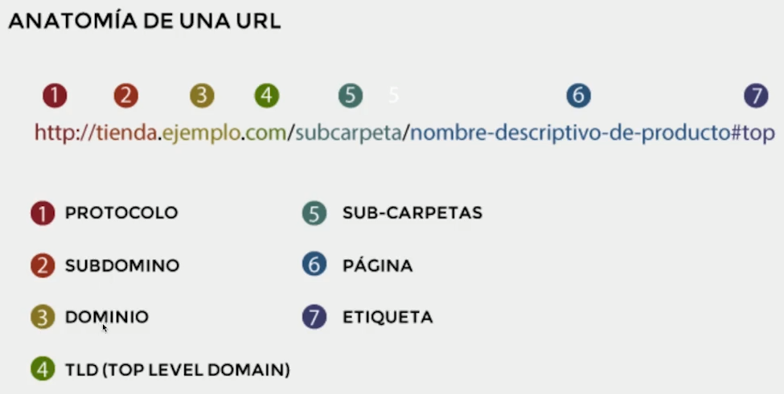

# Curso de Escritura Online<!-- omit in toc -->

## Tabla de Contenido<!-- omit in toc -->
- [Por qué escribir para Internet](#por-qué-escribir-para-internet)
- [Técnicas Básicas de Redacción](#técnicas-básicas-de-redacción)
- [Reglas de Ortografía](#reglas-de-ortografía)
  - [Reglas de acento: Agudas](#reglas-de-acento-agudas)
  - [Reglas de acento: Graves](#reglas-de-acento-graves)
  - [Reglas de acento: Esdrújulas](#reglas-de-acento-esdrújulas)
  - [Reglas de acento: Sobresdrújulas](#reglas-de-acento-sobresdrújulas)
  - [Otras reglas de acento](#otras-reglas-de-acento)
  - [Has y haz son diferentes](#has-y-haz-son-diferentes)
  - [Reglas de la R](#reglas-de-la-r)
  - [Reglas de la B](#reglas-de-la-b)
  - [Reglas de la V](#reglas-de-la-v)
- [Signos de puntuación](#signos-de-puntuación)
  - [El uso del punto](#el-uso-del-punto)
  - [El uso de la coma](#el-uso-de-la-coma)
  - [El uso del punto y coma](#el-uso-del-punto-y-coma)
  - [Los dos puntos](#los-dos-puntos)
  - [Signos de admiración](#signos-de-admiración)
  - [Signos de pregunta](#signos-de-pregunta)
- [Estructura de un párrafo](#estructura-de-un-párrafo)
- [Proceso y planeación de textos](#proceso-y-planeación-de-textos)
- [Estructura general de un ensayo expositivo.](#estructura-general-de-un-ensayo-expositivo)
- [La multimedialidad y la interactividad en la escritura online](#la-multimedialidad-y-la-interactividad-en-la-escritura-online)
- [Conectores](#conectores)
- [Hepertexto](#hepertexto)
  - [Estructura del hipertexto](#estructura-del-hipertexto)
  - [Elementos del hipertexto](#elementos-del-hipertexto)
  - [Uso correcto del hipertexto](#uso-correcto-del-hipertexto)
- [Uso de fuentes](#uso-de-fuentes)
- [Tipos de citas y cómo construirlas](#tipos-de-citas-y-cómo-construirlas)
- [Contenido relevante y de calidad](#contenido-relevante-y-de-calidad)
- [Posicionamiento SEO](#posicionamiento-seo)
  - [Palabras Clave](#palabras-clave)
  - [Estrategias para definir palabras claves](#estrategias-para-definir-palabras-claves)
  - [Títulos](#títulos)
  - [Metadescripciones](#metadescripciones)
  - [URLs](#urls)
  - [Descripciones Alt](#descripciones-alt)
- [Evaluar el readability](#evaluar-el-readability)
- [Recursos Complementarios](#recursos-complementarios)
- [Enlaces de Interés](#enlaces-de-interés)

## Por qué escribir para Internet

* Los textos son uno de los medio más consumidos.
* Nos ayuda a posicionar nuestra marca y contenido
* Una gran carta de presentación
* Una habilidad muy demandada

  <small><a href="#tabla-de-contenido">🡡 volver al inicio</a></small>

## Técnicas Básicas de Redacción

* **Crear un esquema**. Dar orden a las ideas y saber a dónde llevamos el texto. Veremos algunas técnicas para organizar tus ideas de acuerdo a tu estilo y el estilo del texto que estás escribiendo.
* **Una sola idea**, así evitas confundir a la audiencia.
* **No uses ideas superfluas**, siempre entrega información realmente relevante.
* **Evita al máximo la repetición**, de esta forma mantendrás la atención de tu audiencia.
* Debemos **leer nuestros propios textos** tanto mentalmente como en voz alta para detectar faltas de puntuación o cualquier otro fallo en el texto.
* Las **fuentes** enriquecen nuestros textos. Siempre debemos enfocarnos en tener suficientes fuentes para soportar nuestras ideas.
* **Parafrasear**. Decir una idea de otra persona utilizando otras palabras, hay que tener en cuenta que hay que darles el crédito que se merecen por la idea sin dejar a lado nuestra esencia.
* **Reducir gerundios** es una forma de hacer nuestro texto sea menos repetido en español
* **Estilo** es algo que se desarrolla con la práctica, que dé como resultado esa voz o escancia que tenemos como autores. Esto es algo personal.

  <small><a href="#tabla-de-contenido">🡡 volver al inicio</a></small>

## Reglas de Ortografía

### Reglas de acento: Agudas

Las palabras agudas (llevan la entonación en la última sílaba), se marca el acento cuando terminan en vocal, o en consonante n/s. 

**Ejemplos**: Perú, sofá, café, rubí

También marcamos el acento cuando terminan en las consonantes n o s. 

**Ejemplos**: También, según, además, repetición

En algunas ocasiones marcamos el acento incluso cuando no terminan en vocal n o s. Esto se da por la ruptura de un diptongo.

**Ejemplos**: Raúl, baúl, maíz

También existen palabras que son agudas, pero a las que no se les marca el acento.
Ejemplo: Amor, cantidad, papel, reloj

### Reglas de acento: Graves

Las palabras graves o llanas son las que tienen el acento en la penúltima sílaba. De la misma forma que las anteriores, no todas las palabras graves llevan acento ortográfico. Estas palabras no llevan acento si terminan en vocal n o s.

**Ejemplos** de palabras graves que llevan acento ortográfico:  
Árbol, cárcel, ángel, difícil

**Ejemplos** de palabras no llevan acento ortográfico:  
Problema, adulto, martes, zapato

### Reglas de acento: Esdrújulas

Las palabras esdrújulas son las que llevan el acento en la antepenúltima sílaba. Es importante aclarar que todas las palabras llevan acento ortográfico.

**Ejemplos**: América, cuídate, hígado, ejército

  <small><a href="#tabla-de-contenido">🡡 volver al inicio</a></small>

### Reglas de acento: Sobresdrújulas

Las palabras sobresdrújulas son aquellas que llevan el acento ortográfico en la sílaba anterior a la antepenúltima sílaba. Como las anteriores todas llevan tilde.

**Ejemplos**: Cuéntamelo, éticamente, fácilmente, repítemelo

  <small><a href="#tabla-de-contenido">🡡 volver al inicio</a></small>

### Otras reglas de acento

Los monosílabos no llevan acento a menos que:
* **Sí** (adverbio de afirmación) siempre lleva tilde y no debe ser confundido con si (conjunción).
* **Sé** (verbo de conocer) siempre lleva tilde y no debe confundirse con la preposición.
* Los pronombres **él**, **tú** y **mí**. Siempre llevan tilde y no deben ser confundidos con el artículo el y los adjetivos tu y mi.
* **Más** (adverbio) que no debe ser confundido con mas (conjunción).

Los monosílabos verbales **fue**, **fui**, **vio** y **dio** no llevan acento ortográfico.

Las palabras **que**, **quien**, **como**, **cuando**, **cuanto** y **donde** llevan acento siempre que sean usados de forma dubitativa, interrogativa o admirativa.

  <small><a href="#tabla-de-contenido">🡡 volver al inicio</a></small>

### Has y haz son diferentes

**Has** es el indicativo del verbo haber en segunda persona. Se usa en oraciones como:
* Has tenido que participar
* Has mostrado compromiso

**Haz**, por otro lado, se refiere al verbo hacer cuando es un imperativo:
* ¡Haz el trabajo antes del último plazo!
* Haz una pausa, luces cansado

  <small><a href="#tabla-de-contenido">🡡 volver al inicio</a></small>

### Reglas de la R

Tras las consonantes l-n-s y al principio de la palabra se escribe r aunque suene como rr.  
**Ejemplos**: Israel, Sonrisa, Honra

Cuando se encuentra entre dos vocales se escribe rr.  
**Ejemplos**: Arruyo, Corrillo, Cerro

  <small><a href="#tabla-de-contenido">🡡 volver al inicio</a></small>

### Reglas de la B

Las palabras que comienzan por ob-ab.  
**Ejemplos**: Objetar, abrir

Las palabras que comienzan por bu, bur, bus.  
**Ejemplos**: Bujía, burbuja

Las palabras que terminan en bilidad.  
**Ejemplos**: Responsabilidad, Contabilidad

Las palabras que terminan en bundo-bunda.  
**Ejemplos**: Vagabundo, meditabunda

Las palabras que terminan en probar.  
**Ejemplos**: Aprobar, reprobar

  <small><a href="#tabla-de-contenido">🡡 volver al inicio</a></small>

### Reglas de la V

Las palabras que comienzan por ad.  
**Ejemplos**: Adverbio, adviento

Las palabras que comienzan por lla, lle, llo, llu.  
**Ejemplos**: Lluvia, llovizna, llavero

Las palabras que terminan en venir.  
**Ejemplos**: Convenir, prevenir

Las palabras que terminan en tivo, tiva, tivamente.  
**Ejemplos**: Positivo, caritativa, activamente

  <small><a href="#tabla-de-contenido">🡡 volver al inicio</a></small>

## Signos de puntuación

### El uso del punto

Existen tres tipos de punto: El punto seguido, el punto y aparte y el punto final.

El **punto seguido** separa enunciados en un mismo párrafo y que comparten una misma idea. Después de un punto seguido se sigue escribiendo en el mismo renglón.

El **punto y aparte** separa párrafos completos. Al usar este signo de puntuación debemos comenzar con un nuevo párrafo.

El **punto final** termina un texto completo.

  <small><a href="#tabla-de-contenido">🡡 volver al inicio</a></small>

### El uso de la coma

La coma es un signo de puntuación usado para indicar una pausa breve dentro de un enunciado:

Separar los miembros de una enumeración, a menos de que vengan precedidos por una conjunción como y, e, o, u.  
**Ejemplo**: Todos los miembros del equipo estuvimos reunidos: finanzas, desarrollo, marketing y soporte.

De la misma forma, se usa para separar miembros gramaticales equivalentes dentro de un mismo enunciado.  
**Ejemplo**: Antes de irte apaga las luces, la máquina de café, los computadores y los televisores.

Sin embargo, cuando después de los miembros se quiere expresar un contenido se debe poner una coma antes de la conjunción.  
**Ejemplo**: Cuando estuvimos en Villa-Platzi comimos carne, pescado, fruta, parrillada, y todo estaba delicioso.

La coma también se ubica antes de la conjunción cuando la conjunción se enlaza a la proposición anterior, y no con el último de los miembros de la enumeración.  
**Ejemplo**: Lavó los platos, la ropa, la mesa y salió a caminar.

Usamos la coma para separar el vocativo (llamar o invocar a una persona o cosa).  
**Ejemplo**:  
David, ven por favor.  
Por favor presten atención, chicos.

Cuando usamos aposiciones explicativas.  
**Ejemplo**: John Freddy Vega, el CEO de Platzi, ha participado en más de 300 eventos de educación.

Las proposiciones adjetivas explicativas.  
**Ejemplo**: Los cursos de Platzi, que se encuentran ya disponibles en nuestra app móvil, cubren diversas áreas como diseño, desarrollo, marketing y negocios.

Cualquier explicación o precisión a algo dicho.  
**Ejemplo**: Todos los profesionales, incluso los perfiles técnicos, tienen conocimientos sobre escritura.

Cuando utilizamos conectores como es decir, esto es, o sea, en fin, por último, por consiguiente, sin embargo, no obstante, además, y también cuando utilizamos algunos adverbios o locuciones que desempeñan función de modificadores oracionales, como generalmente, posiblemente, efectivamente, por regla general que se ubican al principio de una oración y se separan del resto de la oración por medio de una coma.  
**Ejemplo**:  
* Por consiguiente, es necesario que seamos capaces de interactuar con nuestros estudiantes.  
* Generalmente, los cursos que se ofrecen en Platzi están enfocados a áreas relacionadas con la tecnología.

Cuando los conectores van en medio de la oración.  
**Ejemplo**: Los usuarios, es decir, todas las personas que se matriculan en un curso tienen derecho a tomar el examen.

  <small><a href="#tabla-de-contenido">🡡 volver al inicio</a></small>

### El uso del punto y coma

El punto y coma es un signo de puntuación utilizado para marcar pausas más largas que las marcadas por la coma y más cortas que las marcadas por el punto. Es un signo de puntuación que tiene un alto grado de subjetividad en su uso. Sin embargo, aquí te muestro algunos de sus usos más comunes:

Para separar elementos de una enumeración cuando son expresiones complejas y que llevan comas.  
**Ejemplo**: Cada estudiante tomará un énfasis diferente: el primero, tomará marketing; el segundo, tomará negocios; el tercero, tomará desarrollo; y el cuarto, tomará diseño.

Para separar oraciones que tienen una estructura sintáctica diferente, pero que comparten una estrecha relación semántica.  
**Ejemplo**: Vamos a casa; van a quitar la luz.

Se escribe punto y coma antes de conectores de sentido adversativo, concesivo o consecutivo, como pero, mas, aunque, sin embargo, por tanto, por consiguiente, etc.  
**Ejemplo**: Durante la hackaton todos los equipos hicieron su mejor esfuerzo; sin embargo, solo podía haber un ganador.

  <small><a href="#tabla-de-contenido">🡡 volver al inicio</a></small>

### Los dos puntos

Los dos puntos se usan para llamar la atención sobre lo que sigue. Se pueden usar en los siguientes casos:

Después de anunciar una enumeración:  
**Ejemplo**: Los cursos lanzados son: el curso de bases de datos, el curso de marca personal y el curso de gestión de proyectos.

También pueden ser utilizados al revés para terminar una enumeración.  
**Ejemplo**: Marketing, negocios, desarrollo y diseño: esas son las áreas en las que nos especializamos.

  <small><a href="#tabla-de-contenido">🡡 volver al inicio</a></small>

### Signos de admiración

Son signos que se usan con el fin de mostrar énfasis en un enunciado. Lo más importante aquí es recordar que debemos usar un signo de apertura (¡) y uno de cierre (!).

  <small><a href="#tabla-de-contenido">🡡 volver al inicio</a></small>

### Signos de pregunta

Estos son usados para denotar una expresión dubitativa o interrogativa. De la misma forma que los signos de admiración deben tener un signo de apertura (¿) y uno de cierre (?).

  <small><a href="#tabla-de-contenido">🡡 volver al inicio</a></small>

## Estructura de un párrafo

El párrafo se divide en cuatro secciones: idea principal, evidencia, análisis y transición o conclusión.

* **La idea principal**, presenta la idea general del párrafo.
* **La evidencia**, contiene información relevante que soporta la idea principal del párrafo.
* **El análisis**, es el momento en el que autor plantea el análisis de la información que está presentando.
* **Oración de transición**, lleva al lector al siguiente párrafo.

>Maneja, organiza y comparte toda tu agenda y tus tareas en un solo lugar. PlatziAgenda es una aplicación que te permitirá administrar todas tus tareas. Podrás crear tareas nuevas, darles una prioridad específica, invitar a personas a que realicen la misma tarea e incluso hacer seguimiento al cumplimiento de la tarea. Además, podrás compartir tu calendario de tareas con otras personas dentro y fuera de tu equipo. La aplicación te permitirá evaluar tu productividad al final del día, semana o mes y te dará estadísticas sobre tu desempeño y efectividad. Descarga la aplicación y organiza tu vida en un cerrar de ojos.

  <small><a href="#tabla-de-contenido">🡡 volver al inicio</a></small>

## Proceso y planeación de textos

¿Cuáles son las fases que desarrollamos a la hora de escribir nuestros textos?

* **Pre-escritura**, estrategias que nos permiten identificar las ideas que vamos a usar en el texto. Lluvia de ideas o mapa mental.
* **Borrador**, es el primer intento de nuestro texto.
* **Correcciones**, es importante leer y releer los textos para identificar falencias, errores de ortografía y repeticiones.
* **Re-escritura**, evaluar nuevas fuentes y componentes para soportar nuestro texto.
* **Publicación**, hacer público el contenido en algún medio o sitio web.
  
**Estrategias de planeación de texto**:
* ¿Qué proposito tiene el texto?
* ¿Cuál es nuestra audiencia?
* ¿Cuál es el tema?
* ¿Qué tono piensas usar?

  <small><a href="#tabla-de-contenido">🡡 volver al inicio</a></small>

## Estructura general de un ensayo expositivo.

**Intro**

1. Oración de apertura: Llamar la atención del lector.
2. Contexto: Información relevante sobre el tema.
3. Planteamiento de la tesis: Idea a discutir o presentar.

**Cuerpo**

1. Idea principal: Idea general del parrafo.
2. Evidencia: Información que soporte la idea principal.
3. Análisis: Evaluación de la evidencia para hacer clara nuestra postura sobre el tema.
4. Transición (Según el caso): Frase que permita ir al siguiente parrafo de soporte.

**Conclusión**

1. Revisión de las ideas más importantes.
2. Propuesta de solucion o pasos a seguir segun lo discutido.
3. Preguntas que animen al lector a responder. 4. Invitar a complementar la exposición.

  <small><a href="#tabla-de-contenido">🡡 volver al inicio</a></small>

## La multimedialidad y la interactividad en la escritura online

A diferencia de la escritura tradicional, la escritura en internet cuenta con más elementos, por ejemplo el hypertexto y los recursos multimedia.

  
  <small>
Lectura Tradicional vs Web
</small>

**Hypertexto**: Lectura no lineal de un texto. Son enlaces que nos llevan a otros textos distintos. Es útil porque se acomoda mejor a las necesidades del lector y de acuerdo a sus temas preferidos.

**Aprendizaje rizomático**: Aprender sin necesidad de seguir una secuencia en particular.

**Multimedialidad**: Uso de diversos medios en un mismo discurso. Herramientas que nos permiten llevar sentido a través de otros medios.

**Interactividad**: Uso de recursos que permiten que los lectores interactúen con el texto. Son la forma en que una persona y un objeto pueden relacionarse.

  <small><a href="#tabla-de-contenido">🡡 volver al inicio</a></small>

## Conectores

Al escribir un texto podemos usar conectores, los cuales son herramientas que unen o conectan de forma lógica las partes de un texto. El uso adecuado de los conectores depende de que logren expresar la relación que existe entre las diferentes partes del texto.

Existen diversos tipos de conectores, aquí te presento algunos:

**Para comenzar un texto podemos usar**:
* El propósito de este texto…
* En primer lugar
* El tema a tratar

**Para oponer argumentos**:
* Por una parte… por otra…
* Sin embargo
* No obstante
* Ahora bien
* En contraste

**Para añadir a lo que estamos discutiendo**:
* Además
* Asimismo
* También
* Igualmente
* De igual modo

**Para dar ejemplos**:
Por ejemplo
A modo de ejemplo
La prueba es que

**Para señalar dificultades**:
A pesar de que
Aunque
Si bien

  <small><a href="#tabla-de-contenido">🡡 volver al inicio</a></small>

## Hepertexto

### Estructura del hipertexto

* **Estructura lógica**: es la forma con la que organizamos la información. Es decir, cómo organizamos los archivos y documentos que tenemos dentro de un sitio.
* **Estructura de la navegación**: la forma en la que el usuario puede navegar a través de nuestra información.
* **Estructura funcional**: son todos los componentes y herramientas que hacen posible la nevagación y organización lógica. 

  <small><a href="#tabla-de-contenido">🡡 volver al inicio</a></small>

### Elementos del hipertexto

* **Los nodos**: son unidades de informacion que tenemos almacenada en algun sitio
* **Los enlaces**:  son las direcciones que utilizamos para direccionar a ese sitio
* **Los anclajes**: son las palabras o los elementos que utilizamos dentro de nuestro sitio para acceder a esa información

  <small><a href="#tabla-de-contenido">🡡 volver al inicio</a></small>

### Uso correcto del hipertexto

**Tips** para permitir saber cómo puedes utilizar estos anclajes y utilizarlos de manera especifica para que tus usuarios puedan navegar la informacion que le estas presentando.

* Constratar los anclajes que vamos a utilizar en nuestros textos
* Evitar referencias textuales
* No saturar
* Prescindir de enlaces innecesarios
* Distinguir tipográficamente entre enlaces principales y secundarios
* Usar un enlace solo una vez por pagina
* Relacionar los anclajes con las referencias hipertextuales (que cuando usemos un anclaje especifico este este relacionado con el sitio de destino donde lleva)
* Anclajes cortos
* Usar anclajes textuales significativos
* Remitir a páginas internas y no a páginas principales
* Si usamos términos específicos debemos dar el link

  <small><a href="#tabla-de-contenido">🡡 volver al inicio</a></small>

## Uso de fuentes

* Libros
* Artículos de revistas indexadas.
* Artículos publicados en sitios web y que sean validados por una comunidad.
* Autoridades en la industria específica.

  <small><a href="#tabla-de-contenido">🡡 volver al inicio</a></small>

## Tipos de citas y cómo construirlas

Hoy día una de las referencias más importantes en los procesos de citación y desarrollo de trabajos académicos es la American Psychology Association y sus normas APA. Estas reglas nos permiten hacer citas claras y fáciles de consultar para quien lee nuestro texto.

Las **citas textuales** son aquellas que reproducen con completa fidelidad el contenido que estamos referenciando. En este caso se debe citar el autor, el año, el número de página. Estas citas deben ir entre comillas. Si la cita tiene más de 40 palabras esta debe estar escrita en un párrafo aparte.

**Ejemplo**: De acuerdo con (Cortés, 2000) “todos los mecanismos usados en estos experimentos…” (p.9).

La **citas indirectas** son aquellas que buscan parafrasear lo que el autor dijo utilizando otras palabras. En estas debemos citar el nombre del autor y el año en el que fue publicado el texto.

**Ejemplo**: Cortés (2000) considera que los cambios en el comportamiento obedecen…

Si citamos información encontrada en la web: Se cita al autor y el año de publicación.

**Lista de referencias**:

* **Libro**: 
  
  >Apellido, A. A. (Año). Título. Ciudad, País: Editorial

* **Libro electrónico**: 
  
  > Apellido, A. A. (Año). Título. Recuperado de http://www…

* **Capítulo de libro**: únicamente en los casos de libros compilatorios y antologías en los cuales cada capítulo tenga un autor diferente y un compilador o editor
 
  > Apellido, A. A., y Apellido, B. B. (Año). Título del capítulo o la entrada. En A. A. Apellido. (Ed.), Título del libro (pp. xx-xx). Ciudad, País: Editorial.

* **Publicaciones periódicas formato impreso**
  
  > Apellido, A. A., Apellido, B. B, y Apellido, C. C. (Fecha). Título del artículo. Nombre de la revista, volumen(número), pp-pp.

* **Publicaciones periódicas online**
  
  > Apellido, A. A. (Año). Título del artículo. Nombre de la revista, volumen(número), pp-pp. Recuperado de http:/ /www…

Si quieres aprender más sobre citación formal puedes consultar esta página: http://normasapa.net/2017-edicion-6/

  <small><a href="#tabla-de-contenido">🡡 volver al inicio</a></small>

## Contenido relevante y de calidad

¿Cómo crear contenido relevante y de calidad?

* **Relevancia para la audiencia**: Que sepas a cual audiencia te estas dirigiendo, quienes son esas personas a las que les estas hablando. Diseña un buyer persona.

* **Siempre enseñar algo**: Por muy grande o pequeño que se tu parte en lo compartes debes de mostrarlo a los demás.

* **Utiliza fuentes relevantes**: Siempre busca la información de una fuente confiable, de una persona que tenga un reconocimiento en la web, tv, radio, prensa. No colocar cualquier cosa que conseguiste en cuentas de blogs de dudosa procedencia o paginas de contenido conducida por trolls de internet.

* **Ten un estilo de escritura cuidadoso**: Siempre debes tener la atención a los detalles y a las cosas que estas escribiendo, recuerda que lo escribes puede ser usado en el futuro o para la posteridad.

  <small><a href="#tabla-de-contenido">🡡 volver al inicio</a></small>

## Posicionamiento SEO

### Palabras Clave

Las palabras clave son aquellas que los usuarios utilizan para encontrar un contenido o concepto en particular. 

Es importante tenerlas en cuenta porque permiten que aumentemos nuestro posicionamiento en el buscador.

  <small><a href="#tabla-de-contenido">🡡 volver al inicio</a></small>

### Estrategias para definir palabras claves

1. Define tu contenido: Cuales son esos temas y aéreas en los cuales nos vamos a enfocar.

2. Pregunta a tus usuarios – Problemas: De qué manera se buscaría ese contenido, que temas quiere encontrar, que temas le surgen.

3. Busca las palabras en tu área: Cuales son las mejores ranqueadas en el buscador usando: Google Trends, Google Adwords

  <small><a href="#tabla-de-contenido">🡡 volver al inicio</a></small>

### Títulos

La definición de los títulos es de las partes más importantes a tener en cuenta para el posicionamiento en SEO.

**Recomendaciones**:
* Definir palabras clave: la palabra clave debe de estar en el título.
  
* Utiliza la etiqueta H1 de HTML, esa etiqueta le da más relevancia al texto que estás mostrando

* Es importante que uses títulos únicos. Ya que si está repetido los buscadores lo toman como contenido duplicado y lo penalizan.

* Busca que los títulos tengan entre 40 y 70 caracteres

  <small><a href="#tabla-de-contenido">🡡 volver al inicio</a></small>

### Metadescripciones

**¿Cómo crear metadescripciones?**
* Usa lenguaje atractivo
* Yoast SEO
* Máximo 160 caracteres
* Incluye palabras clave
* Anuncio

**Recomendaciones**:
* Evita el uso de mayúsculas sostenidas.
* No uses comillas.
* Procura no duplicar la información.

  <small><a href="#tabla-de-contenido">🡡 volver al inicio</a></small>

### URLs 

URLs son la forma en la que hacemos clara la IP de nuestro sitio para que los usuarios puedan acceder.

  
  <small>
Anatomía de una URL
</small>

Recomendaciones:
* Cortas
* Palabra clave
* Usar guiones
* Evitar caracteres extraños

  <small><a href="#tabla-de-contenido">🡡 volver al inicio</a></small>

### Descripciones Alt

Las descripciones alt son, en realidad, la "única" forma que tienen los buscadores para posicionar tus imágenes. Los buscadores no son capaces de ver imágenes, pero si las descripciones lt, y ahí radica el punto de por qué describir la imagen, incluir la palabra clave, etc.

Recomendaciones:
* Cortas
* Palabra clave
* Describe la imagen
* Logra que el tamaño sea pequeño

  <small><a href="#tabla-de-contenido">🡡 volver al inicio</a></small>

## Evaluar el readability

¿Qué es Readability? Es la legibilidad que tiene un texto para un usuario.

Recuerda siempre que debes dar contenido de calidad a tus lectores. 

* Es muy recomendable que uses sinónimos en el texto, de esta forma no repites la misma palabra clave.

* Concéntrate en la experiencia del usuario, crea una buena interfaz gráfica, rápida, con textos claros y concisos.

* Ten presente las búsquedas de voz, los usuarios aprovechan cada vez más estas opciones que ofrecen los dispositivos.

**Recomendaciones**:
* Longitud de las oraciones y párrafos.
* Secciones y títulos.
* Uso de imágenes.

  <small><a href="#tabla-de-contenido">🡡 volver al inicio</a></small>

## Recursos Complementarios
* [Diapositivas del Curso](docs/curso-de-escritura-online.pdf)
* [Estructura de un Ensayo Expositivo](docs/estructura-de-un-ensayo-expositivo.pdf)
* [Resumen Analítico Especializado](docs/rae-resumen-analitico-especializado.pdf)

  <small><a href="#tabla-de-contenido">🡡 volver al inicio</a></small>

## Enlaces de Interés
* [Curso de Escritura Online](https://platzi.com/clases/escritura)

  <small><a href="#tabla-de-contenido">🡡 volver al inicio</a></small>

