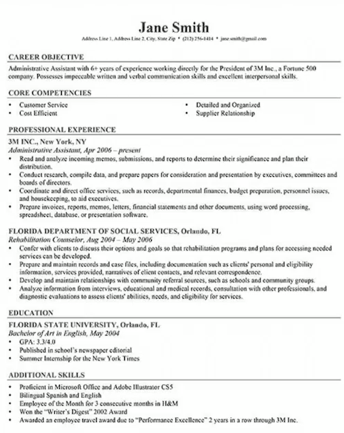
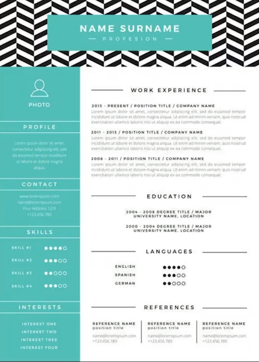

# Curso de Escritura en Inglés<!-- omit in toc -->

## Table of Contents<!-- omit in toc -->
- [Why do you need to learn how to write in English?](#why-do-you-need-to-learn-how-to-write-in-english)
- [Effective and persuasive communication](#effective-and-persuasive-communication)
- [Linguistic elements](#linguistic-elements)
- [El proceso de escritura](#el-proceso-de-escritura)
- [Topic Sentence](#topic-sentence)
- [Outline](#outline)
  - [How to create an outline](#how-to-create-an-outline)
  - [Types of outlines](#types-of-outlines)
    - [Emails](#emails)
    - [Formal Letter Outline](#formal-letter-outline)
    - [Cover Letter Outline](#cover-letter-outline)
    - [Business Proposal Outline](#business-proposal-outline)
  - [Planning one text using an outline](#planning-one-text-using-an-outline)
- [Netiquette](#netiquette)
  - [The importance of netiquette](#the-importance-of-netiquette)
- [Write emails](#write-emails)
- [Write formal letters](#write-formal-letters)
- [Write cover letters](#write-cover-letters)
- [Write resumes](#write-resumes)
- [Complementary Resources](#complementary-resources)
- [Links of Interest](#links-of-interest)

## Why do you need to learn how to write in English?

* Why is it important to write in English?
* Create an online presence
* Commnunicate in different work environments
* Find the best ways to communicate in diferent work situations
* Most contents are written

## Effective and persuasive communication

* **Get to know your audience**. It is not the same to write for a doctor than a architect.
* **Call your audience attention**, map the subjects you want to write about. It's always better to write about things you are interested in.
* **Stablish credibility**. Be an authority. Develop your own personal brand.
* **Tailor the message to the channel**. It is different to write for a blog than a academic paper.
* Persuade your audience.
* Check punctuation and writting.

## Linguistic elements

**Nouns**: Words to designate names, people, animals, things, ideas, etc. They can be singular or plural and they can become possessives.  
**Example**: The **dog** is a great animal and it’s usually consider **humans**’ best **friends**.

**Pronouns**: Words used to replace specific nouns. We can replace the name Yesica for the pronoun she.  
**Example**: John is a great teacher, **he** always prepares great activities.

**Verbs**: These are words that express an action; they are supposed to be conjugated accordingly to the moment in which they occur.  
**Example**: I **worked** really hard over the weekend; I’**m** exhausted.

**Adjectives**: Words that are used to qualify nouns. Generally they are located before the noun and they are never pluralized.  
**Example**: There are many **interesting** courses at Platzi.

**Adverbs**: The qualify adjectives and verbs. They provide specific information about degree, frequency, place or manner.  
**Example**: The work at the company is **fairly** good.

**Prepositions**: Words that are used to show the relationship between a noun or a pronoun with the other words of the sentence. Sometimes, prepositions work as meaning modifiers.  
**Example**: The already **on** the platform.

**Conjunctions**: Words that connect words, sentences or clauses. They are usually classified in “and”, “or” and “but”.  
**Example**: The activities that have to be done are: revising, re-writing **and** publishing.

**Punctuation**:
* Use CAPITALIZATION whenever you start a sentence.
* Finish every sentence with a punctuation mark like a period, a question mark or a exclamation.
* Use semicolons when you want to separate a clause from another or when you want to introduce a counter argument.
* Use commas to separate elements, or to introduce an idea after a conjunction.

## El proceso de escritura

1. **Pre-writing**: research about the topic that you are going to be writing about.
2. **Pre-composing**: start using outline in order to organize the idea.
3. **Writing**: just write the idea that you already have done in the previous steps.
4. **Revision**: check what are those mistakes that you made in punctuation, missing some words, repetitive words, etc.
5. **Re-writing**: polish into a better version.
6. **Checking**: reread because maybe you can improve the text.
7. **Publish**: can be in a Social Media, Magazine, Blog, News, etc.

## Topic Sentence

A topic sentence as the type of sentence that we use when we are starting a paragraph. This is the central idea of a paragraph. 

A topic sentence has components:
* **Topic**: the subject that you are talking about.
* **Controlling Idea**: what is it that you are going to say about that topic.

For example:

**Topic**: moving abroad.  
**Controlling Idea**: Moving abroad is one of the alternatives that most students take when they are about to finish their programs

**Topic**: Writing  
**Controlling Idea**: is one of the hardest language abilities to develop.  
**Supporting Details**:
* Requires high order thinking skills.
* Needs analysis and organization.
* Keep the focus
* Maintain a secuence
* Closure

## Outline

* It’s always good to define a structure. We need to plan out what we are going to include in the text.
* It gives us an overview of the text.
* It helps us to accomplish the objectives.

### How to create an outline

Steps to create a good outline:
1. Read extensively
2. Define what the purpose of the text is
3. Define the sections that you will have
4. Identify the ideas you will develop in each section.
5. Close the text.

### Types of outlines

#### Emails

Subject: Lorem Ipsum is simply dummy text

Dear Mr or Mrs,

Lorem Ipsum is simply dummy text of the printing and typesetting industry. Lorem Ipsum has been the industry’s standard dummy text ever since the 1500s, when an unknown printer took a galley of type and publishing software like Aldus PageMaker including versions of Lorem Ipsum.

Lorem Ipsum passages, and more recently with desktop publishing software like Aldus PageMaker including versions of Lorem Ipsum.

Regards,

Your name
Position
Company
Contact Information

>Subject: Changes to the proposal
>
>Dear John,
>
>I’m writing to you because we had to make some adjustments to the presentation. I know that the clients were expecting to see all the numbers and figures, but apparently **we still need to check those carefully**. With this in mind, could you go over those to see if you find the missing information? It’s urgent.  
**Let me know if you can get this done by today.**
>
>Regards,
>
>Paula Becerra
Ed. Analyst
Platzi
Phone number: 3000000
Ext. 1200

#### Formal Letter Outline

Platzi HQ Name of the company
Calle xx # xx - xx Calle xx # xx - xx
Oficina xxxx	Oficina xxxx
Bogota, Colombia	Bogota, Colombia
May 7th, 202X

Dear Mrs or Mr,

Lorem Ipsum is simply dummy text of the printing and typesetting industry. Lorem Ipsum has been the industry’s standard dummy text ever since the 1500s, when an unknow Ipsum passages, and more recently with desktop publishing software like Aldus PageMaker including versions of Lorem Ipsum.

Lorem Ipsum is simply dummy text of the printing and typesetting industry. Lorem Ipsum has been the industry’s standard dummy text ever since the 1500s, when an unchanged. It was popularised in the 1960s with the release of Letraset sheets containing Lorem Ipsum passages, and more recently with desktop publishing software like Aldus PageMaker including versions of Lorem Ipsum.

Lorem Ipsum is simply dummy text of the printing and typesetting industry. Lorem Ipsum has been the industry’s electronic typesetting, remaining essentially unchanged. It was popularised in the 1960s with the release of Letraset sheets containing Lorem Ipsum passages, and more recently with desktop publishing software like Aldus PageMaker including versions of Lorem Ipsum.

Lorem Ipsum is simply dummy text of the printing and typesetting industry. Lorem Ipsum has been the industry’s standard dummy text ever since the 1500s, when an unknown printer took a galley of type and scrambled it to make a type specimen book. It has survived the release of Letraset sheets containing Lorem Ipsum passages, and more recently with desktop publishing software like Aldus PageMaker including versions of Lorem Ipsum.

Sincerely,

John Smith
CEO [Name of the company]

Platzi HQ Name of the company
Calle xx # xx - xx Calle xx # xx - xx
Oficina xxxx	Oficina xxxx
Bogota, Colombia	Bogota, Colombia
May 7th, 202X

> Dear Mrs. Chapaval,
>
> For the last 15 years at PaulEnglish we have been truly concerned with the training process of all our employees. No matter the department they are in, we have constantly been preoccupied with identifying the best options for them to continue with their academic growth. These strategies have led us to have very good and interesting experiences, and some that could have definitely been improved.
>
>Platzi has appeared as an interesting option for training our employees. It has become evident for us that you hold a great amount of relevant content, which is specialized in areas such as development, marketing, design and businesses. For now, we would like to become more familiar with your marketing content, since our employees needing more training are the ones in this area.
>
>With this in mind, we would like to arrange a meeting with you and the people who are part of your team in order to see if together we can design a tailor-made program for our employees.
>
>Please let us know at your earliest convenience.
>
>Sincerely,
>
>John Smith
>CEO at PaulEnglish

#### Cover Letter Outline

Platzi HQ Name of the company
Calle xx # xx - xx Calle xx # xx - xx
Oficina xxxx	Oficina xxxx
Bogota, Colombia	Bogota, Colombia
May 7th, 202X

Dear Mrs or Mr,

Lorem Ipsum is simply dummy text of the printing and typesetting industry. Lorem Ipsum has been the industry’s standard dummy text ever since the 1500s, when an unchanged. It was popularised in the 1960s with the release of Letraset sheets containing Lorem Ipsum passages, and more recently with desktop publishing software like Aldus PageMaker including versions of Lorem Ipsum.

Lorem Ipsum is simply dummy text of the printing and typesetting industry. Lorem Ipsuo electronic typesetting, remaining essentially unchanged. It was popularised in the 1960s with the release of Letraset sheets containing Lorem Ipsum passages, and more recently with desktop publishing software like Aldus PageMaker including versions of Lorem Ipsum.

Lorem Ipsum is simply dummy text of the printing and typesetting industry. Lorem Ipsum has been the industry’s standard dummy text ever since as popularised in the 1960s with the release of Letraset sheets containing Lorem Ipsum passages, and more recently with desktop publishing software like Aldus PageMaker including versions of Lorem Ipsum.

Lorem Ipsum is simply dummy text of the printing and typesetting industry. Lorem Ipsum has been the industry’s standard dummy text ever since the 1503. I was popularised in the 1960s with the release of Letraset sheets containing Lorem Ipsum passages, and more recently with desktop publishing software like Aldus PageMaker including versions of Lorem Ipsum.

Sincerely,

John Smith

>Platzi HQ Your name
Calle xx # xx - xx Calle xx # xx - xx
Oficina xxxx	Oficina xxxx
Phone number	Phone number
Bogota, Colombia	Email address
Bogota, Colombia
May 7th, 202X
>
>Dear Mrs or Mr,
>
>I am writing to you for the position of Digital Director with the PaulEnglish based on the recommendation of a mutual friend, Fabian Oloarte. My experiences in different companies make me an ideal candidate for this position.
>
>For the last three years I worked at CelisRobotics as Digital Supervisor. In this position, I had the opportunity of working with a number of clients, which looked for digital marketing strategies and economic growth. Through the analysis and implementation of specific plans and tailor-made strategies we helped the 85% of those companies to grow in more than 35% of total income.
>
>Certainly, the abilities I have for content development, data analysis, copywriting, inbound and outbound marketing have made me achieve many of my professional goals. In addition to this, my work with several companies has led me through a path of constant learning and assessment of my professional skills. Something that, I consider, allows me to improve in my day-to-day performance.
>
>One of the reasons why I find this position so exciting is because your company has, for many years, displayed a constant inclination for improving your team. I have always thought that teamwork is what makes a company great, and it’s clear that you have accomplished that through the culture and values you promote.
>
>I am prepared for this leading role as a result of my experience and my professional interests.
>
>Thank you for reviewing my application. Should you have any questions, you may reach me using the contact information listed above.
>
>Best regards,
>
>Juan Pérez

#### Business Proposal Outline

Business Proposal

Executive summary:

Lorem Ipsum is simply dummy text of the printing and typesetting industry. Lorem Ipsum has been the industry’s standard dummy text ever since the 1500s, when an unknown printer tially unchanged. It was popularised in the 1960s with the release of Letraset sheets containing Lorem Ipsum passages, and more recently with desktop publishing software like Aldus PageMaker including versions of Lorem Ipsum.

Problem statement:

Lorem Ipsum is simply dummy text of the printing and typesetting industry. Lorem Ipsum has been the industry’s standard dummy text ever since the 1500s ntaining Lorem Ipsum passages, and more recently with desktop publishing software like Aldus PageMaker including versions of Lorem Ipsum.

Proposed solution:

Lorem Ipsum is simply dummy text of the printing and typesetting industry. Lorem Ipsum has been the industry’s standard dummy text ever since the 1500ishing software like Aldus PageMaker including versions of Lorem Ipsum.

Financial proposal:

Lorem Ipsum is simply dummy text of the printing and typesetting industry. It has survived not only five centuries, but also the leap into electronic typesetting, remaining essentially unchanged. It was popularised in the 1960s with the release of Letraset sheets containing Lorem Ipsum passages, and more recently with desktop publishing software like Aldus PageMaker including versions of Lorem Ipsum.

### Planning one text using an outline

**General Topic**: Education  
**Specific Topic**: Online learning  
**Objective**: To display experiences of online learning in Colombia.

**Introduction**:
* Anecdote
* Context
* Thesis -> Experiences

**Body paragraph (x3)**:
* Experiences Bogota
* Experiences South
* Experiences Caribbean

**Conclusion**:
* What needs to be done
* Paraphase some of my friends
* Reflection

## Netiquette

**Netiquette** can be understood as a accepted online behavior. In a similar way, **online ethics** is defined as the correct use of assets in a online social setting. These two terms are constantly interchanged and used in a number of contexts to refer to the appropriate and responsible ways of behaving within an online social environment.

### The importance of netiquette

* Understanding that the online world is not a separate environment, but rather an extension of our face-to-face social context.

* Keeping in mind that in this extension of the social environment the same values and social rules we are used to continue to apply. Every time you do something online ask yourself if that may offend or in anyway transgress the accepted behavior.

* Knowing that as in the real world, breaking these rules can be taken as a felony and it can make people face judicial consequences.

* Recognizing that we need to keep in mind how cultural differences can affect the way in which we communicate with each other.

* Respecting privacy and maintaining transparency.

With this in mind, it is very important that as members of online communities we acknowledge the need of respecting rules, values and basic behavior patterns.

## Write emails

* Use a powerful greeting
* Keep your subject line short and clear
* Be respectful and keep in mind etiquetter
* Usa a call to action
* Keep in mind the cultural
* Read sample emails from the countries you’re trying to contact people from

## Write formal letters

Formal letters are, for example, the ones that we use to ask for a permission in your job, a resignation letter, a letter to ask for recommendation to a boss or college professor.

Tips for writing formal letters:
* Your address
* The address of the company
* Date
* Saludation og greeting
* Ending the letter

## Write cover letters

Cover letters are the ones that you use to put on top of your resume, sometimes resumes can ve very rigid, so you can use a cover letter to give more context about yourself.

Tips for writing cover letters:
* It’s not a copy for you resume
* Clearly show what you are capable of
* Showcase your skills
* Highlight the right experiences
* Be real
* Edit

## Write resumes

* Create a professional email address and update contact information
* Skills and experience
* Use bold, caps and italics strategically
* Use subheadings
* Education

  
  <small>
Tradicional CV
</small>

  
  <small>
CV with design
</small>

## Complementary Resources
* [Course Slides](docs/english-writing-course.pdf)
* [Outlines](docs/models.pdf)

## Links of Interest
* https://platzi.com/clases/escritura-ingles/