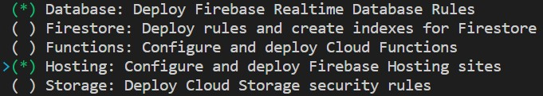

# Curso de Firebase para Web<!-- omit in toc -->

## Tabla de Contenido<!-- omit in toc -->
- [¿Qué es Firebase?](#qué-es-firebase)
- [Crear un Proyecto](#crear-un-proyecto)
- [Conexión del proyecto con Firebase](#conexión-del-proyecto-con-firebase)
  - [Consola de Firebase](#consola-de-firebase)
- [Terminal](#terminal)
- [Autenticación](#autenticación)
  - [Proveedores de autenticación](#proveedores-de-autenticación)
  - [Autenticación por Google](#autenticación-por-google)
  - [Autenticación por Facebook](#autenticación-por-facebook)
  - [Autenticación por Github](#autenticación-por-github)
  - [Cerrar Sesión](#cerrar-sesión)
  - [Verificar Cambios en la Sesión](#verificar-cambios-en-la-sesión)
  - [Obtener Usuario Actual](#obtener-usuario-actual)
- [Modelo de BD no relacional](#modelo-de-bd-no-relacional)
- [Base de Datos](#base-de-datos)
  - [Insertar Datos](#insertar-datos)
  - [Actualizar Datos](#actualizar-datos)
  - [Sobreescribir datos](#sobreescribir-datos)
  - [Eliminar un Registro](#eliminar-un-registro)
  - [Traer información una sola vez](#traer-información-una-sola-vez)
  - [Traer información y escuchar cambios](#traer-información-y-escuchar-cambios)
- [Permisos](#permisos)
  - [Totalmente pública](#totalmente-pública)
  - [Totalmente Privada](#totalmente-privada)
  - [Permisos para Usuarios Dueños del Nodo](#permisos-para-usuarios-dueños-del-nodo)
  - [Roles](#roles)
  - [Validar Campos](#validar-campos)
  - [Reglas a múltiples registros de un documento](#reglas-a-múltiples-registros-de-un-documento)
- [Storage](#storage)
- [Hosting](#hosting)
- [Firebase Functions](#firebase-functions)
- [Enlaces de Interés](#enlaces-de-interés)

## ¿Qué es Firebase?

Firebase es un servicio de Google que comenzó siendo una base de datos en tiempo real, pewro con el tiempo se han ido agregando nuevas características.

Firebase proporciona servicios que tradicionalmente se hacen desde el backend como la autenticación, la base de datos y el servicio de hosting.

Firebase se divide en 3 partes fundamentales:
* Develop
  * Realtime database
  * Authentication
  * Cloud Messaging
  * Storage
  * Hosting
  * Test Lab
  * Crash Reporting
* Grow
  * Notifications
  * Remote Config
  * App Indexing
  * Dynamic Links
  * Invites
  * AdWords
* Earn
  * AdMob

## Crear un Proyecto

Podemos crear un nuevo proyecto desde la (consola de Firebase)[https://console.firebase.google.com].

Debemos de tener presente que como máximo solo podemos tener 6 proyectos a la vez.

## Conexión del proyecto con Firebase

Hay dos maneras de hacer esta conexión:

* La Manera manual: a través de la Consola de Firebase.
* Utilizando las herramientas de Firebase: a través de la Terminal.

### Consola de Firebase

1. Entrar a la consola de Firebase.
2. Hacer clic Add an app to get started.
3. Se abrirá una ventana con un script.
4. Copiar el script y pegarlo en el index.html.
5. Ir a Authenticacion -> Sign-in method -> Authorized domains.
6. Agregar el dominio en donde estará desplegada la aplicación.

## Terminal

Esta es la manera más adecuada de hacer la conexión ya que provee herramientas extras como el deploy automático.

1. Copiar la librería de firebase en el proyecto.

2. Instalar firebase tools.

```bash
$ npm i -g firebase-tools
```

3. Loguearse a Firebase con la cuenta de Google

```bash
$ firebase login
```

4. Ir a la carpeta del proyecto desde consola
5. Iniciar el proyecto en Firebase.

```bash
$ firebase init
```

6. Se mostrarán las opciones de Firebase a usar. Escoger según necesidad.

<div align="center">
  
  <small><p>Opciones de Firebase</p></small>
</div>

7. Se pregutará qué proyecto se va asociar a la carpeta. Escoger le proyecto adecuado.

<div align="center">
  
  <small><p>Escoger Proyecto de Firebase</p></small>
</div>

8. Se preguntará el nombre del archivo de configuración para la base de datos. Escoger uno y continuar.
9. Se preguntará el nombre de la carpeta pública. Esta es la carpeta donde se encontrarán los archivos a desplegar.
10. Se preguntará si la aplicación es una SPA. Escoger según corresponda.

Se creará un archivo firebase.json en donde se almacenará las configuraciones:

```json
{
  "database": {
    "rules": "database.rules.json"
  },
  "hosting": {
    "public": "./",
    "ignore": [
      "firebase.json",
      "**/.*",
      "**/node_modules/**"
    ]
  }
}
```

11. Finalmente, para ver la página desde un servidor local, usar el comando `firebase serve`.

## Autenticación

### Proveedores de autenticación

Los proveedores de autenticación nos permite saber quién se conecta e indicar restricciones de inicio de sesión.

Los proveedores de autenticación disponibles en firebase son:

* Correo electrónico / contraseña
* Teléfono
* Google
* Play Juegos
* Facebook
* Twitter
* Github
* Anónimo

Para activar algún proveedor de autenticación, se debe de ir a la consola de Firebase -> Authentication -> Sign-in method.

### Autenticación por Google

```js
const googleLogin = async () => {
  const provider = new firebase.auth.GoogleAuthProvider()
  
  provider.addScope('https://www.googleapis.com/auth/contacts.readonly')
  
  try {
    const datosUsuario = await firebase.auth().signInWithPopup(provider)
    console.log(datosUsuario)
  }
  catch(err) {
    console.log(err)
  }
}
```

### Autenticación por Facebook

1. Lo primero que hay que hacer es registrar la app desde https://developers.facebook.com.
2. Habilitar Facebook Login.
3. Ir a Settings -> Basic.
4. Se mostrará el **App ID** y el **App Secret**.
5. Ir a la consola de Firebase.
6. Ir a Authentication -> Sign-in method.
7. Habilitar Facebook.
8. Se abrirá un popup donde se solicitará el **App ID** y el **App Secret**.
9. Poner los datos proporcionados en Facebook Developers.
10. Copiar el **OAuth redirect URI** que brinda Firebase.
11. Volver a Facebook Developers.
12. Ir a Facebook Login -> Settings.
13. Pegar el **OAuth redirect URI** brindado por Firebase en la sección **Valid OAuth Redirect URIs**.
14. Guardar los cambios.

```js
const facebookLogin = async () => {
  const provider = new firebase.auth.FacebookAuthProvider()
  provider.addScope('public_profile')
  
  try {
    const datosUsuario = await firebase.auth().signInWithPopup(provider)
    console.log(datosUsuario)
  }
  catch(err) {
    console.log(err)
  }
}
```

### Autenticación por Github

```js
const githubLogin = async () => {
  const provider = new firebase.auth.GithubAuthProvider()
  provider.addScope('scope')
  
  try {
    const datosUsuario = await firebase.auth().signInWithPopup(provider)
    console.log(datosUsuario)
  }
  catch(err) {
    console.log(err)
  }
}
```

### Cerrar Sesión

```js
const logout = () => {
  firebase.auth().signOut()
}
```

###  Verificar Cambios en la Sesión

```js
firebase.auth().onAuthStateChanged((user) => {
  console.log(user)
  if (user) {
    console.log("Usuario logueado")
  }
  else {
    console.log("No hay usuario logueado")
  }
})
```

### Obtener Usuario Actual

```js
firebase.auth().currentUser
```

## Modelo de BD no relacional

Podemos usar el modelo no relacional siempre que consideremos lo siguiente:

* La coherencia de los datos No es crítica (sólo en casos específicos lo es, la mayoría de veces no)
* No hay estándares sobre cómo estructurar la información en el modelo no relacional.
* Hacer Business Intelligence sobre el modelo no relacional es más complicado.
* Se requieren un conocimiento sólido en programación.
* Cada base de datos tiene sus peculiaridades y métodos (Firebase, Mongo, etc).

Recordemos que no existe una herramienta mágica o definitiva cuando se trata de tecnología. Ambos modelos tienen sus ventajas y desventajas. Lo mejor que podemos hacer es aprender a usar ambos para poder usar el adecuado cuando sea necesario.

## Base de Datos

La base de datos y la autenticación están separadas en Firebase. 

Para usar la base de datos de Firebase, escoger **Realtime Database**.

```js
{
  /* Visit https://firebase.google.com/docs/database/security to learn more about security rules. */
  "rules": {
    ".read": true,
    ".write": true
  }
}
```

### Insertar Datos

```js
//Referenciar la tabla a modificar
const ref = firebase.database().ref("usuario")

const usuario = {
  nombre: "Sergio",
  email: "sergio@hola.com",
  uid: 123456
}

ref.push(usuario)
```

### Actualizar Datos

El método `update` va a actualizar el dato de los campos que se han enviado. Si el objeto no existe, entonces lo inserta.

```js
//Referenciar la tabla a modificar
const ref = firebase.database().ref("usuario")

const usuario = {
  nombre: "Toshi",
  email: "toshi@hola.com",
  uid: 123456
}

ref.child("-LOzkKghfl72Skc-wlPW").update(obj)
```

### Sobreescribir datos

El método `set` borra todo el nodo y lo reemplaza con la información brindada. Si el objeto no existe, entonces lo inserta.

```js
//Referenciar la tabla a modificar
const ref = firebase.database().ref("usuario")

const usuario = {
  nombre: "Freddy",
  email: "freddy@hola.com",
  uid: 321654
}

ref.child("-LOzkKghfl72Skc-wlPW").set(obj)
```

### Eliminar un Registro

```js
//Referenciar la tabla a modificar
const ref = firebase.database().ref("usuario")

ref.child("-LOzkKghfl72Skc-wlPW").remove()
```

### Traer información una sola vez

```js
const ref = firebase.database().ref("usuario")

ref.child("glJBvRP9snPeQyTS9VOrrcVvCml1").once('value', (data) => {
  console.log(data.val())
})
```

### Traer información y escuchar cambios

```js
const ref = firebase.database().ref("usuario")

ref.child("glJBvRP9snPeQyTS9VOrrcVvCml1").on('value', (data) => {
  console.log(data.val())
})
```

## Permisos

Para actualizar los permisos de la base de datos, se hace desde Database -> Rules.

Nota: Las reglas de seguridad superiores cancelan las inferiores.

### Totalmente pública

```json
{
  "rules": {
    ".read": true,
    ".write": true
  }
}
```

### Totalmente Privada

```json
{
  "rules": {
    ".read": false,
    ".write": false
  }
}
```

### Permisos para Usuarios Dueños del Nodo

```json
{
  "rules": {
    "usuario": {
      "$uid": {
        ".read": "$uid == auth.uid",
        ".write": "$uid == auth.uid"
      }
    }
  }
}
```

### Roles

Se puede crear un documento en donde se almanecen los roles.

```json
{
  "rules": {
    "usuario": {
      "$uid": {
        ".read": true,
        ".write": "root.child('admin').hasChild(auth.uid)"
      }
    }
  }
}
```

### Validar Campos

```json
{
  "rules": {
    "records": {
      ".indexOn": "tiempo",
      ".validate": "newData.isString() && newData.val().contains('.')"
    }
  }
}
```

### Reglas a múltiples registros de un documento

En este caso, las reglas superiores sobreescriben a las inferiores.

```json
"guitarras": {
  ".write": "root.child('admin').hasChild(auth.uid)",
  ".read": "root.child('admin').hasChild(auth.uid)",
  "normal": {
    ".read": true
  },
  "vip": {
    ".read": "root.child('vip').hasChild(auth.uid)"
}
```

## Storage

Storage permite almacenar archivos como imágenes y videos.

```js
const refStorage = firebase.storage().ref()

refStorage.child("invie-classic.png").getDownloadURL().then((url) => {
  console.log(url)
})
```

## Hosting

Firebase solo permite la subida de archivos para el frontend.

1. Abrir la terminal en la carpeta donde está el proyecto.
2. `firebase deploy`

## Firebase Functions

Firebase Functions son código de Javascript que podemos ejecutar del lado del servidor de Firebase.

## Enlaces de Interés
* [Curso de Firebase para Web](https://platzi.com/clases/firebase-web/)
* [Documentación de Firebase](https://firebase.google.com/docs/)
* [Firebase Quickstart Guide](https://github.com/firebase/quickstart-js)
* [Consola de Firebase](https://console.firebase.google.com)

<div align="right">
  <small><a href="#tabla-de-contenido">🡡 volver al inicio</a></small>
</div>