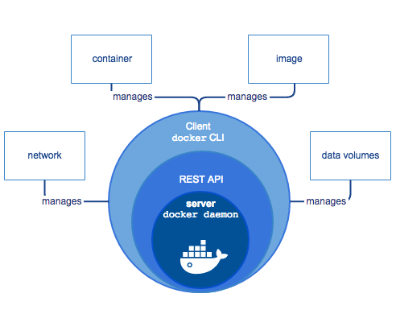
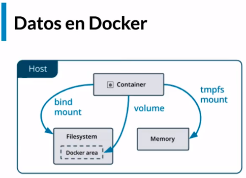

# Fundamentos de docker

## Tabla de Contenido
- [Introducción](#introducción)
	- [Las tres áreas en el desarrollo de software profesional](#las-tres-áreas-en-el-desarrollo-de-software-profesional)
  - [Virtualización](#virtualización)
  - [Preparando tu entorno de trabajo](#Preparando-tu-entorno-de-trabajo)
  - [Que es y como funciona Docker](#Que-es-y-como-funciona-Docker)
- [Contenedores](#contenedores)
  - [Primeros pasos: hola mundo](#Primeros-pasos-hola-mundo)
  - [Comprendiendo el estado de Docker](#Comprendiendo-el-estado-de-Docker)
  - [Ciclo de vida de un contenedor](#Ciclo-de-vida-de-un-contenedor)
  - [Exponiendo contenedores](#Exponiendo-contenedores)
- [Datos en docker](#datos-en-docker)
  - [Bind mounts](#bind-mounts)
  - [Volúmenes](#Volúmenes)
  - [Insertar y extraer archivos de un contenedor](#Insertar-y-extraer-archivos-de-un-contenedor)
- [Imágenes](#Imágenes)
  - [Conceptos fundamentales de Docker: imágenes](#Conceptos-fundamentales-de-Docker-imágenes)
  - [Construyendo una imagen propia](#Construyendo-una-imagen-propia)
  - [El sistema de capas](#El-sistema-de-capas)
- [Docker como herramienta de desarrollo](#Docker-como-herramienta-de-desarrollo)
  - [Usando docker para desarrollar aplicaciones](#Usando-docker-para-desarrollar-aplicaciones)
  - [Aprovechando el caché de capas para estructurar correctamente tus imágenes](#Aprovechando-el-caché-de-capas-para-estructurar-correctamente-tus-imágenes)
  - [Docker networking: colaboración entre contenedores](#Docker-networking-colaboración-entre-contenedores)
- [Docker Compose](#Docker-Compose)
  - [Docker Compose: la herramienta todo en uno](#Docker-Compose-la-herramienta-todo-en-uno)
  - [Subcomandos de Docker Compose](#Subcomandos-de-Docker-Compose)
  - [Docker Compose como herramienta de desarrollo](#Docker-Compose-como-herramienta-de-desarrollo)
  - [Compose en equipo: override](#Compose-en-equipo-override)
  - [Docker avanzado](#Docker-avanzado)
  - [Administrado tu ambiente de Docker](#Administrado-tu-ambiente-de-Docker)
  - [Deteniendo contenedores correctamente: SHELL vs. EXEC](#Deteniendo-contenedores-correctamente-SHELL-vs.-EXEC)
  - [Contenedores ejecutables: ENTRYPOINT vs CMD](#Contenedores-ejecutables-ENTRYPOINT-vs-CMD)
  - [Multi stage build](#Multi-stage-build)
  - [Docker in Docker](#Docker-in-Docker)

## Introducción

### Las tres áreas en el desarrollo de software profesional

**CONSTRUIR**

**Problemas al construir software**

- Entornos de desarrollo
- Dependencias
- Entorno de ejecución
- Equivalencia de entorno productivo
- Servicios externos

DISTRIBUIR

Tu código tiene que transformarse en un artefacto, o varios que puedan ser transportados a donde tengan que ser ejecutados.

- Divergencia de repositorios
- Divergencia de artefactos
- Versionado

EJECUTAR

La máquina donde se escribe el software siempre es distinta a la máquina donde se ejecuta de manera productiva.

- Compatibilidad con el entorno produtivo
- Dependencias
- Disponibilidad de servicios externos
- Recursos de hardware

### Virtualización

Problemas de las VMs

- Peso

    El orden de los GBs. Repiten archivos en común. Inicio lento.

- Costo de administración

    Necesita mantenimiento igual que cualquier otra computadora

- Múltiples formatos

    VDI, VMDK, VHD, raw, etc.

**Contenedores**

- Flexibles
- Livianos
- Portables
- Bajo acoplamiento
- Escalables
- Seguros

### Preparando tu entorno de trabajo

- `docker --version`→ Ver la version de docker instalado.

- `docker info`→ Ver detalles de la instalacion, contenedores corriendo, version de docker y otros datos.

### Que es y como funciona Docker

Docker te permite construir, distribuir y ejecutar aplicaciones mediantes contenedores.

<div align="center">
  
</div>

## Contenedores

### Primeros pasos hola mundo

`docker run hello-world` —> Correo un contenedor llamado "hello-world".

### Comprendiendo el estado de Docker

`docker ps`  →  Lista los contenedores en ejecución.

`docker ps -a`  →  Retorna todos los contenedores.

`docker inspect [container_ID]` o `docker inspect [name]` → Muestra el detalle completo de un contenedor.

`docker run --name [nombre] [nombre_imagen]` → Permite correr un contenedor, asignandole un nombre.

`docker rename [nombre_contenedor] [nuevo_nombre]` → Cambia el nombre del contenedor.

`docker rm [nombre_contenedor] o docker rm [id_contenedor]` →Borra un contenedor.

`docker container prune`→ Borra todos los contenedores inactivos.

`docker run -it ubuntu` → Correo un contenedor con ubuntu en modo interactivo y ejecuta la terminal. -i → modo interactivo -t → correo TTY (consola).

### Ciclo de vida de un contenedor

Cada vez que un contendor se ejecuta, en realidad lo que ejecuta es un proceso del sistema operativo. Este proceso se le conoce como **Main process**.

**Main process**

Determina la vida del contenedor, un contendor corre siempre y cuando su proceso principal este corriendo.

**Sub process**

n contenedor puede tener o lanzar procesos alternos al main process, si estos fallan el contenedor va a seguir encedido a menos que falle el main.

`docker run -name [nombre_container] -d ubuntu tail -f /dev/null` → Corre un contenedor con ubuntu y hace un override con el siguiente comando `tail -f /dev/null`

`docker exec -it [nombre_container] [comando]` → En un contenedor que ya existe y esta corriendo, ejecuta un comando o un proceso. Ejemplo: `docker exec -it alwaysup bash`

`docker inspect --format '{{.State.Pid}}' [nombre_container]`→ Filtra de Pid del contenedor.

`docker stop [nombre_container]` → Para la ejecución de un contenedor.

### Exponiendo contenedores

`docker run --name [nombre_container] -p [puerto_maquina_anfitriona]:[puerto_contenedor] imagen_contenedor]`      Permite Iniciar un contenedor exponiendo un puerto e vinculandolo con un puerto de la maquina anfitriona. Ejemeplo `docker run -name proxy -d -p 8080:80 nginex`

`docker logs [nombre-container]` Retorna los logs.

`docker logs -f [nombre_container]` Agregando la opcion -f de follow, permite seguir los los a medida que van cayendo.vs

Hay que tener en cuenta que cuando paramos el proceso con Control + C despues de ejecutar los logs, NO para el proceso principal del contenedor y sigue activo.

`docker logs --tail 10 -f [nombre_container]`  La opcion - - tail permite especificar la cantidad de lineas que se desea ver de los logs

## Datos en docker

### Bind mounts

`docker run -d --name [nombre_container] -v [path de mi maquina]:[path dentro del contenedor] [imagen]`   La opcion -v permite crea un bind mount entre un path de la maquina anfitriona y un path dentro del contenedor para permitirle guardar archivos en la maquina anfitriona.

### Volúmenes

Los volúmenes brindan mayor seguridad a las personas que ejecutar docker en entornos productivos.

Un volúmen es integramente manejado por docker y no tenemos acceso a ellos a menos que seamos usuarios privilegiados en el sistema. Es muy practico para disponer de un lugar para que docker almecene sus datos y nadia mas pueda tocarlo, excepto docker.

`docker volume ls` → Lista los volúmenes.

`docker volume create [nombre_volumen]` → Crea un volúmen.

`docker run -d --name [nombre_container] --mount src=[nombre_volumen],dst=[ruta_datos_container] [image_container]` →La opción `--mount` monta el volumen que es nombrado en el `src`, vinculta con la ruta especificada en `dst` para guarda lo que esta en la ruta en el volumen.

Ejemplo: `docker run -d --name db --mount src=dbdata,dst=/data/db mongo` 

Si el volumen ingresado ele parametro `src` no existe, entonces es creado.

### Insertar y extraer archivos de un contenedor

`docker cp [nombre_archivo] [nombre_container]:[ruta_deseada_en_container]` → Copia un archivo desde la maquina local o anfitrion al una ruta dentro del contenedor.

Ejemplo:  `docker cp prueba.txt containerx:/foldertest/prueba.txt`

`docker cp [nombre_container]:[ruta_deseada_en_container]  [nombre_archivo_carpeta]` → Copia un archivo o carpeta desde el contanedor a la maquina anfitriona.

Ejemplo: `docker cp copytest:/folder1 localfolder`

No es necesario que un contenedor este corriendo para compitar los archivos desde o al contedor

<div align="center">
  
</div>

**Host:**

Donde Docker esta instalado.

**Bind Mount:**

Guarda los archivos en la maquina local persistiendo y visualizando estos datos (No seguro).

**Volume:**

Guarda los archivos en el area de Docker donde Docker los administra (Seguro).

**TMPFS Mount:**

Guarda los archivos temporalmente y persiste los datos en la memoria del contenedor, cuando muera sus datos mueren con el contenedor.

## Imágenes

### Conceptos fundamentales de Docker imágenes

Las imágenes son plantillas o moldes a partir de las cuales docker crea contenedores, una imagen es una pieza de software empaquedata, liviana que contiene todo lo necesario para que un contenedor puede ejecutarse exitosamente.

Una imágen contiene distintas capas de datos (distribución, diferente software, librerías y personalización).

Podemos llegar a la conslusión, que una imágen se conforma de distintas capas de personalización, en base a una capa inicial (base image), la dicha capa, es el más puro estado del SO.

`docker image ls` → Lista las imagenes que hay en el entorno local

`docker pull [nombre_imagen]` → Trae una imagen desde un repositorio externo a mi máquina

### Construyendo una imagen propia

La creación de una imagen siempre esa basado en un archivo llamado Dockerfile

```docker
FROM ubuntu:latest

RUN touch /usr/src/hola-test.txt
```

`docker build -t [imagen]:[version] [contexto]` → Construye una imagen.

Ejemplo: `docker build -t ubuntu:platzi .`

`docker login -u [user_name] -p [password]` → Para autenticación con las credeciales en [docker hub](https://hub.docker.com/)

`docker tag [imagen]:[tag] [user_name]/[imagen]:[tag]`→ Retaguea el nombre la imagen`.`

Ejemplo: `docker tag ubuntu:platzi arielayala/ubuntu:platzi` 

`docker push [user_name]/[imagen]:[tag]`  → Sube una imagen al repositorio remoto.

Ejemplo: `docker push arielayala/ubuntu:platzi`

### El sistema de capas

`docker history [imagen]:[tag]` →Muestra el historial de capas puestas en una imagen.

Existe una herramienta llamada dive que permite ver de forma mas descriptiva el historial de una imagen

Dive [github](https://github.com/wagoodman/dive) 

Una vez instalado Dive, ejecutar el siguiente comando

`dive [imagen]:[tag]`

## Docker como herramienta de desarrollo

### Usando docker para desarrollar aplicaciones

```docker
FROM node:12

COPY [".", "/usr/src/"]

WORKDIR /usr/src

RUN npm install

EXPOSE 3000

CMD ["node", "index.js"]
```

Ejecución de un contenedor a partir de la imagen creada

`docker run --rm -p 3000:3000 platziapp`

### Aprovechando el caché de capas para estructurar correctamente tus imágenes

```docker
FROM node:14

COPY ["package.json","package-lock.json", "/usr/src/"]

WORKDIR /usr/src

RUN npm install

COPY [".", "/usr/src/"]

EXPOSE 3000

CMD ["npx", "nodemon", "index.js"]
```

### Docker networking colaboración entre contenedores

`docker network ls` → Listas las redes.

`docker network create --attachable [nombre_red]` Crear una red. El flag `--attachable` permite que esta red se conecte con otros contenedores.

`docker network inspect [nombre_red]` Permite ver los detalles o caracteristicas de la red.

`docker network connect [red] [container]` Conecta un contenedor a una red.

Ejemplo: `docker run -d --name app -p 3000:3000 --env MONGO_URL=mongodb://27017/test platziapp` → En este ejemplo se corre un contenedor llamado *app* a partir de una imagen llamada *platziapp*, exponiendo su puerto 3000 al puerto 3000  del contenedor. Además se le envia el valor 

## Docker Compose

### Docker Compose la herramienta todo en uno

Docker compose es una herramienta que permite escribir de forma declarativa la arquitectura de servicios que nuestra aplicación necesita, a través de un archivo llamado ***docker-compose.yml***

```yaml
version: "3.8" # Verion de docker-compose

services:
  app: #Contenedor app
    image: platziapp
    environment:
      MONGO_URL: "mongodb://db:27017/test"
    depends_on: # Que depende del contenedor db
      - db
    ports:
      - "3000:3000"

  db: # Contenedor db
    image: mongo
```

`docker-compose up` → Ejecuta los parametros establecidos en el docker-compose.yml.

### Subcomandos de Docker Compose

`docker-compose logs` → Permite ver los logs de los servicios.

`docker-compose logs [nombre_servvicio]` → Permite ver los logs de un contenedor.

`docker-compose logs -f [nombre_servvicio]` → Permite mostrar los logs a medida que se vayan generando.

`docker-compose exec [nombre_servicio] [comando]` → Corre un comando de forma interactia en un contenedor.

`docker-compose ps` → Ver los servicios que estan corriendo.

`docker-compose down` → Destruye contedores, redes, etc que estan en los servicios. (Todo lo generado por docker-compose).

### Docker Compose como herramienta de desarrollo

```yaml
version: "3.8" # Version de docker-compose

services:
  app: #Contenedor app
    build: . # Construye una imagen a partir del docker file en el contexto .
    environment:
      MONGO_URL: "mongodb://db:27017/test"
    depends_on: # Que depende del contenedor db
      - db
    ports:
      - "3000:3000"
		volumes: # Crea un volumen
      - .:/usr/src # Todo los archivos en el contexto actual, ser vinculan a usr/src del contenedor app
      - /usr/src/node_modules
    command: npm start # Inical el script start del package.json para escuchar cambios

  db: # Contenedor db
    image: mongo
```

`docker-compose build` → Construye una imagen utilizando el dockerfile que se encuentra en el contexto de build. Luego ya puede ser usada para iniciar los servicios con `docker-compose up`.

### Compose en equipo override

**docker-compose.override.yml** es un archivo que se encarga de sobreescribir tu configuración de **docker-compose.yml** , se puede usar para tener segura tu configuración y para no guardar los cambios en el repositorio de git.

```yaml
version: "3.8"
services:
  app:
    build: . # Si el archivo docker-compose.yml tiene una imagen, esta imagen creada tomara ese nombre
    environment:
      UNA_VARIABLE: "Hola platzi" # No sobreescribe al valor base, agrega ambas variables de entorno
```

`docker-compose up -d` → Crea los servicios/contenedores.

`docker-compose exec app bash` → Entra al bash del contenedor app.

```yaml
version: "3.8" 

services:
  app: 
    build: . 
    environment:
      MONGO_URL: "mongodb://db:27017/test"
    depends_on: 
      - db
    ports:
      - "3000-3001:3000" # Se especifica el rango de 3000 a 3001 que estaran 
													#	disponibles para escalar dos contenedores para 
													# ambos puertos de la maquina anfitrion
		volumes: 
      - .:/usr/src 
      - /usr/src/node_modules
    command: npm start 

  db: # Contenedor db
    image: mongo
```

`docker-compose up -d --scale app=2` → Escala dos instancias de del servicio **app**, previamente tengo que definir un rango de puertos en el archivo *docker-compose.yml*.

### Docker avanzado

### Administrado tu ambiente de Docker

`docker ps -aq` → La q se le agrega para indicarde que solo muestr los ID de los contededores. Es muy util para obtener los ID y usarlos en el siguiente borrado:

`docker rm -f $(docker ps -aq)` → Se agrega un filtro para borrar todos los contenedores, incluyendo los ejecutados.

`docker network prune` → Eliminar las redes que no estamos usando.

`docker volume prune` → Eliminar tolas los volumenes que no estamos usando.

`docker system prune` → Eliminar todos los contenedores, imagenes, redes y cache.

Practica de borrado de imagenes.

`docker image rm -f $(docker image ls -q)`

`docker run -d --name [name_container] --memory 1g [imagen]` → El flag `--memory` limita la cantidad de memoria que deseemos para el contenedor.

`docker stats` → Permite ver un cuadro de estadisticas de uso memoria de los contenedores.

### Deteniendo contenedores correctamente SHELL vs. EXEC

Docker para indicarle a un proceso que tiene que terminar, le envia una señal, inicialmente le envia  SIGTERM, y si eso no responde en cierto tiempo, envia una señal de SIGKILL.

`docker stop [container]` → Le envía la señal SIGTERM al contenedor.

Siempre que tengamos un codigo de salida mayor a 128 es el resultado de una salid o  una excepcion no manejada correctamente.

`docker kill [container]` → Le envía la señal SIGKILL al contenedor.

[Comandos RUN, CMD y ENTRYPOINT en el Dockerfile](https://dockertips.com/comandos-run-cmd-y-entrypoint-en-el-dockerfile)

**Shell**: Ejecuta el proceso como hijo del shell

```docker
FROM ubuntu:trusty
COPY ["loop.sh", "/"]
CMD /loop.sh
```

**Exec**: Ejecuta el comando como principal

```docker
FROM ubuntu:trusty
COPY ["loop.sh", "/"]
CMD ["/loop.sh"]
```

### Contenedores ejecutables ENTRYPOINT vs CMD

En el Dockerfile el `ENTRYPOINT` permite establecer el comando base a ejecutarse en el contenedor. Si utilizamos este, se puede enviar como parametro valores a ejecutarse, que se concateran con lo existente en el `ENTRYPOINT`, reescribiendo lo que se encuentra en el `CMD`

Si no se envia el parametro, se ejecutara lo que se encuentra en el `CMD`.

```docker
FROM ubuntu:trusty
ENTRYPOINT [ "/bin/ping", "-c", "3"]
CMD ["localhost"]
```

### Multi stage build

```docker
# Define una "stage" o fase llamada builder accesible para la siguiente fase
FROM node:12 as builder
# copiamos solo los archivos necesarios
COPY ["package.json", "package-lock.json", "/usr/src/"]

WORKDIR /usr/src
# Instalamos solo las dependencias para Pro definidas en package.json
RUN npm install --only=production

COPY [".", "/usr/src/"]
# instalamos dependencias de desarrollo
RUN npm install --only=development

# Pasamos los tests
RUN npm run test
## Esta imagen esta creada solo para pasar los tests.

# Productive image
FROM node:12

COPY ["package.json", "package-lock.json", "/usr/src/"]

WORKDIR /usr/src
# instar las dependencias de PRO
RUN npm install --only=production

# Copiar  el fichero de la imagen anterior.
# De cada stage se reutilizan las capas que son iguales.
COPY --from=builder ["/usr/src/index.js", "/usr/src/"]
# Pone accesible el puerto
EXPOSE 3000

CMD ["node", "index.js"]
### En tiempo de build en caso de que algún paso falle, el build se detendrá por completo.
```

### Docker in Docker

Si queremos tener docker dentro de un contenedor, mas llamado docker-in-docker. Compartiendo el socket de nuestro local a nuestro contenedor que tendra docker

```bash
docker run -it --rm -v /var/run/docker.sock:/var/run/docker.sock docker:19.03.12 
# docker ps
# docker run -d --name app prodapp
```
