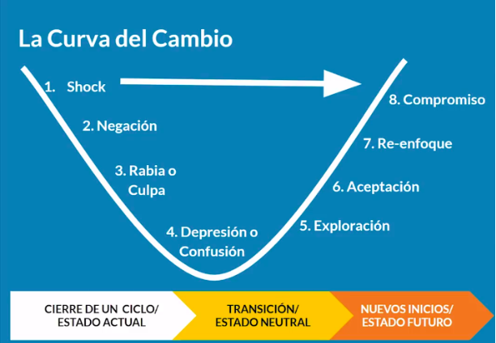
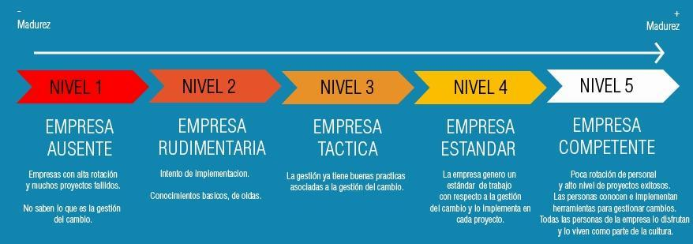

# CURSO DE GESTIÓN DE CAMBIO

## Tabla de contenido
- [CURSO DE GESTIÓN DE CAMBIO](#curso-de-gestión-de-cambio)
  - [Tabla de contenido](#tabla-de-contenido)
  - [¿Qué es Gestionar el Cambio?](#qué-es-gestionar-el-cambio)
    - [Tipos De Cambios](#tipos-de-cambios)
  - [5 tipos de Niveles de madurez](#5-tipos-de-niveles-de-madurez)
    - [La curva del cambio](#la-curva-del-cambio)
    - [Niveles de aceptación al cambio](#niveles-de-aceptación-al-cambio)
  - [Modelo ADKAR](#modelo-adkar)
  - [Los 8 pasos de Kotter para liderar iniciativas de Cambio](#los-8-pasos-de-kotter-para-liderar-iniciativas-de-cambio)
    - [Fase 1 : Crear al clima del cambio](#fase-1--crear-al-clima-del-cambio)
    - [Fase 2 : Comprometer y facilitar](#fase-2--comprometer-y-facilitar)
    - [Fase 3: Implementar y sostener](#fase-3-implementar-y-sostener)
  - [Modelo Kotter vs ADKAR](#modelo-kotter-vs-adkar)
  - [Agentes de Cambio y otros roles claves](#agentes-de-cambio-y-otros-roles-claves)
    - [Tipos de gerencias](#tipos-de-gerencias)
  - [Gestionar el cambio](#gestionar-el-cambio)
    - [Acción 1: Crear el caso de negocio](#acción-1-crear-el-caso-de-negocio)
      - [Crear el caso del negocio](#crear-el-caso-del-negocio)
      - [Construir la visión](#construir-la-visión)
    - [Acción 2: Listar los hitos claves](#acción-2-listar-los-hitos-claves)
      - [Hitos del proyecto](#hitos-del-proyecto)
      - [Hitos del cambio](#hitos-del-cambio)
      - [Consideraciones importares](#consideraciones-importares)
    - [Acción 3: Mapear grupos de interés](#acción-3-mapear-grupos-de-interés)
      - [Mapeo de grupos de interés](#mapeo-de-grupos-de-interés)
      - [Consideraciones importares](#consideraciones-importares-1)
    - [Acción 4: Medición del impacto](#acción-4-medición-del-impacto)
    - [Acción 5: Medición de reacciones](#acción-5-medición-de-reacciones)
    - [Acción 6: Plan de adopción](#acción-6-plan-de-adopción)
    - [Acción 7: Hacer sostenible el cambio](#acción-7-hacer-sostenible-el-cambio)
      - [¿Como formamos Cultura?](#como-formamos-cultura)

## ¿Qué es Gestionar el Cambio?
Es crear de modelos que permiten una adopción más rápida y más veloz de todas estas transformaciones y proyectos que tenemos como empresa o personas.

### Tipos De Cambios
- **Incremental**: (Proyectos) Tener un proceso y mejorarlo, sean en calidad o velocidad. Ejemplo: Una empresa de pizzas que de 4 horas quiere bajar sus tiempos a 2 horas.
- **Transicional**: (Programas) Tienen diseño de proceso, son menos contantes.
- **Transformacional**: (Proyectos y programas) Aquí no se hace un cambio dentro del sistema sino se cambia el sistema. Ejemplo: La transformación digital.

*70 % de programas de transformación fallan en alcanzar sus objetivos por la resistencia al cambio.*

Las organizaciones tienden a hacer cambios incrementales, transicionales o transformacionales enfocados principalmente en una meta numérica (productividad, generación de capacidad para incrementar ingresos, ahorros de tiempo y/o dinero, simplificación de tareas, modernización, velocidad o incremento de la calidad), y no es regla cuidar de identificar los diferentes grupos de interés que pudieran verse afectados, generando un plan de capacitaciones, incentivos y soporte para cada uno.

## 5 tipos de Niveles de madurez

### La curva del cambio
La curva del cambio se puede ver resumida en la siguiente imagen:

Esto es lo que experimentan los individuos cuando se les presentan los cambios.

### Niveles de aceptación al cambio
- **Nivel 1 (Empresa Ausente)**. Empresas con alta rotación y muchos proyectos fallidos. No saben lo que es la gestión del cambio.
- **Nivel 2 (Empresa Rudimentaria)**. Empresas que intentan algo pero conocen muy poco de gestión de cambio, te indican que lo escucharon por ahí.
- **Nivel 3 (Empresa Táctica)**. Empresa que ya tiene buenas prácticas asociadas a la gestión del cambio.
- **Nivel 4 (Empresa Estándar)**. Cuando la empresa ya generó un estándar de trabajo con respecto a la gestión del cambio y lo utiliza en cada proyecto.
- **Nivel 5 (Empresa Competente)**. Son empresas con poca rotación de personal y alto nivel de proyectos exitosos. Las personas conocen e implementan herramientas para gestionar cambios. Todas las personas de la empresa lo disfrutan y lo viven como parte de la cultura.

## Modelo ADKAR
> *"Las habilidades para ejecutar un proceso son diferentes a las habilidades para cambiar una organizaión."* - David Shore.

1. **Awareness (Conciencia)**: Comunicar la razón del cambio. ¿Qué tan bien estamos comunicando el cambio y su porqué?
2. **Desire (Deseo)**: Empoderar y comprometer individuos. ¿Los individuos estén conectados con el cambio?
3. **Knowledge (Conocimiento)**: Capacitarse y compartir con el resto. ¿Estamos capacitados para enfrentar el cambio?
4. **Ability (Habilidad)**: Identificar las barreras y administrarlas con agilidad.
5. **Reinforcement (Reforzamiento)**: Mantener la aleta. Seguir generado el sentido de urgencia al cambio.

Sea cual sea tu iniciativa de cambio:

1. Hagas que las personas sepan el por qué del cambio.
2. Incentives el deseo del cambio.
3. Capacites a las personas de cómo y todo los componentes del cambio.
4. Tengan la habilidad para enfrentar algún desafío del cambio.
5. No dormir en los laureles. Reforzar el cambio.

## Los 8 pasos de Kotter para liderar iniciativas de Cambio

### Fase 1 : Crear al clima del cambio
1. **Incrementar el sentido de Urgencia**: Utilizar muchos datos.
2. **Crear el equipo del cambio**: Los involucrados en la difusión.
3. **Diseñar la visión correcta**: Que puedas explicarle a las personas cómo luce el futuro con este cambio.

### Fase 2 : Comprometer y facilitar
4. **Facilitar la acción**: Símbolos, comunicaciones.
5. **Comunicar para vender**: Qué se comunica, cómo lo hace, con qué frecuencia.
6. **Celebrar las ganancias de corto plazo**: Resaltar la pequeñas victorias.

### Fase 3: Implementar y sostener
7. **No rendirse**: Mantener el paso pese a los desafíos.
8. **Instaurar el cambio en la cultura**: Hacer el cambio de los hábitos y del día a día.

## Modelo Kotter vs ADKAR
> *"Las 7 palabras más caras en el mundo de los negocios: Nosotros siempre lo hicimos de esta manera."* - Travis Bradberry.

1. Diseñar estrategia
- Crear sentido de urgencia
- Beneficios potenciales
- Labor de venta (visión del cambio, *pitch*, etc.)
- Datos duros
- Generar equipo que proporcione *feedback*
2. Motivar
- Cultivar al usuario
- Capacitaciones frecuentes
- Buscar manera de uso fácil
3. Entrenar
- Diseñar espacio de *feedback*
- Empoderar al usuario
4. Reconocer y reforzar
- Diseñar ganancias a corto plazo (generar sistemas de puntos o capacitaciones frecuentes)
- Sostener el cambio
- No dormir en los laureles

## Agentes de Cambio y otros roles claves

### Tipos de gerencias

- Gerencia de proyectos
    - Gerente de proyectos
    - Función principal: planificar, controlar y entregar.
    - Asegurarse de que se cumplan los requerimiento (alcance, tareas y presupuesto).
    - Metodologías usadas: PMI-PMBOK o SCRUM.
    - Foco:
        - Cumplimento de tareas.
        - Cumplimiento del alcance, presupuesto y calidad.
        - Manejo de riesgos.
    - Indicadores:
      - I1: Entrega en tiempo y presupuesto.
      - I2: Técnica y aceptado
- Gerencia Cambio
    - Gerente de cambios.
    - Se encarga de profundizar en los sentimiento potenciales de los diferentes grupos de interés para lograr que finalmente tenga éxito el proyecto o iniciativa.
    - Buscar la adopción Óptima de las prácticas.
    - Metodologías usadas: KOTTER, CM-BOK.
    - Foco: 
      - Se enfoca en los grupos de interés como en lo empleados, clientes.
      - También se enfoca en el contexto
      - Comunicacion, compromiso y adopción, todo esto tiene que ver con crear habilidad que va muy ligado a crear conocimiento
    - Indicadores:
      - I1: Adopción de nuevas prácticas.
      - I2: Realización de beneficios.

## Gestionar el cambio

### Acción 1: Crear el caso de negocio
> ¿Por qué es importante el cambio.

Se trata de crear la visión del cambio, identificando qué se puede cambiar.

#### Crear el caso del negocio
Para tener los caso de negocios definidos hay 4 pasos:
- Problemas actuales
    - Identificar la causa del porque no se están cumpliendo con los procesos ya sean por temas de presupuestos, conocimiento.
- Porqué importa el negocio
    - Aquí pensamos en el retorno de inversión y como afecta a las ventas el proceso que estamos analizando.
- Porqué importa el cliente
    - Aquí medimos la velocidad y la calidad respecto al servicio dado a los clientes, esto mejora la percepción de nuestra imagen hacia nuestros clientes.
- Porqué importa a empleados
    - Se debe de identificar en que los afecta a los empleado y que pasos dentro de su proceso se deben identificar.

#### Construir la visión

- Alinear la visión con las metas estratégicas de la organización.
- Conectar con las necesidades y frustraciones de tu equipo.
- Sé claro con los beneficios para cada grupo de interés.

### Acción 2: Listar los hitos claves
> ¿Cuándo sucederán los cambios importantes? 

Tenemos 2 factores, los hitos de proyecto y los de la gestión del cambios:

#### Hitos del proyecto
Son puntos importantes o de inflexión en la implementación del proyecto como:

- Diseño del proceso
- Diseño de plataforma
- Desarrollo del proyectos

#### Hitos del cambio
Son puntos importantes o de inflexión del proyecto centrados en la gestión del cambio como:

- Anuncio de los beneficios del cambios
- Proponer FAQS
- Diseño de visión del cambios
- Taller con empleados
- Material de capacitación
- Cuenta regresiva (genera expectativa)

#### Consideraciones importares
- Las Fechas Claves del proyecto deben ser la columna vertebral del Plan
- Cuidado con los proyectos sandia: Estos son proyectos con múltiples complejidades por lo que es mejor tener un indicador de cuando entrar en producción
- Ten claro que significa para tus jefes y toda la empresa tener el proyecto en producción.

### Acción 3: Mapear grupos de interés
> ¿Quienes se verían afectados por el cambio? 

#### Mapeo de grupos de interés
| Grupos de interés |	Descripción	| No. personas	| Nivel de conocimiento del cambio	| Nivel de Resistencia anticipado |	Nivel de impacto | 	Sentimientos potenciales |
| :---: | :---: | :---: | :---: | :---: | :---: | :---: | --- |
| Gerencia, Usuarios, Otros	| Personas Importantes |	x |	Como se comunica, Qué tanto le interesa |Promotores, Detractores, Neutrales | Directo, Indirecto | Frustraciones, Miedos, Beneficios |

#### Consideraciones importares
- Mapea tanto a los directamente, como a los indirectamente impactados y todas las locaciones de la empresa.
- Una persona no involucrada, mal informada o no informada puede generar mucho ruido negativo.
- De los detractores es de quienes más aprendemos para hacerlo mejor ¡Escúchelos!

### Acción 4: Medición del impacto

> ¿Cómo se verán impactados cada grupo de interés?

1. Mapear las diferentes Etapas del proceso
2. De cada etapa mapear las personas y grupos involucrados
3. De cada etapa describir: ¿Cómo se hace hoy?, ¿Cómo se va a hacer mañana’? y ¿Cómo será el proceso después del cambio? ¿Cómo se va a sostener el cambio?
4. De cada etapa describir: ¿Qué actividades se van a dejar de hacer o eliminar?, ¿Qué actividades van a continuar y se van a seguir haciendo?, Qué actividades se nuevas van a aparecer y cómo se van a capacitar?

Es importante considerar TODOS los aspectos y personas que se van a cambiar. Se recomienda hacer la medición por cada proceso impactado.

Ser lo más detallado posible y estar alineado a la **visión de cambio** establecida desde el inicio del proyecto.

> *Para motivar a los individuos a salir de la zona de confort tienes que ayudarles a sentirse seguros.*

### Acción 5: Medición de reacciones
> ¿Cómo podrá reaccionar cada grupo de interés?

Para identificar las reacciones necesitamos abrir nuestros sentidos: escuchar, observar, sentir, percibir, deducir; no sólo lo obvio sino más allá de lo que se comunica con nuestras palabras.

1. Mapear los grupos de interés.
2. Identificar las reacciones de resistencia:
    - Identificar si la reacción está basada o no en hechos.
    - Identificar reacciones negativas y positivas.
    - Identificar cómo y qué estrategias implementar.

Necesitamos ser **empáticos** y ponernos en los zapatos del otro, dándonos la oportunidad de vivir lo que el otro está sintiendo. Ser capaz de vincularnos a las necesidades y sentimientos del otro.

Evitar ser reactivos y asumir con humildad el *feedback* que nos brindan, preguntar, hacer encuestas, dialogar con amigos y enemigos, revisar indicadores.

### Acción 6: Plan de adopción

1. **Entrenamiento y Soporte**. Todo basado en EDUCACIÓN (Conocimiento y Habilidad).
   - Material de capacitación
   - lista de preguntas frecuentes
   - gamificación (juego como componente)
   - webinars, 
   - el nuevo proceso en una pared (VISUAL, medición de impacto)
   - toolkit para usuarios
   - foro de invitados de externos (ejemplos)
   - manuales
   - sesiones de trabajo (Que sea el personal parte del cambio)
  
2. **Comunicaciones**. Qué, el porqué, fechas programables. Todos en el mismo entendimiento.
    - Google sites
    - newletters
    - reuniones uno a uno o en equipo (agentes de cambio)
    - videos sobre el cambio
    - redes sociales internas y externas
    - email de apoyo
    - memo de gerencia general (que se note el apoyo)
    - logo de la iniciativa
    - reporte público de avances

3. **Incentivos**. Premios, actividades de reconocimiento, celebración de ganancias de corto plazo y compartir buenas prácticas.
   - Reconocimiento público.
   - Concursos con sistema de premios
   - Días libres
   - Cuenta regresiva
   - Premiar al que más aprenda
   - Juegos
   - Celebraciones, cenas, asados, fiestas, viajes
   - Placas (Con el logotipo mencionado)

4. **Consecuencias**. Acciones que deben tomarse cuando no se sigue el nuevo proceso.
   - Llamada de atención.
   - Reglas compartidas
   - Requisitos para ascender.

### Acción 7: Hacer sostenible el cambio
> Creando organizaciones competentes

1. Iniciando el cambio
  - La gente siente que no tiene tiempo.
  - La gente siente que no le dan suficiente información y/o soporte.
  - A la gente le cuesta ver la importancia del cambio.
  - Los líderes no dan el ejemplo, ni hacen lo que prometen.

2. Sosteniendo el cambio
  - Ansiedad sobre la seguridad laboral, aprendizaje, confianza en otros con el nuevo proceso o por pensar que perderán el control.
  - Tensión sobre la forma como se mide el éxito del cambio.
  - Cuando el "Cambio cultural" se hace en grupos pilotos pero no como un "nuevo culto".

3. Rediseñando el cambio
  - Governance: La forma como se maneja la organización. Los sistemas/procesos en su lugar para lograrlo.
  - Compartir nuevas prácticas efectivamente.
  - Darle sentido a la estrategia y la visión.

#### ¿Como formamos Cultura?
| Comportamientos	| Símbolos | Sistemas | 
| :---: | :---: | :---: |
| Liderazgo con el ejemplo | Patrones, Rituales e Historia	| Cómo se planea, Controla, Mide y Reconoce |
