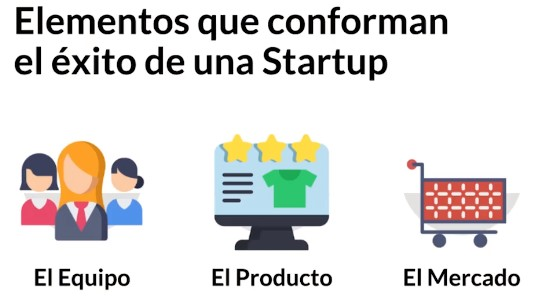
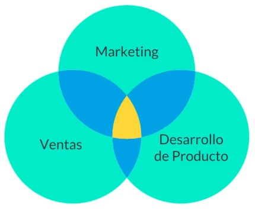

# Curso de Growth Marketing<!-- omit in toc -->

## Tabla de Contenido<!-- omit in toc -->
- [Introducción](#introducción)
- [Orígenes del Growth Hacking](#orígenes-del-growth-hacking)
- [Desmitificando al Growth Marketing](#desmitificando-al-growth-marketing)
- [Habilidades de un Growth Marketer](#habilidades-de-un-growth-marketer)
- [Product-Market Fit](#product-market-fit)
- [Product Marketing](#product-marketing)
- [Canales de distribución](#canales-de-distribución)
- [El Embudo de Growth Hacking](#el-embudo-de-growth-hacking)
  - [¿Cómo funciona el embudo de Growth Hacking?**](#cómo-funciona-el-embudo-de-growth-hacking)
    - [Adquisición](#adquisición)
    - [Activación](#activación)
    - [Retención](#retención)
    - [Referencia](#referencia)
    - [Ganancia o Revenue](#ganancia-o-revenue)
- [Customer Journey](#customer-journey)
- [Recursos Complementarios](#recursos-complementarios)
- [Enlaces de Interés](#enlaces-de-interés)

## Introducción

El Growth Marketing no es usado únicamente por startups. Al tener una metodología flexible y adaptable a cualquier tipo de negocio, incluidos perfiles personales.

El **Growth Marketing** es un enfoque que combina una mentalidad de crecimiento con herramientas de marketing tradicional.

El **Growth Hacking** es un concepto parecido pero con grandes diferencias porque aunque ambos buscan crecimiento, el Growth Hacking es más adaptable a empresas de tecnología. El Growth Marketing es un poco más profesional porque puede ser implementado a todo tipo de empresas.

**¿Qué hace distinto al Growth Marketing?**
* Tiene un enfoque más allá de ventas y awareness, busca transformar al producto en un motor de adquisición de usuarios.
* Usa técnicas no convencionales y de medición casi obsesiva de resultados en cada paso.

## Orígenes del Growth Hacking

En 2010 se acuñó el término por primera vez por Sean Ellis y desde ahí cada vez fue adquiriendo mayor popularidad hasta alcanzar su pico en 2014. Él fue el genio detrás de Dropbox y otras.

Una startup necesita un Growth Hacker ya que necesita es crecer rápido. El Growth Hacker tiene habilidades en mercadotecnia combinadas con otras habilidades suaves, como la creatividad, entendimiento del consumidor y del mercado.

## Desmitificando al Growth Marketing

La popularidad del Growth Marketing hizo que surgieran varios mitos. El resultado es que al buscar acerca del tema en internet haya confusión. Estos son los mitos más comunes:

* **Los Growth Marketers son Ingenieros o Programadores**: Esto no es cierto ya que el Growth Marketing se realiza en un equipo que se complementa y cada individuo tiene diferentes habilidades. Es bueno tener conocimientos técnicos pero no es indispensable.
* **El Growth Marketing es una Estrategia de Marketing**: No es exactamente cierto ya que el Growth Marketing es una manera de hacer las cosas, un enfoque.
* **El Growth Marketing es sumamente caro**: No es cierto ya que se usan técnicas no convencionales para hacer crecer un negocio. No se basa únicamente en invertir dinero ya que importa más la intuición y los datos.
* **Una sola persona logrará hacer crecer a la empresa**: En una empresa se trabaja en equipo (programación, diseño, Analytics…) y al requerir tanto trabajo, el crecimiento de la empresa no depende de una única persona. Lo cierto es que una persona puede tener en mente la estrategia y liderar pero los resultados se darán en equipo.
* **El Growth Marketing es un conjunto de secretos**: Cada producto es diferente y por ello la misma estrategia puede no funcionar en casos distintos.
* **El crecimiento no depende de un buen producto**: Todo buen crecimiento debe empezar con un buen producto.
* **El Growth Marketing es una solución rápida**: No es tan rápido como la gente se imagina y su ejecución y resultados pueden tardar varios meses.

## Habilidades de un Growth Marketer

**Data Analytics**: Debes tener un conocimiento básico de algunas herramientas que se usan para hacer Analytics como Google Analytics, saber cómo utilizar un dashboard, y también poder observar tendencias y cambios en los usuarios.

**Programación Básica**: No debes saber programar a profundidad pero sí tener una idea de lo que se puede hacer con código.

**Copywriting**: Es importante porque necesitarás probar diferentes headlines y subject lines para saber qué es lo que más funciona con los consumidores. Identifica, investiga y analiza cuáles palabras funcionan mejor con tu público objetivo.

**Diseño**: No debes ser excelente en esto pero sí debe existir una noción para decirle al diseñador exactamente lo que necesitas.

**Marketing**: Necesitarás hacer redes sociales, mandar correos, relaciones públicas, etc.

**SEO**: El SEO implicará partes técnicas de modificación de sitios web y también optimización de contenido.

## Product-Market Fit

  
  <small>
Elementos del éxito de una startup
</small>

**El mercado es el más crucial** ya que si no se tiene una idea de mercado, por mucho que se implementen estrategias, no va a crecer.

"Product-Market Fit es estar en un buen mercado con un producto que pueda satisfacerlo." - Mark Andreesen

**¿Cómo nos aseguramos de lograr el Product-Market Fit?**
* Define el mercado meta: Estudia el mercado.
* Investiga dicho mercado meta: Usa las técnicas tradicionales como encuestas, entrevistas, etc.
* Desarrolla y prueba tu prototipo: Es importante para asegurarse de que el producto no va a fallar.

**Algunas maneras de medir el Product-Market Fit:**
* Si al lanzar la idea la ponemos en Kickstarter y tiene mucho éxito y hay hype, se sabe que se está cerca de tener un buen producto. Si se vende, seguro hay market fit.
* Si ya se tiene el producto se debe poner mucho cuidado al feedback de los consumidores. Es necesario escucharlos y ver si referirían a tu producto.

## Product Marketing

  
  <small>
Dimensiones del product marketing
</small>

El product marketing está ubicado en 3 dimensiones:

* Marketing: Se debe saber qué es lo que se hará desde la óptica de marketing.
* Ventas: Cómo el vendedor va a ofrecer el producto.
* Desarrollo de Producto: De qué manera se va a desarrollar o modificar el producto con base al feedback de las demás áreas.

Se debe tener un product manager que ayudará a conectar todas las áreas.

El Product Marketing busca llevar exitosamente un producto al mercado asegurándose de comprender a los clientes y de capacitar a los equipos internos.

**¿De qué se encarga el Product Marketing?**

* Posicionar el Producto con el Mercado Meta.
* Manejar la comunicación sobre el producto.
* Capacitar al Equipo de Ventas para vender el producto adecuadamente.
* Entender las necesidades del consumidor.
* Involucrarse en el desarrollo mismo del producto para asegurar Product-Market Fit.
* Realizar Benchmarking periódico.

Un Growth Hacker es aquella persona cuyo verdadero Norte es el crecimiento.

El mejor producto es el que se vende por sí solo.

Como product marketer tendrás que amarrar o conectar los puntos de venta, desarrollo de producto y marketing en un solo universo que será el producto para asegurar el Product Market-Fit.

## Canales de distribución

Gran parte del éxito del Growth Marketing se basa en que se adquiere la capacidad de entender el mercado, cómo se mueve, dónde se mueve y se asegura de estar en ese lugar. El éxito del Growth Marketing es saber cómo estar presente en el recorrido del consumidor.

**¿Cómo analizar el Ecosistema Web?**
* Realizar una búsqueda y un diagnóstico de dónde puede congregarse tu mercado meta.
* Realiza un mapa del recorrido del consumidor.
* Analiza de dónde viene tu tráfico actual.
* Detecta los sitios web, aplicaciones y medios de comunicación que tu marca puede aprovechar para crecer.
* Investiga los movimientos y canales de distribución de la Competencia.
* Encuentra maneras de tornar al producto en un canal de distribución.

**Herramientas útiles**: Google Analytics, bitly, entre otras.

**Ejercicio de Benchmarking**
* ¿En qué sitios web, redes sociales y medios está presente tu competencia?
* ¿En cuáles no está presente y podrías aprovechar estar?
* ¿Han hecho integraciones o API’s nuevas?
* ¿En qué plataformas se encuentra disponible tu competencia?

**Herramientas**: Phlanx, Semrush, KEYHOLE, Buzzsumo

**Mediciones**:
* Desempeño de Contenido.
* Tipo de Contenido.
* Presencia en Redes Sociales.
* Proceso de Compra.
* Atención al Cliente.
* Mercado Meta.
* Landing Page.
* Uso de Correos.

**El Producto como Canal de Distribución**
* ¿Qué API’s puedes integrar en tu producto?
* ¿Puedes desarrollar algún feature que lo haga fácil de compartir?
* ¿Hay algún sitio web, aplicación o herramienta que puedas aprovechar?

Recuerda que agregar un componente social al producto ayudará a incrementar su base de usuarios.

## El Embudo de Growth Hacking

El embudo de Growth Hacking es un modelo de marketing que muestra el proceso de ventas por el que pasa un consumidor desde la concientización hasta la retención.

Así es el embudo de Ventas del Marketing Tradicional:
* Conciencia
* Interés
* Decisión
* Acción

### ¿Cómo funciona el embudo de Growth Hacking?**

#### Adquisición
Es el proceso de atraer posibles consumidores a tu marca y de lograr que se familiaricen contigo.

**¿Cómo se mide?**
* Tráfico o Visitas.
* Impresiones.
* Likes / Followers.
* Audiencia Alcanzada.
* Interacciones.
* Costo de Adquisición.

Es el resultado de tus esfuerzos de Marketing, SEO y Relaciones Públicas.

**¿Cómo se logra?**
* Canales Correctos.
* Marketing y Contenido.
* Base de Usuarios.

#### Activación
Sucede cuando un usuario que adquieres se convierte en un prospecto para tu negocio.

**¿Cómo se mide?**
* Mediante solicitudes de Información.
* Creación de Perfil o Cuenta.
* Sign-ups.

**Evalúa**: ¿Cuántos de tus visitantes se convirtieron en prospectos?

**¿Cómo se logra?**
* Beneficio a Cambio.
* CRM Software.
* Base de Usuarios.

#### Retención
Una vez obtienes un usuario, deseas que regrese y que sea constante su interacción contigo.

**¿Cómo se mide?**
* Usuarios Activos.
* Consumidores Frecuentes.
* Customer Retention Rate.
* Customer Churn Rate.
* Bienes Regresados.

**Evalúa**: ¿Cuántos de tus usuarios interactúan contigo de manera regular?

**¿Cómo se logra?**
* Beneficios a Cambio.
* Updates y Variedad.
* Recompensas.

#### Referencia
Cuando tus clientes comienzan a referir tu producto a su círculo de conocidos, ocurre la magia.

**¿Cómo se mide?**
* Net Promoter Score.
* Shares y Mentions.
* Preguntando ¿Cómo te enteraste de nosotros?
* Participación en Programas.
* Conversion Rate de Referidos.

**Evalúa**: ¿Cuántos de tus usuarios refieren a tus productos?

**¿Cómo se logra?**
* Programas de Referidos.
* Social Media.
* Excelencia en el producto.

#### Ganancia o Revenue

Al lograr vender tu producto o servicio a un consumidor, obtienes ingresos, el objetivo final de tu funnel.

**¿Cómo se mide?**
* Ventas promedio.
* Customer Lifetime Value.
* Nuevos Ingresos por Cliente.
* Ciclo de Ventas Promedio.
* Ventas por Nuevo Cliente.

**¿Cómo se logra?**
* CRM Software
* Registros Financieros

**Evalúa**: ¿Cuántos ingresos son generados por cliente? ¿Estos ingresos superan los costos?

## Customer Journey

Como consumidores tenemos patrones diferentes para llegar al producto. Sin embargo, al crear un buyer persona podemos definir cómo llega cada uno de los grupos de consumidores al producto, definiendo patrones que permitan armar mapas coherentes para cada segmento.

El Customer Journey consiste en el proceso que sigue un cliente actual o potencial para llegar a concretar un objetivo específico con nuestra compañía.

**¿Qué son los Puntos de Contacto?**
Un punto de contacto consiste en todos aquellos momentos y lugares en los que un consumidor puede interactuar con tu producto o marca.

**Este recorrido puede ser**:
* Offline.
* Tener múltiples dispositivos.
* Online.

**¿Cómo diseñamos un mapa de este recorrido?**
* Define la experiencia que tendrán los Buyer Personas.
* Haz un listado de los puntos de contacto.
* Elabora una lista de las acciones de tu consumidor en cada etapa.
* Define las motivaciones y estados emocionales de tus prospectos.
* Define obstáculos y problemas. También momentos de fricción.
* Prepara las acciones que debe ejecutar tu empresa.
* Prueba tu recorrido del consumidor.
* Ajusta y actualiza según sea necesario.

[Plantilla Mapa de Recorrido](docs/mapa-del-recorrido-del-consumidor-ejemplo.xlsx)

  
  <small>
Ejemplo de cómo validar el recorrido del consumidor
</small>

## Recursos Complementarios
* [Diapositivas del Curso](docs/slides-curso-de-growth-marketing.pdf)

  <small><a href="#tabla-de-contenido">🡡 volver al inicio</a></small>

## Enlaces de Interés
* [Curso de Growth Marketing](https://platzi.com/clases/growth-marketing)
* [Google Trends](https://trends.google.com/trends)
* [Capterra](https://www.capterra.es)
* [Phlanx](https://phlanx.com)
* [Semrush](https://www.semrush.com)
* [Keyhole](https://keyhole.co)
* [Buzzsumo](https://buzzsumo.com)

  <small><a href="#tabla-de-contenido">🡡 volver al inicio</a></small>

