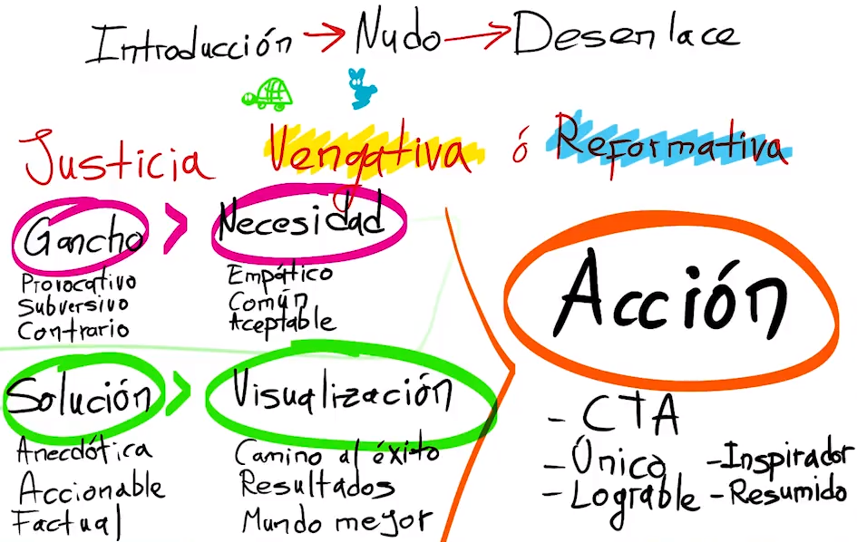
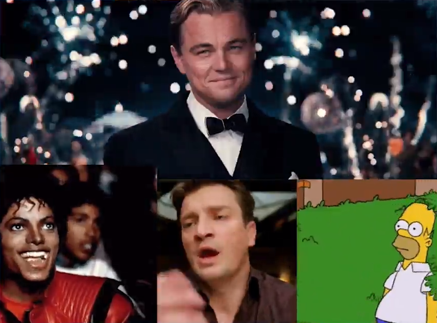
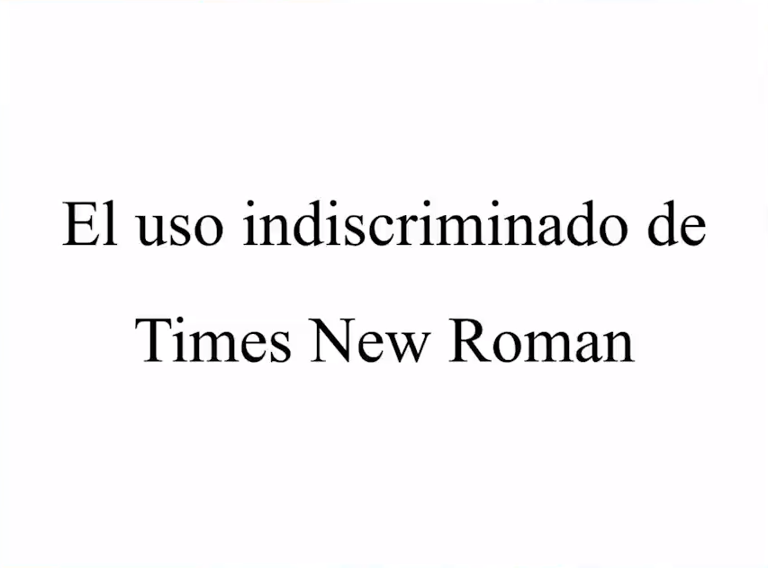
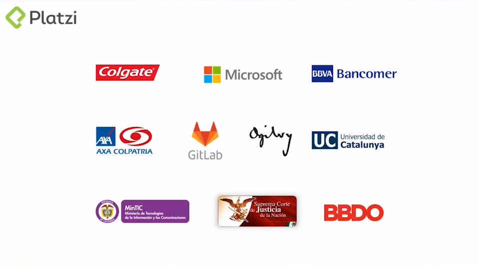
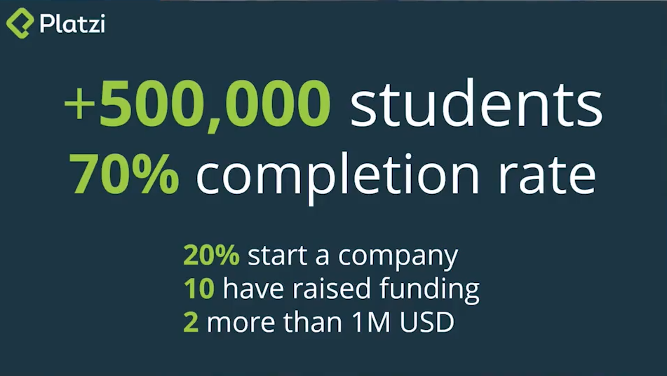
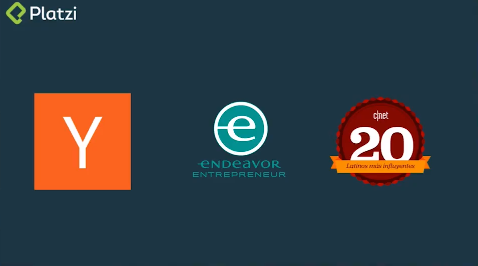
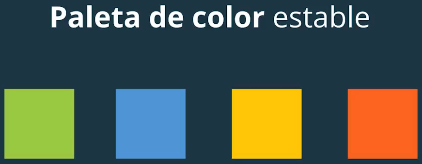
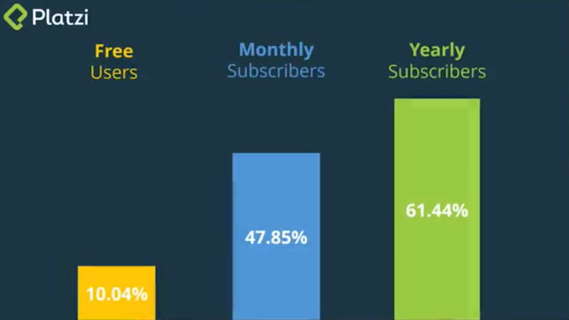
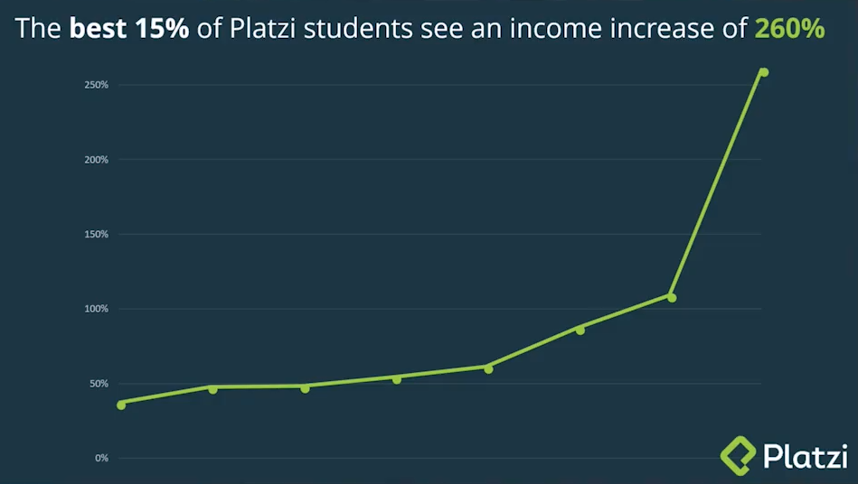
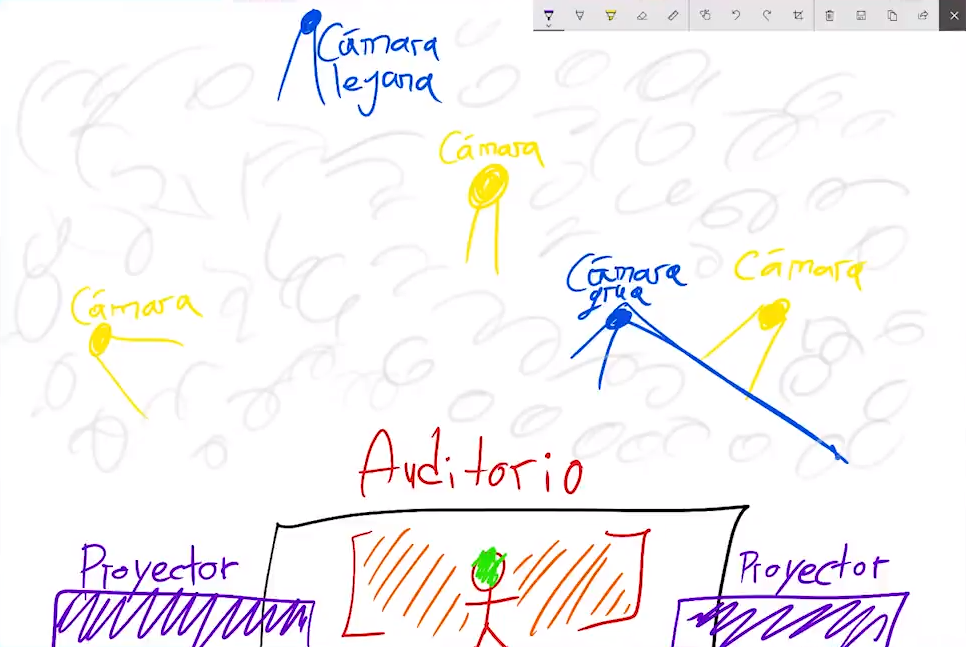

# Curso de Hablar en Público<!-- omit in toc -->

## Tabla de Contenido<!-- omit in toc -->
- [Cómo superar el miedo a hablar en público](#cómo-superar-el-miedo-a-hablar-en-público)
- [NUNCA te disculpes de NADA](#nunca-te-disculpes-de-nada)
- [El cerebro humano hablando a uno o a muchos](#el-cerebro-humano-hablando-a-uno-o-a-muchos)
- [Reglas básicas para dar conferencias](#reglas-básicas-para-dar-conferencias)
- [Cómo investigar y entender a tu audiencia](#cómo-investigar-y-entender-a-tu-audiencia)
- [Estructura de un discurso exitoso](#estructura-de-un-discurso-exitoso)
- [Cómo lograr que te escuchen y entiendan](#cómo-lograr-que-te-escuchen-y-entiendan)
- [Diseño de Presentaciones](#diseño-de-presentaciones)
  - [Qué no hacer](#qué-no-hacer)
  - [Preparación y diseño de slides](#preparación-y-diseño-de-slides)
- [Sincornización del tiempo](#sincornización-del-tiempo)
- [Cómo practicar para hablar en público](#cómo-practicar-para-hablar-en-público)
- [Improvisación](#improvisación)
- [Manejo de escenarios y cámaras](#manejo-de-escenarios-y-cámaras)
- [Aplausos](#aplausos)
- [Hablar en Youtube](#hablar-en-youtube)
- [Técnicas de interactividad en conferencias](#técnicas-de-interactividad-en-conferencias)
- [Charlas en vivo vs. Charlas grabadas](#charlas-en-vivo-vs-charlas-grabadas)
- [Cómo dar una charla en inglés](#cómo-dar-una-charla-en-inglés)
- [Elimina tus muletillas y frases de apoyo repetitivas](#elimina-tus-muletillas-y-frases-de-apoyo-repetitivas)
- [Enlaces de Interés](#enlaces-de-interés)

## Cómo superar el miedo a hablar en público

Es normal sentir miedo al hablar en público, pero hay que aprender a manejarlo.

Generalmente nosotros tenemos miedo por las cosas que salen de nuestro control y nos causan incertidumbre.

Es importante descubrir las causas de la incertidumbre. Por ejemplo se cree que la audiencia sabe más que uno.

El efecto Dunning-Kruger es un sesgo cognitivo que no nos permite sentirnos competentes cuando nos hemos preparado para dar una conferencia. En cambio, a las personas realmente incompetentes son las que se sienten con mayor conocimiento del tema. 

La audiencia no sabe lo que no sabe. Por ende, uno no tiene hablar de lo que sale mal:
* Llegue tarde.
* Estoy nervioso.
* Me olvidé de las diapositivas

La audiencia por defecto no le importa lo que tu estés pensando o sintiendo. A la audiencia solo le importa el contenido que tu vienes a darles.

Una vez te paras en el escenario y comienzas a hablar, el miedo pasa porque ya empiezas a hablar sobre lo que has preparado. Ese momento se llama "the flow" (el flujo).

## NUNCA te disculpes de NADA

¿Por qué te disculpas cuando cometes un error?
Cuando uno pide perdón esta diciendo: "quiero que me des algo para yo sentirme bien".

Cuando uno pide perdón en público, no lo hace para la audiencia, sino para uno mismo.

Al pedir disculpas podriamos perder hasta el 15% de nuestra audicencia debido a que ésta se enfoca, por un momento, en indagar los detalles de la causa de esa disculpa perdiendose del flujo de información que se transmite.

Si sucede algo, uno puede hcer lo siguiente:
* Si no rompe el flujo, continúa como si nada hubiese pasado. 
* Si lo rompe, se puede usar el error como ejemplo. 

## El cerebro humano hablando a uno o a muchos

Tu cerebro usa lados distintos cuando hablas en público y en privado.

Cuando hablamos con una persona, el cerebro se enfoca en las relaciones públicas mientras que cuando hablamos en público es muy dificil ver las reacciones de las personas. 

Cuando practiques no lo hagas tu solo o imagina que estás frente a una audiencia.

## Reglas básicas para dar conferencias

1. Practica
2. Intenta no dar siempre la MISMA conferencia
3. Investiga quién es tu audiencia
4. Ten un sólo gran mensaje
5. Ten un "Call to Action"
6. Habla lento, claro, fuerte
7. Ten frases asertivas
8. Evita el "yo yo yo"
9. Habla con un lenguaje inclusivo
10. Combina anécdotas con datos
11. Da una charla corta y resumida
12. No sólo des ordenes, explica por qué
13. Cierra con un resumen inspirador
14. Reitera tu "Call to Action"
15. Da la milla extra

## Cómo investigar y entender a tu audiencia

La diferencia entre un buen y un gran conferencista es la investigación de la audiencia, incluso si vas a dar la misma charla a grupos distintos. Aunque sea el mismo mensaje base puedes cambiar la forma en la que lo dices, para que todos se identifiquen con lo que dices.

Estas son las preguntas que puedes usar para entender a quién le vas a hablar:

* ¿Cuándo es tu evento?
* ¿En qué país y ciudad?
* ¿Quién te interesa que vaya o qué temas debe cubrir?
* ¿Cuántas personas a nivel presencial estarían en la charla del evento?
* Cuéntame brevemente el tipo de perfil de la audiencia
* ¿Cuál es el sitio web del evento?
* ¿Es una charla o un taller técnico lo que esperan?
* ¿Aparte de la charla esperan algún otro tipo de actividad con quien de la conferencia?

En canales como YouTube y Facebook puedes acceder a tu panel de administración y obtener datos mucho más específicos sobre el tipo de personas que consumen tu contenido. Utiliza esto a tu favor para reforzar las relaciones con la audiencia a la que estás llegando y para intentar hacer cambios y llegar a otro tipo de público.

Recomendación: Usa Google Trends, busca blogs locales, investiga como el evento vendió tu ponencia, empatíza con tu audiencia y siempre crearás una gran charla que nadie olvidará.

## Estructura de un discurso exitoso

En la escuela probablemente aprendiste la estructura de un cuento: introducción, nudo y desenlace. Los discursos tienen una estructura similar, un poco más compleja.

**Paso 1**: Crear un gancho.

El gancho debería de ser:
* Provocativo
* Subversivo
* Contrario

> La realidad es que en Latino América nosotros no queremos reformar a los delincuentes. Queremos vengarnos de ellos. Por muchas razones. En particular porque nos han hecho daño. Pero los datos nos dicen que los mejores países del mundo rehabilitan a sus criminales. Incluso a sus peores criminales. Son los peores países del mundo que tienen esta actitud vengativa. 

En este gancho se empieza dando una idea contraria al pensamiento común y se anima a las personas a pensar diferente.

**Paso 2**: Establecer una necesidad.

La necesidad es:
* Empática
* Común
* Aceptable

Una necesidad que conecta con cómo tú te sientes genera un empatía. Es común a la experiencia de todos y, por ende, es facil de aceptar. También tiene que ver con un dato que ya todos conocemos.

> Todos nosotros somos afectados por la violencia. Y sabemos que el crimen es una de esas cosas por las que hay pelear sin la menor duda porque a menor crimen somos más felices y más prósperos. 

Con esto se establece empatía y un elemento común.

> Sin embargo, la realidad es que nuestro país tiene más crimen porque hay más pobreza y una desigualdad genera siempre un instinto criminal. Estamos en el punto en el que nuestras cárceles ya no pueden más y están llenas de personas. Esta sobrepoblación carcelaria, sumada a un incremento en el crímen, nos hace obligatorio pensar en una nueva forma de ver la justicia.

Se colocó una base que es facil de aceptar: las cárceles están llenas, es difícil la justicia. Esto genera una necesidad implícita y conectada. 

**Paso 3**: Se crea una solución.

La solución debe de ser:
* Anecdótica
* Accionable
* Factual

> Tuve la experiencia de visitar las cárceles de este país y encontré personas que llevaban 5 años esperando un juicio porque nuestro sistema judicial no siempre funciona y, en ocaciones, encarcala a las personas incorrectas simplemente por falta de pruebas. Más allá de eso, también me di cuenta de personas que, aunque sean criminales, lo hicieron desde una perspectiva de neta necesidad. Por hambre, hambre física y real. Y ahora, la única fuente de ingresos de sus familias está en la carcel y esto genera muchísima más miserableza e impide romper el ciclo de la pobreza. Así que lo que yo estoy proponiendo, basado en estos datos que muestro acá, en los cuales encuentro que solo el 10% de las personas en nuestras cárceles cometieron crímenes mayores y el 90% fue una circumstancia de sus condiciones de vida que les permitiría avanzar si tuvieran una serie de condiciones distintas, es crear otro nivel de cárceles donde nosotros evaluemos estos casos y su viabilidad, sumado a una evaluación de sus capacidades cognitivas y sus conocimientos y lo que hagamos sea entrenarlos en capacidades técnicas y ponerlos en una condición donde no los incite a peores crímenes, como es la única opción que tienen en nuestro sistema vengativo carcelario actual y que de hecho les permita triunfar en la vida. 

Aquí se muestan estadísticas y números y contar una historia que conecte de una manera humana y anecdótica pero cuya acción sea funcional

**Paso 4**: La visualización de la solución.

La visualización debe hacer referencia a:
* Camino al éxito
* Resultados
* Mundo mejor

La audiencia debe encontrar un camino al éxito con esta idea del discurso. 

> Si nosotros logramos crear este nuevo sistema, más que de cárceles, de centros de rehabilitación: una vez creamos el proceso de identificación, no solamente logramos que estas personas se reintegren a la sociedad, bajamos los costos de nuestras cárceles, eliminamos el hacinamiento, aislamos de nuestras poblaciones y nuestras familias a la gente que realmente es peligrosa mientras no exponemos a esas personas a otros criminales casuales que simplemente estuvieron en un momento de mala suente en sus vidas y solamente les estamos ayudando a estos criminales realmente peligrosos a reclutar nuevas mentes. Con esto, logramos que a futuro estas personas no reinicidan porque en el sistema actual estan reincidiendo cada vez que salen de la cárcel. Logramos que ellos logren una movilidad económica que al final de su procesos de rehabilitación, les permita reintegrarse a su sociedad, aumentamos la fuerza laboral de nuestros países, mejoramos nuestra economía y logramos, de una manera más humana, que esta gente cree un impacto positivo a la sociedad después de haberle creado un impacto negativo. Y que su castigo sea hacer que nuestras vidas sean mejores. 

Se creó un camino al éxito y se fue al mundo más lindo. 

Un discurso no es un plan. El objetivo es proponer una idea y reclutar a personas que les guste la idea. 

**Paso 5**: Llamado a la acción.

* Call to Action
* Único
* Inspirador
* Lograble
* Resumido

> Es por ello que quiero presentarles platzi.com/carceles. Nuestro plan, no de cárceles, sino de centro de rehabilitación que tomen a estas personas que por múltiples razones de la vida estuvieron en una situación criminal y que hoy no es más que, no darles una segunda oportunidad, eso es lo mínimo que esperamos como humanos, sino ofrecerles una oportunidad real de triunfar en su vida más allá del tiempo de castigo que les fue otorgado. Lo que quiero de todos ustedes es que entren a www.platzi.com/carceles, vean nuestra propuesta y la compartan con su senador, con su congresista, con su presidente, con su consejal, con el político de turno que vean. Tomen esta url y van a encontrar cómo compartirla, cómo llevar esta acción a otros lugares y cómo lograr que nuestros sistemas de justicia no sean simplemente sistemas que oprimen a las personas que caen en circumstancias criminales y que los vuelven en criminales peores, que dejen de ser sistemas de reclutamiento de organizaciones criminales que realmente merecen estar aislados de nuestra socidad y que se vuelvan rayos de esperanza que le den una oportunidad nueva a una capacidad laboral increible, que lo único que necesita son las condiciones correctas para cambiar de vida. En platzi.com/carceles. 

Un buen discurso te cuenta un cuento y te deja una enseñanza y una acción.

Los buenos mensajes van en grupos de a tres. Cuando hablas en grupos de tres la gente te pone más atención.

  
  <small>
Estructura de un discurso
</small>

## Cómo lograr que te escuchen y entiendan

El micrófono de mano demuestra autoridad. Quizás es algo que tiene que ver con la puesta en escena, pues te permite modular mucho más. El uso del clicker también es algo importante que tienes que tener en cuenta, si vas a usar slides o algún tipo de apoyo gráfico, pues mover las manos mientras estás hablando es algo que se vuelve necesario.

Tip: Antes de dar una conferencia intenta hacerle saber a las personas que manejan el audio si tu eres una persona que habla fuerte o suave. En caso de que quieras crear contenido para YouTube haz tu mejor esfuerzo por invertir en tener un buen audio. Asegúrate de que te escuchen bien.

## Diseño de Presentaciones

### Qué no hacer

**1.** No utilices fondo negro y texto blanco. Esto es un problema porque los proyectores no siempre están bien calibrados, entonces es imposible de leer.

  
  <small>
Slide: Fondo Negro
</small>

**2.** Evita utilizar más de una tipografía.

  
  <small>
Slide: Diferentes Tipografías
</small>

**3.** Las listas o bullet points son un error. Recuerda dejar un solo mensaje por slide.

  
  <small>
Slide: Varios Bullets
</small>

**4.** Utiliza los logos más actualizados de las empresas a las que te vas a referir.

  
  <small>
Slide: Logos Antiguos
</small>

**5.** No coloques fotos pixeladas o de baja calidad. Busca una foto de alta definición.

  
  <small>
Slide: Foto Pixeleada
</small>

**6.** El espacio no es limitado. Tu texto no debe ser pequeño.

  
  <small>
Slide: Texto Pequeño
</small>

**7.** No utilices gifs ni memes. Si tu conferencia es profesional evita esto para darle seriedad a tu mensaje.

  
  <small>
Slide: Memes
</small>

**8.** Revisa la tipografía que vas a usar, en general Times New Roman no funciona para presentaciones.

  
  <small>
Slide: Time News Roman
</small>

**9.** Evita las fotos de bancos de imágenes, sobre todo si tienen las marcas de agua. Busca imágenes representativas de tu región o de tu audiencia.

  
  <small>
Slide: Foto Stock
</small>

**10.** No des las gracias, no hace falta.

  
  <small>
Slide: Gracias
</small>

### Preparación y diseño de slides

**1.** Asegúrate de saber cuál va a ser el estándar en el que necesitan tu presentación. (16:9 o 4:3)
**2.** ¿Tus slides son de presentación o de información? Un slide de presentación sirve para acompañar tu discurso y lo que estás diciendo, y uno de información no necesita que estés ahí, pues habla por sí solo.

Los slides de **presentación** son simples y son un apoyo a tu discurso. 

  
  <small>
Slide: Presentación
</small>

Los slides de **información** son llenos de información y no te necesitan a ti. Tiene información que no acompaña de forma perfecta el discurso. 

  
  <small>
Slide: Información
</small>

En algunos casos el slide puede ser tanto de presentación como de información.

  
  <small>
Slide: Información y Presentación
</small>

**3.** Arranca con ¿quién eres? ¿por qué estás ahí? y ¿por qué esto es importante?

  
  <small>
Slide: Preséntate
</small>

**4.** Deja un mensaje por slide.

**5.** Utiliza imágenes de alta calidad, sobre todo cuando uses logos.

  
  <small>
Slide: Logos de Alta Calidad
</small>

**6.** Ten una paleta de colores estable para causar impacto a nivel de diseño gráfico. La mayoría de presentaciones solo necesitan tres colores.

  
  <small>
Ejemplo: Paleta de Colores
</small>

  
  <small>
Slide: Paleta de Colores
</small>

Este sitio puede ayudar a formar paleta de colores: http://www.paletton.com

**7.** Tu marca es importante. Inclúyela en tus slides.

**8.** Intenta utilizar solo un gráfico por slide.

  
  <small>
Slide: Gráfico
</small>

**9.** Muestra datos sobre una foto con un degradado en la imagen.

  
  <small>
Slide: Imagen
</small>

**10.**  Utiliza tipografías sin cerifas, como Open Sanz o Helvética.

**11.** Termina tus presentaciones con la misión, un mensaje importante o dejando tu información de contacto.

  
  <small>
Slide: Misión
</small>

  
  <small>
Slide: Mensaje Importante
</small>

  
  <small>
Slide: Contacto
</small>

## Sincornización del tiempo

El tiempo es uno de los factores más difíciles de controlar cuando estás en cámara o frente al público. Las charlas TED preparan mucho a sus conferencistas para que den las mejores charlas, que deben durar de 12 a 15 minutos.

Los slides son una herramienta de disciplina mental que te ayuda a organizar tus ideas y saber cuánto tiempo te puedes tomar. Intenta no dedicarle a cada diapositiva más de un minuto.

**Ejercicio**: La próxima vez que vayas a dar una charla intenta crear un ignite (una conferencia de 5 minutos, con 20 slides que corren automáticamente cada 15 segundos) incluso si no te lo pidieron. Esto te va ayudar a tener ideas más concretas y a dejar tus mensajes claros.

## Cómo practicar para hablar en público

* Practica de pie desde el comienzo, pues lo más probable es que tu conferencia sea **de pie**.

* Recuerda que utilizas **diferentes lados del cerebro** dependiendo de si estás hablando ante un público o solo con una persona.

* Otra técnica que puedes utilizar son los **enlaces mnemónicos**, que son imágenes que te ayudan a recordar lo que estás tratando de decir. Para esto los slides son nuevamente de gran ayuda.

* Si tienes la oportunidad, **practica con algunas personas** que puedan darte feedback. Eso si, recuerda que todo el mundo tiene una opinión y no todas vale la pena considerarlas.

* Finalmente, si hay una frase que te interesa mucho recalcar puedes intentar **cantarla**. Esto te ayuda a crear un enlace más en tu cerebro para interiorizar el mensaje.

## Improvisación

Parar el show es lo peor que puedes hacer, lo único que importa cuando estás frente al público es que "el show debe continuar".

Si necesitas ganar tiempo puedes hacer esto:
* Standup comedy
* Regalar cosas
* Hacer preguntas con regalos

Si en algún momento te olvidas lo que vas a decir:
* Haz que el público se estire
* Toma una selfie

Si hay algún problema técnico, no hay ningún problema en dar contexto y pedir ayuda para que tu charla salga lo mejor posible. Y si el problema es que olvidaste lo que tenías que decir haz una pausa callada e intenta simplemente recordar cuál es el núcleo del mensaje que quieres dar, solo eso te va a permitir recuperar el hilo conductor.

## Manejo de escenarios y cámaras

Es normal no estar acostumbrados a estar frente a una cámara. No importa en dónde estén ubicadas, siempre intenta identificarlas y tener un contacto directo con el lente.

Un buen truco es que intentes mirar a un área vacía y no hacer contacto visual con una persona, pues las reacciones emocionales de tu audiencia pueden afectar tu energía en el escenario. Otra cosa que puedes hacer es ir cambiando entre las cámaras fijas que hayas identificado, solo no hagas esto con cámaras que se están moviendo.

  
  <small>
Setup de un Escenario
</small>

Es bueno moverse alrededor del auditorio. El público se aburre estando quieta y por lo menos debería de mover la cabeza. De este modo el público se va a enganchar más.

El área por donde te mueves debería de ser limitada. Por ejemplo, el área roja de la foto.

Muchos auditorios tienden a tener un podio en el que está el computador o algún control. Intenta no quedarte ahí si es posible.

Si quieres que el público vea tus diapositivas, voltea y mira una de las pantallas que las está proyectando.

## Aplausos

Siempre que termines una charla te van a aplaudir. En Broadway a esto lo llaman "el botón", que es como el Call To Action. Este es el momento en el que se hace un resumen un poco más acelerado del mensaje más fuerte que quieres dejar y que hace que cierre, que la gente sepa que "aquí se acabó".

Toma el mensaje más central de tu charla, cambia el tono, acelera el ritmo y agrega un punto final en tu forma de hablar para incitar a los aplausos.

Hay una forma de crear un "botón en el intermedio". Esto tiene que ver más con reacciones emocionales que puedes generar en tu audiencia, y en el instante en el que detectes que alguien inicia un aplauso puedes detenerte y dejar que esto se extienda.

## Hablar en Youtube

Los videos de YouTube tienen algunas características representativas. Aquí te damos algunos consejos para lograr los mejores videos:

* Haz un video corto, aproximadamente de 9 minutos. Una conferencia puede durar hasta 20 minutos, pero lo ideal es entre 12 y 15 minutos.

* Habla rápido, sin pausas, pero vocalizando. Practica tu dicción y mira siempre al lente.

* Crea thumbnails con títulos llamativos y de buena calidad para atraer más clicks. Agrega mayúsculas a las palabras clave que quieres resaltar.

  
  <small>
Ejemplo de thumbnails
</small>

* El título del video debería de estar optimizado para el SEO mientras que el título del thumbnail debería de ser más emocional.

## Técnicas de interactividad en conferencias

Pedirle a la audiencia que levante la mano para saber un poco más sobre ellos sirve mucho para iniciar una conferencia, pues así todos pueden ver qué tipo de personas están en el auditorio, identificarse con el resto y saber que depronto vas a interactuar con ellos.

Es bueno reportar los resultados de las personas que levantan la mano.   
**Ejemplo**: El 60% son programadores y el 40% son diseñadores.

Hay veces que la gente no encaja en ninguja de las preguntas que haces. Entoneces se puede preguntar ¿quién no levantó la mano en ninguno de los casos anteriores? Luego se le puede preguntar a una de esas personas que levantaron la mano.  
**Ejemplo**:  
\- ¿quienes son programadores?  
\- ¿quienes son diseñadores?  
\- ¿quién no levantó la mano?  
\- ¿a qué te dedicas?  

Con las preguntas se puede dividir a la audiencia generando un sentido de competitividad.  
**Ejemplo**:
\- ¿A quién le gusta los tornillos?
\- ¿A quién le gusta las tuercas?
\- Esto es típico de los que le gustan los tornillos
\- Claro, seguro tu votaste por las tuercas

Cuando haces preguntas a la audiencia donde los fuerzas a cometer errores generas recordación de algún dato importante que querías dejar en tu charla. Haz preguntas sobre el contenido de tu conferencia y mantén la atención de las personas todo el tiempo.

Se puede recompensar la interactividad. Por ejemplo, regalar algo a los que hacen una pregunta o a los que responden una pregunta.

En charlas o conferencias online puedes tener interactividad con tus redes sociales, invitando a que te envíen preguntas o mensajes a una cuenta determinada o un hashtag.

## Charlas en vivo vs. Charlas grabadas

Hay una mentalidad diferente cuando estamos viendo en vivo versus cuando vemos algo grabado. En vivo vale la pena pausar e interactuar con la audiencia, pues probablemente llevan bastante tiempo ahí y quieren conectarse más con el conferencista. En charlas o versiones grabadas es importante editar estos componentes de interactividad, pues generan la sensación de que te perdiste algo que ya pasó.

**Tip**: Cuando hagas charlas grabadas piensa en que le estás hablando a una, dos o pocas personas. Cuando hagas charlas en vivo habla como si estuvieras dirigiéndote a muchas personas.

## Cómo dar una charla en inglés

En Platzi hemos tenido que hacer diferentes presentaciones en inglés, tanto para reuniones o eventos presenciales como para contenido en video en YouTube.

¿Por qué tenemos miedo de hablar en otro idioma? A veces nos sentimos inseguros, pues no estamos acostumbrados a hacerlo normalmente, y la realidad es que si no podemos hablar un idioma a pesar de que podamos leerlo, tenemos un nivel muy bajo en el manejo de dicho idioma. Recuerda que el acento no es tan importante como el mensaje que quieres dar, si estás preparado para compartir lo que sabes con seguridad, el resto no importa.

Todo el mundo tiene un acento, incluso en su idioma nativo. Aunque existen formas de mejorar o cambiar tu acento, pero la verdad es que mientras te entiendan y lo que estés diciendo sea interesante todo estará bien. Sin embargo hay algo que puedes hacer siempre que vayas a dar una charla en un idioma que no es tu idioma nativo: habla lento, incluso al punto de sentirte incómodo.

Crear un script (escribir lo que quieres decir) funciona si es la primera vez que vas a hablar en otro idioma, pero ten en cuenta que después no deberías usar el script para decir cada una de las palabras que anotaste, pues esto puede bloquearte. Solo necesitas el script como una guía mental para tener la estructura de tu discurso.

## Elimina tus muletillas y frases de apoyo repetitivas

Cuando empezamos a hablar en público es normal tener algunas muletillas, tics nerviosos o frases de apoyo repetitivas que son difíciles de quitar. Para combatir esto el primer paso es identificarlas. Mira tus conferencias, grábate y revisa, además pregúntale a personas cercanas que te puedan dar ese feedback.

Luego de haber identificado tus muletillas puedes empezar a reemplazarlas con silencios. Esto también tiene efectos colaterales positivos, como darle más importancia a lo que acabas de decir, sonar más inteligente o generar más impacto, incluso si lo que pasó es que simplemente se te olvido lo que seguía.

Si vas a leer un discurso o decir algo que sabes de memoria igual es importante ponerle intención y pensar realmente qué viene a continuación, así que las pausas pueden ser una herramienta muy valiosa que te ayudará a darle más fuerza a tu mensaje.

## Enlaces de Interés
* [Curso de Hablar en Público
](https://platzi.com/clases/hablar-en-publico/)
* [Paletton](http://www.paletton.com)