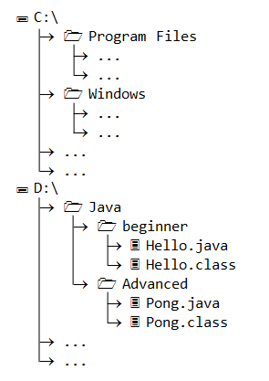
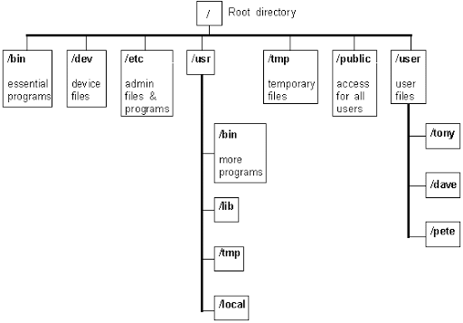
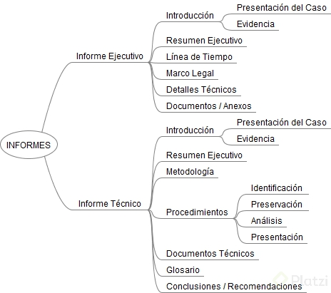

# Curso de Informática Forense

## Tabla de contenido
- [Curso de Informática Forense](#curso-de-informática-forense)
  - [Tabla de contenido](#tabla-de-contenido)
  - [¿Qué es computo forense?](#qué-es-computo-forense)
  - [Definiciones](#definiciones)
  - [Etapas del cómputo forense](#etapas-del-cómputo-forense)
    - [Preguntas en un interrogatorio](#preguntas-en-un-interrogatorio)
    - [Kit de adquisiciones](#kit-de-adquisiciones)
  - [Etapa I. Identificación](#etapa-i-identificación)
    - [Cadena de custodia](#cadena-de-custodia)
    - [Seguimiento documental](#seguimiento-documental)
    - [¿Quién tiene la evidencia y cuándo?](#quién-tiene-la-evidencia-y-cuándo)
    - [Soporte legal para el proceso de investigación](#soporte-legal-para-el-proceso-de-investigación)
    - [Inventario de Evidencia](#inventario-de-evidencia)
      - [Primer respondiente](#primer-respondiente)
    - [Tipos de adquisición](#tipos-de-adquisición)
  - [Etapa II. Preservación](#etapa-ii-preservación)
    - [Creación de una imagen forense](#creación-de-una-imagen-forense)
    - [Sistemas de protección contra escritura por hardware y software](#sistemas-de-protección-contra-escritura-por-hardware-y-software)
    - [FTK Imager](#ftk-imager)
      - [Adquisición de una imagen FTK Imager](#adquisición-de-una-imagen-ftk-imager)
      - [Adquisición de una imagen con EnCase](#adquisición-de-una-imagen-con-encase)
    - [Comandos Linux para creación de imágenes forenses](#comandos-linux-para-creación-de-imágenes-forenses)
      - [Comando dd](#comando-dd)
      - [Comando dc3dd](#comando-dc3dd)
      - [FTK Imager para Linux](#ftk-imager-para-linux)
    - [Verificación de imágenes forenses](#verificación-de-imágenes-forenses)
      - [Explicación de algoritmos Hash](#explicación-de-algoritmos-hash)
  - [Etapa III. Análisis de evidencia](#etapa-iii-análisis-de-evidencia)
    - [Sistemas de archivos: FAT y NTFS](#sistemas-de-archivos-fat-y-ntfs)
      - [¿Qué es un sistema de archivos?](#qué-es-un-sistema-de-archivos)
      - [Tipos de archivos](#tipos-de-archivos)
      - [Propiedades de archivos](#propiedades-de-archivos)
      - [FAT (File Allocation Table)](#fat-file-allocation-table)
      - [NTFS (NT File System)](#ntfs-nt-file-system)
      - [EXT (Extended File System)](#ext-extended-file-system)
      - [HFS+](#hfs)
      - [APSF](#apsf)
    - [Análisis preliminar de sistemas Windows](#análisis-preliminar-de-sistemas-windows)
    - [Análisis preliminar de sistemas Unix (Linux y MacOS)](#análisis-preliminar-de-sistemas-unix-linux-y-macos)
    - [Elaboración de informe preliminar](#elaboración-de-informe-preliminar)
    - [Análisis de Registro de Windows: SAM](#análisis-de-registro-de-windows-sam)
    - [Análisis de logs](#análisis-de-logs)
    - [Análisis de listas recientes (MRU) y Shellbags](#análisis-de-listas-recientes-mru-y-shellbags)
    - [Referencia del registro de Windows](#referencia-del-registro-de-windows)
      - [Archivo `NTUSER.dat`](#archivo-ntuserdat)
      - [Archivo `SOFTWARE`](#archivo-software)
      - [Archivo `SYSTEM`](#archivo-system)
    - [Análisis de procesos ejecutados](#análisis-de-procesos-ejecutados)
    - [Análisis de bandejas de reciclaje](#análisis-de-bandejas-de-reciclaje)
    - [Elaborar un informe a partir de los resultados obtenidos en cada una de las etapas de análisis](#elaborar-un-informe-a-partir-de-los-resultados-obtenidos-en-cada-una-de-las-etapas-de-análisis)
    - [Arranque y ejecución de procesos en Linux](#arranque-y-ejecución-de-procesos-en-linux)
      - [Primer paso: El BIOS](#primer-paso-el-bios)
      - [Segundo paso: El gestor de arranque](#segundo-paso-el-gestor-de-arranque)
      - [Tercer paso: El kernel de Linux](#tercer-paso-el-kernel-de-linux)
      - [Cuarto paso: proceso `/sbin/init`](#cuarto-paso-proceso-sbininit)
    - [Análisis de archivos de autenticación](#análisis-de-archivos-de-autenticación)
    - [Autopsy y Sleuth Kit Suite](#autopsy-y-sleuth-kit-suite)
  - [Etapa IV. Presentación](#etapa-iv-presentación)
    - [Elaboración de un informe ejecutivo y técnico](#elaboración-de-un-informe-ejecutivo-y-técnico)

## ¿Qué es computo forense?

> **"Forense"** del latín *forensis*: "delante del foro" / "frente al foro".  
> **"Evidencia"** del latín *evidentia*: "visible", "fácil de ver para cualquiera".

## Definiciones
- **Cómputo forense**: es el uso de métodos y técnicas científicas probadas, con el fin de validar y presentar la evidencia digital, con el propósito de facilitar la reconstrucción de hechos en una investigación.
- **Ciencia forense**: nos ayuda a establecer respuestas respecto a ciertos hechos en un contexto legal.
- **Evidencia digital**: son todos los datos almacenados de manera digital.

> *"Si dos objetos entran en contacto transfieren parte del material que los incorpora."*  - Locard

## Etapas del cómputo forense
- **1ra etapa “Identificación”**: reconocer nuestras fuentes de evidencia.
    - Resultados:
      - cadena de custodia
      - inventario de fuentes.

- **2da etapa “Preservación”**: conservar, almacenar, guardar la evidencia de manera segura.
  - Resultados: 
    - imágenes forenses
    - reportes de adquisición y verificación 
  - Recolección de información de dispositivos para generar copias exactas.
- **3ra etapa “Análisis”**: analizar nuestra información obtenida.
    - Puntos clave a tener en cuenta la tercera etapa:
      - Sistemas de archivos
      - Creación de imágenes parciales
      - Exportado de archivos
      - Análisis preliminar de Sistemas Operativos
    - Resultados:
      - resultados generales de la investigación
      - posibles fuentes adicionales de consulta.
- **4ta etapa “Presentación”**: mostrar resultados que sean válidos.
  - Puntos clave a tener en cuenta cuarta etapa:
    - Organización de la información
    - Creación de un informe técnico
    - Creación de un informe ejecutivo
    - Presentación ante autoridades
  - Resultados:
    - informe técnico
    - informe ejecutivo.

### Preguntas en un interrogatorio
Estas son las preguntas que siempre intentaremos resolver:
- ¿Qué?
- ¿Cómo?
- ¿Cuándo?
- ¿Dónde?
- ¿Quién?
- ¿Por qué?

### Kit de adquisiciones

| Hardware  | Software  |  Herramientas |
|:---|:---|:---|
| Laptop (Windows / Linux), protectores contra escritura, cámara digital, discos duros externos | Linux Live USB: (Paladin Forensics / Kali), EnCase Imager, FTK Imager Lite | Destornilladores, Cables de red, Cables SATA e IDE, Pinzas y Linterna |

## Etapa I. Identificación
### Cadena de custodia

Procedimiento documental en el cual se registra la responsabilidad y custodia de los elementos de evidencia digital, desde su adquisición o generación, hasta su disposición final.

- **NOTA**: Se requiere un formato de cadena de custodia por cada activo de información.
  
### Seguimiento documental
Usando un formato más o menos estándar, se hace seguimiento a la evidencia.

### ¿Quién tiene la evidencia y cuándo?
El proceso y la documentación ayudan a saber quién es el responsable de la evidencia en cada momento.

### Soporte legal para el proceso de investigación
La CoC (*Chain of Custody*) es un proceso estándar aceptado a nivel internacional.

### Inventario de Evidencia
#### Primer respondiente
> ¿Quién es? ¿Cómo debe estar preparado? ¿Qué alcance tiene?

El primer respondiente tiene la poestad para entregarte los activos a analizar, los siguientes son algunos datos que debes registrar en tus cadenas de custodia:

- Número Identificador
- Custodio
- Tipo de dispositivo
- Marca
- Modelo
- Número de Serie
- Número de Inventario
- Capacidad de Almacenamiento
- Notas
### Tipos de adquisición
- **Estática**: Sistemas que están apagados o que no se modifican o alteran al apagarse.
- **En vivo**: Sistemas que no pueden apagarse, o que al apagarse pierden información relevante.

## Etapa II. Preservación
### Creación de una imagen forense
- **Imagen forense**: Copia “bit-a-bit” exacta del contenido de un medio de almacenamiento, que utiliza algún método de verificación digital para garantizar la autenticidad de la información.

### Sistemas de protección contra escritura por hardware y software

Por hardware requiere la compra de un dispositivo dedicado, éste impedirá la escritura en el disco. Por software se puede descargar [aquí](https://github.com/msuhanov/Linux-write-blocker).

### FTK Imager
Es una herramienta de análisis forense disponible en la Web de AccessData, además que permite varios formatos para imágenes. Se puede descargar [aquí](https://accessdata.com/product-download/).

Opciones de disco para montar dentro de FTK Imager:
- **Disco lógico**: es la sección de un disco que tenga un equivalente lógico. No es una copia exacta.
- **Disco físico**: cualquier disco que esté conectado físicamente a la máquina.
- **Archivo de imagen**: es una imagen forense que ya este creada.

#### Adquisición de una imagen FTK Imager
Una vez determinada la fuente se debe escoger el formato de salida de la imagen, dentro de las cuales tenemos:
- **Raw (dd)**: (Data Dump) poco usado porque no soporta compresión.
- **SMART**: en desuso.
- **E01**: Encase de las primeras herramientas comerciales de informática forense y es muy popular soportada por varias aplicaciones formato propio (Formato que se va a usar en la mayoría de los casos).
- **AFF**: sólo soportado por las herramientas de Access Data.

#### Adquisición de una imagen con EnCase
ENCASE de la empresa Guidance software ahora comprada por Opentext es una herramienta gratuita que podemos bajar directamente desde [aquí](https://www.opentext.com/about/contact-us/contact-opentext).

Primero se adiciona la evidencia:
- **Local Device**: Cualquier dispositivo de almacenamiento físico
- **Network preview**: Disco mapeado atravez de la red
- **Evidence File**: Imágenes forenses
- **Raw image**: Imagen raw
- **Crossover Preview**: Carga Varias imágenes simultáneamente.

Una vez determinada la fuente se debe escoger el formato de salida de la imagen, dentro de las cuales tenemos:
- **Acquire**: Crea imagen
- **Create Logical Evidence File**: Crea imagen logica
- **Acquire Data Remotely**: Adquisición por mapeo de disco en una red

Desventaja: No genera reporte automáticos, hay que tomar los datos manualmente.

### Comandos Linux para creación de imágenes forenses
La mayoría de las herramientas tienen su opción de correr en linux.

#### Comando dd
Comando linux base que permite copiar información con algunos parámetros más avanzados.

```
dd if=/dev/sdb of=/ruta/a/la/usb/imagen01.001
```

#### Comando dc3dd
El comando `dc3dd` convierte y copia archivos.
```
dc3dd if=/dev/sdb hofs=/ruta/a/la/usb/imagen02.000 ofsz=300MB hash=md5 hash=sha1 verb=on log=/ruta/a/la/usb/imagen01.txt
```
#### FTK Imager para Linux

```
./ftkimager /dev/sdb /ruta/a/la/usb/imagen03 --e01 --frag 300MB --compress 6 --case-number Platzy_01_05 --description Imagen\ forense\ de \un \dispositivo \externo. --verify
```

### Verificación de imágenes forenses

#### Explicación de algoritmos Hash

- **Hash**: es una función matemática no reversible que genera una cadena de caracteres de longitud fija a partir de cualquier conjunto de datos.
- **Colisión**: ocurre cuando dos mensajes de información distintos nos producen el mismo resultado a partir de algoritmos hash. No es confiable.
- **Algoritmo MD5**: trabaja con bloques de caracteres y el les va aplicando una función matemática y de desplazamiento.
- **Algoritmo SHA-1**: utiliza un modelo similar a los bloques de caracteres donde va concatenando y aplicando funciones matemáticas.
- **Operación por bloques**: es lo que realmente hacen los algoritmos MD5 y SHA-1.

## Etapa III. Análisis de evidencia
### Sistemas de archivos: FAT y NTFS
#### ¿Qué es un sistema de archivos?
Es un conjunto de reglas y procesos para administrar la información en un medio de almacenamiento.

#### Tipos de archivos

- **Archivos o ficheros**: conjunto de datos que tienen algo en común y están delimitados.
- **Carpetas o directorios**: contienen archivos en estructura jerárquica.
- **Archivos especiales**: accesos directos.

#### Propiedades de archivos

- **Ruta**: ubicación lógica de archivos en estructura jerárquica.
- **Metadatos**: (datos de los datos) atributos y propiedades de un archivo.
- **Permisos**: reglas de acceso, modificación de archivos.

#### FAT (File Allocation Table)
- Tabla de asignación de archivos.
- Máximo de archivos 4GB.
- Re-implementado como exFAT.

#### NTFS (NT File System)
- Sistema por defecto en la familia de Windows NT.
- Introdujo el *system journaling*.
- Propietario de Microsoft y no es 100% compatible.

#### EXT (Extended File System)
- No usa extensiones.
- Utiliza i-nodos como apuntadores.
- Minimiza la fragmentación.
- Puntos de montaje.

#### HFS+
- Usado en dispositivos Mac y iPhone
- Reduce casi a cero la fragmentación
- No permite acceso concurrente.
- Soporte de fechas hasta el 6 de febrero de 2040.

#### APSF
- Multiplataforma.
- Espacio libre compartido.
- 2 versiones: *case-sensitive* y *case-insensitive*.

### Análisis preliminar de sistemas Windows
El sistema de archivos Windows tiene la siguiente estructura:


Para el análisis de sistemas Windows hay 4 archivos que son muy útiles para análisis forense, hay que buscar en los archivos de registro en `Windows->System32->config`:

- SAM
- SYSTEM
- SOFTWARE
- SECURITY

A través de la herramienta Fred (Forensic Registry editor) disponible para Linux y Windows, nos permite examinar Y editar el contenido de los archivos de registro y consultar manualmente cada una de sus llaves.

**Nota**: Los números hexadecimales los podemos reconocer por que inician con `0x`.

### Análisis preliminar de sistemas Unix (Linux y MacOS)
El sistema de archivos UNIX tiene la siguiente estructura:


Archivos de configuración:

- Funcionan a nivel de aplicación.
- Varían según la distribución.
- No son archivos estándar.

Estructura del sistema de archivos UNIX:

| RUTA | DESCRIPCIÓN |
| :---: | :--- |
| `/` | Directorio Raíz tambien llamado *root* que contiene toda la jerarquía |
| `/boot` | Dónde se aloja el arranque del sistema operativo |
| `/home` | Dónde se aloja toda la información de los usuarios del sistema |
| `/etc` | Contiene los archivos de configuración de los distintos servicios activos en el sistema |
| `/bin` | Dónde están las aplicaciones binarias tanto para usuarios como para superusuario. |
| `/var` | Dónde se alojan los archivos variables como *logs* del sistema, temporales, bases de datos. |
| `/root` | Directorio exclusivo para uso del superusuario del sistema. |
| `/usr` | Dónde se alojan las utilidades y aplicaciones disponibles para todos los usuarios. |
| `/dev` | Directorio donde se alojan todos los archivos que se relacionan al hardware del sistema |

### Elaboración de informe preliminar

Cuando ocurre un incidente informático, las personas afectadas siempre necesitan tener respuesta rápidamente. Esta es una constante con la que te vas a encontrar en tus investigaciones, y tu capacidad, no solo para responder rápidamente al incidente, sino para manejar las expectativas de quienes esperan tu análisis, va a ser muy importante en tu carrera como investigador.

Precisamente por esta expectativa y necesidad de respuesta que siempre se encuentran en las investigaciones, en muchas ocasiones es útil realizar un análisis preliminar e incluso presentar un informe con los resultados que obtengas, con el fin de dar un primer avance en el desarrollo de la investigación. Regularmente, un informe de análisis preliminar incluye:

1. **Introducción al caso**: Una presentación general del incidente y el contexto de la investigación. Debe mostrarle al lector claramente por qué se inició una investigación, y quién está a cargo de la misma.
2. **Resumen general**: Una descripción breve del proceso de investigación que se está ejecutando, y las actividades que se han desarrollado hasta este punto. Si hay resultados importantes que se hayan obtenido, es muy importante incluirlos acá para mostrar avances en la investigación.
3. **Inventario de evidencia identificada**: Una relación general de la evidencia que se ha preservado y sobre la que se está realizando el análisis. Es importante mencionar los criterios usados durante la etapa de identificación para escoger los dispositivos en particular, así como explicar las decisiones que se han tomado durante el proceso de investigación (¿Por qué se decidió analizar un dispositivo en particular?, ¿Por qué se utilizó cierta estrategia o herramienta?).
4. **Reportes de adquisición de evidencia**: Los informes técnicos de adquisición. Es importante asegurar desde las primeras etapas que la información con la que estamos trabajando es íntegra, sobre todo en contextos o escenarios donde pueda haber dudas sobre la calidad de la información obtenida. Recuerda documentar todos los pasos y decisiones que hayas tomado durante la preservación de cada elemento.
5. **Información general de los sistemas preservados**: La primera etapa del análisis consiste en identificar qué información hay disponible y cómo está almacenada. Regularmente esto implica analizar los sistemas operativos e identificar datos sobre ellos como la zona horaria, la fecha de instalación, los usuarios configurados, entre otros.
6. **Información encontrada en las imágenes forenses**: Para tomar decisiones sobre cómo avanzar en la investigación, es necesario tener claro qué información se encontró. Datos como cuentas de correo electrónico, carpetas de usuario, documentos y similares, son importantes en esta etapa y es necesario documentarlos.
7. **Hallazgos preliminares, si existen**: Es importante describir detalladamente cualquier hallazgo o resultado importante que se haya encontrado. En muchas ocasiones los resultados más importantes se identifican en la primera etapa de la investigación, y es importante documentarlos rápidamente para mostrar avances.
8. **Siguientes pasos**: Finalmente, un buen indicador de una investigación estructurada y que está avanzando es un plan de trabajo sobre los resultados identificados. En un informe preliminar idealmente debería explicarse el plan de trabajo que se está siguiendo, el avance actual sobre este y los pasos a seguir para concluir satisfactoriamente la investigación.

Como siempre, ten en cuenta que esto no es un absoluto, y siempre encontrarás escenarios, investigaciones o casos que tengan requerimientos diferentes o muy específicos. Una de las características más valiosas en un investigador es su capacidad de adaptarse a situaciones diversas. No pierdas de vista el objetivo principal de la investigación y recuerda, para tu plan de acción, las 6 preguntas básicas del método de investigación.

### Análisis de Registro de Windows: SAM

**RegRipper** es la herramienta que se usa para revisar el archivo SAM, lo puedes descargar [aquí](https://github.com/keydet89/RegRipper3.0). Genera dos archivos: un log y el archivo reporte de SAM. Se pueden obtener entre otros datos los siguientes:

- El nombre del usuario
- SID de los usuario de sistema incluido el administrador
- Nombre completo
- Tipo de cuenta
- Última fecha de acceso del usuario
- Última fecha de acceso con password equivocado
- Última fecha de cambio de contraseña
- Estado de la cuenta (activa)
- La pista de contraseña

Los usuarios básicos que necesita Windows para funcionar si ID comienza con el `500` para el administrador y `501` para el Invitado, después de estos todos los usuarios que se crean se asignan el id a partir del `1000` de manera consecutiva.

Los números ID de cada usuario no se reutilizan son únicos para cada usuario de tal forma que si se borra un usuario, su ID no se asigna a uno nuevo, esto permite reconstruir la carpeta de un usuario borrado pues se tiene el ID que tenía al observar el faltante en los consecutivos del ID.

`LastWrite` es un valor común de las llaves de registro que se pueden modificar y siempre muestra cuando se modifico por ultima vez

- **Llave de registro**: contiene información de los programas instalados en el equipo.
- **Archivo Software**: es el que contiene más información de nuestro equipo.
- **Plugin de Software**: muestra todas las características y datos de aplicaciones instaladas; fecha de modificación, versión, etc.

### Análisis de logs
Logs de Windows están en `Windows/System32/winevt/logs`

Los tres archivos de log importantes son: 
- **System**: Contiene información relacionada con los servicios y sistemas propios del sistema operativo. 
- **Security**: Contiene la información de eventos, accesos, permisos, políticas del sistema operativo con un ID de seguridad en donde podemos ver el usuario del sistema que generó el evento.
- **Application**: Contiene la información de las aplicaciones instaladas y ejecutadas dentro del sistema operativo.

### Análisis de listas recientes (MRU) y Shellbags

**`ShellBagsView`**: Es el intérprete que podemos usar para establecer `MRU` y `Shellbags`. Lo puedes descargar [aquí](https://www.nirsoft.net/utils/shell_bags_view.html).

Dentro de la carpeta de cada usuario encontramos el archivo `NTUSER.DAT` que necesitaremos para analizar y adicional se usara el archivo `Usrclass.dat` que está en `/usuario/APPdata/local/Microsoft/windows/`.

Si bien es cierto el `ShellBags` sólo guarda la configuración de las carpetas e íconos que el usuario visualiza a medida que navega por el escritorio, si se mira con cuidado es como ver las huellas que deja una persona que camino por la arena y es ahí donde la herramienta `ShellBagsView` es muy útil.

### Referencia del registro de Windows
A continuación, se detallan algunas de las ubicaciones comunes donde un investigador forense puede encontrar información relevante para una investigación dentro del Registro de Windows.

#### Archivo `NTUSER.dat`
Historial de búsqueda:
```HKEY_LOCAL_MACHINE\SOFTWARE\Microsoft\Search\Assistant\ACMru
```
Documentos recientes:
```
HKEY_LOCAL_MACHINE\SOFTWARE\Microsoft\Windows\CurrentVersion\Explorer\RecentDocs
```
Documentos recientes de Office:
```
HKEY_LOCAL_MACHINE\SOFTWARE\Microsoft\10\Word\FileMRU
HKEY_LOCAL_MACHINE\SOFTWARE\Microsoft\10\Excel \FileMRU
HKEY_LOCAL_MACHINE\SOFTWARE\Microsoft\10\PowerPoint \FileMRU
```
Comandos ejecutados por el usuario:
```
HKEY_LOCAL_MACHINE\SOFTWARE\Microsoft\Windows\CurrentVersion\Explorer\RunMRU
```
Programas ejecutados:
```
HKEY_LOCAL_MACHINE\SOFTWARE\Microsoft\CurrentVersion\Explorer\UserAssist{GUID}\Count
```
#### Archivo `SOFTWARE`

Versión del Sistema Operativo:
```
HKEY_LOCAL_MACHINE\SOFTWARE\Microsoft\Windows NT\CurrentVersion\
```
#### Archivo `SYSTEM`

CurrentControlSet
```
HKEY_LOCAL_MACHINE\SYSTEM\ControlSet00x
HKEY_LOCAL_MACHINE\SYSTEM\SelectCurrent
```

**Nota**: El *Control Set* es el conjunto de parámetros de una configuración del Sistema Operativo. La llave `SelectCurrent` es un apuntador a uno de los posibles `ControlSet00x` disponibles, y ese es el que se conoce como `CurrentControlSet`. Al hacer puntos de restauración del sistema operativo y guardar copias del registro, se crean nuevos *Control Sets* que son backups funcionales de configuraciones anteriores, pero la configuración actual del sistema siempre hace referencia al “CurrentControlSet”.

Nombre del computador en red:
```
HKEY_LOCAL_MACHINE\SYSTEM\CurrentControlSet\Control\ComputerName
```
Interfaces de red:
```
HKEY_LOCAL_MACHINE\SYSTEM\CurrentControlSet\Services\Tcpip\Parameters\Interfaces
```
Zona horaria del SO:
```
HKEY_LOCAL_MACHINE\SYSTEM\CurrentControlSet\Control\TimeZoneInformation
```

### Análisis de procesos ejecutados

**Prefetching**: Es una estrategia que en Windows se usa para ayudar a los programas que se usan frecuentemente a cargar mas rápido.Está ubicada en `Windows\Prefetch`.

`Prefetch` crea una carpeta en donde hay un archivo por cada uno de los procesos recurrentes del computador, este archivo contiene la información que cada aplicación necesita para poder correr, de tal forma que cuando el programa las necesita accede rápidamente.

- Se generan por cada proceso independientemente si esta instalado o no
- El archivo se genera la primera vez que una aplicación es ejecutada
- Es una base de datos simple pero tiene la información necesaria para que una aplicación se ejecute
- Contiene la cantidad de veces que se ejecuta un proceso

Para que los datos sean más fáilmente leídos es con la aplicación `PECmd.exe` se podrá exportar el archivo `prefetch` para su análisis. Para descargar la herramienta [aquí](https://ericzimmerman.github.io/#!index.md).

### Análisis de bandejas de reciclaje
La papelera de reciclaje es un espacio de almacenamiento que le permite al usuario borrar un archivo y recuperarlo. Fue creada por Windows para darle al usuario esa posibilidad. Veremos ¿cómo funciona la papelera de reciclaje? y ¿cuáles son las configuraciones internas del sistema para la papelera?

- Espacio de almacenamiento temporal.
- Capacidad máxima de 4GB o el 10% de la partición.
- Debe contener información para recuperar los archivos.
- `C:$Recycle.Bin` (Directorio de almacenamiento)
- Dos archivos por cada elemento borrado:
  - `$IXXXXXX.*`
  - `$RXXXXXX.*`

### Elaborar un informe a partir de los resultados obtenidos en cada una de las etapas de análisis

1. **Introducción al caso**: ¿Qué ha cambiado? ¿Has incluido nueva información? ¿Ha cambiado en algo el contexto del caso? Si no, probablemente el contenido sea muy similar al de tu informe.
2. **Resumen general**: Deberías incluir ahora todas las actividades realizadas, pero especialmente enfocándote en las que te dieron resultados más importantes.
3. **Inventario de evidencia identificada**: Este inventario probablemente siga siendo el mismo.
4. **Reportes de adquisición de evidencia**: En este punto, tal vez tengas algo más de información técnica. Además de los reportes de adquisición, puedes tener informes técnicos de herramientas que hayas usado para el análisis.
5. **Información general de los sistemas preservados**: Si no has incluido evidencia nueva, tal vez la información en esta sección no haya cambiado.
6. **Información encontrada en las imágenes forenses**: Esta es una de las secciones que probablemente más cambios tuvieron. Prepara la información técnica de los resultados de todos tus análisis.
7. **Hallazgos preliminares, si existen**: Aquí ya no vamos a hablar de hallazgos preliminares, sino de todos los hallazgos que encontraste. ¿Qué fue lo más importante o significativo?, ¿Cuál es el dato o la respuesta más relevante?, ¿Vale la pena incluir un análisis de línea de tiempo?
8. **Siguientes pasos**: Puede ser que no haya siguientes pasos en la investigación, pero tal vez sí tienes recomendaciones para tu cliente o para quien reciba tus resultados. Tal vez mejorar su sistema de seguridad, instalar algún parche en particular. Este tipo de sugerencias dan mucho valor agregado a tu trabajo. Debes incluirlas cada vez que puedas.

### Arranque y ejecución de procesos en Linux
Para comprender la ejecución de procesos y la información que estos almacenan en un sistema Linux, es importante entender cómo es el proceso de inicio del Sistema Operativo, qué archivos se acceden durante este proceso y qué información se modifica.

#### Primer paso: El BIOS
El BIOS (Basic Input/Basic Output) es el primer sistema que carga el procesador cuando se enciende. El BIOS se encarga de detectar el hardware disponible y proporcionar un primer acceso a los dispositivos periféricos, así como de identificar un dispositivo desde el cual iniciar el sistema (regularmente, la primera partición de un disco local). Una vez el BIOS encuentra un dispositivo disponible para iniciar, le deja el control del sistema a éste.

#### Segundo paso: El gestor de arranque
En los sistemas Unix existen diferentes gestores de arranque. Éste se encarga de escoger un sistema operativo a partir de una lista de dispositivos y sectores de arranque disponibles. El gestor de arranque más común en Linux probablemente sea GRUB (GRand Unified Bootloader), pero existen otros y es común encontrarlos.

#### Tercer paso: El kernel de Linux
El kernel es el proceso principal que ejecuta el sistema operativo Unix y del que dependen todos los demás procesos. Se encarga de administrar los controladores necesarios para usar el hardware, inicializa el sistema de archivos y prepara la memoria.

#### Cuarto paso: proceso `/sbin/init`
Este proceso se encarga de configurar el entorno de usuario. Los archivos de configuración de este proceso se encuentran en la carpeta `/etc/inittab`, y el primer script que se ejecuta es `/etc/init.d/rcS`.

A nivel lógico, el proceso init es el proceso del que derivan todos los demás procesos automáticos del sistema. Éste ejecuta todos los procesos que se encuentran en la carpeta `/etc/rcS.d/` y en `/etc/rc.boot/`. Estas carpetas son una gran fuente de referencia para revisar los procesos que se ejecutan por defecto al iniciar el sistema.

### Análisis de archivos de autenticación
Configuración de usuarios:
- Los usuarios se almacenan en dos archivos:
   - `/etc/passwd`
   - `/etc/shadow`
- Usuarios con privilegios de administración:
   - `/etc/sudoers`
- Configuración de grupos:
   - `/etc/group`

Sintaxis `/etc/passwd`:
```
user:x:1001:1001:just a user,111,,:/home/user:/bin/bash
```
  - Nombre de usuario
  - Password
  - ID de usuario (UID)
  - ID de grupo (GID)
  - Nombre completo
  - Carpeta `/home`
  - *Shell* de acceso

Sintaxis `/etc/shadow`:

```
user:$1$HESu9xrH$k.o3G93DGoXliQKkPmUgZ0:14699:0:99999:7:::
```

- Nombre de usuario
- Password cifrado
- Último cambio de password (Días desde el 01/01/1970)
- Mínimo de días para cambiar el password
- Máximo de días en que es válido después de alerta
- Número de días de alerta
- Número de días para desactivar la cuenta
- Expiración de la cuenta

### Autopsy y Sleuth Kit Suite

[Link de descarga](https://www.autopsy.com/download/)

## Etapa IV. Presentación
### Elaboración de un informe ejecutivo y técnico
La siguiente es la estructura ejemplo de un reporte con todos los resultados obtenidos:



```sequence
Alice->Bob: Hello Bob, how are you?
Note right of Bob: Bob thinks
Bob-->Alice: I am good thanks!
```


