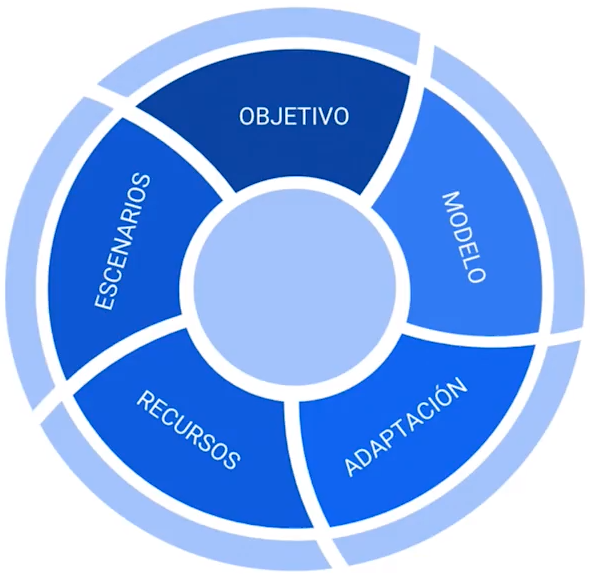
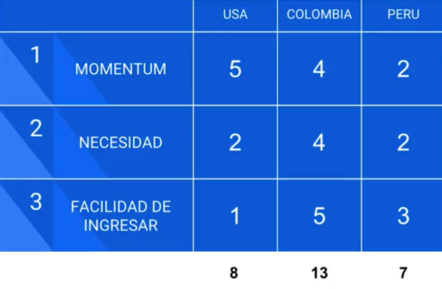
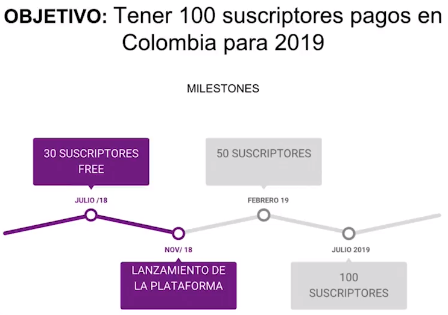
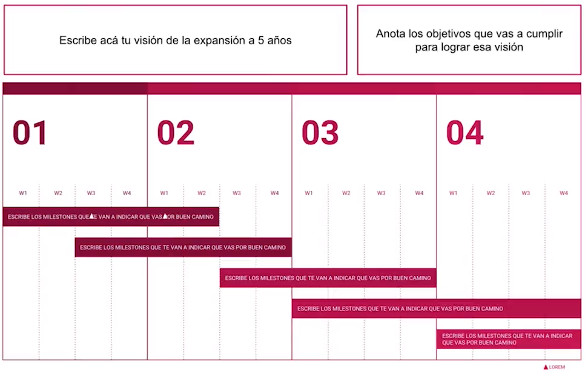
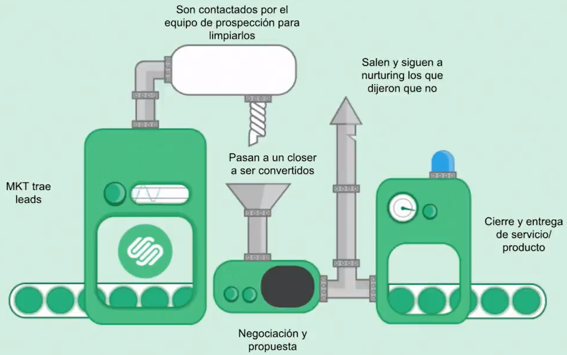
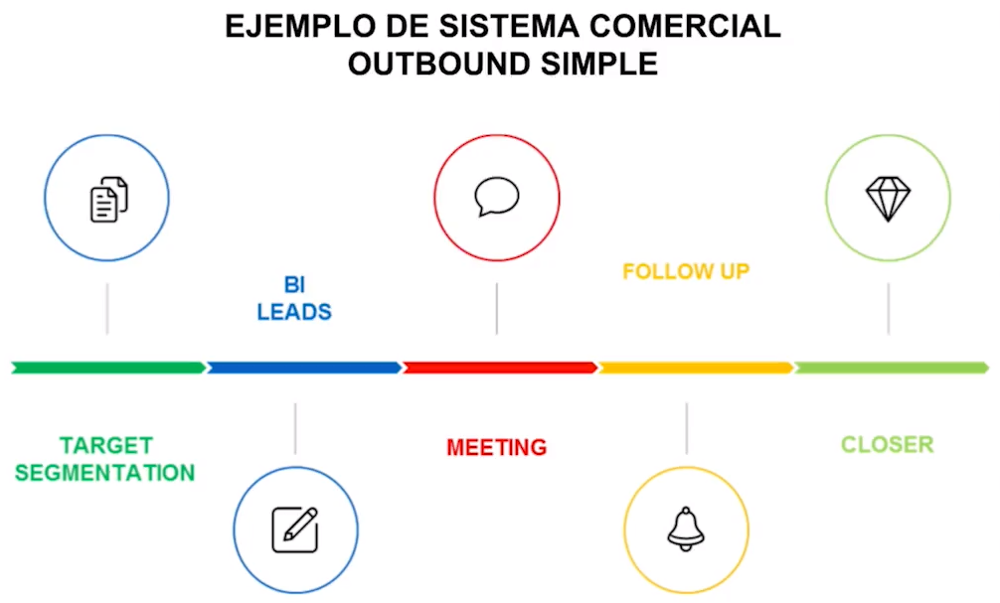
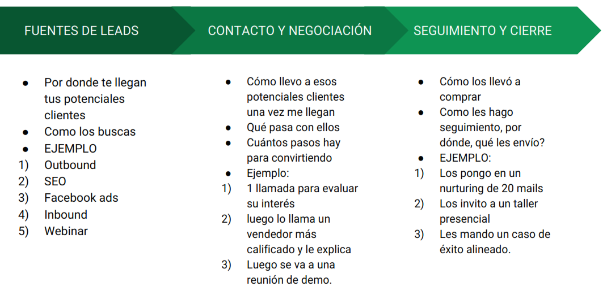
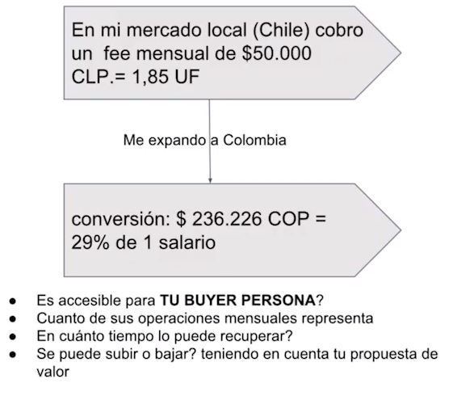
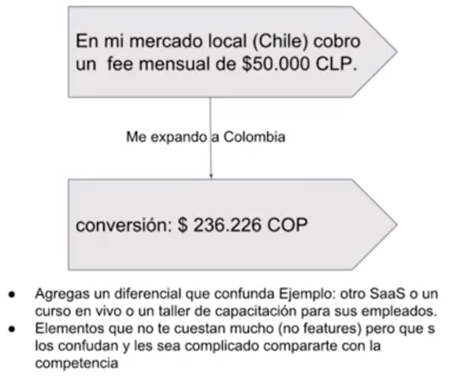
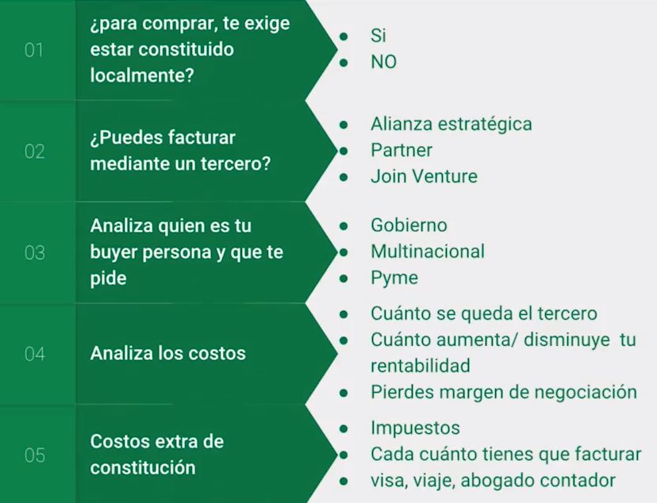

# Curso de Internacionalización para Startups<!-- omit in toc -->

## Tabla de Contenido<!-- omit in toc -->
- [¿Por qué internacionalizar tu empresa?](#por-qué-internacionalizar-tu-empresa)
- [Introducción al mercado global](#introducción-al-mercado-global)
  - [¿Es momento de internacionalizar tu empresa?](#es-momento-de-internacionalizar-tu-empresa)
  - [Servicios vs. Productos](#servicios-vs-productos)
    - [Servicios](#servicios)
    - [Productos](#productos)
  - [Los Pilares de la Expansión](#los-pilares-de-la-expansión)
- [Planeación de Estrategia](#planeación-de-estrategia)
  - [Modelos de Expansión](#modelos-de-expansión)
  - [¿Cómo elijo el país correcto para vender mis proyectos?](#cómo-elijo-el-país-correcto-para-vender-mis-proyectos)
  - [Planeando mi crecimiento internacional](#planeando-mi-crecimiento-internacional)
  - [Creando una marca internacional](#creando-una-marca-internacional)
- [Explorar otros mercados](#explorar-otros-mercados)
  - [Adaptación Comercial](#adaptación-comercial)
  - [¿Cómo lograr ventas en el otro mercado?](#cómo-lograr-ventas-en-el-otro-mercado)
  - [Creando un Sistema Comercial](#creando-un-sistema-comercial)
- [Estrategia financiera y legal](#estrategia-financiera-y-legal)
  - [Adaptando el precio al nuevo mercado](#adaptando-el-precio-al-nuevo-mercado)
  - [¿Se debe constituir una empresa en el otro mercado?](#se-debe-constituir-una-empresa-en-el-otro-mercado)
- [Recursos y Escenarios](#recursos-y-escenarios)
  - [Recursos](#recursos)
  - [Escenarios](#escenarios)
- [Tips & Tricks](#tips--tricks)
  - [Latam](#latam)
  - [USA y Europa](#usa-y-europa)
- [Recursos Complementarios](#recursos-complementarios)
- [Enlaces de Interés](#enlaces-de-interés)

## ¿Por qué internacionalizar tu empresa?

La internacionalización significa abrir una unidad de negocio en un nuevo mercado. No necesitamos tener un mercado muy grande para comenzar a internacionalizarnos. Para lograr establecernos en un mercado nuevo debemos ser constantes y mantenernos en el nuevo mercado. 

**Hay tres mitos que debemos aclarar**:
* No es necesario constituirnos legalmente en un nuevo mercado.
* No es un plan millonario.
* Se necesita un gran equipo, viajes y adquisición.

**¿Por qué hacerlo?**
* **Aumentar los ingresos**: no solo por tener mayores ventas. Hay mercados que tiene una mejor divisa en comparación a la tuya y pagan mucho mejor por el mismo servicio o producto.
* **Ampliar tu mercado**: si el mercado local se redujo o ya está copado, internacionalizarte te permite llegar a nuevos mercados.
* **Invsersión**: adquirir inversionistas en otros países.
* **Impacto social**: el impacto de tu empresa será global.

  <small><a href="#tabla-de-contenido">🡡 volver al inicio</a></small>

## Introducción al mercado global

### ¿Es momento de internacionalizar tu empresa?

No existe el momento perfecto, pero sí el momento adecuado. Tener esto claro nos va a permitir crecer sólidamente, no morir en el intento. 

Para comenzar debemos tener lo siguiente:

**1. Un buyer persona validado**

El buyer persona es el cliente ideal que uno tiene. Con eso uno tiene a alguien en concreto y enfoca su esfuerzo hacia ahí.

Preguntas para descubrir el buyer persona:
* Si yo tengo que traer 10 personas a la puerta de tu negocio, ¿quiénes serían y por qué?
* ¿Para qué te compra cada buyer persona tu servicio o producto?
  * ¿por qué te compra?
  * en verdad ¿qué te compra?

**Ejemplo**: uno no compra un pase al gimnacio, uno compra el bajar de peso para verse mejor.

**2. Un vía por donde conseguir leads validado**

Un lead es un usuario que ha entregado sus datos a una empresa y que, como consecuencia, pasa a ser un registro de su base de datos con el que la organización puede interactuar. Para ello también es necesario que esta persona haya aceptado la política de privacidad de la compañía.

Una vía de leads es el medio por donde me llegan los clientes. Por ejemplo: me llegan por inbound, por webinars, por seminarios, etc.

Las fuentes de leads tienen 3 cosas importantes a medir:
* CPL (Costo Por Lead): cuánto me cuesta conseguir 1 lead.
* CPA (Costo Por Adquisición): cuánto esfuerzo tengo para conseguir un cliente.

**Ejemplo**: yo se que de cada 10 interesados (leads) obtengo un cliente. Además, tengo una persona encargada del área comercial que se encarga de cerrar el trato. Entonces, si mi costo por lead es 100, mi costo por adquisición sería:  
(10 leads) * (100 CPL) + (500 comercial) = 1500 USD

* ROI Positivo

Es la diferencia entre lo que yo invierto y lo que me genera de ganancia.

**3. Break Even - Punto de equilibrio**

El break even nos permite saber si estamos en cero. 

**Ejemplo**: yo invertí $1000 al inicio del año y a fin de año generé $1000.

  <small><a href="#tabla-de-contenido">🡡 volver al inicio</a></small>

### Servicios vs. Productos

#### Servicios

* Son intangibles.
* Escalan con mayor velocidad puesto que necesitan menores recursos financieros.
* Necesitan más social proof (reconocimiento social) para ser adquiridos.
* La adaptación financiera y legal es más accesible.

**A la hora de expandir**:
* Debes priorizar el social proof en el nuevo mercado, las relaciones y referencias.
* Gana presencia en ek imaginario colectivo del sistema.

**¿Cómo lo puedo hacer?**
* Dar charlas, brindar entrevistas, organizar eventos pequeños.
* Trabajar gratis para una empresa muy relevante en el ecosistema y pedir que te refieran.

  <small><a href="#tabla-de-contenido">🡡 volver al inicio</a></small>

#### Productos

* Son tangibles.
* Deben entrar a hacer trámites de aduanas y políticas.
* No necesitan tanto reconocimiento social puesto que puedes ver el funcionamiento del producto al momento.

**A la hora de expandir** debes de priorizar encontrar una propuesta clara de valor diferencial para tu nicho.

**¿Cómo lo puedo hacer?**  
Escuchando a tu competencia y a sus clientes

  <small><a href="#tabla-de-contenido">🡡 volver al inicio</a></small>

### Los Pilares de la Expansión

  
  <small>
Los Pilares de la Internacionalización
</small>

**PILAR 1**: Lo primero cuál es el objetivo

¿Cuál es el objetivo de internacionalizarse?
* Otra empresa los compre
* Tener mayor rentabilidad
* Vender franquicias

En base al objetivo se plantea la ruta más adecuada que se va a seguir.

**El objetivo debe de ser SMART**:
* Especifico: ¿Qué?
* Medible: ¿Cuánto?
* Alcanzable: ¿Cómo?
* Realista: ¿Con qué?
* Tiempo: ¿Cuándo?

**¿Qué no es un objetivo SMART?**
* Quiero expandirme y que mi empresa venda en otro mercado.
* Quiero el otro año estar vendiendo en México
* Quiero facturar 100k USD eb Colombia

Ejemplo de un objetivo SMART:  
> Realizar la venta de **2 servicios de suscripción** en Colombia durante el **primer semestre** del 2018.

**PILAR 2**: Definir el modelo

¿Cuál es el modelo que elijo para lograr el objetivo?

El modelo es el camino para lograr el objetivo.

Existen [6 modelos](#modelos-de-expansión) de expansión internacional y se debe de escoger el más adecuado según el objetivo planteado.

**PILAR 3**: Adaptación

¿Qué adaptaciones tengo que hacer para lograr el objetivo?

**Hay 4 puntos a considerar:**
* **Clientes**: ¿por qué me compran? ¿quién me compra?
* **Equipo**: ¿quién es? ¿cómo es? ¿en dónde va a estar?
* **Finanzas y Legal**: ¿tengo que constituirme o no? ¿cómo adapto los precios?
* **Partners**: proveedores, aliados 

**PILAR 4**: Recursos

¿Qué recursos debería de invertir?

Hay 3 tipos de recursos importantes:
* **Financieros**: ¿cuánto dinero debo de poner? ¿en qué? ¿para qué?
* **Tiempo**: ¿en cuánto tiempo se va a lograr? ¿cómo se va a aprovechar al máximo?
* **Humanos**: ¿qué personas van a trabajar conmnigo? ¿qué calidad de personas son las que quiero que trabajen en mi empresa?

**PILAR 5**: Escenarios de la expansión

Existen 3 tipos de escenarios que se deberían tomar en cuenta:
* **Neutral**: este es el que generalmente se planea.
* **Positivo**: este es en el que se va mejor de lo planeado.
* **Negativo**: este es en el que se va peor de lo planeado.

  <small><a href="#tabla-de-contenido">🡡 volver al inicio</a></small>

## Planeación de Estrategia

### Modelos de Expansión

**Centralizada**

Tú tienes más del 80% de las operaciones en tt país y el 20% en el nuevo mercado.

Ejemplo: Uno tiene un e-commerse y desde tú país manejas las ventas, la atención al cliente, el marketing, la gestión de la página web, etc. En el nuevo mercado solo se va a tener logística y distribución.

**Desentralizada**

Es el modelo opuesto al centralizado. Uno tiene el 20% de las operaciones en el país y el 80% en el nuevo mercado. 

En estos casos uno generalmente tiene una unidad de negocio en el país, una oficina local y un equipo en ese muevo mercado. Este modelo es muy usado cuando se quiere crear empresa y constituirse el nuevo país y que este crezca de manera autónoma de la unidad central local.

**Distrubuidores**

En este modelo se realizan las operaciones en el país de origen, pero vas a conseguir a alguien que distribuya o venda por ti en el nuevo país.

**Integradores**

El integrador no distribuye por ti. El integrador se integra a tus operaciones. Por ejemplo, si tiene un equipo de finanzas, esta persona se integraría a este aquipo y apoyaría con las facturas de ese nuevo país.

**Franquicia**

Tu empaquetaste lo que haces. Vendes en el nuevo mercado la marca. Esta persona compra tu franqucia y es la encargada de operar, en el nuevo mercado, tu empresa. 

**Adquisición**

Adquieres en el otro mercado una cartera de clientes de otra persona o adquieres una empresa completa. 

Funciona mucho cuando es una empresa grande y adquieres una startup en el nuevo mercado para agilizar la empresa.

**Las claves para escoger el modelo**:
* Que se ajuste al máximo con tu objetivo
* Que permita minimizar los esfuerzos de operación y maximizar las ganancias.

**Responder 3 preguntas**:
* ¿Qué quieres mantener tú?
* ¿Qué no quieres hacer tú?
* ¿Cuál de estas cosas prefieres priorizar?
  * Potenciar tu marca
  * Aumentar tu rentabilidad o ROI
  * Conseguir nuevos clientes

  <small><a href="#tabla-de-contenido">🡡 volver al inicio</a></small>

### ¿Cómo elijo el país correcto para vender mis proyectos?

Es importante hacerse la pregunta de **¿Adaptarse a dónde y a qué?**

Para saber a qué país se puede ingresar se usará una matríz.

  
  <small>
Matriz de País
</small>

* **Momentum**: ¿Hay una tendencia que está creciendo o no?
* **Necesidad**: ¿Se conoce o no? ¿Hay demanda insatisfecha o no?
* **Facilidad de ingresar**: ¿Cuántas barreras hay que superar para ingresar?

**La matriz se realiza de la siguiente manera**:
1. Listar los países.
2. Dar una evaluación (de 1 a 5) por cada país en base a su categoría.
3. Suma los puntajes de cada uno.
4. Analiza resultados.

Si se quiere trabajar con varios países, se recomienda **trabajar por clusters y agrupar por buyer persona**.

Por ejemplo, en el caso anterior, se pone a una persona que pueda trabajar a Perú y Colombia porque son similares y a otra persona para USA. Como resultado, se mininizan los esfuerzos y los recursos.

  <small><a href="#tabla-de-contenido">🡡 volver al inicio</a></small>

### Planeando mi crecimiento internacional

Elementos para planear la expansión:

**1. Objetivos a lograr**

Los objetivos deben de ser SMART.

**Ejemplo**: Me expandoi a Chile con el objetivo de obtener 3 nuevos clientes en el plazo de 1 año para diversificar en 10% mi cartera comercial.

**2. Milestones a alcanzar**

Un milestone o hito es un evento importante en la historia o el desarrollo de algo o alguien. Son los puntos para fijar el avance del proyecto.

Un milestone NO es un entregable

  
  <small>
Ejemplo: Milestones
</small>

**Tip**: Piensa en esos 5 puntos importantes que quieres lograr y que te van a indicar que vas por buen camino.

**3. Roadmap en tiempos**

Un roadmap es ek camino o ruta que decides seguir para llegar al destino.

  
  <small>
Ejemplo: Roadmap
</small>

Preguntas que debes hacer para tu planeación:
* ¿Cuáles son los milestones que te van a indicar que vas por buen camino a cumplir el objetivo?
* ¿Cómo vas a llegar al primer milestone?
* De ahí en adelante ¿cómo continua el camino?

  <small><a href="#tabla-de-contenido">🡡 volver al inicio</a></small>

### Creando una marca internacional

La marca es como una reputación. Es la imagen que uno tiene de la empresa.

1. **Desdibuja tu lugar físico y crea un mundo virtual**. Cuando alguien piense en tu negocio no piense en un lugar físico sino en una plataforma virtual.

2. **Examina tu negocio y nombres de producto + logo**. Esto no solo es hacer una traducción literal de tu nombre sino que bebes de saber qué significa tu nombre, tu image, diseño en el contexto cultural del país donde piensas ir. 
   * No te confies de traducciones automáticas.
   * trabaja con alguien local que pueda ayudarte a comunicar lo que quieres.

3. **Diseña tu mensaje y la experiencia para evitar que tu cliente se sienta lejos de tu operación**. Tu cliente no debe de sentir que lo están atendiendo desde otro país.

4. **Los canales correctos y la forma correcta**. Dependiendo del país los canales varían. Por ejemplo, en algunos países no se usa mucho el correo pero si el teléfono. También hay que evaluar la forma de comunicar. Por ejemplo, hay países que son muy educados que si no les dices "por favor" se ofenden.

5. **Conoce el sistema y haz relaciones**. Esto te va a ayudar a conocer cómo va a funcionar tu marca de manera internacional.

A tener en cuenta:
* Las personas ayudan. Aprovechalas.
* Empieza a conectarte estratégicamente y ten claro el modelo para ubicar esa estrategia.
* Hay muchos eventos gratis virtuales y presenciales. Úsalos como un puente.

  <small><a href="#tabla-de-contenido">🡡 volver al inicio</a></small>

## Explorar otros mercados

### Adaptación Comercial

Se debe de trabajar en 4 ejes importantes:

**1. Las audiencias potenciales**

Son todas las posibles audiencias que pueden comprar tu producto.

**¿Cómo sacarlas?**
1. Olvídate de quién es tu comprador en tu mercado actual
2. Haz una lista de al menos 5 audiencias que les pueda interesar tu servicio/producto.
3. Habla con ellos. No les vendas. Conócelos.

**2. Puntos neurálgicos de dolor**

Por cada audiencia potencial se debe de obtener cuáles son los punto de dolor que tiene.

**¿Cómo sacarlas?**
1. Entrevista al menos 10 perfiles por audiencia.
2. Identifica cómo hacen actualmente las cosas (respecto a tu solución).
3. Identifica y anota (literal) todo lo que te digan.
4. Establece una tendencia.

**3. Soluciones crujientes**

Esto es cómo adoptas tu solución al nuevo mercado. Cómo enfocas de otra manera lo que les quieres vender.

Hacen crunch cuando el otro las escucha. Quedan en sus oídos. Son crujientes.

**Ten en cuenta**
* No les va a funcionar a todas las audiencias.
* Elige un nicho con el que seas más afin.
* Evalua si puede pagar tu precio.

La gente compra aspirina y no vitamina.

**4. Puntos de pesca**

Identifica dónde se agrupan las personas para minimizar el esfuerzo y maximinar el retorno.

**Recapitulando**:
1. Enlista todos los sectores que creas que les puede funcionar tu producto/servicio.
2. Averigua con cada uno qué les puede en el área de tu expertise.
3. Establece una tendencia.
4. Crea una solución crujiente y aspirina.
5. Vende maximizando tu retorno y minimizando tu esfuerzo.

  <small><a href="#tabla-de-contenido">🡡 volver al inicio</a></small>

### ¿Cómo lograr ventas en el otro mercado?

Los pasos para el modelo de ventas son:

**1. Identificar el disparador**

* ¿Qué fue lo que cambió?
* ¿Por qué ahora y no hace un mes?
* ¿Qué es lo que necesitas en verdad?

Esto va a ayudar a identificar una necesidad más profunda.

**2. Resaltar el problema**

Ustedes quieren una página web pero lo que en verdad están buscando es mejorar su plataforma comercial.

**3. Cuantificar el servicio**

* ¿Cuánto quieres ganar?
* ¿Cuánto cobras actualmente por tu servicio?
* ¿Cuánto quieres invertir?

Cuando cuantificas lo que quiere ganar vs tu precio, ya no te están comparando con el resto de opciones en base a tu precio sino que está viendo que pueden generar $5000 en comparación de tu servicio de $500. 

**4. ¿Qué pasa si esto no se genera?**

* ¿Qué pasa si lo que quieres no sucede?
* ¿Qué pasa si no logras tu página?

**5. Visión futura**

Empiezas a vender un futuro en el que eres parte.

"Si empezamos a trabajar todos los meses vamos a poder lograr esto".

Se debe contrastar el gasto por tu servicio con el retorno de la inversión.

**6. Agregas valor**

Tu le vas a agregar un valor superior a lo que vas a cobrar. 

  <small><a href="#tabla-de-contenido">🡡 volver al inicio</a></small>

### Creando un Sistema Comercial

Problemas con las Ventas:
* Dependen de un vendedor estrella.
* No hay un correcto seguimiento.
* Se enamoran de un: "me dijo que le interesaba".

  
  <small>
Sistema Comercial
</small>

Un sistema comercial es una máquina bien aceitada por donde pasan cada una de las partes del proceso. Casa parte del proceso empiezan a ser desarrolladas (a veces) por diferentes personas. Esto permite que vaya funcionando y se vaya generando uno a la vez.

  
  <small>
Ejemplo: Sistema Comercial de Outbound Simple
</small>

¿Por qué son importantes los sistemas comerciales?:
* Mayor facilidad en la implementación de los equipos.
* Track más efectivo (en caso de equipos).
* Mayor eficiencia de trabajo (en casos individuales).
* Disminuirán recuersos.
* Trabajarán mejor las sinergias.
* Va a ser más fácil poder objetivos a distancia.
* En resumen: van a aumentar tus ventas.

**¿Cómo crear el sistema?**

  
  <small>
¿Cómo crear un sistema comercial?
</small>

**¿Qué hacer luego?**
* ¿Quiénes son los responsables de la sinergia?
* ¿Cuáles son los objetivos y KPI de esas personas?
* ¿Cuáles van a ser sus tiempos y sus horarios?

  <small><a href="#tabla-de-contenido">🡡 volver al inicio</a></small>

## Estrategia financiera y legal

### Adaptando el precio al nuevo mercado

**1. Envío de Dinero**

* ¿Cómo voy a justificar el egreso ante impuestos?
* ¿Por dónde me conviene enviar el dinero?
* ¿Cuál es el costo de conversión + transferencia (6-10%)?
* Comprobante de pago cuándo llega (garantía).

**2. Recibir dinero de la expansión**

* ¿Cómo voy a justificar el ingreso ante impuestos?
* ¿Cómo se incorpora a la contabilidad de mi empresa local (en caso de tenerla)?
* ¿Qué % dejas para mantener la operación local?

**A tener en cuenta**:
* Pregunta antes de usar las cuentas bancarias, ¿cuáles son los mínimo y los requisitos? (sobre todo cuando es una empresa la que transfiera a una persona natural)
* Ten siempre 2 o 3 opciones de pago: paypal, payoneer, banco, etc. y explícalo a clientes y trabajadores antes de firmar contrato.

**3. Gestión de Cobros**

* Cobra 50%-50%
* Trabaja con un contrato internacional de prestación de servicio.
* En el contrato incluye los tiempos fijos de pago.

**4. La facturación**

* La facturación inicia desde la venta.
* ¿Qué tipo de factura te aceptan? Invoice sencillo, exportación de servicios, facturación local, etc.
* Ten en cuenta los gastos extras aparte de tu servicio: costos de IVA + otros localres + costos de transferencia + costo de extranción.
* Lo que no está escrito no existe.

**5. Adaptación de Precios**

Existen 3 estrategias diferentes:
* **Competencia**: Conviertes tu precio a la moneda local. Evalúa los precios de la competencia y qué alejado o cerca está el tuyo en comparación y si es similar al de tu mercado local.

  
  <small>
Ejemplo: precio por competencia
</small>

* **Salario mínimo comparativo**: establece el precio de los productos en relación al salario mínimo. Cuántos salarios vale en el tuyo y si es accesible para el costo de vida del país.

  
  <small>
Ejemplo: precio por salario mínimo
</small>

* **Confusión** (Pricing confusión): conviertes con la estrategia de competencia, pero le agregas un elementos diferenciador que confunda al comprador o no le permita establecer una comparación válida.

  
  <small>
Ejemplo: precio por confusión
</small>

**Importante**:
* No pongas precios en USD para Latam.
* Calcula todos los costos extra y ponlos en el precio o cóbralos por aparte.

  <small><a href="#tabla-de-contenido">🡡 volver al inicio</a></small>

### ¿Se debe constituir una empresa en el otro mercado?

  
  <small>
Puntos a evaluar para constituir una empresa internacional
</small>

**Lo más relevante**:
* Antes de constituirte, evalúa cuánto te afecta al precio e incluye a largo plazo la proyección.
* Cuántos clientes vas a tener recurrente y si vale la pena o no.
* En caso de constituirte, evalúa qué pide tu buyer persona.

Tips:
* Analiza muy bien el proceso de cada país. No solo lo que dice un abogado o página.
* Evalúa tu objetivo a largo plazo: exit (que te compren) o franquicias o servicios esporáidos, etc.

  <small><a href="#tabla-de-contenido">🡡 volver al inicio</a></small>

## Recursos y Escenarios

### Recursos

**1.** Humano

1. ¿Necesitas equipo en el otro mercado?
2. ¿Para qué?
3. ¿Cuál es el objetivo y qué esperas lograr?
4. ¿Cómo vas a hacerle tracking e incorporarlo a tu equipo?
5. ¿Todo lo vas a hacer distancia? Evalúa cómo afecta eso las negociaciones, delivery o atención al cliente.

**2.** Tiempo

1. Planea tu objetivo y en cuánto tiempo proyectas que se puede alcanzar o no.
2. Evalúa tiempos de retraso y cuánto te puede costar y afectar.
3. Ten en cuenta el tiempo tuyo, el de tu equipo y tiempos de adaptación.
4. Evalúa un tiempo realista de éxito.
5. Si en tu mercado te toma 3 meses, en el nuevo te toma 6.

**3.** Dinero

1. Constitución legal.
2. Inversión para generar leads por cada fuente.
3. ¿Cuánto espero ganar? ¿En cuánto tiempo?
4. Recursos humanos.
5. Viajes, agendas, oficina local.
6. Adaptación tecnológica (web, dominio, entre otros).

  <small><a href="#tabla-de-contenido">🡡 volver al inicio</a></small>

### Escenarios

Se debe de generar 3 escenarios:
* El neutrao o esperado.
* Muy bueno
* Muy malo

Preguntas a hacer:
* ¿Qué pasa si renuncia tu equipo remoto?
* ¿Qué pasa si te piden cerrar la venta presencial?
* Estás solo y no tienes tiempo para todo, ¿cómo vas a hacer cuando lleguen muchas ventas, seguimiento, etc.?
* ¿Qué pasa si las ventas no están funcionando?
* No te pueden pagar si no es con factura local ¿qué vas a hacer?
* Se te acabó el dinero y no tienes más para la expansión ¿qué va a pasar?

**Tip**: Un seguimiento de objetivos a tiempo es tu mejor plan B.

  <small><a href="#tabla-de-contenido">🡡 volver al inicio</a></small>

## Tips & Tricks

### Latam

* Cada país es uno muy diferente. Cada uno debe de verse como un mundo aparte.
* Las formas culturales cambian en cada país.
* La moneda afecta mucho. Se debe de ver cómo la moneda afecta el precio y costos de tu servicio/producto.
* El nivel tecnológico de cada país es diferente. Unos van más adelante que otros.
* Las constituciones en el país no es igual. Algunos son más burocráticos que otros.

**Brasil**
* Es un mundo en si. 
* Tiene un idioma diferente. 
* Su ventaja es que tiene una población enorme. 
* Se puede capitalizar mucho.
* La adaptación remota cuesta más. 

**Argentina**
* Son directos y rápidos.
* Históricamente hay una inestabilidad financiera. Hay periodos muy buenos y otros muy malos.

**Chile**
* Es el país más estable de Latinoamérica.
* A nivel político, económico y social es muy estable.
* Te va a permitir crear muy rápido en el mercado.
* Tiene una moneda muy fuerte.
* Está muy adelantado tecnológicamente.
* Es el país #1 en startups de la región.
* Tiene una barrera cultural muy alta: tienden a priorizar proveedores locales.

**Colombia**
* Hay una desconfianza en la negociación.
* Se pide descuento en todo.
* Desconfian hasta que no te vean presencialmente y sepan que estás contituído.
* Está en pleno crecimiento.

**México**
* Es un tamaño enorme.
* Tiende a imitar el modelo económico de USA.
* Tiene mucha burocrácia.

  <small><a href="#tabla-de-contenido">🡡 volver al inicio</a></small>

### USA y Europa

* Revisar la natividad y entender la cultiura.
* No es solo traducir las cosas y ya. Hay que entender qué es lo que se quiere decir.
* Vas a necesitar un cashflow más fuerte puesto que el dolar y el euro con monedas fuertes.
* Busca a un partner que facture en estos mercados.
* Es importante tener presencia allá. Por lo menos tener una oficina chiquita de 2 personas.
* Las relacioens son mucho en estos mercados.
* En USA exagerar en las ventas no funciona y tiene un impacto muy negativo.
* El diferenciador no necesariamente es el precio. Es mejor destacar lo la atención y darle lo que realmente quieren.

  <small><a href="#tabla-de-contenido">🡡 volver al inicio</a></small>

## Recursos Complementarios
* [Diapositiva 0.1: Introducción y bienvenida](docs/0-1-introduccion-y-bienvenida.pdf)
* [Diapositiva 0.2: ¿Por qué internacionalizar tu empresa?](docs/0-2-por-que-internacionalizar-tu-empresa.pdf)
* [Diapositiva 1.1: ¿Cómo saber si es el momento de internacionalizar tu empresa?](docs/1-1-como-saber-si-es-momento-de-internacionalizar-tu-empresa.pdf)
* [Diapositiva 1.2: Servicios vs Productos: Qué es lo más relevante a la hora de expandir cada uno](docs/1-2-servicios-vs-productos-que-es-lo-mas-relevante-a-la-hora-de-expandir-cada-uno.pdf)
* [Diapositiva 1.3: Los 5 pilares de la expanción](docs/1-3-los-5-pilares-sobre-los-que-vas-a-crear-tu-expansion.pdf)
* [Diapositiva 2.1: Modelo de expansión](docs/2-1-modelo-de-expansion.pdf)
* [Diapositiva 2.2: Cómo escoger el país correcto para vender mis proyectos](docs/2-2-como-escoger-pais-correcto-para-vender-mis-proyectos.pdf)
* [Diapositiva 2.3: Planeando mi crecimiento internacional](docs/2-3-planeando-mi-crecimiento-internacional.pdf)
* [Diapositiva 2.4: Creando una marca internacional](docs/2-4-creando-una-marca-internacional.pdf)
* [Diapositiva 3.1: Adaptación comercial: cómo adaptar tu propuesta de valor al nuevo mercado](docs/3-1-adaptacion-comercial_-como-adaptar-tu-propuesta-de-valor-al-nuevo-mercado.pdf)
* [Diapositiva 3.2: Cómo lograr ventas en el otro mercado](docs/3-2-como-lograr-ventas-en-el-otro-mercado.pdf)
* [Diapositiva 3.3: Creando un Sistema Comercial](docs/3-3-creando-un-sistema-comercial.pdf)
* [Diapositiva 4.1: Adaptación FyL: Adaptando el precio al nuevo mercado](docs/4-1-adaptacion-fyl_-adaptando-el-precio-al-nuevo-mercado.pdf)
* [Diapositiva 4.2: ¿Se debe de construir una empresa en el otro mercado?](docs/4-2-se-debe-constituir-una-empresa-en-el-otro-mercado.pdf)
* [Diapositiva 5: Recursos y Escenarios](docs/5-recursos-y-escenarios.pdf)
* [Diapositiva 6.1: Tips & Tricks Latam](docs/6-1-tips-amp-tricks-latam.pdf)
* [Diapositiva 6.2: Tips & Tricks USA y Europa](docs/6-2-tips-amp-tricks-usa-amp-europa.pdf)
* [Lista de Sectores Potenciales](docs/lista-sectores.pdf)
* [Contrato de Asesoría Legal](docs/contrato-asesoria-internacional-ag.doc)

  <small><a href="#tabla-de-contenido">🡡 volver al inicio</a></small>

## Enlaces de Interés
* [Curso de Internacionalización para Startups
](https://platzi.com/clases/internacionalizacion-startups)

  <small><a href="#tabla-de-contenido">🡡 volver al inicio</a></small>

