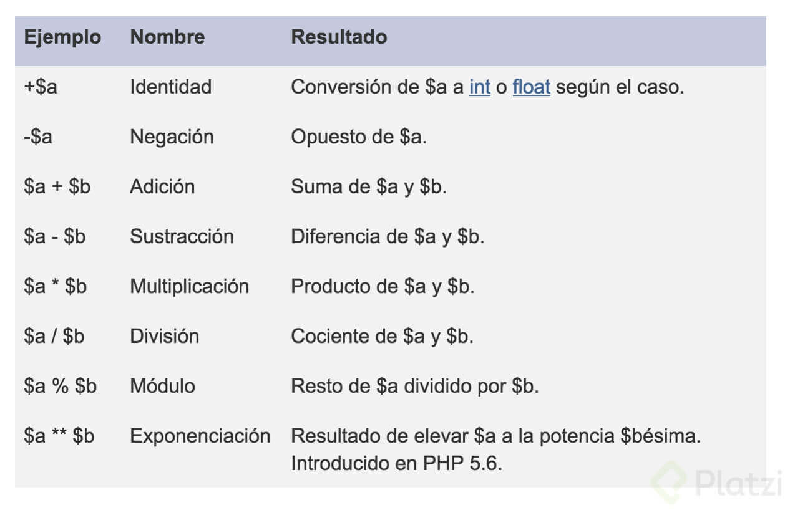
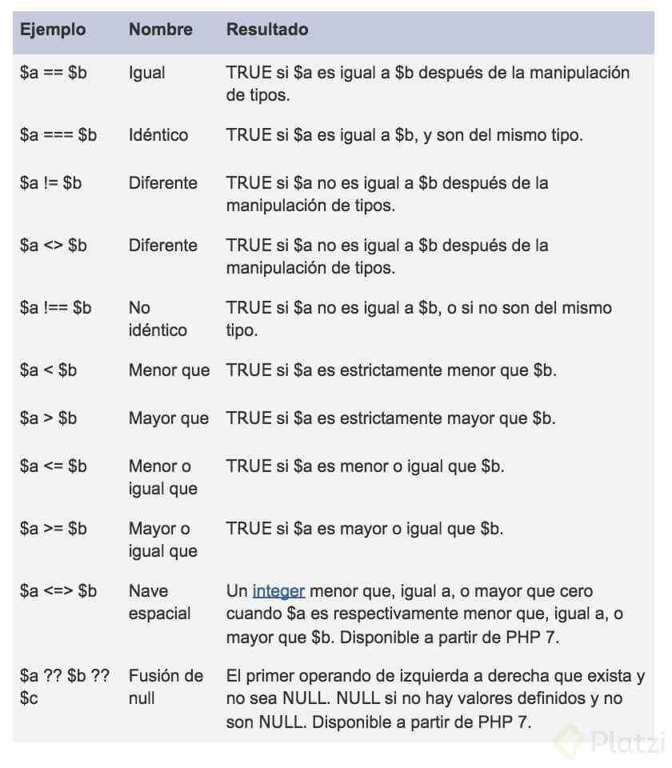
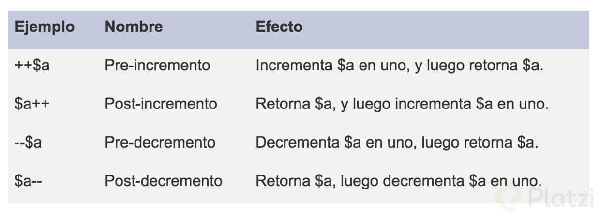
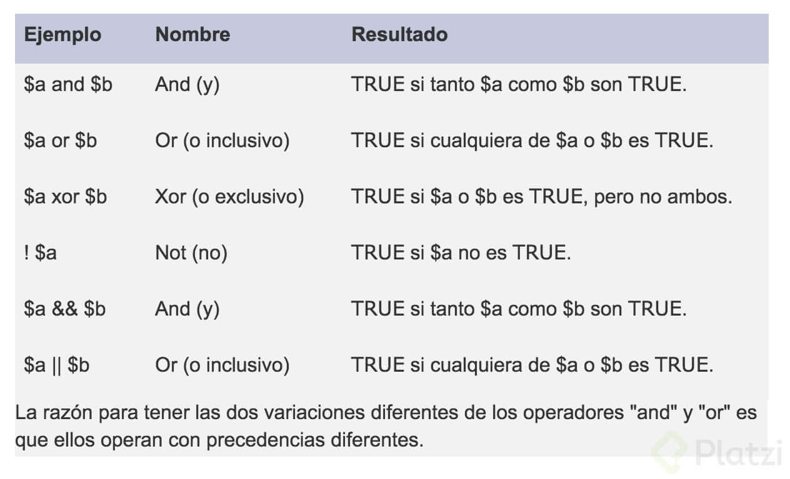
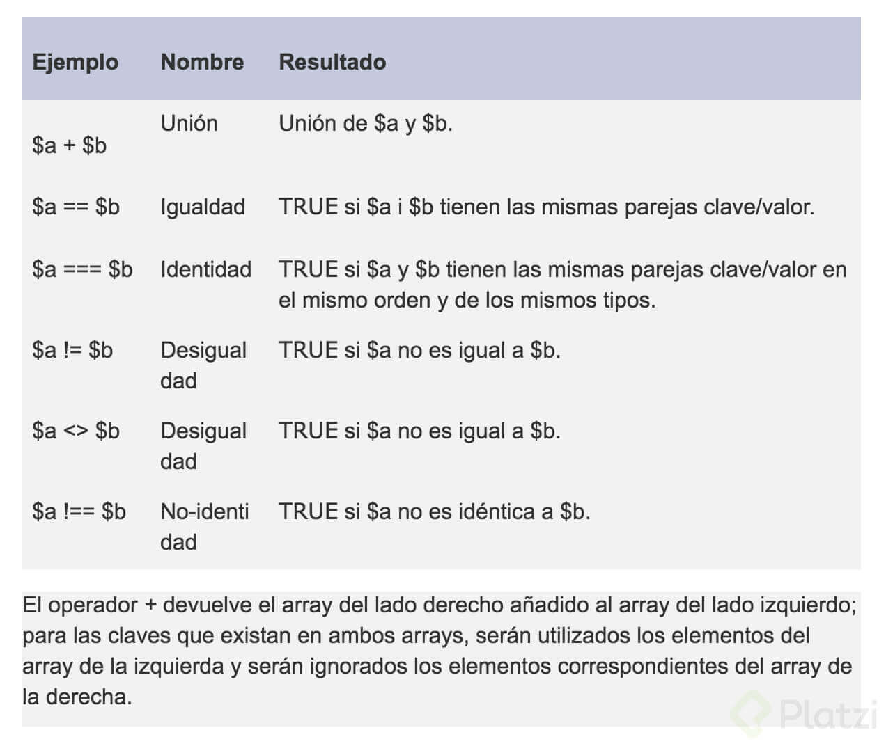

# Curso de Introducción a PHP<!-- omit in toc -->

## Tabla de Contenido<!-- omit in toc -->
- [¿Qué es PHP?](#qué-es-php)
- [XAMPP](#xampp)
- [Sintaxsis de PHP](#sintaxsis-de-php)
- [Variables](#variables)
- [Tipos de datos](#tipos-de-datos)
  - [Tipos escalares](#tipos-escalares)
    - [boolean](#boolean)
    - [Integer](#integer)
    - [float o double](#float-o-double)
    - [string](#string)
  - [Tipos compuestos](#tipos-compuestos)
    - [array](#array)
    - [object](#object)
    - [callable](#callable)
    - [iterable](#iterable)
  - [Tipos especiales](#tipos-especiales)
    - [resource](#resource)
    - [NULL](#null)
- [Arreglos](#arreglos)
- [Condicionales](#condicionales)
- [Ciclos](#ciclos)
  - [Do while](#do-while)
  - [While](#while)
  - [For](#for)
  - [Foreach](#foreach)
- [Operadores](#operadores)
  - [Operadores aritméticos](#operadores-aritméticos)
  - [Operadores de asignación](#operadores-de-asignación)
  - [Operadores de comparación](#operadores-de-comparación)
  - [Operadores de incremento/decremento](#operadores-de-incrementodecremento)
  - [Operadores lógicos](#operadores-lógicos)
  - [Operadores para strings](#operadores-para-strings)
  - [Operadores para arrays](#operadores-para-arrays)
- [Continue](#continue)
- [Break](#break)
- [Funciones](#funciones)
- [Agregando archivos externos](#agregando-archivos-externos)
- [Programación Orientada a Objetos](#programación-orientada-a-objetos)
  - [Constructor](#constructor)
  - [Herencia](#herencia)
- [Interfaces](#interfaces)
- [Namespaces](#namespaces)
- [PSR y PHPFIG](#psr-y-phpfig)
- [Composer](#composer)
- [Base de Datos](#base-de-datos)
- [ORM](#orm)
- [Formularios](#formularios)
- [Eloquent](#eloquent)
  - [Configurar Eloquent](#configurar-eloquent)
  - [Modelo de datos](#modelo-de-datos)
  - [Insertar un dato](#insertar-un-dato)
  - [Listar registros](#listar-registros)
- [Front Controller](#front-controller)
- [Request](#request)
- [Router](#router)
- [MVC](#mvc)
  - [Vistas](#vistas)
  - [Controladores](#controladores)
  - [Rutas](#rutas)
  - [Formularios](#formularios-1)
- [Template engines](#template-engines)
  - [Twig](#twig)
  - [Mostrar data dinámica](#mostrar-data-dinámica)
  - [Repetir código HTML (for)](#repetir-código-html-for)
  - [Layouts](#layouts)
- [Subida de Archivos](#subida-de-archivos)
  - [Tips de seguridad para subir archivos PHP](#tips-de-seguridad-para-subir-archivos-php)
- [Validaciones](#validaciones)
- [Autenticar Usuarios](#autenticar-usuarios)
- [Redirigir a otra página](#redirigir-a-otra-página)
- [Sesiones](#sesiones)
- [Restringir acceso a usuarios autenticados](#restringir-acceso-a-usuarios-autenticados)
- [Variables de Entorno](#variables-de-entorno)
- [Deploy](#deploy)
- [Enlaces de Interés](#enlaces-de-interés)

## ¿Qué es PHP?

PHP es un lenguaje de programación de propósito general de alto nivel que fue diseñado especialmente para el desarrollo de aplicaciones web.

* Es un lenguaje interpretado, necesitas un interprete de php en la pc para ejecutarlo.
* Es un lenguaje multiplataforma (Win, linux, MacOS).
* Es open source, el codigo fuente esta disponible!
* Tienes muchas integraciones.

**¿Qué NO es PHP?**

* No es un lenguaje compilado, por lo cual siempre tendrás que llevar juntos tu código y tu interprete.
* No esta diseñado para realizar aplicaciones de escritorio.
* Para trabajar con PHP instalaremos un entorno de desarrollo llamado XAMPP, no es un entorno pensado para producción.

<div align="right">
  <small><a href="#tabla-de-contenido">🡡 volver al inicio</a></small>
</div>

## XAMPP

Es un entorno para poder desarrollar en PHP.

* **X**: Cualquier sistema operativo.
* **A**: Apache
* **M**: MariaBD
* **P**: PHP/Perl

Para instalar XAMPP solo hay que ir a la [página de Apache](https://www.apachefriends.org) y descargar el instalador.

Al finalizar la instalación, abrir XAMPP e iniciar el servidor de Apache y MySQL.

Si al iniciar el servidor de Apache sale un error por que el **puerto está siendo usado**, se puede cambiar de la siguiente manera:
1. Click en Config de Apache.
2. Click en httpd.conf.
3. Cambiar Listen 80
4. Cambiar ServerName localhost:80

<div align="right">
  <small><a href="#tabla-de-contenido">🡡 volver al inicio</a></small>
</div>

## Sintaxsis de PHP

Siempre que usemos PHP usaremos lo siguiente: 

```php
<?php 
  echo 'hello PHP';
?>
``` 

Todo lo que pongamos dentro de esto será lo que el servidor va a interpretar como código php, lo que esté fuera lo ignorará.

Si queremos escribir código php en nuestra vista HTML tendremos que cambiarle la extensión al archivo por **.php** porque nuestro servidor esta configurado a solo interpretar archivos PHP. Solo las partes dentro de `<?php ?>` van a ser interpretadas y su código fuente no será visible desde el navegador.

Todas las sentencias de código se separarán con un `;` (punto y coma).

<div align="right">
  <small><a href="#tabla-de-contenido">🡡 volver al inicio</a></small>
</div>

## Variables

Una variable puede ser una pequeña cajita en la que puedes almacenar un valor y este lo pueden usar para realizar alguna operación.

Para declararla usaremos el símbolo de **$** y en seguida el nombre, este puede ser un _ o una letra.

```php
<?php 
  $number = 1;
  $name = 'Sergio';
?>
```

PHP **no es estáticamente tipado**, es decir que no tenemos que decirle qué tipo de dato es esa variable. Además, es débilmente tipado porque podemos fácilmente cambiar el tipo de dato, es decir PHP ejecuta una conversión de datos interna.

Al momento de trabajar con PHP una cosa muy importante es hacer debugging a nuestras variables, para ello utilizamos la función `var_dump();` pasándole por parámetro la variable a revisar.

```php
<?php
  $name = 'Sergio';
  var_dump($name)
?>
```

En PHP tenemos dos tipos de cadenas, las que son con **comillas simples** y las de **comillas dobles**. La diferencia entre estas dos cadenas es que la de comillas simples recibe de forma literal lo que le escribas mientras que la de comillas dobles intenta interpretar cualquier variable dentro de ella.


```php
<?php
  $name = 'Sergio';
  
  //Comillas Dobles
  $hello = "Hola $name";

  //Comillas Simples
  $hello2 = 'Hola ' . $name;
?>
```

<div align="right">
  <small><a href="#tabla-de-contenido">🡡 volver al inicio</a></small>
</div>

## Tipos de datos

PHP cuenta con muchos tipos de datos, sin embargo, en este momento nos vamos a enfocar en los más importantes y utilizados que son boolean, integer, float, string, array y NULL.

<div align="right">
  <small><a href="#tabla-de-contenido">🡡 volver al inicio</a></small>
</div>

### Tipos escalares

#### boolean

Representa solamente un valor verdadero o falso. 

Si quieres conocer más de este tipo de dato da click [aquí](http://php.net/manual/es/language.types.boolean.php)

**Valores válidos**: true (verdadero) false (falso)

```php
<?php
  $a = true; 
  $b = false; 
?>
```

<div align="right">
  <small><a href="#tabla-de-contenido">🡡 volver al inicio</a></small>
</div>

#### Integer

Representa un número entero positivo, negativo o 0. 

Si quieres conocer más de este tipo de dato da click [aquí](http://php.net/manual/es/language.types.integer.php)

```php
<?php
  $a = -123;
  $b = 0;
  $c = 7763;
?>
```

<div align="right">
  <small><a href="#tabla-de-contenido">🡡 volver al inicio</a></small>
</div>

#### float o double

Representa un número de punto flotante, existen problemas de precisión con los números flotantes debido a la naturaleza binaria de las computadoras.

Si quieres conocer más de este tipo de dato da click [aquí](http://php.net/manual/es/language.types.float.php)

```php
<?php
  $a = 12.24; 
  $b = 1.5e3; 
  $c = 7E-10;
?> 
```

<div align="right">
  <small><a href="#tabla-de-contenido">🡡 volver al inicio</a></small>
</div>

#### string

* Representa una cadena de caracteres.
* Existen 4 formas de representar una cadena. 
 
Las 2 principales son usando comillas simples o comillas dobles.
1. Usando comillas simples donde el texto será exactamente como se escribe.
2. Usando comillas dobles permite usar caracteres de escape y además expanden los nombres de las variables, es decir sustituye el valor de las variables dentro de las cadenas.

Hay 2 formas adicionales llamadas **Heredoc** y **Nowdoc** que sirven para crear cadenas de múltiples líneas.

Si quieres conocer más de este tipo de dato da click [aquí](http://php.net/manual/es/language.types.string.php#language.types.string.details).

```php
<?php
  $a = "Hola"; 
  $b = 'Mundo'; 
?>
```

<div align="right">
  <small><a href="#tabla-de-contenido">🡡 volver al inicio</a></small>
</div>

### Tipos compuestos

#### array

Representa una colección de valores, aunque por defecto PHP usara índices numéricos, la realidad es que la estructura se representa como un mapa que colecciona pares llave-valor. La sintaxis para definir un arreglo será a partir de corchetes cuadrados, aunque en versiones anteriores de PHP era necesario usar la función array(). Las llaves pueden ser enteros o cadenas y los valores pueden ser de cualquier tipo de PHP, incluso de tipo array. 

Si quieres conocer más de este tipo de dato da click [aquí](http://php.net/manual/es/language.types.array.php)

```php
<?php
  $array = array(
    "curso1" => "php",
    "curso2" => "js",
  );

  // a partir de PHP 5.4
  $array = [
    "curso1" => "php",
    "curso2" => "js",
  ];

  // índices numéricos
  $array = [
    "php",
    "js",
  ];
?>
```

<div align="right">
  <small><a href="#tabla-de-contenido">🡡 volver al inicio</a></small>
</div>

#### object

Representa una instancia de una clase. Este tema lo veremos más a fondo en la clase de Programación Orientada a Objetos.

```php
<?php
  class Car
  {
    function move()
    {
      echo "Going forward..."; 
    }
  }

  $myCar = new Car();
  $myCar->move();
?>
```

<div align="right">
  <small><a href="#tabla-de-contenido">🡡 volver al inicio</a></small>
</div>

#### callable

Es un tipo de dato especial que representa a algo que puede ser “llamado”, por ejemplo una función o un método.

```php
<?php
  // Variable que guarda un callable
  $firstOfArray = function(array $array) {
    if (count($array) == 0) { return null; }
    return $array[0];
  };

  // Este es nuestro arreglo
  $values = [3, 2, 1];

  // Usamos nuestro callable y se imprime el valor 3
  echo $firstOfArray($values);
?>
```

<div align="right">
  <small><a href="#tabla-de-contenido">🡡 volver al inicio</a></small>
</div>

#### iterable

A partir de PHP 7.1 iterable es un pseudo tipo de datos que puede ser recorrido.

```php
<?php
  function foo(iterable $iterable) {
    foreach ($iterable as $valor) {
      // ...
    } 
  }
?>
```

<div align="right">
  <small><a href="#tabla-de-contenido">🡡 volver al inicio</a></small>
</div>

### Tipos especiales

#### resource

Es un tipo de dato especial que representa un recurso externo, por ejemplo un archivo externo a tu aplicación.

```php
<?php
  $res = fopen("c:\\dir\\file.txt", "r");
?>
```

<div align="right">
  <small><a href="#tabla-de-contenido">🡡 volver al inicio</a></small>
</div>

#### NULL

Es un valor especial que se usa para representar una variable sin valor. 

Si quieres conocer más de este tipo de dato da click [aquí](http://php.net/manual/es/language.types.null.php)

```php
<?php
  $a = null; 
?>
```

<div align="right">
  <small><a href="#tabla-de-contenido">🡡 volver al inicio</a></small>
</div>

## Arreglos

Las variables que almacenan más de un dato se conocen como arreglos y su sintaxis se va a indicar con [ ] (corchetes).

```php
<?php
  $jobs = [
    'PHP Dev',
    'Python Dev'.
    'Devops'
  ];
?>
```

PHP utiliza índices para localizar a los elementos dentro de la variable. Los índices empiezan de cero.

```php
<?php
  echo $jobs[0];
  // imprime PHP Dev
?>
```

La estructura de arreglos en PHP es conocida como mapa, lo que quiere decir que tiene una composición de llave valor. Además, un arreglo puede contener más arreglos y cada uno de ellos seguirá la misma estructura.

```php
<?php
  $jobs = [
    [
      'title' => 'PHP Dev',
    ],
    [
      'title' => 'Python Dev'.
    ],
    [
      'title' => 'Devops'
    ]
  ];

  // imprime PHP Dev
  echo $jobs[0]['title'];
?>
```

Algo que debes saber es que en PHP podrás almacenar diferentes tipos de datos en un mismo arreglo.

<div align="right">
  <small><a href="#tabla-de-contenido">🡡 volver al inicio</a></small>
</div>

## Condicionales

Las condiciones nos permiten tomar decisiones en el código, si se cumple la condición entonces se ejecutarán ciertas instrucciones sino se cumple se ejecutarán otras. Estas se denotan por la instrucción **if else**.

```php
$var1 = 1;

if($var1 > 0) {
  echo 'es mayor que 2';
} 
else {
  echo 'no es mayor que 2';
}
```

<div align="right">
  <small><a href="#tabla-de-contenido">🡡 volver al inicio</a></small>
</div>

## Ciclos

Los ciclos o bucles son de total importancia cuando desarrollamos software pues nos permiten repetir un bloque de acciones y en consecuencia re-utilizar mejor nuestro código.

<div align="right">
  <small><a href="#tabla-de-contenido">🡡 volver al inicio</a></small>
</div>

### Do while

```php
$idx = 0;
do {
  echo $idx;
  $idx++;
} while($idx < 3);
```

El ciclo do while garantiza que el código interno se ejecutará al menos 1 vez.

<div align="right">
  <small><a href="#tabla-de-contenido">🡡 volver al inicio</a></small>
</div>

 ### While

 ```php
 $idx = 0;
 while ($idx < 3) {
  echo $idx;
  $idx++;
}
 ```

En el ciclo while si la condición es falsa desde un inicio, es posible que el ciclo nunca se ejecute.

<div align="right">
  <small><a href="#tabla-de-contenido">🡡 volver al inicio</a></small>
</div>

### For

```php
for($idx = 0; $idx < 3; $idx++) {
  echo $idx;
}
```

<div align="right">
  <small><a href="#tabla-de-contenido">🡡 volver al inicio</a></small>
</div>

### Foreach

El ciclo foreach nos brinda una solución simple para iterar sobre los valores de un arreglo, la sintaxis es la siguiente:

```php
$array = ['uno', 'dos', 'tres']
foreach ($array as $valor) {
  echo $valor;
}
```

En esta sintaxis nos encontramos con 4 partes:
* La palabra reservada foreach simplemente indica el inicio de nuestro bloque.
* Dentro de paréntesis se escribe el nombre del arreglo que vamos a estar iterando, este arreglo debe estar definido previamente, en este ejemplo es $arreglo.
* La palabra "as" seguido de un nombre de variable que usaremos para acceder al elemento del arreglo que estamos accediendo, esta variable no debe existir previamente y solo la podrán usar dentro de este bloque. En el ejemplo es $valor.
* Entre llaves "{ }" están todas las acciones que queremos repetir, en el momento en que se ejecute el ciclo la variable que definimos para iterar (en el ejemplo $valor) ya existe y podrá ser usada en esta sección, piensa que el valor de esta variable estará cambiando en cada iteración.

Suponiendo que en el ejemplo anterior, el ciclo se repetirá 3 veces y en cada iteración la variable $valor contendrá el elemento del arreglo correspondiente, es decir, en la primera iteración $valor será igual a ‘uno’, en la segunda $valor será igual a ‘dos’ y en la tercera $valor será igual a ‘tres’.

Existe una sintaxis alternativa que nos permite no solo conocer el valor, también nos permitirá conocer la llave, de este modo tendremos acceso tanto a la llave como al valor del elemento del arreglo:

```php
foreach ($array as $llave => $valor) {
  //sentencias que pueden usar $llave y $valor
}
```

<div align="right">
  <small><a href="#tabla-de-contenido">🡡 volver al inicio</a></small>
</div>

## Operadores

### Operadores aritméticos

Funcionan para realizar operaciones aritméticas.

<div align="center">
  
  <small><p>Operadores Aritméticos</p></small>
</div>

<div align="right">
  <small><a href="#tabla-de-contenido">🡡 volver al inicio</a></small>
</div>

### Operadores de asignación

El operador principal de asignación es el símbolo = (igual). Es importante tener en cuenta que este operador no sirve para comparar, normalmente del lado izquierdo del operador tendremos una variable, y este operador sirve para asignar el resultado de lo que se encuentre a la derecha a dicha variable.

```php
$variable = 5;
```

Lo que tenemos en la derecha puede ser un valor, otra variable, o el resultado de una operación o función.

También existen otros operadores de asignación que se combinan con operadores aritméticos o para strings y nos permiten simplificar algunas sentencias dentro de PHP. Estos son ejemplos de cómo funcionan:

```php
$a += $b
$a = $a + $b

$a -= $b
$a = $a - $b

$a *= $b
$a = $a * $b

$a /= $b
$a = $a / $b

$a %= $b
$a = $a % $b

$a .= $b
$a = $a . $b
```

<div align="right">
  <small><a href="#tabla-de-contenido">🡡 volver al inicio</a></small>
</div>

### Operadores de comparación

Nos permiten comparar valores.

<div align="center">
  
  <small><p>Operadores de Comparación</p></small>
</div>

<div align="right">
  <small><a href="#tabla-de-contenido">🡡 volver al inicio</a></small>
</div>

### Operadores de incremento/decremento

Permiten incrementar o decrementar un valor en 1.

<div align="center">
  
  <small><p>Operadores de Incremento / Decremento</p></small>
</div>

Es muy importante entender cómo afecta el lugar donde se establece el operador, ejemplo:

```php
$a = 1;
echo $a++;
echo $a;
echo ++$a;
echo $a;
```

imprime:

```
1
2
3
3
```

<div align="right">
  <small><a href="#tabla-de-contenido">🡡 volver al inicio</a></small>
</div>

### Operadores lógicos

Nos permiten combinar resultados de comparaciones.

<div align="center">
  
  <small><p>Operadores Lógicos</p></small>
</div>

<div align="right">
  <small><a href="#tabla-de-contenido">🡡 volver al inicio</a></small>
</div>

### Operadores para strings

Existen 2 operadores para strings el . (punto) que nos permite concatenar cadenas, y el .= que ya fue visto anteriormente y nos permite simplificar la sintaxis de concatenar algo a una misma cadena, ejemplo:

```php
$var1 = ‘Hola ’ . ‘ php’;
$var1 .= ‘!!!’;
echo $var1;
```

imprime

```
Hola php!!!
```

<div align="right">
  <small><a href="#tabla-de-contenido">🡡 volver al inicio</a></small>
</div>

### Operadores para arrays

<div align="center">
  
  <small><p>Operadores Arrays</p></small>
</div>

<div align="right">
  <small><a href="#tabla-de-contenido">🡡 volver al inicio</a></small>
</div>

## Continue

La sentencia `continue`hará que se itere a la siguiente línea del arreglo. 

```php
for($idx = 0; $idx < 10; $idx++) {
  if($continuar) {
    continue;
  }
}
```

Si se ejecuta **continue**, entonces se pasa a la siguiente iteración del for.

Y la sentencia break que hará que el ciclo se termine.

<div align="right">
  <small><a href="#tabla-de-contenido">🡡 volver al inicio</a></small>
</div>

## Break

La sentencia **break** hace que el ciclo se termine.

```php
for($idx = 0; $idx < 10; $idx++) {
  if($saltar) {
    break;
  }
}
```

Si se actiba el break, entonces se termina el ciclo for.

<div align="right">
  <small><a href="#tabla-de-contenido">🡡 volver al inicio</a></small>
</div>

## Funciones

Las funciones en PHP se denotan por la palabra reservada function seguida por el nombre de la **función**, las funciones nos servirán para llamar y reutilizar código en nuestros proyectos.

Cuando trabajemos con funciones es muy importante cuidar el scope (alcance) de las variables pues, algunas podrían entrar en su scope y otras no.

Las funciones en PHP pueden o no regresar un dato particular. Si deseamos hacerlo podemos indicarlo con la palabra reservada **return**.

```php
function printJob() {
  //Contenido de la función
}
```

<div align="right">
  <small><a href="#tabla-de-contenido">🡡 volver al inicio</a></small>
</div>

## Agregando archivos externos

Podemos usar archivos de la siguiente manera:

**1. include**

Include hace que un archivo externo se agregue dentro del archivo que estamos usando.

```php
include('jobs.php');
```

Si el archivo no se encuentra, entonces mostrará un warnning.

**2. require**

A diferencia de include, require muestra un error si no encuentra en archivo.

```php
require('jobs.php');
```

**3. include_once**

Es como include, pero solo agrega el archivo una sola vez independiente de las veces que se agregue.

```php
include_once('jobs.php');
```

**3. require_once**

Es como require, pero solo agrega el archivo una sola vez independiente de las veces que se agregue.

```php
require_once('jobs.php');
```

<div align="right">
  <small><a href="#tabla-de-contenido">🡡 volver al inicio</a></small>
</div>

## Programación Orientada a Objetos

La programación orientada a objetos nos ayudará a estructurar mejor nuestros programas. PHP, a partir de su versión 5, tiene implementaciones orientadas a objetos, lo que lo hace tener código más reutilizable y mantenible.

Una clase es una plantilla o definición de algo. Y una instancia es la representación concreta de la clase.

Encapsulamiento será el nivel de visibilidad que queramos darle a alguna variable, para ello podemos utilizar los modificadores de acceso **private**, **public** y **protected**.

* Public: Todos pueden tener acceso.
* Private: El acceso es solo dentro de la clase.
* Protected: El acceso es solo dentro de la clase y los que heredan de la clase.

Con la palabra reservada **this** estaremos haciendo referencia a la variable que pertenece a la clase.

```php
class Job {
  private $title;
  public $description;
  public $visible;
  public $months;

  public function setTitle($title) {
    $this->title = $title;
  }

  public function getTitle() {
    return $this->title;
  }
}
```

Para instanciar una clase se haría de la siguiente manera:

```php
$job1 = new Job();
$job1->setTitle('PHP Developer');
$job1->description = 'This is an awesome job';
$job1->visible = true;
$job1->months = 16;
```

<div align="right">
  <small><a href="#tabla-de-contenido">🡡 volver al inicio</a></small>
</div>

### Constructor

El método constructor es una clase que se llama al instanciar una clase. 

```php
class Job {
  private $title;
  public $description;

  public function __construct($title, $description) {
    $this->setTitle($title);
    $this->description = $description;
  }
}

$job = new Job('título', 'descripcion');
```

<div align="right">
  <small><a href="#tabla-de-contenido">🡡 volver al inicio</a></small>
</div>

### Herencia

La herencia permite que ciertas clases tengan características de una clase padre. Esta clase se llamará hijo.

Es muy conveniente utilizar **require_once** cuando queremos utilizar herencia e incluir clases que están en otros archivos.

```php
//BaseElement.php
class BaseElement {
  private $title;
  public $description;
  public $visible = true;
  public $months;
}
```

De este modo se declare una clase hijo.

```php
//Job.php
require_once('BaseElement.php');

class Job extends BaseElement {
}
```

La herencia en PHP será de forma sencilla es decir solo que podrá hacer herencia de una sola clase.

Dentro de nuestra clase hijo podemos sobrescribir algún método del padre, esto es un concepto que conocemos como **polimorfismo**. Lo que polimorfismo quiere decir es que tendremos un método que va a funcionar de acuerdo con su contexto donde es llamado.

```php
class BaseElement {
  public function getText() {
    return  "Text";
  }
}

class Job extends BaseElement {
  public function getText() {
    return  "Text from jobs";
  }
}
```

De este modo, cuando se instancie un objeto con la clase Job y se llame al método getText(), entonces se usa el método de la clase Job.

Si se desea acceder al constructor del padre desde la clase hijo, se puede hacer de la aiguiente forma:

```php
public function __construct($title, $description) {
  parent::__construct($newTitle, $description);
}
```

<div align="right">
  <small><a href="#tabla-de-contenido">🡡 volver al inicio</a></small>
</div>

## Interfaces

Las interfaces se pueden ver como un contrato o un acuerdo en el que se pueden estandarizar ciertas cosas.

La palabra reservada que utilizaremos para declarar una interfaz será **interface**. Y la que nos indicará que estamos usando una interfaz en una clase será **implements**.

```php
interface Printable {
  public function getDescription();
}
```

Para usar la interface, se ha de la siguiente forma:

```php
require_once('Printable.php');

class BaseElement implements Printable {
  public function getDescription() {
    return $this->description;
  }
}
```

Usando **Type Hinting** estableceremos el tipo de dato que esperamos ya sea una clase o un tipo de dato específico.

```php
function printDescription(Printable $job) {
  echo $job->getDescription();
}
```

En el caso de las interfaces, sí podemos implementar varias al mismo tiempo.

<div align="right">
  <small><a href="#tabla-de-contenido">🡡 volver al inicio</a></small>
</div>

## Namespaces

Esta es una forma de mantener únicos los nombres de los archivos en el mismo directorio.

Esto nos permite tener mejor organizado el proyecto.

Para declarar un espacio de nombres privado se utiliza la palabra reservada **namespace**.

```php
namespace App\Models;

class Project {

}
```

Un standard es usar namespaces conforme a la estructura de carpetas en la que se encuentran los archivos.

Para usar un archivo de otro namespace, se puede hacer de la siguiente forma:

```php
use App\Models\Job;
use App\Models\Project;
use App\Models\Printable;

//A partir de php7 
use App\Models\{Job, Project, Printable};
```

Otra forma de hacerlo es al siguiente:

```php
$project = new Lib\Project();
```

<div align="right">
  <small><a href="#tabla-de-contenido">🡡 volver al inicio</a></small>
</div>

## PSR y PHPFIG

Varios programadores se unieron para crear un grupo llamado [PHP-FIG](https://www.php-fig.org/) con el objetivo de avanzar en la interoperabilidad de librerías en PHP.

Este grupo creo el [PSR](https://www.php-fig.org/psr/) que son recomendaciones y estándares para tu código de PHP.

<div align="right">
  <small><a href="#tabla-de-contenido">🡡 volver al inicio</a></small>
</div>

## Composer

[Composer](https://getcomposer.org/) es un manejador de dependencias de PHP que no solo nos ayudara a traer librerías de tercero al proyecto, sino que además va a implementar el estándar PSR4 que nos va a permitir tener el cargado de archivos automático.

[composer.phar](https://getcomposer.org/composer.phar) será un documento que nos servirá para manejar las dependencias en PHP, esta va muy de la mano con otro archivo llamado composer.json.

El composer.phar se va a descargar y pegar en el directorio del proyecto mientras que composer.json sigue la siguiente estructura: 

```json
{
  "autoload": {
    "psr-4": {
      "App\\": "app/"
    }
  },
  "require": {}
}
```

Dentro de psr-4 se van a agregar los namespaces que se van a manejar dentro de la aplicación.

Luego de tener los dos archivos, ir al directorio del proyecto en la terminal y escribir:

```bash
$ php composer.phar install
```

Al hacer esto se va a crear una carpeta vendor. En esta carpeta se van a agregar los namespaces definidos en composer.json.

Luego de hacer esto, hay que hacer un require_once al archivo **vendor/autoload.php** y con esto ya se va a activar el autoload.

```php
require_once('vendor/autoload.php');
```

Esta funcionalidad va a ser que ya no sea necesario hacer un require de los archivos que se encuentren en los namespaces definidos en composer.json.

<div align="right">
  <small><a href="#tabla-de-contenido">🡡 volver al inicio</a></small>
</div>

## Base de Datos

Las bases de datos son colecciones de datos que podemos usar para consultarla almacenarla, ejecutar filtros, etc.

Cuando hablamos de aplicaciones web trabajaremos con sistemas manejadores de bases de datos, o también conocidos como bases de datos relacionales.

XAMPP viene con una herramienta llamada phpMyAdmin que es un cliente el cual se conecta a una base de datos, en este caso se conecta a MariaDB.

<div align="right">
  <small><a href="#tabla-de-contenido">🡡 volver al inicio</a></small>
</div>

## ORM

Un ORM, que significa Object Relational Mapping, es un concepto en el cual vamos a crear dentro de nuestro código algunos modelos basados en las tablas de nuestra base de datos.

Una principal característica de un ORM es que hace más transparente las conexiones a PostgreSQL y MySQL, además nos protege de algunas vulnerabilidades de SQL y facilita algunas validaciones a la información.

<div align="right">
  <small><a href="#tabla-de-contenido">🡡 volver al inicio</a></small>
</div>

## Formularios

Podemos enviar información desde un formulario a través de diferentes métodos, GET o POST. Para acceder a esta información desde PHP llamaremos a **$_GET** y **$_POST**, estas son variables super globales.

```php
<?php 
  //Muestra los datos enviados si el método del formularios es GET
  var_dump($_GET);
  //Muestra los datos enviados si el método del formularios es POST
  var_dump($_POST);
?>

<form action="index.php" method="post">
  <input type="text" name="title">
  <input type="text" name="description">
  <br/>
  <button type="submit">Save</button>
</form>
```

<div align="right">
  <small><a href="#tabla-de-contenido">🡡 volver al inicio</a></small>
</div>

## Eloquent

[Packagist](https://packagist.org/) es un sitio donde encontraras múltiples librerías de terceros que puedes integrar a tus proyectos mediante composer, de aquí añadiremos nuestra herramienta para la conexión a base de datos.

Realizamos la conexión con la base de datos y usaremos [Eloquent](https://packagist.org/packages/illuminate/database) como nuestro ORM. Para que funcionen los modelos debemos hacer una clase que herede de Model.

Para instalar Eloquent se va a usar el siguiente comando:

```bash
$ php composer.phar require illuminate/database
```

Este comando agrega illuminate/database a la lista de require del composer.json.

Asimismo, se crea un arechivo **composer.lock** en donde se almacenan todas las dependencias de illuminate/database.

Una vez estén listos los modelos, usando la variable super global $_POST conectaremos la información del formulario con nuestro modelo para añadirla información a la base de datos.

<div align="right">
  <small><a href="#tabla-de-contenido">🡡 volver al inicio</a></small>
</div>

### Configurar Eloquent

Para configurar la conexión a la base de datos, se va a hacer de la siguiente forma:

```php
use Illuminate\Database\Capsule\Manager as Capsule;

$capsule = new Capsule;

$capsule->addConnection([
  'driver'    => 'mysql',
  'host'      => 'localhost',
  'database'  => 'cursophp',
  'username'  => 'root',
  'password'  => 'root',
  'charset'   => 'utf8',
  'collation' => 'utf8_unicode_ci',
  'prefix'    => '',
]);

$capsule->setAsGlobal();
$capsule->bootEloquent();
```

<div align="right">
  <small><a href="#tabla-de-contenido">🡡 volver al inicio</a></small>
</div>

### Modelo de datos

Para conectar una clase con una tabla de base de datos, se debe de hacer 2 cosas:
* Un use a Illuminate\Database\Eloquent\Model.
* Setear la variable $table con el nombre de la tabla de base de datos.

```php
use Illuminate\Database\Eloquent\Model;

class Job extends Model {
  protected $table = 'jobs';
}
```

<div align="right">
  <small><a href="#tabla-de-contenido">🡡 volver al inicio</a></small>
</div>

### Insertar un dato

El siguiente es un ejemplo de cómo agregar datos en una base de datos.

```php
$job = new Job();
$job->title = $_POST['title'];
$job->description = $_POST['description'];
$job->save();
```

<div align="right">
  <small><a href="#tabla-de-contenido">🡡 volver al inicio</a></small>
</div>

### Listar registros

```php
$jobs = Job::all();
```

<div align="right">
  <small><a href="#tabla-de-contenido">🡡 volver al inicio</a></small>
</div>

## Front Controller

Front Controller es un patrón de diseño que nos dará una solución a la redundancia del código en las múltiples entradas a la aplicación. Este tendrá el control de todas las entradas además de las inicializaciones de base de datos etc.

El front controller se pondrá en el archivo public/index.php.

En este archivo se pondrán todas las funcionalidades que necesitan todos los archivos de php:
* Control de errores
* Autoloader
* Acceso a la base de datos

Al final del front controller, se va a hacer un require de la página a mostrar en base el router.

```php
$route = $_GET['route'] ?? '/';

if($route == '/')
  require('../index.php');
elseif ($route == 'addJob')
  require('../addJob.php');
```

<div align="right">
  <small><a href="#tabla-de-contenido">🡡 volver al inicio</a></small>
</div>

## Request

PSR7 es un estandar que nos permite normalizar un request y un response en PHP.

En este enlace encontrarás la documentación de PSR7: https://www.php-fig.org/psr/psr-7/

Aquí encontrarás cómo implementarlo: https://zendframework.github.io/zend-diactoros/usage/

Los request se van a manejar con una librería llamada diactoros.

```bash
$ php composer.phar require zendframework/zend-diactoros
```

Luego de esto, se va a agregar la siguiente línea de código:

```php
$request = Zend\Diactoros\ServerRequestFactory::fromGlobals(
  $_SERVER,
  $_GET,
  $_POST,
  $_COOKIE,
  $_FILES
);
```

Luego de esto, para manejar los request, se va a crear un archivo **.htaccess** en la raiz del proyecto.

```
RewriteEngine On
# Evitar ciclos
RewriteCond %{THE_REQUEST} /platziphp/public/([^\s?]*) [NC]
RewriteRule ^ %1 [L,NE,R=302]
RewriteRule ^((?!platziphp/public/).*)$ platziphp/public/$1 [L,NC]
```

Asimismo, se va a escribir otro archivo **.htaccess** en la carpeta public.

```
RewriteEngine On
#Verificar si es directorio
RewriteCond %{REQUEST_FILENAME} !-d
RewriteCond %{REQUEST_FILENAME} !-f
RewriteRule ^ index.php [QSA,L]
```

<div align="right">
  <small><a href="#tabla-de-contenido">🡡 volver al inicio</a></small>
</div>

## Router

[aura/router](https://github.com/auraphp/Aura.Router/blob/HEAD/docs/index.md) es un paquete que nos ayudará para manejar las rutas en nuestro proyecto.

Para instalarlo solo hay que escribir el siguiente comando en la terminal:

```bash
$ php composer.phar require aura/router
```

Luego de eso escribir las siguientes líneas de código:

```php
$routerContainer = new RouterContainer();

//Setear las rutas
$map = $routerContainer->getMap();
$map->get('index', '/', '../index.php');
$map->get('addJobs', '/jobs/add', '../addJob.php');

$matcher = $routerContainer->getMatcher();
$route = $matcher->match($request);
if (!$route) {
  echo 'No route';
} else {
  require $route->handler;
}
```

<div align="right">
  <small><a href="#tabla-de-contenido">🡡 volver al inicio</a></small>
</div>

## MVC

MVC es un patrón de diseño que divide nuestra aplicación en tres partes fundamentales:

* Model
* View
* Controller

Un proyecto en MVC se organiza en carpetas con estos nombres.

<div align="right">
  <small><a href="#tabla-de-contenido">🡡 volver al inicio</a></small>
</div>

### Vistas

En las vistas se encuentra el código HTML. La vista debe de encontrarse sin nungún tipo de lógica de negocio.

<div align="right">
  <small><a href="#tabla-de-contenido">🡡 volver al inicio</a></small>
</div>

### Controladores

Los controladores unen el modelo con las vistas.

```php
use App\Models\Job;

class IndexController {
  public function indexAction() {
    $jobs = Job::all();
    include '../views/index.php';
  }
}
```

<div align="right">
  <small><a href="#tabla-de-contenido">🡡 volver al inicio</a></small>
</div>

### Rutas

En MVC, se va a cambiar un poco la forma en la cual se usan las rutas. Ahora las rutas, en vez de redirigir a un archivo, van a redirigir a una acción dentro de un controlador.

```php
$routerContainer = new RouterContainer();
$map = $routerContainer->getMap();

$map->get('index', '/', [
  'controller' => 'App\Controllers\IndexController',
  'action' => 'indexAction'
]);

$map->post('saveJobs', '/jobs/add', [
  'controller' => 'App\Controllers\JobsController',
  'action' => 'getAddJobAction'
]);

$matcher = $routerContainer->getMatcher();
$route = $matcher->match($request);

if (!$route) {
    echo 'No route';
} else {
  $handlerData = $route->handler;
  $controllerName = $handlerData['controller'];
  $actionName = $handlerData['action'];

  $controller = new $controllerName;
  $controller->$actionName($request);
}
```

<div align="right">
  <small><a href="#tabla-de-contenido">🡡 volver al inicio</a></small>
</div>

### Formularios

```php
class JobsController {
  public function getAddJobAction($request) {
    if(!empty($request->getMethod() == 'POST')) {
      $postData = $request->getParsedBody();
      $job = new Job();
      $job->title = $postData['title'];
      $job->description = $postData['description'];
      $job->save();
    }

    include('../views/addJob.php');
  }
}
```

<div align="right">
  <small><a href="#tabla-de-contenido">🡡 volver al inicio</a></small>
</div>

## Template engines

Son motores que sirven para renderear el código html y sustituir las partes de código con los datos que se tienen que imprimir.

PHP, a pesar de que fue pensado para ser un template engine, se ha enfocado más en la programación, por eso tenemos librerías que se concentran totalmente en esto.

<div align="right">
  <small><a href="#tabla-de-contenido">🡡 volver al inicio</a></small>
</div>

### Twig

[Twig](https://twig.symfony.com/) es un Template Engine que nos ayudará a manejar la seguridad en los elementos de entrada de la aplicación.

Para instalar Twig, se hace de la siguiente forma:

```bash
$ php composer.phar require twig/twig
```

Para poder cargar los templates, se va a crear un controlador base:

```php
namespace App\Controllers;

class BaseController {
  protected $templateEngine;

  public function __construct() {
    //declarar la carpeta en donde se encuentran los templates
    $loader = new \Twig_Loader_Filesystem('../views');
    $this->templateEngine = new \Twig_Environment($loader, array(
      'debug' => true,
      'cache' => false,
    ));
  }

  public function renderHTML($fileName, $data = []) {
    return new HtmlResponse($this->templateEngine->render($fileName, $data));
  }
} 
```

Luego, para cargar una plantilla, se hace de la siguiente forma:

```php
class IndexController extends BaseController{
  public function indexAction() {
    return $this->renderHTML('index.twig');
  }
}
```

Además, cabe resaltar que la plantilla a cargar debe de tener la extensión **.twig**.

<div align="right">
  <small><a href="#tabla-de-contenido">🡡 volver al inicio</a></small>
</div>

### Mostrar data dinámica

Twig no permite código PHP en sus plantillas. Para agregar data dinamica, se va a usar `{{ }}`.

```html
<h1>{{ name }}</h1>
```

Luego, el valor de las variables se pasan desde el controlador:

```php
class IndexController extends BaseController {
  public function indexAction() {
    $jobs = Job::all();
    return $this->renderHTML('index.twig', [
      'name' => 'Sergio'
    ]);
  }
}
```

<div align="right">
  <small><a href="#tabla-de-contenido">🡡 volver al inicio</a></small>
</div>

### Repetir código HTML (for)

Se va a usar `` para declarar cuándp una parte del código HTML se va a reperir.

```twig

  <h5>{{ job.title }}</h5>

```

<div align="right">
  <small><a href="#tabla-de-contenido">🡡 volver al inicio</a></small>
</div>

### Layouts

Al declarar un layout, se va a usar `` para indicar en qué parte del layout se va a mostrar el contenido de los HTML hijos.

```twig
<!doctype html>
<html lang="en">
<head>
  <title>Resume</title>
</head>

<body>
  <div class="container">
    
    
  </div>
</body>
</html>
```

Para usar el layout, se tiene que hacer lo siguiente:
* Declarar el layout con usando `extends`.
* Indicar el código HTML sue se va a mostrar con `block content`.

```twig



  <p>Estoy usando un layout</p>

```

<div align="right">
  <small><a href="#tabla-de-contenido">🡡 volver al inicio</a></small>
</div>

## Subida de Archivos

Para poder subir archivo, se debe de agregar `enctype="multipart/form-data"` en el formulario.

```html
<form action="/jobs/add" method="post" enctype="multipart/form-data">
  <input type="file" name="logo">
  <button type="submit">Save</button>
</form>
```

Luego, en el controlador, agregar las siguientes líneas de código:

```php
public function uploadFile($request) {
  //Obtiene los archivos que se han subido
  $files = $request->getUploadedFiles();
  $logo = $files['logo'];

  //Verifica que no hayan errores
  if($logo->getError() == UPLOAD_ERR_OK) {
    //Obtiene el nombre del archivo
    $fileName = $logo->getClientFilename();
    //Mueve el archivo a la carpeta seleccionada
    $logo->moveTo("uploads/$fileName");
  }
}
```

<div align="right">
  <small><a href="#tabla-de-contenido">🡡 volver al inicio</a></small>
</div>

### Tips de seguridad para subir archivos PHP

Cuando permites subir archivos a tu servidor, estas exponiendote a posibles ataques o hackeos, por eso es muy importante tratar de tener cuidado con la forma en la que almacenamos los archivos.

Existen muchas formas de protegernos, pero aun asi, aqui te dejo algunos tips para que tengas mas tranquilidad a la hora de permitir que usuarios suban archivos a tus aplicaciones:

**De ser posible, almacena los archivos en un servicio externo a tu aplicación como Amazon S3**


Un ataque muy común es tratar de subir un archivo que no es lo que nosotros esperamos, un atacante podría intentar subir un archivo PHP para que al mandarlo llamar el tenga acceso al servidor, pero si almacenamos los archivos en otro sitio él no tendrá acceso a nuestro servidor.

**Cuida los permisos**

Cuando subimos un archivo podemos usar la función chmod para cambiar los permisos e indicarle al sistema operativo que ese archivo no es ejecutable.

**Verifica el tipo de archivo que están subiendo**

Podemos verificar la extensión del archivo, el mime type y lo encabezados para validar que el archivo es del tipo que estamos pidiendo.

**Limita el tamaño de los archivos permitidos**

Dependiendo de tu aplicación, tu puedes saber qué tamaño de archivo es razonable, de ser así, limita el tamaño de la subida de archivos.

**Si tu aplicación usa login**

Solo permite que los usuarios registrados hagan la subida de archivos.

**Genera un nombre de archivo aleatorio y añade la extensión previamente generada**

Muchas veces los atacantes trataran de esconder sus archivos, tu puedes cambiar el nombre de un archivo y poner otro que para ti sea claro que es un archivo subido por un usuario.

**No confíes sólo en una validación por el lado del cliente, no es suficiente**

Lo ideal es implementar una seguridad tanto por el lado del cliente como por el lado del servidor. También podemos comenzar validaciones del lado del cliente usando javascript, sin duda son buenas, pero es relativamente sencillo sobrepasarse y enviar un archivo malicioso.

**No uses solo una medida de protección**

Combina todas las que te sean posibles para tener mayor seguridad en tu app.

<div align="right">
  <small><a href="#tabla-de-contenido">🡡 volver al inicio</a></small>
</div>

## Validaciones

Las validaciones son importantes para proteger la integridad de la información que vamos a almacenar y mostrar.

Una de las librerías que permiten el manejo de validaciones es [respect/validation](https://packagist.org/packages/respect/validation).

```bash
$ php composer.phar require respect/validation
```

```php
use Respect\Validation\Validator as v;

class JobsController extends BaseController{
  public function getAddJobAction($request) {
    $responseMessage = null;

    if(!empty($request->getMethod() == 'POST')) {
      //Setear reglas de validación
      $jobValidator = v::key('title', v::stringType()->notEmpty())
                       ->key('description', v::stringType()->notEmpty());
      
      try {
        //Obtener la dada del request
        $postData = $request->getParsedBody();
        //Validar los datos
        $jobValidator->assert($postData);

        $responseMessage = 'Validado';
      }
      catch(\Exception $e) {
        $responseMessage = $e->getMessage();
      }
    }

    return $this->renderHTML('addJob.twig', [
      'responseMessage' => $responseMessage
    ]);
  }
}
```

<div align="right">
  <small><a href="#tabla-de-contenido">🡡 volver al inicio</a></small>
</div>

## Autenticar Usuarios

Las validaciones de password las haremos con la función `password_verify()`.

```php
//Verificar si el usuarios existe
$user = User::where('email', $postData['email'])->first();

if($user) {
  //Verificar si coincide el usuari  y la contrasela
  if(\password_verify($postData['password'], $user->password)) {
    echo 'user authenticated';
  }
  else
    echo 'wrong password'; 
}
else {
  echo 'Not found';
}
```

<div align="right">
  <small><a href="#tabla-de-contenido">🡡 volver al inicio</a></small>
</div>

## Redirigir a otra página

Para redrigir hay que agregar un use a `Zend\Diactoros\Response\RedirectResponse`.

```php
use Zend\Diactoros\Response\RedirectResponse;
```

Luego, la redirección se hace de la siguiente manera:

```php
return new RedirectResponse('/admin');
```

Además, para que las redirecciones funcionen, hay que agregar las cabeceras al response.

```php
foreach($response->getHeaders() as $name => $values) {
  foreach($values as $value) {
    header(sprintf('%s: %s', $name, $value), false);
  }
}
http_response_code($response->getStatusCode());

echo $response->getBody();
```

<div align="right">
  <small><a href="#tabla-de-contenido">🡡 volver al inicio</a></small>
</div>

## Sesiones

Para poder usar las sesiones, se debe de usar la sentencia `session_start`.

```php
session_start();
```

Para setear un valor en la sesión:

```php
$_SESSION['userId'] = $user->id;
```

Para leer el valor de una sesión:

```php
$userId = $_SESSION['userId'];
```

<div align="right">
  <small><a href="#tabla-de-contenido">🡡 volver al inicio</a></small>
</div>

## Restringir acceso a usuarios autenticados

Para restringir el acceso a ciertas rutas, se va a agregar un key al array de enrutamiento:

```php
$map->get('admin', '/admin', [
  'controller' => 'IndexController',
  'action' => 'getIndex',
  'auth' => true
]);
```

Luego, al momento de mostrar la respectiva plantilla para el ruteo, hacer hacer una verificación de la sesión en casi se requiera autenticación:

```php
$needsAuth = $handlerData['auth'] ?? false;

$sessionUserId = $_SESSION['userId'] ?? null;
if($needsAuth && !$sessionUserId) {
  echo 'access denied';
  die;
}
```

<div align="right">
  <small><a href="#tabla-de-contenido">🡡 volver al inicio</a></small>
</div>

## Variables de Entorno

Los datos de configuración de la base de datos no deberían de encontrarse hardcodeados. Es una buena práctica usar variables de entorno para sacarlas de ahí.

Utilizaremos [vlucas/phpdotenv](https://packagist.org/packages/vlucas/phpdotenv) para cargar las variables de entono en super variables.

Se va a instalar de la siguiente manera:

```bash
$ php composer.phar require vlucas/phpdotenv
```

Para usarlo, se debe de crear un archivo **.env** en donde se van a almacenar las variables de entorno:

```php
BD_HOST=localhost
DB_DATABASE=cursophp
```

Para obtener los datos de las variables, se usa `getenv`:

```php
$host = getenv('DB_HOST');
$database = getenv('DB_DATABASE');
```

<div align="right">
  <small><a href="#tabla-de-contenido">🡡 volver al inicio</a></small>
</div>

## Deploy

Para poder desplegar en Heroku se tiene que hacer lo siguiente:

1. Crear una nueva app desde el hashboard de Heroku.

2. Linkear al repositorio remoto de Heroku a la app.

3. Hacer un push de la aplicación al repositorio remoto de Heroku.

```bash
$ git push heroku master
```

4. Instalar Heroku Posgress:
https://elements.heroku.com/addons/heroku-postgresql

5. Luego, te vas a la sección de **resources** de tu app en Heroku y entras a 
**Heroku Postgres :: Database**

6. Te vas a la pestaña **Settings** y ahí te deberían de aparecer los datos de conexión a la DB de Posgress

7. Vuelves a la vista de tu app en Heroku y vas a la pestaña **Settings**.

8. Haces click en **Reveal Config Vars**.

9. Agregas las variables de entorno con los datos de conexión a la base de datos. Estas variables son las mismas que has agrega en el archivo .env solo que contienen la data de conexión a la base de datos de postgress.

```
BD_HOST
DB_NAME
DB_USER
DB_PASS
DB_DRIVER
DB_PORT
```

<div align="right">
  <small><a href="#tabla-de-contenido">🡡 volver al inicio</a></small>
</div>

## Enlaces de Interés
* [Curso de Introducción a PHP](https://platzi.com/clases/php)
* [Github del CV](https://github.com/hectorbenitez/curso-introduccion-php)
* [Github del ToDo](https://github.com/hectorbenitez/php-database-crud)
* [XAMPP](https://www.apachefriends.org)
* [PHP-FIG](https://www.php-fig.org/)
* [PSR](https://www.php-fig.org/psr/)
* [Composer](https://getcomposer.org/)
* [Packagist](https://packagist.org/)
* [Eloquent](https://packagist.org/packages/illuminate/database)
* [Diactoros](https://zendframework.github.io/zend-diactoros/usage/)
* [Aura/Router](https://github.com/auraphp/Aura.Router/blob/HEAD/docs/index.md)
* [Twig](https://twig.symfony.com/)
* [Respect/Validation](https://packagist.org/packages/respect/validation)
* [vlucas/phpdotenv](https://packagist.org/packages/vlucas/phpdotenv)

<div align="right">
  <small><a href="#tabla-de-contenido">🡡 volver al inicio</a></small>
</div>
