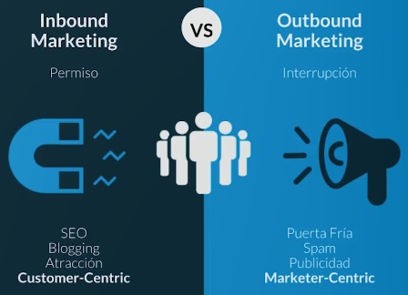
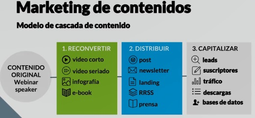
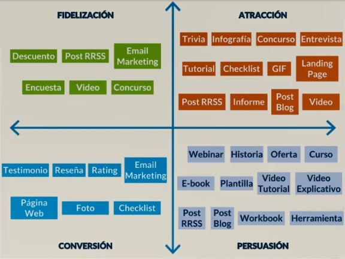

# Curso de Introducción al Marketing Digital

## Introducción

El Marketing Digital son todos los esfuerzos de marketing que una compañía, marca o un profesional individual hace en plataformas online. 

**Estrategias del marketing digital**:

* Tener un website
* Generar contenido a través de un Blog
* Tener una estrategia de Email Marketing
* Generar contenido a través de distintos formatos, como e-books y * white papers
* Producir infografías
* Generar herramientas interactivas
* Generar contenidos y tener presencia en redes sociales
* PR digital, relaciones sociales digitales
* Conseguir reseñas en sitios especializados
* Influencer Marketing

## Tipos de Abordaje

**Inbound**: 
* Centrado en cliente (encuentro-permiso). 
* Normalmente asociado a red social. 
* Contenido de interes o útil. 
* Multidireccional.

**Outbound**: 
* Centrado en producto (interrupción). 
* Normalmente asociado a medios tradicionales. 
* Contenido enfocado en la venta. 
* Unidireccional.

## Outbound Marketing

Outbound marketing es una estrategia de marketing que busca llamar la atención de tus usuarios para ponerles al frente las características de tu producto o servicio.

El outbound marketing utiliza la comunicación unidireccional, no espera feedback inmediato del usuario y busca impactar a la mayor cantidad de personas sin importar si estos son realmente nuestros usuarios objetivos. Es por esto que estas estrategias son consideradas como marketing invasivo o marketing de interrupción.

El outbound marketing esta enfrentando una etapa de transición y nuevos desafíos, servicios digitales como Netflix, Spotify, Waze, Instagram, Twitter y muchos otros están enfrentando muy fuertemente a las formas más tradicionales de marketing y publicidad como la TV, la radio, los medios impresos e incluso formas de publicidad digital como banners, email marketing o Google y Facebook Ads.

**RETO**: "El cliente quiere comprar pero no quiere que le vendan".

Cambios que han afectado al outbound marketing:

* **Cambios en el mercado**: Compañias como Uber o Netflix han traido nuevas formas de vender productos y servicios.
* **Cambio en las intenciones**: Los millenials han construido una nueva forma de vivir.
* **Nuevos procesos**: Tenemos los celulares y tablets como elementows fundamentales en nuestras vidas.

Hay 3 factores fundamentales para explicar este cambio:

* **E-commerce**: Ayer la publicidad te llevaba a una tienda mientras que hoy la publicidad te lleva directamente al proceso de compra, en menos de dos clicks.
* **Los millennials**: Hoy representan la parte más grande del mercado, todo debe ser fácil, rápido y sin inconvenientes.
* **Escasez de atención**: Ante el gran aumento de información, la atención de la audiencia se ha reducido bastante: el 60% del contenido generado por las empresas es percibido por sus clientes como pobre o no llega a la audiencia en el momento y canal adecuado.

**El Inbound Marketing y el Outbound Marketing NO son contrapuestos**. Juntos forman parte de una estrategia más completa para cualquier marca o compañía. Es muy importante poder familiarizarse con los elementos de estas estrategias para poder usarlas correctamente en tus campañas con tu publico objetivo.

## Inbound Marketing

Inbound Marketing es un tipo de estrategia de marketing que tiene al **cliente en el centro** de toda su estrategia, tanto de producción de contenidos como de elección de canales. Estas estrategias le hablan a audiencias muy determinadas y generan contenido relevante para esta audiencia o quienes puedan llegar a ser parte de esta.

La estructura de una estrategia de inbound marketing es la siguiente:

* **Para qué**: Define los objetivos de tu campaña.
* **Para quién**: Define lo más especifico posible a tu audiencia objetiva.
* **Dónde**: ¿Cuales son las plataformas digitales que vas a utilizar para comunicarte con tu audiencia?
* **Cómo**: ¿De qué manera te vas a comunicar? ¿Cuál es la personalidad de tu marca?
* **Con qué**: El tipo de contenido con el que te vas a comunicar.
* **Resultados**: ¿Cuál es el impacto de tu campaña? ¿Cumple con los objetivos que te planteaste?

Algunas plataformas que pueden usarse en Inbound Marketing son los sitios web, los blogs, las redes sociales, una landing page o aplicaciones mobiles.

## Los objetivos

Vamos a enfocarnos en los objetivos de una estrategia Inbound.
Primero debes preguntarte ¿para qué?

**Los objetivos son**:

* Incrementar ventas
* Atención al público
* Generación de leads
* Awareness
* Social Listening
* Posicionarme como experto
* Llevar tráfico a mi sitio
* Innovar

## Objetivos SMART

Para definir los objetivos, se va a usar el método SMART. En español los reconocemos como objetivos especificos, medibles, alcanzable, relevante y ubicado temporalmente.

* **Specific**: Debe de estar muy claramente definido, redactado en una sola oración que cualquiera pueda entender.
* **Measurable**: Tiene que ser cuantificable con una métrica que puedas analizar y seguir en el tiempo.
* **Attainable**: No dejes de ser ambicioso. Sin embargo, tu objetivo debe de ser realista en función del contexto y alcanzable.
* **Relevant**: Debe de ir en línea con el objetivo final de tu negocio y con sus posibilidades.
* **Timely**: Debes de establecer un tiempo específico para ese objetivo.

**Te dejamos algunos tips**:

* Sé realista y ambicioso.
* Calcula los recursos que vas a necesitar.
* Manténlos como un norte.
* Vuelve a revisarlos cada tres meses como mínimo.

## ¿Para quién? La importancia de una audiencia definida

Tu audiencia no puede ser todo el mundo, es muy importante tener una audiencia muy bien definida para tu estrategia de Inbound Marketing.

Existen dos tipos de variables para clasificar nuestra audiencia: variables duras y variables blandas.

Las variables duras vienen un poco más del marketing tradicional. Se clasifica a la audiencia por:
* Genero
* Edad
* ocupación
* Hábitos de consumo
* Nivel socio-cultural
 
Las variables blandas son un nuevo tipo de variables que ha traído el marketing digital y tienen que ver con:
* **Estilo de vida**: Concierne a las actividades habituales de la persona, su rutina, qué hace y qué consume con regularidad.
* **Personalidad**: Son rasgos de conducta. Ejempplo: tímido, responsable, extravagante, impulsivo, tradicional, etc.
* **Valores y creencias**: Constituyen las convicciones que rigen la vida de nuestro individuo. Ejemplo: las creencias religiosas, los valores familiares.
* **Intereses y motivaciones**: Al buscar al consumidor ideas debemos de preguntarnos cuáles son los intereses o inquietudes que tiene. Qué temas y actividades le gustan o lo motivan.

Es con la suma de las variables duras y las variables blandas que las plataformas digitales nos ayudan a definir nuestra audiencia. Con esto listo, podemos pasar al siguiente paso, Construir el Buyer Persona: el prototipo o esquema del usuario ideal al que esta apuntando nuestro contenido.

**Tips para construir buenos Buyer Personas**:

* Sé lo más detallado posible, tomate el tiempo necesario.
* No hagas más de 2 o 3 buyer personas.
* Mantén el documento a la mano para siempre recordar a quién le estás hablando en la producción de contenidos.
* Basa tu construcción en datos, no sólo en suposiciones. Es muy importante hacer entrevistas a usuarios reales de nuestro servicio.

## Marketing de Contenidos

Marketing de Contenidos es una estrategia de marketing digital que se basa en la creación y distribución de contenido relevante para un publico objetivo con el fin de impulsar a futuros clientes o fidelizar a los que ya tenemos.

El funnel de marketing es una estrategia fundamental en el marketing de contenidos, tiene lo siguientes elementos:
* **Atracción**: Vas a hablar a una audiencia que NO te conoce y está buscando información en un mar de contenidos.
* **Persuasión**: Usando tu contenido tienes que mostrar los mejores atributos de tu marca.
* **Conversión**: Necesitas que la venta se concrete, ya sea con ofertas especiales u otro tipo de estimulo comercial.
* **Fidelización**: Tus clientes actuales deben convertirse en "embajadores de la marca", es decir, que recomienden tu servicio con sus amigos y conocidos por haber tenido una muy buena experiencia contigo.

El marketing de contenidos usa el modelo de cascada de contenidos. Comienza con contenido original que debemos reconvertir a distintos tipos de formatos: videos cortos, infografias o e-books. El contenido reconvertido lo vamos a distribuir por canales de estrategias inbound y outbound marketing, como posts, newsletters, landing pages o la prensa. Por último, vamos a capitalizar este contenido: la producción y distribución de contenido debe conseguir objetivos concretos, generar leads, suscriptores, trafico, descargas o enriquecer nuestras bases de datos.

## Creando contenidos de calidad

Hay una serie de factores que debes considerar para que tu contenido sea un buen contenido. Debes saber cuáles son los mensajes que tu marca quiere transmitir, debes considerar cuales son los intereses de tu audiencia objetiva y por supuesto, las tendencias. El punto medio entre estos factores lo podemos llamar: el contenido ideal.

El objetivo de nuestra comunicación puede ser interactuar, educar, entretener, vender o divulgar. Esto depende de qué enfoque tiene nuestro contenido, puede estar enfocado a la fidelización, atracción, conversión o fidelización de nuestros usuarios. Recuerda que es muy importante que sepas para qué estas comunicando.

### Blogs:

* Publica de manera regular, al menos una vez por semana.
* Los posts deben tener entre 1.000 y 2.000 palabras, esto depende de que tan largas prefiere las lecturas tu público.
* Asegúrate de tener visible el nombre del autor y las fechas de publicación.
* Utiliza imágenes y videos para apoyar el tema y romper la monotonía del texto.
* Destaca los contenidos de mayor rendimiento, tus lectores deben descubrir fácilmente a tu mejor contenido.
* No olvides incluir herramientas de social sharing, cada nuevo post es una nueva oportunidad de conseguir nuevos seguidores para tu blog y tus redes sociales.

### Infografías:

* Comparte la infografia en tu blog, asegúrate de incluir un código para que tu audiencia pueda incrustarla en otros sitios web.
* Promociónala a través de redes sociales y en tu plan de email marketing.
* Amplifica tu alcance subiendo la infografia a directorios públicos.
* No dejes de lado posibles acciones de PR con este contenido.

### Case Studies:

* La mayoría de casos de estudio siguen este simple formato: desafío, solución y resultados.
* Usa quotes o citas directas de clientes para reforzar la historia, sobretodo de la parte de resultados.
* Promociónalo a través de redes sociales y en tu plan de email marketing.
* Compártelos en tu blog, en Slideshare, como PDF descargable o para leer en línea.
* Puedes elaborar case studies en otros formatos como video o infografías.
* No dejes de lado posibles acciones de PR con este contenido.

### Whitepapers

* Los White Papers son un contenido generado en formato PDF que se sube a una landing.
* Tiene como objetivo enriquecer una base de datos. 
* Esta estrategia de marketing te permite generar clientes potenciales y posicionarte como un thought-líder, un experto en la industria.
* Puede ser impreso, en PDF electrónico o con formato de revista digital.
* Es muy importante distribuir el link a la landing de descarga por todos los canales que tengas: redes sociales, un blog o email marketing.
* Este tipo de contenidos amerita una campaña de anuncios en plataformas digitales seleccionados según la audiencia objetivo y la temática.

### Videos

* El video es el contenido más poderoso en una estrategia de marketing digital, te permite transmitir ideas complejas de forma fácil y atractiva.
* Tener en cuenta la duración: Nunca más de 1:30.
* Debe ser pensado para la plataforma en la que se va a distribuir.
* Escribe los subtitulos, una gran parte de tu audiencia consume los videos sin sonido.
* Es fundamental que todos tus videos estén subidos a tu canal de YouTube, es el segundo buscador de contenidos del mundo.

## ¿Cómo elegir el canal de distribución?

El primer paso para trabajar en medios sociales es entender cuáles canales de distribución vas a usar para promocionar tu marca. Recuerda empezar de a poco, al elegir tus canales es importante empezar con menos para poder escalar y entender los factores fundamentales como el tiempo y el dinero en tus estrategias.

**Tips para elegir los Canales de Distribución**:

* Tu audiencia tiene que estar ahí.
* Los formatos se deben adaptan a tus objetivos.
* ¿Tienes suficientes recursos para mantener vivo tu ecosistema?
* Te debe brindar métricas que sirvan para tu marca.
* Ten un rol claro, ¿Cuál es el rol de este canal en particular para tu mix de comunicación y marketing?

## Instagram

Nació como una red para documentar tu vida básicamente en fotos. Las fotografías han evolucionado a distintos formatos. Permite generar contenido orgánico con fotografías y videos.
Stories: Generar narrativa con distintos elementos, videos o fotos, con distintos efectos. Son una de las funcionalidades más interesantes que Instagram tiene. Permite contar historias de forma muy atractiva. Fotografía y video vertical.
IGTV: Canal dentro de Instagram que te permite generar contenidos de hasta una hora de duración.

Opciones publicitarias: Instagram
Calls to action: Permite comprar un producto de manera directa, instalar una aplicación, dirigir tráfico hacia algún sitio.

## LinkedIn

Red social muy importante para cuando vendes a compañías, B2B. Permite generar contenido orgánico con fotografías y videos para derivar tráfico a un sitio.

Opciones publicitarias: LinkedIn
Calls to action: Derivar tráfico a un sitio para más información, obtener un presupuesto desde la misma pieza publicitaria, generar tarjetas de generación de leeds o de posibles clientes, para generar una base de datos.
Email: Mensaje personalizado que se envía a través del sistema de mensajería privada. Solo una vez cada 60 días. Incluye botones de Call to action muy presentes.

## calendario de contenidos y su planificación

El calendario de contenidos es la pieza clave de la planificación de contenidos para las plataformas digitales.

**Hay dos tipos de contenido**:

* Contenidos Duraderos: Son todos los contenidos que nunca pasan de moda, siempre serán los mismos o cambiaran muy de vez en cuando. Estos contenidos son por ejemplo los horarios de atención, los medios de pago, los beneficios de tu producto o servicio, o videos y textos explicativos.

* Contenidos De Momento: Estos contenidos dependen del tiempo y el contexto de cada situación. Este es el tipo de contenido que publicamos para fechas, ofertas y eventos especiales que duran un tiempo limitado.

Recuerda que cada estrategia de calendario de contenidos es completamente diferente para cada marca y audiencia. Es muy importante que evalúes las metas y objetivos que tienen tus publicaciones para que el calendario sea mucho más efectivo.

**Tips**:

* **Frecuencia**: No hay una frecuencia establecida que garantice que sea mejor recibido o más visto. 
* **Días**: Funcionan distinto dependiendo de la industria. Generalmente, los lunes en la mañana y los viernes en la tarde no son los mejores momentos para publicar.
* **Previsibilidad**: Sabes qué se va a publicar, cuándo y dónde y no te hace correr detrás del contenido.
* **Fechas clave**: Las festividades y fechas importantes se tienen que tener en cuenta en la construcción del calendario.
* **Reutilizar**: Hay contenido que se puede reutilizar puesto que no caduca.
* **Aprender haciendo**: La mejor forma de saber qué te funciona es haciendo. No hauy una sola receta.
* **Contenido de terceros**: Comparte contenido relevante a tu audiencia pero que no ha sido producido por ti.

## Herramientas Outbound

Hay muchas herramientas que nos sirven para nuestras estrategias de Outbound Marketing, pero hay 3 herramientas que representan mucho mejor sus características y posibilidades:

* **Google Adwords**: Esta herramienta te ayudara a llevar tráfico a tu website.
* **Email Marketing**: Te permite un tipo de comunicación personalizada y de mucho valor para una audiencia bien segmentada.
* **Facebook Ads**: El volumen de usuarios que nos brinda esta herramienta hace que continue siendo muy efectiva para alcanzar a la mayoría de audiencias.

### Google Adwords

Google Adwords es la principal herramienta para SEM (Search Engine Management), la técnica paga para posicionar y/o reposicionar un website y/o producto en el motor de búsquedas de Google. Esta herramienta es la encargada de que ciertas marcas aparezcan primeras y destacadas en tus resultados de búsqueda. Recuerda que todo contacto con una marca comienza con la búsqueda de una palabra clave.

Con Google Adwords tienes un conocimiento del producto, puedes ganarle el lugar a grandes marcas, obtener tener ROI de forma rápida y direccionar el publico objetivo a tu website. Pero debes tener en cuenta que hay algunas desventajas, como el costo de las mejores keywords ya sea en dinero o en tráfico, también debes tener en cuenta qué no siempre sabes qué keywords te definen realmente.

**Tipos de campañas en Google Adwords**:

* **Search and Display**: Está pensada para la mayor cantidad de público con avisos de texto y banners en los websites.
* **Search**: Avisos de de texto con locación, teléfono y demás datos que puedas posicionarte.
* **Display**: Avisos ubicados en la red de website asociadas al universo de Google.
* **Shopping**: La mejor forma de crear anuncios estilo shop.
* **Video**: Su uso principal esta dentro de YouTube pero también se extiende a la web.
* **Universal de App**: Se utiliza para "mover" una app por search, display y YouTube.

**Elementos para una buena campaña**:

* Objetivos de la campaña.
* Target.
* Presupuesto del que disponemos.
* Dispositivos en los que nos interesa correr la campaña.
* Periodo de la campaña.
* Cuál es tu competencia.
* Keywords principales y secundarios.
* Datos del mercado local y circunstancial.

### Facebook Ads

Facebook Ads es la plataforma de anuncios de Facebook. Tiene posibilidades de targeting muy poderosas ya que puedes hacer una segmentación muy específica. Herramientas como Facebook Add Manager y Power Editor facilitan el trabajo en equipo. Y no solo te permite utilizar diversos recursos, también nos brinda alternativas sobre el lugar de Facebook donde tu audiencia verá los anuncios.

**Tipos de formatos para Facebook Ads**:

* **Video**: Muestra las características de los productos y atrae a las personas por medio del sonido y el movimiento.
* **Imagen**: Dirige a las persona a aplicaciones o sitios web de destino a través de activos visuales de gran calidad.
* **Colecciones**: Artículos de tu catalogo de productos personalizados para cada persona, impulsa las compras.
* **Secuencia o Carrusel**: Muestra hasta 10 imágenes o videos en un mismo anuncio, cada uno con su propio enlace.
* **Presentación**: usa el movimiento, el sonido y el texto para contar tu historia de de forma atractiva con cualquier velocidad de conexión.
* **Canvas**: Permite una experiencia en pantalla completa optimizada para celulares directamente desde tu anuncio, es lo más parecido a un Moment de Twitter.
* **Generación de clientes potenciales**: Te ayudan a recopilar información de usuarios con interés en tu negocio. Se presenta con videos, imágenes o secuencias y luego un formulario para los clientes que interactuaron con tu anuncio.
* **Ofertas**: Descuentos que puedes compartir con tus clientes en Facebook.
* **Interacción con una publicación**: La mayoría de publicaciones pueden promocionarse para obtener más Me Gusta, comentarios, visualizaciones y que tus usuarios compartan el contenido.
* **Respuesta a Eventos**: Puedes diseñar el anuncio sobre un evento para impulsar el reconocimiento de este y aumentar las respuestas.
* **Me Gusta de la Página**: Impulsa a tus usuarios a indicar que les gusta tu página diseñando anuncios sobre personas a las que les guste tu página.

### Email Marketing

El email marketing es una estrategia de envío de información interesante y relevante por correo electrónico a una audiencia bien segmentada (ya sean clientes o prospectos). No importa lo que vendas, debes tener una idea clara de quién es tu audiencia para comunicarte de manera efectiva con ellos.

Esta estrategia es el mejor ejemplo de Marketing del Permiso: Requiere un circuito de personas que elijan darte acceso a su inbox mediante sus correos electrónicos. Recuerda que tanto el "asunto" como el contenido del email son determinantes para una buena performance de tus envíos.

**Claves para estrategias de Email Marketing**:

* Requiere el uso de herramientas especificas: MailChip y Doppler son las más conocidas, ambas tienen versiones gratuitas con cantidad de envíos y funcionalidades limitadas.
* El email es el mejor canal para ganarte la confianza de un lector, esto es imprescindible para que compre tus servicios y productos.
* Los resultados de una campaña de email marketing tardan muy poco en mostrar resultados, normalmente son 3 días.
* Es una de las estrategias de marketing digital con mayor retornode inversión.
* Permite automatizaciones, es lo mismo que tener personal del area comercial trabajando 24 horas al día, 365 días al año.
* Con cualquier software de email marketing puedes crear segmentos dentro de tu lista de correos, esto te permite personalizar todavía más la experiencia de tus lectores para poder ofrecer sólo lo que les interesa. Tambien tienes un apartado de estadísticas para comprobar que campañas funcionan mejor.
* Al aportarle valor a tus suscriptores, generas lealtad.