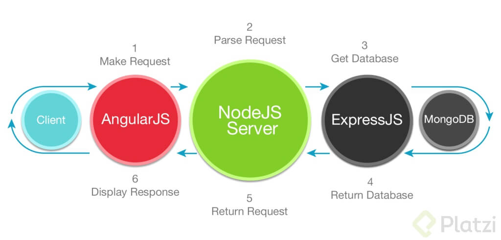
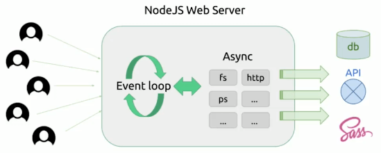
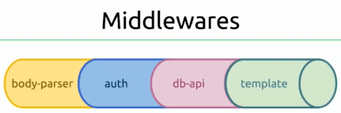

# Curso de MEAN<!-- omit in toc -->

## Tabla de Contenido<!-- omit in toc -->
- [¿Qué es MEAN?](#qué-es-mean)
- [Angular](#angular)
  - [TypeScript:](#typescript)
  - [Developer Experience de Angular:](#developer-experience-de-angular)
  - [Instalación y Configuración de Entorno](#instalación-y-configuración-de-entorno)
  - [Angular Material](#angular-material)
  - [Estructura de los Archivos](#estructura-de-los-archivos)
  - [Componentes](#componentes)
  - [Modelos](#modelos)
  - [Angular Moment](#angular-moment)
  - [Formularios en Angular](#formularios-en-angular)
  - [Ocultar Elementos (ngIf)](#ocultar-elementos-ngif)
  - [Repetir Elementos (ngFor)](#repetir-elementos-ngfor)
  - [Pasar datos a un componente](#pasar-datos-a-un-componente)
  - [Routing](#routing)
  - [Child Routing](#child-routing)
  - [Services](#services)
    - [Consumir Services](#consumir-services)
  - [Obtener parámetros de la url](#obtener-parámetros-de-la-url)
- [NodeJS](#nodejs)
  - [Express](#express)
  - [Instalación y configuración del entorno](#instalación-y-configuración-del-entorno)
    - [Configuración del Servidor con Nodejs](#configuración-del-servidor-con-nodejs)
    - [Babel](#babel)
    - [Debug](#debug)
    - [Nodemon](#nodemon)
    - [Concurrently](#concurrently)
    - [Express](#express-1)
  - [Routes](#routes)
  - [Permisos de acceso](#permisos-de-acceso)
  - [Leer diferentes formatos](#leer-diferentes-formatos)
- [Deploy](#deploy)
  - [Heroku](#heroku)
    - [Conexión con Mongo](#conexión-con-mongo)
    - [Variables de entorno](#variables-de-entorno)
  - [Build del cliente](#build-del-cliente)
  - [Build del servidor](#build-del-servidor)
  - [Pasos finales](#pasos-finales)
- [Recursos Complementarios](#recursos-complementarios)
- [Enlaces de Interés](#enlaces-de-interés)

## ¿Qué es MEAN?

MEAN es uno de los Stacks tecnológicos más utilizados para crear Single Page Applications:

* **MongoDb** para la base de datos.
* **Express** como framework backend corriendo en Node.js.
* **Angular** para el frontend.
* **Node.js** es nuestro servidor web, encargado de escuchar las peticiones de los usuarios y responderle con los datos que requieran.
  * Configurar sus rutas
  * Proteger los recursos
  * Servir archivos estáticos

Estas tecnologías son muy sencillas de combinar: todo está escrito en JavaScript, incluso la base de datos guarda colecciones con objetos en JSON.

<div align="center">
  
  <small><p>Stack de MEAN</p></small>
</div>

## Angular

* Es un framework para Frontend.
* Tiene la opción actualmente de correrlo desde el Backend y poder reutilizar el código.
* Nos permite organizar los archivos que vamos a tener y de separar las responsabilidades de cada archivo. Nos permite separar en componentes reutilizables nuestra aplicación.
* Este framework, de lo que más se va a tratar es de componentes. Los componentes son unidades visuales reutilizables y con cierto comportamiento definido.
* Otra cosa que nos va a solucionar Angular, es el routing, es decir, el sistema de ruteo.
* Angular nos va a dar también los services. son maneras de conectarnos con el Backend, desde ahí vamos a pedir ciertos datos que necesita el Frontend para mostrar en la pantalla.
* Angular ofrece un sistema de templates. Cada componente va a tener asociado un template o vista que va a ser la estructura HTML que tenga.
* Desde Angular es posible que podamos definir nuestras propias etiquetas para definir los componentes reutilizables.
* Otra cosa que nos permite Angular son los modules o módulos. Son librerías enteras con componentes y directivas ya armadas o preestablecidas. Un ejemplo es Material Angular que es la que vamos a estar utilizando para nuestro proyecto del curso.
* CLI = Command Line Interface o Interfaz de Línea de Comandos.
* Google está detrás de Angular. Son los desarrolladores de Google quienes le dan soporte a esta librería Open Source.
* Angular es muy adaptado y tiene una comunidad muy grande alrededor.

### TypeScript:

* Es un super set de JavaScript. nos va a ayudar a expandir un poco las capacidades de JavaScript, va incorporar un chequeo de tipos para corrección de errores.
* Es una tecnología ideal para trabajo en proyectos en equipo.

### Developer Experience de Angular:

Uno de los puntos a favor es que cada vez que hagamos cambios en nuestros archivos se van a ver reflejados en nuestro navegador de forma automática sin tener que recompilar a mano y sin tener que refrescar.

### Instalación y Configuración de Entorno

Instalar el CLI de Angular

```bash
$ npm i -g @angular/cli
```

Para crear un proyecto, ir a la carpeta y escribir lo siguiente:

```bash
$ ng new [proyecto]
```

Para correr la aplicación:

```bash
$ ng serve
```

### Angular Material

Angular Material son componentes basados en Material Design para Angular.

**Paso 1: Instalar las dependencias**

```bash
$ npm i @angular/material @angular/cdk
```

Para instalar las animaciones de Angular Material:

```bash
$ npm i @angular/animations
```

**Paso 2: Configurar las animaciones**

Para habilitar las animaciones, se debe de importar el paquete en la aplicación:

```js
import {BrowserAnimationsModule} from '@angular/platform-browser/animations';

@NgModule({
  // ...
  imports: [BrowserAnimationsModule],
  // ...
})
export class AppModule { }
```

**Paso 3: Importar los módulos de los componentes**

Para importar los módulos, se va a crear un archivo llamado **material.module.ts**. Ahí se van a agregar todos los módulos que se desean importar.

```js
import { NgModule } from '@angular/core';
import { MatButtonModule, MatCheckboxModule } from '@angular/material';

const modules = [
  MatButtonModule,
  MatCheckboxModule
]

@NgModule({
  imports: modules,
  exports: modules
})

export class MaterialModule {}
```

Luego, se va a importar el archivo creado en el módulo principal de la aplicación.

```js
import { MaterialModule } from './material.module';

@NgModule({
  //...
  imports: [
    MaterialModule
  ]
  //...
})

export class AppModule { }
```

**Paso 4: Incluir un theme**

El theme se va a encargar de aplicar todos los estilos básicos a la aplicación. Para esto, solo se debe de agregar el theme en el archivo **styles.css**.

```js
@import "~@angular/material/prebuilt-themes/indigo-pink.css";
```

**Paso 5: Soporte de gestos**

Algunos componentes requieren HammerJS para realizar gestos en los dispositivos táctiles. 

```bash
$ npm i hammerjs
```

Luego de instalarlos, solo se debe de importar en el módulo principal (ej. `app.module.ts`).

```js
import 'hammerjs';
```

**Paso 6: Agregar íconos de material**

Para usar los íconos de Material Design, se debe de agregar la fuente de el **index.html**.

```html
<link href="https://fonts.googleapis.com/icon?family=Material+Icons" rel="stylesheet">
```

### Estructura de los Archivos

Existen dos maneras de organizar la estructura de los archivos dentro de nuestro proyecto:

1. Siguiendo la funcionalidad de cada uno de los archivos.
2. Tenemos ciertos modelos, ciertas pantallas, ciertos componentes o ciertos servicios. Podemos ir almacenando todo en una carpeta según el tipo.

### Componentes

Para crear un componente, se va a crear un archivo con la siguiente nomenclatura: **mi-componente.component.ts**.

```js
import { Component } from '@angular/core';

@Component({
  selector: 'app-mi-componente',
  templateUrl: './mi-componente.component.html'
})

export class MiComponenteComponent {}
```

El html del componente se va a escribir en `mi-componente.component.html`.

```html
<div>hola mundo</div>
```

Para usar el componente, se debe de importar dentro del componente principal.

```js
import { MiComponenteComponent } from './mi-componente.component';

@NgModule({
  //...
  declarations: [
    MiComponenteComponent
  ]
  //...
})

export class AppModule { }
```

Luego se puede usar en el html de la siguiente manera:

```js
<app-mi-componente></app-mi-componente>
```

### Modelos

Los modelos se van a escribir en un archivo aparte. Por ejemplo: **question.model.ts**.

El caracter **?** va a indicar que un atributo puede ser nulo.

```js
export class Question {
  title: string;
  description: string;
  createdAt?: Date;
  icon?: string;

  constructor(
    title: string,
    description: string,
    createdAt?: Date,
    icon?: string
  ) {
    this.title = title;
    this.description = description;
    this.createdAt = createdAt;
    this.icon = icon;
  }
}
```

Otra forma de hacer modelos es directamente desde el constructor:

```js
export class User {
  constructor(
    public firstName: string,
    public lastName: string
  ) {}
}
```

Para consumir el modelo dentro del componente, hacerlo de la siguiente manera:

```js
import { Question } from './question.model';

//...

export class QuestionDetailComponent {
  question: Question = new Question(
    'Esta es una nueva pregunta sobre Android',
    'Miren, tengo una dura con una aplicación que estoy escribiendo para Android',
    new Date,
    'devicon-android-plain'
  );
}
```

### Angular Moment

**ngx-moment** es una librería que nos permite saber la temporalidad de las acciones en las aplicaciones.

```bash
$ npm i moment ngx-moment
```

Luego de instalarlo, se debe de impotar en el módulo de la aplicación:

```js
import { MomentModule } from 'ngx-moment';

@NgModule({
  imports: [
    MomentModule
  ]
})
```

Se usa en el html por medio de los pipes:

```html
 <div>{{question.createdAt | amTimeAgo}}</div>
```

Si se quiere cambiar el idioma a español, primero se debe de importar el idioma en el app component.

```js
import 'moment/locale/es';
```

Y para consumirlo se hace de la siguiente forma:

```html
 <small>{{question.createdAt | amLocale:'es' | amTimeAgo}}</small>
```

### Formularios en Angular

Existen 2 formas de crear formularios en Angular:

**Template-Driven Form**

Para usar formularios en Angular, va a usar `@angular/forms`.

```js
import { Component } from '@angular/core';
import { NgForm } from '@angular/forms';

@Component({
  selector: 'app-answer-form',
  templateUrl: './answer-form.component.html'
})

export class AnswerFormComponent {
  onSubmit(form: NgForm) {
    console.log(form.value.description);
  }
}
```

En el html, se debe indicar que cuando se haga submit al formulario, se llame a la función onSubmit. Esto se hace poniendo `(ngSubmit)="onSubmit(f)" #f="ngForm"` en el `<form>`. 

Asimismo, en los diferentes campos, es importante poner un `ngModel` para poder acceder al valor desde el component y un `name`.

```html
<form (ngSubmit)="onSubmit(f)" #f="ngForm">
  <mat-form-field>
    <textarea matInput placeholder="Respuesta" name="description" ngModel></textarea>
  </mat-form-field>
  <button type="submit" mat-raised-button color="accent">Responder</button>
</form>
```

**Reactive Forms**

Es una filosfia más "Angular" de crear formularios. Se comienza definiendo el formulario desde la clase del componente. 

Una ventaja de este tipo de formularios es la facilidad al momento de validar los campos.

```js
import { Component, OnInit } from '@angular/core';
import { FormGroup, FormControl, Validators } from '@angular/forms';
import { User } from './user.model';

@Component({
  selector: 'app-signin-screen',
  templateUrl: 'signin-screen-component.html'
})

export class SigninScreenComponent implements OnInit {
  signinForm: FormGroup;

  ngOnInit() {
    this.signinForm = new FormGroup({
      email: new FormControl(null, [
        Validators.required,
        Validators.pattern(/^[a-zA-Z0-9.!#$%&’*+/=?^_`{|}~-]+@[a-zA-Z0-9-]+(?:\.[a-zA-Z0-9-]+)*$/)
      ]),
      password: new FormControl(null, Validators.required)
    });
  }

  onSubmit() {
    if(this.signinForm.valid) {
      const { email, password } = this.signinForm.value;
      const user = new User(email, password);
      console.log(user)
    }
  }
}
```

En el HTML, hay que hacer el binding del formularios (formGroup) y del evento (onSubmit). Asimismo, para poder acceder a los campos del formulario (input, textare, etc), se va a definir una propiedad `formControlName`-

```html
<form [formGroup]="signinForm" (ngSubmit)="onSubmit()">
  <mat-form-field>
    <input matInput placeholder="Correo electrónico" formControlName="email" id="email">
  </mat-form-field>
  <mat-form-field>
    <input type="password" matInput placeholder="Contraseña" formControlName="password" id="password">
  </mat-form-field>
  <button type="submit" mat-raised-button color="accent">Iniciar sesión</button>
</form>
```

### Ocultar Elementos (ngIf)

Para ocultar elementos HTML, se va a usar `*ngIf`. Si se cumple la condición, se muestra el elemento, de lo contrario se oculta.

```html
<p *ngIf="answers.length === 0">Hola Mundo</p>
```

### Repetir Elementos (ngFor)

Para repetir varias veces un elemento en el HTML, se puede usar `*ngFor`.

```html
<li *ngFor="let answer of answers">
  <h5>
    {{ answer.user.firstName }} {{ answer.user.lastName }}
    <small>{{answer.createdAt | amLocale:'es' | amTimeAgo}}</small>
  </h5>
  <p class="description">
    {{ answer.description }}
  </p>
</li>
```

### Pasar datos a un componente

Para recibir datos en un componente, se va a usar `@Input()`.

```js
import { Component, Input } from '@angular/core';
import { NgForm } from '@angular/forms';
import { Answer, User } from './answer.model';
import { Question } from '../question/question.model';

@Component({
  selector: 'app-answer-form',
  templateUrl: './answer-form.component.html'
})

export class AnswerFormComponent {
  @Input() question: Question;

  onSubmit(form: NgForm) {
    const answer = new Answer("Es una pregunta");
    this.question.answers.unshift(answer);
  }
}
```

Para enviar el dato desde el html, se agrega con `[input]="data"`.

```html
<app-answer-form [question]="question" class="answer-form"></app-answer-form>
```

### Routing

Lo primero que se debe de hacer para definir rutas es agregar el Routing en el app.module.

```js
import { Routing } from './app.routing';

@NgModule({
  //...
  imports: [
    Routing
  ]
  //...
})
export class AppModule { }
``` 

Luego, para definir rutas dentro de Angular, se va a crear el archivo **app.routing.ts**.

En ese archivo, se va a importar **Routes** y **RouterModule** y se van a definir las rutas con sus respectivos componentes.

```js
import { Routes, RouterModule } from '@angular/router';
import { QuestionListComponent } from './question/question-list.component';
import { SigninScreenComponent } from './auth/signin-screen-component';
import { SignupScreenComponent } from './auth/signup-screen.component';

const APP_Routes: Routes = [
  { path: '', component: QuestionListComponent, pathMatch: 'full' },
  { path: 'signin', component: SigninScreenComponent },
  { path: 'signun', component: SignupScreenComponent }
];

export const Routing = RouterModule.forRoot(APP_Routes);
```

Para usar las rutas en el HTML, se hace de la siguiente manera:
* `router-outlet`: Define el lugar en donde se va a cargar el componente definido en **app.routing.ts** dependiendo de la url.
* `routerLink`: define a dónde va redirigir al hacer click.

```html
<mat-toolbar color="primary">
  <span [routerLink]="['/']">PlatziOverflow</span>
  <span class="space"></span>
  <mat-icon [routerLink]="['/signin']">account_circle</mat-icon>
</mat-toolbar>
<router-outlet></router-outlet>
```

### Child Routing

Child routex se usa para definir una ruta con múltiples opciones. Por ejemplo, /question y /question/1265.

Para definir un child route, primero se va a crear un nuevo archivo en donde se van a definir las rutas correspondientes.

```js
//question.routing.ts
import { QuestionListComponent } from './question-list.component';
import { QuestionDetailComponent } from './question-detail.component';

export const QUESTION_ROUTES = [
  { path: '', component: QuestionListComponent },
  { path: ':id', component: QuestionDetailComponent }
];
```

Luego, en el archivo de rutas principal, se va a definir la ruta de la siguiente manera:

```js
import { Routes, RouterModule } from '@angular/router';
import { QUESTION_ROUTES } from './question/question.routing';

const APP_Routes: Routes = [
  { path: 'questions', children: QUESTION_ROUTES }
];

export const Routing = RouterModule.forRoot(APP_Routes);
```

### Services

Los servicios permiten consumir API dentro de una aplicación de Angular. 

Los servicios usan el módulo Http de Angular por lo que también hay que incluirlo dentro de **app.module.ts**.

Un ejemplo de cómo hacer servicios es el siguiente:

```js
//question.service.ts
import { Injectable } from '@angular/core';
import { Http } from '@angular/http';
import { Question } from './question.model';
import { environment } from '../../environments/environment';
import urljoin from 'url-join';

@Injectable()
export class QuestionService {
  private questionsUrl: string;

  constructor(private http: Http) {
    this.questionsUrl = urljoin(environment.apiUrl, 'questions');
  }

  getQuestions(): Promise<void | Question[]> {
    return this.http.get(this.questionsUrl)
      .toPromise()
      .then(response => response.json() as Question[])
      .catch(this.handleError);
  }

  getQuestion(id): Promise<void | Question> {
    const url = urljoin(this.questionsUrl, id);
    return this.http.get(url)
      .toPromise()
      .then(response => response.json() as Question)
      .catch(this.handleError);
  }

  handleError(error: any) {
    const errMsg = error.message ? error.message :
      error.status ? `${error.status} - ${error.statusText}` : 'Server error';
    console.log(errMsg);
  }
}
```

La url base de donde se van a consumir la api se va a definir en **environments/environments.ts**.

```js
export const environment = {
  apiUrl: 'http://localhost:3000/api'
};
```

También se va a usar una librería llamada **url-join** la cual servirá para juntar elementos y crear urls.

```bash
$ npm i url-join
```

#### Consumir Services

Los servicios se consumen desde el componente. Todo servicio que se vaya a usar se debe de declarar en la sección de providers.

Asimismo, el servicio debe de injectarse en el constructor de la clase.

```js
import { Component, OnInit } from '@angular/core';
import { Question } from './question.model';
import { QuestionService } from './question.service';

@Component({
  selector: 'app-question-list',
  templateUrl: 'question-list.component.html',
  providers: [QuestionService]
})

export class QuestionListComponent implements OnInit {
  constructor(private questionService: QuestionService) {}

  questions: Question[];

  ngOnInit() {
    this.questionService.getQuestions()
      .then((questions: Question[]) => {
        this.questions = questions;
      });
  }
}
```

### Obtener parámetros de la url

Para poder obtener un parámetro de la url dentro del componente, se va a usar **ActivatedRoute**.

```js
import { Component, OnInit, OnDestroy } from '@angular/core';
import { ActivatedRoute } from '@angular/router';

@Component({
  //...
})

export class Component implements OnInit, OnDestroy {
  sub: any;

  constructor(
    private route: ActivatedRoute
  ) {}

  ngOnInit() {
    this.sub = this.route.params.subscribe(params => {
      console.log(params.id)
    });
  }

  ngOnDestroy() {
    this.sub.unsubscribe();
  }
}
```

## NodeJS

NodeJS es un entorno donde se puede correr JavaScript a través de un motor llamado V8 que Google desarrolló. Este motor permite correr JS en el servidor.

La principal diferencia entre Node y otros lengiajes de backend es que con el primero se programa también el servidor web. No solamente cierta lógica.

Node tiene un único thread en toda la aplicación. Hay un solo proceso que corre y atiende todos los pedidos y este único proceso corre el event loop.

<div align="center">
  
  <small><p>NodeJS Web Server</p></small>
</div>

¿Qué puedo construir con NodeJS?
* Servidores web/Web APIs
* Herramientas utilitarias

### Express

Express es un framework de NodeJS. Con Express puedo:
1. Crear servidores web.
2. Hacer API.

Características:
1. **Rápido**: brinda código y funcionalidades que se usan comunmente sin que decaiga el performance del servidor web.
2. **Sin opiniones** (opinionated): da la posibilidad de hacer las cosas como uno quiere.
3. **Minimalista**: entrega solo lo justo y necesario.

Express funciona por medio de middlewares. Un middleware es como un tubo donde vamos conectando un tubo al lado del otro.

<div align="center">
  
  <small><p>Ejemplo de middleware</p></small>
</div>

Los middlewares son funciones de javascript. Estas funciones reciben 3 parámetros como máximo:
1. Request
2. Response
3. Apuntador al siguiente middleware

La idea de los middlewares es que sean reutilizables y que cumplan con una tarea específica. 

Alternativas a Express:
1. NodeJs puro
2. Koa

### Instalación y configuración del entorno

#### Configuración del Servidor con Nodejs

Lo primero que se debe de usar para usar node, es configurar el servidor. Para esto, se va a crear un archivo **server/index.js**.

```js
import http from 'http'
import Debug from 'debug'

const PORT = 3000

const app = http.createServer((req, res) => {
  res.writeHead(200, { 'Content-Type': 'text/plain' })
  res.end()
})

app.listen(PORT, () => {
  console.log(`Server running at port ${PORT}`)
})
```

#### Babel

Babel permite traspilar código moderno de Javascript en uno que entiendan los diferentes navegadores.

```bash
$ npm i babel-cli babel-preset-es2015
```

Para usar babel, se tiene que definir un archivo de configuración llamado **.babelrc**.

```json
{
  "presets": ["es2015"]
}

```

Finalmente se crea un script en package.json en donde se usa babel.

```json
"scripts": {
  "start:server": "babel-node server/index.js"
}
```

#### Debug

Debug permite mostrar mensajes de debugging en la consola.

```bash
$ npm i debug
```

Para usarlo, se puede hacer de la siguiente forma:

```js
import Debug from 'debug'

const debug = new Debug('platzi-overflow:root')

const app = http.createServer((req, res) => {
  debug('new request')
})
```

Finalmente, para poder ejecutar el debug, se va a correr el siguiente script:

```js
"scripts": {
    "start:server": "set DEBUG=platzi-overflow* & babel-node server/index.js"
  }
```

#### Nodemon

Nodemon permite que el servidor se reinicie cada vez que hay un cambio.

```bash
$ npm i nodemon
```

Para usar nodemon, configurarlo en los scripts de package.json.

```json
"scripts": {
  "start:server": "nodemon server/index.js --exec babel-node"
}
```

#### Concurrently

Concurrently permite correr procesos en paralelo con un solo comando. Esto va a ayudar a levantar el servidor de backend y el de Angular al mismo tiempo.

```bash
$ npm i concurrently
```

Para usarlo, en **scripts** del **package.json**, usamos el comando `concurrently` y entre comillas los scripts que queremos que se ejecuten en simultaneo.

```js
"scripts": {
    "start": "concurrently -r \"npm run start:server\" \"npm run start:client\" ",
    "start:server": "set DEBUG=platzi-overflow* & nodemon server/index.js --exec babel-node",
    "start:client": "ng serve"
  }
```

#### Express

Express es un microframework de nodejs.

```bash
$ npm i express
```

**Configurar el servidor con Express**

Crear un archivo en server/app.js

```js
import express from 'express'

const app = express() //express devuelve en una variable el servidor

app.get('/', (req, res) => res.send('Hola desde express'))

export default app

```

Y en server/index.js hacer un listen de server/app.js

```js
import http from 'http'
import Debug from 'debug'
import app from './app'

const PORT = 3000

app.listen(PORT, () => {
  console.log(`Server running at port ${PORT}`)
})

```

### Routes

Las rutas se van a definir en una carpeta **routes**.

Dentro de esta carpeta, se va a crear un archivo por cada modelo de ruta. Por ejemplo, **question.js**:

```js
import express from 'express'

const app = express.Router()

const question = {
  _id: 1,
  title: '¿Cómo utilizo un componente en Android?',
}

const questions = new Array(10).fill(question)

// /api/questions
app.get('/', (req, res) => res.status(200).json(questions))

// /api/questions/:id
app.get('/:id', (req, res) => res.status(200).json(question))

export default app
```

También se va a tener un archivo **routes/index.js** en donde se van a listar todas las rutas:

```js
export { default as question } from './question'
```

Finalmente, las rutas se van a consumir en el archivo app.js:

```js
import express from 'express'
import { question } from './routes'

const app = express()

app.use('/api/questions', question)

export default app
```

### Permisos de acceso 

Por motivos de seguridad, los navegadores no permite el acceso a una API desde una url diferente. 

Para permitir el acceso a API en un ambiente de desarrollo, hacer lo siguiente.

```js
if (process.env.NODE_ENV === 'development') {
  app.use((req, res, next) => {
    res.setHeader('Access-Control-Allow-Origin', '*')
    res.setHeader('Access-Control-Allow-Headers', 'Origin, X-Request-With, Content-Type, Accept')
    res.setHeader('Access-Control-Allow-Methods', 'POST, GET, PATCH, DELETE, OPTIONS')
    next()
  })
}
```

Además, hay que setear el NODE_ENV en el **package.json**.

```js
"scripts": {
    "start:server": "set NODE_ENV=development& set DEBUG=platzi-overflow* & nodemon server/index.js --exec babel-node"
  }
```

### Leer diferentes formatos

Para leer los formatos json y utf-8 en el servidor, se va a usar una librería llamada **body-parser**.

```bash
$ npm i body-parser
```

El siguiente paso es agregar las siguientes líneas en el archivo **server/app.js.**

```js
import express from 'express'
import bodyParser from 'body-parser'

const app = express()

app.use(bodyParser.json()) //poder leer todo lo que viene en formato json del cliente
app.use(bodyParser.urlencoded({ extended: true })) //poder leer todo lo que viene en formato utf-8
```

## Deploy

### Heroku

Para crear una aplicacion de Heroku, ir al directorio del archivo y escribir:

```bash
$ heroku create
```

Esto va a crear una url en donde se va a encontrar la aplicación. También anañe al git un acceso remoto llamado Heroku.

Para ingresar a la url:

```bash
$ heroku open
```

#### Conexión con Mongo

Se va a usar el addon [mLab MongoDB](https://elements.heroku.com/addons/mongolab) de Heroku para conectarse a una bd de Mongo. 

```bash
$ heroku addons:create mongolab:sandbox
```

Se va a crear la base de datos y se va a guardar la url de mongo como una variable de entorno.

#### Variables de entorno

Heroku permite almacenar variables de entorno las cuales van a ser accesibles solo desde el servidor.

Para setear variables de entorno:

```bash
$ heroku config:set VARIABLE=miVariableDeEntorno
```

Para ver el listado de las variables:

```bash
$ heroku config
```

### Build del cliente

Para poder crear un build del cliente, se va a crear un nuevo **script** en **package.json**:

```json
"scripts": {
  "build:client": "ng build --configuration=production"
}
```

Asimismo, para poder ejecutar el comando en Heroku, es importante pasar algunas **devDependencies** a **Dependencies**.

```json
"dependencies": {
  "@angular/cli": "~6.1.5",
  "@angular/compiler-cli": "^6.1.0",
  "babel-plugin-transform-async-to-generator": "^6.24.1",
  "babel-polyfill": "^6.26.0",
  "babel-preset-es2015": "^6.24.1",
  "babel-preset-stage-0": "^6.24.1",
  "typescript": "~2.7.2"
}
```

Si se quiere generar el build, se puede ejecutar el siguiente comando:

```bash
$ npm run build:client
```

### Build del servidor

Se va a instalar [babel-plugin-transform-async-to-generator](https://www.npmjs.com/package/babel-plugin-transform-async-to-generator) el cual va a permitir transformar las funciones que tienen async en generadores de ES2015 que entiende node.

```bash
$ npm i babel-plugin-transform-async-to-generator
```

Luego, se va a agregar babel-plugin-transform-async-to-generator a la lista de plugins de **.babelrc**.

```json
{
  "presets": ["es2015", "stage-0"],
  "plugins": ["transform-async-to-generator"]
}

```

Otra cosa que hay que hacer el instalar el [polyfill de Babel](https://babeljs.io/docs/en/babel-polyfill). El polyfill va a permitir correr las funciones generator dentro de nuestro entorno.

```bash
$ npm i babel-polyfill
```

Tambien se debe de crear un archivo llamado server.js en la raiz del proyecto. Este va a ser el archivo que el servidor de Heroku va a correr con el comando de node.

```js
require('babel-polyfill')
require('./dist/server')
```

Finalmente, agregar el siguiente script para hacer build al servidor:

```json
"scripts": {
  "build:server": "babel server --out-dir dist/server"
}
```

### Pasos finales

Agregar los siguientes scripts en el package.json:

```json
"scripts": {
    "start-prod": "NODE_ENV=production node server.js",
    "build": "npm run build:client && npm run build:server",
    "postinstall": "npm run build"
  }
```

* **start-prod**: va a iniciar el servidor.
* **build**: hace un build del cliente y del servidor.
* **postinstall**: se ejecuta al finalizar de instalar todas las dependencias en Heroku.

Además de esto, se va a crear un archivo **Procfile** en la raiz del proyecto:

```
web: npm run start-prod
```

Finalmente, para subir la aplicación a producción, hacer un push a Heroku:

```bash
$ git push heroku origin
```

## Recursos Complementarios
* [Diapositivas de Express](docs/Express.pdf)

<div align="right">
  <small><a href="#tabla-de-contenido">🡡 volver al inicio</a></small>
</div>

## Enlaces de Interés
* [Curso de MEAN](https://platzi.com/clases/mean/)
* [Github del Curso](https://github.com/platzi/Platzi-overflow)
* [Angular](https://angular.io/)
* [Angular Material](https://material.angular.io/)
* [Dev Icon](http://konpa.github.io/devicon/)
* [Ngx Moment](https://github.com/urish/ngx-moment)
* [Npm](https://npmjs.com)
* [Babel](https://babelks.io)
* [Mongoose](https://mongoosejs.com)
* [Heroku](https://heroku.com)

<div align="right">
  <small><a href="#tabla-de-contenido">🡡 volver al inicio</a></small>
</div>