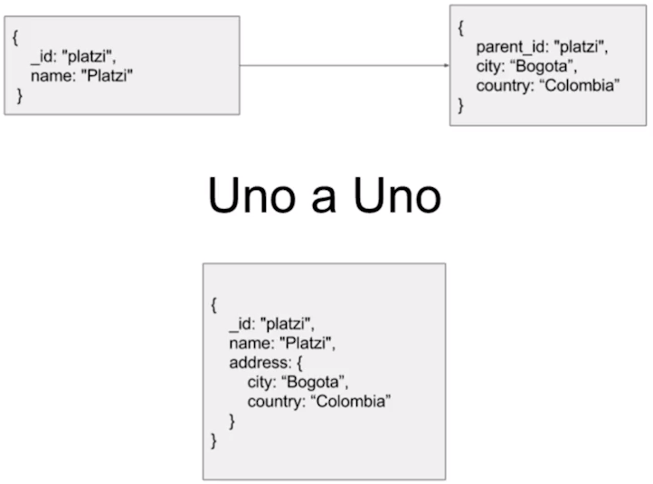
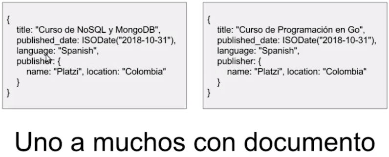
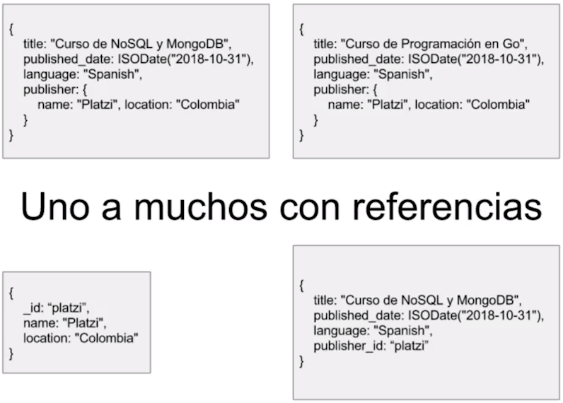
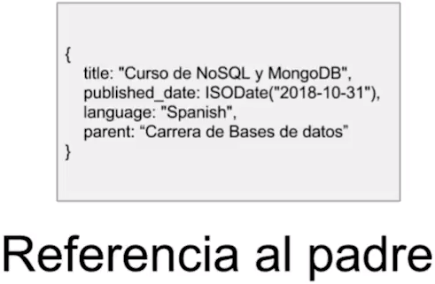
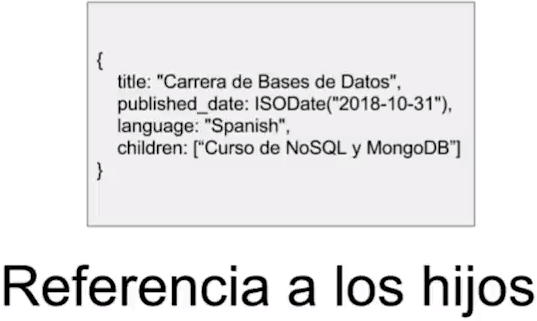

# Curso de MongoDB y Redis

## Tabla de Contenido
* [Introducción](#introducción)
* [Implementaciones de NoSQL](#implementaciones-de-nosql)
* [Ventajas](#ventajas)
* [Desventajas](#desventajas)
* [Diferencias entre SQL y NoSQL](#diferencias-entre-sql-y-nosql)
* [MongoBD](#mongobd)
  + [Representación de la información en SQL vs MongoDB](#representación-de-la-información-en-sql-vs-mongodb)
  + [Modelado de datos](#modelado-de-datos)
  + [Comandos](#comandos)
  + [Funciones de inserción](#funciones-de-inserción)
  + [Funciones de búsqueda](#funciones-de-búsqueda)
  + [Funciones de actualización](#funciones-de-actualización)
  + [Funciones de eliminación](#funciones-de-eliminación)
* [Redis](#redis)
  + [Utilidades](#utilidades)
  + [Instalación](#instalación)
  + [Ejecución de código](#ejecución-de-código)

## Introducción

`NoSql` es un conjunto de bases de datos que tienen un propósito específico. Lo que significa que cada motor de base de datos soluciona un problema en especial. Por ejemplo:
* `MongoDB` resuelve un problema de escalabilidad.
* `Redis` nos resuelve el problema de guardar información con llave - valor.

NoSQL; Not only SQL

## Implementaciones de NoSQL

* `Full page cache` guardar todo el html de la pagina en bd.
* `Query caching` almacenar el resultado de una consulta en bd.
* Lectura y escritura con baja latencia.

## Ventajas

* `Escalabilidad` Es la forma en la que la base de datos se expande a la hora de almacenar información, las bases de datos NoSQL están diseñadas para escalar fácilmente de manera horizontal, generando beneficios como alta disponibilidad.
* `Esquemas de bases de datos flexibles` Podrías guardar diferentes tipos de información bajo la misma tabla, diferentes registros con diferentes campos en la misma colección.
* `Velocidad` Las bases de datos pueden ser muy rápidas con respecto a las bases de datos SQL, un error común es tratar de que una base de datos NoSQL funcione como una base de datos relacional, mientras uses el motor de bases de datos para su propósito inicial vas a obtener las mejores características del motor.

## Desventajas

* `No son transaccionales` Las transacciones son consultas generalmente de escritura, donde si ocurre un error, se hace rollback a todo lo que se hizo en la base de datos. NoSQL no garantiza que eso suceda, es desventaja si tu aplicación requiere que la información se guarde completa y se requiere volver a estados anteriores.
* `No tiene joins` Porque de hecho no tiene relaciones. Con MongoDB muchas personas tratan de simular relaciones con los índices pero en ese punto Mongo pierde sentido, si estás usando una base de datos NoSQL debes evitar usar joins.

## Diferencias entre SQL y NoSQL

1. SQL es el lenguaje de programación que utilizan la mayoría de los sistemas, está basado en álgebra relacional. En una base de datos NoSQL no estamos obligados, incluso muchas veces el motor no implementa el lenguaje.

2. Las bases de datos NoSQL están diseñadas para ser distribuidas desde el comienzo, las bases de datos relacionales no.

3. Sharding: Con las bases de datos NoSQL puedo tener varios servidores y en cada servidor tener una parte de la base de datos, puedo distribuir la información y eso me facilita los procesos de recuperación y puedo escalar únicamente lo que necesito y no es necesario escalar todo el cluster. En las bases de datos relacionales es complejo el proceso de distribución.

## MongoBD

¿Qué es MongoDB?

* Es una base de datos no relacional que nació en el 2007. Está programada en c++.
* Es una base de datos documental, significa que se almacena la información en documentos, es decir en formato json, se almacena en bson que son json pero binarios.

### Representación de la información en SQL vs MongoDB

`SQL` : MongoDB
`database` : database
`tables` : collections
`rows` : documents (BSON)
`columns` : fields

### Modelado de datos

### Comandos

* `show dbs` mostrar las base de datos.
* `use [base de datos]` usar la base de datos. También se usa para crear una bd.
* `show collections` ver colecciones de la bd.
* `db.createCollection("curso")` crea la colección curso.
* `load("script.js")` carga un archivo con código JavaScript para usarlo.
* `db.cursos.count()` mostrar la cantidad de documentos de la colección cursos
* `documento = {"id": "bitcoin"}` crea una variable documento.

### Funciones de inserción

* `db.curso.insert({JSON-Document})` inserta un documento en la colección curso
* `db.curso.insertOne({JSON-Document})` //inserta solo un documento en la colección curso
* `db.curso.insertMany([{JSON-Document}, {JSON-Document}, {...}])` inserta varios documentos en la colección curso

### Funciones de búsqueda

* `db.curso.find()` devuelve los primeros 20 documentos de la colección curso.
  * `.limit(n)` devuelve los primeros n documentos
  * `.pretty()` devuelve los primeros 20 documentos de manera legible
* `db.curso.find({"clave": "valor", "clave2": "valor2"})` devuelve los primeros 20 documentos con ls clave:valor y la clave2:valor2. La coma significa Y.
* `db.curso.find({$or: [{"clave": "valor" }, {"clave2": "valor2"}]})` devuelve los primeros 20 documentos con ls clave:valor o la clave2:valor2. Cada objeto del formato JSON representa un O.
* `db.curso.find({"clave": {$gt: "valor"}})` devuelve según el filtro
  * `$gt` Significa mayor que (>).
  * `$lt` Significa menor que (<).
  * `$gte` Significa mayor o igual a (>=).
  * `$lte` Significa menor o igual a (<=).
* `db.curso.find({"clave": "valor"}, {"clave2": 0})` ocultar la clave2 de los resultados de la búsqueda.
* `db.curso.findOne()` devuelve el primer elemento

### Funciones de actualización

* `db.curso.save({JSON-Document})` inserta o actualiza un documento.
* `db.curso.update({filtro}, {JSON-Document})` actualiza el documento por completo. Elimina todos los campos y agrega los nuevos dejando solo el _id. El filtro es como en los filtros de find.
* `db.curso.updateOne({filtro}, {JSON-Document})` actualiza el primer documento que encuentre.
* `db.curso.updateMany({filtro}, {JSON-Document})` actualiza todos los documentos que coincidan con el filtro.

Para actualizar lo ideal es guardar en una variable el campo que quieres actualizar y luego aplicar SAVE o UPDATE.

### Funciones de eliminación

* `db.curso.drop()` elimina todos los documentos de una colección incluyendo la colección.
* `db.curso.remove({filtro})` elimina todos los documentos que cumplen con el filtro JSON.

## Redis

Redis es una base de datos no relacional de clave valor. Es importante porque una característica de las bases de datos no relacionales es la forma en la que trabajan con la información, Redis almacena la información en memoria y cuando tu lo desees envías al disco, de esta forma se puede acceder con mucha rapidez a la información.

En Redis, las base de datos no tienen nombre sino que usan números

### Utilidades

* `Full page cache` hacer que toda la aplicación se renderee una sola vez y el html se guarde en una key de Redis. Cuando el visitante vuelva a entrar a la pagina se carga solo lo previamente rendereado y ya no hay que volver a hacer request.
* `PubSub` Crear emisión de datos desde un publisher, y tener subscribes, de modo que toda la información que el publisher emita a un canal, todos los subscribes se enteran en tiempo real.
* Guardar información como cola

### Instalación

Si no tienes Windows 10 deberás utilizar una versión en Github modificada para funcionar en Windows, el enlace es https://github.com/ServiceStack/redis-windows.

Si tienes Windows 10, utilizar Linux for Windows:
1. Instala Ubuntu for Windows
2. Abrir la consola de Ubuntu
3. $ sudo apt-get update
4. $ sudo apt-get install redis-server

### Ejecución de código

* `redis-server` inicia el servidor de BD.
* `redis-cli` iniciar el cliente de BD.
* `select [número de la BD]` cambiar de base de datos.
* `info` ver la información del cluster de redis.
* `SET [clave] [valor]` setea el valor en la clave. La información se guarda como string
* `GET [clave]` lee el valor de la clave
* `DEL [clave]` elimina el valor asignado a la clave. Se puede eliminar varios valores con una coma (,).
* `EVAL "return redis.call('del', unpack(redis.call('keys', ARGV[1])))" 0 pattern*` elimina todas las clave que empiezan con pattern
* `SETEX [clave] [tiempo en segundos] [valor]` setea el valor en la clave por un tiempo determinado.
* `FLUSHDB` elimina toda la base de datos donde se encuentra seleccionada.
* `FLUSHALL` elimina toda la información de todas las bases de datos.