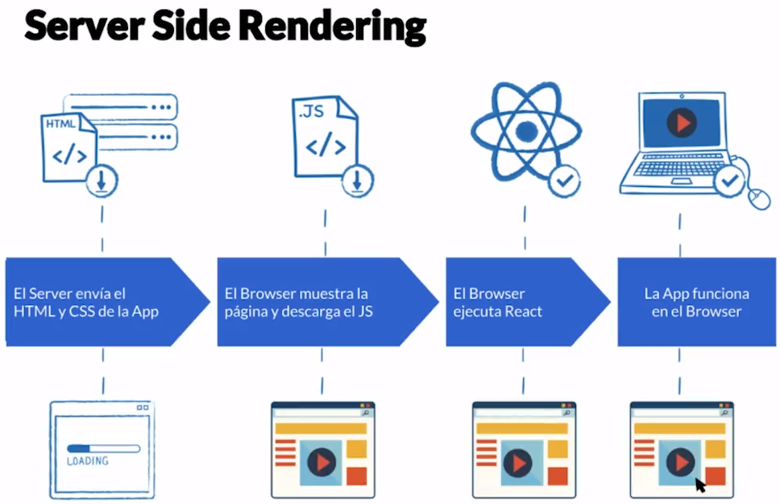

# Curso de Next.js<!-- omit in toc -->

## Tabla de Contenido<!-- omit in toc -->
- [¿Qué es Next.JS?](#qué-es-nextjs)
- [Iniciar un proyecto con Next](#iniciar-un-proyecto-con-next)
- [Style JSX](#style-jsx)
- [Archivos Estáticos](#archivos-estáticos)
- [Server Side Rendering](#server-side-rendering)
- [getInitialProps](#getinitialprops)
  - [Recibiendo Parámetros](#recibiendo-parámetros)
  - [Performance](#performance)
- [Enlazando Páginas](#enlazando-páginas)
  - [Prefetch](#prefetch)
- [Creando Componentes](#creando-componentes)
- [Header](#header)
- [Manejo de Errores](#manejo-de-errores)
- [Personalizando Errores](#personalizando-errores)
- [Personalizar Document](#personalizar-document)
- [Diseñando Urls](#diseñando-urls)
  - [Next Routes](#next-routes)
  - [Enlazando páginas con Next Routes](#enlazando-páginas-con-next-routes)
  - [Transformación de textos para urls](#transformación-de-textos-para-urls)
- [State](#state)
- [Loaders](#loaders)
- [Despliegue con Now](#despliegue-con-now)
- [Recursos Complementarios](#recursos-complementarios)
- [Enlaces de Interés](#enlaces-de-interés)

## ¿Qué es Next.JS?

Next.js es un framework para construir aplicaciones web modernas en React. Una de sus principales características es que pensado para tener una excelente experiencia como desarrollador.

<div align="right">
  <small><a href="#tabla-de-contenido">🡡 volver al inicio</a></small>
</div>

## Iniciar un proyecto con Next

Instalar las dependencias:

```bash
$ npm add next react react-dom 
```

**Scripts indispensables**

**dev**: entorno de desarrollo.  
**build** y **start**: entorno de producción

Dentro del package.json, se debe agregar:

```js
"scripts": {
  "dev": "next",
  "build": "next build",
  "start": "next start"
}
```

**Ruteo**

Next busca automáticamente todas las páginas en la carpeta **pages**.

El **router** lo que busca es el mismo nombre del la ruta (path) que tenemos en la carpeta **/pages**.

**Ejemplo**:  
`GET/`  
 Muestra el archivo en: `/pages/index.js`  
`GET/platzi`  
 Muestra el archivo en: `/pages/platzi.js`

En React, cada componente debe de retornar un solo objeto de HTML.

Ejemplo de un componente:

```js
export default class extends React.Component {
  render() {
    return (
      <div>
        <h1>Hola Mundo!</h1>
        <p>Bienvenido al curso de Nect.js</p>
      </div>
    )
  }
}
```

<div align="right">
  <small><a href="#tabla-de-contenido">🡡 volver al inicio</a></small>
</div>

## Style JSX

**Styled JSX** que es el sistema de estilos que maneja Next.js.

¿Por qué usar Style JSX?
* Es más acorde a React.
* Evitamos problemas al escalar.

**¿Cómo funciona?**
Escribimos CSS3 como siempre pero solo aplica al componente.

```jsx
<style jsx>{`
  .clase {color: red}
`}<style>
```

**Style JSX** solo se aplica por componente. Tampoco se aplica a componente internos o externos.

¿Cómo se pueden romper estas reglas?

**Atributos Globales**

`<style jsx global>`

Estos atributos se van a aplicar a toda la aplicación. No se recomienda usar atributos globales.

```jsx
<style jsx global>{`
  body {background: red}
`}<style>
```

**Operador Global**

`:global()`

Este nos permite aplicar un atributo de css de manera global. 

```jsx
<style jsx>{`
  :global(p) {color: green}
`}<style>
```

En el caso anterior, todas las etiquetas `p` van a tener el estilo `color:green`.

Si se quiere aplicar un estilo a todos los hijos de la aplicación, se puede hacer de la siguiente manera:

```jsx
<style jsx>{`
  div :global(p) {color: green}
`}<style>
```

En este caso, se aplica el `p{ color: green }` a todos los `p` que están dentro del componente. 

<div align="right">
  <small><a href="#tabla-de-contenido">🡡 volver al inicio</a></small>
</div>

## Archivos Estáticos

Next automáticamente rutea archivos estáticos en una carpeta llamada **static**.

<div align="right">
  <small><a href="#tabla-de-contenido">🡡 volver al inicio</a></small>
</div>

## Server Side Rendering

<div align="center">
  
  <small><p>Proceso del Client Side Rendering</p></small>
</div>

Con el **Client Side Rendering**, el usuario debe de esperar un tiempo significativo para poder ver la aplicación. Esto se debe a que primero debe de descargar todo el JS y luego esperar a que cargue para poder visualizar algo.

<div align="center">
  
  <small><p>Proceso del Server Side Rendering</p></small>
</div>

Con el **Server Side Rendering**, el servidor ya envía una HTML con CSS y, por ende, el usuario tiene que esperar mucho menos para tener una primera vista de la aplicación.

**¿Qué ventajas tiene?**
* Mejor Performance.
* Indexa en todos los servicios.

<div align="right">
  <small><a href="#tabla-de-contenido">🡡 volver al inicio</a></small>
</div>

## getInitialProps

 La función getInitialProps nos permite cargar el contenido principal de la página cuando tenemos que recurrir a una API.

```js
static async getInicialProps() {
  //aquí traemos los datos
  let request = await fetch('url')
  let datos = await request.json()
  return { datos }
}
```

Luego de cargar los datos, los va a agregar a los props de React.

`getInitialProps()` solamente funciona en pages y es parte de next.js. No va a funcionar con otras librerías o frameworks.

Cuando se trabaja con **Server Side Rendering**, algunos métodos dejan de funcionar. Esto se debe a que la función ya no está corriendo por el navegador sino desde el servidor. 

En este caso, vamos a instalar **isomorphic-fetch** que nos va a permitir usar fetch desde node.js.

```bash
$ npm add isomorphic-fetch
```

Para usarlo, solo debe de importarse.

```js
import 'isomorphic-fetch';
```

<div align="right">
  <small><a href="#tabla-de-contenido">🡡 volver al inicio</a></small>
</div>

### Recibiendo Parámetros

```js
// /pagina?id=54412
static async getInitialProps({query}) {
  let id = query.id;
}
```

<div align="right">
  <small><a href="#tabla-de-contenido">🡡 volver al inicio</a></small>
</div>

### Performance

Si hay varias requests, se pueden paralelizar con `Promise.all()`.

```js
let [req1, req2] = await Promise.all([
  fetch('url1'),
  fetch('url2')
])
```

<div align="right">
  <small><a href="#tabla-de-contenido">🡡 volver al inicio</a></small>
</div>

## Enlazando Páginas

Next usa un componente llamado `<Link/>` que debe de contener un `<a>`.

```jsx
import Link from 'next/link';

<Link href='/channel'>
  <a className="channel">
    click me
  </a>
</Link>
```

**Nota**: El href va en el `<Link>`. No en el `<a>`.

**Si clickeamos en un Link**:
* Client Side Rendering.
* Carga sólo lo que falta de esa página.
* Cambia la ruta en el browser.

**Si abrimos un nuebo tab**:
* Server Side Rendering.
* Carga todo el HTML, CSS y JS.
* Crea una nueva sesión.

<div align="right">
  <small><a href="#tabla-de-contenido">🡡 volver al inicio</a></small>
</div>

### Prefetch

Prefetch le indica a next que el Link es importante y que vaya precargando el contenido por adelantado y así se ahorra un poco de tiempo de carga.

Prefetch solo funciona en producción (npm run build && npm start).

```js
<Link href='/channel' prefetch>
  <a>...</a>
</Link>
```

Prefetch no precarga getInitialProps. Solo precarga HTML, CSS y JS.

¿Qué pasa si repito prefetch? Por ejemplo, si está dentro de un `map()`.  
Cada página solo se precarga una vez. 

<div align="right">
  <small><a href="#tabla-de-contenido">🡡 volver al inicio</a></small>
</div>

## Creando Componentes

La idea de un componente es identificar código duplicado o cosas que realmente no queremos copiar y pegar y separarlas en archivos independientes y reutilizables.

Se recomienda crear los componentes dentro de una carpeta **components**.

El nombre de los componentes y su respectivo archivo .js deben se escribirse en **PascalCase**.

Si se desea que un componente renderee los elementos hijos, se hace con la propiedad `props.children`.

```js
import Link from 'next/link';
import Head from 'next/head';

export default class Layout extends React.Component {
  render () {
    const { children, title } = this.props;
    return (
      <div>
        { children }
      </div>
    )
  }
}
```

<div align="right">
  <small><a href="#tabla-de-contenido">🡡 volver al inicio</a></small>
</div>

## Header

Se va a usar un componente `<Head>` en el cual se va a agregar todos los elemenetos que tiene el elemento `<head>` de Html.

```js
import Head from 'next/head';

<Head>
  <title>Título</title>
</Head>
```

<div align="right">
  <small><a href="#tabla-de-contenido">🡡 volver al inicio</a></small>
</div>

## Manejo de Errores

Cuando hacemos Server Side Rendering, nuestros servidor responde con un status.

* **Status 200**: Todo está bien.
* **Error 404**: Página no existe
* **Error 503**: Hay un probblema de red o la API no está funcionando.

Se debe de hacer un manejo de control de errores en un bloque de `try/catch`. Además se debe de agregar un `if` para manejar el status que retorna el fetch. Por último, se tiene que cambiar el `res.statusCode` para que el servidor maneje internamente el error que ocurrió.

```js
static async getInitialProps({ query }) {
  let idChannel = query.id;

  try {

    let req = await fetch('https://api.audioboom.com/channels/recommended');

    if(req.status >= 400) {
      res.statusCode = req.status;
      return { tatusCode: req.status }
    }

    //más código

    return { statusCode: 200 }

  } catch(e) {
    return { statusCode: 503}
  }
}
```

Para el manejo de errores Next.js nos da un componente llamado `<Error/>`.

```js
import Error from 'next/error';
```

Luego, dentro del componente:

```js
const { statusCode } = this.props;

if(statusCode !== 200) {
  return <Error statusCode={statusCode}/>
}
```

<div align="right">
  <small><a href="#tabla-de-contenido">🡡 volver al inicio</a></small>
</div>

## Personalizando Errores

El componente error se puede modificar creando una página **_error.js**.

```js
//Ejemplo de _error.js
import React from 'react'

export default class Error extends React.Component {
  static getInitialProps({ res, err }) {
    const statusCode = res ? res.statusCode : err ? err.statusCode : null;
    return { statusCode }
  }

  render() {
    return (
      <p>
        {this.props.statusCode
          ? `An error ${this.props.statusCode} occurred on server`
          : 'An error occurred on client'}
      </p>
    )
  }
}
```

<div align="right">
  <small><a href="#tabla-de-contenido">🡡 volver al inicio</a></small>
</div>

## Personalizar Document

Las páginas en Next saltan la definición de markup de un documento. Por ejemplo, nunca se usa `<html>` o `<body>`. Para modificar este comportamiento, se crea se crea una página **_document.js**.

Document maneja los componentes básicos que devuelve Next cuando hace Server Side Rendering. Esto solo debe de hacerse cuando es necesario.

Document solo se usa para renderizar Server Side y no debería tener nada funcional.

**¿Cuándo modificarlo?**
* Google AMP
* Facebook Instant Pagees
* Plugins como Styles Components

```js
// ./pages/_document.js
import Document, { Head, Main, NextScript } from 'next/document'

export default class MyDocument extends Document {
  static async getInitialProps(ctx) {
    const initialProps = await Document.getInitialProps(ctx)
    return { ...initialProps }
  }

  render() {
    return (
      <html>
        <Head>
          <style>{`body { margin: 0 } /* custom! */`}</style>
        </Head>
        <body className="custom_class">
          <Main />
          <NextScript />
        </body>
      </html>
    )
  }
}
```

<div align="right">
  <small><a href="#tabla-de-contenido">🡡 volver al inicio</a></small>
</div>

## Diseñando Urls

Principios para crear Urls user friendly:

**1. Legibilidad**: Deben ser entendibles por nuestros usuarios.

>//Esto no es legible  
/channel?id=156486
>
>//Esto si  
/Posta

**2. Consistencia**: Deberíamos poder borrar cualquier fragmento.

>/podcast/un-buen-dia  
>/channel/posta  
>/channel  
>/  

En el caso anterior, no se cumple con la consistencia en las urls. Por ejemplo, `/podcast` no tendría sentido puesto que siempre se necesita de un posdcast para reproducirlo. Por otro lado, `/channel` tampoco tendría sentido ya que `/` muestra lo mismo.

Una mejor propuesta sería:  
`/nombre-serie/nombre-podcast`

>/posta/un-buen-dia  
>/posta  
>/

Con esta estructura, si se usa solo el primer fragmento de urls, `/posta`, se mostraría todos los podcast de la serie posta. Del mismo modo, si se ingresa a `/posta/un-buen-dia `, se estaría mostrando el podcast *un buen día* de la seria *posta*.

<div align="right">
  <small><a href="#tabla-de-contenido">🡡 volver al inicio</a></small>
</div>

### Next Routes

Next Routes permite asignar un nombre a una url con Next.

Con Next Routes, el router de Next por defecto no sirve. 

```bash
$ npm install next-routes --save
```

Para usar Next Routes, se debe de configurar server.js.

```js
const next = require('next')
const routes = require('./routes')
const app = next({ dev: process.env.NODE_ENV !== 'production' })
const handler = routes.getRequestHandler(app)
const port = process.env.PORT || 3000;

const { createServer } = require('http')
app.prepare().then(() => {
  createServer(handler).listen(port)
})
```

Para definir las rutas, se hace con un archivo routes.js.

```js
const routes = require('next-routes')

// .add(nombre, url, archivo.js)      
module.exports = routes()        
  .add('index')
  .add('channel', '/:slug.:id', 'channel')
  .add('podcast', '/:slugChannel.:id/:slung.:id', 'podcast')                  
```

<div align="right">
  <small><a href="#tabla-de-contenido">🡡 volver al inicio</a></small>
</div>

### Enlazando páginas con Next Routes

**Next Routes** usa otro tipo de componente `<Link>` para enlazar página.

```js
import {Link} from '../routes';

<Link route='channel' params={{ 
  slug: slug(channel.title), 
  id: channel.id }}>
  <a>Enlace</a>
</Link>
```
* **route**: es el nombre del enlace definido en routes.js
* **params**: son los parámetros definidos en routes.js. Nótese las doble `{{}}`.

<div align="right">
  <small><a href="#tabla-de-contenido">🡡 volver al inicio</a></small>
</div>

### Transformación de textos para urls

Para transformar un texto en un formato que sea compatible con las urls, por ejemplo, para transformar un título, se va a usar una librería llamada **slugify**.

```bash
$ npm install slugify
```

Luego, para usarlo, se puede realizar de la siguiente manera:

```js
import slugify from 'slugify';

export default function slug(name) {
  return slugify(name, { lower: true }).replace(/[^\w\-]+/g, '')
}
```

<div align="right">
  <small><a href="#tabla-de-contenido">🡡 volver al inicio</a></small>
</div>

## State

Estate se usa para definir el estado interno de un componente. A diferencia de los props, estate puede ser modificado.

Para usar state, primero debe de inicializarse en un constructor:

```js
constructor(props) {
  super(props);
  this.state = { openPodcast: null }
}
```

`this.setState()` cambia el estado interno de un componente. 

```js
this.setState({
  openPodcast: podcast
})
```

Para obtener un estado, se puede hacer de la siguiente manera:

```js
const { openPodcast } = this.state;
```

<div align="right">
  <small><a href="#tabla-de-contenido">🡡 volver al inicio</a></small>
</div>

## Loaders

Se va a usar **nprogress** para mostrar un loader al cargar las páginas.

```bash
$ npm add nprogress
```

Para usarlo, se debe agregar las siguientes líneas de código al inicio del componente princioan o Layout:

```js
import NProgress from 'nprogress';
import Router from 'next/router';

Router.onRouteChangeStart = (url) => {
  NProgress.start()
}
Router.onRouteChangeComplete = () => NProgress.done()
Router.onRouteChangeError = () => NProgress.done()
```

Además se debe de agregar la [hoja de estilos de nprogress](https://raw.githubusercontent.com/zeit/next.js/canary/examples/with-loading/static/nprogress.css) a los estilos globales del proyecto.

<div align="right">
  <small><a href="#tabla-de-contenido">🡡 volver al inicio</a></small>
</div>

## Despliegue con Now

Para desplegar la aplicación en [Now.sh](https://zeit.co/now) se va a instalar now de manera global.

```bash
$ npm install -g now
```

Se puede hacer un deploy en el plan gratuito. El plan gratuito hace que el código fuente de tu aplicación sea libre.

```bash
$ now --public
```

<div align="right">
  <small><a href="#tabla-de-contenido">🡡 volver al inicio</a></small>
</div>

## Recursos Complementarios
* [Diapositivas del Curso](docs/slides.pdf)

<div align="right">
  <small><a href="#tabla-de-contenido">🡡 volver al inicio</a></small>
</div>

## Enlaces de Interés
* [Curso de Next.js](https://platzi.com/clases/next-js/)
* [Github: platzi-nextjs](https://github.com/Aerolab/platzi-nextjs)
* [Next.js](https://github.com/zeit/next.js)
* [Next Routes](https://github.com/fridays/next-routes)
* [NProgress.js](http://ricostacruz.com/nprogress/)
* [NProgress CSS](https://raw.githubusercontent.com/zeit/next.js/canary/examples/with-loading/static/nprogress.css)

<div align="right">
  <small><a href="#tabla-de-contenido">🡡 volver al inicio</a></small>
</div>