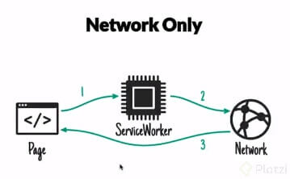
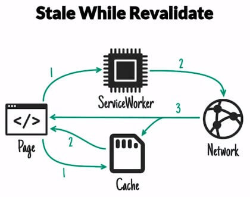

# Curso de Progressive Web Apps con React.js<!-- omit in toc -->

## Tabla de Contenido<!-- omit in toc -->
- [¿Qué es una PWA?](#qué-es-una-pwa)
- [Progressive Web App vs. Native App](#progressive-web-app-vs-native-app)
- [Creación del Proyecto](#creación-del-proyecto)
- [Google Lighthouse](#google-lighthouse)
- [Web Manifest](#web-manifest)
- [Ngrok](#ngrok)
- [Service Worker](#service-worker)
- [Estrategias de Carga](#estrategias-de-carga)
- [Workbox](#workbox)
- [Google Analytics Offline](#google-analytics-offline)
- [Web Share API](#web-share-api)
- [Trabajando Offline](#trabajando-offline)
- [Notificaciones](#notificaciones)
- [Recursos Complementarios](#recursos-complementarios)
- [Enlaces de Interés](#enlaces-de-interés)

## ¿Qué es una PWA?

No hay una definición concreta sobre que es una PWA. Lo mejor es entender como es el panorama actual.

**¿Cómo es la web hoy?**

* Spoiler Alert: No funciona muy bien en mobile.
* Más del 50% de nuestros usuarios está en mobile.
* Tenemos malas conexiones en los dispositivos móviles, conexiones tipo 3G y LTE no son particularmente confiables. Esto genera que un sitio promedio tarda 14 segundos en cargar en mobile.
* La UX no es solamente el diseño de nuestra app, tiene que ver con que tan rápido funciona nuestra aplicación en el mundo real, con un teléfono que tiene una conexión mala.

Hay estudios que demuestran la importancia de lograr que tu sitio funcione rápidamente en dispositivos móviles:
* 50% de los usuarios se van de un sitio que tarda más de 3 segundos en cargar.
* Cada segundo de demora nos cuesta un 5-10% de nuestras ventas.

**Ventajas**:
* Mejor Experiencia de Usuario
* Estar en la Home Screen
* No hay apps Stores
* Dar soporte Offline.

**¿Qué es una PWA?**
Un estándar de calidad, de como debería ser la web pensada primera para mobile.

<div align="right">
  <small><a href="#tabla-de-contenido">🡡 volver al inicio</a></small>
</div>

## Progressive Web App vs. Native App

**Similitudes**
* Trabajar Offline
* Recibir notificaciones
* Ser instaladas en la HomeScreen

**Diferencias**:

**Las Apps Nativas:**
* Acceso de mejor calidad a las funcionalidades nativas de Android y iOS
* Mayor libertad para crear apps avanzadas
* Mejor performance
* Mejores funcionalidades específicas de cada plataforma

**Las PWAs:**
* Mejor desempeño en SEO
* Más sencillo conseguir y convertir usuarios
* Son mejores para sitios de medios, noticias o aplicaciones virales
* Costos de producción menores
* Facilidad para conseguir usuarios

Al momento de decidir deberíamos hacernos la siguiente pregunta:

**¿Podemos crear una experiencia de usuario dramáticamente SUPERIOR con una app nativa?**

<div align="right">
  <small><a href="#tabla-de-contenido">🡡 volver al inicio</a></small>
</div>

## Creación del Proyecto

Crear el proyecto usando `create-react-app`.

```bash
create-react-app platzi-recetas
```

Luego, instalar **react-helmet**, **react-router-dom** y **serve**

```bash
npm i react-helmet react-router-dom serve
```

Finalmente, agregar los scripts en el package.json.

```json
"scripts": {
  "dev": "react-scripts start",
  "start": "serve ./build -s -p ${PORT:-4000}",
  "build": "react-scripts build",
  "test": "react-scripts test --env=jsdom",
  "eject": "react-scripts eject"
}
```

<div align="right">
  <small><a href="#tabla-de-contenido">🡡 volver al inicio</a></small>
</div>

## Google Lighthouse

Es una herramienta oficial de Google que viene con Chrome, con la cual podemos hacer un diagnóstico a una Web App. Estos diagnósticos se centran en Performance y Accesibilidad, pero también tiene una herramienta para diagnosticar si nuestra Web App se considera una PWA o no y qué pasos debemos de tomar para que lo sea.

Lighthouse no sustituye hacer pruebas con un dispositivo móvil real, siempre realiza pruebas en un dispositivo móvil.

El diagnostico de Performance nos muestra dos de los conceptos más importantes en performance: First meaningful Paint y First interactive.

**First meaningful Paint** o primer pintado significativo señala cuanto tiempo tardo el navegador en renderizar la aplicación de una forma que tenga sentido. Generalmente queremos que este situado entre 1 y 2 segundos.

**First interactive** o primera interacción, señala el tiempo cuando ya se cargó React, inicializo la aplicación y que podamos correr comandos dentro de la aplicación.

**¿Cómo bajamos estos tiempos?**

Para bajar el Time To First Meaningful Paint podemos hacer Server Side Rendering, reducir el tamaño de nuestro HTML y CSS o simplemente teniendo servidores más rápidos.

El Time To Interactive tiene mucho que ver con el framework que estemos utilizando, usualmente queremos que tarde menos de 5 segundos.

<div align="right">
  <small><a href="#tabla-de-contenido">🡡 volver al inicio</a></small>
</div>

## Web Manifest

El web manifest permite implementar la funcionalidad de Add to Homescreen.

Create-react-app nos da un Web Manifest pre armado el cual debemos configurar. Todo lo que tiene que ver con nuestro Web Manifest está dentro de los archivos index.html y manifest.json de la carpeta public de nuestro proyecto.

En el **manifest.json** se pueden ver varios atributos:
* **short_name**: Es el nombre que se utiliza en la Homescreen.
* **name**: Es el nombre de nuestra aplicación.
* **icons**: Especifica un array de imágenes que servirán como iconos de la aplicación. Cambiaremos el "favicon.ico" por "icon.png", especificamos el tamaño a 512x512 y el tipo a "image/png".
* **start_url**: Nos indica en que página comienza nuestra aplicación, por compatibilidad siempre conviene que sea "/" en lugar de "./index.html".
* **display**: Define el modo de visualización para la aplicación. Standalone significa que la aplicación puede correr por su misma.
* **theme_color**: Define qué color vamos a usar en la barra de tareas de Android para que combine con nuestra aplicación.
* **related_applications**: Sirve si queremos que Chrome en el Add to Homescreen recomiende una aplicación del Store.

```json
{
  "short_name": "Recetas",
  "name": "Platzi Recetas",
  "icons": [
    {
      "src": "/icon.png",
      "sizes": "512x512",
      "type": "image/png"
    }
  ],
  "start_url": "/",
  "scope": "/",
  "display": "standalone",
  "theme_color": "#ffa500",
  "background_color": "#ffffff",
  "related_applications": [],
  "prefer_related_applications": false
}
```

Finalmente, hay que linkear el manifest en el HTML.

```html
<link rel="manifest" href="manifest.json">
```

En iOS necesitamos añadir alguna metadata al index.html de nuestro proyecto. Al momento de probar nuestra aplicación en iOS nos daremos cuenta de que el Add to Homescreen en este caso debe ser añadido manualmente por el usuario.

```html
<link rel='apple-touch-icon' href='/icon.png' />
<meta name='apple-mobile-web-app-title' content='PlatziRecetas' />
<meta name='apple-mobile-web-app-capable' content='yes' />
<meta name='apple-mobile-web-app-status-bar-style' content='black-translucent' />
```

<div align="right">
  <small><a href="#tabla-de-contenido">🡡 volver al inicio</a></small>
</div>

## Ngrok

Para probar nuestro Add to Homescreen debemos tener en cuenta que un requisito fundamental de las PWA es que todo funcione con HTTPS.

Para esto, se va a usar Ngrok que permite tener un tunel con un servidor https que dirige a nuestra computadora. De este modo se puede correr una PWA con https.

Ngrok se puede instalar [aquí](https://ngrok.com/download).

Luego de eso, se corre el comando `ngrok http [puerto]`

```bash
ngrok http 5000
```

Se creará un enlace el cual puede ser abierto desde cualquier dispositivo.

<div align="right">
  <small><a href="#tabla-de-contenido">🡡 volver al inicio</a></small>
</div>

## Service Worker

Es lo que hace posible que las PWA funcionen, es un script que nuestro navegador corre detrás de escena y este no puede tocar el DOM.

Podemos tener control absoluto a nivel red de nuestra aplicación gracias a los service workers.

**Features del Service Workers**:
* Soporte Offline
* Proxy In-Browser
* Push Notifications

<div align="right">
  <small><a href="#tabla-de-contenido">🡡 volver al inicio</a></small>
</div>

## Estrategias de Carga

Existen diferentes estrategias de carga.

**Network Only**

La primera y fundamental se llama Network Only. Esta se encarga checar si hay conexión a internet, si existe una conexión realiza la petición de información, en caso de no haber conexión se rompe la página.

¿Cuándo usar Network Only?
Por defecto si no queremos cache o manejamos información en tiempo real.

<div align="center">
  
  <small><p>Network Only</p></small>
</div>

**Network First**

Network First es otra estrategia de carga, se encarga mandar la petición a internet, si la conexión a internet esta caída entonces tomara la información que tenga almacenada en cache.

¿Cuándo usar Network First?
Cuando queremos la última versión de un asset y tener soporte offline.

<div align="center">
  
  <small><p>Network First</p></small>
</div>

**Cache First**

Es una estrategia de carga que lo primero que hace es ir al cache y si encuentra el recurso lo sirve directamente. En caso de no encontrarlo va a ir a red, guardar la información en cache y servir esa versión.

Esta estrategia puede ser peligrosa y solo es recomendable cuando queremos máxima velocidad y estamos manejando un recurso que nunca cambia, como una imagen o alguna fuente.

<div align="center">
  
  <small><p>Cache First</p></small>
</div>

**Stale While Revalidate**

Esta es una estrategia de carga muy particular y que mejor funciona a la hora de mejorar el rendimiento. Lo que hace es ir a cache y a red al mismo tiempo, toma la versión más rápida que siempre será la de cache y en cuanto recibe la de red va a actualizar la versión de cache.

Es recomendable esta estrategia cuando queremos mucha velocidad y estamos manejando un recurso que puede estar levemente desactualizado.

<div align="center">
  
  <small><p>Stale While revalidate</p></small>
</div>

<div align="right">
  <small><a href="#tabla-de-contenido">🡡 volver al inicio</a></small>
</div>

## Workbox

Los service workers solo funcionan en producción.

Una recomendación siempre que trabajemos con service workers es ir a Clear Storage en la tab de Application de las DevTools, y limpiar la información del sitio. Esto desinstalara todo lo que es cache y limpiara los service workers.

Quienes habrán prestado atención a la documentación de create-react-app habrán leído que este incluye un service worker.

El service worker de Create React App hace algo llamado "SW Precache", lo que hace es precargar y dejar disponibles offline todos los archivos necesarios para correr la aplicación. Una recomendación a la hora de hacer debugging es refrescar el sitio pues un service worker por lo general se inicializa después de la primera carga.

NUNCA conviene escribir nuestro propio service worker especialmente con herramientas de bajo nivel.

Para implementar nuestro propio service worker usaremos Workbox, una librería creada por Google para crear Service Workers.

Hay un pequeño detalle al momento de implementar Workbox en nuestro proyecto y es que estamos yendo en contra de los principios de Create React App y esto solo significa una cosa “eject”, esto nos llenaría de archivos que no nos sirven. Para evitar hacer eject vamos a instalar react-app-rewired y el plugin para webpack de workbox.

```bash
npm add workbox-webpack-plugin react-app-rewire-workbox react-app-rewired
```

Luego hay que crear un archivo **config-overrides.js** en el cual se va a hacer el rewiring de create-react-app. Este va a permitir modificar la configuración interna. 

```js
const { defaultInjectConfig, rewireWorkboxInject } = require('react-app-rewire-workbox')
const path = require('path');

module.exports = function override(config, env) {
  if (env === "production") {
    console.log("Generating Service Worker")

    const workboxConfig = {
      ...defaultInjectConfig,
      swSrc: path.join(__dirname, 'src', 'service-worker.js')
    }
    config = rewireWorkboxInject(workboxConfig)(config, env)
  }

  return config;
}
```

Luego hay que crear el service worker en **src/service-worker.js**.

```js
/**
 * The workboxSW.precacheAndRoute() method efficiently caches and responds to
 * requests for URLs in the manifest.
 * See https://goo.gl/S9QRab
 */

// Precarga la app
self.__precacheManifest = [].concat(self.__precacheManifest || [])

//Eliminar los warnings
workbox.precaching.suppressWarnings()
//Toma el precatch manifest (js, css, indext.html) y los va a guardar detrás de escena.
workbox.precaching.precacheAndRoute(self.__precacheManifest, {})

// App Shell
workbox.routing.registerNavigationRoute('/index.html')

//Stale to revalidate en la api
workbox.routing.registerRoute(/^https?:\/\/www.themealdb.com\/api\/.*/, workbox.strategies.staleWhileRevalidate(), 'GET')

//Cache first para las fonts
workbox.routing.registerRoute(/^https:\/\/fonts.(?:googleapis|gstatic).com\/(.*)/,
  workbox.strategies.cacheFirst({
    cacheName: 'google-fonts-cache',
    plugins: [
      new workbox.expiration.Plugin({
        maxAgeSeconds: 30 * 24 * 60 * 60
      })
    ]
  }),
  'GET')

//network first para todas las https con método get
workbox.routing.registerRoute(/^https?.*/, workbox.strategies.networkFirst(), 'GET')
```

Nota: Al momento de escribir nuestras estrategias en Workbox SI IMPORTA el orden en que pongamos las cosas, si queremos una estrategia o regla por defecto debemos poner esa regla hasta el final de todo.

Finalmente, hay que cambiar los scripts de dev, build y test del package.json:

```js
"scripts": {
  "dev": "react-app-rewired start",
  "build": "react-app-rewired build",
  "test": "react-app-rewired test --env=jsdom"
}
```

<div align="right">
  <small><a href="#tabla-de-contenido">🡡 volver al inicio</a></small>
</div>

## Google Analytics Offline

Como primer paso debemos incorporar react-ga, un plugin que nos permite correr Google Analytics dentro de React.

```bash
$ npm i react-ga
```

Luego, hay que activar el tracking de Google Analytics de la siguiente forma:

```js
import { Router } from "react-router-dom"

import { createBrowserHistory } from 'history'
import ReactGA from 'react-ga'

//Crear una historia para extender los métodos del router
const history = createBrowserHistory()

//Inicializar el tracking
ReactGA.initialize('UA-000000-01')

//Track a la page inicial
ReactGA.pageview(window.location.pathname + window.location.search)

//Cuando el usuario cambie se página se haga track del pageview
history.listen((location) => {
  ReactGA.pageview(window.location.pathname + window.location.search)
})

export default class App extends React.Component {
  render() {
    return (
      <Router history={history}>
      </Router>
    );
  }
}
```

Finalmente, para habilitar google analytics de modo offline, se debe de inicializar en el service worker.

```js
workbox.googleAnalytics.initialize();
```

<div align="right">
  <small><a href="#tabla-de-contenido">🡡 volver al inicio</a></small>
</div>

## Web Share API

Web Share API es una API reciente de Android que nos permite usar el Share nativo del sistema operativo.

Para implementarlo hay que tener presente que solo funcionara si hacemos click a algún link, esto es una medida de precaución para que nadie abuse de la API obligándonos a tener que compartir algo que no queremos. Además, Web Share API por el momento solo funciona en Android así que tenemos que detectar si tenemos la característica para poder usarla.

Web Share API solamente funciona con HTTPS.

```js
compartir = (e) => {
  e.preventDefault()
  if (!navigator.share) {
    alert("Tu browser no soporta la Web Share API");
    return;
  }

  navigator.share({
    title: document.title,
    text: 'Receta de Platzi',
    url: document.location.href
  })
  .then(() => alert('Contenido compartido!'))
}
```

<div align="right">
  <small><a href="#tabla-de-contenido">🡡 volver al inicio</a></small>
</div>

## Trabajando Offline

Mostrarle al usuario que se encuentra offline va a mejorar en mucho la UX.

La forma de saber si la aplicación esta offline u online es a través de una variable llamada Navigator.onLine, algo muy importante a tener en cuenta es que la variable nos va a decir que estamos online siempre y cuando no estemos offline lo cual significa que si el usuario tiene mala conexión a internet igual va a marcar como online.

La forma correcta de checar si el navegador esta online u offline es con dos eventos que se añaden a window, "offline" y "online".

```js
import React from 'react'

export default class IdOffline extends React.Component {
  
  constructor(props) {
    super(props)
    this.state = {
      onLine: navigator ? navigator.onLine : true
    }
  }

  componentDidMount() {
    if(!window) return
    
    window.addEventListener('online', this.goOnline)
    window.addEventListener('offline', this.goOffline)
  }

  componentWillUnmount() {
    if (!window) return

    window.removeEventListener('online', this.goOnline)
    window.removeEventListener('offline', this.goOffline)
  }

  goOnline = () => this.setState({ onLine: true })
  goOffline = () => this.setState({ onLine: false })

  render () {
    const {children} = this.props
    const { onLine } = this.state

    if(onLine) return null
    
    return <span>{ children }</span>
  }
}
```

<div align="right">
  <small><a href="#tabla-de-contenido">🡡 volver al inicio</a></small>
</div>

## Notificaciones

Una de las funcionalidades más populares de las PWA son las Notificaciones.

Hay que tener en cuenta que, si el usuario apenas entra a nuestro sitio y le aparece un mensaje para permitir las notificaciones esto está afectando la UX, por lo cual debemos darle un contexto de porque le vamos a enviar notificaciones a nuestro usuario.

Existen tres tipos de permiso para las notificaciones:

* **Estado por defecto**: no sabemos si podemos enviar notificaciones o no, aquí es donde debemos preguntarle al usuario si quiere recibir las notificaciones.
* **Granted**: el usuario ha concedido el permiso.
* **Denied**: directamente no podemos enviar las notificaciones.

Primero que nada, debemos preguntar si nuestro navegador puede mandar notificaciones. Para ello vamos a checar si hay un objeto Notification en window y un Service Worker en el navegador, esto es así debido a que en Android necesitamos un Service Worker para que las notificaciones funcionen. En iOS no hay soporte para notificaciones.

```js
//Verificar si el browser soporta notificaciones
if(!('Notification' in window) || !('serviceWorker' in navigator)) {
  return alert('Tu browser no soporta notificaciones')
}

//Si las notificaciones se encuentran por defecto
if(Notification.permission === 'default') {
  await Notification.requestPermission()
}

//Si las notificaciones se encuentran bloqueadas
if (Notification.permission === 'blocked') {
  alert('Bloqueaste las notificaciones')
}

//Si las notificaciones tienen algún permiso que no sea habilitado
if(Notification.permission !== 'granted') {
  return
}
```

Luego, para mostrar una notificación, solo hay que usar `registration.showNotification`.

```js
showNotification = async () => {
  //Obtener la registración del service worker
  const registration = await navigator.serviceWorker.getRegistration()

  if(!registration) return alert("No hay un service worker")

  registration.showNotification("Listo el timer!", {
    body: 'Ding ding ding',
    img: '/icon.png'
  })
}
```

<div align="right">
  <small><a href="#tabla-de-contenido">🡡 volver al inicio</a></small>
</div>

## Recursos Complementarios
* [Diapositivas del Curso](docs/slides.pdf)

<div align="right">
  <small><a href="#tabla-de-contenido">🡡 volver al inicio</a></small>
</div>

## Enlaces de Interés
* [Curso de Progressive Web Apps con React.js](https://platzi.com/clases/pwa-react-js)
* [Repositorio del Curso](https://github.com/Aerolab/platzi-pwa)
* [Pwastats](pwastats.com)
* [Wpostats](wpostats.com)
* [Web App Manifest](https://developer.mozilla.org/en-US/docs/Web/Manifest)
* [Ngrok](https://ngrok.com)
* [Workbox](https://developers.google.com/web/tools/workbox/)
    
<div align="right">
  <small><a href="#tabla-de-contenido">🡡 volver al inicio</a></small>
</div>