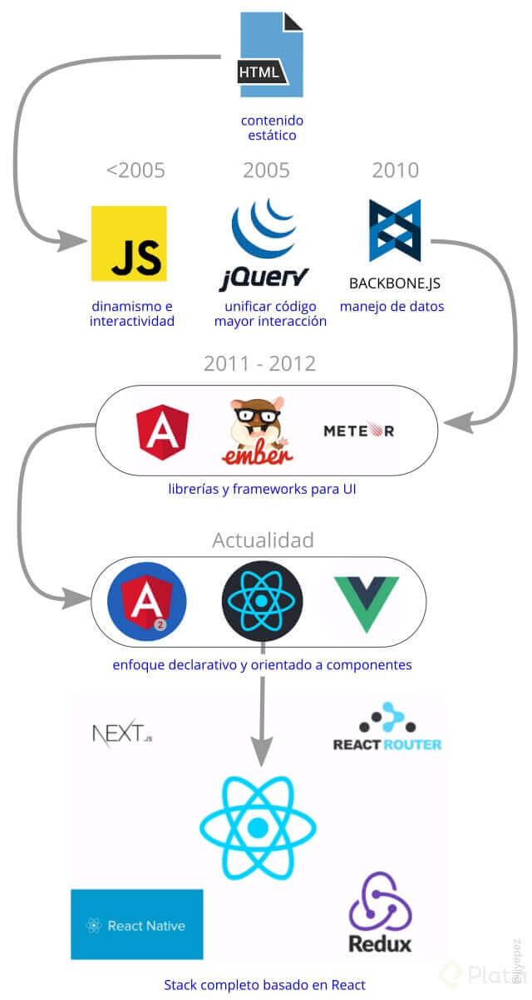
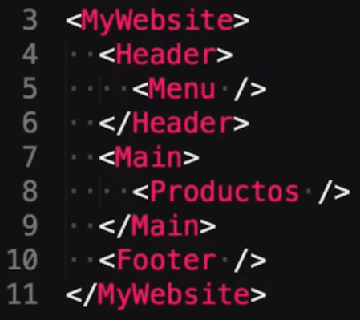

# Curso de React.js

React = Librería de JavaScript para construir interfaces de usuarios.

Las necesidades del Frontend han ido en aumento a medida que han pasado los años. Todo el enfoque ha sido encaminado a mejorar todos los aspectos que hagan que la experiencia de usuario sea mucho mejor, esto le ha dado más responsabilidades al área de Frontend.



**Particularidades de ReactJS**
* Declarativo. Es muy sencillo escribir interfaces y poderlas leer.

* Basado en componentes. Crear aplicaciones con React es como jugar con Legos donde cada ficha es un componenete.
* Aprende de una vez y escribe donde quieras.

**Librerías de React**
* `React` El core. Construye interfaces e interacción.
* `React router` Navegar sin recargar el browser.
* `Redux` Manejar el estado global de la aplicación.
* `React Native` Interfaces de aplicaciones mobiles.
* `Next.js` Framework en el servidor.

## Instalación de React

**create-react-app** 

Es un boilerplate (estructura de archivos y paquetes base) para iniciar un proyecto en React de manera fácil.

```bash
$ npm install -g create-react-app 
```

Para arrancar la aplicación react se usa el comando `create-react-app`.

```bash
$ create-react-app app-name
```

**Instalación Customizada**

Iniciar un proyecto de Javascript

```bash
$ npm init
```

En el `package.json` que se ha creado, agregar las siguientes dependencias de desarrollo:

```json
"devDependencies": {
  "babel-core": "^6.26.3",
  "babel-loader": "^7.1.5",
  "babel-preset-es2015": "^6.24.1",
  "babel-preset-react": "^6.24.1",
  "babel-preset-stage-2": "^6.24.1",
  "clean-webpack-plugin": "^0.1.19",
  "css-loader": "^1.0.0",
  "extract-text-webpack-plugin": "^4.0.0-beta.0",
  "file-loader": "^1.1.11",
  "optimize-css-assets-webpack-plugin": "^4.0.3",
  "style-loader": "^0.21.0",
  "uglifyjs-webpack-plugin": "^1.2.7",
  "url-loader": "^1.0.1",
  "webpack": "^4.15.1",
  "webpack-cli": "^3.0.8",
  "webpack-dev-server": "^3.1.4"
}
```

Instalar las dependencias de desarrollo.

```bash
$ npm install
```

Se usará Webpack para la traspilacipón de archivos. Para eso se tiene que configurar los archivos de configuración tanto para producción como desarrollo:

```javascript
//webpack.config.js
const path = require("path");
const ExtractTextPlugin = require("extract-text-webpack-plugin");
const CleanWebpackPlugin = require("clean-webpack-plugin");
const UglifyJsPlugin = require("uglifyjs-webpack-plugin");
const OptimizeCSSAssetsPlugin = require("optimize-css-assets-webpack-plugin");

module.exports = (env) => {
  const plugins = [
    new ExtractTextPlugin("css/[name].[hash].css")
  ]

  if (env.NODE_ENV === "production") {
    plugins.push(
      new CleanWebpackPlugin(["dist"], { root: __dirname })
    )
  }

  return {
    mode: "production",
    entry: {
      "platzi-video": path.resolve(__dirname, "index.js")
    },
    output: {
      path: path.resolve(__dirname, "dist"),
      filename: "js/[name].[hash].js",
      publicPath: path.resolve(__dirname, "dist") + "/",
      chunkFilename: "js/[id].[chunkhash].js"
    },
    devServer: {
      port: 9000
    },
    module: {
      rules: [
        {
          test: /\.(js|jsx)$/,
          exclude: /(node_modules)/,
          use: {
            loader: "babel-loader",
            options: {
              presets: ["es2015", "react", "stage-2"]
            }
          }
        },
        {
          test: /\.css$/,
          use: ExtractTextPlugin.extract({
            use: [
              {
                loader: "css-loader",
                options: {
                  minimize: true
                }
              }
            ]
          })
        },
        {
          test: /\.(jpg|png|gif)$/,
          use: {
            loader: "url-loader",
            options: {
              limit: 10000,
              fallback: "file-loader",
              name: "images/[name].[hash].[ext]"
            }
          }
        },
        {
          test: /\.(woff|eot|ttf|svg)$/,
          use: {
            loader: "url-loader",
            options: {
              limit: 10000,
              name: "fonts/[name].[ext]"
            }
          }
        }
      ]
    },
    plugins,
    optimization: {
      minimizer: [
        new UglifyJsPlugin(),
        new OptimizeCSSAssetsPlugin({})
      ]
    }
  }
}
```
```javascript
//webpack.dev.config.js
const path = require("path");

module.exports = {
  mode: "development",
  entry: {
    "platzi-video": path.resolve(__dirname, "index.js")
  },
  output: {
    path: path.resolve(__dirname, "dist"),
    filename: "js/[name].js"
  },
  devServer: {
    port: 9000
  },
  module: {
    rules: [
      {
        test: /\.(js|jsx)$/,
        exclude: /(node_modules)/,
        use: {
          loader: "babel-loader",
          options: {
            presets: ["es2015", "react", "stage-2"]
          }
        }
      },
      {
        test: /\.css$/,
        use: ["style-loader", "css-loader"]
      },
      {
        test: /\.(jpg|png|gif)$/,
        use: {
          loader: "url-loader",
          options: {
            limit:100000,
            fallback: "file-loader",
            name: "images/[name].[hash].[ext]"
          }
        }
      },
      {
        test: /\.(woff|eot|ttf|svg)$/,
        use: {
          loader: "url-loader",
          options: {
            limit:100000, //Hasta qué limite de bytes va a hacer una transfortmación a base64
            name: "fonts/[name].[ext]"
          }
        }
      }
    ]
  }
}
```
Agregar los scripts para usar Webpack en el `package.json`.

```json
"scripts": {
  "build:dev": "webpack-dev-server --config ./webpack.dev.config.js",
  "build": "webpack",
  "build:local": "webpack --env.NODE_ENV=local",
  "build:prod": "webpack -p --env.NODE_ENV=production"
}
```

Correr uno de los scripts de acuerdo a la necesidad:

```bash
$ npm run build
$ npm run build:dev
$ npm run build:local
$ npm run build:prod
```

Por último, parsa usar React se debe de instalar `react` y `react-dom`.

```bash
npm install react react-dom
```

## Bases de React

React sirve para crear componentes de la aplicación y dividirlo en bloques.

### React DOM

ReactDOM sirve para renderizar en el navegador.

ReactDOM.render recibe dos parámetros
1. Qué se va a renderizar.
2. Donde se va renderizar.

```javascript
import React from "react";
import ReactDOM from "react-dom";

const app = document.getElementById("app");
const holaMundo = <h1>hola mundo</h1>;

ReactDOM.render(holaMundo, app);
```

### Componentes

Existen tres tipos de componentes:
* `Funcional` Este tipo de componentes se definen como funciones y no tienen estados ni trabajan con ellos.
* `Puro` Se implementan como clases, pero en este caso, van a extender de React.PureComponent.
* `Normal o de Estado` Utilizan la encapsulación en clases. Tienen un estado que definen y actualizan.

Los componentes deben de seguir estas reglas:
* Se escriben en Pascal Case. 
* Se usa la sintaxis `JSX` para contruir los elementos.
* Se puede usar la extensión `.js` o `.jsx`.
* Se debe de exportar el componente para que pueda ser usado posteriormente.

Ejemplo de un componente:

```jsx
//HolaMundo.jsx
import React, { Component } from "react";

class HolaMundo extends Component {
  render() {
    return (
      <h1>Hola Mundo</h1>
    )
  }
}

export default HolaMundo;
```

Ejemplo de cómo usar un componente:

```jsx
//index.js
import React from "react";
import { render } from "react-dom";
import HolaMundo from "./src/js/components/HolaMundo.jsx";

render(<HolaMundo/>, app);
```

### Estilos CSS

**Estilos inline**

* Los estilos se crean como si fueran un objeto json.
* Por convensión, las propiedades se escriben en `Cammel Case`.
* El tamaño por defecto es px. Esto quiere decir que no es necesario agregarlo cuando esta sea la medida a aplicar.

```jsx
import React, { Component } from "react";

class Media extends Component {
  render() {

    const styles = {
      container: {
        fontSize: 14
      }
    }

    return (
      <div style={styles.container}></div>
    )
  }
}

export default Media;
```

**Archivos .css**

Los archivos `.css` se importan con un import dentro del archivo `.js` o `.jsx`.

```javascript
import "./media.css";
```

Para usarlos dentro de un elementos JSX se usa el atributos `className`.

```html
<div className="Media">
```

### Propiedades

Lo que se conoce como `atributos` en HTML, se llama `propiedades` en JSX.

#### Pasar propiedades a un componente

Al crear un componente se requiere que estos tengan datos dinámicos de tal manera que se puedan reutilizar. 

Para esto, podemos pasar las propiedades a los componentes en el momento que los referenciamos.

```jsx
render(<Media title="¿Qué es responsive design?"/>, app);
```

Para indicar en dónde se va a poner la propiedad dentro del componente se usa `this.props`.

```jsx
<h1>{this.props.title}</h1>
```

También se puede extraer la propiedad de this.props y usarlas de una forma más directa en el componente.

```javascript
const {title} = this.props; 
```

```jsx
<h1>{title}</h1>
```

#### Validado de propiedades

Es importante validar las propiedades para que el componente pueda funcionar correctamente.

Para realizar el validado se va a usar `prop-types`.

```bash
npm install prop-types -D
```

Para usar prop-types primero hay que importarlo.

```js
import PropTypes from "prop-types";
```

Para realizar las respectivas validaciones se va a usar `Media.propTypes`. Esto se agrega al final del componente (entre la clase y el export) y contiene las validaciones respectivas por cada propiedad.

**Tipo de dato**

Para validar el tipo de dato a recibir, se agrega `PropTypes` seguido del tipo de dato que se recibir. 

```js
Media.propTypes = {
  image: PropTypes.string
}
```
Los tipos de `PropTypes` que se pueden recibir son los siguientes:
* `func` Funcione
* `string` Texto
* `object` Objeto
* `bool` Booleano
* `number` Número
* `array` Array

**Lista de elementos**

```js
Media.propTypes = {
  type: PropTypes.oneOf(["video", "audio"])
}
```

**La propiedad es obligatoria**

```js
Media.propTypes = {
  title: PropTypes.string.isRequired
}
```

Cuando exista un error al pasar una propiedad se va a mostrar un warnning en la consola. 

Documentación completa de prop-types:
https://reactjs.org/docs/typechecking-with-proptypes.html

### Enlazando eventos del DOM

Para enlazar un evento al DOM se hace añadiendo un `on + Event` (ejemplo, onClick) y así asignarle el nombre de la función. Por convención, se asigna `handle + Event` (ejemplo, handleEvent)

```jsx
<div onClick={this.handleClick}>
```

Luego se puede hacer la implementación de la función fuera del render. Si se desea usar las propiedades que han sido pasadas se hace lo siguiente:

**ES6**

Hacer una función constructor en donde se cambia el contexto del evento.

```js
constructor() {
  super(props);
  this.handleClick = this.handleClick.bind(this);
}
```

**ES7**

Implementar el evento como un arrow function ya que estas, por defecto, heredan el contexto del padre.

```js
handleClick = (event) => { 
  console.log(this.props.title);
}
```

Documentación completa del manejo de eventos:
https://reactjs.org/docs/handling-events.html

### Estado de componentes

Las propiedades son  inmutables. Estas no pueden cambiar. Si se desea hacer un cambio se usan los `states`. 

#### Creación del estado

**ES6**

En ES6 se tiene que construir un constructor y crear un state en el cual se le asignen las propiedades que se desea modificar.

```js
constructor(props) {
  super(props);
  this.state = {
    author: props.author
  }
}
```

**ES7**

En ES7 solo se declara el state y se asignan las valores que se deseen usar.

```js
state = {
  author: "Sergio Minei"
}
```

#### Modificar un estado

Para modificar un estado se usa la función `setState`.

```js
this.setState({
  author: "Ricardo Celis"
})
```

#### Mostrar el valor del estado

Para mostrar el valor de un elemento de estado se usa `this.state` seguido por el elemento que se desea usar.

```jsx
<p>{this.state.author}</p>
```

### Ciclo de vida de los componentes

El ciclo de vida de un componente se divide en 4 etapas principales:
* `Montado` es el render del componente, cuando este entra en escena.
* `Actualización` es cuando el componente recibe nuevos datos
* `Desmontado` es cómo el componente se va de la escena.
* `Manejo de errores` previene que la aplicación se ropa si el componente tiene algún problema (implementado desde React 16).

#### Métodos del ciclo de vida

**Montado**

`constructor()` método llamado antes de que el componente sea montado (componente aun no se ve).

1. Podemos iniciar el estado
2. Enlazar eventos (bind).
3. Es el primer metodo que se llama al instanciar un componente.

`componentWillMount()` método llamado inmediatamente antes de que el componente se vaya a montar (componente aun no se ve).


1. Podemos hacer un setState()
2. No hacer llamados a un API o suscripción a eventos.

`render()` método que contiene todos los elementos a renderizar (estructura del componente).

1. Contiene JSX en el return.
2. Puedes calcular propiedades 
nCompleto = name + lastName.

`componentDidMount()` método llamado luego de montarse el componente (el componente ya esta en la pantalla).

1. Solo se lanza una vez.
2. Enlazar (bind) de eventos.
3. Es el primer método que se llama al instanciar un componente.

Nota: Aquí el componente ya está en pantalla entonces se pueden hacer llamados de API

**Actualización**

`componentWillReceiveProps()` método llamado al recibir nuevas propiedades. Sirve para actualizar el estado con base a las nuevas propiedades.

`shouldComponentUpdate()` método que condiciona si el componente se debe volver a renderizar. Utilizado para optimizar el rendimiento.

`componentWillUpdate()` método llamado antes de re-renderizar un componente. Utilizado para optimizar el rendimiento.

`render()` método llamado por componentWillUpdate() para hacer el re-render del componente.

`componentDidUpdate()` método llamado luego del re-render.

**Desmontado**

`componentWillUnmount()` método llamado antes de que el componente sea retirado de la aplicación.

**Manejo de Errores**

`componentDidCatch()` método llamado cuando ocurre un error al renderizar el componente. El manejo de errores solamente ocurre en componentes hijos.

## Trabajando con componentes

### Listas de React

```jsx
class Playlist extends Component {
render() {
  const playlist = this.props.playlist;

  return (
    <div className="Playlist">
      {
        playlist.map((item) => {
          return <Media {...item} key={item.id} />
        })
      }
    </div>
  )
}
```

### Componentes puros

`PureComponent` tiene el método `shouldComponentUpdate()` asignado por defecto. Si este componente no se le actualizan las propiedades, no tenemos que validar a mano con shouldComponentUpdate porque PureComponent lo hace por nosotros.

PureComponent se usa del mismo modo que Component. Lo único que cambia es la clase de la que se extiende.

```jsx
importReact, { PureComponent } from 'react';

class Playlist extends PureComponent{
  render() {
    <Componente />
  }
}
```

### Componentes funcionales

* Se escribe como si fuera una función.
* No usa el método render() ya que en si es solo un render.
* Es mucho más fácil de probar
* No tiene un ciclo de vida.

```jsx
function Playlist(props) {
  return (
    <div>
      {props.title}
    </div>
  )
}
```

### Metodología de Smart & Dumb Components

**Dumb Component - Presentational (cómo se ve)**

* Puede contener smart componentes u otros componentes presentacionales.
* Permite composición {props.children}
* Son independientes del resto de la aplicación.
* No especifica como se cargan los datos. Eg. this.props.title
* Recibe datos y callbacks mediante propiedades.
* Generalmente no tienen su propio estado, es raro que tenga un ciclo de vida.
* Se escriben como componentes funcionales al menos que necesiten mejoras de performance (PureComponents)

**Smart Component - Container (qué hace)**

* Se centra en como funciona la app. Tienen ciclo de vida y states. Controlan como funciona la aplicación.
* Contiene componentes de UI y otros smart.
* No tienen estilos.
* Proveen datos y callbacks a otros componentes (UI o smart)
* Normalmente tienen estado.
* Llaman a acciones
* Se pueden generar por higher order components

**¿Por qué dividir los componentes en smart y dumbs?**

* Separación de responsabilidades (Se parece a MVC, V para dumbs y C para smarts)
* Mejorar la capacidad de reutilizar componentes

### props.chidren

`props.chidren` permite que los elementos que se creen dentro del componente, aparescan en el lugar donde se ubica esta propiedad.

```jsx
import React from "react";

function Icon(props) {
  return (
    <svg viewBox="0 0 32 32">
      {props.children}
    </svg>
  )
}

export default Icon;
```

```jsx
import React from "react";
import Icon from "./icon.jsx";

function Pause(props) {
  return (
    <Icon {...props}>
      <path d="M4 4h10v24h-10zM18 4h10v24h-10z"></path>
    </Icon>
  )
}

export default Pause;
```

Eso genera un HTLM como el siguiente:

```html
<svg viewBox="0 0 32 32">
  <path d="M4 4h10v24h-10zM18 4h10v24h-10z"></path>
</svg>
```

### Portales

`Portales` es la manera en la que podemos renderizar componentes fuera del contenedor principal de la aplicación.

El caso de uso mas común son las ventanas modal.

Para crear un portal, se debe importar el método createPortal de react-dom:

```jsx
import { createPortal} from'react-dom';
```

El metodo `createPortal()` recibe dos parametros, al igual que con `render()` es:
* Lo que se va a renderizar.
* Dónde se va a renderizar.

```jsx
import React, { Component } from "react";
import { createPortal } from "react-dom";

class ModalContainer extends Component {
  render () {
    return createPortal(
      this.props.children, 
      document.getElementById("modal-container"))
  } 
}

export default ModalContainer;
```

### Manejo de errores

El menejo de errores se hace con el metodo `componentDidCatch()`. Este método recibe dos parámetros:
* El Error
* Información acerca de ese error

```jsx
componentDidCatch(error, info) { }
```

Se puede hacer un controlador de errores para que muestre un mensaje de error cada vez que el componente falle.

```jsx
import React, { Component } from "react";
import RegularError from "../components/regular-error.jsx";

class HandleError extends Component {
  state = {
    handleError: false
  }

  componentDidCatch(error, info) {
    this.setState({
      handleError: true
    })
  }

  render () {
    if(this.state.handleError) {
      return (
        <RegularError />
      )
    }
    return this.props.children;
  }
}

export default HandleError;
```

```jsx
render() {
  return (
    <HandleError>
      <Componente />
    </HandleError>
  )
}
```

Se recomienda usar servicios como `Sentry` para gestionar los errores.
https://sentry.io

### Referencias

Las referencias nos permite alamacenar en react un elemento HTML.

```jsx
//componente.jsx
<input type="text" ref={props.setRef} />
```

```jsx
//usando el componente

setInputRef = element => {
  this.input = element;
}

render() {
  return (
    <Componente setRef={this.setInputRef}/>
  )
}
```

### Input en React

Si se asigna el valor de `value` se define como un valor constanete, es decir, no va a poder ser modificado.

Si se desea asignar un valor inicial, pero que este pueda ser modificado, entonces se usa la propiedad `defaultValue`.

Si se desea manipular el valor asignado a value se puede hacer con el método `onChange` del input.

## Recursos complementarios
* [Diapositivas del curso](docs/bienvenido-desarrollador-react.pdf)

## Enlaces de Interés
* https://platzi.com/clases/react/
* https://github.com/LeonidasEsteban/platzi-video
* https://github.com/facebook/create-react-app