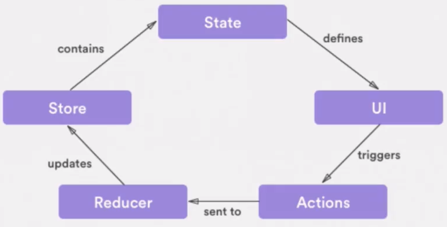
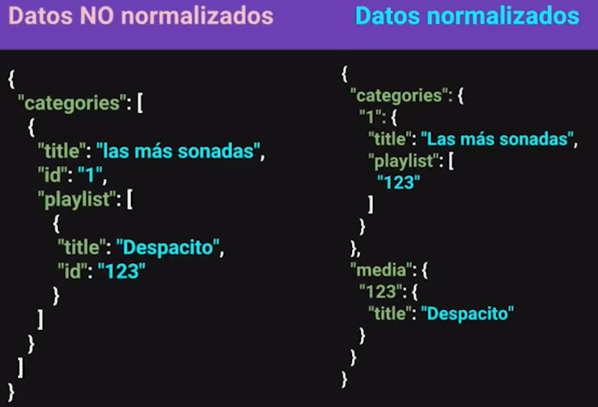

# Curso de Redux<!-- omit in toc -->

## Tabla de Contenido<!-- omit in toc -->
- [Introducción](#introducción)
- [Componentes en Redux:](#componentes-en-redux)
  - [Stores](#stores)
  - [Actions](#actions)
  - [Reducers](#reducers)
- [Flujo de eventos de Redux](#flujo-de-eventos-de-redux)
- [3 Principios de Redux](#3-principios-de-redux)
- [Funciones Puras](#funciones-puras)
- [Instalando Redux](#instalando-redux)
- [Redux en React](#redux-en-react)
  - [Provider](#provider)
  - [Connect](#connect)
  - [Dispatch](#dispatch)
- [Normalizando Datos](#normalizando-datos)
- [Uso de datos normalizados](#uso-de-datos-normalizados)
- [Múltiples Reducers](#múltiples-reducers)
- [Datos Inmutables](#datos-inmutables)
  - [Instalación](#instalación)
  - [Convirtiendo datos a inmutables](#convirtiendo-datos-a-inmutables)
  - [Inmutar Reducers](#inmutar-reducers)
  - [Obtener Datos Inmutables](#obtener-datos-inmutables)
  - [Actualizar un dato Inmuetable](#actualizar-un-dato-inmuetable)
- [Creadores de Acciones](#creadores-de-acciones)
  - [Enlazando Creadores de Acciones](#enlazando-creadores-de-acciones)
- [Action Types](#action-types)
- [Middlewares](#middlewares)
  - [Múltiples Middlewares](#múltiples-middlewares)
- [Acciones Asíncronas](#acciones-asíncronas)
- [Recursos Complementarios](#recursos-complementarios)
- [Enlaces de Interés](#enlaces-de-interés)

## Introducción

Redux fue creado por **Dan Abramov** para manipular los datos de una forma separada de la interfaz, similar a lo que hace webpack con la opción hot-reload

Redux es un contenedor del estado predecible para aplicaciones de JavaScript de frontend complejas.

<div align="right">
  <small><a href="#tabla-de-contenido">🡡 volver al inicio</a></small>
</div>

## Componentes en Redux:

### Stores

**Store**: Es el centro y la verdad de todo, con métodos para actualizar, obtener y escuchar datos.

Datos importantes del Store:

* Contiene el estado de la aplicación.
* Se puede acceder al estado con el método `getState()`
* Se puede actualizar el estado con el método `dispatch(action)`
* Escucha cambios con el método `subscribe(listener)`
* Deja de escuchar cambios retornando la función del método `subscribe(listener)`

El storage se importa de la siguiente forma:

```js
import { createStore } from'redux'
```

`createStore` es una función que recibe 3 parámetros:
* **Reducer**: Función pura que retorna el próximo estado.
* **PreloadState / InitialState**: Es el estado inicial de la aplicación, la primera carga, el llamado a una data. Puede ser cualquier tipo de dato.
* **Enhancer**: Función que puede extender redux con capacidades añadidas por librerías externas. Es opcional. Eg. Añadir las dev-tools

```js
const store = createStore(
  reducer,
  initialState,
  enhancer
)
```

Obtener el state:

```js
const state = store.getState();
```

<div align="right">
  <small><a href="#tabla-de-contenido">🡡 volver al inicio</a></small>
</div>

### Actions

**Actions**: Son bloques de información que envian datos desde la aplicación hacia el store.

Datos importantes:

* Se envían usando el método `dispatch()` del store.
* Son la única fuente de información del store.
* Son objetos planos de JavaScript.

```js
store.dispatch({
  type: "ADD_SONG",
  payload: "despacito"
});
```

* **type**: Nombre de la acción. Este dato es obligatorio.
* **payload** (puede llamarse diferente): contiene la data de envío. Se recomienda siempre escribila como un objeto.

<div align="right">
  <small><a href="#tabla-de-contenido">🡡 volver al inicio</a></small>
</div>

### Reducers 

**Reducers**: Cambian el estado de la aplicación.

Datos importantes:

* Es una [función pura](#funciones-puras).
* Puede haber más de un reducer en una aplicación pero solo debe haber un store.
* Devuelve el siguiente estado.

Qué no deben hacer los reducers:

* Modificar los argumentos recibidos
* Llamar a APIs (u otras tareas secundarias)
* Llamar a funciones no puras como Date.now(), Math.random()

```js
const reducer = function(state, action) {
  swtich(action.type) {
    case "ADD_SONG":
      return [...state, action.payload]
    default:
      return state
  }
}
```

`store.subscribe()` es una función que sirve como un listener para saber cuándo el store cambio y saber cuándo hay que volver a renderizar las vistas.

<div align="right">
  <small><a href="#tabla-de-contenido">🡡 volver al inicio</a></small>
</div>

## Flujo de eventos de Redux

<div align="center">
  
  <small><p>Flujo de eventos de una Aplicación con Redux</p></small>
</div>

* Se establece un **state** (estado) inicial con el que se crea originalmente el store mediante el método `createStore` de redux.
  
* El **state inicial** define los contenidos que se muestran en la **UI** mediante `store.getState()` y la una función de `render()`.
  
* Mediante los elementos de la UI se dispara un evento que se captura mediante un listener (como onsubmit) y que invoca al **store.dispatch()** con una acción específica.
  
* El reducer recibe la acción (type y payload) enviada mediante el `store.dispatch()` y genera un nuevo estado que remplazará al estado inicial (o anterior).
  
* El cambio del estado es detectado por el **store** y se ejecuta `store.subscribe(handle)` con la función (handle) que manejará lo que sucede cuando ha cambiado el estado.
  
* En la función (handle) recibida por `store.subscribe(handle)` se invoca la actualización de la UI a partir del nuevo estado creado.
  
* Queda establecido el **nuevo estado** (state) y queda de nuevo atento el evento (listener) en la UI.

<div align="right">
  <small><a href="#tabla-de-contenido">🡡 volver al inicio</a></small>
</div>

## 3 Principios de Redux

1. **Única fuente de verdad**:
El estado de toda tu aplicación esta almacenado en un árbol guardado en un único store lo que hace mas fácil el proceso de depuración.  

   Por cada aplicación (especialmente las de tipo single page), deberías tener un solo store, excepto si tienes múltiples páginas, donde cada página por conveniencia pudiera manejar su propia store.

2. **Solo Lectura**:
La única forma de modificar el estado es emitiendo una [acción](#actions), un objeto que describe qué ocurrió.

3. **Los cambios se realizan con funciones puras**:
Los reduces son [funciones puras](#funciones-puras) que toman el estado anterior y una acción, y devuelven un nuevo estado.

<div align="right">
  <small><a href="#tabla-de-contenido">🡡 volver al inicio</a></small>
</div>

## Funciones Puras

Las funciones puras son un concepto de programación funcional que hace que el código sea más legible. 

**Tienen las siguientes condiciones**:

1. Dados los mismos datos de entrada, deben retornar el mismo resultado sin importar el número de veces que se llame.

   **Ejemplo**: Una función que realiza una suma siempre va a retornar el mismo resultado si se ingresan los mismos números como entrada.

   **Ejemplo 2**: Las funciones Math.random() o Date.now() siempre retornan un resultado diferente y, por ende, no pueden ser consideradas como funcionales.

2. No debe tener objetos secundarios.

<div align="right">
  <small><a href="#tabla-de-contenido">🡡 volver al inicio</a></small>
</div>

## Instalando Redux

```
npm install redux
```

Para integrar **Redux** con **React** es necesario instalar **React-Redux**.

```
npm install react-redux
```

<div align="right">
  <small><a href="#tabla-de-contenido">🡡 volver al inicio</a></small>
</div>

## Redux en React

### Provider

Provider es un **high order component** (hoc) que nos provee **react-redux** el cual nos sirve para heredar elementos a los componentes hijos.

```js
import { Provider } from "react-redux";
```

Y para usarlo

```js
<Provider store={store}>
  <Componente />
</Provider>
```

<div align="right">
  <small><a href="#tabla-de-contenido">🡡 volver al inicio</a></small>
</div>

### Connect

Para poder recibir los datos del store que se envían en el provider se va a usar `connect`.

Para usar connect, primero se tiene que importar.

```js
import { connect } from "react-redux";
```

Luego se cambia el export del componente.

```js
function mapStateToProps(state, props) {
  return {
    categories: state.data.categories
  }
}

export default connect(mapStateToProps)(Componente);
```

<div align="right">
  <small><a href="#tabla-de-contenido">🡡 volver al inicio</a></small>
</div>

### Dispatch

Al utilizar el método [connect](#connect) enviamos de forma automática dispatch para ser utilizado en el componente.

```js
this.props.dispatch({
})
```

Solo los smartcomponents se deben conectar con redux

<div align="right">
  <small><a href="#tabla-de-contenido">🡡 volver al inicio</a></small>
</div>

## Normalizando Datos

La normalización tiene como objetivo evitar la redundancia de datos y haceer que acceder a esos datos sea más fácil.

<div align="center">
  
  <small><p>Datos Normalizados vs Datos no Normalizados</p></small>
</div>

La normalización permite que cada entidad esté separada de tal manera las iteraciones se realicen a nivel de entidad y no tener que estar revisando todas una entidad padre para realizar una operación en una entidad hijo.

Por ejemplo, en el caso de la foto anterior, si se desea buscar un media en todas las *medias* de las *categories*, habría que iterar en cada *playlist* de cada *category* por lo cual habría que hacer una doble iteración.

Con la normalización de datos, se formaría un array de *medias* y los *playlists* solo guardarían el id de cada *media* de tal manera que solo habría que realizar una iteración de querer realizar una operación en todos los *medias*.

Para normalizar datos se va a usar [normalizr](https://github.com/paularmstrong/normalizr)

```bash
$ npm install normalizr
```

Considerando quu se tiene la siguiente estructura como dato de entrada:

```json
{
  "categories": [
    {
      "id": "1",
      "description": "Lo mejor de la semana",
      "title": "Destacados",
      "playlist": [
        {
          "title": "¿Qué es responsive Design?",
          "author": "LeonidasEsteban",
          "type": "video",
          "cover": "./images/covers/responsive.jpg",
          "src": "http://download.blender.org/peach/bigbuckbunny_movies/BigBuckBunny_320x180.mp4",
          "id": "1"
        }
      ]
    }
  ]
}
```

Proceso de normalización de datos:

```jsx
import api from 'api.json';
import { normalize, schema } from 'normalizr';

// schema.Entity(key, definición de mi esquema, opciones);

// Entidad hijo
const media = new schema.Entity('media', {}, {
  //se indica cuál es el atributo de id
  idAttribute: 'id', 
  //se asocia el id de la entidad padre
  processStrategy: (value, parent, key) => ({...value, category: parent.id}) 
});

const category = new schema.Entity('categories', {
  //se indica que playlist es una entidad de media
  playlist: new schema.Array(media)
});

// Entidad principal
const categories = { categories: new schema.Array(category) };

//normalize(datos a normalizar, entidad principal)
const normalizedData = normalize(api, categories);

export default normalizedData;
```

Output de los datos normalizados:

```json
{
  entities: {
    categories: {
      1: {
        description: "Lo mejor de la semana",
        id: "1",
        playlist: ["1", "2", "3", "4", "5"],
        title: "Destacados"
      }
      2: {id: "2", description: "Lo mejor para concentrarte", title: "Para programar", playlist: Array(5)}
      3: {id: "3", description: "Si no te queda de otra", title: "Regueton", playlist: Array(5)}
    }
    media: {1: {…}, 2: {…}, 3: {…}, 4: {…}, 5: {…}, 6: {…}, 7: {…}, 8: {…}, 9: {…}, 10: {…}, 11: {…}, 12: {…}, 13: {…}, 14: {…}, 15: {…}}
  }
  result: {
    categories: ["1", "2", "3"]
  }
}
```

El output de datos normalizados contiene un objeto con 2 keys:
* **entities**: contiene un objeto por cada entidad `schema.Entity()` definido. Dentro de la entidad se encuentran todos los objetos que contiene. 
* **result**: son los schemas resultantes de la normalización.

<div align="right">
  <small><a href="#tabla-de-contenido">🡡 volver al inicio</a></small>
</div>

## Uso de datos normalizados

Dado que la normalización de datos hace que solo se hagan referencias a ids, la forma de mostrarlo  en la ui cambia un poco.

Se va a crear un componente contenedor que reciba el id y por medio de `mapStateToProps` obtenga el objeto relacionado al id.

A continuación, se muestra un ejemplo para una entidad llamada *Media*.

```jsx
import React, { Component } from 'react';
import Media from '../components/media.jsx';
import { connect } from 'react-redux';

class MediaContainer extends Component {
  render() {
    return <Media {...this.props.data} />
  }
}

function mapStateToProps(state, props) {
  return {
    data: state.data.entities.media[props.id]
  }
}

export default connect(mapStateToProps)(MediaContainer);
```

<div align="right">
  <small><a href="#tabla-de-contenido">🡡 volver al inicio</a></small>
</div>

## Múltiples Reducers

Se debería de usar un reducer por cada key en el estado inicial.

Asimismo, se recomienda iniciar el state en cada reducer. 

Por ejemplo:
```js
const initialState = {
  visibility: false,
  mediaId: null
}

function modal(state = initialState, action) {
  switch(action.type) {
    case 'OPEN_MODAL':
      return state;
    case 'CLOSE_MODAL':
      return state;
    default:
      return state;
  }
}

export default modal;
```

Por último, se van a combiar todos los reducers en uno usando el método `combineReducers`.

```js
import data from './data.js'
import modal from './modal.js'
import { combineReducers } from 'redux'; 

const rootReducer = combineReducers({
  data, //primer reducer
  modal //segundo reducer
})

export default rootReducer;
```

**Nota**: Los keys del `inicialState` son los mismos que se definen en combineReducers.

En base a los ejemplos anteriores, el initialState generado por el reducer modal es el siguiente:

```js
const initialState = {
  modal: {
    visibility: false,
    mediaId: null
  }
}
```

<div align="right">
  <small><a href="#tabla-de-contenido">🡡 volver al inicio</a></small>
</div>

## Datos Inmutables

Un objeto inmutable es básicamente aquel que luego de ser creado nunca cambia.

Al convertir un dato a inmuetable:
* Las **listas** representan a los arrays.
* Los **mapas** representan a los objetos.

<div align="right">
  <small><a href="#tabla-de-contenido">🡡 volver al inicio</a></small>
</div>

### Instalación 

Para obligar que un dato sea inmutable, se va a usar las librerías de [immutableJS](https://facebook.github.io/immutable-js/) y [redux-immutable](https://github.com/gajus/redux-immutable).

```bash
npm install immutable redux-immutable
```

<div align="right">
  <small><a href="#tabla-de-contenido">🡡 volver al inicio</a></small>
</div>

### Convirtiendo datos a inmutables

Lo primero que se debe de hacer es inmutar el estado inicial. Esto se hace con el método `fromJS`:

```js
import { fromJS } from 'immutable'; 

const initialState = fromJS({
  visibility: false,
  mediaId: null
})
```

<div align="right">
  <small><a href="#tabla-de-contenido">🡡 volver al inicio</a></small>
</div>

### Inmutar Reducers

También se debe de inmutar los reducers. Esto se va a lugar con la función `combineReducers` de `redux-immutable`.

```js
import data from './data.js'
import modal from './modal.js'
import { combineReducers } from 'redux-immutable'; 

const rootReducer = combineReducers({
  data, 
  modal
})

export default rootReducer;
```

<div align="right">
  <small><a href="#tabla-de-contenido">🡡 volver al inicio</a></small>
</div>

### Obtener Datos Inmutables

Para obtener un dato inmueble, se va a usar la función `get()`.

```js
state.get('data').get('entities').get('media').get(props.id)
```

Para maps anidados podemos acceder a los datos con el método `getIn()` que recibe un array con los key de las propiedades a acceder.

```js
state.getIn(['data', 'entities', 'media', props.id])
```

<div align="right">
  <small><a href="#tabla-de-contenido">🡡 volver al inicio</a></small>
</div>

### Actualizar un dato Inmuetable

Una de las ventajas de trabajar con immutable JS es que aún cuando pareciera que estamos actuando sobre el estado con los métodos, get y set, en realidad estamos actuando sobre nuevos estados creados a partir del estado sobre el que estamos actuando, así:

```js
return state.set('search', query)
```

En lugar de retornar el estado state modificado con el método set (como pareciera ser lo obvio), en realidad estamos retornando un estado completamente diferente con los cambios aplicados.

Si se desea actualizar más de una key, se utilizará el método merge.

```js
return state.merge({
  visibility: true,
  mediaId: id
})
```

<div align="right">
  <small><a href="#tabla-de-contenido">🡡 volver al inicio</a></small>
</div>

## Creadores de Acciones

Son funciones que engloban acciones y retornan el texto de la acción.

```js
export function openModal(mediaId) {
  return {
    type: 'OPEN_MODAL',
    payload: {
      mediaId
    }
  }
}

export function closeModal() {
  return {
    type: 'CLOSE_MODAL'
  }
}
```

Uso:

```js
//otros imports
import { openModal, closeModal } from './actions/index';

class Home extends Component {
  handleOpenModal = (id) => {
    this.props.dispatch(openModal(id))
  }

  handleCloseModal = (event) => {
    this.props.dispatch(closeModal())
  }

  //aquí va más código
}
```

<div align="right">
  <small><a href="#tabla-de-contenido">🡡 volver al inicio</a></small>
</div>

### Enlazando Creadores de Acciones

Para enlazar un creador de acciones se va a usar el método `bindActionCreators`.

Primero, se va a importar `bindActionCreators` de `react-redux` y los creadores de acciones.

```js
import * as actions from '../../actions/index';
import { bindActionCreators } from 'redux';
```

Luego, se va a sociar las acciones al componente con el método [connect](#connect). 

Se va a crear una función `mapDispatchToProps` la cuál va a ser pasada como segundo parámetro del método connect.

```js
function mapDispatchToProps(dispatch) {
  return {
    actions: bindActionCreators(actions, dispatch)
  }
}

export default connect(null, mapDispatchToProps)(Home);
```

Finalmente, pasa llamar a la acción dentro del componente, se hará de la siguiente forma:

```js
class Home extends Component {

  handleOpenModal = (id) => {
    this.props.actions.openModal(id)
  }

  //más código
}
```

Existe un shorthand donde no es necesario importar `bindActionCreators`. Consiste en que mapDispatchToProps sea un objeto en vez de una funcion y recibe las acciones como propiedades asi podran ser usadas directamente en los props del componente.

```js
import { openModal, closeModal } from'.../../actions/index';

const mapDispatchToProps = {
  openModal,
  closeModal
}
```

<div align="right">
  <small><a href="#tabla-de-contenido">🡡 volver al inicio</a></small>
</div>

## Action Types

Se puede crear una archivo cono todos los actions types con el fin de evitar errores.

```js
export const OPEN_MODAL = 'OPEN_MODAL'
export const CLOSE_MODAL = 'CLOSE_MODAL'
export const SEARCH_ENTITIES = 'SEARCH_ENTITIES'
```

Y para usarlos se haría de la siguiente manera:

```js
import { OPEN_MODAL } from '../action-types/index';

export function openModal(mediaId) {
  return {
    type: OPEN_MODAL,
    payload: {
      mediaId
    }
  }
}

```

<div align="right">
  <small><a href="#tabla-de-contenido">🡡 volver al inicio</a></small>
</div>

## Middlewares

Es una forma de poder interceptar lo que está sucediendo con redux para mejorarlo y/o modificarlo.

Componentes del Middleware:

* Recibe el dispatch y el getState como argumentos y retorna una función.

* Esta función retornada recibe el método para despachar el siguiente middleware, y se espera que retorne una función que recibe action y llame a next(action).

Ejemplo de un Middleware llamado logger:

```js
// versión pre-ES6
function logger({ getState, dispatch }){
  return ( next ) => {
    return ( action ) => {
      console.log( 'estado anterior:', getState().toJS() )
      console.log( 'enviando acción:', action)
      const rslt = next( action )
      console.log( 'nuevo estado   :', getState().toJS() )
      return rslt
    }
  }
}
```
```js
// versión ES6
const logger = ({ getState, dispatch }) => next => action => {
  console.log( 'estado anterior:', getState().toJS() )
  console.log( 'enviando acción:', action)
  const rslt = next( action )
  console.log( 'nuevo estado   :', getState().toJS() )
  return rslt
}
```

Para convertir un **middleware** en un **enhancer** y poder usarlo en la aplicación, se va a usar `applyMiddleware`.

```js
import { createStore, applyMiddleware } from "redux";

const store = createStore(
  reducer,
  map(),
  applyMiddleware(logger)
);
```

<div align="right">
  <small><a href="#tabla-de-contenido">🡡 volver al inicio</a></small>
</div>

### Múltiples Middlewares

Para agrear múltiples middlewares se va a usar `composeWithDevTools` que es un método de [redux-devtools-extension](https://github.com/zalmoxisus/redux-devtools-extension).

```bash
$ npm install –save-dev redux-devtools-extension
```

[redux-logger](https://github.com/evgenyrodionov/redux-logger) es un middleware que permite mantener un log de los cambios realizados en una aplicación con Redux.

```bash
$ npm install --save redux-logger
```

Para integrar estos dos middlewares, se haría de la siguiente manera:

```js
import logger from 'redux-logger'
import { composeWithDevTools } from 'redux-devtools-extension'

const store = createStore(
  reducer,
  map(),
  composeWithDevTools(
    applyMiddleware(
      logger
      //, otro middleware
    )
  )
);
```

<div align="right">
  <small><a href="#tabla-de-contenido">🡡 volver al inicio</a></small>
</div>

## Acciones Asíncronas

[redux-thunk](https://github.com/reduxjs/redux-thunk) es un middleware que nos va permitir el uso de flujos asíncronos dentro de las acciones.

```bash
$ npm install redux-thunk
```

Para usarlo, se debe de agregar dentro de los enhancers de redux.

```js
import thunk from 'redux-thunk';

const store = createStore(
  reducer,
  map(),
  applyMiddleware(thunk)
);
```

Para crear una acción asíncrona:

```js
export function searchAsyncEntities(query) {
  return (dispatch) => {
    fetch('url').then((res) => {
      dispatch(searchEntities(query))
    });
  }
}
```

<div align="right">
  <small><a href="#tabla-de-contenido">🡡 volver al inicio</a></small>
</div>

## Recursos Complementarios
* [Diapositivas del Curso](docs/redux.pdf)

<div align="right">
  <small><a href="#tabla-de-contenido">🡡 volver al inicio</a></small>
</div>

## Enlaces de Interés
* [Curso de Redux](https://platzi.com/clases/redux/)
* [Redux Devtools Extension](https://github.com/zalmoxisus/redux-devtools-extension)
* [React Redux](https://github.com/reactjs/react-redux)
* [Normalizr](https://github.com/paularmstrong/normalizr)
* [ImmutableJS](https://facebook.github.io/immutable-js/) 
* [Redux-immmutable](https://github.com/gajus/redux-immutable)
* [Awesome Redux](https://github.com/xgrommx/awesome-redux)
* [Redux Logger](https://github.com/evgenyrodionov/redux-logger)
* [Redux-thunk](https://github.com/reduxjs/redux-thunk)

<div align="right">
  <small><a href="#tabla-de-contenido">🡡 volver al inicio</a></small>
</div>