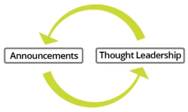

# Curso de Relaciones Públicas y Prensa<!-- omit in toc -->

## Tabla de Contenido<!-- omit in toc -->
- [Introducción](#introducción)
- [El Acrónimo FAMOUS](#el-acrónimo-famous)
  - [Formular y Anunciar](#formular-y-anunciar)
  - [Amplificar](#amplificar)
  - [Mensaje](#mensaje)
  - [Alcance](#alcance)
  - [Implacable](#implacable)
  - [Estrategia](#estrategia)
- [Contactando a los Medios](#contactando-a-los-medios)
- [Liderazgo de Opinión](#liderazgo-de-opinión)
- [Los Pilares de las Relaciones Públicas](#los-pilares-de-las-relaciones-públicas)
- [Resumen de Crowdfunding](#resumen-de-crowdfunding)
- [Tendencia de los Medios](#tendencia-de-los-medios)
- [Recursos Complementarios](#recursos-complementarios)
- [Enlaces de Interés](#enlaces-de-interés)

## Introducción

¿Por qué son importantes las campañas de Crowdfunding y las relaciones públicas?

Muchas veces vas a necesitar recursos para construir tu producto. En ese momento las campañas de Crowdfunding son muy importantes.

Las compañías buscan encontrar una base de clientes temprana que te van a pagar por tu producto y ese capital inicial puede ser usado para construir y desarrollar tu compañía.

Las relaciones públicas (PR), buscan ser mostrado en publicaciones de noticias populares (medios tradicionales o digitales), lograr que uno o varios medios escriban un artículo sobre tu compañía, así muchas personas más puedan conocer de tu campaña.

  <small><a href="#tabla-de-contenido">🡡 volver al inicio</a></small>

## El Acrónimo FAMOUS

Para conseguir un medio publique nuestra campaña de Crowfunding, podemos seguir un proceso de seis pasos que sigue el acrónimo FAMOUS.

* F - **[Formulate](#formular-y-anunciar)** (Formula): Tenemos que formular nuestro anuncio.
* A - **[Amplify](#amplificar)** (Amplifica): Tenemos que hacer tan grande como podamos nuestra campaña de crowfunding.
* M - **[Messaging](#mensaje)** (Mensaje): Tenemos que crear un pitch (discurso de ventas) en email y un comunicado de prensa.
* O - **[Outreach](#alcance)** (Alcance): Como debemos contactar con los medios.
* U - **[Unrelenting](#implacable)** (Implacable): Es contactar tantas publicaciones como puedas para tu campaña.
* S - **[Strategize](#estrategia)** (Estrategia): ¿Cómo vas a continuar contactando con los medios? para maximizar la cobertura de tu campaña crowfunding.

  <small><a href="#tabla-de-contenido">🡡 volver al inicio</a></small>

### Formular y Anunciar

Cuando estés contactando a medios no deberías decir "¿podrías escribir sobre mi compañía?", lo que deberías decir es, "Mi compañía está por anunciar algo ¿Te gustaría cubrir ese anuncio?"

Algunos ejemplos de anuncios son:
* Lanzamiento de la campaña de crowdfunding.
* Logros de tu campaña.
* Nuevas asociaciones.
* Lanzamiento del producto.

Las campañas exitosas continúan generando cobertura a través de toda la campaña

  <small><a href="#tabla-de-contenido">🡡 volver al inicio</a></small>

### Amplificar

Amplifica tu misión, cualquier misión que veas deberías expresar esto a los medios.

Preguntas que podrías hacerte:
* ¿Cómo es que tu emprendimiento va a cambiar al mundo?
* ¿En qué tu emprendimiento es el primero o el mejor?
* ¿Qué va a hacer tu compañía cuando tenga 100 empleados?

**Tip**: multiplica la visión que tengas por 10.

  <small><a href="#tabla-de-contenido">🡡 volver al inicio</a></small>

### Mensaje

Este paso busca llegar a que un reportero cubra tu campaña y reducir la fricción para que esto suceda. 

Para esto tenemos dos documentos importantes:

  <small><a href="#tabla-de-contenido">🡡 volver al inicio</a></small>

**Email Pitch**

El email pitch busca venderle al reportero por qué debería cubrir tu campaña de crowdfunding.

Ten en cuenta lo siguiente:
* Iniciar con validación social: incluye información sobre ti de la que se pueda inferir más información. 
  **Ejemplo**: estudié en Harvard, trabajé en Google, fui a Y Combinator.  
  **Ejemplo 2**: Tengo 15 años, 
* Incluir tu perfil social: esto ayuda a confirmar la veracidad de tu proyecto. De preferencia, usar LinkedIn. 
* Añadir el nombre del reportero en el asunto: está comprobado que esto aumenta las posibilidades de que acepten tu propuesta.
* Los editores leen los correos: evitar las llamadas telefónicas.

El email debería de contener:
* Abre con el nombre del periodista.
* Anunciar que es una exclusiva.
* Que el mensaje tenga educación y agradecimiento.
* Describir la “Gran misión” de tu compañía.
* Cómo vas a lograr tu objetivo.
* Historias y hechos de tu compañía.
* Ejecutable, coordinar llamada telefónica para dejar las cosas definidas.
  
>Hi Freddie,
>
>I hope all is well. I am writing to see if you may be interested an exclusive, it's actually for the company I work for. Having an exclusive in Forbes would mean the world. Normally the founder would write you but he knew we had talked a fair amount in the 
past.
>
>The company is called Publicize, and its mission is to change the way startups approach PR. What we'll be launching is our Publicize 2.0 platform. Our founder, Conrad Egusa, is a former VentureBeat contributor and one of the things he noticed was how broken the PR industry was - traditional PR firms charge $10K/month with a 6 month retainer, which isn't cost-effective or feasible for the majority of companies - especially startups. 
>
>Publicize, a company based in Medellin, Colombia, wanted to approach the PR industry as a startup would; today it has introduced a $399/month PR solution.Something that is a bit unique about Publicize is that almost the entire team has backgrounds in journalism.
>
>If you may be interested, I have attached a press release to this email. Conrad would also be happy to have a call or to follow up with more information. We were hoping this may be published this week, although I know how busy you are and am happy to work around your schedule. If the story isn’t for you, that’s OK too and thanks again for all your time and consideration.
>
>Best,
>Jim Glade

**Tip**: Siempre recuerda enviar un correo de seguimiento

>Hi (Reporter Name)
>
>I hope all is well. I wanted to send a quick follow up to my earlier email to see if you may be interested in the announcement. Many thanks for your time, I know you are busy if you don't have the chance to respond. 

**Nota**: A lo mucho enviar 2 correos de seguimiento.

**Comunicado de Prensa**

El propósito del comunicado de prensa es que, una vez el reportero decida cubrir tu campaña, hacerle lo más facil posible cubrirla.

A muchos reporteros se les paga muy poco por su trabajo. En consecuencia, deben de escribir muchos artículos. Debido a eso, ellos siempre están evaluando cuánto tiempo les va a tomar escribir un artículo. 

Ten en cuenta lo siguiente:
* El comunicado de prensa sigue un formato específico.
* Se debe de usar data siempre que sea posible.

Podemos ver ejemplos de comunicados de prensa aquí:  
[Example Press Releases](https://publicize.co/example-press-releases/)

  <small><a href="#tabla-de-contenido">🡡 volver al inicio</a></small>

### Alcance

Tienes dos opciones al contactar periodistas, darle la exclusiva u ofrecerles un embargo.

* **Exclusiva**, la razón porque es importante es porque los periodistas buscan destapar historias y cuando le ofreces la exclusiva le comunicas que puedes contratar a cientos de escritores, pero estás interesado en que él escriba la historia. No significa que solo una publicación va a escribir sobre ti, solo que garantizas cierta cantidad de cobertura.

  Si estás buscando una exclusiva, deberías de indicarlo en el pitch email ya que, de lo contrario, el reportero pensará que le estás mandando el mismo correo a varias personas.

* **Embargo**, busca tener la mayor cobertura posible desde el primer momento, para esto le escribes a la mayor cantidad de periodistas posibles.

  <small><a href="#tabla-de-contenido">🡡 volver al inicio</a></small>

### Implacable

Debes intentar maximizar y profundizar la cobertura tanto como sea posible debido a que tienes una cantidad de tiempo limitado en tu campaña.

Debes asumir que si no le escribes a un medio, ellos no van a escribir sobre ti.

**Tip**: No te olvides de usar plataformas sociales para difundir tu campaña.

Las plataformas sociales más pupulares son:
* Reddit
* Product Hunt
* Hacker News

Lista de contactos: [Find Tech Reporters](https://publicize.co/find-tech-reporters/)

  <small><a href="#tabla-de-contenido">🡡 volver al inicio</a></small>

### Estrategia

Antes de empezar deberías tener un plan, tener claro acciones que puedes hacer durante la campaña de Crowdfunding.

Por ejemplo:
* Un press release al inicio de la campaña.
* Un press release cuando llego a $1000 de donaciones.
* Un press release cuando logro un avance significativo en mi proyecto.

Recuerda el tiempo de la campaña es limitado.

  <small><a href="#tabla-de-contenido">🡡 volver al inicio</a></small>

## Contactando a los Medios

Podrías estar pensando, no conozco reporteros o nunca me van a cubrir.

Lo que cuenta es el proceso al contactar a los medios y no es sobre necesariamente tener relación previa con ellos.

No te desalientes si no conoces a nadie en medios, si sigues el proceso, indiferente de tus conexiones puedes obtener cobertura mediática.

  <small><a href="#tabla-de-contenido">🡡 volver al inicio</a></small>

## Liderazgo de Opinión

La idea es escribir un artículo invitado para un medio donde de alguna manera se relacione con tu campaña.

Recuerda esto es un método gratuito y sin tener relaciones previas con los medios, asi como el método FAMOUS.

Una recomendación es enviar el artículo junto con el correo de introducción de tal modo que la editorial ya sabe cómo es el material se que se quiere publicar y se evita el riesgo de comprometerse a publicar un artículo que desconoce.

  <small><a href="#tabla-de-contenido">🡡 volver al inicio</a></small>

## Los Pilares de las Relaciones Públicas

Tu objetivo debería ser continuamente salir con estos anuncios generando cobertura, entre tiempos de estos anuncios puedes escribir artículos de liderazgo que de alguna manera mencionen tu campaña.

  
  <small>
Ciclo de Relaciones Públicas
</small>

Si has agotado las opciones de anuncios y artículos de liderazgo y tienes tiempo libre, se puede optar por las siguientes opciones:

**Special Pitches**

Es un pitch específico acerca de un tema relevante que está sucediendo. Esto va a dar una cubertura mediática para tu perfil y tu empresa.

Ejemplo: Se está hablando mucho acerca de los inmigrantes como un problema para el pais y tu eres un inmugrante que ha aportado a la nación. Puedes escribir un artículo acerca de tu experiencia.

**Los beneficios del PR son**:

De corto plazo:
* ROI
* Dinero recaudado en la campaña
* Personas que visitan tu campaña

De largo plazo:
* SEO
* Te puedes convertir en un líder de pensamiento en un área específica.

  <small><a href="#tabla-de-contenido">🡡 volver al inicio</a></small>

## Resumen de Crowdfunding

¿Por qué los medios son tan importantes para sus campañas o cuando estén iniciando su empresa?

La razón es porque en orden de recaudar tanto dinero como sea posible, es necesario que tantas personas como sea posible escuchen sobre tu campaña.

En muchos casos estos medios de publicaciones tienen miles o millones de lectores cada mes.

**Tip**: Si no tienes tiempo para enviar un comentario de prensa dede el inicio, en tu correcto de contacto dile a los reporteros que si están interesados, puedes enviarles, en el próximo correo, un comunicado de prensa.

  <small><a href="#tabla-de-contenido">🡡 volver al inicio</a></small>

## Tendencia de los Medios

¿Hacia dónde van los medios? Al conocer esto, podemos sacar ventaja de estas tendencias para tus campañas de Crowdfunding.

* Las publicaciones han tenido problemas financieros en el pasado. Los publicadores necesitan muchas más publicaciones.
* La fragmentación continúa a través de las plataformas.
* Los publicadores van a estar buscando cada vez más individuos que contibuyan con contenido.
* El PR se va a expandir mucho más allá de solo los medios hacia mayores comunicaciones.
* Para el Internet, enfocarse en imágenes y video.

  <small><a href="#tabla-de-contenido">🡡 volver al inicio</a></small>

## Recursos Complementarios
* [Diapositivas del Curso](docs/presentacion-platzi-publicize.pdf)
* [Publicize](https://publicize.co/)
* [Example Press Releases](https://publicize.co/example-press-releases/)
* [Find Tech Reporters](https://publicize.co/find-tech-reporters/)

  <small><a href="#tabla-de-contenido">🡡 volver al inicio</a></small>

## Enlaces de Interés
* [Curso de Relaciones Públicas y Prensa](https://platzi.com/clases/relaciones-publicas/)

  <small><a href="#tabla-de-contenido">🡡 volver al inicio</a></small>

