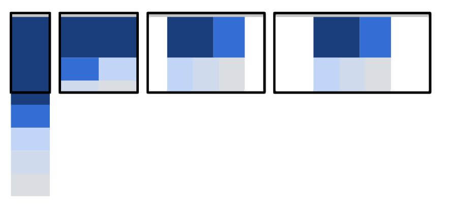
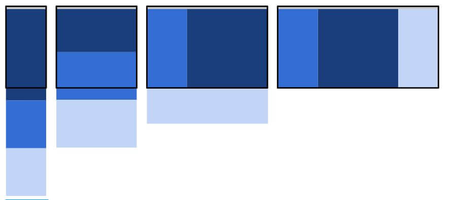
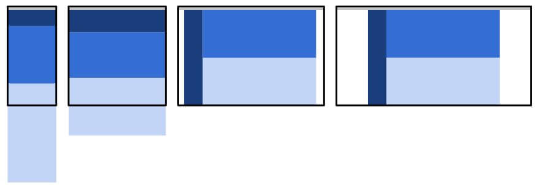
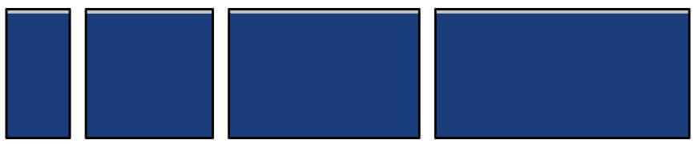
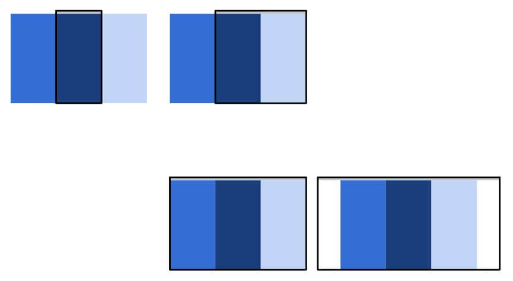
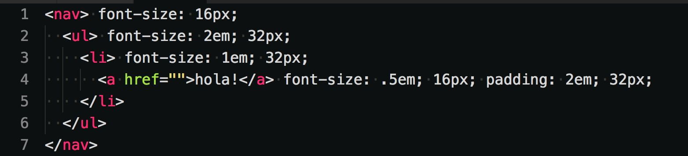
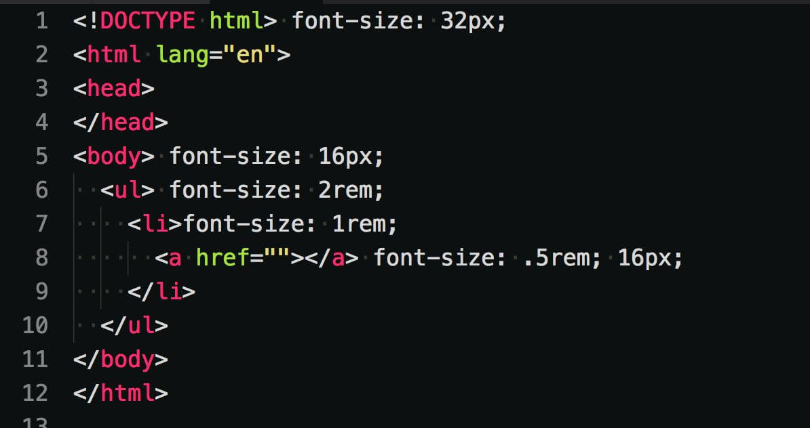
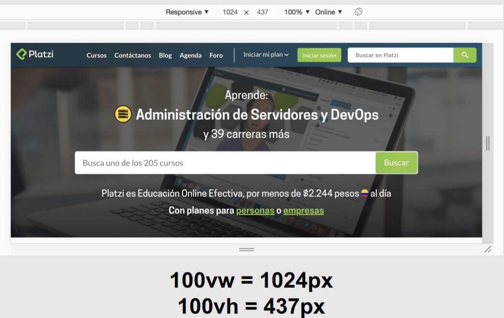
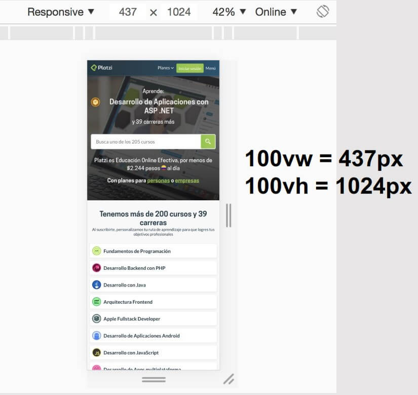

# Curso de Responsive Design<!-- omit in toc -->

## Tabla de Contenido<!-- omit in toc -->
- [¿Qué es Responsive Design?](#qué-es-responsive-design)
- [Patrones de Responsive Design](#patrones-de-responsive-design)
  - [Mostly Fluid](#mostly-fluid)
  - [Colocación de Columnas](#colocación-de-columnas)
  - [Layout Shifter](#layout-shifter)
  - [Tiny Tweaks](#tiny-tweaks)
  - [Off Canvas](#off-canvas)
- [Conceptos Elementales](#conceptos-elementales)
- [Developer tools para Responsive Design](#developer-tools-para-responsive-design)
- [Meta viewport](#meta-viewport)
- [Medidas Relativas](#medidas-relativas)
- [Media Queries](#media-queries)
- [CSS Positions](#css-positions)
- [Video Responsive](#video-responsive)
  - [Video HTML](#video-html)
  - [Video Insertado](#video-insertado)
- [Burger Menu](#burger-menu)
- [Media Queries con JavaScript](#media-queries-con-javascript)
- [Propiedades CSS Útiles](#propiedades-css-Útiles)
- [Remote Debugging](#remote-debugging)
  - [Servidor Estático en Node](#servidor-estático-en-node)
  - [Remote Debugging en iOS](#remote-debugging-en-ios)
  - [Remote Debugging en Android](#remote-debugging-en-android)
- [Recursos Complementarios](#recursos-complementarios)
- [Enlaces de Interés](#enlaces-de-interés)

## ¿Qué es Responsive Design?

Responsive design son todas esas técnicas que usamos para adaptar nuestras aplicaciones web a la mayor cantidad de pantallas.

<div align="right">
  <small><a href="#tabla-de-contenido">🡡 volver al inicio</a></small>
</div>

## Patrones de Responsive Design

### Mostly Fluid

Empieza el contenido en una caja, pero cuando ya no alcanza todo el contenido en el viewport, el sitio se empieza a redimencionar para aprovechar mejor el contenido.

<div align="center">
  
  <small><p>Mostly Fluid</p></small>
</div>

<div align="right">
  <small><a href="#tabla-de-contenido">🡡 volver al inicio</a></small>
</div>

### Colocación de Columnas

Las columnas se van poniendo una debajo de otras dependiendo del tamaño del viewport.

<div align="center">
  
  <small><p>Colocación de Columnas</p></small>
</div>

<div align="right">
  <small><a href="#tabla-de-contenido">🡡 volver al inicio</a></small>
</div>

### Layout Shifter

Haces variaciones del layout dependiendo del tamaño del viewport.

<div align="center">
  
  <small><p>Layout Shifter</p></small>
</div>

<div align="right">
  <small><a href="#tabla-de-contenido">🡡 volver al inicio</a></small>
</div>

### Tiny Tweaks

Hacer cambios pequeños en algunos elementos como:
* Tamaño del texto.
* Tamaño de imágenes.

<div align="center">
  
  <small><p>Tiny Tweaks</p></small>
</div>

<div align="right">
  <small><a href="#tabla-de-contenido">🡡 volver al inicio</a></small>
</div>

### Off Canvas

Tienes ciertos elementos fuera del viewport que aparecen de acuerdo a ciertas acciones. Un ejemplo es el hamburger menu.

<div align="center">
  
  <small><p>Off Canvas</p></small>
</div>

<div align="right">
  <small><a href="#tabla-de-contenido">🡡 volver al inicio</a></small>
</div>

## Conceptos Elementales

* **Viewport**: área visible del navegador
* **Portrait**: vertical
* **Landscape**: horizontal
* **Mobile first**: empezar una website desde la menor resolución soportada
* **Desktop first**: empezar una website desde la mayor resolución soportada

**¿Cúal es mejor?** Técnicamente Mobile First

<div align="right">
  <small><a href="#tabla-de-contenido">🡡 volver al inicio</a></small>
</div>

## Developer tools para Responsive Design

Para activar las herramientas de responsive de Chrome, vamos a hacer lo siguiente:

1. Click derecho
2. Inspeccionar
3. Click en ínico de responsive en la esquina supeior izquierda o Control + Shift + M

<div align="right">
  <small><a href="#tabla-de-contenido">🡡 volver al inicio</a></small>
</div>

## Meta viewport

El viewport es el área visible del navegador.

Para setear el viewport, se va a hacer desde una etiqueta meta.

```html
<meta name="viewport" content="width=device-width,initial-scale=1.0">
```

* `width=device-width` para que se adapte según la pantalla del dispositivo
* `initial-scale=1.0` para indicar el escalado según el dispositivo

<div align="right">
  <small><a href="#tabla-de-contenido">🡡 volver al inicio</a></small>
</div>

## Medidas Relativas

* **Porcentaje**: Longitud referente al tamaño de los elementos padre.
* **em**: Unidad relativa al tamaño de fuente especificada más cercano. Incluye al propio elemento.

<div align="center">
  
  <small><p>Ejemplo: Medida em</p></small>
</div>

* **rem**: Unidad relativa al tamaño de fuente especificada en el ancestro más lejano (html o body).

<div align="center">
  
  <small><p>Ejemplo: Medida rem</p></small>
</div>

* **vw / vh**: Unidad relativa porcentual con respecto al viewport.

<div align="center">
  
  <small><p>Ejemplo: Medida vw/vh</p></small>
</div>

<div align="center">
  
  <small><p>Ejemplo: Medida vw/vh</p></small>
</div>

<div align="right">
  <small><a href="#tabla-de-contenido">🡡 volver al inicio</a></small>
</div>

## Media Queries

El media queries es un módulo de css que hace posible al responsive design, éste existe desde el 2010 y se encarga de adaptar la representación del contenido a características del dispositivo.

**Estructura del Media Querie**:

```css
@media media type and (condición) { }
```

**Ejemplos**:

```css
/* Todas las pantallas con con un ancho inferior o igual a 768px cumplen esta condición */
@media screen and (max-width: 768px) { }

/* Todas las pantallas con un ancho de 480px hasta 768px cumplen esta condición */
@media screen and (max-width: 768px)  and (min-width: 480px) { }
```

**Mobile first**

Usa min-width  
min-width = desde

```css
@media screen and (min-width: 320px)  { }
@media screen and (min-width: 480px)  { }
@media screen and (min-width: 768px)  { }
@media screen and (min-width: 1024px)  { }
```

**Desktop first**

Usa max-width  
max-width = hasta

```css
@media screen and (max-width: 1024px)  { }
@media screen and (min-width: 768px)  { }
@media screen and (min-width: 480px)  { }
@media screen and (min-width: 320px)  { }
```

<div align="right">
  <small><a href="#tabla-de-contenido">🡡 volver al inicio</a></small>
</div>

## CSS Positions

* **static**: es la propiedad por defecto.

Con las otras opciones, se activan las propiedades de top, bottom, left, right y z-index. 

* **relative**: el objeto se mueve en base al lugar donde se encuentra originalmente.
* **absolute**: el objeto se ubica de manera absoluta con el elemento más cercano que tenga posición relativa o con el body.
* **fixed**: El elemento se muestra de manera fija en el viewport.
* **sticky**: El elemento se queda de manera fija una vez que aparece en pantalla.

<div align="right">
  <small><a href="#tabla-de-contenido">🡡 volver al inicio</a></small>
</div>

## Video Responsive

### Video HTML

Para que un video se ajuste al tamaño de pantalla, se puede hacer lo siguiente:

```css
.html-video  {
  width: 100%;
  height: auto;
}
```

<div align="right">
  <small><a href="#tabla-de-contenido">🡡 volver al inicio</a></small>
</div>

### Video Insertado

```html
<div class="flexible-video">
  <iframe class="youtube-video" width="560" height="315" src="https://www.youtube.com/embed/LoKvxCSZw5w" frameborder="0" allow="autoplay; encrypted-media" allowfullscreen></iframe>
</div>
```

```css
.youtube-video {
  position: absolute;
  top: 0;
  bottom: 0;
  right: 0;
  left: 0;
  width: 100%;
  height: 100%;
}

.flexible-video {
  width: 100%;
  height: 0;
  /* height * 100 / width */
  padding-top: 56.25%;
  position: relative;
}
```

<div align="right">
  <small><a href="#tabla-de-contenido">🡡 volver al inicio</a></small>
</div>

## Burger Menu

```html
<!-- HTML -->
<i class="icon-menu burger-button"></i>
```

```css
/* CSS */
.burger-button {
  width: 40px;
  height: 40px;
  border-radius: 50%;
  background-color: rgba(0,0,0,.8);
  display: none;
  line-height: 40px;
  text-align: center;
  position: fixed;
  z-index: 4;
  left: 5px;
  top: 5px;
  color: #fff;
}

@media screen and (max-width: 767px) {
  .burger-button {
    display: block;
  }
  .menu {
    position: fixed;
    background: rgba(5, 111, 255, .9);
    z-index: 3;
    top: 0;
    left: -100vw;
    width: 100vw;
    bottom: 0;
    display: flex;
    align-items: center;
    justify-content: center;
    transition: .3s;
  }
  .menu.is-active {
    left: 0;
  }
}
```

```js
// Javascript
const menu = document.querySelector('.menu');
const burgerButton = document.querySelector('#burger-button');
burgerButton.addEventListener('click', () => {
  menu.classList.toggle('is-active');
})
```

<div align="right">
  <small><a href="#tabla-de-contenido">🡡 volver al inicio</a></small>
</div>

## Media Queries con JavaScript

Hay ocaciones en las que solo se van a usar eventos dependiendo del tamaño de pantalla. Por ejemplo, en los burger menu. Para estos casos, se puede usar media queries en javascript

```js
//Media query
const ipad = window.matchMedia('screen and (max-width: 767px)');

//Activa la primera vez que se entra
if(ipad.matches)
  burgerButton.addEventListener('click', hideShow);

//Activa o desactiva al hacer resize de la pantalla
ipad.addListener((event) => {
  if(event.matches)
    burgerButton.addEventListener('click', hideShow);
  else
    burgerButton.removeEventListener('click', hideShow);
});
```

<div align="right">
  <small><a href="#tabla-de-contenido">🡡 volver al inicio</a></small>
</div>

## Propiedades CSS Útiles

**Flex-Wrap**

Pone un elemento debajo de otro si no entran en el viewport.

```css
flex-wrap: wrap;
```

<div align="right">
  <small><a href="#tabla-de-contenido">🡡 volver al inicio</a></small>
</div>

## Remote Debugging

### Servidor Estático en Node

Para poder hacer debugging se necesita un servidor statático.

1. Instalar static-server

```bash
npm i -g static-server
```

2. ir a la carpeta del proyecto en la terminal.

3. Ejecutar el comando `static-server`. Se va a generar una dirección con la aplicación.

4. Verificar la ip de la computadora

```bash
$ ipconfig
```

5. Ingresar desde el dispositivo móvil ingresando **ip:puerto**

<div align="right">
  <small><a href="#tabla-de-contenido">🡡 volver al inicio</a></small>
</div>

### Remote Debugging en iOS

Para esto es necesario tener una Mac.

1. Conectar el celular con la computadora via USB.
2. Abrir Safari.
3. Ir a Preferencias de Safari.
4. Habilitar "Mostrar el menú de Desarrollo en la barra de menús". Aparecerá un nuevo menú de desarrollo.
5. Abrir el menú de desarrollo. Aparecerá el dispositivo en la lista.
6. Abrir la ip del proyecto.

<div align="right">
  <small><a href="#tabla-de-contenido">🡡 volver al inicio</a></small>
</div>

### Remote Debugging en Android

1. Conectar el celular con la computadora via USB.
2. Activar el menú de desarrolldor en Android.
  1. Ir a acerca del contenido
  2. Hacer tab en **número de compilación** varias veces hasta que se active el menú de programnador.
3. Ir al menú de programación.
4. Activar la opción de **Depuración por USB**.
5. Abrir Chrome en la computadora.
6. Ir a **chrome://inspect**. Aparecerá una lista de los teléfonos con las ventanas que está navegando.
7. Hacer click en inspect.

<div align="right">
  <small><a href="#tabla-de-contenido">🡡 volver al inicio</a></small>
</div>

## Recursos Complementarios
* [Diapositivas del Curso](docs/responsive-design.pdf)

<div align="right">
  <small><a href="#tabla-de-contenido">🡡 volver al inicio</a></small>
</div>

## Enlaces de Interés
* [Curso de Responsive Design](https://platzi.com/clases/responsive-design/)
* [Repositorio de Github](https://github.com/LeonidasEsteban/responsive-design-portafolio)
* [Mediaqueri](https://mediaqueri.es/)
* [Codepen: CSS Positions](https://codepen.io/LeonidasEsteban/pen/VGWzWK)
* [Icomoon](https://icomoon.io/)

<div align="right">
  <small><a href="#tabla-de-contenido">🡡 volver al inicio</a></small>
</div>

