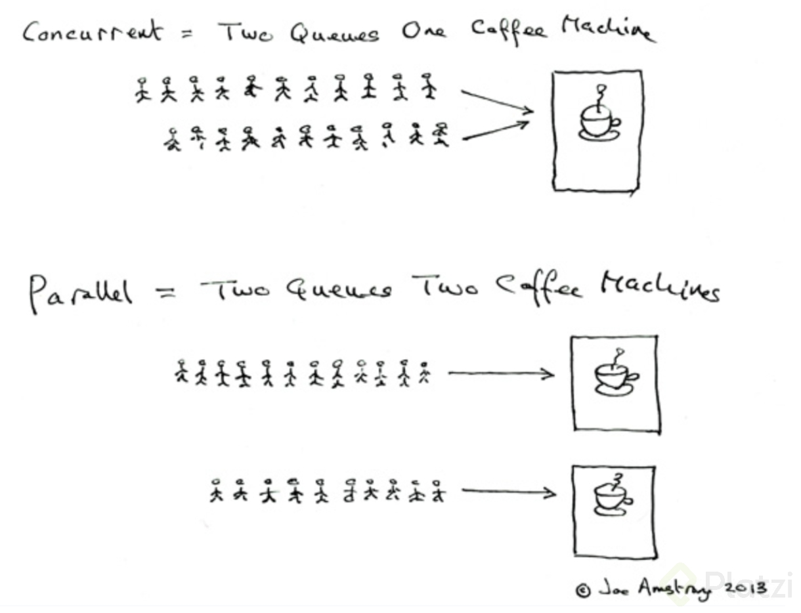
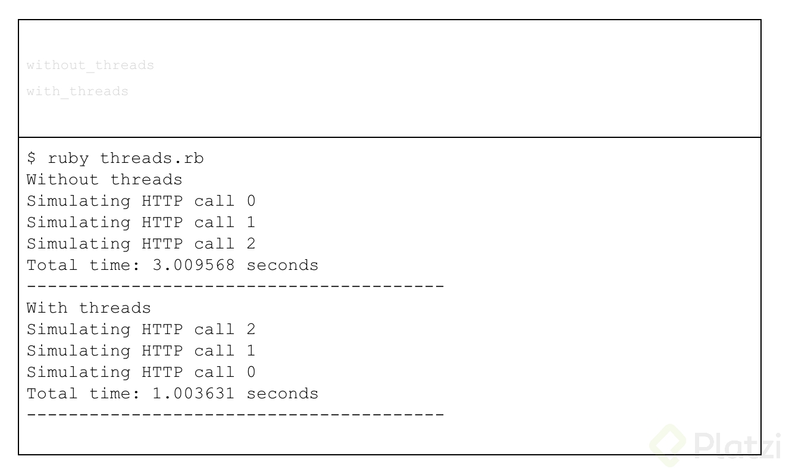

# Curso de Responsive Design<!-- omit in toc -->

## Tabla de Contenido<!-- omit in toc -->
- [Introducción](#introducción)
- [Instalación](#instalación)
- [Variables](#variables)
- [Integer y Flotantes](#integer-y-flotantes)
- [Strings](#strings)
- [Symbols](#symbols)
- [Arrays](#arrays)
- [Hashes](#hashes)
- [Rangos](#rangos)
- [Condicionales](#condicionales)
- [Ciclos](#ciclos)
- [Uso de regex](#uso-de-regex)
- [Procs y lambdas](#procs-y-lambdas)
- [Clases](#clases)
- [Módulos](#módulos)
- [Concurrencia VS Paralelismo](#concurrencia-vs-paralelismo)
  - [Limitaciones de concurrencia en Ruby](#limitaciones-de-concurrencia-en-ruby)
  - [A tener en cuenta](#a-tener-en-cuenta)
- [Bundler y gemas](#bundler-y-gemas)
- [Testing](#testing)
  - [Testing con Minitest](#testing-con-minitest)
- [Enlaces de Interés](#enlaces-de-interés)

## Introducción

Ruby es un lenguaje de programación creado por Matz en 1995, es open source y fue popularizado por Rails en 2005. Este lenguaje es dinámico, interpretado y orientado a objetos (todo es un objeto). Su objetivo es la felicidad y productividad del desarrollador.

**Ventajas**

* Comunidad muy grande
* Muchas librerías
* Constantes actualizaciones
* Lenguaje maduro

**Desventajas**

* Interpretado puede significar lento
* Alto uso de memoria
* No paralelismo
* Ha venido decreciendo en popularidad

## Instalación

1. Descargar el instalador desde aquí https://rubyinstaller.org.
2. Aceptar la licencia.
3. Escoger la carpeta de instalación.
4. Usar UTF-8 como external encoding.
5. Continuar la instalación con los valores por defecto.
6. Se abrirá una ventaja de consola. Apretar Enter.

Para comprobar si Ruby se instaló correctamente:
1. Ir a la consola.
2. irb
3. RUBY_VERSION 
4. exit
5. ruby -v

## Variables

Deben empezar con un letra minúscula o un guión bajo (_), se recomienda el uso de la convención "snake_case" con el fin de identificarlas fácilmente y no puede contener palabras reservadas del lenguaje.

En Ruby, todas las variables son tratadas como objetos. De ese modo, toda las variables tienen métodos.

Algunos métodos son:

* `x.class` (Para preguntar de qué clase es la variable).
* `x.methods` (Para enlistar los métodos que puede usar la variable).
* `x.odd?` (Para verificar si la variable es impar, devuelve un booleano).
* `x.even?` ( Para verificar si la variable es par, devuelve un booleano).

Cuando un método termina en interrogante (?) va a devolver un booleano (True o False).

## Integer y Flotantes

**Operadores**

X = 5

* `Suma` X + 5
* `Resta` x - 6
* `División` X / 7
* `Multiplicación` X * 4
* `Módulo` X % 3
* `Potencia` X ** 2

Cuando hay una operación aritmética entre enteros resulta entero, pero cuando hay una operación aritmética entre entero y un flotante resulta un flotante (Decimal).

## Strings

Un string se puede definir de las siguientes forma:

* `s = "hola"`
* `s = 'hola'`
* `s = %q(hola)`
* `s = %Q(hola)`

**Interpolación**

```ruby
/*Permite interpolación*/
saludo = %Q(Hola #{nombre})
saludo = "Hola #{nombre}"

/*NO permite interpolación*/
saludo = %q(Hola #{nombre})
saludo = 'Hola #{nombre}'
```

**Métodos**

* `"hola".upcase` (Devuelve una copia de la cadena en mayúsculas)
* `"hola".downcase` ( Devuelve una copia de la cadena en minusculas)
* `"hola".length` (Devuelve la cantidad de caracteres de la cadena)
* `"HoLa".swapcase` (Devuelve una copia de la cadena con caracteres alfabéticos en mayúsculas convertidos a minúsculas y viceversa)
* `"hola".include? "h"` (Devuelve true si el carácter asignado entre está incluido en nuestra cadena o variable)
* `" hola".strip` (Devuelve una copia de la cadena con caracteres alfabéticos en mayúsculas convertidos a minúsculas y minúsculas convertidos a mayúsculas)
* `"".empty` (Devuelve true si la cadena está vacia)
* `"Hola ruby".gsup("ruby", "mundo")` (Devuelve una copia de la cadena con todas las apariciones de patrón sustituidas por el segundo argumento)
* `gsub!` (Para modificar la variable en ves de devolver una copia)

**Operadores**

* `"Hola" + "Mundo"` Concatena 2 strings.
* `"Hola" * n` Multiplica un string n cantidad de veces.

## Symbols

Los symbols son un tipo de dato especial que utiliza Ruby para declarar constantes, esto existe para evitar que se generen más objetos y por lo tanto, no generar espacio de memoria adicional.

Para declarar un símbolo se utilizan los dos puntos

`color = :rojo`

## Arrays

Un array o arreglo es un tipo de datos especial donde vas a poder almacenar múltiples objetos en una sola variable.

Ejemplo:
`letras = ["q", "w", "e", "r", "t", "y"]`

Algo interesante de Ruby es que podemos utilizar números negativos para acceder a las posiciones desde el último elemento del array.

Los arreglos en Ruby no tienen un tipo específico, esto quiere decir que dentro de un array podemos tener diferentes tipos de datos en cada elemento.

Ejemplo:
`arreglo = [4, 4.6, "string", :symbol, [1, 4, 6]]`

Si se usa un índice fuera del rango, el valor va a devolver nil.

**Métodos**

* `letras.include? "y"` Devuelve true si incluye dicho elemento
* `letras.first` Devuelve el primer elemento
* `letras.last` Devuelve el último elemento
* `letras.count { |x| x == "y" }` Nos retorna la cantidad de elementos que cumplen dicha condición
* `[1,2,3,4,5].map { |x| x*2 }` Nos retorna un arreglo modificado según la condición
* `[1,2,3,4,5].select { |x| x.even? }` Nos retorna un arreglo con los elementos seleccionados según la condición
* `[1,2,3,4,5].min` Nos va a retornar el elemento más pequeño
* `[1,2,3,4,5].max` Nos va a retornar el elemento más grande
* `[1,2,3,4,5].sum` Retorna la suma de todos los elementos del arreglo
* `"Hola Mundo".split(" ")` Nos retorna un arreglo con la cadena dentro separada por el elemento dentro del paréntesis
* `["a", "b" ,"c"].join("-")` Retorna los elementos de una matriz en una cadena separada por el elemento dentro del paréntesis
* `letras.sort` Nos retorna una copia ordenada del arreglo

## Hashes

Hashes, también conocidos como arrays asociativos, mapas o diccionarios, son parecidos a los arrays en que son una colección indexada de referencias a objetos. Sin embargo, mientras que en los arrays los índices son números, en los hashes se puede indexar con objetos de cualquier tipo.

Cuando se almacena un valor en un array, se dan dos objetos: el índice y el valor. Luego, se puede obtener dicho valor, gracias al índice.

Los hashes se pueden declarar de 2 formas:

````ruby
capitales = { "Colombia" => "Bogotá", "Perú" => "Lima" }

capitales["Mexico"] = "Ciudad de Mexico"
````

**Métodos**

* `hash.size` Retorna la cantidad de parejas guardadas en el hash
* `hash.empty?` Indica si el hash está vacío
* `hash.has_value? "Washington"` Verifica si el hash tiene el valor
* `hash.has_key? "Washington"` Verifica si el hash tiene ese key
* `hash.invert` Intercambia los valores por las llaves
* `hash.merge({"Marte" => "Musk"})` Junta 2 hashes
* `hash.transform_values { |x| x.downcase }` Transforma todos los valores en base a una regla determinada
* `hash.map { |k,v| "La capital de #{k} es #{v}" }` Ejecuta un comando a todas los registros
* `[["pepito", 13], ["sutanito", 14]].to_h` Convierte un arreglo a hash

## Rangos

El principal uso y quizás el más apropiado para los rangos, es expresar una secuencia: las secuencias tienen un punto inicial y un punto final, y una forma de producir los sucesivos valores entre ambos. En Ruby, esas secuencias son creadas usando los operandos ".." y "..."

* ".." genera una secuencia donde los puntos límites están incluidos.

#Equivale a 1, 2, 3
`(1..3).to_a`

* "..." genera una secuencia en la que no está incluida el límite superior.

#Equivale a 1, 2, 3, 4
`(1...5).to_a`
 
## Condicionales

```ruby
role = :superadmin

if role == :admin
  puts "pantalla de admin"
elsif role == :superadmin
  puts "pantalla de superadmin"
else
  puts "pantalla de login"
end
```

## Ciclos

```ruby
while condicion do
  puts "hola"
end

#Loop es infinito. Si se quiere salir se usa u break.
loop do
  puts "hola"
  break if condicion
end

for i in i..10 do
  puts "hola"
end

[1,2,3,4].each { |x| puts "hola" }

#El rimer número es el límite. En este ejemplo iría de 0 a 3.
4.times { |x| puts "hola" }
```

## Uso de regex

Para declarar un regex, se utiliza el "/" , ejemplo:

`is_gmail_regex = /\w+@gmail.com/`

## Procs y lambdas

```ruby
saludar = Proc.new { |nombre| puts "Hola #{nombre}" }
```

## Clases

```ruby
class Persona
  #Método
  def self.suggested_named
    ["Pepe", "Pepito", "Pepon"]
  end

  #Constructor
  def initialize(name, age)
    @name = name
    @age = age
  end

  #Getter
  def name
    @name
  end

  #Setter
  def name=(name)
    @name = name
  end
end

#Instanciar clase
persona = Persona.new("Pepe", 14)
puts persona.Name

#User métodos
Persona.suggested_named
```

Otra forma de crear clases:

```ruby
class Persona
  attr_accessor(:name, :age)  # Genera getter y setter

  def initialize(name)
    @name = name
  end
end
```

Método de crear clases con struct

```ruby
#Struct declara el constructor, getters y setters
class Persona < Struct.new(:name, :age) 
end
```

## Módulos

Una buena práctica de programación es la modularización del código, lo que algunos llaman alta cohesión, lo que quiere decir que las clases o funcionalidades que hacen cosas similares estén dentro del mismo contenedor; en Ruby se utilizan los módulos para ello.

```ruby
module Model
  class Company
  end
  class Employee
  end
end

module Reports
  class ExcelReporter
    def build
      puts "Generating excel report"
    end
  end

  class EmailReporter
  end
end

## Uso del módulo
## Modulo::Clase
excel_report = Reports::ExcelReporter.new
excel_report.build
```

## Concurrencia VS Paralelismo

Los términos concurrencia y paralelismo pueden ser fácilmente confundidos. Por un lado 2 tareas se ejecutan en paralelo cuando ambas se ejecutan en unidades de procesamiento independientes al mismo tiempo, es decir, ambas tareas pueden comenzar exactamente al mismo tiempo pues su ejecución es manejada por dos unidades de procesamiento diferente. Por otro lado, dos tareas se ejecutan concurrentemente cuando se pueden ejecutar en la misma unidad de procesamiento intercalando subtareas de ambas tareas.

<div align="center">
  
  <small><p>Concurrencia vs Paralelismo</p></small>
</div>

### Limitaciones de concurrencia en Ruby

En Ruby tenemos la posibilidad de crear Threads, sin embargo, su comportamiento depende del intérprete que utilicemos. El interprete que usamos en el curso que adicionalmente es el interprete más popular (cruby o MRI) no permite paralelismo asi el computador en el que ejecutemos nuestro programa tenga múltiples cores en su procesador. MRI utiliza un mecanismo llamado Global Interpreter Lock (GIL) que hace que el interprete solo pueda ejecutar un Thread a la vez. Esto es una decisión que tomaron quienes diseñaron el lenguaje pues es una manera relativamente sencilla de evitar race conditions, deadlocks y otros problemas comunes que surgen cuando se está haciendo programación concurrente o en paralelo.

Aunque el GIL no permite que multiples threads se ejecuten, sí permite cambiar de contexto cuando se esta realizando una operación por fuera del interprete como operaciones de lectura o escritura. Como estas operaciones suceden por fuera del interprete, cruby permite cambiar de contexto para ejecutar otro thread mientras estas operaciones terminan y de esta manera se puede hacer programacion concurrente.

Otros interpretes como JRuby y Rubinius no tienen un GIL así que permiten ejecución en paralelo.

```ruby
# threads.rb

def without_threads
  puts "Without threads"
  start = Time.now
  3.times { |i| http_call(i) }
  puts "Total time: #{Time.now - start} seconds"
  puts "----------------------------------------"
end

def with_threads
  puts "With threads"
  start = Time.now
  threads = 3.times.map { |i| Thread.new { http_call(i) } }
  #threads.map(&:join)
  puts "Total time: #{Time.now - start} seconds"
  puts "----------------------------------------"
end

# Ejecución sin threads
```

<div align="center">
  
  <small><p>Ejecución de Threads</p></small>
</div>

### A tener en cuenta

* Para inicializar un Thread se utiliza debe crear un objeto Thread con Thread.new y pasarle un bloque en donde definimos lo que se debe ejecutar.
* El punto de entrada de un programa Ruby se ejecuta en un thread principal o “main thread”. Tan pronto este thread termina, la ejecución de todo el programa es terminado, así que si creamos varios threads pero el “main thread” finaliza primero los otros threads van a ser terminados. Para evitar esto debemos hacer “join” de los threads adicionales. Join es un mecanismo que hace que el thread principal espere a la finalizacion del thread al que se le hace join lo que podemos ver en la linea "threads.map(&:join)".

## Bundler y gemas

Bundler nos permite gestionar las dependencias de librerias(gemas) para nuestros proyectos ruby
Para instalar bundler ejecutamos el comando

```
gem install bundler
```

Ahora disponemos del comando bundle. Con el comando `bundle init` generamos un archivo llamado **Gemfile** donde podemos definir las dependencias de gemas para nuestro proyecto ruby 

Para ver la versión que se tiene instlada:
```
bundle --version
```

**Agregando gemas a Gemfile**

`gem 'faker'`
Es una buena practica especificar la version

`gem 'faker', '~> 1.9'`
Ahora es el momento de confirmar nuestras dependencias utilizando el comando

Ahora es el momento de confirmar nuestras dependencias utilizando el comando

```
bundle install
```

Esta instruccion verifica las dependencias y procede a instalar las gemas. Tambien generará un archivo llamado Gemfile.lock que especifica las versiones de gemas utilizadas en nuestro proyecto

## Testing 

El testing es una práctica de programación con la que podemos escribir código que va a probar el código de nuestra aplicación para garantizar que con cada cambio que le agreguemos al proyecto, no vamos a hacer que funcionalidades anteriores se vayan a ver afectadas por este nuevo cambio.

En Ruby existe una librería que nos ayuda con esto, se llama MiniTest.

```ruby
#clase calculadora
class Calculator

  def sum(a,b)
    a+b
  end

  def subtract(a,b)
    a-b
  end
end

#instancio calculadora
cal = Calculator.new

test_sum = {
  [1,2]=>3,
  [5,5]=>10,
  [6,8]=>14
}

#en el each recibimos la clave y el valor

#recorro el hash de tes_sum
#Ejemplo primer ciclo input[0]=1 input[1]=2 , expect_result=3
#cal.sum(1,2)=3/==3
test_sum.each do |input, expect_result|
  if !(cal.sum(input[0],input[1]) == expect_result)
    raise "test failed for input #{input}. Expected resul: #{expect_result}"
  else
    puts "bien hecho campeón"
  end
end
```

### Testing con Minitest

```ruby
require "minitest/autorun"

class Calculator

  def sum(a,b)
    a+b
  end

  def subtract(a,b)
    a-b
  end
end

# Herencia: Clase < CLasePadre
class TestCalculator < Minitest::Test
  
  def setup
    @cal = Calculator.new
  end
  
  def test_sum_positives
    result = @calc.sum(1, 3)
    assert_equal result, 4
  end

  def test_sum_negatives
    result = @calc.sum(-1, -3)
    assert_equal result, -4
  end
end
```

## Enlaces de Interés
* [Curso de Ruby](https://platzi.com/clases/ruby/)
* [Ruby Installer](https://rubyinstaller.org)
* [Rubygems](https://rubygems.org/)
* [Ruby Toolbox](https://www.ruby-toolbox.com/)
* [Ruby2d](https://www.ruby2d.com/)

<div align="right">
  <small><a href="#tabla-de-contenido">🡡 volver al inicio</a></small>
</div>