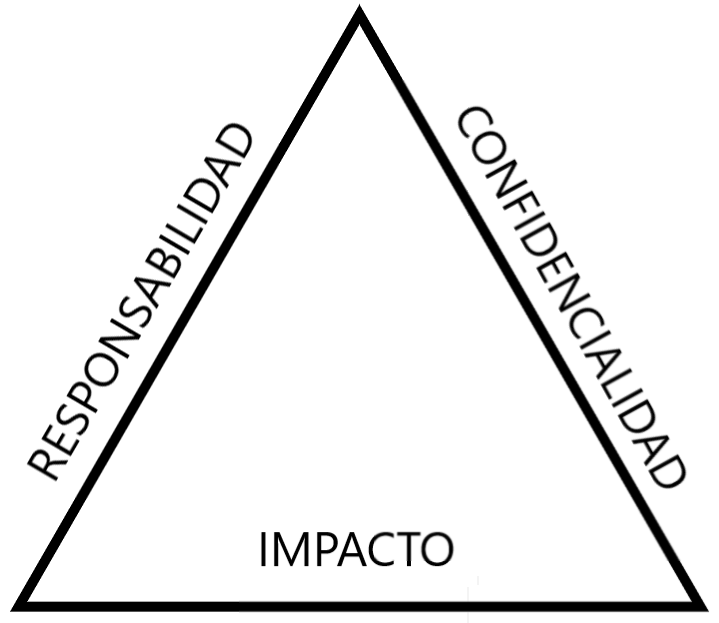

# Curso de Seguridad Informática para Empresas<!-- omit in toc -->

## Tabla de Contenido<!-- omit in toc -->
- [Visión General de la Seguridad Informática](#visión-general-de-la-seguridad-informática)
- [Diferentes Tipos de Ataques y las Técnicas Modernas](#diferentes-tipos-de-ataques-y-las-técnicas-modernas)
- [Más Allá de Ataques Informáticos](#más-allá-de-ataques-informáticos)
- [El Usuario en la Estrategia de Seguridad](#el-usuario-en-la-estrategia-de-seguridad)
- [El Compromiso Empieza con las Personas](#el-compromiso-empieza-con-las-personas)
- [Alertas Tempranas](#alertas-tempranas)
- [Encontrar el Software Correcto](#encontrar-el-software-correcto)
- [Diferencia entre Datos Personales y Empresariales](#diferencia-entre-datos-personales-y-empresariales)
- [Consejos para Proteger tu Información en Linea](#consejos-para-proteger-tu-información-en-linea)
- [Cifrado de Datos](#cifrado-de-datos)
- [Leyes de Protección de Datos](#leyes-de-protección-de-datos)
- [Exposición a Ataques](#exposición-a-ataques)
  - [Dejar la contraseña escrita en post-it](#dejar-la-contraseña-escrita-en-post-it)
  - [Dejar el computador sin bloqueo](#dejar-el-computador-sin-bloqueo)
  - [Compartir mi Clave Personal con los Demás](#compartir-mi-clave-personal-con-los-demás)
  - [Ingeniería Social](#ingeniería-social)
  - [Phishing](#phishing)
- [Checklist Base de Seguridad](#checklist-base-de-seguridad)
- [¿Qué hacer al ser víctima de un ataque?](#qué-hacer-al-ser-víctima-de-un-ataque)
- [Enlaces de Interés](#enlaces-de-interés)

## Visión General de la Seguridad Informática

¿Cuánto le cuestan los ataques de seguridad informática a las organizaciones? Existen muchos ejemplos que han dado mucho de que hablar y que han afectado fuertemente a las organizaciones que fueron objetivo de estos ataques incluso algunos de ellos han afectado a nivel mundial.

Un Ataque de Seguridad informática puede significar perdidas millonarias e incluso afectar la imagen de la compañia, y no necesariamente tienen que estar relacionados con el área de TI de la organización.

Un documento confidencial, datos de clientes, datos financieros son partes que es indispensable proteger y no solo depende del área de TI la seguridad de esta información depende de todos.

Cada uno de nosotros debe de ser un usuario activo en la estrategia de seguridad de información. Por ejemplo, una persona en el área de finanzas debe de cuidar la información financiera de la empresa. Alguien de ventas debe de cuidar la información personal de los clientes. 

Debe de haber mucho cuidado en lo que se comparte en las redes sociales puesto que cada cosa que se comparte puede afectar en mucho a la imagen de la organización.

Cuando uno visita páginas web, se debe de verificar que sea una página segura.

  <small><a href="#tabla-de-contenido">🡡 volver al inicio</a></small>

## Diferentes Tipos de Ataques y las Técnicas Modernas

En 2017 el 77% de las compañías han sido víctimas de ciber ataques y esto afecta principalmente la imagen de la empresa.

La mayoría de las brechas de seguridad se dan desde el interior de las organizaciones.

Veamos algunos de los diferentes tipos de ataques mas usados.

* **POS Point-Of-Sales malware**, en el que el atacante aprovecha las opciones de pago que ofrecen las tiendas para obtener acceso a la información de las tarjetas de credito y así a la información financiera, si bien esto principalmente te puede afectar al individuo atacado tambien afecta a la organización si es que las tarjetas usadas son de uso corporativo. Es importante revisar los dispositivos en los que inserto mis tarjetas de credito, no perderlas de vista, todo el tiempo estar pendiente de los procesos que se estan ejecutando. Hoy en día los bancos tienen aplicaciones bancarias que mantienen informado al cliente sobre las transacciones realizadas con sus productos.

* **DDoS Ataque de Denegación del Servicio** - Este tipo de ataque es común en momentos en los que el acceso a la inaformación de un sitio web es muy importante, por ejemplo en las elecciones presidenciales. Pasa porque intentan ingresar muchas peticiones al sitio y el servidor no tiene la capacidad de respuesta. Recomendación, es un poco mas orientada a la arquitectura de infraestructura de servidores, yo como parte de la compañia debo estar alerta e informar al área encargada si no esta en mis manos resolver.

* **Phising**, es un ataque de suplantación de identidad, se hacen por correo electrónico. Debemos estar muy pendientes del tipo de información y de los sitios a los que estoy ingresando desde mi correo electrónico. En la mayoría de los casos el solo hecho de manternernos alerta es suficiente para evitar caer en esta trampa, no ingresar información personal, financiera ni hacer login en sitios desconocidos.

* **WiFi impostors**, No todas las redes son seguras, las redes publicas pueden tener software malicioso, siempre debes estar pendiente de a qué sitios estamos accediendo usando redes publicas, por ejemplo si entro a revisar mi cuenta bancaria o la de la compañia, y en esa red hay software detectando los datos que envío ya le estoy entregando información confidencial a los atacantes. Hay formas de hacer conexiones seguras, por ejemplo usando una VPN, esta me permite enviar información a través de canales cifrados. Desconfia de las redes publicas abiertas, cualqueir persona que esta escuchando en la red puede tener tu información.

* **Like-Jacking**, corresponde al secuestro de nuestro perfil o el de la compañia en las redes sociales, hay sitios que solicitan autenticación adicional de las redes sociales para poder publciar a su nombre.

* **Falsas aplicaciones**, recuerda siempre estar pendiente del tipo de permisos y a quien le estas dando permiso para acceder a la información que hay en tus dispositivos, verificar que el desarrollador de la aplicación sea de confianza, hoy en dia las tiendas de aplicaciones estan validando que las aplicaciones que publican sean seguras, pero no lo dejes unicamente en manos de ellos, toma medidas para verificar que estas instalando en tus dispositivos.

* **Ingeniería Social**, es la forma como los atacantes pueden manipularnos y generar confianza para obtener información que unicamente nosotros conocemos. "

  <small><a href="#tabla-de-contenido">🡡 volver al inicio</a></small>

## Más Allá de Ataques Informáticos

Acabamos de ver cuáles son los diferentes tipos de ataques mas usados y cuáles son las técnicas mas modernas, pero la seguridad va mas allá de los ataques informáticos.

**¿Qué depende de mi?**

* La gestión de claves, cada cosa que se haga con un perfil organizacional, repercute en todos los aspectos relacionados con ella. El compromiso de cada usuario es proteger la información.

* Evitar a toda costa compartir mis contraseñas, así trabajen conmigo no debo compartir esta información, todo lo que pase con mi usuario es responsabilidad mía.

**¿Qué significa encriptar mi información?**

Es ejecutar procesos para que la información de la compañía no se vean afectados en caso de que alguien tenga acceso a mis dispositivos.

**¿Es inseguro tener información en la nube?**

Si estoy seguro de que estoy aplicando todos los procedimientos y lo hago de forma correcta, no.

Verificar estos procesos de seguramiento de la información debe convertirse en un hábito.

  <small><a href="#tabla-de-contenido">🡡 volver al inicio</a></small>

## El Usuario en la Estrategia de Seguridad

La seguridad está mucho más allá de las instalaciones físicas de la empresa.

* **La computadora personal**: Este puede ser un activo que se está moviendo todo el día. Se debe de preteger todo el tiempo. Tanto la información que se tiene como el equió físicamente. Se puede usar un candado protector o cajillas de seguridad.

* **Tablet o iPad**: Se debe de encriptar estos la información y siempre tenerlo al alcance del usuario. Nunca dejarlos de lado.

* **Dispositivos móviles**: tienen información como datos de contacto, conversaciones, canales que deben de ser cuidados, etc. Se debe de pensar si se está en un sitio seguro al momento de usarlo. De ser posible usar audífonos.

* **Correos electrónicos**: Se debe de evitar responder emails de empresas desconocidas que solicitan información confidencial. Acceder a ellos desde sitios seguros y no olvidarse de cerrar la sesión.

* **Contraseñas**: Son muy importantes. Usar contraseñas seguras y no decirle a nadie cuáles son.

* **Información**: Tanto físicos como digitales. Se debe de tener cuidado al transportar la información.

  <small><a href="#tabla-de-contenido">🡡 volver al inicio</a></small>

## El Compromiso Empieza con las Personas

La seguridad empresarial es un compromiso de las personas. La mayoría de los ataques vienen desde dentro de la organización.

Se deben de evitar contraseñas que contengan información personal y sea muy facil de adquirir. 

Existen muchos programas que ayudan a gestionar las contraseñas. 

Cada vez que llegue un correo que te pide que te autentiques, primero fijarse si el texto es de uno corporativo. De igual manera, hay que verificar si el dominio es el correcto.

Para poder generar una contraseña fuerte, se puede usar [How Secure Is My Password](https://howsecureismypassword.net/).

Los usuarios generalmente tienen un aspecto legal. Todo lo que haga con mi usuario va a tener un afecto con la información que trabaje.

  <small><a href="#tabla-de-contenido">🡡 volver al inicio</a></small>

## Alertas Tempranas

La seguridad de la información va mas allá de la empresa, también tenemos información, datos y activos a proteger.

Vamos a tener en cuenta tres aspectos, Entre mas responsabilidad yo tengo en la compañia mayor impacto tiene un fallo de seguridad en la información que está bajo mi responsabilidad.

¿Qué responsabilidad tengo? ¿Cuál es el nivel de confidencialidad de la información y cuál es el impacto?

  
  <small>
Responsavilidad vs Impacto
</small>

Este triángulo me va a ayudar a tener alertas que me permitan identificar conductas sospechosas y así reaccionar proactivamente. Evitar llevar información confidencial a lugares públicos, debo evitar conectarme a sitios de mi compañía desde cafeterías y lugares públicos.

  <small><a href="#tabla-de-contenido">🡡 volver al inicio</a></small>

## Encontrar el Software Correcto

Vamos a resolver una de las preguntas más frecuentes que nos hacemos cuándo entramos a trabajar a una empresa o cuándo tenemos la necesidad de algún software.

¿Dónde buscar el software que necesito de forma segura?

Muchas empresas cuentan con catálogos donde encontramos el software de manera legal. Recuerda que las leyes de los países castigan fuertemente el uso de software ilegal, así que no deberías hacerlo y mucho menos para manejar información o para usar en recursos que te da la compañía porque al harcelo estas poniendo en riesgo la seguridad de la información.

Si tú descargas software ilegal de un sitio corres el riesgo de que ese software contenga virus que capturan información confidencial de tu dispositivo y nunca te enteras.

**Tips**:
* Fíjate que la url donde vas a descargar el software sea https.
* Evitar software que pide instalar/modificar algo adicional. Ejemplo: modificar la página de inicio, instalar un plugin, instalar un antivirus. Generalmente, estos programas adicionales son maliciosos.
* La mayoría de software libre tienen licencia GNU.
* Fijarse que el software a descargar se esté actualizando constantemente. 
* Generalmente, las páginas oficiales de un programa son con extensión .org.
* Revisar los permisos de las apps que se están descargando.

  <small><a href="#tabla-de-contenido">🡡 volver al inicio</a></small>

## Diferencia entre Datos Personales y Empresariales

Los datos personales son aquellos que solo me interesan a mi. Tiene que ver con mis amigos, mi familia, mi círculo social más cercano.

Ejemplos de datos personales:
* Mis redes sociales
* Cuentas bancarias
* Recibios de teléfono, agua, luz, etc.
* Información familiar

Los datos empresariales son aquellos que le importa a la empresa u organización. 

Ejemeplo de información organizacional:
* Redes sociales de la empresa
* Datos del cliente
* Estructura interna
* Información financiera
* Información tributaria

Algunas empresas tienen regulaciones que prohíben cualquier tipo de comunicación con algunos países. 

  <small><a href="#tabla-de-contenido">🡡 volver al inicio</a></small>

## Consejos para Proteger tu Información en Linea

En esta época la seguridad dejó de ser un tema físico y pasó al campo digital, hoy vivimos más preocupados por nuestros datos personales y accesos que por nuestra billetera, sin embargo la pérdida o robo de cualquiera de las dos nos deja expuestos a muchas preguntas y problemas. Una de las primeras preguntas es, ¿cómo habría podido evitarlo?, y esto no lo preguntamos antes porque no sabemos que somos vulnerables hasta que tenemos un documento expuesto o información confidencial divulgada por medios que no esperábamos.

De aquí la siguiente lista de consejos para proteger tu información en línea:

**1. Los datos privados deberían seguir manteniendose así**

Al igual que somos cuidadosos de no entregar información privada a extraños en la calle debemos hacer lo mismo en los sitios web que frecuentamos y en las aplicaciones que usamos a diario, la mayoría de sitios que generan información confidencial como los bancos ya tienen nuestra información, por lo tanto las encuestas o formatos online que nos piden información excesiva deben ser objeto de cuidado. Esto puede pasar en la calle, por mensajes de texto, por correos, con pop-ups (pantallas emergentes) e incluso llamadas telefónicas. Lo más importante es siempre saber quién me está pidiendo la información y, sobretodo, el grado de sensibilidad de esta. En una empresa los niveles de confidencialidad generalmente están clasificados, así que debo estar atento y, sin perder demasiado la calma, estar pendiente a todas las alertas.

**2. El sentido común como herramienta esencial:**

Muchas veces todo se puede solucionar usando el sentido común. Así como no prestaría mi cepillo dental a un conocido y mucho menos a un extraño, no debo prestar mis claves ni compartir información o documentación que por fuera de un ambiente digital no compartiría. Por ejemplo, si un proveedor me está pidiendo información financiera de la empresa, debo acudir a las cartas mercantiles que se encuentran en la mayoría de paises de nuestra región, y que ya incluyen mucha información acerca de estados financieros y que ya fue revisada por un contador y publicada para ser pública, de lo contrario y a menos de que no esté estipulado en un contrato, no debería compartir tal información, así como no entrego mis extractos bancarios a mis vecinos o amigos.

**3. Los buscadores como herramienta de autobusqueda:**

Si tenemos una startup o trabajamos en una empresa, es muy común hacer estudios de mercado cuando estamos trabajando en un nuevo producto o aplicación. Sin embargo, es importante hacer búsquedas constantes de la información disponible en internet de nuestros proyectos y de nosotros mismos. Muchas veces es más común encontrar ya información publicada y hacer las correcciones o denuncias que se deban tener a tiempo. Acá, como ejemplo, tenemos a los productores de juego de tronos, que en su séptima temporada vieron como internet filtraba algunos capítulos de una de las series más vistas pero también más pirateadas de los últimos años.

**4. Revisa los remitentes de los correos:**

Generalmente en un ambiente empresarial se suelen utilizar firmas de correo con los logos propios de la empresa. Así que si no tienes una, comienza a usarla. Esta es una opción que se puede dejar preestablecida en la mayoría de servidores de correo electrónico. Ahora, si llegan correos sin firma es un indicio para tener cuidado. Así como cuando llega un oficial de transito sin uniforme y sin autenticación a pedirnos papeles de nuestro vehículo. Sin embargo, no es el único signo que debo revisar, sino quien es el remitente del correo, la mayoría de empresas tienen su propio dominio XXX@Nombre_Empresa.com, así que un correo que venga de un servidor como gmail, hotmail u otros no debe generar tanta confianza.

**5. Comparte los archivos de forma segura:**

Compartir archivos es algo que vamos a tener que hacer tarde o temprano. Para ello, existen muchas herramientas colaborativas que nos permiten dar accesos temporales o incluso por medio de una contraseña. La generación de equipos de trabajo es una necesidad imperante sobretodo cuando estoy formando una startup, el uso de archivos compartidos debe ser algo que esté de acuerdo a los niveles de confidencialidad de la información. Es así como debemos revisar quienes son revisores, editores o dueños de la información que compartimos. Para esto tenemos herramientas como Google Drive y Box. No son las únicas así que revisa bien las herramientas colaborativas y los permisos que dan. Esto también aplica para repositorios de desarrollo de código donde opciones como Bitbucket y Github son esenciales a la hora de escribir código para tener un proyecto exitoso.

Como conclusión, la seguridad es algo que, fuera de parecer algo engorroso, es un compromiso que debemos llevar todos. Siempre debemos tener claro cual es nuestro nivel de confidencialidad en una organización y cómo los datos con los cuales interactuamos a diario pueden llegar a tener una repercusión. Es aquí donde volvemos a recordar que nuestro sentido común va a ser la herramienta más importante para que salgamos al mundo digital con la seguridad de que podremos tener nuestros datos seguros.

  <small><a href="#tabla-de-contenido">🡡 volver al inicio</a></small>

## Cifrado de Datos

La información siempre debe de estar protegida. Para esto se va a usar la encriptación.

Lo que busca la encriptación es usar un mecanismo como un candado con una llave que solo conosca yo y que me permita cambiar todo. 

Un ejemplo de encriptación sería cambiar las letras de una palabra por la que le precede en el abecedario.

Pedro -> Odcqn

Algunos de los software que ayudan en la encriptación con los siguientes:
* [AxCrypt](https://www.axcrypt.net/)
* [Veracrypt](https://archive.codeplex.com/?p=veracrypt)

  <small><a href="#tabla-de-contenido">🡡 volver al inicio</a></small>

## Leyes de Protección de Datos

Implicaciones de almacenamiento de información empresarial en dispositivos personales.
* **Argentina**: Ley federal 25.326/2000 de protección de datos personales.
* **Brasil**: Ley de interceptación, año 1996, prohibe interceptar llamadas, correos electrónicos, entre otros.
* **Colombia**: Proyecto de Ley que exige a las empresas el uso de protección de datos para el uso de plataformas en la nube, es decir que el gobierno no puede acceder a mi información.
* **México**: Allí los centros de datos están protegidos y el gobierno no puede acceder a ellos.

  <small><a href="#tabla-de-contenido">🡡 volver al inicio</a></small>

## Exposición a Ataques

### Dejar la contraseña escrita en post-it

Algunos lugares donde se suelen guardar contraseñas son:
* Post-its
* Cuadernos
* Archivos de texto
* Correo Electrónico

Todas estas son malas prácticas ya que cualquier persona podría acceder a nuestras contraseñas y tener acceso a toda nuestra información confidencial.

Muchas veces la clave que se apunta sigue el mismo patrón que la clave del email y de las cuentas bancarias.  

Existen gestores de contraseñas que guardan las mismas de una manera muy segura. Además, va a permitir generar contraseñas que sean difíciles de averiguar ya que siguen patrones de seguridad bien definidos.

  <small><a href="#tabla-de-contenido">🡡 volver al inicio</a></small>

### Dejar el computador sin bloqueo

Al dejar la compuradora sin bloqueo se está exponiendo toda la información confidencial que está guardada en la computadora lo cual podría afectar gravemente a la empresa. Cualquier persona podría robar información, enviar cosas por redes sociales, tomar fotos, etc.

  <small><a href="#tabla-de-contenido">🡡 volver al inicio</a></small>

### Compartir mi Clave Personal con los Demás 

A veces se va a requerir acceder a información de una compuradora cuando su usuario no está disponible. En estos casos, lo que se suele hacer es pedir la contraseña del computador. 

Existen muchas opciones para no tener que dar la contraseña de la computadora. Por ejemplo, usar herramientas colaborativas o dar permisos temporales. Sin embargo, si la única opción que hay es dar la contraseña del computador, se debe de cambiar al instante que uno vuelva a tener acceso a la computadora.

  <small><a href="#tabla-de-contenido">🡡 volver al inicio</a></small>

### Ingeniería Social

Muchas veces se puede obtener la contraseña o datos de acceso haciendo preguntas "amigables" a las personas.

Otra forma de hacer ingeniería social es hacer una conversación y al mismo tiempo estar copiendo la información que muestra la pantalla sin que el usuario se de cuenta.

  <small><a href="#tabla-de-contenido">🡡 volver al inicio</a></small>

### Phishing

Muchas veces van a llegar correos pidiendo información o con promociones muy tentativas. 

Revisiones que se deben de hacer:
* Verificar quién es el remitente del correo.
* El dominio del correo debe de ser empresarial.
* Los correos falsos generalmente piden información de manera urgente.
* Si el formulario no oculta la información de contraseña, no se debería de confiar.
* El formulario debe de estar en la página web oficial de la empresa.

  <small><a href="#tabla-de-contenido">🡡 volver al inicio</a></small>

## Checklist Base de Seguridad

* Cambiar mi contraseña al menos cada 6 meses.
* Usar una contraseña que use caracteres especiales y no sea fácil de encontrar con mi información pública.
* Encriptar mis dispositivos.
* No abrir correos sospechosos que me pidan información personal o autenticarme en sistemas agenos a la organización.
* Evitar responder mensajes de texto promocionales desde dispositivos móviles asignados y que sean empresariales.
* Evitar almacenar datos de los clientes en dispositivos personales.
* Evitar contestar preguntas personales en un contecto empresarial.
* No dar información confidencial a terceros.
* Cifrar mis dispositivos móviles.
* Proteger mis dispositivos móviles. Por ejemplo, dejándolos en la cajuela del auto o usando guayas de seguridad.
* Evitar almacenar contraseñas en lugares pocos seguros.
* Revisar si las aplicaciones que tengo instaladas son falsas mirando el origen de los desarrolladores y los permisos que tiene la aplicación.

  <small><a href="#tabla-de-contenido">🡡 volver al inicio</a></small>

## ¿Qué hacer al ser víctima de un ataque?

Si se ha sido víctima de un ataque:
* Dar la alerta de inmediato.
* Informar:
  * Cuál fue la información comprometida.
  * Cuándo pasó
  * Con qupe sistema pasó
  * Cómo ocurrió

  <small><a href="#tabla-de-contenido">🡡 volver al inicio</a></small>

## Enlaces de Interés
* [Curso de Seguridad Informática para Empresas](https://platzi.com/clases/seguridad-empresas/)
* [How Secure Is My Password](https://howsecureismypassword.net/)
* [AxCrypt](https://www.axcrypt.net/)
* [Veracrypt](https://archive.codeplex.com/?p=veracrypt)
* [The 25 Most Common Passwords of 2017](http://fortune.com/2017/12/19/the-25-most-used-hackable-passwords-2017-star-wars-freedom/)

  <small><a href="#tabla-de-contenido">🡡 volver al inicio</a></small>

