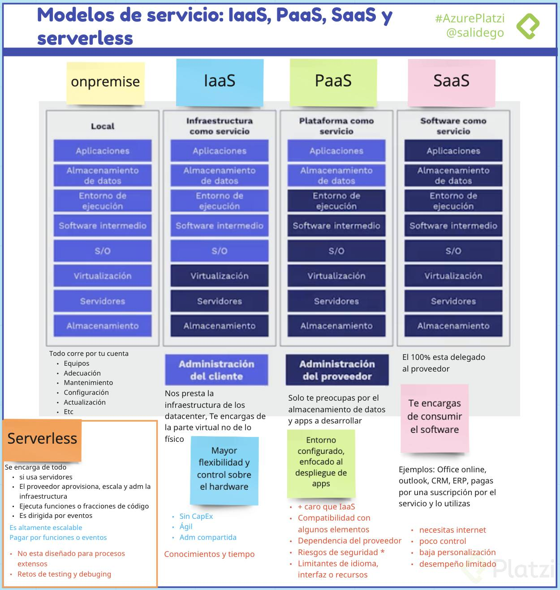
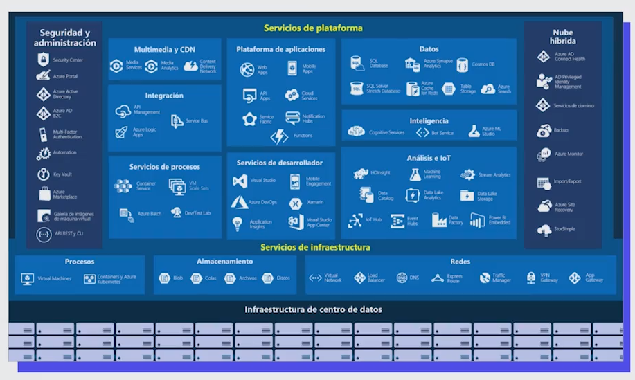
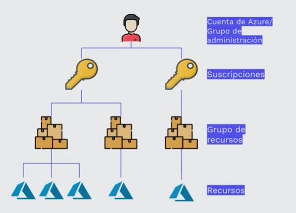
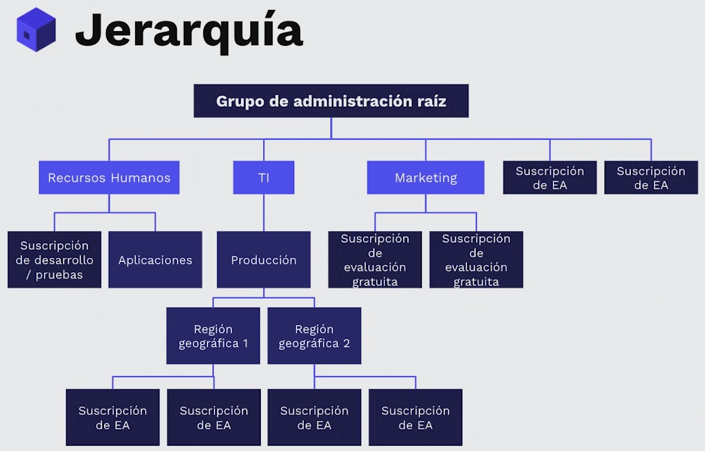
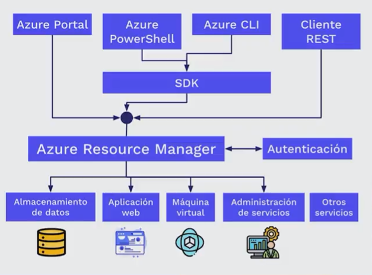
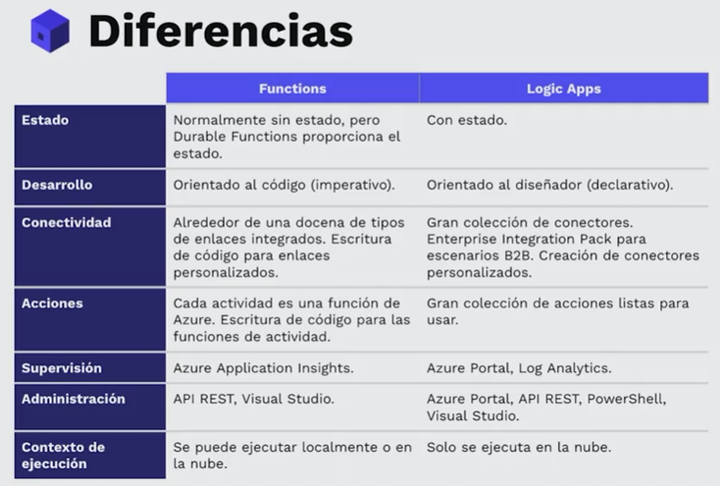
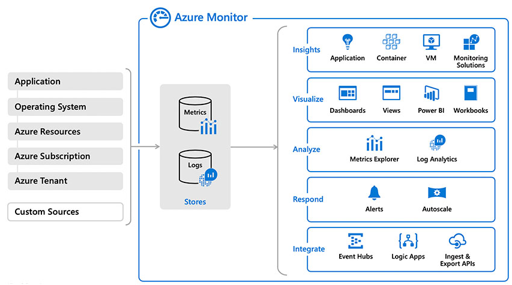

# Curso de introducción a la nube con Azure

## Introducción a computo en la nube

### Qué es la nube: ventajas y características

**Para qué?**

- Computo
- Servidores
- Almacenamiento y bases de datos
- Redes
- Inteligencia artificial

**Ventajas:**

- Modelo basado en consumo:
    - Pago por servicios usados
        - Reduce costos operativos
        - Optimiza la infraestructura
        - Escala según las necesidades
- CapEx vs OpEx
    - Gastos de capital (CapEx)
    - Gastos operativos (OpEx)
- Confiabilidad y alta disponibilidad
    - Experiencia de usuario sin tiempo de inactividad preceptible, aunque haya errores
- Escalabilidad
    - Vertical: aumentado de RAM/CPU o una VM
    - Horizontal: aumtentado de instancias de recursos
- Agilidad
    - Data centers en todo el mundo ofreciendo el mejor rendimiento a cada región

### Modelos de servicio: IaaS, SaaS y serverless

- **Local**: Todo corre por tu cuenta:
    - Equipos
    - Adecuación
    - Mantenimiento
    - Configuración
    - Actualización
- **IaaS**: Parecido a on-premise ofreciendo mayor flexibilidad y control sobre el hardware:
    - Sin CapEx
    - Ágil
    - Administración compartida
- PaaS:  Entorno administrado por el proveedor: VMs, red, infraestructura.
    
    Ventajas
    
    - Solo te preocupas por el desarrollo.
    - Configuración más ágil que IaaS
    - Enfocado al despliegue de aplicaciones
    
    Desventajas
    
    - Puede ser más caro que IaaS
    - Compatibilidad con algunos elementos
    - Dependencias con el proveedor
    - Riesgos de seguridad
    - Limitantes de idioma, interfaz o recursos
    
- SaaS:  El proveedor administra el 100% del entorno y los usuarios solo utilizan la aplicación que se ejecuta en la nube
    
    Ventajas
    
    - Office Online.
    - Outlook.
    - CRM.
    - ERP.
    
    Desventajas
    
    - Se necesita conexión a internet.
    - Poco control.
    - Baja personalización.
    - Desempeño limitado.
    
- Serveless:
    
    Ventajas
    
    - Altamente escalable.
    - Enfocada a la lógica de negocio.
    - Ahorro de tiempo.
    - Desarrollo ágil.
    - Pago por uso.
    
    Desventajas
    
    - No están diseñada para procesos extensos.
    - Detalles de desempeño.
    - Retos de testing y debugging.
    

  

### Tipos de nubes: pública, privada e híbrida

**Nube pública**

- Accesible a todo el mundo
- Son propiedad de un proveedor
- Se distribuye a través de internet

**Nube privada**

- Accesible para algunos miembros de una organización
- Puede estar on-premise u hospeada

**Nube híbrida**

- Combinación de on-premise, nube pública y privada

## Componentes de Azure

### Qué es Azure?

  

### Cuentas de Azure

**Recursos**

Son instancias de los servicios disponibles:

- Máquinas virtuales
- Discos duros
- FaaS
- Bases de datos

**Grupo de recursos**

Es un contenedor lógico donde se implementan y administran recursos de Azure

- Aplicaciones web

**Suscripciones**

Es una agrupación de cuentas de usuario y recursos creados por estas cuentas.

Pueden tener limites o cuotas definidas.

**Grupos de administración**

Administran el acceso, las directivas y cumplimiento de las suscripciones.

Las suscripciones heredan las condiciones de su grupo.

  

### Suscripciones y grupos de administración

**Se necesita de una suscripción de Azure para utilizar sus servicios:**

- **Desarrollador**: pagas por los servicios a medida que los utilices.
- **Prueba**: experimentar de manera gratuita.
- **Suscripción**: a través de un partner compras servicios de Azure.
- **Estudiante**: a través de un email autorizado (.edu)

**Limites**

1. **Facturación:** forma de facturarse. Cada suscripción tiene su factura.
2. **Control de acceso:** cada suscripción tiene directivas de acceso.

**¿Cuándo se necesita más suscripciones?**

- **Entorno:** separación de entornos de trabajos como desarrollo, pruebas, aislamiento de datos, entre otros.
- **Estructura Organizacional:** limitaciones según presupuesto, tiempo, por equipos o acceso a recursos.
- **Facturación:** para facilitar el seguimiento de costos según entornos como producción, desarrollo o pruebas.
- **Límites por suscripción:** Pueden haber algunas limitaciones de hardware por suscripción, entonces es necesario crear nuevas.

**Grupos de Administración**

  

**Consideraciones:**

- Hasta 10 000 grupos de administración en un único directorio.
- El árbol de grupo de administración puede admitir hasta seis niveles de profundidad.
- Cada grupo de administración y suscripción solo puede admitir un elemento primario.
- Cada grupo de administración puede tener muchos elementos secundarios.
- Todas las suscripciones y grupos de administración están dentro de una única jerarquía en cada directorio.

<aside>
💡 Consideraciones
- Has 10.000 grupos de administración por directorio.
- El árbol de un grupo admite hasta 6 niveles.

</aside>

### Recursos y grupo de recursos

**Conceptos importantes**

**Recurso**: elemento administrable en Azure.

**Grupo de recursos**: contenedor de recursos relacionados a una solución

**Características**

- Todos los recursos deben estar en un grupo
- No se pueden anidar
- Facilitan la administración y organización.

**Ciclo de vida**

Al eliminar un grupo de recursos, también elimina todos los recursos contenidos.

**Autorización**

Utilizan permisos de control basado en roles (RBAC, Role Based Access Control), permitiendo acceso solo a lo necesario.

**Azure resources manager**

  

**Ventajas de Azure resource manager**

- Plantillas en JSON.
- Administrar recursos por grupo.
- Capacidad de reutilización
- RBAC
- Etiquetas
- Facturación

### Regiones

Área geográfica con por lo menos un data center. Algunos servicios son exclusivos de ciertas regiones

- Canada East
- North Europe
- South Africa North

Regiones especiales

- US DoD
- US Gov Virginia
- China East
- China North

### Laboratorio: crear un sitio en WordPress

[Hospedaje de una aplicación web con Azure App Service](https://docs.microsoft.com/es-es/learn/modules/host-a-web-app-with-azure-app-service/)

## Servicios en Azure

### Análisis y bases de datos

- **Azure Cosmos DB**
    - Servicio de bases de datos NoSQL elástico e independiente al rendimiento y almacenamiento de las regiones.
        - Flexibilidad: Almacenamiento de datos en formato de secuencia de registro de átomos (ARS). Se abstraen los datos y se proyectan como una API.
        - Compatibilidad: SQl, Gremlin, Casandra y mongoDB.
- **Azure SQL Database**
    - Basado de SQL Server.
- **Azure SQL Managed Instances**
    - Comando para backup.
    - Common language runtime (CLR).
    - Transacciones entre bases de datos.
    - No cuenta con escalado automático.

### Servicios de análisis y big data

- **Azure Synapse Analytics**
    - Análisis de datos de todo tipo: sin procesar, refinados o seleccionados.
    - Por medio de recursos sin servidor o provisionados.
    - Compatible con SQL y Apache Spark.
- **Azure HDInsight**
    - Análisis de datos de open source.
    - Procesa grandes volúmenes de datos.
    - Puede crear clusters de tipo Spark, Hadoop, Kafka, HBase y más.
    - Admite ETLs.
- **Azure Databricks**
    - Descubre información de volúmenes masivos de datos.
    - Compatible con Apache Spark.
    - Funciona Python, Scala, R, Java, SQL, TensorFlow Pytorch y Scikit-Learn.
- **Azure Data Lake Analytics**
    - Realiza análisis bajo demanda.
    - Enfocado a ETL en lugar de configurar hardware.
    - Modelo pay as you go.

### Servicios de cómputo en la nube

- Azure Virtual Machines
    - IaaS
    - Conveniente para:
        - Pruebas y desarrollo.
        - Ejecutar aplicaciones en la nube.
        - Extender recursos en la nube.
        - Recuperación ante desastres.
    - Migración (lift-and-shift)
- Azure Batch
    - Conjuntos de VMs.
    - Configuración en minutos de máquinas idénticas.
    - Aumento o disminución automático.
- Azure Container Instances
    - PaaS para ejecución de contenedores
        - Sencillo
        - Sin servicios adicionales
        - Permite carga de contenedores
- Azure Kubernetes Service
    - Orquestación (automatización y administración) de contenedores en volumen.
    - Utilidad de contenedores:
        - Dividir las partes de una aplicación.
        - Hacer cambios sin afectar otras partes.
        - Hacer pruebas en entornos aislados
- Azure App Service
    - PaaS para crear y alojar aplicaciones conectadas a la web.
    - Compatible con Windows, Linux e implementaciones automatizadas.
    - Tipos de servicios:
        - Aplicaciones web.
        - Aplicaciones de API.
        - Operaciones en segundo plano.
        - Aplicaciones móviles.
- Azure Functions (Serveless)
    - Funciones que responden a eventos:
        - Peticiones REST.
        - Temporizador.
        - Mensajes de otro servicio.
    - Escalan automáticamente.
    - Sin estado.
    - Con estado (Durable Functions).
- Azure Logic Apps (Serveless)
    - Flujos de trabajo basados en eventos.
    - Cuenta con una GUI.
    - Se crean de forma visual o en JSON.
    - Cuenta con más de 200 conectores y bloques.
- Windows Virtual Desktop
    - Tener Windows en cualquier lugar.
    - Compatible con los sistemas operativos mas populares o incluso navegadores web.
    - Ventajas:
        - Compatibilidad.
        - Mejor experiencia de uso.
        - Seguridad.
        - Rendimiento.
        - Inicio de sesión múltiple.
        - Licencias propias.

  

Laboratorio

[Ejercicio: Creación de una máquina virtual Windows](https://docs.microsoft.com/es-es/learn/modules/create-windows-virtual-machine-in-azure/3-exercise-create-a-vm)

[Ejercicio: Conexión a una máquina virtual Windows mediante RDP](https://docs.microsoft.com/es-es/learn/modules/create-windows-virtual-machine-in-azure/5-exercise-connect-to-a-windows-vm-using-rdp)

### Almacenamiento

- Azure Blob Storage
    - Almacenamiento no estructurado.
    - Sin restricciones.
    - Soporta miles de cargas simultáneas.
    - Ideal para:
        - Visualizar imágenes o videos.
        - Acceso distribuido.
        - Streaming.
        - Backup.
        - Análisis de datos.
        - Almacenamiento de VMs >8 TB
- Azure Files
    - Recursos compartidos administrados en la nube bajo protocolos SMB y NFS.
    - Pueden estar en local o en la nube.
    - Ideal para:
        - Cuando muchas aplicaciones usan recursos compartidos.
        - Acceder a recursos desde varias VMs.
        - Similar a OneDrive.

Niveles de acceso

- Frecuente: Imágenes o descargas de un sitio web.
- Esporádico (30 días): Reportes mensuales, facturas, etc.
- Archivo (180 días): Copias de seguridad.

**Laboratorio**

[Ejercicio: creación de una cuenta de almacenamiento mediante Azure Portal](https://docs.microsoft.com/es-es/learn/modules/create-azure-storage-account/5-exercise-create-a-storage-account)

### Red

- Azure Virtual Network
    
    Permite a los recursos de Azure comunicarse entre sí, con usuarios de internet y equipos cliente en local.
    
    - Aislamiento y segmentación
    - Comunicación con internet
    - Comunicación entre recursos
        - Redes virtuales.
        - Puntos de conexión de servicio.
    - Comunicación entre recursos locales
        - Redes virtuales de punto a sitio.
        - Redes privadas virtuales (VPN) de sitio a sitio.
        - Azure ExpressRoute.
    - Enrutamiento del tráfico de red
        - Tablas de ruta.
        - Protocolo de puerta de enlace de borde (BGP).
    - Filtrado del tráfico de red
        - Grupos de seguridad de red.
        - Aplicaciones virtuales de red.
- Azure VPN Gateway
    
    Conecta redes locales a Azure vía VPN de sitio a sitio/punto, a sitio, a través de protocolos IPsec e IKE.
    
- Azure ExpressRoute
    
    Genera conexiones privadas entre Azure y la infraestructura, de forma confiable y rápida, sin utilizar internet público
    

**Laboratorio**

[Ejercicio: creación de una red virtual de Azure](https://docs.microsoft.com/es-es/learn/modules/configure-network-for-azure-virtual-machines/3-exercise-create-azure-virtual-network)

[Ejercicio: Creación de una instancia de Azure VPN Gateway](https://docs.microsoft.com/es-es/learn/modules/configure-network-for-azure-virtual-machines/5-exercise-create-azure-vpn-gateway)

### Inteligencia artificial

- Azure Machine Learning : PaaS para realizar predicciones conectándose a datos para entrenar y probar modelos. Ofrece control completo del diseño y entrenamiento de algoritmos.
- Azure Cognitive Services: Modelo de ML creados que permiten a una aplicación ver, oír, hablar entender y pensar. No se necesitan conocimientos de Ml o DS.
    - Lenguaje
    - Voz
    - Visión
    - Decision
- Azure Bot Service.

**Laboratorio**

[Ejercicio: análisis de imágenes con el servicio Computer Vision](https://docs.microsoft.com/es-es/learn/modules/analyze-images-computer-vision/3-analyze-images)

### DevOps

- Azure DevOps Services.
    - Azure Repos : Repositorios de código fuente centralizado para publicar código y colaborar.
    - Azure Boards: Tableros para gestión de proyectos como Kanban, informes, incidencias, pics, etc.
    - Azure pipelines: Herramienta de automatización de:
        - Continuos Integration
        - Continuos Delivery
    - Azure Artifacts: Repositorio para alojar *artefactos* que se incluyen en el flujo de pruebas o implementación.
    - Azure Test Plans: Herramientas de pruebas automatizadas para garantizar la calidad antes de lanzar software
    - Azure DevTest Labs: • Medio automatizado para administrar proceso de compilación, configuración y anulación de VMs y otros recursos.

### Monitoreo y supervisión

- Azure Advisor: nos brinda consejos y evalúa recursos a través del portal de Azure o su API.
- Azure Monitor: recopila datos para tomar decisiones basados en métricas del entorno local o la nube. Las fuentes son diversas como ser SO, aplicaciones, suscripciones.
    

  

    
- Azure Service Health: brinda una vista personalizada del estado de los servicios, regiones y recursos de Azure.

### Laboratorio

****[Ejercicio: Configuración de una máquina virtual con diagnósticos de arranque](https://docs.microsoft.com/es-es/learn/modules/monitor-azure-vm-using-diagnostic-data/3-exercise-create-virtual-machine)****

****[Ejercicio: Configuración de la extensión Azure Diagnostics](https://docs.microsoft.com/es-es/learn/modules/monitor-azure-vm-using-diagnostic-data/6-exercise-configure-azure-diagnostic-extension)****

### Administración y configuración de entorno

- Herramientas visuales
    - Azure portal
    - Azure mobile app
- Herramientas de comandos
    - Azure PowerShell
    - Azure CLI
- Azure Resource Manager Templates

### Serverless

- **Azure Functions**: Alojamiento de métodos o funciones que se ejecutan en respuesta a eventos como:
    - Solicitudes HTTP.
    - Temporizadores.
    - Mensajes.
    - Acciones.
    
    Ventajas:
    
    - Escalado automático.
    - Pago por función ejecutada.
    - Con o sin estado.
    - Tareas de orquestación (durable functions).
    
- **Azure Logic Apps**:
    - No-code/Low-code.
    - Ideal para automatizar y organizar.
    - Integrar aplicaciones, datos y sistemas.
    
    Ventajas:
    
    - Escalado automático.
    - Pago por función ejecutada.
    - Con o sin estado.
    - Tareas de orquestación (durable functions).
    
    **Principales diferencias**
    
    | Functions | Logic Apps |
    | --- | --- |
    | - Número de ejecuciones sobre el tiempo | - Número de ejecuciones y tipo de conectores |
    
    ### Laboratorio
    
    ****[Ejercicio: Incorporación de lógica a la aplicación de funciones](https://docs.microsoft.com/es-es/learn/modules/create-serverless-logic-with-azure-functions/5-add-logic-to-the-function-app?pivots=javascript)****
    
    ****[Ejercicio: Creación de una rama en función de las opiniones del tweet](https://docs.microsoft.com/es-es/learn/modules/route-and-process-data-logic-apps/8-ex-branch-based-on-tweet-sentiment)****
    
    [Ejercicio: Creación de una aplicación de funciones en Azure Portal](https://docs.microsoft.com/es-es/learn/modules/create-serverless-logic-with-azure-functions/3-create-an-azure-functions-app-in-the-azure-portal?pivots=javascript)
    
    [Ejercicio: Creación de la aplicación lógica de seguimiento de redes sociales](https://docs.microsoft.com/es-es/learn/modules/route-and-process-data-logic-apps/4-ex-create-social-media-tracker)
    
    [Ejercicio: Análisis del contenido de un tweet](https://docs.microsoft.com/es-es/learn/modules/route-and-process-data-logic-apps/6-ex-analyze-content-of-tweet)
    
    [Ejercicio: Creación de una rama en función de las opiniones del tweet](https://docs.microsoft.com/es-es/learn/modules/route-and-process-data-logic-apps/8-ex-branch-based-on-tweet-sentiment)
    

### IoT

- Azure IoT Hub
    - Centro de mensajes entre aplicaciones IoT y dispositivos.
    - Permite control remoto manual o automatizado de dispositivos.
    - Cuenta con supervisión
- Azure IoT Central
    - Basado en IoT Hub con interfaz visual.
    - Posee plantillas para escenarios comunes.
- Azure Sphere
    - Avnet Azure Sphere MT3620 Starter Kit
    - Seeed MT3620 Mini Dev Board
    - Kit de desarrollo de Seeed Azure Sphere MT3620
    
    Partes:
    
    - Unidad de Microcontrolador (MCU).
    - Sistema operativo (SO).
    - Servicio de seguridad (AS3).
    
    Requisitos:
    
    - Kit de desarrollo
    - Windows
        - Visual Studio
        - Visual Studio Code
        - Linea de comandos con CMake
    - Linux
        - Visual Studio Code
        - Linea de comandos CMake

### Seguridad

- Azure Security Center
    
    Servicio que brinda visibilidad del nivel de seguridad de los servicios den Azure y local.
    
    - Supervisa la configuración de seguridad.
    - Aplica cambios automáticamente.
    - Brinda recomendaciones.
    - Detecta y bloquea amenazas de malware con ML.
    - Detecta ataques e investiga amenazas.
    - Proporciona control de acceso Just-in-Time.
- Puntuación de seguridad
    
    Es la medida del nivel de seguridad y permite:
    
    - Notificar el estado actual.
    - Mejora el nivel.
    - Compara puntos de referencia.
- Azure Sentinel
    - SIEM en la nube de análisis de seguridad y amenazas.
        - Recopila datos en volumen.
        - Detecta amenazas
        - Investiga con IA.
        - Responde a incidentes.
- Azure Key Vault
    
    Servicio centralizado para almacenar datos conficenciales.
    
    - Secretos.
    - Claves de cifrado.
    - Certificados SSL/TLS.
    - Respaldos por módulos de seguridad de hardware (HMS).
- Azure Dedicated Host
    
    Servicios físicos que no se comparten con otros inquilinos y/o aplicaciones.
    
    - Ofrece visibilidad y control.
    - Asegura requisitos de cumplimiento.
    - Personalizable.
    - Puede tener mayor costo.
- Servicios de seguridad de red:
    - Azure Firewall
    - Azure DDoS Protection
- Servicios de identidad
    - **Autenticación (AuthN):** Solicitar credenciales legítimas.
    - **Autorización (AuthZ):** Establecer el nivel de acceso a una persona o servicio autenticado.
    - Azure active Directory.
    - Multi-Factor Authentication.
    - Inicio de sesión único (SSO).

Laboratorio:

[Ejercicio: Administración de una contraseña en Azure Key Vault](https://docs.microsoft.com/es-es/learn/modules/protect-against-security-threats-azure/5-manage-password-key-vault)

[Ejercicio: agregar o eliminar usuarios en Azure Active Directory](https://docs.microsoft.com/es-es/learn/modules/create-users-and-groups-in-azure-active-directory/3-exercise-add-delete-users-azure-ad)

[Ejercicio: asignar usuarios a grupos de Azure Active Directory](https://docs.microsoft.com/es-es/learn/modules/create-users-and-groups-in-azure-active-directory/5-exercise-assign-users-azure-ad-groups)

[Ejercicio: Habilitación de Azure AD Multi-Factor Authentication](https://docs.microsoft.com/es-es/learn/modules/secure-aad-users-with-mfa/4-exercise-mfa)

## Acuerdos de nivel de servicio (SLA)

### Administración de costos de servicio

- Calculadora de costo total de propiedad (TOC)
    - Ayuda a calcular los costos de Azure vs. local.
    - Deben considerarse costos indirectos, diferencias de zona, promedios, etc.

### ****Acuerdos de nivel de servicio y ciclo de vida****

Contrato formal entre empresa de servicios y cliente. Define estándares de rendimiento que Microsoft se compromete a brindar.

**¿Qué incluyen?**

- Introducción.
- Términos generales.
- Detalles del SLA (Service Level Agreement).

## Bonus: Laboratorios para aprender más

### Conoce los servicios especializados de Azure

Te recomendamos que tomes el siguiente módulo en Microsoft Learn donde aprenderás:

- Elegir el mejor servicio de Azure IoT para tu aplicación
- Elegir el mejor servicio de IA para tus necesidades
- Elegir la mejor tecnología *serverless* de Azure para un escenario empresarial
- Elegir las mejores herramientas para ayudar a que las organizaciones creen mejores soluciones
- Elegir las mejores herramientas para administrar y configurar un entorno de Azure
- Elegir el mejor servicio de supervisión para visibilidad, información y mitigación de interrupciones

[Aspectos básicos de Microsoft Azure: Descripción de las principales soluciones y herramientas de administración de Azure](https://docs.microsoft.com/es-es/learn/paths/az-900-describe-core-solutions-management-tools-azure/?ns-enrollment-type=Collection&ns-enrollment-id=xgg5bxjg1owzm7)

### Conociendo los servicios básicos de Azure

La nube de Azure cuenta con un sin fin de servicios: desde bases de datos hasta almacenamiento. En este módulo de Microsoft Learn podrás conocer e identificar los servicios básicos que ofrece Azure.

En este módulo aprenderás sobre:

- Los servicios de Azure Compute
- Los servicios de red de Azure
- Los servicios de Azure Storage
- Los servicios de análisis y bases de datos de Azure

[Aspectos básicos de Microsoft Azure: Descripción de los servicios básicos de Azure](https://docs.microsoft.com/es-es/learn/paths/az-900-describe-core-azure-services/?ns-enrollment-type=Collection&ns-enrollment-id=xgg5bxjg1owzm7)

### Introducción a SQL Server en Linux

Una de las bases de datos más importantes en el sistema corporativo es SQL Server de Microsoft. Como profesional de la nube de Azure es bueno que conozcas este gestor de bases de datos relacionales y sepas cómo implementarlo en tus soluciones:

Para ello te recomiendo que tomes el siguiente módulo en la plataforma de Microsoft Learn en el cual aprenderás a:

- Describir las ventajas principales de ejecutar SQL Server en Linux
- Describir las herramientas de Windows y multiplataforma que se pueden usar para administrar SQL Server en Linux.
- Describir las ventajas de ejecutar SQL Server en máquinas virtuales Linux.
- Describir las ventajas de ejecutar SQL Server en entornos de ejecución de contenedor, como Docker.

[Introducción a SQL Server en Linux](https://docs.microsoft.com/es-es/learn/modules/introduction-sql-server-linux/?ns-enrollment-type=Collection&ns-enrollment-id=xgg5bxjg1owzm7)

### Hospedaje de una aplicación web

Azure App Service te permite crear y hospedar aplicaciones web en el lenguaje de programación que prefiera sin tener que administrar la infraestructura. Aprende a crear un sitio web mediante la plataforma de aplicaciones web hospedada en Azure App Service.

En este módulo de Microsoft Learn aprenderás a:

- Usar Azure Portal para crear una aplicación web de Azure App Service.
- Usar herramientas de desarrollo para crear el código para una aplicación web de inicio.
- Implementar el código en Azure App Service.

[Hospedaje de una aplicación web con Azure App Service](https://docs.microsoft.com/es-es/learn/modules/host-a-web-app-with-azure-app-service/?ns-enrollment-type=Collection&ns-enrollment-id=xgg5bxjg1owzm7)

### Creación de lógica serverless con Azure Functions

Azure Functions permite a los desarrolladores hospedar lógica de negocio que se puede ejecutar sin administrar ni aprovisionar infraestructura. Podemos verlo como un pequeño pedazo de código que podemos ejecutar en cualquier momento de manera remota.

Si quieres aprender más sobre cómo crear e implementar este tipo de funciones te recomiendo tomar el siguiente módulo de Microsoft Learn en el cual aprenderás a:

- Decidir si la informática sin servidor es adecuada para las necesidades empresariales
- Crear una aplicación de función de Azure en Azure Portal
- Ejecutar una función mediante desencadenadores
- Supervisar y probar la función de Azure desde Azure Portal

[Creación de lógica sin servidor con Azure Functions](https://docs.microsoft.com/es-es/learn/modules/create-serverless-logic-with-azure-functions/?ns-enrollment-type=Collection&ns-enrollment-id=xgg5bxjg1owzm7)