# Fundamentos de Arquitectura de Software<!-- omit in toc -->

## Tabla de Contenido<!-- omit in toc -->
- [Etapas del proceso de desarrollo de software](#etapas-del-proceso-de-desarrollo-de-software)
- [Dificultades en el desarrollo de software](#dificultades-en-el-desarrollo-de-software)
- [¿Cómo resolver las dificultades esenciales?](#cómo-resolver-las-dificultades-esenciales)
- [Roles](#roles)
  - [Metodología Tradicional](#metodología-tradicional)
  - [Metodología Ágil](#metodología-Ágil)
- [¿Qué es arquitectura de software?](#qué-es-arquitectura-de-software)
- [Ley de Conway](#ley-de-conway)
- [Objetivos del Arquitecto](#objetivos-del-arquitecto)
- [Arquitectura y Metodologías](#arquitectura-y-metodologías)
- [Entender el problema](#entender-el-problema)
- [Requerimientos](#requerimientos)
  - [Requerimientos de Producto](#requerimientos-de-producto)
  - [Requerimientos de proyecto](#requerimientos-de-proyecto)
- [Riesgos](#riesgos)
- [Restricciones](#restricciones)
- [Estilos de Arquitectura](#estilos-de-arquitectura)
  - [Estilo de Arquitectura: Llamada y Retorno](#estilo-de-arquitectura-llamada-y-retorno)
  - [Estilo de Arquitectura: Flujo de Datos](#estilo-de-arquitectura-flujo-de-datos)
  - [Estilo de Arquitectura: Centrados en Datos](#estilo-de-arquitectura-centrados-en-datos)
  - [Estilo de Arquitectura: Componentes Independientes](#estilo-de-arquitectura-componentes-independientes)
  - [Comparando Estilos: ¿Cómo Elijo?](#comparando-estilos-cómo-elijo)
- [Recursos Complementarios](#recursos-complementarios)
- [Enlaces de Interés](#enlaces-de-interés)

## Etapas del proceso de desarrollo de software

El proceso de desarrollo tradicional tiene etapas muy marcadas, que tienen entradas, procesos y salidas que funcionan como entradas de la siguiente etapa.

**Análisis de requerimientos**: Todo nace de un disparador que nos crea la necesidad de crear un artefacto o un sistema. Necesitamos entender cuál es el problema que queremos resolver. Hay requerimientos de negocio, requerimientos funcionales, requerimientos no funcionales.

  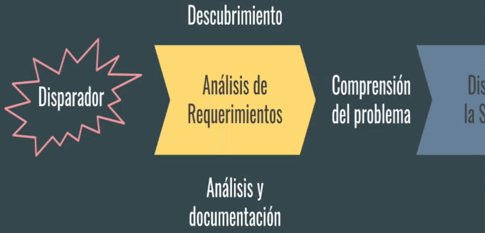

**Diseño de la solución**: Análisis profundo de los problemas para trabajar en conjunto y plantear posibles soluciones. El resultado de esto debe ser el detalle de la solución, a través de requerimientos, modelado, etc.

  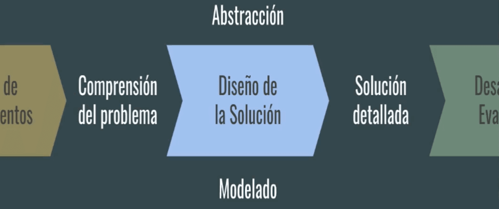

**Desarrollo y evolución**: Implementación de la solución, para garantizar que lo que se esta construyendo es lo que se espera. Al finalizar esta etapa tendremos un artefacto de software.

  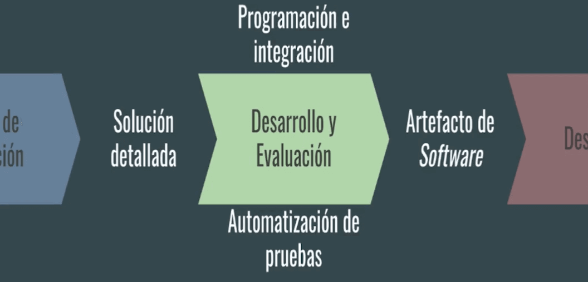

**Despliegue**: Aquí vamos a necesitar de infraestructura y de roles de operación para poder poner el artefacto a disponibilidad.

  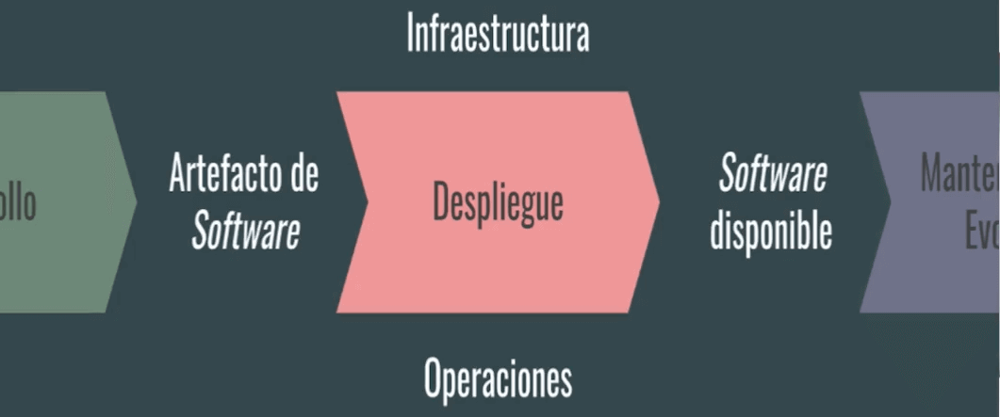

**Mantenimiento y evolución**: Desarrollo + despliegue + mantenimiento, en esta etapa estamos atentos a posible mejoras que se hacen al sistema. En esta etapa el software se mantiene hasta que el software ya deja de ser necesario.

  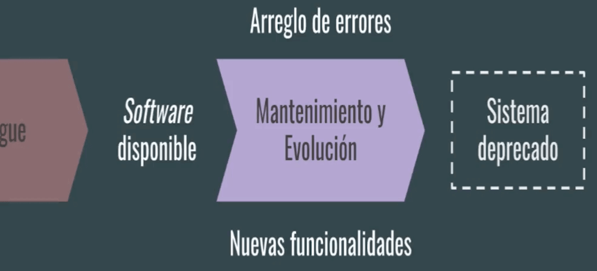

  <small><a href="#tabla-de-contenido">🡡 volver al inicio</a></small>

## Dificultades en el desarrollo de software

1. **Esenciales**: Especificación, diseño y comprobación del concepto
   * **Complejidad**: Cuando un dominio de un problema es complejo en sí mismo. En el caso de adiciones y todas las acciones que conlleven al sistema a ser más complejo.
   * **Conformidad**: En qué contexto se usa el software y cómo debe adecuarse al mismo. Se incluyen todo lo que le compete. Ej: Ambiente, conectividad, impuestos, etc.
   * **Tolerancia al Cambio**: Posibilidad del cambio del software y que sea responsivo a diferentes contextos. Cuánto cambia el contexto y cómo lo podemos adaptar al cambio. Ejemplo: los software de impuestos.
   * **Invisibilidad**: el software no es tangible y pon ende no tiene forma.
  
2. **Accidentales**: Está relacionado con la plataforma que vamos a implementar, tecnología, lenguajes, frameworks, integraciones, etc.
   * Lenguajes de alto nivel
   * Multi-procesamiento
   * Entornos de programación

>"Concidero a la especificación, diseño y comprobación del concepto la parte difícil de hacer software. (…) Si esto es cierto, hacer software siempre será difícil. No existe la bala de plata."  
No Silver Bullet (Frederick P. Brooks Jr., 1986)

  <small><a href="#tabla-de-contenido">🡡 volver al inicio</a></small>

## ¿Cómo resolver las dificultades esenciales?

* **No desarrollar**: comprar algo ya desarrollado o usar open source.
* **Prototipado rápido**: feedback y ciclos rápidos para ver si estamos teneniendo el ptototipado correcto. Uso de metodología ágiles.
* **Desarrollo evolutivo**: desarrollos pequeños. Paso a paso pero de manera firme e ir haciendo crecer el software.
* **Grandes diseñadores**: arquitectos que saben abtraer el problema y que realiza soluciones elegantes, de manera simple, con la mejor calidad posible en los componentes que lo necesitan.

  <small><a href="#tabla-de-contenido">🡡 volver al inicio</a></small>

## Roles

El rol es diferente al puesto de trabajo.

  <small><a href="#tabla-de-contenido">🡡 volver al inicio</a></small>

### Metodología Tradicional

* **Experto de Dominio**: Es la persona que acudimos para resolver las necesidades de los requerimientos (saber qué es lo que el negocio o usuario necesitaba).

* **Analista**: Es la Persona que indaga en que es lo que hay que resolver, define un problema y define los requerimientos.

* **Administrador de sistemas**: Se encargaban de toda la operación del sistema (Si había servidores, actualizar librerias, encontrar errores en los logs y dar el feedback al equipo de desarrollo).

* **QA**: Equipo de evaluar el software. Comprobar que lo que se está haciendo tenga el comportamiento esperado.

* **Desarrollador**: Encargados de desarrollar e implementar el software.

* **Arquitecto**: Diseño de la solución y el análisis de los requerimientos, especialmente los no funcionales y arquitectónico relevantes. 

* **Gestor del proyecto**: Encargado de las entregas, cumplir con el plan y el ciclo de vida del proyecto.

  <small><a href="#tabla-de-contenido">🡡 volver al inicio</a></small>

### Metodología Ágil

* **Experto de dominio**: son las partes interesadas o los stakeholders del producto software.

* **Dueño del producto / Cliente**: Es quien define los requerimientos del sistema. Tiene el rol de armar las historias de usuario y nos acompaña durante la construcción del softrware.

* **DevOps**: responsable de entender la infraestructura donde va a ir la aplicación y entender los requerimientos del servidor.

* **SRE (Site Reliability Engineer)**: trata de conectar la infraestructura con el día a día del desarrollo de la aplicación.

* **Equipo de desarrollo**: Todo el equipo pueda desarrollar los diferentes roles. Se espera que la arquitectura emerja del trabajo de un equipo bien gestionado.

* **Facilitador**: En scrum son los scrum master. llevan al equipo al ciclo de desarrollo iterativo. Buscan entender al equipo y ver qué es lo que los traba. También planean qué es lo que hay que hacer en el siguiente sprint. Están atentos a las fechas y los entregables. 

  <small><a href="#tabla-de-contenido">🡡 volver al inicio</a></small>

## ¿Qué es arquitectura de software?

>"La estructura del sistema [o arquitectura], compuesta por elementos de software, sus propiedades visibles y sus relaciones"  
Software Architecture in Practice (Bass, Clements & Kazman, 2003)

La arquitectura es algo estructural. Por ejemplo, agrupar en módulos o agrupar diferentes objetos. 

>"El conjunto de decisiones principales de diseño tomadas para el sistema"  
Software Architecture: Foundations, Theory and Practice (Taylos, 2010)

>"(...) la arquitectura se reduce a las cosas importante, cualesquiera que sean."  
Patterns of Enterprise Application Architecture  (Fowler, 2002)

El principal objetivo de la arquitectura es encontrar los problemas y diseñar una solución a gran escala que ataque a esos problemas.

  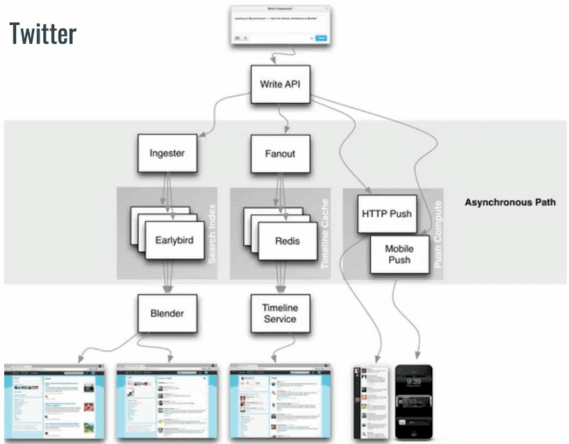
  <small>
Arquitectura de Twitter
</small>

  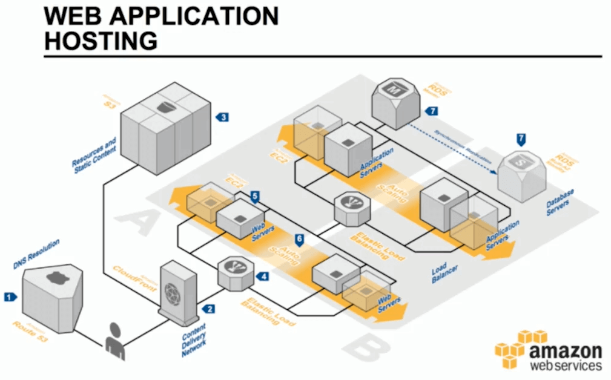
  <small>
Arquitectura de Amazon
</small>

  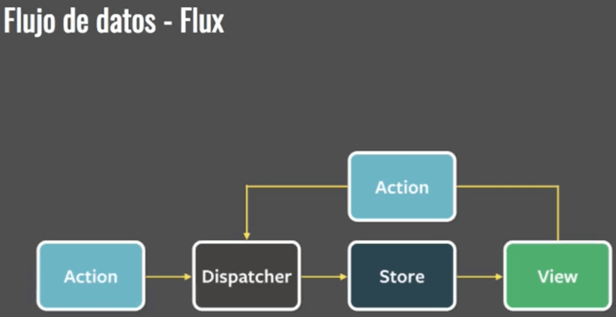
  <small>
Arquitectura de Flux
</small>

  <small><a href="#tabla-de-contenido">🡡 volver al inicio</a></small>

## Ley de Conway

>"Cualquier organización que diseñe un sistema producirá un diseño que copia la estructura de comunicación de dicha organización."

Una empresa u organización va a poder generar estructuras que imiten la via de comunicación de su propia organización.

Las organizaciones dedicadas al diseño de sistemas están abocadas a producir diseños que son copias de las estructuras de comunicación de dichas organizaciones.

La afirmación se basa en que dos módulos o subsistemas no pueden interactuar correctamente a menos que los diseñadores de ambos subsistemas se comuniquen entre sí. Por lo tanto, la estructura de las interfaces del sistema será congruente con las estructuras sociales de la organización que produce el sistema.

  <small><a href="#tabla-de-contenido">🡡 volver al inicio</a></small>

## Objetivos del Arquitecto

El arquitecto conecta a los stakeholders y sus requerimientos con la implementación del sistema.

Los Requerimientos de cada stakeholder afectan de forma única el sistema.

* **Cliente**: Entrega a tiempo y dentro del presupuesto.
* **Manager**: Permite equipos independientes y comunicación clara.
* **Dev**: Que sea fácil de implementar y de mantener.
* **Usuario**: Es confiable y estará disponible cuando lo necesite.
* **QA**: Es fácil de comprobar.

La unión de todos estos requerimientos (funcionales o no funcionales) van a llevar al arquitecto a tomar decisiones que impacten sobre el sistema.

  <small><a href="#tabla-de-contenido">🡡 volver al inicio</a></small>

## Arquitectura y Metodologías

  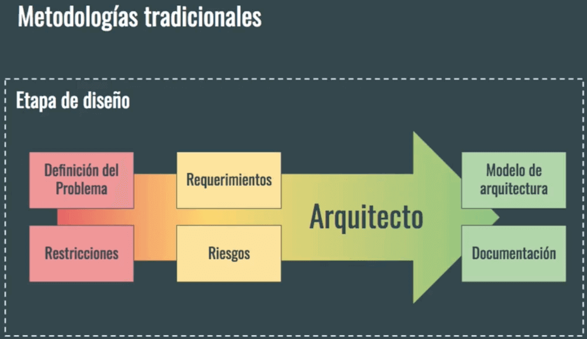
  <small>
Arquitectura Tradicional
</small>

  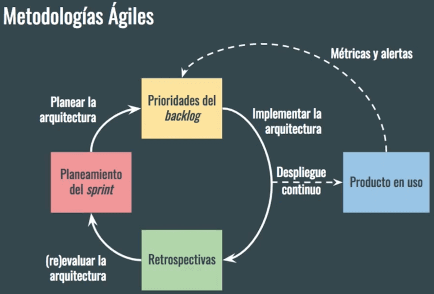
  <small>
Arquitectura Ágil
</small>

  <small><a href="#tabla-de-contenido">🡡 volver al inicio</a></small>

## Entender el problema

Separar la comprensión del problema de la propuesta de solución.

Separar el espacio del problema del espacio de la solución:

* **El espacio del problema**: Detalla que es lo que se va a resolver sin entrar en detalles del “cómo”.
* **El espacio de la solución**: Brinda el detalle del "cómo", reflejando los detalles del problema detectado, evitando resolver problemas que no se quiere resolver.

  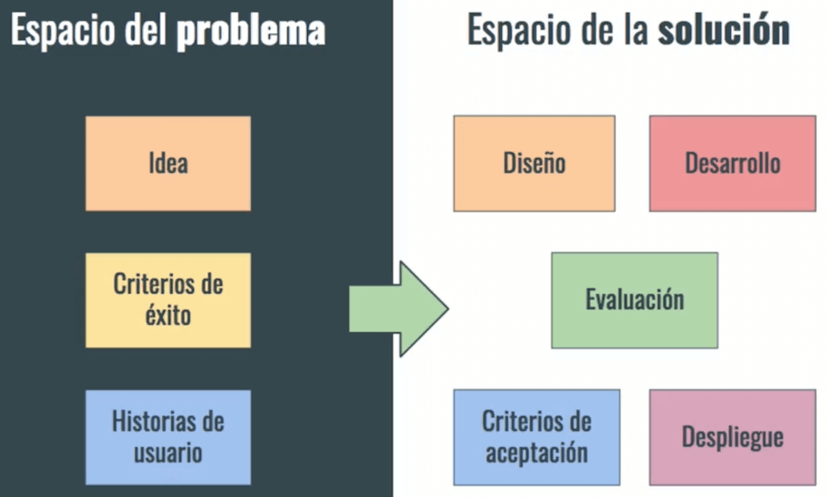
  <small>
Problema vs Solución
</small>

  <small><a href="#tabla-de-contenido">🡡 volver al inicio</a></small>

## Requerimientos

Una vez que entendemos el espacio del problema y el espacio de la solución, vamos a entrar a analizar los requerimientos de nuestro sistema.

  <small><a href="#tabla-de-contenido">🡡 volver al inicio</a></small>

### Requerimientos de Producto

* **Capa de requerimientos de negocio**: son reglas del negocio que alimentan los requerimientos del negocio.
  * **Requerimientos de Negocio**: van a ser alimentados por las reglas del negocio.  
  *Ejemplo*: Airbnb, quiere conectar vacacionistas con usuarios con lugar para hospedaje.
  * **Reglas de Negocio**: es la conexión entre el usuario y el problema que se intenta abarcar.  
  *Ejemplo*: Airbnb permite en el sistema el registro de dos tipos diferentes de usuario: el visitante y el proveedor.
* **Capa de usuario**: tienen que ver en cómo el usuario se desenvuelve usando el sistema, qué atributos del sistema se deben poner por encima de otros.
  * **Requerimientos de Usuario**: cómo el usuario se puede desenvolver en el sistema.  
  *Ejemplo*: Airbnb debe suplir los requerimientos de seguridad demanda por los usuarios, como conocer la identidad del proveedor del hospedaje.
  * **Atributos de Calidad**: qué atributos del sistema y como nos importan sobre otros. Es alimentada por las reglas de negocio.  
  *Ejemplo*: las metas a cumplir para que las reglas del negocio se cumplan según lo esperado.
  * **Requerimientos no Funcionales**: son aquellas necesidades del producto pero no son fundamentales para el producto.  
  *Ejemplo*: Garantías del sistema de Airbnb es seguro,
* **Capa Funcional**: se ven alimentados por requerimientos del sistema, ¿qué cosas tienen que pasar operativamente? Esta capa se ve afectada por las restricciones que pueden afectar operativamente a lo funcional.

  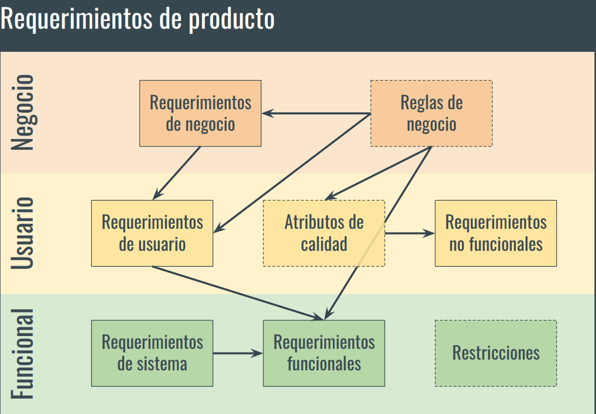
  <small>
Requerimientos de Producto
</small>

Otra clasificación de los requerimientos de producto:
* **Requerimientos funcionales**: (Funciones indispensables) Tienen que ver con las historias de usuarios, que hablan sobre específicamente lo que hace el sistema, por ejemplo que usuario ingrese al sistema.
* **Requerimientos no funcionales**: (Atributos de calidad): son aquellos que agregan cualidades al sistema, por ejemplo que el ingreso de ese usuario sea de manera segura.

  <small><a href="#tabla-de-contenido">🡡 volver al inicio</a></small>

### Requerimientos de proyecto

* Tienen que ver más con el rol de gestor de proyectos, se usan para dar prioridad a los requerimientos del producto.
* Estos dos mundos de requerimientos hablan de las prioridades del equipo de trabajo del proyecto.
* Tiene que ver con requerimientos logísticos, que no tienen que ver con el desarrollo del software.

  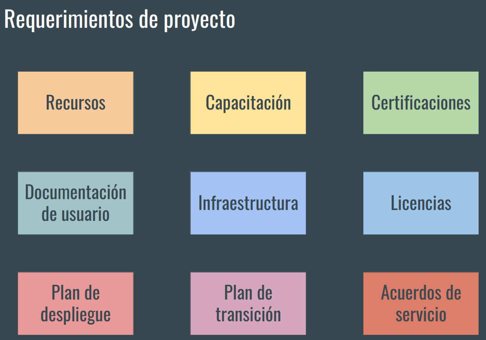
  <small>
Requerimientos del Proyecto
</small>

  <small><a href="#tabla-de-contenido">🡡 volver al inicio</a></small>

## Riesgos

Los riesgos son importantes para priorizarlos y atacarlos en orden y asegurar que las soluciones arquitectónicas que propongamos resuelvan los problemas más importantes.

Intenta tratar los riesgos con posibles escenarios de fracaso y que pasaría en caso de que ese riesgo se haga real.

**Tipos de riesgos**:
* **Riesgos de ingeniería**: Relacionados con el análisis, diseño e implementación del producto.
* **Riesgos de gestión del proyecto**: Relacionados con la planificación, secuenciamiento de trabajo, entregas, tamaño de equipo, etc.

**Cómo identificar riesgos**:
* **Toma de Requerimientos** (Requerimientos funcionales): Se calificará su riesgo de acuerdo a su dificultad o complejidad.
* **Atributos de calidad** (Requerimientos NO funcionales): Se calificará su riesgo de acuerdo a la incertidumbre que genere, cuanto mas incertidumbre hay, mas alto es el riesgo.
* **Conocimiento del dominio**: Riesgo prototípico, son aquellos que podemos atacar de forma estándar.

Luego de identificar los riesgos hay que priorizarlos para concentrarnos en resolverlos los más importantes.

Se priorizan los riesgos que ponen en peligro la solución a construir.

  <small><a href="#tabla-de-contenido">🡡 volver al inicio</a></small>

## Restricciones

>"Una restricción limita las opciones de diseño o implementación disponibles al desarrollador."  
Software Requirements: 3rd Edition (Wiegers, Betty, 2013)

Los StakeHolders, nos pueden poner limitaciones relacionadas con su contexto de negocio.

Por ejemplo:
* **Las limitaciones legales**, la implementación de un producto podría tener restricciones en algún país, y esto seria una limitante a considerar para el desarrollo del producto.
* **Limitaciones técnicas**, relacionadas con integraciones con otros sistemas.
* **El ciclo de vida del producto**, agregará limitaciones al producto, por ejemplo a medida que avanza el proceso de implementación el modelo de datos va a ser más difícil de modificar.

El arquitecto debe balancear entre los requerimiento y las restricciones.

  <small><a href="#tabla-de-contenido">🡡 volver al inicio</a></small>

## Estilos de Arquitectura

>"Un estilo de arquitectura es una colección de decisiones de diseño, aplicables en un contexto determinado, que restringen las decisiones arquitectónicas especificas en ese contexto y obtienen beneficios en cada sistema resultante."  
Software Architecture Foundations, Theory and Practice (Taylor, 2010)

Ningún estilo va a solucionar todos los software.

  <small><a href="#tabla-de-contenido">🡡 volver al inicio</a></small>

### Estilo de Arquitectura: Llamada y Retorno

Cada uno de los componentes hacen invocaciones a los componentes externos y estos retornan información.

Cada componente hace un llamado y espera una respuesta.

**Tipos de llamada y retorno**:

* **Programa principal y subrutinas**: Es el estilo más básico donde se tiene un programa principal y se manda a llamar subrutinas (la cual puede retornar o no un resultado). El programa principal continua hasta que ejecuten las subrutinas.

* **Orientada a Objetos**: Se utiliza para aplicaciones que vamos a mantener por mucho tiempo. Tratamos de juntar el estado de la aplicación creando objetos los cuales tienen una interfaz publica (interfaz en este caso se refiere a una definición de funciones o estructura que esta clase puede implementar) donde la llamada no es solo una subrutina, sino objetos que interactuán entre si.

* **Arquitectura multinivel**: Son diferentes componentes que se van a comunicar en un orden en especifico donde un componente principal crea el llamado a un componente inferior en algún momento. Un ejemplo de esto son las aplicaciones cliente-servidor.

  <small><a href="#tabla-de-contenido">🡡 volver al inicio</a></small>

### Estilo de Arquitectura: Flujo de Datos

No estamos preocupados por la secuencia de ejecución sino por como los datos van a ir de un lugar a otro.

**Tipos de flujo de datos**:
* **Lote secuencial**: ejecutar una pieza de código y al final de toda la pieza, todo ya procesado, pasa a una siguiente etapa.
* **Tubos y filtros**: un stream o flujo de datos continuo en donde cada aplicación recibe continuamente esos datos, los procesa y los hace como salida a otra aplicación o termina la ejecución. 

  <small><a href="#tabla-de-contenido">🡡 volver al inicio</a></small>

### Estilo de Arquitectura: Centrados en Datos

La aplicación va a tener múltiples componentes pero uno de ellos se va a concentrar en cómo almacenar los datos, cómo ponerlos disponibles y qué hacer para que sean los datos correctos.

**Tipos de flujos de datos**:
* **Pizarrón**: Tenemos diferentes componentes que van a interacturar con un componente central. Este componente centrar es el "pizarron". Cada componente va a tener como responsabildiad procesar una información y escribirla en el pizarrón. Entonces el pizarrón es un centralizador de la información, pero también puede tener lógica en la cual cuando ya sabe que tiene todos los datos necesarios puede tener una salida. 

* **Centrado en base de datos**: Se tienen componentes y una base de datos compartida. Cualquiera de los componente, en vez de comunicarse entre si, deciden escribir en la base de datos y así comunicar a otro componente.

* **Sistema experto - Basado en reglas**: Se tiene a un componente de tipo cliente que va a comunicarse con otro componente que va a tratar de inferir las reglas. Es decir, el componente va a tratar de inferir qué es lo que quiere decir el cliente y va a ver si es es una regla o consulta. El segundo componente se va a comunicar con un tercer componente que es la base de conocimiento (kb). El 2do componente entonces escribe en el kb lo que es una regla (los conocimientos de la aplicación) y luego, cuando venga una consulta, pueda construir la consulta y hacerla al kb. En este tipo no se tiene estructurado de antemano el esquema de datos sino que a medida que se va descubriendo lo que necesitamos hacer, se va rellenando la base de datos de conocimiento y luego se pueda consultar. 

  <small><a href="#tabla-de-contenido">🡡 volver al inicio</a></small>

### Estilo de Arquitectura: Componentes Independientes

Cómo hacer aplicaciones que cada aplicación se puede hacer independiente. Es decir, que no haya acoplamiento fuerte.

**Tipos de componentes independientes**:
* **Invocación Implícita**: basada en eventos. Cómo hacer que las aplicaciones puedan mandar mensajes entre si sin que una aplicación conozca quién le está hablando. 
  * **Publicar y Suscribir** que trata de un componente que publica y otro componente que suscribe, todo a través del bus de eventos. 
  * **Enterprise Service Bus** el cual tiene componentes registrados los cuales se pueden comunicar con el bus, los componentes no se conocen entre si, pero están programados para cumplir con su objetivo.
* **Invocación explícita**: cómo hacer componentes que sí se conozcan entre sí pero que sean desarrollados indendientemente.
  * **Orientado al Servicio**: en donde todos los componentes se registran al “Registro central” y después indican donde comunicarse.

  <small><a href="#tabla-de-contenido">🡡 volver al inicio</a></small>

### Comparando Estilos: ¿Cómo Elijo?

  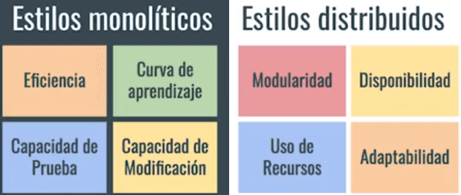
  <small>
Estilos Monolíticos vs Distribuídos
</small>

**Estilos Monolíticos**:

* Es más fácil darle prioridad a la eficiencia de las comunicaciones.
* Son más fáciles de probar.
* Curva de aprendizaje son más fáciles, todas las piezas están en el mismo lugar. (Los microservicios son fáciles de entender).
* La capacidad de modificación es más fácil.
* La modularización es más fácil de romper, por lo que es más fácil no garantizar esa separación a largo plazo.
* En la usabilidad, es mas costoso, porque habría que respaldar toda la aplicación y no pequeños microservicios.
* Puede ser un desafío para el despliegue, porque habría que garantizar que toda la aplicación o sistema se adapta a ese contexto específico.

**Estilos Distribuidos**:

* Es más fácil darle prioridad a la eficiencia de las comunicaciones.
* Para hacer una prueba de principio a fin hay que tener todos los componentes disponibles .
* La curva de aprendizaje es más difícil, porque habría que entender todas las piezas de los componentes.
* Al ser desplegadas independientemente, son versionadas independientemente, y esta variación de servidores hace mas complejo su modificación.
* La modularidad, es más fácil porque los componentes que son desplegados independiente.
* La disponibilidad se puede tener múltiples copias del sistema. por lo que este disponible es mas barato.
* La adaptabilidad es más fácil en el despliegue porque los componente se despliegan independientemente en múltiples contextos.

  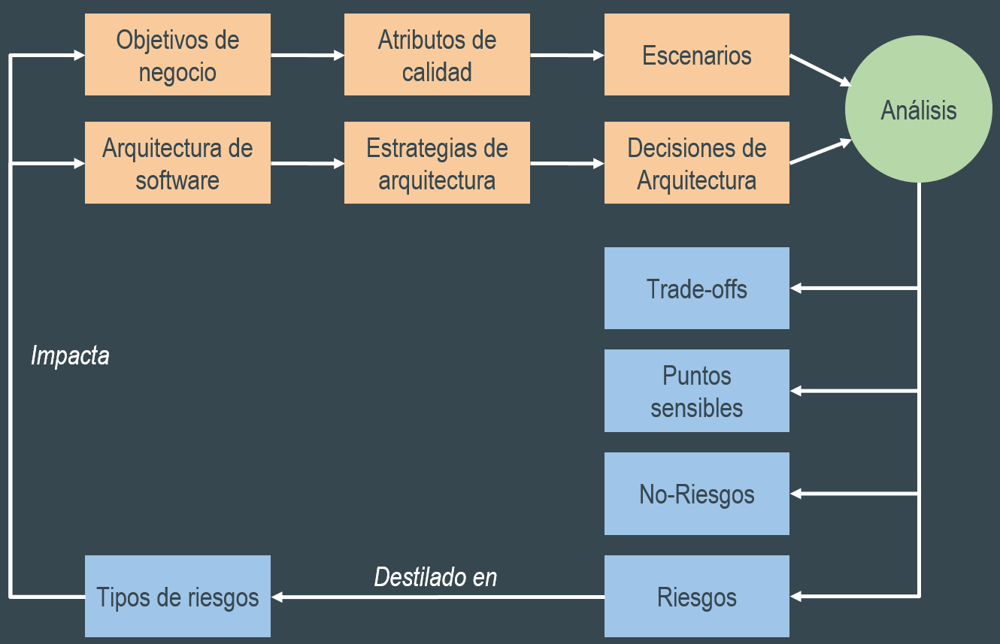
  <small>
Cómo Elegir Nuestra Arquitectura
</small>

Se debe de conectar los riesgos, restricciones y requerimientos para llegar a atributos de calidad y escenarios de arquitecturas. Esas herramientas nos van a permitir diseñar una arquitectura específica para nuestro problema. Luego se itera la arquitectura hasta llegar a encontrar la adecuada.

  <small><a href="#tabla-de-contenido">🡡 volver al inicio</a></small>

## Recursos Complementarios
* [Diapositiva 1: El proceso de desarrollo de software](docs/1-El-proceso-de-desarrollo-de-software.pdf)
* [Diapositiva 2: Introducción a la Arquitectura de Software](docs/2-Introduccion-a-la-Arquitectura-de-Software.pdf)
* [Diapositiva 3: Análisis de Requerimientos](docs/3-Analisis-de-Requerimientos.pdf)
* [Diapositiva 4: Estilos de Arquitectura](docs/4-Estilos-de-Arquitectura.pdf)
* [Diapositiva 5: Proyecto Platziservicios](docs/5-Proyecto-Platziservicios.pdf)

  <small><a href="#tabla-de-contenido">🡡 volver al inicio</a></small>

## Enlaces de Interés
* [Fundamentos de Arquitectura de Software](https://platzi.com/clases/arquitectura-software/)

  <small><a href="#tabla-de-contenido">🡡 volver al inicio</a></small>

