# Fundamentos de diseño<!-- omit in toc -->

## Tabla de Contenido<!-- omit in toc -->
- [¿Qué es el diseño?](#qué-es-el-diseño)
- [Principios del Diseño](#principios-del-diseño)
  - [Comunicación efectiva en el diseño](#comunicación-efectiva-en-el-diseño)
  - [¿Qué es el concepto?](#qué-es-el-concepto)
  - [Diseño universal](#diseño-universal)
  - [Diseño atemporal](#diseño-atemporal)
  - [Boceto](#boceto)
  - [Elementos Visuales](#elementos-visuales)
  - [Alineación](#alineación)
  - [Contraste](#contraste)
  - [Síntesis](#síntesis)
- [Composición](#composición)
- [Recursos Complementarios](#recursos-complementarios)
- [Enlaces de Interés](#enlaces-de-interés)

## ¿Qué es el diseño?

* El diseño es un puente entre la funcionalidad y estética.
* El diseño es la solución a un problema específico, representada de una manera gráfica.

  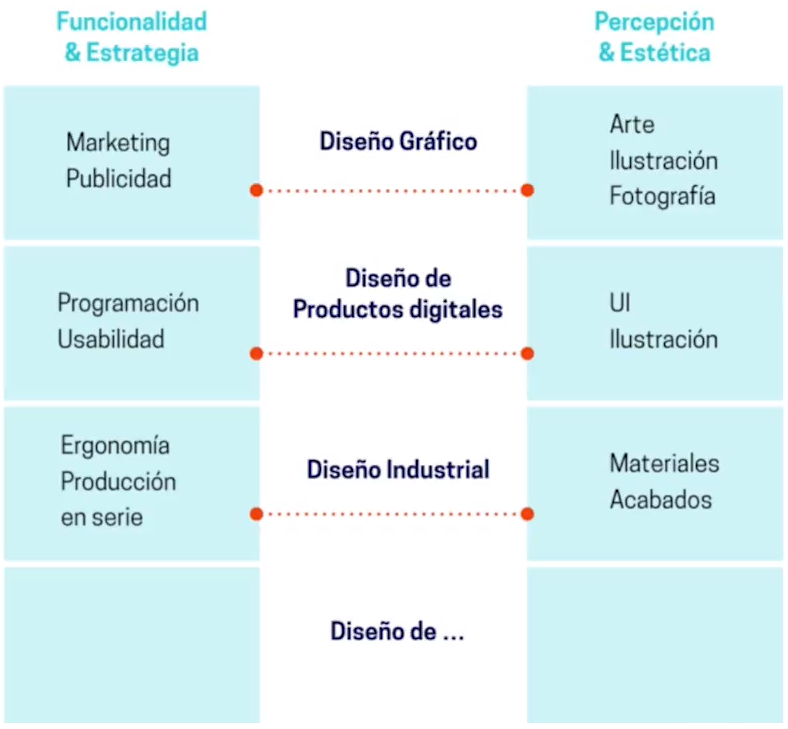

Existen diferentes ramas del diseño:
* Gráfico
* Industrial
* Moda
* Artesanal
* Editorial
* Interiores
* Interfaces

## Principios del Diseño

### Comunicación efectiva en el diseño

* La percepción visual es la relación que hacemos de lo que se está comunicando y la forma en la que lo vemos.
* El diseño tiene que tomar los códigos visuales para poder comunicar cosas que para la gente sea preciso y pueda relacionarlo con su entorno.

  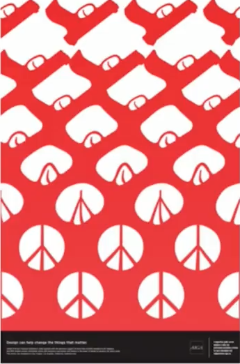
  <small>
Peace - Shigeo Fukuda
</small>

  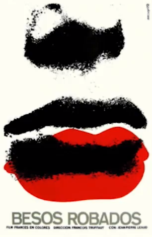
  <small>
Besos Robados - Rene Azuy
</small>

* El diseño nace por la necesidad de informar.
* El diseño está en todo lo que vemos.

  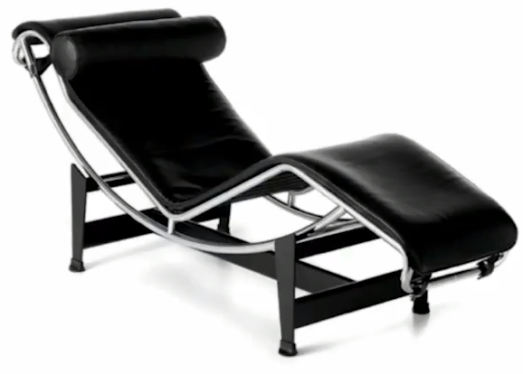
  <small>
Diseño Industrial - Le Corbusier
</small>

  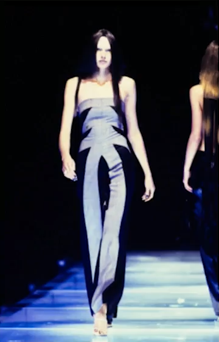
  <small>
Diseño de Modas - Alexander McQueen
</small>

  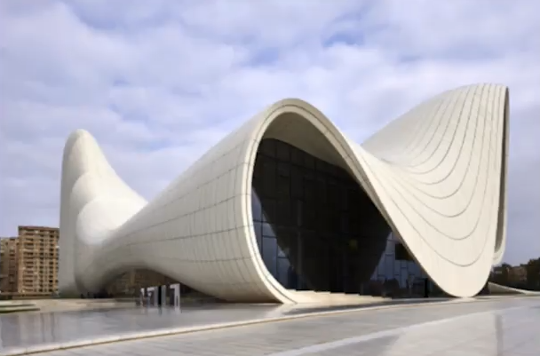
  <small>
Diseño de Arquitectura - Zaha Hadid
</small>

* El diseño pasó de ser visual a generarnos sensaciones, nos cambia la forma en la que percibimos ciertos entornos.
* El diseño es entender que la funcionalidad y la estética debe de tener un fin muy claro.

  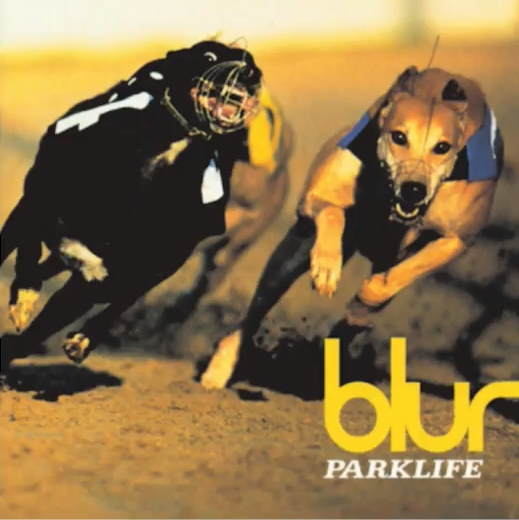
  <small>
Diseño Pop - Blur
</small>

### ¿Qué es el concepto?

* El concepto es el punto de partida para todo.
* El concepto es la historia que cuenta el diseño.
* El concepto es la representación tangible de una idea.
* Sin concepto, el diseño no puede cumplir su misión de comunicar.

  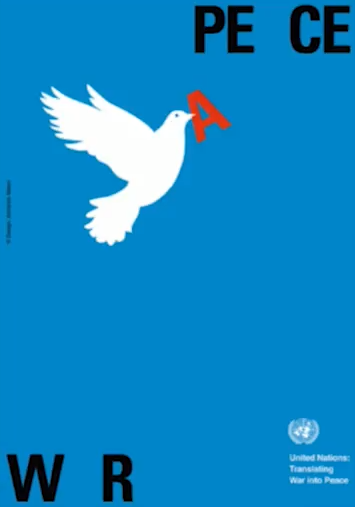
  <small>
War - Peace
</small>

  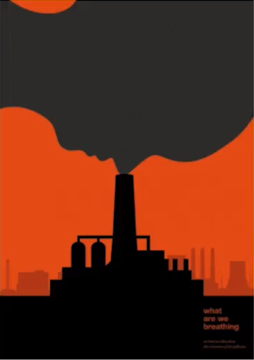
  <small>
What are we breathing?
</small>

  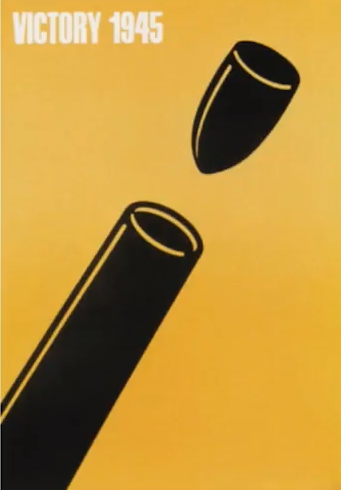
  <small>
Victory 1945
</small>

Para crear la narrativa del diseño:
* Conocer e investigar el tema
* Tomar los puntos más importantes
* Definir la comunicación visual

En el concepto se tiene la posibilidad de crear cualquier cosa.

  
  <small>
Isidro Ferrer - Objetos Irreales
</small>

  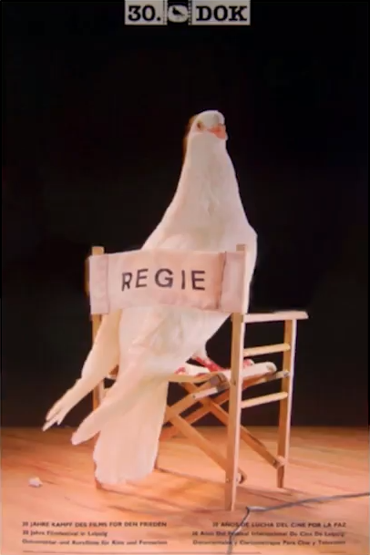
  <small>
Santiago Pol - Cine por la Paz
</small>

### Diseño universal

* El diseño universal debe comunicarnos algo sin necesidad de tener un sesgo cultural, geográfico o social.

  
  <small>
Diseño de Fogata - Se entiende en todo el mundo
</small>

* La señalética fue creada para comunicar necesidades muy específicas, por eso es funcional en cualquier parte del mundo y no está limitada culturalmente.

  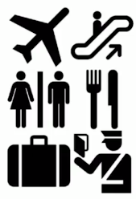
  <small>
Señales Universales
</small>

* El diseño universal es muy importante. Le da el sentido de pertenencia a la gente.

  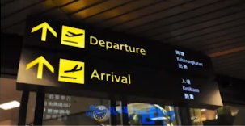
  <small>
El aeropuerto es un lugar donde se usan señales universales
</small>

### Diseño atemporal

* El diseño atemporal es aquel diseño que perdura en el tiempo.
* El diseño atemporal tenemos que tenerlo en cuenta a la hora de conceptualizar.
* Buscar un diseño preciso para no sentir que el diseño va a morir pronto. Además de que el diseño atemporal nos sirve para comunicar algo que puede ser distinto a nivel cultural, geográfico o social.

  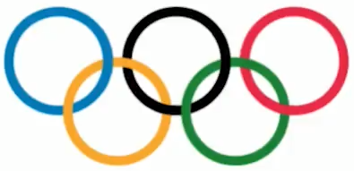
  <small>
El logo de las olimpiadas es el mismo desde 1912
</small>

  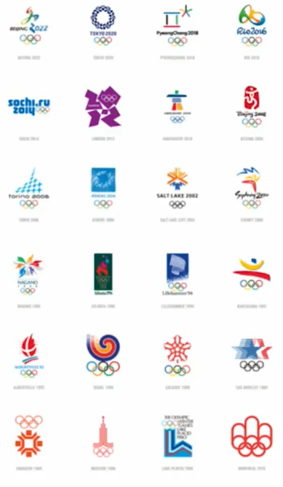
  <small>
El mismo logo se ha usado en todas las olimpiadas
</small>

### Boceto

* Este proceso tiene que estar presente en todas fases del diseño.
* Es la aproximación más real al diseño final, pues con él podemos probar distintas formas en las cuales podemos comunicar una idea.
* El diseño no debe tener improvisación, de ahí la necesidad de los bocetos.
* El boceto nos permite depurar ideas.
* El boceto nos sirve para encontrar el punto en el cual nos podemos sentir cómodos con la idea que queremos comunicar; que sea concisa y exacta.
* El boceto está presente también en el diseño de interfases, esto es para poder prototipar la funcionalidad de las aplicaciones antes de llevar el diseño a digital.

  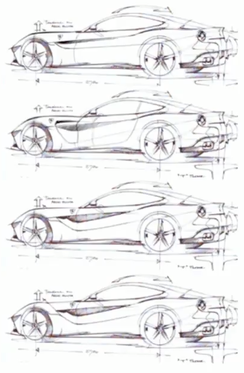
  <small>
Boceto de un Ferrari
</small>

### Elementos Visuales

**1.** Fotografía

  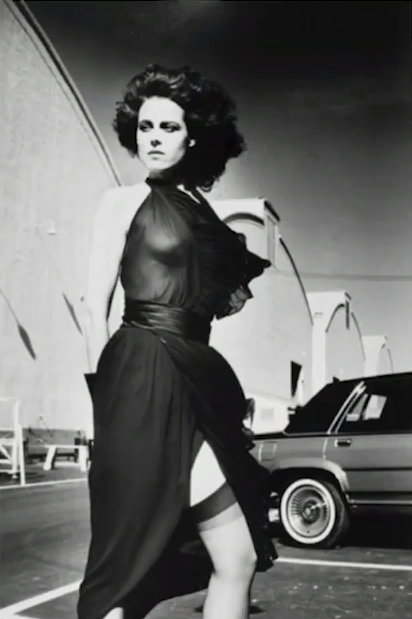

**2.** Ilustración

  

**3.** Tipografía

  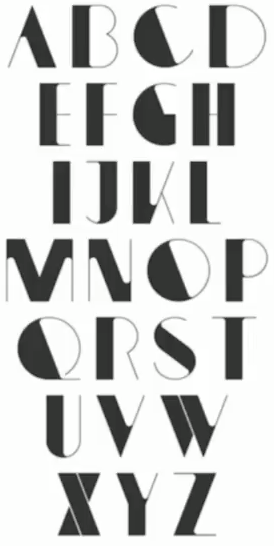

**4.** Color

  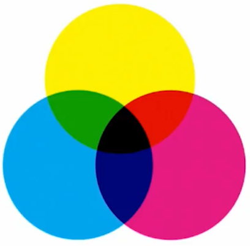

**5.** Líneas y puntos

  

**6.** Figuras geométricas

  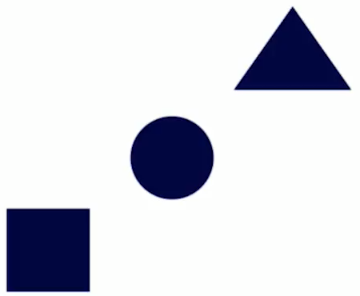

### Alineación

* La alineación crea un balance por peso natural, nos da la sensación de que hay equilibrio en el diseño.
* La alineación es para tener una mejor lectura y una mejor disposición en el espacio.
* Algo crucial en el diseño es la educación del ojo, debemos entrenarlo para poder observar los lineamientos que se necesitan o los que están de más.

  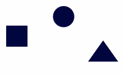
  <small>
Sin Alineación
</small>

  
  <small>
Con Alineación Horizontal
</small>

  
  <small>
Con Alineación Vertical
</small>

  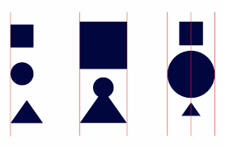
  <small>
Diferentes Tipos de Alineación
</small>

Este es un poster de Stranger Things en el cual se muestra un ejemplo de alineación.

  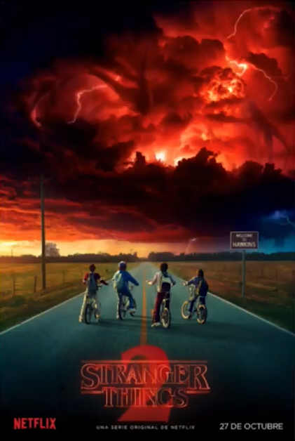
  <small>
Ejemplo: Alineación
</small>

### Contraste

Es la diferenciación visual de uno o varios elementos. Una diferenciación muy marcada.

**Tipos de contraste**:

1. El contraste a nivel de color. Es encontrar uno de esos puntos de diferenciación y se pueda hacer una composición en función de eso.

  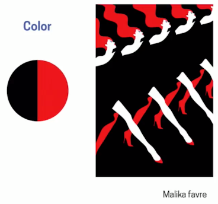
  <small>
Ejemplo: Contraste de Color
</small>

2. El contraste por forma.

3. El contraste por disposición. Cómo es la interacción por disposición de las formas.

  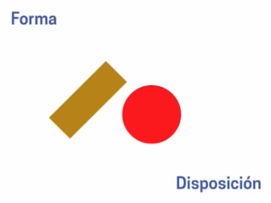
  <small>
Ejemplo: Contraste por Forma y Dispocisión
</small>

Ejemplo de combinación de constrastes

  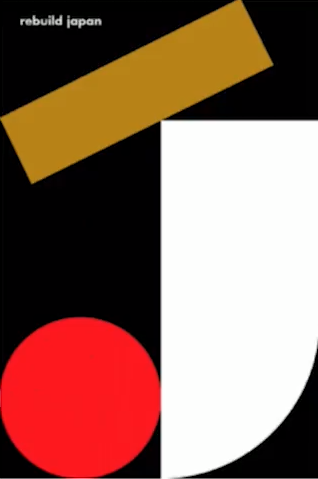
  <small>
Ejemplo: Contraste
</small>

### Síntesis

La síntesis es los puntos más precisos y conceptualizarlo en un idea.

La síntesis sirve para:
1. Optimizar el tiempo de lectura y de comunicacion
2. Es un buen recurso si no se domina la ilustración o fotografía.

Notas importantes:
* La síntesis no solamente se da en una representación gráfica.
* La síntesis abarca desde el concepto.
* El propósito de la síntesis es saber tomar los punto más precisos y poder simplificar todo en una idea muy clara.
* En la síntesis gráfica optimizamos tiempo de lectura y de comunicación.
* Es un buen recurso si no se domina la ilustración o fotografía.

  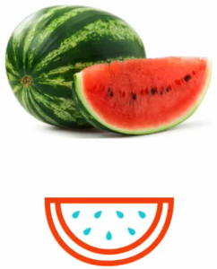
  <small>
Ejemplo: Síntesis de una Sandía
</small>

Sintesis grafica hace una sustraccion de esos elementos importantes y los lleva a la parte visual.

  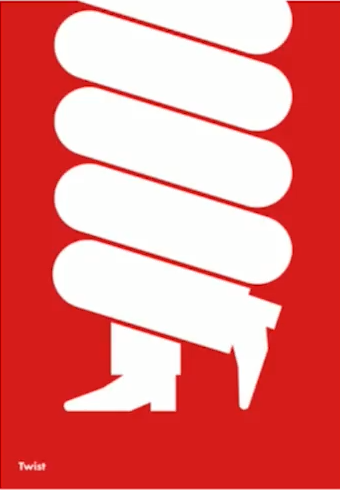
  <small>
Ejemplo: Síntesis Gráfica
</small>

  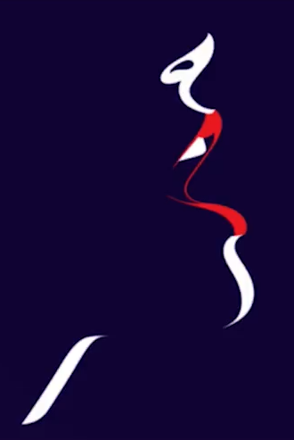
  <small>
Ejemplo: Síntesis Mancha
</small>

  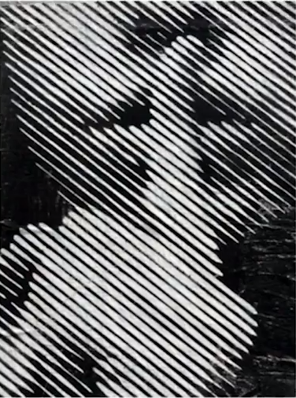
  <small>
Ejemplo: Síntesis Línea
</small>

La síntesis nos ayuda a comunicar con una lectura rápida: "pero bueno podiamos hacerle hecho la casita, las plantitas y quizas una ventanita y lo mejor los dedos le hacemos uñas". No es necesario. La sintesis grafica nos muestra que alli ya hay una casa tomada por unas manos. Ese es el concepto y no es el nivel de detalle que necesitamos.

  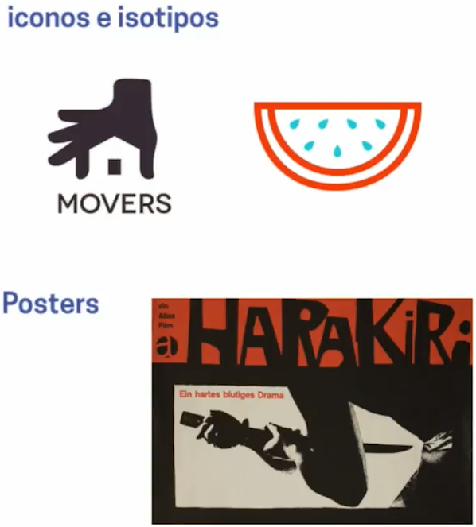
  <small>
Usos de Síntesis
</small>

## Composición

La composición gráfica es la disposición de los elementos dentro de un formato, el cual utilizamos para poder comunicar algo. Comparte en el sistema de discusiones imágenes en las que notas que la composición comunica perfecto el objetivo del diseño.

## Recursos Complementarios
* [Diapositivas del Curso](docs/fundamentos.pdf)
* [Diapositivas del Curso 2](docs/fundamentos2.pdf)
* [Ruta: Diseñador de Producto](docs/ruta-Carlos-Jimenez.jpg)
* [Ruta: Diseñador de Marca](docs/ruta-Emiro-Arrieta.jpg)

## Enlaces de Interés
* [Fundamentos de Diseño](https://platzi.com/clases/fundamentos-diseno/)