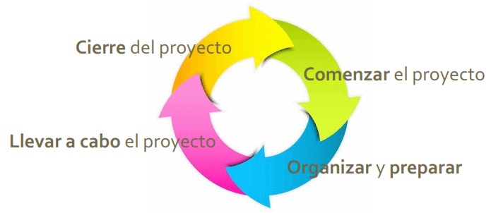
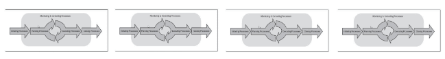
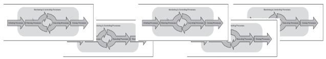
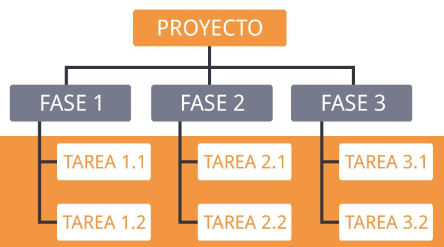
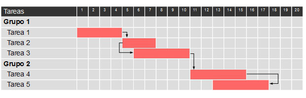
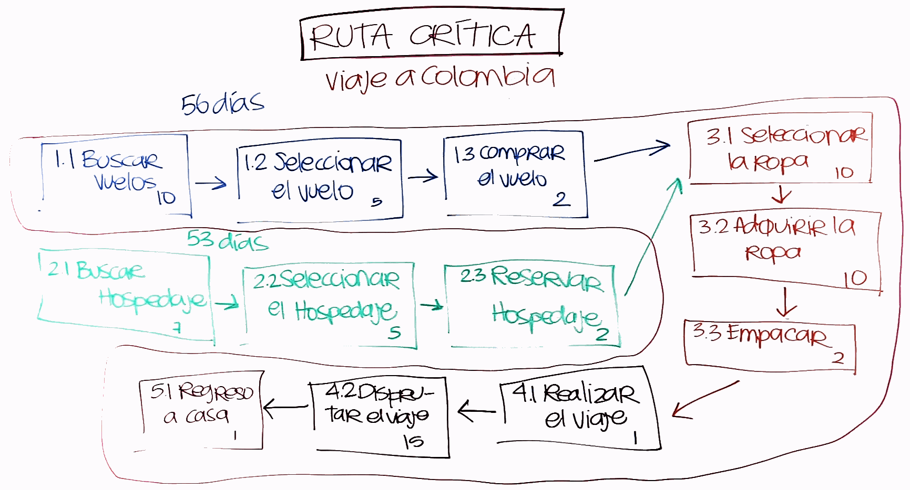

# Fundamentos de la Gestión de Proyectos<!-- omit in toc -->

## Tabla de Contenido<!-- omit in toc -->
- [Características de los Proyectos Exitosos](#características-de-los-proyectos-exitosos)
- [Qué es un Proyecto](#qué-es-un-proyecto)
- [Operaciones](#operaciones)
- [Gestor de Proyectos (Project Manager)](#gestor-de-proyectos-project-manager)
- [Principio de Triple Restricción](#principio-de-triple-restricción)
- [Grupo de Procesos de la Gestión de Proyectos](#grupo-de-procesos-de-la-gestión-de-proyectos)
- [Ciclo de Vida del Proyecto](#ciclo-de-vida-del-proyecto)
- [Tipos de Relaciones Fase a Fase](#tipos-de-relaciones-fase-a-fase)
- [Alcance del Proyecto](#alcance-del-proyecto)
- [Acta de Constitución de un Proyecto (Proyect Charter)](#acta-de-constitución-de-un-proyecto-proyect-charter)
- [Propósito del Acta de Constitución](#propósito-del-acta-de-constitución)
- [Identificar Interesados](#identificar-interesados)
- [Cronograma](#cronograma)
  - [Estructura de Desglose de Trabajo (WBS)](#estructura-de-desglose-de-trabajo-wbs)
  - [Cronograma de Proyecto](#cronograma-de-proyecto)
  - [Estimación de Tiempo de Actividades](#estimación-de-tiempo-de-actividades)
- [Ruta Crítica](#ruta-crítica)
- [Gestión de Compras](#gestión-de-compras)
- [Gestión de la Calidad](#gestión-de-la-calidad)
- [Base del Proyecto (Baseline)](#base-del-proyecto-baseline)
- [Seguimiento y Control](#seguimiento-y-control)
- [Gestión de Cambios](#gestión-de-cambios)
  - [Control de Cambios](#control-de-cambios)
- [Gestión de Riesgos](#gestión-de-riesgos)
  - [Oportunidades](#oportunidades)
  - [Amenazas](#amenazas)
- [Mejora Continua](#mejora-continua)
- [Gestión de la Comunicación](#gestión-de-la-comunicación)
- [Cierre del Proyecto](#cierre-del-proyecto)
- [Lecciones Aprendidas](#lecciones-aprendidas)
- [Recursos Complementarios](#recursos-complementarios)
- [Enlaces de Interés](#enlaces-de-interés)

## Características de los Proyectos Exitosos 

Ten en cuenta que para que tengamos éxito en un proyecto debemos tener:

* **Objetivos**: Tenerlos bien definidos
* **Roles y Responsabilidad**: Bien definidos en cada individuo y puesto
* **Comunicación**: Clara y abierta. No solo entre el equipo de trabajo sino con el cliente al que se enfoca el proyecto, trabajo, etc.
* **Toma de decisiones**: Debe ser de manera rapida y efectiva.
* Participación: Entre todos las personas del equipo involucradas y de interes no solo el dueño o encargado como se suele pensar.
* **Diversidad**: Referente a sexo, edades y demás.
* **Gestión de conflictos**: Se evitan los conflictos y se crea una atmósfera positiva evitando los problemas que pasan del ámbito personal al laboral y viceversa.
* **Relaciones cooperativas**: Todos apoyan en el proyecto.
* **Liderazgo participativo**: Parte clave de todo el proyecto y siempre está participando con el equipo.

Características de los proyectos fallidos:
* **Preparación deficiente**: Pésima programación o nula planificación.
* **Documentación y Seguimiento inadecuados**: Tanto en tiempo como en en forma.
* **Fracaso en la definición de parámetros**: Si no hay parámetros ni límites pueden haber N infinidad de cambios y todos se autorizan.
* **Gestores de proyectos inexpertos**: No quieran aplicar la metodología necesaria para administrar un proyecto.
* **Desalineción cultural o ética**: Una parte del equipo está persiguiendo unos objetivos y otra parte otros. Nunca llegan a un fin comun ni un bien para todos.
* **Estimaciones de costos inexactas**: Estimación de presupuesto insuficiente.
* **Poca comunicación entre interesados y miembros del equipo**: Crea dudas entre qué es lo que se va a hacer y cómo se debe de hacer.
* **Prioridades competitivas**: Cada miembro del equipo no puede tener prioridades diferentes al resto.
* **No tomar en cuenta las señales de advertencia de fracaso**: Por ejemplo, exceder el presupuesto, muchos cambios, desconexion entre el patrocinador, interesado y equipo.
* **Mal liderazgo**

  <small><a href="#tabla-de-contenido">🡡 volver al inicio</a></small>

## Qué es un Proyecto

* Un esfuerzo temporal con la idea de alcanzar un resultado o un producto.
* La naturaleza temporal indica que tiene un principio y fin.
* El final se alcanza cuando hemos llegado a cumplir los objetivos del proyecto, satisfecho las necesidades de los interesados o cuando ya no está dando nuevos resultados.
* Su obejetivo es alcanzar las metas y conluir con los esfuerzos.

**Un proyecto puede crear**:
* **Producto**: que sea un componente de otro, una mejora a un producto, o uno nuevo.
* **Servicio**: o competencia para realizar un servicio.
* **Mejora**: a un producto o servicio existente.
* **Resultado**: tal como un documento.

**Características**:
* Único.
* Por naturaleza es temporal, con fechas de inicio y fin.
* Estos completados cuando sus objetivos son alcanzados o se determina que el proyecto ya no es viable.
* Un proyecto exitoso es aquel que cumple con las expectativas de los interesados.

  <small><a href="#tabla-de-contenido">🡡 volver al inicio</a></small>

## Operaciones

Son continuas y repetitivas

* Trabajo continuo.
* No tienen fehca de finalización.
* Procesos que Producen el mismo resultado constantemente
* Las operaciones mantienen a la organización funcionando

**Nota**: normalmente en el ámbito laboral cuando se crea un proyecto y se finaliza la parte de la finalización incluye hacer un handover o entrega de ese producto/servicio/resultado creado a las operaciones para que las operaciones pueden trabajar en eso.

  <small><a href="#tabla-de-contenido">🡡 volver al inicio</a></small>

## Gestor de Proyectos (Project Manager)

Es la persona que tiene la responsabilidad total de la plafinicación y la ejecución acertada de cualquier proyecto. Además es responsable de alcanzar los objetivos del proyecto.

**Las habilidades son**:

* **Comunicación**: el 80% del tiempo de un PM es dedicado a comunicar el progreso, avance, estado del trabajo y entregables tanto hacia adentro del equipo como hacia los interesados como están siendo satisfechas sus necesidades.

* **Organizativas y planificación**: más del 60% de las actividades de gestión de proyectos son dedicadas a planificar.

* **Manejo de conflictos**: Naturalmente los RRHH siempre están en conflictos como intereses, con el patrocinador del proyecto o dentro del equipo.

* **Negocicación e influencia**: Saber convencer o influenciar a los implicados que sugieran cambios o modificaciones que no sean posibles o positivas.

* **Liderazgo**: en muchas ocasiones no vamos a ser los líderes jerárquicos de nuestro equipo de proyecto pero debemos representar nuestra autoridad.

* **Trabajo en equipo y motivadoras**: debemos de motivar a nuestro equipo para alcanzar las metas.

* **Toma de decisiones**: va de la mano con las habilidades de comunicación.

* **Conciencia política y cultural**: no siempre vamos a estar trabajando para gente que tiene nuestra misma idiosincrasia y esto no debe influir en el proyecto.

* **Confianza**: fomentar confianza entre los miembros del equipo y hacia los grupos de interesados.

* **Coaching**: habilidades de liderazgo hacia las personas de nuestro equipo.

**Competencias**:

* **Conocimiento**: sobre toda la metodología de la gestión de proyecto para su correcta gestión, administración, dirección y ejecución de un proyecto.

* **Desempeño**: referente a que éste sea capaz de aplicar su conocimiento de la metodología de la gestión de proyectos, ser capaz de poner en práctica nuestros conocimientos.

* **Personal**: Referente a cómo se comporta al momento de realizar las actividades relacionadas al proyecto, La efectividad personal abarca las actitudes, las características centrales de la personalidad y las habilidades de liderazgo.

  <small><a href="#tabla-de-contenido">🡡 volver al inicio</a></small>

## Principio de Triple Restricción

Es un triangulo con las tres restricciones principales que tienen todos los proyectos. Siempre una va a ser de mayor prioridad que las demás.

* **Alcance**: Qué requerimientos van en el proyecto y cuáles que no.
* **Tiempo**.
* **Presupuesto**: Monto máximo de gastos.

Siempre uno de estos tres debe determinar la limitante principal del proyecto y debe ser definida al princpio del proyecto.

Otras restricciones a tener en cuenta son:
* **Calidad**: del producto servicio.
* **Recursos**: humanos, materiales, tecnologicos.
* **Riesgos**: desastres naturales, multas.

  <small><a href="#tabla-de-contenido">🡡 volver al inicio</a></small>

## Grupo de Procesos de la Gestión de Proyectos

* **Iniciación** → Reconoce la existencia de un proyecto, así como la existencia de una nueva fase y el comienzo de ésta.
* **Planificación** → Es el proceso de formulación y revisión de las metas y objetivos del proyecto.
* **Ejecución** → Implica la puesta en práctica de lo planificado.
* **Monitoreo y Control** → Es donde se mide el 
rendimiento del proyecto para determinar si el
proyecto sigue manteniéndose fiel al alcance y los
objetivos.
* **Cierre** → Realizar el cierre formal y ordenado de todas las actividades planificadas y ejecutadas.

  <small><a href="#tabla-de-contenido">🡡 volver al inicio</a></small>

## Ciclo de Vida del Proyecto

* El ciclo de vida de un proyecto es la serie de fases por las que pasa un proyecto de inicio a fin.
* Generalmente, las fases son secuenciales. La numeración y el nombre de éstas serán determinadas por las necesidades de control de la gestión de la organización involucrada en el proyecto, la naturaleza de éste y su área de aplicación. 
* Todos los proyectos se pueden mapear a la siguiente estructura de ciclo de vida:

  
  <small>
Ciclo de Vida de un Proyecto
</small>

  <small><a href="#tabla-de-contenido">🡡 volver al inicio</a></small>

## Tipos de Relaciones Fase a Fase 

* **Relaciones secuenciales** → Una fase debe de
finalizar antes de que pueda comenzar la siguiente.

  
  <small>
Relaciones Secuenciales
</small>

* **Relaciones superpuestas** → Una fase puede
comenzar antes de que se complete la anterior.

  
  <small>
Relaciones Superpuestas
</small>

  <small><a href="#tabla-de-contenido">🡡 volver al inicio</a></small>

## Alcance del Proyecto

* El alcance del proyecto define el trabajo que deberá ser completado durante el proyecto.
* Describe qué se logrará con el proyecto.
* Define el producto/servicio/entregable final que se entregará al cliente en un punto determinado en el tiempo y con un costo específico.
* Además, define los límites del trabajo, lo que ayuda en la evaluación de lo que es y no es parte del esfuerzo requerido.

  <small><a href="#tabla-de-contenido">🡡 volver al inicio</a></small>

## Acta de Constitución de un Proyecto (Proyect Charter)

* Es una declaración formal del alcance, objetivos y participantes del proyecto. 
* Además de proporcionar una delineación preliminar
de los roles y responsabilidades, así como describir los objetivos del proyecto. 
* En éste, se identifica a los interesados y define la autoridad del gestor del proyecto. 

  <small><a href="#tabla-de-contenido">🡡 volver al inicio</a></small>

## Propósito del Acta de Constitución

El propósito es documentar:
* Razones para emprender el proyecto
* Objetivos y limitaciones del proyecto
* Instrucciones para la solución
* Identidades de los interesados
* Definir qué está dentro y fuera del alcance
* Riesgos identificados
* Beneficios
* Presupuesto

  <small><a href="#tabla-de-contenido">🡡 volver al inicio</a></small>

## Identificar Interesados

* Los interesados son todas aquellas personas, grupos u organizaciones que podrían ser beneficiados/impactados por una decisión, actividad o resultado del proyecto.
* Es necesario e importante analizar y documentar toda la información relevante con respecto a sus intereses, participación, influencia e impacto potencial en el éxito del proyecto.

  <small><a href="#tabla-de-contenido">🡡 volver al inicio</a></small>

## Cronograma

### Estructura de Desglose de Trabajo (WBS)

  
  <small>
Ejemplo: WBS
</small>

* Consiste en la descomposición jerárquica del trabajo a ser ejecutado por el equipo del proyecto.
* Cada nivel descendente del WBS representa una definición a detalle incrementado del trabajo del proyecto.
* Su propósito es organizar y definir el alcance aprobado, según lo declarado en el acta de constitución. 
* La forma jerárquica permite una mejor identificación de los elementos finales o paquetes de trabajo.
* Es recomendable que el WBS sea lo suficientemente detallada para poder asignar una parte del trabajo a un tercero (3-4 niveles de profundidad; 5-9 elementos de ancho)

  <small><a href="#tabla-de-contenido">🡡 volver al inicio</a></small>

### Cronograma de Proyecto

* Es el documento que muestra ordenadamente las diferentes actividades e hitos que formal el
proyecto.
* Además de mostrar las relaciones de precedencia y antecedencia de éstas, su duración, así como el inicio y fin del proyecto.
* El cronograma de Gantt es el más utilizado en la gestión de proyectos. Éste es la representación de las tareas en forma de barras sobre un eje temporal, donde la longitud de ésta muestra la duración de la actividad. 

  
  <small>
Ejemplo: Diagrama de Gantt
</small>

  <small><a href="#tabla-de-contenido">🡡 volver al inicio</a></small>

### Estimación de Tiempo de Actividades

* Este proceso ayuda en la estimación del número de periodos de trabajo necesarios para completar las actividades individuales.
* A través de ésta, se proporciona la cantidad de tiempo que tomará completar cada actividad.
* El método más utilizado para el cálculo de la duración es el de la **Estimación de 3 puntos**. En esta técnica se obtiene un valor estimado a partir del cálculo de los siguientes valores:
  * Pesimista (P) → Duración en el peor caso.
  * Más Probable (Mp) → Caso más esperado de la 
duración.
  * Optimista (O) → Duración en el mejor de los casos.

**Estimación = (P + 4 Mp + O) / 6**

  <small><a href="#tabla-de-contenido">🡡 volver al inicio</a></small>

## Ruta Crítica

* Es la secuencia de actividades con la mayor duración entre ellos. 
* La duración de la ruta crítica, determina la duración total del proyecto entero.
* Cualquier retraso en un elemento de ésta, afecta la fecha de término planeada del proyecto.
* No existe holgura en la ruta crítica.

  
  <small>
Ejemplo: Ruta Crítica
</small>

  <small><a href="#tabla-de-contenido">🡡 volver al inicio</a></small>

## Gestión de Compras

* En ocasiones se tiene que analizar si es más rentable comprar bienes/servicios/productos o hacerlos. 
* Si se decide recurrir a la compra, es necesario
seleccionar al mejor proveedor. 
* Para seleccionar al mejor proveedor, será necesario recibir ofertas de varios, para poder compararlas y elegir cuál o cuáles son los más aptos para realizar el trabajo. 

  <small><a href="#tabla-de-contenido">🡡 volver al inicio</a></small>

## Gestión de la Calidad

* "La definición de calidad del cliente es la única que importa“, J. Edward Demings
* De acuerdo con la Sociedad Americana de Calidad
(ASQ), calidad se define como todas aquellas
acciones planificadas o sistemáticas necesarias para proporcionar la confianza adecuada de que un servicio/producto satisfará las necesidades dadas.
* Es importante que el gestor de proyectos identifique los requisitos y/o estándares de calidad del proyecto y sus entregables. 

  <small><a href="#tabla-de-contenido">🡡 volver al inicio</a></small>

## Base del Proyecto (Baseline)

* Se define con el alcance original, el presupuesto y el cronograma. 
* Esta debe de ser completamente definida antes de qué se empiece a ejecutar el proyecto.
* La base del proyecto se utiliza para medir el progreso y rendimiento del mismo, así como para identificar desviaciones del plan original.
* De aprobarse algún cambio, es importante modificar y redefinir la base del proyecto.

  <small><a href="#tabla-de-contenido">🡡 volver al inicio</a></small>

## Seguimiento y Control

* Establece el conjunto de acciones que se llevarán a cabo para la comprobación de la correcta ejecución de las actividades del proyecto establecidas en la planificación del mismo. 
* Su propósito es proporcionar un entendimiento del progreso del proyecto de forma que se puedan tomar las acciones correctivas apropiadas cuando la ejecución del proyecto se desvíe significativamente de su planificación.

  <small><a href="#tabla-de-contenido">🡡 volver al inicio</a></small>

## Gestión de Cambios

* El cambio es inevitable en todos los proyectos.
* Sin embargo, se debe de seguir un proceso formal para una gestión efectiva.
* Cualquier interesado puede solicitar un cambio, pero no cualquiera puede autorizarlo.
* Los cambios pueden impactar al alcance general del proyecto, actividades específicas, a los procesos, estructuras, o incluso a los recursos.

  <small><a href="#tabla-de-contenido">🡡 volver al inicio</a></small>

### Control de Cambios

* Todo proyecto es susceptible a sufrir cambios.
* Para que este proceso sea efectivo, es necesario realizar un control integrado de cambios del proyecto. Desde la supervisión de las solicitudes, aprobación/negación de los cambios y la gestión
de estos.
* Los cambios pueden ser solicitados por cualquier parte interesada del proyecto.
* El comité de control de cambios (CCB) es el encargado de aprobar/rechazar estos.

  <small><a href="#tabla-de-contenido">🡡 volver al inicio</a></small>

## Gestión de Riesgos

Los riesgos son un evento o una condición incierta que, si ocurre, puede tener un efecto positivo (oportunidades) o negativo (amenazas) en uno o más de los objetivos del proyecto.

  <small><a href="#tabla-de-contenido">🡡 volver al inicio</a></small>

### Oportunidades

¿Cómo gestionar las oportunidades?
* **Explotar** → Asegurarse que la oportunidad suceda.
* **Realzar** → Aumentar la probabilidad e impactos.
* **Compartir** → Transferir a un tercero quién será capaz de aprovecharla mejor.
* **Aceptación** → Tomar ventaja de la oportunidad.

  <small><a href="#tabla-de-contenido">🡡 volver al inicio</a></small>

### Amenazas

¿Cómo gestionar las amenazas?
* **Evasión** → Eliminarla
* **Transferencia** → Transfiere el impacto a un tercero (Ejemplo: una empresa de seguros)
* **Mitigación** → Reducir las probabilidades que suceda
* **Aceptación** → Ser consciente de la amenaza y no tomar acciones

  <small><a href="#tabla-de-contenido">🡡 volver al inicio</a></small>

## Mejora Continua

* La mejora es la creación organizada de un cambio beneficioso. 
* Por lo tanto, mejora continua es una actividad recurrente con el propósito de aumentar la capacidad para cumplir los requisitos.
* Su ciclo es: planificar, hacer, verificar, actuar (PDCA).

  <small><a href="#tabla-de-contenido">🡡 volver al inicio</a></small>

## Gestión de la Comunicación

* Un gestor de proyectos invierte >80% de su tiempo
en comunicar.

* Para que la gestión de la comunicación sea efectiva y eficiente es necesario conocer las necesidades de
información de cada interesado.

* Es importante tomar en cuenta lo siguiente:
  * **Quién** necesita qué información, y quién está
  autorizado a accederla
  * Para **cuándo** necesitan la información
  * **Dónde** debería ser guardada la información
  * En **qué** formato debería de ser guardada
  * **Cómo** se puede acceder a la información

* El modelo de comunicación es utilizado para facilitar el intercambio de información, aunque puede variar de proyecto en proyecto, los pasos son los mismos:
  1. **Codificar**: el emisor (gestor de proyectos) debe de identificar a quién va dirigido el mensaje para codificarlo más fácil.
  2. **Transmitir el mensaje**: puede ser de manera oral o escrita.
  3. **Descodificar**: el receptor recepciona el mensaje.
  4. **Reconocer**: se reconoce que se está recibiendo el mensaje.
  5. **Retroalimentar**: hacerle saber al emisor que se ha recibo y entendido el mensaje y se da una respuesta.

* Los métodos de comunicación se clasifican en:
  * **Comunicación Push**: Es aquella información que el gestor de proyectos envía a una lista de distribución. Ejemplo: los informes.
  * **Comunicación Pull**: Es esa información que es guardada en un repositorio a la cual cualquier receptor puede acceder.

  <small><a href="#tabla-de-contenido">🡡 volver al inicio</a></small>

## Cierre del Proyecto

* Una vez que se han ejecutado y aceptado, por parte del cliente, todos los entregables, procedemos a realizar el cierre del proyecto.
* Ésta es la última de las etapas de la gestión de proyectos, y aplica para el proyecto en general, como para cada una de las fases.
* El cierre es importante por las siguientes razones:
  * Certifica y oficializa que se ha cumplido con el alcance y objetivos.
  * Libera a todos los miembros del equipo del proyecto.
  * Supone el cierre administrativo y financiero de todos los compromisos y derechos adquiridos por el proyecto.

  <small><a href="#tabla-de-contenido">🡡 volver al inicio</a></small>

## Lecciones Aprendidas

* Ser capaz de documentar las lecciones aprendidas una vez que un proyecto ha llegado a su fin es una de las mayores responsabilidades del gestor de proyectos. 
* De esta información dependerá alcanzar un buen nivel de comprensión de los propios errores, muy necesario para proyectos futuros, y única forma de evitar que se repitan los mismos fallos una y otra vez. 
* Éstas deben de documentar e incluir:
  * Errores cometidos.
  * Riesgos a los que el proyecto se vio expuesto.
  * Decisiones que funcionaron mejor.
  * Procesos y técnicas que más eficiencia y efec.tividad 
  aportaron.

  <small><a href="#tabla-de-contenido">🡡 volver al inicio</a></small>

## Recursos Complementarios
* [Diapositivas del Curso](docs/Fundamentos-Proyectos.pdf)

  <small><a href="#tabla-de-contenido">🡡 volver al inicio</a></small>

## Enlaces de Interés
* [Fundamentos de la Gestión de Proyectos](https://platzi.com/clases/pmi)

  <small><a href="#tabla-de-contenido">🡡 volver al inicio</a></small>

